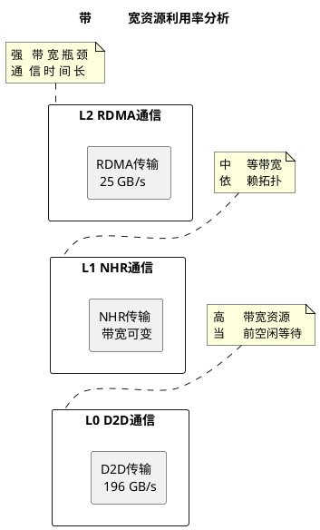
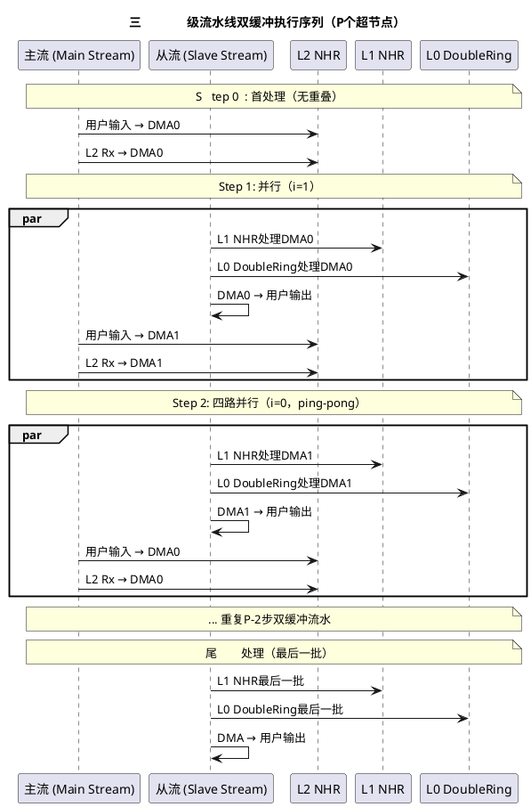
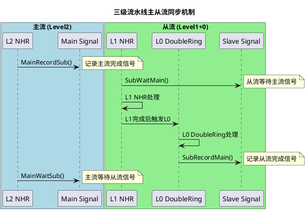
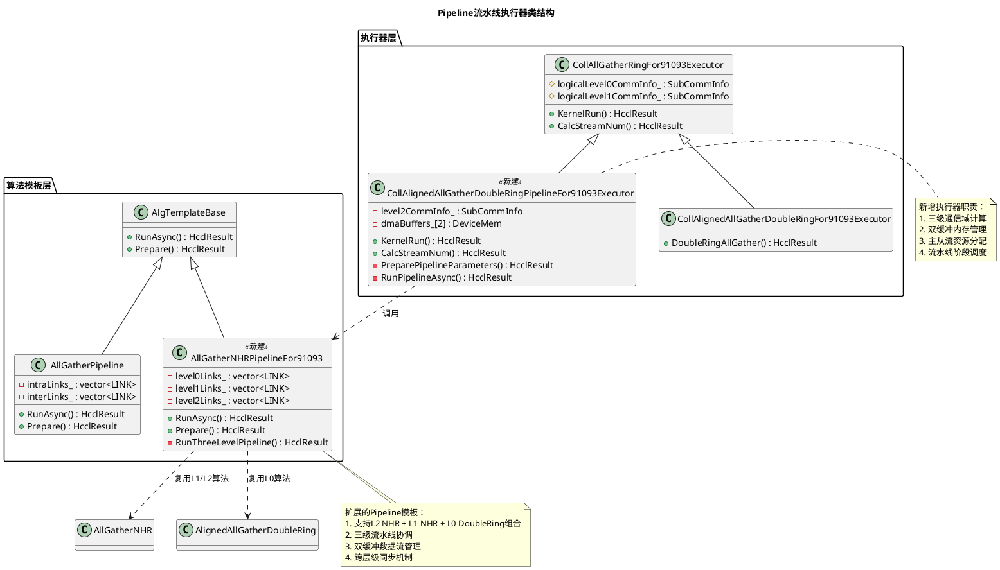
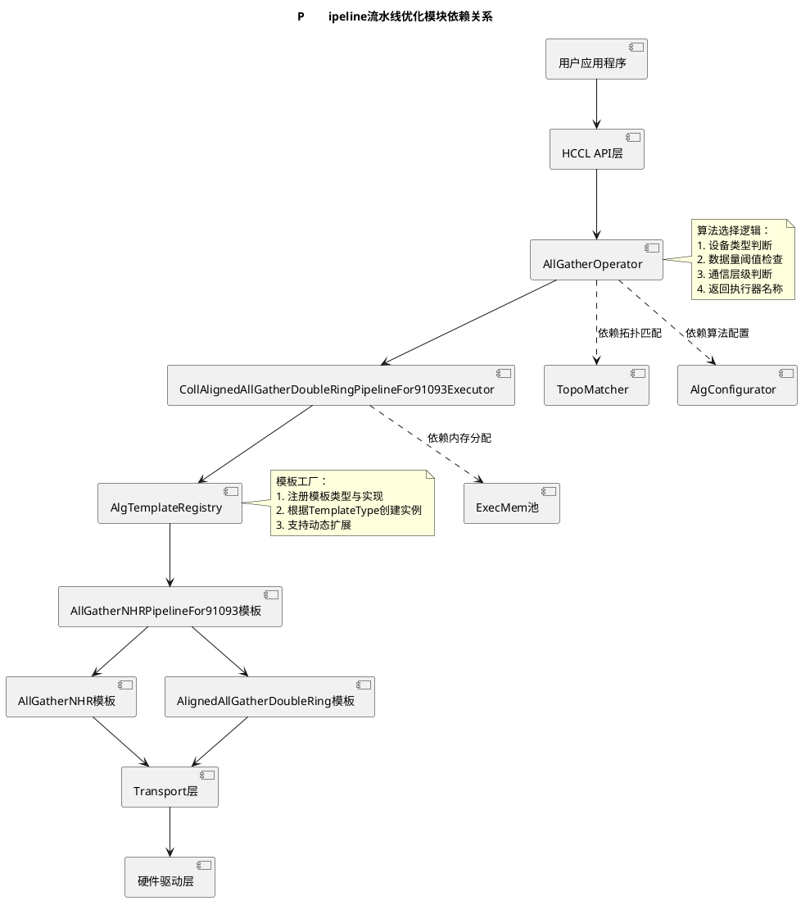

# 需求分析-SRS

## AllGather算子在A3集群上支持Pipeline流水优化算法

### 介绍

#### 背景
A3集群（DEV_TYPE_910_93）采用三级网络拓扑结构：
- **L0层**：单服务器内8卡（16 DIE）范围，D2D互联带宽双向392 GB/s，单向196 GB/s
- **L1层**：超节点内48台服务器范围，使用NHR（Non-uniform Hierarchical Ring）算法
- **L2层**：跨超节点范围，RDMA互联带宽双向400 Gb/s（约50 GB/s）

**关键约束**：
- `AlignedAllGatherDoubleRing`模板仅负责L0 DoubleRing算法实现，不承担L1/L2层通信编排
- L1层AllGather统一使用NHR算法
- L2层AllGather统一使用NHR算法
- Pipeline 流水并行算法组合：L2 NHR + L1 NHR + L0 DoubleRing

现有实现中，`CollAllGatherRingFor91093Executor::KernelRun()`（[coll_all_gather_ring_for_910_93_executor.cc:277](hcomm/src/algorithm/impl/coll_executor/coll_all_gather/coll_all_gather_ring_for_910_93_executor.cc#L277)）以**串行方式**依次执行L2→L1→L0，导致L2通信期间L0/L1高带宽资源空闲。

#### 目标
1. 保持现有算法职责边界（L0 DoubleRing，L1 NHR，L2 NHR）
2. 新增Pipeline流水并行算法，实现**L2 NHR通信与L0/L1处理的重叠执行**
3. 通过三级流水线（L2 NHR + L1 NHR + L0 DoubleRing）提升整体吞吐量
4. 评估性能收益的数据量区间，确定`ALLGATHER_PIPELINE_THRESHOLD`阈值

### 输入

#### 算子参数-(AllGatherOperator)
- **输入数据指针**：`void* inputPtr`（用户输入内存地址）
- **输出数据指针**：`void* outputPtr`（用户输出内存地址）
- **数据描述**：`u64 count`（元素数量）、`HcclDataType dataType`（数据类型）
- **工作流模式**：`HcclWorkflowMode workflowMode_`（单算子模式或图模式）

封装在`OpParam`里

#### 通信域信息-(AllGatherPipeline)
- **三级通信组**：`SubCommInfo`结构体，包含L0/L1/L2各层的`localRank`、`localRankSize`、`links`信息
- **拓扑信息**：`TopoType topoType_`（拓扑类型）、`u32 superPodNum_`（超节点数量）
- **算法类型配置**：`AlgType algType_`（算法层级配置）

#### 触发条件
- **设备类型**：`DEV_TYPE_910_93`（A3集群）
- **数据量阈值**：`dataSize >= ALLGATHER_PIPELINE_THRESHOLD`（待校准）
- **通信层级**：`level2RankSize > 1`（L2跨超节点通信）
- **算法配置**：算法选择器（`AllGatherOperator::SelectAlgfor91093()` [all_gather_operator.cc:266](hcomm/src/algorithm/impl/operator/all_gather_operator.cc#L266)）判断满足Pipeline条件

### 处理

#### 核心算法组合
| 层级 | 算法 | 执行器调用 | 模板实现 |
|------|------|------------|----------|
| L2（跨超节点） | NHR | `AllGatherOperator`选择 | `AllGatherNHR::RunAsync()` [all_gather_nhr.cc:16](hcomm/src/algorithm/base/alg_template/temp_all_gather/all_gather_nhr.cc#L16) |
| L1（超节点内） | NHR | `CollAllGatherRingFor91093Executor`编排 | `AllGatherNHR::RunAsync()` |
| L0（服务器内） | DoubleRing | `CollAlignedAllGatherDoubleRingFor91093Executor::DoubleRingAllGather()` [coll_aligned_all_gather_double_ring_for_910_93_executor.cc:23](hcomm/src/algorithm/impl/coll_executor/coll_all_gather/coll_aligned_all_gather_double_ring_for_910_93_executor.cc#L23) | `AlignedAllGatherDoubleRing::RunAsync()` [aligned_all_gather_double_ring.cc:15](hcomm/src/algorithm/base/alg_template/temp_all_gather/aligned_all_gather_double_ring.cc#L15) |

#### 流水线执行机制
**双缓冲乒乓（ping-pong）流水线**：
1. **并行四路**：每步同时执行以下操作
   - **主流**：用户输入 → DMA缓冲[i]；L2 NHR Rx → DMA缓冲[i]
   - **从流**：L1 NHR处理DMA缓冲[1-i]；L0 DoubleRing处理DMA缓冲[1-i]；DMA缓冲[1-i] → 用户输出
2. **缓冲区切换**：`i = step % 2`，交替使用DMA0/DMA1双缓冲
3. **层级串行**：同一步内，L1 NHR完成后执行L0 DoubleRing（L1→L0串行）

#### 数据流控制
- **数据切片**：`Slice`结构体（`offset`、`size`）描述内存分片
- **流资源管理**：`CalcStreamNum()`计算所需流数量，支持并发执行
- **主从流同步**：`MainRecordSub()`、`SubWaitMain()`等信号机制协调流水线阶段

### 输出

#### 计算结果
- **输出数据**：AllGather操作结果，各rank数据按rank顺序拼接
- **内存布局**：输出缓冲区中，每个rank的数据位于固定偏移位置
- **完成状态**：`HcclResult`返回码，指示操作成功或失败原因

#### 副作用
- **内存占用**：新增双缓冲CCL内存（DMA0/DMA1），增加`ExecMem`缓冲池压力
- **流资源占用**：流水线需要更多流支持并发，`CalcStreamNum()`返回值增大
- **性能监控**：可能影响现有性能计数器的统计维度

### 影响性分析

#### 外部依赖
| 依赖模块 | 依赖类型 | 接口边界 | 文件位置 |
|----------|----------|----------|----------|
| `AlignedAllGatherDoubleRing` | 复用（组合） | `RunAsync()`用于L0 DoubleRing | [aligned_all_gather_double_ring.cc:15](hcomm/src/algorithm/base/alg_template/temp_all_gather/aligned_all_gather_double_ring.cc#L15) |
| `AllGatherNHR` | 复用（组合） | `RunAsync()`用于L1/L2 NHR | [all_gather_nhr.cc:16](hcomm/src/algorithm/base/alg_template/temp_all_gather/all_gather_nhr.cc#L16) |
| `AllGatherPipeline` | 新增（扩展） | `RunAsync()`框架扩展为三级流水 | [all_gather_pipeline.cc:17](hcomm/src/algorithm/base/alg_template/temp_all_gather/all_gather_pipeline.cc#L17) |
| `AlgTemplateRegistry` | 注册机制 | `REGISTER_TEMPLATE`注册新模板 | [alg_template_register.h:31](hcomm/src/algorithm/base/alg_template/alg_template_register.h#L31) |
| `ExecMem` CCL缓冲池 | 资源申请 | 双缓冲内存分配 | [coll_native_executor_base.h:26](hcomm/src/algorithm/impl/coll_executor/coll_native_executor_base.h#L26) |

#### 通用功能影响
- **流管理**：`CalcStreamNum()`需调整流数量计算逻辑，支持三级流水线
- **内存管理**：`ExecMem`缓冲池需支持双缓冲分配，可能需扩展容量接口
- **错误处理**：沿用现有`CHK_RET`宏错误传播机制，新增Pipeline特定错误码
- **性能分析**：需扩展性能分析器支持三级流水线各阶段时间统计

#### 涉及场景影响
1. **大数据量AllGather**：数据量超过`ALLGATHER_PIPELINE_THRESHOLD`时启用Pipeline分支
2. **多超节点拓扑**：`level2RankSize > 1`且`level1RankSize > 1`的A3集群场景
3. **A3专用优化**：仅影响`DEV_TYPE_910_93`设备，其他设备保持原有逻辑
4. **向后兼容**：小数据量继续使用现有`CollAlignedAllGatherDoubleRingFor91093Executor`路径

### 性能分析

#### 带宽瓶颈分析
- **L2 RDMA瓶颈**：单向带宽约25 GB/s，是系统性能主要瓶颈
- **L0 D2D带宽**：单向带宽196 GB/s，是L2的7.8倍，高带宽资源
- **当前串行执行**：L2通信期间L0/L1资源空闲，利用率不足



#### 预期性能收益
**流水线重叠时间分析**：
- `T_total` = `T_L2` + `T_L1` + `T_L0`（串行）
- `T_pipeline` = `max(T_L2, T_L1+L0)` + `启动开销`（流水线）
- **加速比** = `T_total / T_pipeline`

| 每rank数据量 | 预估性能收益 | 理论依据 | 实测校准 |
|-------------|------------|----------|----------|
| < 64 KB | 无或负收益 | Pipeline启动开销主导 | Phase 5实测 |
| 64 KB ~ 1 MB | 5% ~ 15% | Pipeline开始发挥，收益随数据量增大 | Phase 5实测 |
| 1 MB ~ 100 MB | 15% ~ 25% | 稳定收益区间，L2时间主导 | Phase 5实测 |
| > 100 MB | ≈20% ~ 25% | 收益趋于稳定 | Phase 5实测 |

**阈值校准方法**：
1. **初始阈值**：沿用现有`RING_EXCHANGE_PIPELINE_DATA_SIZE_MIN = 2MB`
2. **A3实测**：Phase 5在A3实机测试不同数据量下的实际收益
3. **动态调整**：实现为可配置常量，便于后续优化调整

#### 内存开销
- **双缓冲内存**：额外2块CCL缓冲区，每块大小 = `dataSize * level2RankSize`
- **流资源**：`CalcStreamNum()`可能增加1-2个流用于流水线并发
- **总体评估**：内存开销与数据量、rank数成正比，大数据场景需评估缓冲池容量

### 约束分析

#### 性能约束
1. **数据量阈值**：`ALLGATHER_PIPELINE_THRESHOLD`需准确校准，避免小数据负收益
2. **内存容量**：双缓冲CCL内存不能超过`ExecMem`缓冲池容量
3. **流资源限制**：流水线所需流数量不能超过系统最大流数

#### 资源约束
1. **CCL缓冲池**：需评估现有缓冲池容量是否满足双缓冲需求
2. **DMA引擎**：并发DMA操作数需在硬件限制内
3. **同步原语**：主从流信号数量需支持三级流水线同步

#### 兼容性约束
1. **向后兼容**：小数据量必须继续使用现有执行器路径，确保性能不回退
2. **API兼容**：不改变现有HCCL API接口，仅内部实现优化
3. **设备兼容**：仅针对`DEV_TYPE_910_93`设备，其他设备保持原有逻辑

#### 安全约束
1. **内存安全**：双缓冲乒乓切换需确保内存访问不越界
2. **并发安全**：多流并发执行需正确同步，避免数据竞争
3. **资源释放**：异常路径需确保所有分配资源正确释放

# 软件设计-SD

## AllGather算子在A3集群上支持Pipeline流水优化算法

### 流程描述

#### 三级流水线执行时序


#### 主从流同步机制


#### 控制流伪代码
```
Algorithm: AllGatherPipelineFor91093::RunAsync()
Input: opInfo, userRank, count, cclBufferPartOne, cclBufferPartTwo,
       level0CommInfo, level1CommInfo, level2CommInfo,
       mainStream, subStreams, notifyMain, notifySub
Output: HcclResult

1: // 初始化阶段
2: dmaBuffers[0] = cclBufferPartOne
3: dmaBuffers[1] = cclBufferPartTwo
4: currentBuffer = 0
5:
6: // 首处理：填充第一个缓冲区
7: MemcpyAsync(userInput, dmaBuffers[0], mainStream)
8: L2_NHR_Receive(dmaBuffers[0], level2CommInfo, mainStream)
9:
10: // 流水线循环
11: for step = 1 to level2RankSize do
12:     // 从流：处理上一个缓冲区
13:     MainRecordSub(notifyMain[currentBuffer])
14:     SubWaitMain(notifySub[currentBuffer])
15:
16:     par_begin
17:         // 从流分支
18:         L1_NHR_Process(dmaBuffers[currentBuffer], level1CommInfo, subStreams)
19:         L0_DoubleRing_Process(dmaBuffers[currentBuffer], level0CommInfo, subStreams)
20:         MemcpyAsync(dmaBuffers[currentBuffer], userOutput, subStreams)
21:
22:         // 主流分支
23:         nextBuffer = 1 - currentBuffer
24:         if step < level2RankSize then
25:             MemcpyAsync(userInput, dmaBuffers[nextBuffer], mainStream)
26:             L2_NHR_Receive(dmaBuffers[nextBuffer], level2CommInfo, mainStream)
27:         end if
28:     par_end
29:
30:     SubRecordMain(notifySub[currentBuffer])
31:     MainWaitSub(notifyMain[currentBuffer])
32:
33:     currentBuffer = nextBuffer
34: end for
35:
36: return HCCL_SUCCESS
```

### 数据描述

#### 新增执行器类结构


#### 关键数据结构扩展
**新增执行器成员变量**（`coll_aligned_all_gather_double_ring_pipeline_for_910_93_executor.h`）：
```cpp
class CollAlignedAllGatherDoubleRingPipelineFor91093Executor
    : public CollAllGatherRingFor91093Executor {
private:
    SubCommInfo level2CommInfo_;           // L2层通信域信息
    DeviceMem dmaBuffers_[2];              // 双缓冲DMA内存
    u32 pipelineStreamCount_;              // 流水线专用流数量
    std::vector<std::shared_ptr<LocalNotify>> notifyMain_;  // 主流信号
    std::vector<std::shared_ptr<LocalNotify>> notifySub_;   // 从流信号
    // ... 其他成员
};
```

**扩展的Prepare参数**（`alg_template_base_pub.h`需新增重载）：
```cpp
// 1. TemplateType 复用 TEMPLATE_ALL_GATHER_PIPELINE ？
// 2. 新增重载
virtual HcclResult Prepare(
    HcomCollOpInfo *opInfo,                // 算子信息
    u32 userRank,                          // 用户rank
    u64 &count,                            // 数据量
    DeviceMem &cclBufferPartOne,           // DMA缓冲1
    DeviceMem &cclBufferPartTwo,           // DMA缓冲2
    SubCommInfo &level0CommInfo,           // L0通信域
    SubCommInfo &level1CommInfo,           // L1通信域
    SubCommInfo &level2CommInfo,           // L2通信域（新增）
    Stream &mainStream,                    // 主流
    std::vector<Stream> &subStream,        // 从流列表
    std::vector<std::shared_ptr<LocalNotify>> &notifyMain,  // 主流信号
    std::vector<std::shared_ptr<LocalNotify>> &notifySub    // 从流信号
);
```

**通信域信息结构**（`template_v1_utils.h`已存在）：
```cpp
struct SubCommInfo {
    u32 localRank;                         // 本地rank ID
    u32 localRankSize;                     // 本地rank数量
    std::vector<LINK> links;               // 链路连接
    // ... 其他字段
};
```

#### 内存布局 ？
```
用户内存空间：
    +----------------------+
    | Rank0 输入数据        |  offset = 0
    +----------------------+
    | Rank1 输入数据        |  offset = dataSize
    +----------------------+
    | ...                  |
    +----------------------+
    | RankN-1 输入数据      |  offset = (N-1)*dataSize
    +----------------------+

CCL双缓冲布局（DMA0/DMA1交替）：
    +----------------------+
    | 所有Rank的输入数据副本 |  size = N*dataSize
    +----------------------+

用户输出内存（AllGather结果）：
    +----------------------+
    | Rank0 数据 -> 所有Rank |  offset = 0
    +----------------------+
    | Rank1 数据 -> 所有Rank |  offset = N*dataSize
    +----------------------+
    | ...                  |
    +----------------------+
    | RankN-1数据 -> 所有Rank|  offset = (N-1)*N*dataSize
    +----------------------+
```

### 依赖性描述

#### 模块依赖关系


#### 构建依赖关系
```
CMake构建目标依赖：
hccl_all_gather_pipeline_910_93（新目标）
    ├── hcomm_algorithm_base（算法模板基类）
    ├── hcomm_algorithm_impl（现有算法实现）
    ├── hcomm_framework（通信框架）
    └── hcomm_platform（平台适配）

新增文件：
- hcomm/src/algorithm/impl/coll_executor/coll_all_gather/
    coll_aligned_all_gather_double_ring_pipeline_for_910_93_executor.cc/h
- hcomm/src/algorithm/base/alg_template/temp_all_gather/
    all_gather_nhr_pipeline_for_910_93.cc/h
- 注册修改：alg_template_base_pub.h（新增枚举）
- 选择器修改：all_gather_operator.cc（新增分支）
```

### 接口描述

#### 新增执行器接口
**类定义**（`coll_aligned_all_gather_double_ring_pipeline_for_910_93_executor.h`）：
```cpp
class CollAlignedAllGatherDoubleRingPipelineFor91093Executor
    : public CollAllGatherRingFor91093Executor {
public:
    explicit CollAlignedAllGatherDoubleRingPipelineFor91093Executor(
        const HcclDispatcher dispatcher,
        std::unique_ptr<TopoMatcher> &topoMatcher);
    ~CollAlignedAllGatherDoubleRingPipelineFor91093Executor() override = default;

    // 重写基类方法
    HcclResult CalcStreamNum(u32& streamNum) override;
    HcclResult KernelRun(const OpParam &param, ExecMem &execMem) override;

    // 新增方法
    HcclResult PreparePipelineResources(const OpParam &param, ExecMem &execMem);
    HcclResult RunThreeLevelPipeline(const OpParam &param, ExecMem &execMem);

private:
    HcclResult CalculateLevelCommInfo();  // 计算三级通信域
    HcclResult AllocateDualBuffers(ExecMem &execMem);  // 分配双缓冲
    HcclResult SetupPipelineStreams();  // 设置流水线流
    // ... 私有辅助方法
};
```

#### 扩展的算法模板接口
**新模板类**（`all_gather_nhr_pipeline_for_910_93.h`）：
```cpp
class AllGatherNHRPipelineFor91093 : public AlgTemplateBase {
public:
    explicit AllGatherNHRPipelineFor91093(const HcclDispatcher dispatcher);
    ~AllGatherNHRPipelineFor91093() override = default;

    // 重写基类接口
    HcclResult RunAsync() override;

    // 扩展的Prepare方法（支持三级通信域）
    HcclResult Prepare(
        HcomCollOpInfo *opInfo,
        u32 userRank,
        u64 &count,
        DeviceMem &cclBufferPartOne,
        DeviceMem &cclBufferPartTwo,
        SubCommInfo &level0CommInfo,
        SubCommInfo &level1CommInfo,
        SubCommInfo &level2CommInfo,  // 新增L2参数
        Stream &mainStream,
        std::vector<Stream> &subStream,
        std::vector<std::shared_ptr<LocalNotify>> &notifyMain,
        std::vector<std::shared_ptr<LocalNotify>> &notifySub
    );

    // 三级流水线核心方法
    HcclResult RunThreeLevelPipeline();
    HcclResult SyncLevels(u32 step, u32 bufferIndex);  // 层级同步

private:
    SubCommInfo level0CommInfo_, level1CommInfo_, level2CommInfo_;
    DeviceMem dmaBuffers_[2];
    std::vector<Stream> subStreams_;
    // ... 其他成员
};
```

#### 算法选择器扩展接口
**修改选择逻辑**（`all_gather_operator.cc`的`SelectAlgfor91093()`方法）：
```cpp
HcclResult AllGatherOperator::SelectAlgfor91093(const OpParam& param, std::string& algName) {
    // ... 现有判断逻辑

    // 新增Pipeline分支判断（约第370行后添加）// 这个分支加在哪里？？
    constexpr u64 ALLGATHER_PIPELINE_THRESHOLD = 2 * 1024 * 1024;  // 2MB，待校准
    u64 dataSize = param.DataDes.count * DataUnitSize(param.DataDes.dataType);

    // 获取L2通信域信息（需从topoMatcher_或通信信息中获取）
    u32 level2RankSize = GetLevel2RankSize();  // 需实现此方法

    bool enablePipeline = (level2RankSize > 1) &&
                          (dataSize >= ALLGATHER_PIPELINE_THRESHOLD) &&
                          (superPodNum_ > 1);

    if (enablePipeline &&
        algType_.algoLevel2 == AlgTypeLevel2::ALG_LEVEL2_PIPELINE) {
        algName = "CollAlignedAllGatherDoubleRingPipelineFor91093Executor";
        algType_.algoLevel2 = AlgTypeLevel2::ALG_LEVEL2_PIPELINE;
        return HCCL_SUCCESS;
    }

    // ... 原有逻辑继续
}
```

#### 注册接口扩展
**新增枚举值**（`alg_template_base_pub.h`）：
```cpp
enum TemplateType {
    // ... 现有枚举值
    TEMPLATE_ALL_GATHER_NHR_PIPELINE_FOR_910_93 = 105,
    TEMPLATE_NATIVE_MAX_NUM,
    // ... 后续枚举
};
```

**模板注册**（`all_gather_nhr_pipeline_for_910_93.cc`）：
```cpp
REGISTER_TEMPLATE(TEMPLATE_ALL_GATHER_NHR_PIPELINE_FOR_910_93, AllGatherNHRPipelineFor91093);
```

**执行器注册**（`coll_aligned_all_gather_double_ring_pipeline_for_910_93_executor.cc`）：
```cpp
REGISTER_EXEC("CollAlignedAllGatherDoubleRingPipelineFor91093Executor",
              AllGatherOpbasePipeline,
              CollAlignedAllGatherDoubleRingPipelineFor91093Executor);
```

### 使用限制

#### 适用场景
1. **设备类型**：仅适用于`DEV_TYPE_910_93`（A3集群）
2. **拓扑结构**：需要三级通信拓扑（L0/L1/L2都存在）
3. **数据量**：`dataSize >= ALLGATHER_PIPELINE_THRESHOLD`（暂时默认2MB，可配置）
4. **通信规模**：`level2RankSize > 1`（跨超节点通信）

#### 并发限制
1. **流资源**：需要至少`2 + 流水线深度`个流支持并发
2. **内存资源**：需要额外2块CCL缓冲区，每块大小=`dataSize * level2RankSize`
3. **同步原语**：需要主从流信号支持三级流水线同步

#### 调用顺序要求
1. **资源准备**：必须先调用`PreparePipelineResources()`分配双缓冲和流
2. **参数设置**：必须在`KernelRun()`前正确设置三级`SubCommInfo`
3. **执行顺序**：`KernelRun()`内部按流水线阶段顺序执行，不可中断

#### 性能限制
1. **小数据负收益**：数据量小于阈值时禁止使用Pipeline，避免启动开销
2. **非对称拓扑**：L1/L0处理时间与L2严重不对称时收益降低
3. **资源竞争**：多流水线实例并发时可能竞争CCL缓冲池资源

### DFX设计

#### 可维护性设计
1. **模板注册机制**：使用`AlgTemplateRegistry`统一管理，支持动态扩展
2. **配置化阈值**：`ALLGATHER_PIPELINE_THRESHOLD`作为可配置常量，便于调优
3. **模块化设计**：Pipeline执行器、模板、选择器分离，便于独立修改

#### 日志设计
```cpp
// 流水线关键节点日志
HCCL_DEBUG("[Pipeline][Step%u] L2接收完成，切换缓冲区%d", step, bufferIndex);
HCCL_DEBUG("[Pipeline][Step%u] L1处理开始，使用缓冲区%d", step, prevBufferIndex);
HCCL_DEBUG("[Pipeline][Step%u] L0处理完成，数据回写用户", step, prevBufferIndex);

// 性能日志
HCCL_PERF("[Pipeline] 总时间:%lums, L2:%lums, L1:%lums, L0:%lums, 重叠率:%.1f%%",
           totalTime, l2Time, l1Time, l0Time, overlapRatio);
```

#### 调试支持
1. **环境变量控制**：`HCCL_PIPELINE_DEBUG=1`启用详细流水线日志
2. **性能分析器**：扩展现有性能分析器支持三级流水线阶段统计
3. **错误诊断**：详细的错误上下文信息，包括当前step、buffer、层级状态

#### 监控与告警
1. **资源监控**：监控双缓冲内存使用率、流资源占用率
2. **性能监控**：监控流水线重叠率、各级时间占比
3. **健康检查**：定期检查流水线同步信号状态，预防死锁

### 其他因素

#### 安全性
1. **内存安全**：双缓冲访问边界检查，防止缓冲区溢出
2. **并发安全**：使用原子操作或锁保护共享状态
3. **资源安全**：确保异常路径资源释放，避免内存泄漏

#### 可测试性
1. **单元测试**：为新增执行器和模板编写UT，覆盖正常/异常流程
2. **集成测试**：在模拟A3拓扑环境中测试端到端功能
3. **性能测试**：Phase 5实机性能测试，校准阈值和验证收益

#### 向后兼容性
1. **接口兼容**：不改变现有HCCL API，仅内部实现优化
2. **行为兼容**：小数据量继续使用原执行器，确保性能不回退
3. **配置兼容**：原有算法配置机制继续有效，新增Pipeline作为可选分支

#### 扩展性考虑
1. **参数化设计**：流水线深度、缓冲区数量可参数化配置
2. **算法组合灵活**：支持其他算法组合（如L2 NB + L1 NHR + L0 Ring）
3. **设备扩展**：框架支持扩展到其他设备类型，只需实现对应执行器