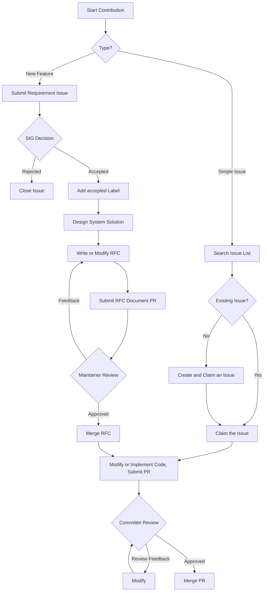

# Contribution Guide

Thank you for your interest in HCCL. This project welcomes developers to explore and participate in its development. Before participating in community contributions, refer to the [cann-community](https://gitcode.com/cann/community) to understand the code of conduct, sign the CLA agreement, and learn about the source repository contribution process.

## Expected Contributions

- Bug fixes: Fix bugs you discover or find in the Issue list, such as logic errors, memory leaks, or crashes in the code.
- Community tasks: Claim tasks published by the HCCL community.
- Performance optimization: Optimize performance for specific operators or specific architectures.
- New feature support: Add platform features, new operators, or support for new business scenarios.
- Documentation improvement: Improve documentation, comments, or usage examples.

## Prerequisites

### Coding Standards

Follow the [CANN Community Coding Standards](https://gitcode.com/cann/community/tree/master/contributor/coding-standards).

### PR Standards

1. When submitting a PR, fill in the business background, purpose, and solution details carefully according to the PR template.
2. **All PRs must be associated with an Issue**. Reference the corresponding Issue number in the PR description.
3. Before committing code with Git, refer to the [pre-commit tool guide](./docs/en/build/pre-commit-guide.md) to maintain consistent code style and compliance.
4. If your changes involve new features, new interfaces, new configuration parameters, or code flow modifications (rather than simple bug fixes), discuss the plan through an Issue first to avoid rejection of your code. If you are unsure whether your changes qualify as simple bug fixes, you can also submit an Issue for discussion.

## Contribution Process

Contributions fall into two categories:

- Simple issue handling: Bug fixes, simple code modifications, documentation changes, and so on.
- New features or capabilities: Adding new features, capabilities, interfaces, or supporting new business scenarios.

**Overall Flow**

### Simple Issue Handling

1. Search for and claim an Issue

   - Check the Issue list to see if a corresponding Issue exists for the problem.
   - **If an Issue exists**: Claim the Issue directly.
   - **If no Issue exists**: Create a new Issue and claim it.

2. Modify code and submit a PR

   - Meet the coding standards and PR standards.
   - Include regression tests that trigger the bug.

3. Code review and merge

   - The Committer responsible for the corresponding module or component reviews the code and provides feedback. Modify the code based on the feedback. Once approved, add the `/lgtm` and `/approve` labels and merge.

### Adding New Features or Capabilities

1. Submit a Requirement Issue

   - Submit a Requirement type Issue in the repository.
   - Provide a detailed description including the usage scenario, business value, and high-level technical solution.
   - Initiate a discussion in the community. The SIG group decides whether to accept the requirement. If accepted, add the `accepted` label.

2. Submit a number reservation PR

   - After the requirement is accepted, add a reservation row in the [RFC Number Registry](./docs/en/rfcs/INDEX.md) following the smallest unused number rule (status = reserved).
   - Submit a **number reservation PR** (containing only the one-line update to INDEX.md). Merging this PR indicates that the number is available for use.

3. System solution design

   - Create an RFC document in markdown format in the `docs/en/rfcs` directory (filename starting with the registered number) and write the system solution following the [RFC template](./docs/en/rfcs/0000-template.md).
   - Submit an **RFC document PR**.

4. System solution review

   - The detailed design solution is reviewed through the RFC document PR.
   - Modify the solution based on the review feedback.

5. RFC merge

   - After all Maintainers agree on the solution, the Maintainer adds the `/lgtm` and `/approve` labels and merges.
   - The merged RFC solution serves as the contract for subsequent code implementation. The code implementation must follow the RFC solution.
   - After the RFC document PR is merged, update the corresponding row status in the [RFC Number Registry](./docs/en/rfcs/INDEX.md) from `reserved` to `accepted`.

6. Software implementation

   - Implement the code according to the RFC solution and submit a PR.
   - Include corresponding test code (both unit tests and system tests).

7. Code review and merge

   - The Committer responsible for the corresponding module or component reviews the code and provides feedback. Modify the code based on the feedback. Once approved, add the `/lgtm` and `/approve` labels and merge.

---

## Dispute Resolution

Disputed Issues, PRs, or RFCs can be submitted as agenda items at the [SIG Working Meeting](https://etherpad-cann.meeting.osinfra.cn/p/sig-hccl) for the SIG group to decide.

*This document is maintained by the community. For suggestions on changes, submit them in an Issue.*
