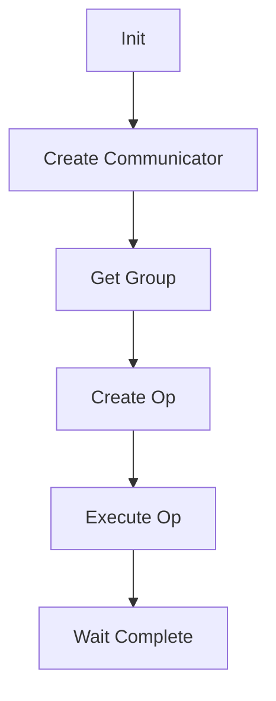

# Communicator

通信器模块，管理和协调集合通信操作。

## 职责

- 通信上下文管理
- 集合操作创建与调度
- 通信域管理
- 拓扑信息维护

## 核心接口

| 接口 | 说明 |
|------|------|
| `Communicator::Init` | 初始化通信器 |
| `Communicator::CreateOp` | 创建集合操作 |
| `Communicator::Destroy` | 销毁通信器 |

## 数据流

## 代码路径

`src/framework/communicator/`
