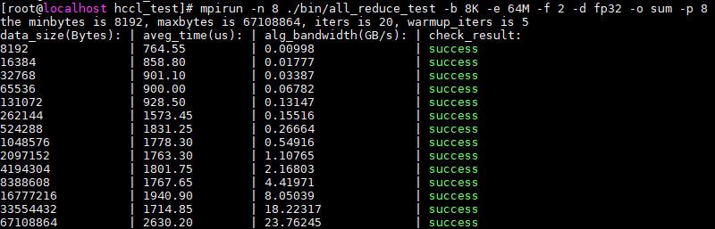

# 源码构建

## 环境准备

1. 安装依赖。

   以下所列仅为本项目源码编译用到的依赖。

   - python >= 3.7.0
   - gcc >= 7.3.0
   - cmake >= 3.16.0
   - nlohmann_json头文件

   本项目构建依赖nlohmann_json头文件，在源码编译前，请参见以下步骤安装此依赖。
   1. 单击[Link](https://github.com/nlohmann/json/releases/download/v3.11.3/include.zip)，下载nlohmann_json的头文件压缩包`include.zip`。

   2. 解压缩`include.zip`。

      将`include.zip`解压至一个具有读写权限的目录，并记录此目录路径，后续编译时需要使用。

      例如：

      ```shell
      mkdir /home/nlohmann_json
      cp include.zip /home/nlohmann_json
      cd /home/nlohmann_json
      unzip include.zip
      ```

2. 安装CANN软件包。

   本项目依赖的CANN软件版本为`CANN 8.5.0.alpha002`，请从[软件包下载地址](https://www.hiascend.com/developer/download/community/result?module=cann&cann=8.5.0.alpha002)下载如下软件包，并参考[《CANN 安装文档》](https://www.hiascend.com/document/detail/zh/CANNCommunityEdition/83RC1alpha002/softwareinst/instg/instg_0001.html?Mode=PmIns&OS=Debian&Software=cannToolKit)进行安装。

   - 开发套件包：`Ascend-cann-toolkit_${version}_linux-${arch}.run`
   - communitysdk包：`Ascend-cann-communitysdk_${version}_linux-${arch}.run`

3. 设置CANN软件环境变量。

   ```shell
   # root用户默认安装路径为：/usr/local/Ascend，普通用户默认按装路径为：$HOME/Ascend
   source /usr/local/Ascend/ascend-toolkit/set_env.sh
   ```

## 源码下载

```shell
# 下载项目源码，以master分支为例
git clone https://gitcode.com/cann/hcomm.git
```

## 编译

本项目提供一键式编译构建能力，进入代码仓根目录，执行如下命令：

```shell
bash build.sh --nlohmann_path ${JSON头文件所在目录的绝对路径}
```

例如环境准备时将nlohmann_json头文件压缩包`include.zip`解压在了`/home/nlohmann_json`目录，则此处编译命令为：

```shell
bash build.sh --nlohmann_path /home/nlohmann_json/include
```

编译完成后会在output目录下生成 `CANN-hccl_alg-<version>-linux.<arch>.run` 软件包。

`<version>`表示软件版本号，`<arch>`表示操作系统架构，取值包括“x86_64”与“aarch64”。

## 安装

安装编译生成的HCCL软件包：

```shell
./output/CANN-hccl_alg-<version>-linux.<arch>.run
```

请注意：编译时需要将上述命令中的软件包名称替换为实际编译生成的软件包名称。

安装完成后，用户编译生成的HCCL软件包会替换已安装CANN开发套件包中的HCCL相关软件。

## LLT 测试

安装完编译生成的HCCL软件包后，可通过如下命令执行LLT用例。

```shell
bash build.sh --nlohmann_path ${JSON头文件所在目录的绝对路径} --test
```

如需使能地址消毒器，可添加参数 `--asan`，命令如下：

```shell
bash build.sh --nlohmann_path ${JSON头文件所在目录的绝对路径} --test --asan
```

## 上板测试

HCCL软件包安装完成后，开发者可通过HCCL Test工具进行集合通信功能与性能的测试，HCCL Test工具的使用流程如下：

1. 工具编译

   使用HCCL Test工具前需要安装MPI依赖，配置相关环境变量，并编译HCCL Test工具，详细操作方法可参见配套版本的[昇腾文档中心-HCCL 性能测试工具使用指南](https://hiascend.com/document/redirect/CannCommunityToolHcclTest)中的“工具编译”章节。

2. 执行HCCL Test测试命令，测试集合通信的功能及性能

   以1个计算节点，8个NPU设备，测试AllReduce算子的性能为例，命令示例如下：

   ```shell
   # “/usr/local/Ascend”是root用户以默认路径安装的CANN软件安装路径，请根据实际情况替换
   cd /usr/local/Ascend/ascend-toolkit/latest/tools/hccl_test

   # 数据量（-b）从8KB到64MB，增量系数（-f）为2倍，参与训练的NPU个数为8
   mpirun -n 8 ./bin/all_reduce_test -b 8K -e 64M -f 2 -d fp32 -o sum -p 8
   ```

   工具的详细使用说明可参见[昇腾文档中心-HCCL 性能测试工具使用指南](https://hiascend.com/document/redirect/CannCommunityToolHcclTest)中的“工具使用”章节。

3. 查看结果

   执行完HCCL Test工具后，回显示例如下：

   

   - “check_result”为 success，代表通信算子执行结果成功，AllReduce 算子功能正确。
   - ”aveg_time“：集合通信算子的执行耗时，单位 us。
   - ”alg_bandwidth“：集合通信算子执行带宽，单位为 GB/s。
   - ”data_size“：单个 NPU 上参与集合通信的数据量，单位为 Bytes。

## 如何回滚

若您想回退安装的自定义HCCL软件包，可执行如下命令。

```shell
./output/CANN-hccl_alg-<version>-linux.<arch>.run --rollback
```

说明：

1. 执行时需要将上述命令中的软件包名称替换为实际的自定义HCCL软件包名称。

2. 回退命令仅支持回退到上一次安装HCCL软件包的状态，例如：

   安装`CANN开发套件包` -> 安装`HCCL自定义软件包1` -> 安装`HCCL自定义软件包2`，然后执行回退命令，则仅支持回退到安装`HCCL自定义软件包1`的状态。
