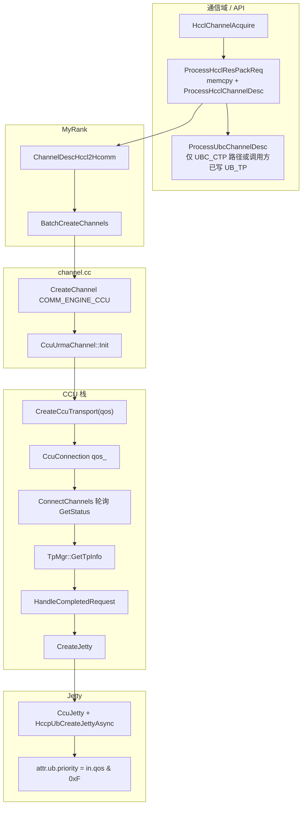
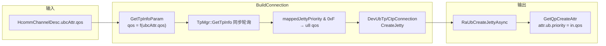
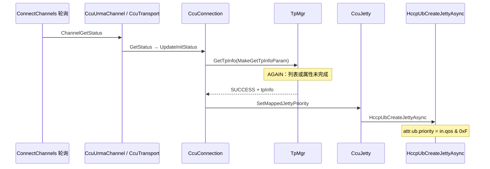

# CCU / AICPU_TS：通信域 QoS → Host 框架 → UB Jetty `attr.ub.priority`（完整说明）

本文档描述 **hcomm Next** 下，**UBC CTP/TP** 通道如何把 **通信域侧 QoS** 一路落到 **`HrtRaUbCreateJettyParam::qos`**，并最终反映为 **`attr.ub.priority`（低 4 bit 语义）**。

**结构约定（两条路径同级）**：**`COMM_ENGINE_CCU`（CCU）** 与 **`COMM_ENGINE_AICPU` / `COMM_ENGINE_AICPU_TS`（AICPU_TS）** 在文档中是 **两条并列的产品落点路径**（**§4 路径 A**、**§5 路径 B**），**无主次之分**。二者在 **前半段**（**`HcclChannelAcquire` → `ubcAttr.qos` → `ChannelDescHccl2Hcomm` → `TpMgr::GetTpInfo` 与 `mappedJettyPriority` 策略**）一致；**差异**仅在 **通道类、`GetTpInfo` 由谁/何时驱动、以及 Jetty 创建走 Next HCCP 还是 Legacy Orion**。**§3** 的 **`TpMgr`** 为 **两路径共用基础设施**（另含 **CCU 环回** 对 `TpMgr` 的调用）。文中并说明 **RA→RS→URMA**、**编译期 stub** 与 **环回** 等易混点。

**读者对象**：需要对照源码排障、扩展通道或对齐多引擎行为的开发与测试。

---

## 目录

| 章节 | 内容 |
|------|------|
| [§0 术语与字段](#0-术语与字段对照避免与-hcclqos-混淆) | 各层 `qos` / `hcclQos` / `ubcAttr.qos` / `GetTpInfoParam::qos` |
| [§1 适用范围与入口](#1-适用范围前提与-hcclchannelacquire-入口) | V2、`HcclChannelAcquire`、`ProcessHcclResPackReq` |
| [§1.1 `ubcAttr.qos` 如何被写入](#11-ubcattrqos-在-hcclchanneldesc-中的写入规则) | **`ProcessUbcChannelDesc`** 与 **`COMM_PROTOCOL_UBC_TP` 分支差异** |
| [§2 HCCL → Hcomm → 通道](#2-hccl--hcomm--通道工厂) | `my_rank`、`Channel::CreateChannel`（在此 **分叉为路径 A / B**） |
| [§3 共用：`TpMgr`](#3-共用tpmgrgettpinfo-异步两阶段缓存与策略) | **两路径 + 环回** 共用的 **`GetTpInfo`**、**`ReqPhase`**、stub、**RA→URMA**（§3.7） |
| [§4 路径 A（CCU）](#4-路径-accu从-ccuurmachannel-到-hccpubcreatejettyasync) | Transport、轮询状态机、`GetTpInfo`、`CreateJetty` |
| [§5 路径 B（AICPU / AICPU_TS）](#5-路径-baicpu--aicpu_ts) | **`BuildConnection` 同步 `TpMgr`**、`DevUbConnection`、`RaUbCreateJettyAsync` |
| [§6 `HrtRaUbCreateJettyParam::qos` 汇总](#6-hrtraubcreatejettyparamqos--attrubpriority) | 路径 A / 环回 / 路径 B 对照表 |
| [§7 流程图](#7-流程图-mermaid) | 路径 A、路径 B |
| [§8 时序图](#8-时序图-mermaid-ccu) | 路径 A：轮询驱动 `GetTpInfo` |
| [§9 源码索引](#9-主要源码索引) | 路径表 |
| [§10 排障](#10-排障要点错误码与日志) | `HCCL_E_AGAIN`、`HCCL_E_NOT_FOUND`、`HCCL_E_INTERNAL` |
| [§11 非本文范围](#11-非本文范围) | RoCE、AIV IPC、SQE 等 |
| [§12 注意事项](#12-注意事项) | Union、`ReleaseTpInfo`、环回时序 |
| [§13 演进与开关](#13-近期演进与开关) | 与 `tp_mgr.cc` 等对齐 |

---

## 0. 术语与字段对照（避免与 `hcclQos` 混淆）

| 层次 | 名称（代码） | 含义 |
|------|----------------|------|
| HCCL 通信域配置 | **`CommConfig::GetConfigHcclQos()`**、ABI **`hcclQos`** | 用户/配置侧 **HCCL QoS**，可为 **`HCCL_COMM_QOS_CONFIG_NOT_SET`** |
| 通道描述（HCCL） | **`HcclChannelDesc::ubcAttr.qos`** | UBC 相关 union 成员 **`uint32_t`**；**`INVALID_UINT`** 表示「未显式填写」 |
| 通道描述（hcomm） | **`HcommChannelDesc::ubcAttr.qos`** | **`ChannelDescHccl2Hcomm`** 逐字段拷贝 |
| CCU Transport | **`CreateCcuTransport(..., uint32_t qos, ...)`**（`ccu_urma_channel.cc`） | 形参名 **`qos`**，实参 **`channelDesc_.ubcAttr.qos`** |
| 连接对象 | **`CcuConnectionInfo::qos` → `CcuConnection::qos_`** | 与通道 **`ubcAttr.qos`** 一致传入（经 `CreateCcuTransport`） |
| 通信域写入 `CommConfig` | **`CollComm::Init`** → **`config_.SetConfigHcclQos(config->hcclQos)`** | 供 **`GetConfigHcclQos()`**、**`ProcessUbcChannelDesc`**、**`SetLoopGetTpInfoQos`** |
| 环回 TpMgr | **`CcuComponent::loopGetTpInfoQos_`** ← **`SetLoopGetTpInfoQos`** | **`MakeLoopGetTpInfoParam(commAddr, qos)`** 的 **`param.qos`** |
| **`TpMgr` 策略输入** | **`GetTpInfoParam::qos`** | 对端：**`qos_ > 7` → `UB_QOS_DEFAULT`** 否则 **`qos_ & 7`**；环回：**`loopGetTpInfoQos_ & 7`** |
| **`TpMgr` 输出** | **`TpInfo::mappedJettyPriority`**、**`hasMappedJettyPriority`** | 成功路径 **`hasMappedJettyPriority == true`** |
| Jetty 请求 | **`HrtRaUbCreateJettyParam::qos`** | CCU：**`CcuJetty::SetMappedJettyPriority`**；AICPU_TS：**`DevUbConnection::qos_`** |
| 适配层 | **`attr.ub.priority`** | **Next HCCP**：**`hcomm_adapter_hccp.cc`** 中 **`static_cast<uint8_t>(in.qos & 0xFU)`**。**Orion**：**`orion_adapter_hccp.cc`** 的 **`GetQpCreateAttr`** 为 **`attr.ub.priority = in.qos`**（上游已为 **`u8`** 且来自 **`mappedJettyPriority & 0xF`** 时与低 4 bit 语义一致） |

**说明**：调度器 **`SetHcclQos`**、**`hcclQos_`**、AICPU **SQE** 等是 **另一套「调度 QoS」命名空间**，**不要**与本文 **`ubcAttr.qos` / `GetTpInfoParam::qos`** 混读日志。

---

## 1. 适用范围、前提与 `HcclChannelAcquire` 入口

| 项 | 说明 |
|----|------|
| **CCU** | V2 **`HcclChannelAcquire` → `MyRank::CreateChannels` → `COMM_ENGINE_CCU` → `CcuUrmaChannel` → … → `HccpUbCreateJettyAsync`** |
| **AICPU / AICPU_TS** | **`COMM_ENGINE_AICPU` / `COMM_ENGINE_AICPU_TS` → `AicpuTsUrmaChannel` → `BuildConnection` → `TpMgr::GetTpInfo` → `DevUb*Connection` → `RaUbCreateJettyAsync`** |
| **协议** | **`COMM_PROTOCOL_UBC_CTP` / `COMM_PROTOCOL_UBC_TP`**；与 **`LinkData` / `CcuConnectionType::UBC_CTP` / `UBC_TP`** 对应 |
| **成功条件（Jetty）** | **`TpMgr::GetTpInfo` 成功** 且 **`tpInfo.hasMappedJettyPriority`**；否则 CCU **`CreateJetty`** **`CHK` 失败 → `HCCL_E_INTERNAL`**；AICPU_TS **`BuildConnection`** 显式 **`HCCL_E_INTERNAL`** |

**`HcclChannelAcquire`**（`coll_comm_res_c_adpt.cc`）对每个通道：

1. **`HcclChannelDescInit(&channelDescFinal, 1)`**
2. **`ProcessHcclResPackReq(channelDesc, channelDescFinal, hcclComm)`**  
   - 先 **`memcpy_s`** 拷贝 ABI 主体（含调用方已写的 **`ubcAttr`** 等）。  
   - 若 **`header.version >= HCCL_CHANNEL_VERSION_ONE`**，再 **`ProcessHcclChannelDesc`**（见 **§1.1**）。
3. V2：**`myRank->CreateChannels(engine, …, channelDescFinals, …)`**

---

### 1.1 `ubcAttr.qos` 在 `HcclChannelDesc` 中的写入规则

**`ProcessUbcChannelDesc`**（`coll_comm_res_c_adpt.cc`）仅在 **`channelProtocol` 为 `COMM_PROTOCOL_UBC_CTP` 或 `COMM_PROTOCOL_UBC_TP`** 时合法；逻辑为：

- 若 **`channelDesc.ubcAttr.qos == INVALID_UINT`**：  
  **`channelDescFinal.ubcAttr.qos = (GetConfigHcclQos() == HCCL_COMM_QOS_CONFIG_NOT_SET) ? EnvConfig::UB_QOS_DEFAULT : GetConfigHcclQos()`**  
- 否则：**保留调用方显式写入的 `channelDesc.ubcAttr.qos`**。

**与 `ProcessHcclChannelDesc` switch 的关系（易漏读）**：

- **`COMM_PROTOCOL_UBC_CTP`**（以及 switch 里与之并列的 **`HCCS` / `PCIE` / `SIO`** 分支）：**进入 `ProcessUbcChannelDesc`**。但 **`ProcessUbcChannelDesc` 内部强制要求协议为 UBC_CTP 或 UBC_TP**，否则 **`HCCL_E_PARA`**——因此 **实际生产路径上应保证只有 UBC 协议会落到该函数**。
- **`COMM_PROTOCOL_UBC_TP`**：**在 `ProcessHcclChannelDesc` 中 `break`，不调用 `ProcessUbcChannelDesc`**。此时 **`ubcAttr.qos` 完全依赖前序 `memcpy_s` 拷贝的输入描述**；若调用方未填 **`ubcAttr.qos`**，则 **不会** 自动回退到 **`GetConfigHcclQos()`**。排障 UB_TP 时务必核对 **输入 `HcclChannelDesc`**。

---

## 2. HCCL → Hcomm → 通道工厂

1. **`MyRank::BatchCreateChannels`**：**`hcommDescs[i] = MyRankUtils::ChannelDescHccl2Hcomm(channelDescs[i])`**，其中 UBC：**`hcommDescs[i].ubcAttr.qos = hcclDesc.ubcAttr.qos`**（`my_rank.cc`）。
2. **`Channel::CreateChannel(endpointHandle, engine, channelDesc, channelPtr)`**（`channel.cc`）  
   - **`COMM_ENGINE_CCU` → `CcuUrmaChannel`**（**路径 A**，见 **§4**）  
   - **`COMM_ENGINE_AICPU` / `COMM_ENGINE_AICPU_TS` → `AicpuTsUrmaChannel`**（**路径 B**，见 **§5**）  
   - 随后 **`channelPtr->Init()`**。

**此后**：**§3** 描述 **`TpMgr::GetTpInfo`（两路径及环回共用）**；**§4** 与 **§5** 分别为 **路径 A / 路径 B** 的专属栈与驱动方式（**同级章节**）。

---

## 3. 共用：`TpMgr::GetTpInfo`（异步两阶段、缓存与策略）

本节 **`TpMgr`** 为 **路径 A（CCU）**、**路径 B（AICPU_TS）** 及 **CCU 环回（`ccu_comp`）** 的 **共用实现**；**不是**「从属于 CCU」的子模块。

### 3.1 对外语义

- **`GetTpInfo(param, tpInfoOut)`** 可能 **`HCCL_SUCCESS`**（命中 **`InfoCtxMap` 缓存** 或本轮 **`HandleCompletedRequest` 已写入缓存**）、**`HCCL_E_AGAIN`**（列表或属性异步未完成）、**`HCCL_E_NOT_FOUND`**（**`tpInfoNum == 0`**）、**`HCCL_E_NETWORK`** / **`HCCL_E_INTERNAL`** 等。

### 3.2 内部结构（`tp_mgr.h`）

- **`ReqPhase`**：**`WAIT_LIST`**（等 **`RaGetTpInfoListAsync`**）→ **`WAIT_TP_ATTR`**（等 **`RaGetTpAttrAsync`** 或 **stub 立即完成**）。  
- **`ReqCtxMap`**：按 **`TpProtocol` 分 `ctpReqMap_` / `rtpReqMap_`**，键为 **`locIp → rmtIp → QosKey`**，**`QosKey = param.qos & 0xFF`**。  
- **`InfoCtxMap`**：成功后的 **`TpInfo` + `useCnt`**，供 **`FindAndGetTpInfo`** 与 **`ReleaseTpInfo`**。

### 3.3 列表阶段 → 属性阶段

1. **`GetTpInfoListAsync`**（`tp_mgr.cc` 静态函数）：填 **`GetTpCfg`**（**`cfg.flag.bs.rtp` / `ctp`**、**`CONN_RM`**、本/对端 **EID**），缓冲区 **`HccpTpInfo[HCCP_MAX_TPID_INFO_NUM]`**，调用 **`RaGetTpInfoListAsync`**。  
2. 列表完成且 **`tpInfoNum > 0`**：**`StartGetTpAttrForFirstTp`**。  
3. **`StartGetTpAttrForFirstTp`**：  
   - **`tpAttrBitmap = (1U << 12)`**（**`kTpAttrSlAvailableBit`**）。  
   - **`kSkipRaGetTpAttrStubSlAvailable == true`（当前默认）**：**不调用 `RaGetTpAttrAsync`**；写 **`tpAttr.reserved[0]=0x7C`、`reserved[1]=0`**；**`handle=0`**，**`CheckRequestResult(0)`** 视为完成。  
   - **`false`**：**`RaGetTpAttrAsync(ctx, list[0].tpHandle, &tpAttrBitmap, &tpAttr, …)`**。

### 3.4 `HandleCompletedRequest`

1. **`ReadSlAvailableMask16(tpAttr)`** → **`slMask`**（**16 bit**，**bit i=1** 表示可选用 **SL=i**）。  
2. **`mPop == 0`**：写 **`0x007C` 兜底**再算；仍空 → **`HCCL_E_INTERNAL`**。  
3. **`ApplyUbcQosTpSlPolicy(param, tpInfoNum, slMask, tpListIndex, mappedSl)`** 得 **`tpHandle`** 与 **`mappedSl`**。  
4. **`mappedJettyPriority`**：  
   - **`kMapHcclQosToJettyPriority1to1 == true`（当前默认）**：**`param.qos & 7`**  
   - **`false`**：**`mappedSl & 0xF`**  
5. **`hasMappedJettyPriority = true`**，写入 **`InfoCtxMap`** 并 **`tpInfoOut` 返回**。

### 3.5 符号 N、M、K（与 `tp_mgr.cc` 匿名命名空间一致）

| 符号 | 含义 |
|------|------|
| **N** | **`tpInfoNum`**，**`urma_get_tp_list` 等价语义**返回的 TP 条数 |
| **M** | **`popcount(slMask)`**，**`slMask`** 来自 **bit12 属性**或 **stub `0x007C`** |
| **K** | **`min(N, mSl)`**，**`mSl`** 由 **`slLevelCount`** 与 **M** 约束（见 **`ApplyUbcQosTpSlPolicy`**） |

**`N=0`**：**不进入属性阶段**；**`HandleCompletedRequest` → `HCCL_E_NOT_FOUND`**（见 **`tp_mgr.cc`** 日志 **`tpInfoNum is 0`**）。

### 3.6 环回（`ccu_comp.cc`）

**`MakeLoopGetTpInfoParam(commAddr, qos)`**：**`locAddr = rmtAddr`**，**`tpProtocol = RTP`**，**`loopFirstTpLowestSl = true`**，**`param.qos = loopGetTpInfoQos_ & 7`**。**`loopGetTpInfoQos_`** 由 **`CollComm::Init` → `SetLoopGetTpInfoQos`** 与通信域 **`GetConfigHcclQos()`** 对齐。

---

### 3.7 Host 用户态到 `urma_get_tp_list` / `urma_get_tp_attr`

**列表（第一段）**

| 步 | 组件 | 符号 / 文件 |
|----|------|-------------|
| 1 | **`TpMgr::GetTpInfoListAsync` 封装** | `tp_mgr.cc` → **`RaGetTpInfoListAsync`** |
| 2 | RA | `ra_ctx.c` → **`RaHdcGetTpInfoListAsync`** |
| 3 | RS | `rs_ub_tp.c` → **`RsUbGetTpInfoList`** → **`RsUrmaGetTpList`** |
| 4 | 动态 URMA | `dl_urma_function.c` → **`gUrmaOps.rsUrmaGetTpList`** → **`urma_get_tp_list`** |

**属性（第二段，bit12 → `TpAttr.reserved[0/1]`）**

| 步 | 组件 | 说明 |
|----|------|------|
| 1 | **`RaGetTpAttrAsync`** | `ra_ctx.c` → **`RaHdcGetTpAttrAsync`** |
| 2 | RS | **`RsUbGetTpAttr`** → **`RsUrmaGetTpAttr`** → **`urma_get_tp_attr`** |
| 3 | 解析 | **`ReadSlAvailableMask16`**（**`tp_mgr.cc`**） |

**默认 stub**：**不发起** **`RaGetTpAttrAsync`**，与 **`kSkipRaGetTpAttrStubSlAvailable`** 注释（URMA 头 **bitmap 0–11**、**bit12 驱动扩展**）一致。

---

## 4. 路径 A（CCU）：从 `CcuUrmaChannel` 到 `HccpUbCreateJettyAsync`

### 4.1 `CcuUrmaChannel::Init` 与 `qos` 进入连接对象

1. **`CreateCcuTransport(..., channelDesc_.ubcAttr.qos, impl_)`**（`ccu_urma_channel.cc`）。  
2. **`CcuTransport::CcuConnectionInfo{ …, qos }`** → **`BuildCcuConnection`** → **`CcuCtpConnection` / `CcuRtpConnection(..., qos)`** → **`CcuConnection::Init()`**。  
3. **`CcuConnection::qos_`** 与 **`tpProtocol_`（CTP/RTP）**、**`locAddr_` / `rmtAddr_`** 等在 **`Init`** 阶段就绪。**此阶段不调用 `TpMgr::GetTpInfo`**。

### 4.2 何时第一次调用 `TpMgr::GetTpInfo`（路径 A 特有：轮询驱动）

**不在 `CcuConnection::Init()`**。依赖：

1. 上层 **`ChannelProcess::ConnectChannels`** 等路径 **`while` 轮询 `ChannelGetStatus`**（`channel_process.cc`）。  
2. **`CcuUrmaChannel::GetStatus` → `CcuTransport::GetStatus` → `StatusMachine()`**（`ccu_transport_.cc`）：**Socket `OK`** 且 **`transStatus_ == INIT`** 时进入 **`ccuConnection_->GetStatus()`**。  
3. **`CcuConnection::GetStatus` → `UpdateInitStatus()`**：在 **`INIT` / `TP_INFO_GETTING`** 调 **`GetTpInfo()`**。  
4. **`GetTpInfo()`** 内 **`TpMgr::GetInstance(devPhyId_).GetTpInfo(MakeGetTpInfoParam(), tpInfo_)`**（**`TpMgr` 语义见 §3**）。  
5. **`HCCL_E_AGAIN`**：**`innerStatus_ = TP_INFO_GETTING`**，下一轮轮询再次 **`GetTpInfo()`**。

### 4.3 `MakeGetTpInfoParam`（与路径 B 构造的 `GetTpInfoParam` 字段对齐）

`ccu_conn.cc`：

| 字段 | 赋值 |
|------|------|
| **`locAddr` / `rmtAddr`** | **`locAddr_` / `rmtAddr_`**（**`CommAddr`**） |
| **`tpProtocol`** | **`tpProtocol_`**（**`Ctp` / `Rtp`**） |
| **`qos`** | **`(qos_ > 7U) ? EnvConfig::UB_QOS_DEFAULT : (qos_ & 7U)`** |
| **`slLevelCount`** | **`0`** |
| **`loopFirstTpLowestSl`** | **`false`** |

### 4.4 `GetTpInfo` 成功之后

- **`jettyImportCfg_.localTpHandle = tpInfo_.tpHandle`**  
- **`CreateJetty()`**：对每个 **`CcuJetty`**：**`SetMappedJettyPriority(tpInfo_.mappedJettyPriority)`** → **`HccpUbCreateJettyAsync`**（`ccu_jetty_.cc` / `hcomm_adapter_hccp.cc`）。

### 4.5 `GetTpInfo` 失败时的对外表现

- **`TpMgr` 返回非 `SUCCESS` 且非 `AGAIN`**：**`CcuConnection::GetTpInfo`** 打错误日志并 **`return HCCL_E_NETWORK`**（**不**把 **`HCCL_E_INTERNAL`** 原样透出给状态机上层）。  
- 排障需结合 **`TpMgr`** 日志（例如 **`tpInfoNum is 0`**、**`sl_available mask empty`**）。

### 4.6 `ReleaseTpInfo`

**`CcuConnection`** 在销毁/回滚路径调用 **`TpMgr::GetInstance(devPhyId_).ReleaseTpInfo(MakeGetTpInfoParam(), tpInfo_)`**（`ccu_conn.cc`）。**`ReleaseTpInfo` 的 `GetTpInfoParam`（含 `qos`、`tpProtocol`、地址）必须与成功 `GetTpInfo` 时一致**，否则缓存计数与 URMA 侧引用可能不一致。

---

## 5. 路径 B（AICPU / AICPU_TS）

### 5.1 `AicpuTsUrmaChannel::Init` 完整顺序（`aicpu_ts_urma_channel.cc`）

| 顺序 | 函数 | 与 QoS / Jetty 的关系 |
|------|------|------------------------|
| 1 | **`ParseInputParam`** | **`localEp_` / `remoteEp_` / `rdmaHandle_` / `socket_` / `bufs_`** |
| 2 | **`BuildSocket`** | 若无 **`socket_`** 则建 listen + **`SocketMgr::GetSocket`** |
| 3 | **`BuildAttr`** | **`attr_.devicePhyId`** 等 |
| 4 | **`BuildConnection`** | **`TpMgr::GetTpInfo`** + **`DevUbTpConnection` / `DevUbCtpConnection(..., qos)`** → **构造内 `CreateJetty` → `RaUbCreateJettyAsync`** |
| 5 | **`BuildNotify`** | notify 资源 |
| 6 | **`BuildBuffer`** | RMA buffer 列表 |
| 7 | **`BuildUbMemTransport`** | **`UbMemTransport`**（与 **Jetty qos** 无直接写 **`req.qos`** 关系，但依赖前面已建 **`DevUbConnection`**） |

### 5.2 `BuildConnection` 与路径 A（CCU）的差异

- **`TpMgr::GetTpInfo`** 在 **`BuildConnection` 内同步 `do … while (AGAIN)`**，超时 **`kTpInfoWaitTimeoutMs = 10000`**，超时返回 **`HCCL_E_TIMEOUT`**（**路径 A** 则为 **异步 + 上层轮询**，见 **§4.2**）。  
- **`param.qos`** 与 **`CcuConnection::MakeGetTpInfoParam`** 相同规则：**`(channelDesc_.ubcAttr.qos > 7U) ? UB_QOS_DEFAULT : (qos & 7U)`**（**`TpMgr` 本体见 §3**）。  
- **`TpManager::Init(deviceLogicId)`**（**Hccl Legacy**）仍调用：**`DevUbConnection::GetStatus` → `GetTpInfo()`** 使用 **Legacy `TpManager`** 取 **TP**；与 **Jetty priority** 用的 **`hcomm::TpMgr`** **并行**，勿混日志。

### 5.3 `Resume`（`aicpu_ts_urma_channel.cc`）

**`Resume()`** 再次调用 **`BuildConnection()`** 与 **`BuildUbMemTransport()`**（**无 `CHK_RET`** 包装）。若重复 **`TpMgr`/`DevUb` 建链**与产品语义冲突，需在变更 **`Resume` 语义**时单独评审（本文仅索引行为）。

---

## 6. `HrtRaUbCreateJettyParam::qos` → `attr.ub.priority`（路径对照）

| 路径 | `::qos` 来源 | `attr.ub.priority` |
|------|----------------|---------------------|
| **路径 A：`CcuJetty`** | **`SetMappedJettyPriority(tpInfo_.mappedJettyPriority)` → `inParam_.qos = priority & 0xF`** | **`hcomm_adapter_hccp`**：**`(in.qos & 0xF)`** |
| **环回 `ccu_comp`**（仍经 **`TpMgr`**，见 **§3.6**） | **`loopTpInfo.mappedJettyPriority`** | 同上 |
| **路径 B：`DevUbConnection`** | **`qos_` → `CreateJetty`：`req.qos = qos_`** | **`orion_adapter_hccp::GetQpCreateAttr`**：**`attr.ub.priority = in.qos`** |

---

## 7. 流程图（Mermaid）

### 7.1 路径 A（CCU，`CcuCtpConnection` / `CcuRtpConnection` 二选一）

### 7.2 路径 B（AICPU / AICPU_TS）

---

## 8. 时序图（Mermaid，路径 A / CCU）

---

## 9. 主要源码索引

| 内容 | 路径 |
|------|------|
| **`HcclChannelAcquire` / `ProcessHcclResPackReq` / `ProcessUbcChannelDesc`** | `src/framework/next/coll_comms/api_c_adpt/coll_comm_res_c_adpt.cc` |
| **`CollComm::Init` / `SetConfigHcclQos`** | `src/framework/next/coll_comms/communicator/coll_comm.cc` |
| **`CommConfig`** | `src/framework/communicator/comm_config.cc`、`src/framework/inc/comm_config_pub.h` |
| **`MyRank` / `ChannelDescHccl2Hcomm`** | `src/framework/next/coll_comms/rank/my_rank.cc` |
| **`Channel::CreateChannel`** | `src/framework/next/comms/endpoint_pairs/channels/channel.cc` |
| **`CcuUrmaChannel` / `CreateCcuTransport`** | `src/framework/next/comms/endpoint_pairs/channels/ccu/ccu_urma_channel.cc` |
| **`CcuTransport` / `BuildCcuConnection`** | `src/framework/next/comms/ccu/ccu_transport/ccu_transport_.cc` |
| **`CcuConnection`** | `src/framework/next/comms/ccu/ccu_transport/ccu_conn.cc` |
| **`TpMgr`** | `src/framework/next/comms/common/tp_mgr.cc`、`tp_mgr.h` |
| **`CcuJetty`** | `src/framework/next/comms/ccu/ccu_transport/ccu_jetty_.cc` |
| **`HccpUbCreateJetty(Async)`** | `src/framework/next/comms/adpt/hcomm_adapter_hccp.cc` |
| **`AicpuTsUrmaChannel`** | `src/framework/next/comms/endpoint_pairs/channels/aicpu/aicpu_ts_urma_channel.cc` |
| **`DevUbConnection`** | `src/legacy/unified_platform/resource/connection/dev_ub_connection.{h,cc}` |
| **`TpManager`（Legacy）** | `src/legacy/unified_platform/common/tp_manager.cc` |
| **`GetQpCreateAttr`（Orion）** | `src/legacy/unified_platform/external_system/orion_adapter_hccp.cc` |
| **RA** | `src/platform/hccp/rdma_agent/client/async/ra_ctx.c` |
| **RS / URMA** | `src/platform/hccp/rdma_service/ctx/rs_ub_tp.c`、`dl_urma_function.c` |
| **`TpAttr` / `hccp_tp.h`** | `src/platform/hccp/inc/network/hccp_tp.h` |
| **环回** | `src/framework/next/comms/ccu/ccu_device/ccu_comp/ccu_comp.{h,cc}` |
| **`ChannelProcess::ConnectChannels`** | `src/framework/next/comms/endpoint_pairs/channels/channel_process.cc` |

---

## 10. 排障要点（错误码与日志）

| 现象 | 可能原因 | 代码线索 |
|------|-----------|----------|
| **`TpMgr::GetTpInfo` 长期 `AGAIN`** | RA 列表或属性异步未完成 | 轮询 **`HccpGetAsyncReqResult`** / RS 负载 |
| **`tpInfoNum is 0` / `HCCL_E_NOT_FOUND`** | **`get_tp_list` 空**、EID/ **`CommAddr`** 不一致 | **`HandleCompletedRequest`** 首部 |
| **`sl_available mask empty` / `HCCL_E_INTERNAL`** | RS 未回填 **bit12**，兜底仍空 | **`HandleCompletedRequest`** |
| **路径 A `GetTpInfo` 报网络错** | **`TpMgr` 非 `AGAIN` 失败** | **`ccu_conn.cc`** 统一转 **`HCCL_E_NETWORK`** |
| **Jetty priority 与 qos 数字对不上** | **`kMapHcclQosToJettyPriority1to1 == false`** 时为 **`mappedSl & 0xF`** | **`tp_mgr.cc`** |
| **UB_TP qos 未按通信域回退** | **未走 `ProcessUbcChannelDesc`**，仅靠输入 memcpy | **§1.1** |

---

## 11. 非本文范围

- **RoCE**：**`ProcessRoceChannelDesc`**，**`roceAttr.tc/sl`** 等，与 **`ubcAttr.qos` / `TpMgr`** 无关。  
- **`COMM_ENGINE_AIV` + `AivUbMemChannel`**：**IPC buffer 交换**，无 **`TpMgr` → Jetty** 本文链路。  
- **AICPU SQE / 调度 `hcclQos`**：设备侧路径，**不等于** **`HrtRaUbCreateJettyParam::qos`**。

---

## 12. 注意事项

1. **Union**：UBC 只使用 **`ubcAttr`**。  
2. **`ReleaseTpInfo`** 与 **`GetTpInfo`** 的 **`GetTpInfoParam` 必须一致**（含 **`qos`**）。  
3. **`set_tp_attr`**：创建 Jetty 前**未**在本文路径强制调用；TP 与 Jetty SL 一致性依赖管控/RS。  
4. **环回 `SetLoopGetTpInfoQos`**：依赖 **`HcclGetThreadDeviceId() >= 0`**（见历史排障）；设备未绑定时行为与默认 **`UB_QOS_DEFAULT`** 对齐讨论见原 **§9** 类文档。  
5. **`StartGetTpAttrForFirstTp`**：**不读写 `param.qos`**；**`param.qos`** 在 **`ApplyUbcQosTpSlPolicy` / `mappedJettyPriority`** 使用。

---

## 13. 近期演进与开关

| 主题 | 说明 |
|------|------|
| **`hcclQos` → `CommConfig`** | **`CollComm::Init` → `SetConfigHcclQos`**，供 **`ProcessUbcChannelDesc`** 与环回 |
| **`kMapHcclQosToJettyPriority1to1`** | **`true`**：**Jetty priority 与 `param.qos` 0–7 对齐**；**`false`**：**`mappedSl & 0xF`** |
| **`kSkipRaGetTpAttrStubSlAvailable`** | **`true`**：stub **`0x007C`**；**`false`**：真实 **`RaGetTpAttrAsync` / `urma_get_tp_attr`** |
| **环回 `MakeLoopGetTpInfoParam(commAddr, qos)`** | 替代曾写死默认 qos 的旧实现，避免与对端 **`channelDesc` qos** 不一致 |

---

*修订说明：本文档按当前仓库 **`coll_comm_res_c_adpt.cc`（含 `UBC_TP` 与 `ProcessUbcChannelDesc` 分支差异）**、**`tp_mgr.cc` 双开关**、**`ccu_conn.cc` / `aicpu_ts_urma_channel.cc` / `dev_ub_connection.cc` / `hcomm_adapter_hccp.cc` / `orion_adapter_hccp.cc`** 整理。若后续修改 **`ProcessHcclChannelDesc` switch** 或 Orion **`GetQpCreateAttr`**，请同步更新 **§1.1** 与 **§6**。*
