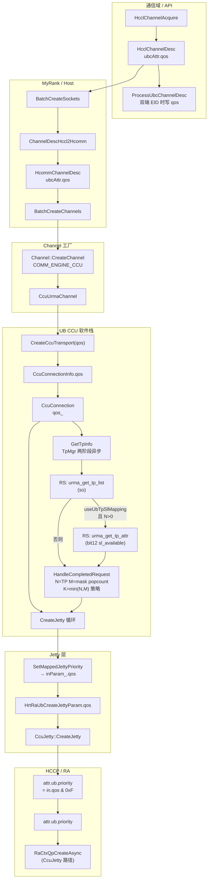
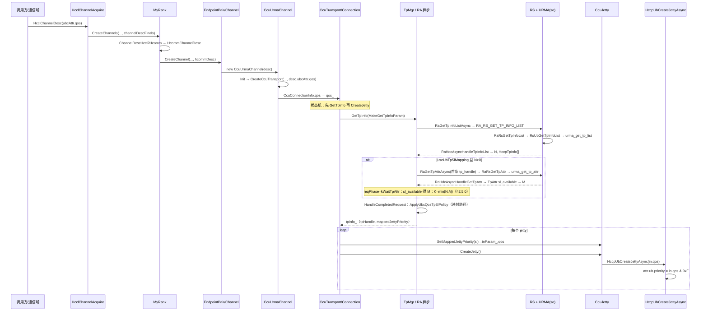

# CCU 通道：通信域 QoS → Host 框架 → UB Jetty `attr.ub.priority` 全流程

本文说明 **hcomm Next 框架** 下，从 **通信域（HcclComm / 集合通信）** 侧给出的 **UBC QoS**（`HcclChannelDesc::ubcAttr.qos`），如何在 **Host 进程内** 经 `HcommChannelDesc` 与 CCU 软件栈传递；经 **`TpMgr::GetTpInfo`** 按 **§2.5.0** 的 **N / M / K**（**`get_tp_list` → 对首 TPID `get_tp_attr`（仅请求 **属性 12 `sl_available`**）→ **`M` = `sl_available` 16bit 掩码 popcount** → **`K=min(N,M)`**）由 **`tp_mgr.cc`** 内 **`ApplyUbcQosTpSlPolicy`** 将 **连接侧 `qos`（0–7）** 映射为 **真实 SL**（**`SlValueAtRankInMask16`**）并选 **列表中的 TPID**；最终在 **HCCP/RA** 创建 UB Jetty 时 **`HrtRaUbCreateJettyParam::qos` 低 4bit → `attr.ub.priority`**。实现分布在 `coll_comm_res_c_adpt`、`my_rank`、`channel`、`ccu_urma_channel`、`ccu_transport`、`tp_mgr`、`ccu_conn`、`ccu_jetty` 与 `hcomm_adapter_hccp` 中。**`sl_available` 与失败语义** 见 §2.5.3b 与 §9。

---

## 1. 适用范围与前提

| 项 | 说明 |
|----|------|
| **适用路径** | 集合通信 V2（`hcclComm->IsCommunicatorV2()`）下 `HcclChannelAcquire` → `MyRank::CreateChannels` → `COMM_ENGINE_CCU` → `CcuUrmaChannel` → … → `HccpUbCreateJetty(Async)` |
| **协议** | `COMM_PROTOCOL_UBC_CTP` / `COMM_PROTOCOL_UBC_TP`（与 `LinkData` 中 `UB_CTP` / 非 CTP 对应 `CcuConnectionType`） |
| **QoS 来源** | 调用方在通信域上构造的 **`HcclChannelDesc`**，在 **`channelProtocol` 为 UBC** 时使用 union 成员 **`ubcAttr.qos`**（与 HCCS 场景 `hccsAttr.qos` 语义对齐，见 `include/hccl/hccl_res.h`） |
| **未改路径** | 非 V2 communicator、或未走 `CcuUrmaChannel::Init` / 未填充 `CcuConnectionInfo.qos` 等，**不适用**本文端到端链路；Next 主路径下 **`GetTpInfo` 须成功且 `tpInfo_.hasMappedJettyPriority`**，否则 **`CreateJetty`** 返回 **`HCCL_E_INTERNAL`**（见 §2.6） |
| **通信域写入 `ubcAttr.qos`** | `ProcessUbcChannelDesc`（`coll_comm_res_c_adpt.cc`）仅当 **本端与远端 `commAddr.type` 均为 `COMM_ADDR_TYPE_EID`** 且协议为 UBC CTP/TP 时，才把 **`GetConfigHcclQos()`** 写入 **`ubcAttr.qos`**；否则保留调用方原值（打日志）。与 **连接侧是否走 SL 映射** 的 EID 判定相互独立，见 §9。 |
| **SL 映射路径** | **`CcuConnection::MakeGetTpInfoParam`**（`ccu_conn.cc`）当前 **固定** **`useUbTpSlMapping=true`**；**`qos`** 为 **`qos_ & 7`**，**`qos_>7`** 时用 **`EnvConfig::UB_QOS_DEFAULT`**。**`TpMgr`** 在 **`useUbTpSlMapping`** 下 **必须** 拿到非空 **`sl_available`**，否则 **`GetTpInfo`** 失败。连接侧 **`CommAddr` 形态**（EID / IP）需与 **RA `GetTpCfg` / RS** 一致，否则列表或属性阶段可能失败；这与 **`ProcessUbcChannelDesc`** 是否按 EID 写入 **`ubcAttr.qos`** 是 **两套判定**，见 §9。 |

---

## 2. 从通信域到「应用在 Jetty 上」——分阶段说明

### 2.1 阶段 A：通信域入口（HCCL C API，Host）

1. 业务在 **Host** 调用 **`HcclChannelAcquire(HcclComm comm, CommEngine engine, const HcclChannelDesc *channelDescs, …)`**（`src/framework/next/coll_comms/api_c_adpt/coll_comm_res_c_adpt.cc`）。
2. `comm` 在 **A5 集合通信** 场景下对应 **`hcclComm->IsCommunicatorV2()`**，内部取得 **`CollComm::GetMyRank()`**。
3. 对每个 `channelDescs[i]` 先做 **`HcclChannelDescInit` + `ProcessHcclResPackReq`**，得到 **`channelDescFinals`**（补齐/校验资源包等，**不改变本链路关心的 `ubcAttr.qos` 语义**，只要调用方已按 UBC 写入 union 正确成员即可）。
4. 调用 **`myRank->CreateChannels(engine, commTag, channelDescFinals.data(), channelNum, channels)`**，后续通道创建 **全部在 Host 用户态框架** 内完成，直到 RA 创建 QP/Jetty 时才进入 **HCCP/驱动**。

**要点**：QoS 在此阶段已存在于 **`HcclChannelDesc::ubcAttr.qos`**，随 `channelDescFinals` 传入 `MyRank`，**尚未**单独做一次「只传 QoS 的下发」；它是 **通道描述符内存字段**，随创建流程一路传递。

### 2.2 阶段 B：HCCL 描述符 → Hcomm 描述符（Host，`my_rank.cc`）

1. **`MyRank::CreateChannels`** 先 **`BatchCreateSockets`**，再 **`BatchCreateChannels`**，共用同一 **`std::vector<HcommChannelDesc> hcommDescs`**。
2. 在 **`BatchCreateSockets`** 中，对每个通道执行：  
   **`hcommDescs[i] = MyRankUtils::ChannelDescHccl2Hcomm(channelDescs[i]);`**
3. **`ChannelDescHccl2Hcomm`**（`my_rank.cc`）在 **`channelProtocol == COMM_PROTOCOL_UBC_CTP || COMM_PROTOCOL_UBC_TP`** 时复制：  
   **`hcommDescs[i].ubcAttr.qos = hcclDesc.ubcAttr.qos`**。  
   RoCE 路径则复制 `roceAttr`，**不会**写 `ubcAttr`。
4. 随后 **`QueryListenPort`** 等只补全 **socket / port / role**，**不覆盖** 已拷贝的 **`ubcAttr.qos`**。

**要点**：这是 **Host 侧第一次显式把「通信域通道描述」从 HCCL ABI 结构映射到 hcomm 内部 `HcommChannelDesc`**。之后 Endpoint/Channel 层只认 **`HcommChannelDesc`**（定义见 `include/hcomm_res_defs.h`，其中 **`ubcAttr.qos`** 注释与 HCCL 对齐）。

### 2.3 阶段 C：Hcomm 通道工厂 → CCU URMA 通道（Host）

1. **`BatchCreateChannels`** 在注册内存等之后，调用 **`endpointPair->CreateChannel(epHandle, engine, reuseIdx, &hcommDescs[i], channelHandles + i)`**。
2. 经 **`EndpointPair` → `ChannelProcess::CreateChannelsLoop` → `Channel::CreateChannel`**（`src/framework/next/comms/endpoint_pairs/channels/channel.cc`）。
3. 当 **`engine == COMM_ENGINE_CCU`** 时，构造 **`CcuUrmaChannel(endpointHandle, channelDesc)`**，这里的 **`channelDesc` 是完整的 `HcommChannelDesc` 副本**，包含 **`ubcAttr.qos`**。
4. **`Channel::CreateChannel`** 末尾调用 **`channelPtr->Init()`**，进入 **`CcuUrmaChannel::Init()`**。

**要点**：从本阶段起，QoS 仍只是 **C++ 对象 `channelDesc_` 的成员**，随 **`CcuUrmaChannel`** 生命周期保存；**仍无单独 device 报文**，直到 Jetty 创建。

### 2.4 阶段 D：UB 协议栈内传递——Transport / Connection（Host）

1. **`CcuUrmaChannel::Init()`**（`ccu_urma_channel.cc`）在校验 endpoint、构造 **`LinkData`** 后调用：  
   **`CreateCcuTransport(..., channelDesc_.memHandles, channelDesc_.memHandleNum, channelDesc_.ubcAttr.qos, impl_)`**。  
   即将 **通信域侧配置的 QoS** 作为 **`qos` 实参** 传入静态函数 **`CreateCcuTransport`**。
2. **`CreateCcuTransport`** 组装 **`CcuTransport::CcuConnectionInfo`**，其中除 **`type / locAddr / rmtAddr / channelInfo / ccuJettys`** 外，写入 **`qos`**。
3. **`CcuCreateTransport` → `BuildCcuConnection`**（`ccu_transport_.cc`）按链路类型 **`new CcuCtpConnection(..., qos)`** 或 **`CcuRtpConnection(..., qos)`**。
4. 基类 **`CcuConnection`** 成员 **`qos_`** 在构造函数中赋值，供建链阶段使用。

**要点**：这里把 **「UBC 通道 QoS」** 绑定到 **逻辑连接对象**；**CTP/RTP** 两条连接类型 **均** 传入同一 **`qos`**，与历史提交「RTP CTP QOS 下发」一致。

### 2.5 阶段 D′：GetTpInfo、URMA TP 列表与 QoS→SL 策略（`tp_mgr`）

本节描述 **在创建 Jetty 之前**（见 §2.6 状态顺序），Host 如何拿到 **TP 列表**，以及如何 **按规则得到 SL 与 TP 下标**。策略实现位于 **`src/framework/next/comms/common/tp_mgr.cc`** 匿名命名空间（**`ApplyUbcQosTpSlPolicy`** 等），**不单独拆文件**。

#### 2.5.0 符号 N、M、K（与 `tp_mgr` 一致）

**下列 N、M、K 仅用于 TP 列表与 SL 能力推导**（§2.5.3–§2.5.4）；**勿与 §2.5.2a 中「同一 EID 对上 1～N 个通信域」的 N（通信域个数）混淆。**

| 符号 | 含义 |
|------|------|
| **N** | **`urma_get_tp_list`**（经 RA/RS）返回的 **TPID 条数**，即列表中 **`HccpTpInfo` / `tp_handle` 的个数**（代码里 **`tpInfoNum`**）。 |
| **M** | **仅对列表中第一个 TPID**（下标 **0** 的 **`tp_handle`**）发起 **`get_tp_attr`**，请求位图 **仅含 bit 12（`URMA_JETTY_TP_ATTR_SL_AVAILABLE`）**；应答中 **`TpAttr.slAvailable[0|1]`** 组成 **16bit 掩码**（**bit i = 1 表示可选用 SL = i**）。**`M` = 该掩码 popcount**（上限截断 16），代码里 **`resolvedSlLevelCount` / `mSlLevels`**。**不是**对每个 TPID 各算一个 M；**不再**用旧版 **`tp_attr` 低 12bit popcount** 推断 M。 |
| **K** | **K = min(N, M)**：同时受 **TP 条数** 与 **首 TPID 推得的 SL 能力** 约束时，策略实际可用的 **槽位个数**（代码里 **`usableSlotCount`**）。后续 **`NumGroupsForUsableSlotCount`**、选 **`tpListIndex` / `sl`** 均在该 **K** 范围内进行。 |

**说明**：**`tpInfo_.tpHandle`** 一般为 **`baseInfoPtr[tpListIndex]`**，**`tpListIndex` 由 QoS 分组落在 `0 … N-1` 内**，**仅当槽位逻辑需要时才等于 0**；环回 **`loopFirstTpLowestSl`** 路径固定 **第 0 个 TPID**（见 §2.6 第 5 点）。

#### 2.5.1 建链状态顺序（`ccu_conn.cc`）

1. **`CcuConnection::UpdateInitStatus`** 在 **`INIT` / `TP_INFO_GETTING`** 状态下 **先** 调 **`GetTpInfo()`**；若 **`HCCL_E_AGAIN`** 则保持 **`TP_INFO_GETTING`** 等待异步完成。
2. **`GetTpInfo` 成功** 后 **再** 调 **`CreateJetty()`**；若异步则进入 **`JETTY_CREATING`** 直至 Jetty 创建完成。
3. **`GetTpInfo` 成功** 后 **`jettyImportCfg_.localTpHandle`** 取自 **`tpInfo_.tpHandle`**（映射路径下为 **`baseInfoPtr[tpListIndex]`**，**`tpListIndex` 由 §2.5.4 在 **K=min(N,M)** 约束下按 **`qos` 分组** 得到，**可为 0 或非 0**；环回见 §2.6 第 5 点）。

**要点**：保证 **TP 选择与 SL 决策** 在 **Jetty 创建** 之前完成，便于与后续 **`set_tp_attr`（若接入）** 的顺序对齐。

#### 2.5.2 `GetTpInfoParam` 与是否启用映射（`MakeGetTpInfoParam`）

**`CcuConnection::MakeGetTpInfoParam()`**（`ccu_conn.cc`）组装 **`GetTpInfoParam`**：

| 字段 | 含义 |
|------|------|
| **`locAddr` / `rmtAddr` / `tpProtocol`** | 与连接一致（CTP/RTP）。 |
| **`useUbTpSlMapping`** | **`CcuConnection`** 当前 **恒为 `true`**（与是否 EID 显示在 **`CommAddr` 中无关**；若地址与 RS 不匹配，失败在 **`GetTpInfo`**）。 |
| **`qos`** | **`qos_ > 7`** → **`EnvConfig::UB_QOS_DEFAULT`**，否则 **`qos_ & 7`**；供 **`TpInfo` 缓存键** 与 **`ApplyUbcQosTpSlPolicy`** 分组。 |
| **`slLevelCount`** | **`CcuConnection` 置 0**：**M 完全由 `sl_available` popcount 得出**（§2.5.3b）。**非 0** 时与 **M** 取 **min** 作为策略输入 **`mSlLevels` 上限**（`tp_mgr.cc`）。 |

**`TpMgr::GetTpInfo`** 用 **`GetTpInfoParam`** 做缓存键：**非映射** 路径使用统一 legacy 键；**映射** 路径按 **`qos`** 分桶，避免不同 QoS 错误复用同一 **`tpHandle`**。

#### 2.5.2a 约束：同一对 EID、多通信域（多个）与 TP/SL 复用

**产品约束**：

1. **数量**：固定 **一对 EID**（逻辑链路）上，集合通信可创建 **1 至多个** 通信域/UBC 通道，**个数无事先固定上限**（仍受全局资源与其它模块约束）。**（此处的「多个」≠ §2.5.0 的 N；§2.5.0 的 N 专指 `get_tp_list` 返回的 TPID 条数。）**
2. **复用**：上述多个通信域若 **QoS 档位相同**（映射路径下 **`qos` 相同**），且 **`tpProtocol`（CTP/RTP）相同**、**`CommAddr` 经转换后的 `(loc,rmt)` 一致**，则 **必须复用** 同一 **`tpHandle`（TPID）** 与同一 **策略给出的 SL**（**`mappedJettyPriority`** → Jetty raw priority）。

**实现要点**（`tp_mgr`）：缓存索引为 **`(locIp, rmtIp, TpInfoCacheKey)`**，映射开启时 **`TpInfoCacheKey = qos`**；**`FindAndGetTpInfo`** 命中则 **`useCnt++`** 并返回已缓存的 **`TpInfo`**；**`ReleaseTpInfo`** 对称 **`useCnt--`**，**`useCnt==0`** 时删除条目。**前提**：各 **`CcuConnection`** 对「同一 EID 对 + 同 QoS」须 **`MakeGetTpInfoParam()` 一致**（含 EID 表达、**`qos_`**），否则键不一致会导致 **重复拉列表/错误不复用**。

#### 2.5.2c 平台约定：`get_tp_list` / `get_tp_attr` 稳定性与 TP 顺序

**适用范围**：向 **`urma_get_tp_list`**（经 RA/RS）查询时，**本端/对端 EID** 与 **CTP/RTP（及 RM 等与列表相关的查询条件）** 所标识的 **逻辑链路不变**。（在其它上下文「不确定」时，只要 **该 EID 对 + 协议模式** 未变，下述仍成立。）

**约定**：

1. **可重复性**：在上述前提下，框架或业务 **反复调用** **`get_tp_list`**，返回的 **TPID 条数（§2.5.0 之 N）**、各 **TPID（`tp_handle`）的取值集合** **保持不变**。
2. **`sl_available` 稳定**：对 **每个固定 TPID**，在链路身份不变前提下，**属性 12** 回填的 **`sl_available` 16bit 掩码** **不变**；Host **仅用第一个 TPID** 的应答推导 **§2.5.0 之 M**（§2.5.3b）。
3. **列表顺序**：**`get_tp_list`** 返回的 **TP 数组顺序** 与 **SL 从小到大** 一致：**下标 0 对应最低 SL 槽位所绑定的 TPID，依次递增**。Host 侧 **`ApplyUbcQosTpSlPolicy`** 使用的 **列表下标 `tpListIndex`、槽位 `slotIdx`、策略输出的 `sl`** 均 **与该顺序对齐**（**非** 任意乱序列表）。

**说明**：若底层实现与上述顺序或稳定性不一致，须 **在 RS/URMA 侧排序或调整**，或 **收紧 Host 策略**；当前 **`tp_mgr`** 注释与策略实现 **按本节约定** 编写。

#### 2.5.3 Host 侧发起异步：`RaGetTpInfoListAsync` → HDC → RS

1. **`tp_mgr.cc`** 中 **`GetTpInfoAsync`** 分配 **`HCCP_MAX_TPID_INFO_NUM * sizeof(HccpTpInfo)`** 缓冲，**`*num = HCCP_MAX_TPID_INFO_NUM`**（入参表示 **容量**，返回后为 **实际 TPID 条数，即 §2.5.0 之 N**），调用 **`RaGetTpInfoListAsync(ctxHandle, &cfg, info, &num, &raReqHandle)`**。
2. **`RaHdcGetTpInfoListAsync`**（`ra_hdc_async_ctx.c`）**并不在本函数内阻塞读列表**：  
   - **`calloc`** **`RaResponseTpInfoList`**，保存调用方 **`infoList`/`num` 指针** 到 **`asyncRsp`**；  
   - **`asyncData.txData`** 填入 **`phyId`、`devIndex`、容量 `*num`、`GetTpCfg`（EID、CTP/RTP、RM 等）**；  
   - **`reqHandleTmp->privData = asyncRsp`**；  
   - **`RaHdcSendMsgAsync(RA_RS_GET_TP_INFO_LIST, …)`** 发往 RS。
3. RS 侧 **`RaRsGetTpInfoList`**（`ra_adp_ctx.c`）调用 **`gRaRsCtxOps.getTpInfoList`**，经 **`RsGetTpInfoList` → `RsUbGetTpInfoList` → `RsUrmaGetTpList`**。  
   **`RsUrmaGetTpList`** 在非 LLT 构建下由 **`dl_urma_function.c`** 通过 **`HccpDlsym(gUrmaApiHandle, "urma_get_tp_list")`** 绑定 **动态库（如 `liburma.so.0`）** 中的 **`urma_get_tp_list`**，将 **`tp_handle` 等** 填入 **应答报文** **`OpGetTpInfoListData.rxData`**。
4. 请求完成时 **`RaHdcAsyncHandleTpInfoList`**：从 **`reqHandle->recvBuf`** 取 **`rxData`**，**`memcpy_s`** 到 **`asyncRsp->infoList`**（即 **`tp_mgr` 传入的缓冲区**），并 **`*asyncRsp->num = rxData.num`**，释放 **`privData`**。

**要点**：**「拿到 TP 列表」** = **异步 RPC 完成后**，调用方缓冲区内已有 **§2.5.0 之 N** 条 **`HccpTpInfo`**（当前 RS 填充 **`tpHandle`**，余量字段保留）。

#### 2.5.3b 第二个异步：首个 TPID → `RaGetTpAttrAsync` → `urma_get_tp_attr`（**仅 `sl_available`**）

当 **`useUbTpSlMapping` 且 N>0**（**N** 见 §2.5.0）时，**`TpMgr::GetTpInfo`** 在 **TP 列表异步成功** 后 **不立即** 进入 **`HandleCompletedRequest`**，而是 **只对列表下标 0 的 TPID** 再发 **`RaGetTpAttrAsync`**（`tp_mgr.cc` **`StartGetTpAttrForFirstTp`** → `ra_ctx.c` / RS **`urma_get_tp_attr`**）：

- **请求 `attrBitmap`**：**仅 `(1 << 12)`**（**`kTpAttrSlAvailableBit`**，`tp_mgr.cc`；与 `urma_api.h` 注释中 **属性 12（`sl_available`）** 一致）。
- **完成时**：将应答写入 **`RequestCtx.tpAttrBuf`**（**`struct TpAttr`**）。**`ReadSlAvailableMask16`**：若应答位图 **未带 bit 12** 或拼出的 **16bit 掩码为 0**，则 **`M=0`** → 流水线返回 **`HCCL_E_INTERNAL`**（**不再**伪造 M）。否则 **`M` = 掩码 popcount**（**`SlLevelCountFromSlAvailableField`**，上限 16），再与 **`param.slLevelCount`** 取 min 写入 **`resolvedSlLevelCount`**。
- **`RaGetTpAttrAsync` 发起失败**（`StartGetTpAttrForFirstTp`）：返回 **`HCCL_E_NETWORK`**，**不**进入 **`HandleCompletedRequest`**。

**要点**：**M 与可选 SL 集合完全以 `sl_available` 为真源**；策略里具体 SL 用 **`SlValueAtRankInMask16(mask, slotIdx)`**，**不是**简单的「槽位序号即 SL 数值」。

#### 2.5.4 策略：`ApplyUbcQosTpSlPolicy` → SL 与 TP 下标

在 **`TpMgr::HandleCompletedRequest`** 中，若 **`param.useUbTpSlMapping`**：

1. 构造 **`UbcQosTpSlPolicyInput`**：**`qos`**、**`nTp = tpInfoNum`（N）**、**`mSlLevels`**（由 **`resolvedSlLevelCount`** 与 **`param.slLevelCount`** 收束）、**`slAvailableMask`**（16bit）。
2. **`ApplyUbcQosTpSlPolicy`**（`tp_mgr.cc`）步骤：  
   - **`usableSlotCount = min(N, M)`**，即 **K**。  
   - **`numGroups = NumGroupsForUsableSlotCount(usableSlotCount)`**。  
   - **`qosGroupIndex = QoSGroupIndex(qos, numGroups)`**（**0–7** 分组）。  
   - **`priority = numGroups - 1 - qosGroupIndex`**（QoS 越高越优）。  
   - **`slotIdx = min(priority, usableSlotCount - 1)`**，**`tpListIndex = min(slotIdx, N - 1)`**。  
   - **`sl = SlValueAtRankInMask16(slAvailableMask, slotIdx)`**（掩码内第 **`slotIdx` 个** 被置位的 **SL 编号**，**0–15**）。  
3. 若 **`pout.valid` 且 `tpListIndex < tpInfoNum`**：  
   **`tmpTpInfo.tpHandle = baseInfoPtr[tpListIndex].tpHandle`**，**`mappedJettyPriority = sl`**，**`hasMappedJettyPriority = true`**。  
   否则 **`HandleCompletedRequest`** 返回 **`HCCL_E_INTERNAL`**（**不** 再静默回退为第 0 条 TP）；**`GetTpInfo`** 失败，**不会** 进入 **`CreateJetty`**。

**要点**：在 **K=min(N,M)** 内由 **`qos`** 分组得 **`slotIdx` / `tpListIndex` / `sl`**；**N** 来自 **`get_tp_list`**，**M** 来自 **首 TPID `get_tp_attr` 回填的 `sl_available` popcount**。**`RaSetTpAttrAsync` / `set_tp_attr`** 尚未接入；管控面 **`sl_available`** 与 Jetty **`priority`** 须在 RS/URMA 侧保证一致语义。

### 2.6 阶段 E：写入 Jetty 创建入参并调用 HCCP（Host → RA/设备语义边界）

1. **`CcuConnection::CreateJetty()`**（`ccu_conn.cc`）要求 **`tpInfo_.hasMappedJettyPriority`**；否则 **直接 `HCCL_E_INTERNAL`**（Next 路径 **不**再提供「无映射仍可建 Jetty」分支）。
2. 对每个 **`CcuJetty*`**：**`SetMappedJettyPriority(tpInfo_.mappedJettyPriority)`** → 写入 **`HrtRaUbCreateJettyParam::qos`**（**低 4bit = TpMgr 给出的 SL**），再 **`CreateJetty()`**。
3. **`CcuJetty::Init()`** 组装 **`inParam_`** 时，**`qos`** 取结构体默认值 **`EnvConfig::UB_QOS_DEFAULT`**；**创建前** 必须由 **`SetMappedJettyPriority`** 覆盖为策略 SL（否则 **`GetTpInfo` 成功路径下不会发生**）。
4. **`CcuJetty::CreateJetty` → `HandleAsyncRequest`**：仅 **`HccpUbCreateJettyAsync`**；首次 **`HCCL_E_AGAIN`**，完成后 **`ParseCreateInfo`**。同步 **`HccpUbCreateJetty`** 供 **`ccu_comp.cc`** 环回等路径；**`priority` 规则与 §2.7 一致**。
5. **环回公共 Jetty（`ccu_comp.cc`）**：**`TpMgr::GetTpInfo`** 在 **`loopFirstTpLowestSl`** 下固定 **列表第 0 个 TPID**，**`mappedJettyPriority = SlValueAtRankInMask16(slMask, 0)`**（**`sl_available` 中最低 SL**）；**`HccpUbCreateJetty`** 前 **`req.qos = mappedJettyPriority & 0xFU`**。

**要点**：**`HrtRaUbCreateJettyParam::qos`**（字段名 **`qos`**，语义为 **下发 UB 的 priority / SL 低 4bit**）是 **进入 `HccpUbCreateJetty(Async)` 前的最后一层 Host 字段**。

### 2.7 阶段 F：适配层并在 UB 属性上「应用」（HCCP → RA）

1. **`HccpUbCreateJetty`** 与 **`HccpUbCreateJettyAsync`**（`hcomm_adapter_hccp.cc`）当前实现：**`attr.ub.priority = in.qos & 0xFU`**（**无** `jettyPriorityIsRaw`、**无** `UbJettyPriorityFromHcclQos` 分支）。
2. **同步**：**`RaCtxQpCreate`**；**异步**（**`CcuJetty`**）：**`RaCtxQpCreateAsync`**。
3. 平台侧（如 **`RsUbJettyCbInit`**）将 **`jettyAttr->ub.priority`** 记入 **`jettyCb->priority`** 等。

**要点**：**TpMgr 输出的 SL** 与 **`attr.ub.priority`** **一致**（均 **低 4bit**）；**`set_tp_attr`** 若后续接入，需与管控面约定对齐。

---

## 3. 端到端数据流（与第 2 节对应的一览）

1. **通信域**：`HcclChannelAcquire` 收到 **`HcclChannelDesc`**；UBC 通道在 **`ProcessUbcChannelDesc`** 满足 **双端 EID** 时写入 **`ubcAttr.qos`**（来自 **`GetConfigHcclQos()`** 或默认）。
2. **Host 转换**：`ChannelDescHccl2Hcomm` → **`HcommChannelDesc::ubcAttr.qos`**。
3. **通道对象**：`CcuUrmaChannel` 保存 **`channelDesc_`**，`Init` 时 **`channelDesc_.ubcAttr.qos` → CreateCcuTransport 的 `qos` 实参**。
4. **连接对象**：`CcuConnectionInfo.qos` → **`CcuConnection::qos_`**。
5. **TP 列表（异步）**：**`TpMgr::GetTpInfo(MakeGetTpInfoParam(), tpInfo_)`** → **`RaGetTpInfoListAsync`** → … → **`urma_get_tp_list`**；得到 **§2.5.0 之 N**（TPID 条数）与 **`HccpTpInfo[]`**。
6. **QoS→SL + TP 下标**：**`useUbTpSlMapping` 且 N>0** 时第二段异步：**`get_tp_attr`（仅 bit12）** → **`sl_available` → M**；**`HandleCompletedRequest`** 中 **`ApplyUbcQosTpSlPolicy`**（**K=min(N,M)**，**`SlValueAtRankInMask16`**）→ **`tpInfo_.tpHandle`**、**`mappedJettyPriority`**、**`hasMappedJettyPriority=true`**。
7. **Jetty 入参**：**`SetMappedJettyPriority(mappedJettyPriority)`** → **`inParam_.qos`**；**无映射则 `CreateJetty` 失败**（§2.6）。
8. **UB / RA**：**`attr.ub.priority = in.qos & 0xFU`** → **`RaCtxQpCreateAsync`**（**`CcuJetty`**）或 **`RaCtxQpCreate`**（同步环回等）。

---

## 4. 整体流程图（Mermaid）

---

## 5. 时序图（Mermaid）

---

## 6. `qos` 字段 → `attr.ub.priority`（当前 Next 实现）

**`HccpUbCreateJetty`** / **`HccpUbCreateJettyAsync`**（`hcomm_adapter_hccp.cc`）：

**`attr.ub.priority = in.qos & 0xFU`**

| 阶段 | 谁写入 **`HrtRaUbCreateJettyParam::qos`** | 含义 |
|------|------------------------------------------|------|
| **`CcuJetty::Init`** | 结构体默认 | **`EnvConfig::UB_QOS_DEFAULT`**（随后由 **`SetMappedJettyPriority`** 覆盖） |
| **`CcuJetty::SetMappedJettyPriority`** | **`tpInfo_.mappedJettyPriority`** | **TpMgr** 根据 **`sl_available` + `ApplyUbcQosTpSlPolicy`** 得到的 **真实 SL（0–15）** |
| **`ccu_comp` 环回** | **`req.qos`** | **`loopFirstTpLowestSl`** 下 **`SlValueAtRankInMask16(mask,0)`** 的低 4bit |

**`CcuConnection::CreateJetty`** 依赖 **`hasMappedJettyPriority`**；**`HccpUbCreateJetty`**（同步）与 **`HccpUbCreateJettyAsync`**（异步）上述规则一致；**Transport 内 `CcuJetty` 仅走异步**。

---

## 7. 主要源码索引

| 阶段 | 路径 |
|------|------|
| 通信域入口 | `src/framework/next/coll_comms/api_c_adpt/coll_comm_res_c_adpt.cc`（`HcclChannelAcquire`） |
| UBC 通道写 `ubcAttr.qos`（EID 条件） | 同上（`ProcessUbcChannelDesc`） |
| HCCL 通道描述 QoS 字段 | `include/hccl/hccl_res.h`（`HcclChannelDesc` → `ubcAttr.qos`） |
| HCCL → Hcomm 拷贝 | `src/framework/next/coll_comms/rank/my_rank.cc`（`ChannelDescHccl2Hcomm`、`BatchCreateSockets`） |
| Hcomm 描述 | `include/hcomm_res_defs.h`（`HcommChannelDesc` → `ubcAttr.qos`） |
| CCU 通道构造 | `src/framework/next/comms/endpoint_pairs/channels/channel.cc` |
| 传入 transport 创建 | `src/framework/next/comms/endpoint_pairs/channels/ccu/ccu_urma_channel.cc` |
| 连接信息结构 | `src/framework/next/comms/ccu/ccu_transport/ccu_transport_.h`（`CcuConnectionInfo::qos`） |
| 构造 Connection | `src/framework/next/comms/ccu/ccu_transport/ccu_transport_.cc`（`BuildCcuConnection`） |
| `GetTpInfoParam` / `TpMgr` / QoS→SL 策略 | `src/framework/next/comms/common/tp_mgr.h` / `tp_mgr.cc` |
| `TpAttr.slAvailable`（`get_tp_attr` 回填） | `src/platform/hccp/inc/network/hccp_async_ctx.h`（与 URMA `tp_attr` 对齐） |
| 保存 QoS、GetTpInfo 顺序、建 Jetty | `src/framework/next/comms/ccu/ccu_transport/ccu_conn.h` / `ccu_conn.cc`（`MakeGetTpInfoParam`、`UpdateInitStatus`） |
| 写入 `inParam_` | `src/framework/next/comms/ccu/ccu_transport/ccu_jetty_.h` / `ccu_jetty_.cc` |
| Jetty 入参定义 + priority | `src/framework/next/comms/adpt/hcomm_adapter_hccp.h` / `hcomm_adapter_hccp.cc` |
| Host 异步 TP 列表 | `src/platform/hccp/rdma_agent/hdc/async/ra_hdc_async_ctx.c`（`RaHdcGetTpInfoListAsync`、`RaHdcAsyncHandleTpInfoList`） |
| Host 异步 TP 属性（首 TP → `sl_available` → M） | 同上（`RaHdcGetTpAttrAsync`、`RaHdcAsyncHandleGetTpAttr`）；`ra_ctx.c`（`RaGetTpAttrAsync`）；`tp_mgr.cc`（**bit12 请求**、`ReadSlAvailableMask16`） |
| RS 适配调用 RS 服务 | `src/platform/hccp/rdma_agent/adapter/ctx/ra_adp_ctx.c`（`RaRsGetTpInfoList`、`RaRsGetTpAttr`） |
| RS → URMA | `src/platform/hccp/rdma_service/ctx/rs_ub_tp.c`（`RsUbGetTpInfoList`、`RsUbGetTpAttr`）、`rs_ctx.c`（`RsGetTpAttr`）、`dl_urma_function.c`（`urma_get_tp_list` / `urma_get_tp_attr` dlsym） |

---

## 8. 与 AICPU TS URMA 通道的对比（概念）

- **AICPU** 侧通常从 `channelDesc_` 等路径取 QoS，经 `GetHccsQos` 等写入设备/资源结构（具体见 `aicpu_ts_urma_channel` 等）。
- **CCU** 侧：**`ubcAttr.qos`** 经 **`CcuConnectionInfo.qos` / `qos_`** 参与 **`GetTpInfoParam::qos`**（**0–7 分组**）；**真实 SL** 来自 **`sl_available` + 策略**，经 **`SetMappedJettyPriority`** 写入 **`HrtRaUbCreateJettyParam::qos`**，再 **`attr.ub.priority = in.qos & 0xF`**（§2.5–§2.7）。

---

## 9. 注意事项

1. **`HcclChannelDesc` / `HcommChannelDesc` 的 union**：`ubcAttr`、`hccsAttr`、`roceAttr` 等同处一 union，调用方需保证对 **UBC 通道** 写入并读取的是 **`ubcAttr`**，避免与其他属性混用。
2. **两套「EID」判定**：**`ProcessUbcChannelDesc`** 决定通信域 QoS 是否写入 **`ubcAttr.qos`**；**`CcuUrmaChannel`** 用 **`IpAddressToCommAddr`** 得到 **`CcuConnection` 的 `CommAddr`**。二者不一致时，**`ubcAttr.qos` 与 `qos_` 仍可能传递**，但 **`GetTpCfg`/RS 若与连接地址形态不匹配**，**`GetTpInfo`** 可能失败——**与 `useUbTpSlMapping` 恒 true 无矛盾**（见 §1 表「SL 映射路径」）。
3. **`sl_available` 真源**（§2.5.0 / §2.5.3b）：**M** 仅来自 **首 TPID** 的 **`get_tp_attr`（bit12）** 与 **`TpAttr.slAvailable`**；**缺失或全 0** → **`HCCL_E_INTERNAL`**。**策略输出 SL** = **`SlValueAtRankInMask16(mask, slotIdx)`**，**不是**槽位序号本身。
4. **`set_tp_attr`**：当前流程 **未** 在创建 Jetty 前调用 **`RaSetTpAttrAsync`**；若管控面要求 **TP 上 SL** 与 **Jetty priority** 同步，需在 **`GetTpInfo` 与 `CreateJetty` 之间** 或约定时点补链。
5. **`ReleaseTpInfo`**：须与 **`GetTpInfo`** 使用 **相同的 `GetTpInfoParam`**（含 **`useUbTpSlMapping`/`qos`**），与 **`MakeGetTpInfoParam()`** 一致，否则引用计数键不匹配。
6. **多通信域**：同一对 EID 上 **多路** 通道、**相同 QoS** 依赖 **`TpMgr`** 缓存复用 TPID/SL，见 §2.5.2a（**勿与 §2.5.0 的 N=TPID 条数混淆**）；须保证 **`locAddr_`/`rmtAddr_`/`qos_`** 与对端约定一致。
7. **`get_tp_list` 稳定性与顺序**：见 §2.5.2c（**N 与 TPID 集合 / `sl_available` 掩码** 在链路身份不变时稳定；**列表顺序与策略假设** 见该节）。
8. **Import Jetty**：若对端 import 路径也需要与 create 侧 priority 严格一致，需单独核对 **`HccpUbTpImportJetty`** 等是否需同步扩展（当前文档侧重 **create** 链路）。
9. **其他入口**：未经过 **`CcuUrmaChannel::Init`** / 未正确填充 **`CcuConnectionInfo.qos`** 或未走 **`TpMgr` 映射成功路径** 的代码，**不适用**本文 **Next 端到端** 成功条件；**Legacy Orion** 等栈另有独立规则。

---

*文档版本：与仓库内当前源码一致（**`sl_available` / `qos` 字段名**、**`HccpUbCreateJetty(Async)`** 行为以 `tp_mgr.cc`、`hcomm_adapter_hccp.cc` 为准）；**N/M/K** 见 §2.5.0；**属性 12** 见 §2.5.3b；若接入 **`set_tp_attr`** 或调整地址传递，请同步更新 §2.5、§3、流程图与 §9。*
