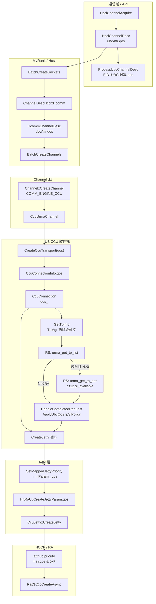
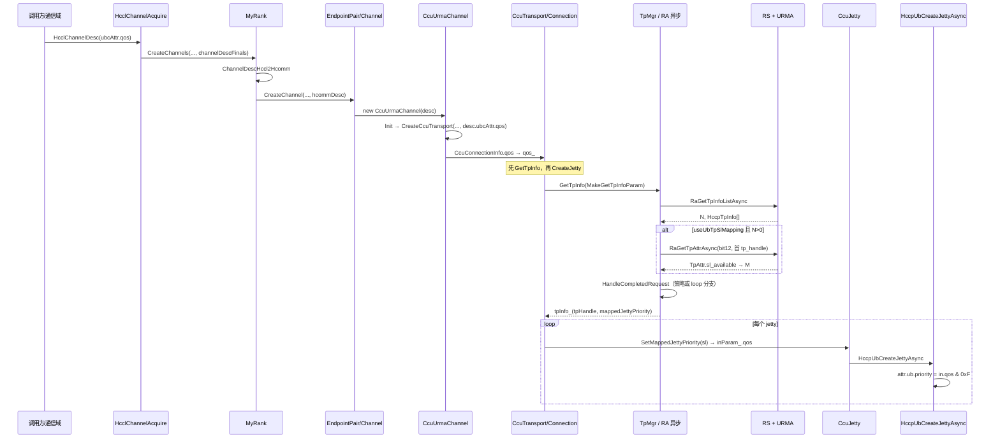

# CCU 通道：通信域 QoS → Host 框架 → UB Jetty `attr.ub.priority` 全流程

本文说明 **hcomm Next** 下，从 **通信域** 配置的 QoS 到 **`HccpUbCreateJetty(Async)`** 写入 **`attr.ub.priority`** 的完整数据与控制流。核心链路：**`get_tp_list`（N）→ 首 TPID `get_tp_attr`（仅请求属性 12 `sl_available`）→ M = 16bit 掩码 popcount → K=min(N,M) → `ApplyUbcQosTpSlPolicy`（按 `GetTpInfoParam::qos` 0–7 分组，在掩码内 `SlValueAtRankInMask16` 取真实 SL）→ `HrtRaUbCreateJettyParam::qos` → `attr.ub.priority = in.qos & 0xFU`**。实现主要分布在 `coll_comm_res_c_adpt`、`my_rank`、`channel`、`ccu_urma_channel`、`ccu_transport`、`tp_mgr`、`ccu_conn`、`ccu_jetty`、`hcomm_adapter_hccp`；**Legacy** 侧对称逻辑见 `tp_manager.cc`（Hccl 命名空间）。

---

## 0. 术语与字段对照（避免与 `hcclQos` 混淆）

| 层次 | 名称（代码） | 含义 |
|------|----------------|------|
| HCCL 通信域配置 | **`CommConfig::GetConfigHcclQos()`**、ABI **`hcclQos`** | 用户/配置侧的 **HCCL QoS**，可为 **`HCCL_COMM_QOS_CONFIG_NOT_SET`** |
| 通道描述（HCCL） | **`HcclChannelDesc::ubcAttr.qos`** | UBC CTP/TP 的 **uint32_t**，可与 **`INVALID_UINT`** 表示「未填」 |
| 通道描述（hcomm） | **`HcommChannelDesc::ubcAttr.qos`** | **`ChannelDescHccl2Hcomm`** 逐字段拷贝 |
| CCU Transport 入参 | **`CreateCcuTransport(..., uint32_t qos, ...)`**（`ccu_urma_channel.cc` **静态函数**） | **无** `hcclQos` 形参；实参为 **`channelDesc_.ubcAttr.qos`** |
| 连接对象 | **`CcuConnectionInfo::qos`** → **`CcuConnection::qos_`** | 与通道侧 **`ubcAttr.qos`** 一致传入 |
| TpMgr 策略输入 | **`GetTpInfoParam::qos`** | **`qos_ > 7`** → **`EnvConfig::UB_QOS_DEFAULT`**，否则 **`qos_ & 7`**（仅 **0–7** 参与分组） |
| Jetty 创建结构体 | **`HrtRaUbCreateJettyParam::qos`** | **低 4bit = SL（0–15）**，来自 **`TpMgr`** 的 **`mappedJettyPriority`** 或环回路径写入 |

**说明**：仓库中其它 **`hcclQos`**（如 **`SetHcclQos`**、**`hcclQos_`**、AICPU SQE）属于 **调度器/通信域 API**，**不是** `CreateCcuTransport` 的参数名。

---

## 1. 适用范围与前提

| 项 | 说明 |
|----|------|
| **适用路径** | 集合通信 V2（`hcclComm->IsCommunicatorV2()`）下 **`HcclChannelAcquire` → `MyRank::CreateChannels` → `COMM_ENGINE_CCU` → `CcuUrmaChannel` → … → `HccpUbCreateJettyAsync`** |
| **协议** | **`COMM_PROTOCOL_UBC_CTP` / `COMM_PROTOCOL_UBC_TP`**（与 **`LinkData`** 中 **`UB_CTP` / 非 CTP** 对应 **`CcuConnectionType::UBC_CTP` / `UBC_TP`**） |
| **QoS 来源** | **`HcclChannelDesc`** 在 UBC 协议下使用 **`ubcAttr.qos`**（union 成员，见 **`include/hccl/hccl_res.h`**） |
| **未走本文链路** | 非 V2、或未走 **`CcuUrmaChannel::Init`**、或未正确填充 **`CcuConnectionInfo.qos`** 等，**不适用**下文成功条件 |
| **Next 成功条件** | **`TpMgr::GetTpInfo` 成功** 且 **`tpInfo_.hasMappedJettyPriority == true`**，否则 **`CcuConnection::CreateJetty`** 返回 **`HCCL_E_INTERNAL`**（见 §2.6） |
| **通信域写入 `ubcAttr.qos`** | **`ProcessUbcChannelDesc`**（`coll_comm_res_c_adpt.cc`）：仅当 **本端与远端 `commAddr.type` 均为 `COMM_ADDR_TYPE_EID`** 且协议为 UBC CTP/TP 时，才覆盖 **`channelDescFinal.ubcAttr.qos`**：若 **`channelDesc.ubcAttr.qos == INVALID_UINT`**，则 **`commConfig.GetConfigHcclQos() == HCCL_COMM_QOS_CONFIG_NOT_SET`** 时用 **`EnvConfig::UB_QOS_DEFAULT`**，否则用 **`GetConfigHcclQos()`**；若调用方已显式写 **`ubcAttr.qos`**（非 **`INVALID_UINT`**），则 **保留调用方值**。非双端 EID 时 **不覆盖**，保留 **`channelDescFinal`** 已有 **`ubcAttr.qos`**（打日志）。 |
| **连接侧与 TpMgr** | **`CcuConnection::MakeGetTpInfoParam`** **固定 `useUbTpSlMapping = true`**；**`TpMgr`** 在映射路径下 **必须** 得到有效 **`sl_available`**（§2.5.3b），否则失败。**`CommAddr` 经 `IpAddressToCommAddr` 得到**，需与 **`GetTpCfg`/RS** 使用的地址一致，否则列表或属性阶段失败；这与 **`ProcessUbcChannelDesc`** 的 EID 判定 **独立**（§9）。 |

---

## 2. 从通信域到「应用在 Jetty 上」——分阶段说明

### 2.1 阶段 A：通信域入口（HCCL C API，Host）

1. **`HcclChannelAcquire(HcclComm comm, CommEngine engine, const HcclChannelDesc *channelDescs, …)`**（`coll_comm_res_c_adpt.cc`）。
2. V2 场景下取得 **`CollComm::GetMyRank()`**。
3. **`HcclChannelDescInit` + `ProcessHcclResPackReq`** → **`channelDescFinals`**（资源包处理；**若已走 `ProcessUbcChannelDesc`，`ubcAttr.qos` 按 §1 规则已写入 final**）。
4. **`myRank->CreateChannels(...)`** — 后续在 Host 用户态直至 RA 创建 Jetty。

**要点**：**`ubcAttr.qos`** 随 **`channelDescFinals`** 传递；语义见 §1 **`ProcessUbcChannelDesc`**。

### 2.2 阶段 B：HCCL → Hcomm（`my_rank.cc`）

1. **`BatchCreateSockets`** / **`BatchCreateChannels`** 共用 **`std::vector<HcommChannelDesc> hcommDescs`**。
2. **`hcommDescs[i] = MyRankUtils::ChannelDescHccl2Hcomm(channelDescs[i])`**。
3. UBC CTP/TP：**`hcommDescs[i].ubcAttr.qos = hcclDesc.ubcAttr.qos`**；RoCE 只拷贝 **`roceAttr`**。
4. **`QueryListenPort`** 等 **不覆盖** **`ubcAttr.qos`**。

**要点**：**`HcommChannelDesc`** 定义见 **`include/hcomm_res_defs.h`**。

### 2.3 阶段 C：通道工厂 → `CcuUrmaChannel`（`channel.cc`）

1. **`endpointPair->CreateChannel(..., &hcommDescs[i], ...)`** → **`Channel::CreateChannel`**。
2. **`engine == COMM_ENGINE_CCU`** → **`CcuUrmaChannel(endpointHandle, channelDesc)`**，保留完整 **`HcommChannelDesc`**（含 **`ubcAttr.qos`**）。
3. **`channelPtr->Init()`** → **`CcuUrmaChannel::Init()`**。

### 2.4 阶段 D：Transport / Connection（`ccu_urma_channel.cc` + `ccu_transport_.cc`）

1. **`CcuUrmaChannel::Init()`** 调用 **`CreateCcuTransport(ccuEndpoint, linkData, socket, memHandles, memHandleNum, channelDesc_.ubcAttr.qos, impl_)`**。  
   - 函数签名为 **`uint32_t qos`**（**不是** `hcclQos`）。
2. **`CcuTransport::CcuConnectionInfo{ type, locAddr, rmtAddr, channelInfo, ccuJettys, qos }`**。
3. **`BuildCcuConnection`**：**`new CcuCtpConnection(..., qos)`** 或 **`CcuRtpConnection(..., qos)`**。
4. **`CcuConnection`** 构造：**`qos_(qos)`**。

### 2.5 阶段 D′：`TpMgr::GetTpInfo`、TP 列表与 QoS→SL（`tp_mgr.cc` / `tp_mgr.h`）

策略与工具函数在 **`tp_mgr.cc`** 匿名命名空间：**`ApplyUbcQosTpSlPolicy`**、**`ReadSlAvailableMask16`**、**`SlValueAtRankInMask16`**、**`SlLevelCountFromSlAvailableField`** 等。

#### 2.5.0 符号 N、M、K

**勿与「同一链路上多个通信域」的个数混淆；§2.5.0 的 N 仅指 `get_tp_list` 返回的 TPID 条数。**

| 符号 | 含义（与代码一致） |
|------|---------------------|
| **N** | **`urma_get_tp_list`** 返回的 **TPID 条数**（**`tpInfoNum`**）。 |
| **M** | 对 **列表下标 0** 的 **`tp_handle`** 做 **`get_tp_attr`**，请求 **`attrBitmap` 仅 `(1 << 12)`**（**`kTpAttrSlAvailableBit`**）。应答 **`TpAttr.slAvailable[0] | (slAvailable[1] << 8)`** 为 **16bit 掩码**（**bit i = 1 ⇒ 可选用 SL = i**）。**M = popcount(掩码)**，上限 **16**（**`resolvedSlLevelCount`**）。 |
| **K** | **`min(N, M)`**（**`usableSlotCount`**），策略在该范围内选 **TP 下标** 与 **SL**。 |

**`tpInfo_.tpHandle`**：**`baseInfoPtr[tpListIndex].tpHandle`**，**`tpListIndex`** 由策略给出（**0 … N−1**）。**`loopFirstTpLowestSl`** 时固定 **`tpListIndex = 0`**，**`mappedJettyPriority = SlValueAtRankInMask16(slMask, 0)`**（掩码中 **最小 SL 编号**）。

#### 2.5.1 建链状态顺序（`ccu_conn.cc`）

1. **`UpdateInitStatus`**：**`INIT` / `TP_INFO_GETTING`** 先 **`GetTpInfo()``**；**`HCCL_E_AGAIN`** → 保持 **`TP_INFO_GETTING`**。
2. **`GetTpInfo` 成功** 后 **`CreateJetty()``**；异步 Jetty → **`JETTY_CREATING`**。
3. **`jettyImportCfg_.localTpHandle = tpInfo_.tpHandle`**（成功返回后）。

**注意**：**`CcuConnection::GetTpInfo`** 在 **`TpMgr::GetTpInfo` 返回非 `HCCL_SUCCESS` 且非 `AGAIN` 时，统一打日志并返回 `HCCL_E_NETWORK`**（**不**向状态机上层透传 **`HCCL_E_INTERNAL`**）。排障需结合 **`TpMgr` 日志**。

#### 2.5.2 `GetTpInfoParam`（`MakeGetTpInfoParam`）

| 字段 | **`CcuConnection` 当前赋值** |
|------|------------------------------|
| **`locAddr` / `rmtAddr` / `tpProtocol_`** | 与连接一致（**CTP / RTP**）。 |
| **`useUbTpSlMapping`** | **`true`**（常量）。 |
| **`qos`** | **`qos_ > 7` → `EnvConfig::UB_QOS_DEFAULT`，否则 `qos_ & 7`**。 |
| **`slLevelCount`** | **`0`**：M 全由 **`sl_available`** 得出；若将来非 0，**`tp_mgr`** 与 M **取 min** 作为 **`mSlLevels` 上限**。 |
| **`loopFirstTpLowestSl`** | **`false`**（普通连接）；**`true`** 仅 **`ccu_comp`** 环回参数（§2.6）。 |

**缓存键**：**`(locIp, rmtIp, TpInfoCacheKey)`**；**`useUbTpSlMapping`** 时为 **`param.qos & 0xFF`**，否则 **`UINT32_MAX`**（legacy 单桶）。**`CcuConnection` 路径恒为 qos 分桶**。

#### 2.5.2a 多通信域与复用

同一 **(locIp, rmtIp, tpProtocol, qos)** 应命中 **`TpMgr` 缓存**，复用同一 **`tpHandle`** 与 **`mappedJettyPriority`**；**`ReleaseTpInfo`** 与 **`GetTpInfo`** 的 **`GetTpInfoParam`** 须一致。

#### 2.5.2c 平台约定（列表与 `sl_available`）

1. **`get_tp_list`** 在相同链路身份下 **N 与 TPID 集合稳定**。  
2. **首 TPID 的 `sl_available` 掩码稳定**。  
3. **`tp_mgr` 注释**假定 **`get_tp_list` 下标与 SL 升序档位对齐**；**具体 SL 数值** 仍以 **`sl_available` 掩码 + `SlValueAtRankInMask16`** 为准。

#### 2.5.3 第一段异步：TP 列表

**`GetTpInfoAsync`**：**`RaGetTpInfoListAsync`** → HDC → RS → **`urma_get_tp_list`**；完成回调 **`RaHdcAsyncHandleTpInfoList`** 将列表写入 **`RequestCtx.dataBuffer`**，**`*num = N`**。

#### 2.5.3b 第二段异步：仅 `sl_available`

**条件**：**`useUbTpSlMapping && N > 0`**。

- **`StartGetTpAttrForFirstTp`**：**`reqCtx.tpAttrBitmap = (1U << 12)`**，**`RaGetTpAttrAsync(..., firstTpHandle, &tpAttrBitmap, TpAttr*, ...)`**。  
- **完成阶段**：**`SlLevelCountFromSlAvailableField`**；**M=0** → **`HCCL_E_INTERNAL`**。  
- **发起失败**：**`HCCL_E_NETWORK`**，**不**调用 **`HandleCompletedRequest`**。

#### 2.5.4 `ApplyUbcQosTpSlPolicy`

**输入**：**`UbcQosTpSlPolicyInput{ qos, nTp, mSlLevels, slAvailableMask }`**。  
**步骤摘要**：**K = min(N, mCap)** → **`numGroups = NumGroupsForUsableSlotCount(K)`** → **`QoSGroupIndex(qos, numGroups)`** → **`slotIdx`**、**`tpListIndex`** → **`sl = SlValueAtRankInMask16(slAvailableMask, slotIdx)`**。  
**失败**：**`!pout.valid`** → **`HandleCompletedRequest`** 返回 **`HCCL_E_INTERNAL`**。

**分支**：**`loopFirstTpLowestSl`** 时 **不走** **`ApplyUbcQosTpSlPolicy`**，直接首 TPID + **`SlValueAtRankInMask16(mask, 0)`**。

### 2.6 阶段 E：Jetty 入参与 HCCP（`ccu_conn` / `ccu_jetty_.cc` / `ccu_comp.cc`）

1. **`CreateJetty`**：**`CHK`** **`tpInfo_.hasMappedJettyPriority`**，否则 **`HCCL_E_INTERNAL`**。  
2. 每 **`CcuJetty`**：**`SetMappedJettyPriority(tpInfo_.mappedJettyPriority)`** → **`inParam_.qos = priority & 0xFU`**。  
3. **`CcuJetty::Init()`**：**`HrtRaUbCreateJettyParam`** 默认成员 **`qos = EnvConfig::UB_QOS_DEFAULT`**；**创建前** 由 **`SetMappedJettyPriority`** 覆盖。  
4. **`CcuJetty::CreateJetty`**：**`HccpUbCreateJettyAsync`**，轮询 **`HccpGetAsyncReqResult`**。  
5. **环回公共 Jetty（`ccu_comp.cc`）**：**`MakeLoopGetTpInfoParam(commAddr)`**：**`locAddr = rmtAddr = commAddr`**，**`tpProtocol = TpProtocol::RTP`**（**`LOOP_JETTY_PROTOCOL`**，避免部分环境 CTP link down），**`useUbTpSlMapping = true`**，**`qos = 0`**，**`loopFirstTpLowestSl = true`**。成功后 **`req.qos = mappedJettyPriority & 0xFU`**，**`HccpUbCreateJetty`**。

### 2.7 阶段 F：适配层（`hcomm_adapter_hccp.cc`）

**`HccpUbCreateJetty` / `HccpUbCreateJettyAsync`**：**`attr.ub.priority = in.qos & 0xFU`**（**无**其它分支）。

---

## 3. 端到端一览

1. **`ProcessUbcChannelDesc`**（EID + UBC）：按 §1 规则写 **`ubcAttr.qos`**。  
2. **`ChannelDescHccl2Hcomm`** → **`HcommChannelDesc.ubcAttr.qos`**。  
3. **`CcuUrmaChannel::Init`**：**`CreateCcuTransport(..., channelDesc_.ubcAttr.qos, ...)`**。  
4. **`CcuConnectionInfo.qos` → `qos_`**。  
5. **`TpMgr::GetTpInfo(MakeGetTpInfoParam(), tpInfo_)`**：列表异步 →（若映射且 N>0）**`get_tp_attr` bit12** → **`HandleCompletedRequest`**。  
6. **`SetMappedJettyPriority` → `inParam_.qos`** → **`HccpUbCreateJettyAsync`** → **`attr.ub.priority`**。

---

## 4. 整体流程图（Mermaid）

---

## 5. 时序图（Mermaid）

---

## 6. `HrtRaUbCreateJettyParam::qos` → `attr.ub.priority`

| 路径 | 写入 **`::qos`** | 说明 |
|------|------------------|------|
| **`CcuJetty::Init`** | 默认值 **`EnvConfig::UB_QOS_DEFAULT`** | 随后 **`SetMappedJettyPriority`** 覆盖 |
| **`CcuJetty::SetMappedJettyPriority`** | **`tpInfo_.mappedJettyPriority & 0xF`** | 来自 **`TpMgr`** |
| **`ccu_comp` 环回** | **`loopTpInfo.mappedJettyPriority & 0xF`** | **`MakeLoopGetTpInfoParam` + RTP** |

**适配层**：**`attr.ub.priority = in.qos & 0xFU`**（同步/异步相同）。

---

## 7. 主要源码索引

| 内容 | 路径 |
|------|------|
| 通道描述处理 / **`ProcessUbcChannelDesc`** | `src/framework/next/coll_comms/api_c_adpt/coll_comm_res_c_adpt.cc` |
| HCCL → Hcomm | `src/framework/next/coll_comms/rank/my_rank.cc` |
| **`CcuUrmaChannel` / `CreateCcuTransport(qos)`** | `src/framework/next/comms/endpoint_pairs/channels/ccu/ccu_urma_channel.cc` |
| **`CcuConnectionInfo` / `BuildCcuConnection`** | `src/framework/next/comms/ccu/ccu_transport/ccu_transport_.h` / `ccu_transport_.cc` |
| **`TpMgr` / `GetTpInfoParam`** | `src/framework/next/comms/common/tp_mgr.h` / `tp_mgr.cc` |
| **`TpAttr` / `slAvailable`** | `src/platform/hccp/inc/network/hccp_async_ctx.h` |
| **`CcuConnection` / `MakeGetTpInfoParam` / `GetTpInfo`** | `src/framework/next/comms/ccu/ccu_transport/ccu_conn.h` / `ccu_conn.cc` |
| **`CcuJetty`** | `src/framework/next/comms/ccu/ccu_transport/ccu_jetty_.h` / `ccu_jetty_.cc` |
| **`HccpUbCreateJetty(Async)`、`HrtRaUbCreateJettyParam`** | `src/framework/next/comms/adpt/hcomm_adapter_hccp.h` / `hcomm_adapter_hccp.cc` |
| 环回 **`MakeLoopGetTpInfoParam`** | `src/framework/next/comms/ccu/ccu_device/ccu_comp/ccu_comp.cc` |
| Legacy 对称 **`TpManager`** | `src/legacy/unified_platform/common/tp_manager.cc` |
| HDC / RS / URMA 调用链 | `ra_hdc_async_ctx.c`、`ra_adp_ctx.c`、`rs_ub_tp.c`、`dl_urma_function.c` 等（见仓库） |

---

## 8. 与 AICPU TS URMA 通道（概念）

- **AICPU**：多从 **`channelDesc_`** / **`GetHccsQos`** 等取 QoS 写设备结构（**`aicpu_ts_urma_channel`** 等）。  
- **CCU Next**：**`ubcAttr.qos` → `qos_` → `GetTpInfoParam::qos`（分组）**；**SL** 由 **`sl_available` + 策略**；**Jetty** 侧字段名为 **`HrtRaUbCreateJettyParam::qos`**，再 **`& 0xF` → `attr.ub.priority`**。

---

## 9. 注意事项

1. **Union**：UBC 通道只读写 **`ubcAttr`**，勿与其它协议成员混用。  
2. **EID 双端**：仅影响 **`ProcessUbcChannelDesc`** 是否**覆盖** **`ubcAttr.qos`**；**`CcuConnection` 仍固定开启映射**，地址形态与 RS 不一致可导致 **`GetTpInfo` 失败**。  
3. **`sl_available` 为真源**：无有效掩码 → **`TpMgr` 内部 `HCCL_E_INTERNAL`**；**`CcuConnection::GetTpInfo`** 对外多表现为 **`HCCL_E_NETWORK`**（§2.5.1）。  
4. **`ReleaseTpInfo`** 与 **`GetTpInfo`** 的 **`GetTpInfoParam`** 必须一致。  
5. **`set_tp_attr`**：当前创建 Jetty 前**未**强制调用；若需 TP 与 Jetty SL 严格一致，需在管控面/RS 保证 **`sl_available`** 与资源一致。  
6. **Legacy**：**`tp_manager.cc`** 与 Next **`tp_mgr.cc`** 语义应对齐；**Orion 适配**见 **`orion_adapter_hccp.*`**。

---

*文档与仓库同步要点：**`CreateCcuTransport` 参数名为 `qos`**；**`get_tp_attr` 仅 bit12**；**`HccpUbCreateJetty(Async)` 仅 `in.qos & 0xF`**；**环回 RTP 见 `LOOP_JETTY_PROTOCOL`**。修订时请对照上述源码路径。*
