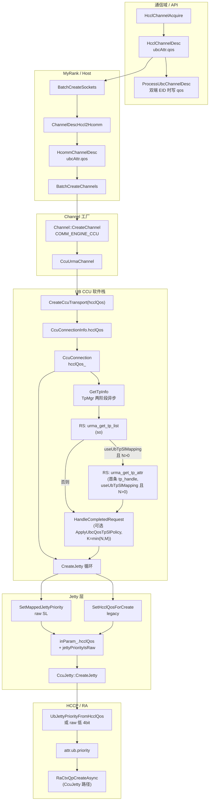
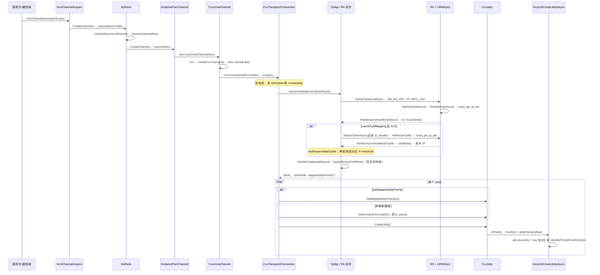

# CCU 通道：通信域 QoS → Host 框架 → UB Jetty `attr.ub.priority` 全流程

本文说明 **hcomm Next 框架** 下，从 **通信域（HcclComm / 集合通信）** 侧给出的 **UBC QoS**（`HcclChannelDesc::ubcAttr.qos`），如何在 **Host 进程内** 经 `HcommChannelDesc` 与 CCU 软件栈传递；在 **满足 EID 双端且 `hcclQos_≤7`** 时，经 **`TpMgr::GetTpInfo` → `urma_get_tp_list`（经 RA/RS）** 得 **N**，再对 **首个 `tp_handle` → `urma_get_tp_attr`（经 `RaGetTpAttrAsync`）** 推导 **M**，**K=min(N,M)** 后由 **`tp_mgr.cc` 内策略** 将 **通信域 QoS** 映射为 **SL** 并选 **TP 下标**；最终在 **HCCP/RA** 创建 UB Jetty 时写入 **`attr.ub.priority`**。实现分布在 `coll_comm_res_c_adpt`、`my_rank`、`channel`、`ccu_urma_channel`、`ccu_transport`、`tp_mgr`、`ccu_conn`、`ccu_jetty` 与 `hcomm_adapter_hccp` 中。**M 的位图语义** 见 §2.5.3b 与 §9。

---

## 1. 适用范围与前提

| 项 | 说明 |
|----|------|
| **适用路径** | 集合通信 V2（`hcclComm->IsCommunicatorV2()`）下 `HcclChannelAcquire` → `MyRank::CreateChannels` → `COMM_ENGINE_CCU` → `CcuUrmaChannel` → … → `HccpUbCreateJetty(Async)` |
| **协议** | `COMM_PROTOCOL_UBC_CTP` / `COMM_PROTOCOL_UBC_TP`（与 `LinkData` 中 `UB_CTP` / 非 CTP 对应 `CcuConnectionType`） |
| **QoS 来源** | 调用方在通信域上构造的 **`HcclChannelDesc`**，在 **`channelProtocol` 为 UBC** 时使用 union 成员 **`ubcAttr.qos`**（与 HCCS 场景 `hccsAttr.qos` 语义对齐，见 `include/hccl/hccl_res.h`） |
| **未改路径** | 非 V2 communicator、或未走 `CcuUrmaChannel::Init` / 未填充 `CcuConnectionInfo.hcclQos` 的代码，行为仍为 **`hcclQos == 0` → priority 2**（见映射节） |
| **通信域写入 `ubcAttr.qos`** | `ProcessUbcChannelDesc`（`coll_comm_res_c_adpt.cc`）仅当 **本端与远端 `commAddr.type` 均为 `COMM_ADDR_TYPE_EID`** 且协议为 UBC CTP/TP 时，才把 **`GetConfigHcclQos()`** 写入 **`ubcAttr.qos`**；否则保留调用方原值（打日志）。与 **连接侧是否走 SL 映射** 的 EID 判定相互独立，见 §9。 |
| **SL 映射路径** | 需 **`CcuConnection::MakeGetTpInfoParam`** 中 **`useUbTpSlMapping=true`**（双端 **`CommAddr` 为 EID** 且 **`hcclQos_≤7`**）。当前 **`CcuUrmaChannel`** 若仍用 **`IpAddressToCommAddr`**，则连接上 **`locAddr_`/`rmtAddr_` 多为 IPv4/v6**，映射常 **不启用**，仅走 §6 legacy 映射。 |

---

## 2. 从通信域到「应用在 Jetty 上」——分阶段说明

### 2.1 阶段 A：通信域入口（HCCL C API，Host）

1. 业务在 **Host** 调用 **`HcclChannelAcquire(HcclComm comm, CommEngine engine, const HcclChannelDesc *channelDescs, …)`**（`src/framework/next/coll_comms/api_c_adpt/coll_comm_res_c_adpt.cc`）。
2. `comm` 在 **A5 集合通信** 场景下对应 **`hcclComm->IsCommunicatorV2()`**，内部取得 **`CollComm::GetMyRank()`**。
3. 对每个 `channelDescs[i]` 先做 **`HcclChannelDescInit` + `ProcessHcclResPackReq`**，得到 **`channelDescFinals`**（补齐/校验资源包等，**不改变本链路关心的 `ubcAttr.qos` 语义**，只要调用方已按 UBC 写入 union 正确成员即可）。
4. 调用 **`myRank->CreateChannels(engine, commTag, channelDescFinals.data(), channelNum, channels)`**，后续通道创建 **全部在 Host 用户态框架** 内完成，直到 RA 创建 QP/Jetty 时才进入 **HCCP/驱动**。

**要点**：QoS 在此阶段已存在于 **`HcclChannelDesc::ubcAttr.qos`**，随 `channelDescFinals` 传入 `MyRank`，**尚未**单独做一次「只传 QoS 的下发」；它是 **通道描述符内存字段**，随创建流程一路传递。

### 2.2 阶段 B：HCCL 描述符 → Hcomm 描述符（Host，`my_rank.cc`）

1. **`MyRank::CreateChannels`** 先 **`BatchCreateSockets`**，再 **`BatchCreateChannels`**，共用同一 **`std::vector<HcommChannelDesc> hcommDescs`**。
2. 在 **`BatchCreateSockets`** 中，对每个通道执行：  
   **`hcommDescs[i] = MyRankUtils::ChannelDescHccl2Hcomm(channelDescs[i]);`**
3. **`ChannelDescHccl2Hcomm`**（`my_rank.cc`）在 **`channelProtocol == COMM_PROTOCOL_UBC_CTP || COMM_PROTOCOL_UBC_TP`** 时复制：  
   **`hcommDescs[i].ubcAttr.qos = hcclDesc.ubcAttr.qos`**。  
   RoCE 路径则复制 `roceAttr`，**不会**写 `ubcAttr`。
4. 随后 **`QueryListenPort`** 等只补全 **socket / port / role**，**不覆盖** 已拷贝的 **`ubcAttr.qos`**。

**要点**：这是 **Host 侧第一次显式把「通信域通道描述」从 HCCL ABI 结构映射到 hcomm 内部 `HcommChannelDesc`**。之后 Endpoint/Channel 层只认 **`HcommChannelDesc`**（定义见 `include/hcomm_res_defs.h`，其中 **`ubcAttr.qos`** 注释与 HCCL 对齐）。

### 2.3 阶段 C：Hcomm 通道工厂 → CCU URMA 通道（Host）

1. **`BatchCreateChannels`** 在注册内存等之后，调用 **`endpointPair->CreateChannel(epHandle, engine, reuseIdx, &hcommDescs[i], channelHandles + i)`**。
2. 经 **`EndpointPair` → `ChannelProcess::CreateChannelsLoop` → `Channel::CreateChannel`**（`src/framework/next/comms/endpoint_pairs/channels/channel.cc`）。
3. 当 **`engine == COMM_ENGINE_CCU`** 时，构造 **`CcuUrmaChannel(endpointHandle, channelDesc)`**，这里的 **`channelDesc` 是完整的 `HcommChannelDesc` 副本**，包含 **`ubcAttr.qos`**。
4. **`Channel::CreateChannel`** 末尾调用 **`channelPtr->Init()`**，进入 **`CcuUrmaChannel::Init()`**。

**要点**：从本阶段起，QoS 仍只是 **C++ 对象 `channelDesc_` 的成员**，随 **`CcuUrmaChannel`** 生命周期保存；**仍无单独 device 报文**，直到 Jetty 创建。

### 2.4 阶段 D：UB 协议栈内传递——Transport / Connection（Host）

1. **`CcuUrmaChannel::Init()`**（`ccu_urma_channel.cc`）在校验 endpoint、构造 **`LinkData`** 后调用：  
   **`CreateCcuTransport(..., channelDesc_.memHandles, channelDesc_.memHandleNum, channelDesc_.ubcAttr.qos, impl_)`**。  
   即将 **通信域侧配置的 QoS** 作为 **`hcclQos` 实参** 传入静态函数 **`CreateCcuTransport`**。
2. **`CreateCcuTransport`** 组装 **`CcuTransport::CcuConnectionInfo`**，其中除 **`type / locAddr / rmtAddr / channelInfo / ccuJettys`** 外，写入 **`hcclQos`**。
3. **`CcuCreateTransport` → `BuildCcuConnection`**（`ccu_transport_.cc`）按链路类型 **`new CcuCtpConnection(..., hcclQos)`** 或 **`CcuRtpConnection(..., hcclQos)`**。
4. 基类 **`CcuConnection`** 成员 **`hcclQos_`** 在构造函数中赋值，供建链阶段使用。

**要点**：这里把 **「UBC 通道 QoS」** 绑定到 **逻辑连接对象**；**CTP/RTP** 两条连接类型 **均** 传入同一 **`hcclQos`**，与历史提交「RTP CTP QOS 下发」一致。

### 2.5 阶段 D′：GetTpInfo、URMA TP 列表与 QoS→SL 策略（`tp_mgr`）

本节描述 **在创建 Jetty 之前**（见 §2.6 状态顺序），Host 如何拿到 **TP 列表**，以及如何 **按规则得到 SL 与 TP 下标**。策略实现位于 **`src/framework/next/comms/common/tp_mgr.cc`** 匿名命名空间（**`ApplyUbcQosTpSlPolicy`** 等），**不单独拆文件**。

#### 2.5.1 建链状态顺序（`ccu_conn.cc`）

1. **`CcuConnection::UpdateInitStatus`** 在 **`INIT` / `TP_INFO_GETTING`** 状态下 **先** 调 **`GetTpInfo()`**；若 **`HCCL_E_AGAIN`** 则保持 **`TP_INFO_GETTING`** 等待异步完成。
2. **`GetTpInfo` 成功** 后 **再** 调 **`CreateJetty()`**；若异步则进入 **`JETTY_CREATING`** 直至 Jetty 创建完成。
3. **`GetTpInfo` 成功** 后 **`jettyImportCfg_.localTpHandle`** 取自 **`tpInfo_.tpHandle`**（策略可能从列表中选取 **非第 0 条** 的 handle）。

**要点**：保证 **TP 选择与 SL 决策** 在 **Jetty 创建** 之前完成，便于与后续 **`set_tp_attr`（若接入）** 的顺序对齐。

#### 2.5.2 `GetTpInfoParam` 与是否启用映射（`MakeGetTpInfoParam`）

**`CcuConnection::MakeGetTpInfoParam()`**（`ccu_conn.cc`）组装 **`GetTpInfoParam`**：

| 字段 | 含义 |
|------|------|
| **`locAddr` / `rmtAddr` / `tpProtocol`** | 与连接一致（CTP/RTP）。 |
| **`useUbTpSlMapping`** | **`true`** 当且仅当 **`locAddr_.type` 与 `rmtAddr_.type` 均为 `COMM_ADDR_TYPE_EID`** 且 **`hcclQos_ ≤ 7`**。 |
| **`commHcclQos`** | **`hcclQos_ & 7`**，供策略分组使用。 |
| **`slLevelCount`** | 映射路径下 **`CcuConnection` 置 0**：**M** 由首个 **`tp_handle`** 的 **`RaGetTpAttrAsync` / `urma_get_tp_attr`** 返回 **`attrBitmap` 推导**（§2.5.3b）。**非 0** 时与推导 **M** 取 **min** 作上限；**`get_tp_attr` 发起失败** 时用 **本字段或 8** 兜底。 |

**`TpMgr::GetTpInfo`** 用 **`GetTpInfoParam`** 做缓存键：**非映射** 路径使用统一 legacy 键；**映射** 路径按 **`commHcclQos`** 分桶，避免不同 QoS 错误复用同一 **`tpHandle`**。

#### 2.5.2a 约束：同一对 EID、多通信域（1～N）与 TP/SL 复用

**产品约束**：

1. **数量**：固定 **一对 EID**（逻辑链路）上，集合通信可创建 **1～N** 个通信域/UBC 通道，**N 无事先固定上限**（仍受全局资源与其它模块约束）。
2. **复用**：上述多个通信域若 **QoS 档位相同**（映射路径下 **`commHcclQos` 相同**），且 **`tpProtocol`（CTP/RTP）相同**、**`CommAddr` 经转换后的 `(loc,rmt)` 一致**，则 **必须复用** 同一 **`tpHandle`（TPID）** 与同一 **策略给出的 SL**（**`mappedJettyPriority`** → Jetty raw priority）。

**实现要点**（`tp_mgr`）：缓存索引为 **`(locIp, rmtIp, TpInfoCacheKey)`**，映射开启时 **`TpInfoCacheKey = commHcclQos`**；**`FindAndGetTpInfo`** 命中则 **`useCnt++`** 并返回已缓存的 **`TpInfo`**；**`ReleaseTpInfo`** 对称 **`useCnt--`**，**`useCnt==0`** 时删除条目。**前提**：各 **`CcuConnection`** 对「同一 EID 对 + 同 QoS」须 **`MakeGetTpInfoParam()` 一致**（含 EID 表达、**`hcclQos_`**），否则键不一致会导致 **重复拉列表/错误不复用**。

#### 2.5.2c 平台约定：`get_tp_list` / `get_tp_attr` 稳定性与 TP 顺序

**适用范围**：向 **`urma_get_tp_list`**（经 RA/RS）查询时，**本端/对端 EID** 与 **CTP/RTP（及 RM 等与列表相关的查询条件）** 所标识的 **逻辑链路不变**。（在其它上下文「不确定」时，只要 **该 EID 对 + 协议模式** 未变，下述仍成立。）

**约定**：

1. **可重复性**：在上述前提下，框架或业务 **反复调用** **`get_tp_list`**，返回的 **条数 N**、各 **TPID（`tp_handle`）的取值集合** **保持不变**。
2. **位图稳定**：对 **每个固定 TPID**，**`get_tp_attr`** 中与 **SL** 相关的 **bitmap** **不变**；因此 Host 可用 **列表第 0 个 TPID** 的 attr 推导 **M**（§2.5.3b），并与整表能力一致。
3. **列表顺序**：**`get_tp_list`** 返回的 **TP 数组顺序** 与 **SL 从小到大** 一致：**下标 0 对应最低 SL 槽位所绑定的 TPID，依次递增**。Host 侧 **`ApplyUbcQosTpSlPolicy`** 使用的 **列表下标 `tpListIndex`、槽位 `slotIdx`、策略输出的 `sl`** 均 **与该顺序对齐**（**非** 任意乱序列表）。

**说明**：若底层实现与上述顺序或稳定性不一致，须 **在 RS/URMA 侧排序或调整**，或 **收紧 Host 策略**；当前 **`tp_mgr`** 注释与策略实现 **按本节约定** 编写。

#### 2.5.3 Host 侧发起异步：`RaGetTpInfoListAsync` → HDC → RS

1. **`tp_mgr.cc`** 中 **`GetTpInfoAsync`** 分配 **`HCCP_MAX_TPID_INFO_NUM * sizeof(HccpTpInfo)`** 缓冲，**`*num = HCCP_MAX_TPID_INFO_NUM`**（入参表示 **容量**，返回后为 **实际条数 N**），调用 **`RaGetTpInfoListAsync(ctxHandle, &cfg, info, &num, &raReqHandle)`**。
2. **`RaHdcGetTpInfoListAsync`**（`ra_hdc_async_ctx.c`）**并不在本函数内阻塞读列表**：  
   - **`calloc`** **`RaResponseTpInfoList`**，保存调用方 **`infoList`/`num` 指针** 到 **`asyncRsp`**；  
   - **`asyncData.txData`** 填入 **`phyId`、`devIndex`、容量 `*num`、`GetTpCfg`（EID、CTP/RTP、RM 等）**；  
   - **`reqHandleTmp->privData = asyncRsp`**；  
   - **`RaHdcSendMsgAsync(RA_RS_GET_TP_INFO_LIST, …)`** 发往 RS。
3. RS 侧 **`RaRsGetTpInfoList`**（`ra_adp_ctx.c`）调用 **`gRaRsCtxOps.getTpInfoList`**，经 **`RsGetTpInfoList` → `RsUbGetTpInfoList` → `RsUrmaGetTpList`**。  
   **`RsUrmaGetTpList`** 在非 LLT 构建下由 **`dl_urma_function.c`** 通过 **`HccpDlsym(gUrmaApiHandle, "urma_get_tp_list")`** 绑定 **动态库（如 `liburma.so.0`）** 中的 **`urma_get_tp_list`**，将 **`tp_handle` 等** 填入 **应答报文** **`OpGetTpInfoListData.rxData`**。
4. 请求完成时 **`RaHdcAsyncHandleTpInfoList`**：从 **`reqHandle->recvBuf`** 取 **`rxData`**，**`memcpy_s`** 到 **`asyncRsp->infoList`**（即 **`tp_mgr` 传入的缓冲区**），并 **`*asyncRsp->num = rxData.num`**，释放 **`privData`**。

**要点**：**「拿到 TP 列表」** = **异步 RPC 完成后**，调用方缓冲区内已有 **N 条 `HccpTpInfo`**（当前 RS 填充 **`tpHandle`**，余量字段保留）。

#### 2.5.3b 第二个异步：首个 TPID → `RaGetTpAttrAsync` → `urma_get_tp_attr`

当 **`useUbTpSlMapping` 且 N>0** 时，**`TpMgr::GetTpInfo`** 在 **TP 列表异步成功** 后 **不立即** 进入 **`HandleCompletedRequest`**，而是对 **列表第 0 条的 `tp_handle`** 再发 **`RaGetTpAttrAsync`**（`ra_ctx.c` → `RaHdcGetTpAttrAsync`，RS **`RaRsGetTpAttr` → `RsUbGetTpAttr` → `urma_get_tp_attr`**）：

- **请求 `attrBitmap`**：含 **bit 10（SL）**，与 URMA 文档中 tp_attr 位图一致。
- **完成时**：**`RaHdcAsyncHandleGetTpAttr`** 将 **`rxData.attrBitmap` / `rxData.attr`** 写回 Host 侧缓冲；**`TpMgr`** 用 **`SlLevelCountFromTpAttrRxBitmap(rxAttrBitmap)`** 得到 **M**（对 **低 12 bit** 做 **popcount**；若仅 SL 单 bit 置位则 **M=16** 以覆盖 4bit SL 空间；**popcount 为 0 则 M=8 兜底**），再 **`K = min(N, M)`** 参与 §2.5.4 策略。
- **`RaGetTpAttrAsync` 发起失败**：**`resolvedSlLevelCount`** 置 **`param.slLevelCount` 或 8**，不再挂第二段异步。

**要点**：**M 来自「第一个 TPID」的 `get_tp_attr` 应答位图**；若后续固件在 **`attrBitmap` 中承载更精确的「SL 档位数」**，可收紧 **`SlLevelCountFromTpAttrRxBitmap`** 的实现而不改连接层接口。

#### 2.5.4 策略：`ApplyUbcQosTpSlPolicy` → SL 与 TP 下标

在 **`TpMgr::HandleCompletedRequest`** 中，若 **`param.useUbTpSlMapping`**：

1. 构造 **`UbcQosTpSlPolicyInput`**：**`commHcclQos`**、**`nTp = tpInfoNum`（N）**、**`mSlLevels = M`**（来自 **`reqCtx.resolvedSlLevelCount`**，由 §2.5.3b 推导；缺失时 **`param.slLevelCount` 或 8**）。
2. **`ApplyUbcQosTpSlPolicy`**（`tp_mgr.cc`）步骤：  
   - **`usableSlotCount = min(N, M)`**（同时受 TP 条数与 SL 档位数限制）。  
   - **`numGroups = NumGroupsForUsableSlotCount(usableSlotCount)`**：K≤1→1 组；K=2→2；K=3→3；K∈[4,7]→4；K≥8→8。  
   - **`hcclQosGroupIndex = QoSGroupIndex(commHcclQos, numGroups)`**：将 **0–7** 的通信域 QoS 划入某一组（例如 2 组时 **0–3 / 4–7**；4 组时 **每两个 QoS 一档**；8 组时 **一对一**）。  
   - **`priority = numGroups - 1 - hcclQosGroupIndex`**（**QoS 越高 → 组索引越大 → 该值越小**，表示 **更优**）。  
   - **`slotIdx = min(priority, usableSlotCount - 1)`**，**`tpListIndex = min(slotIdx, N - 1)`**。  
   - **`sl = min(slotIdx, 15)`**（4bit，与 **`TpAttr.sl`** 宽度一致；**当前实现中 SL 数值等于槽位序号**，非 URMA 返回的真实 SL 枚举表）。  
3. 若 **`pout.valid` 且 `tpListIndex < tpInfoNum`**：  
   **`tmpTpInfo.tpHandle = baseInfoPtr[tpListIndex].tpHandle`**，**`mappedJettyPriority = sl`**，**`hasMappedJettyPriority = true`**。  
   否则 **`HandleCompletedRequest`** 返回 **`HCCL_E_INTERNAL`**（**不** 再静默回退为第 0 条 TP）；**`GetTpInfo`** 失败，**不会** 进入 **`CreateJetty`**。

**要点**：**SL 槽位与 TP 下标** 由策略按 **K=min(N,M)** 计算；**M** 已由 **`urma_get_tp_attr`**（经 RA 异步）回填。**`RaSetTpAttrAsync` / `set_tp_attr`** 尚未接入本流程，管控面 TP 属性与 Jetty **仅** 在「priority 与策略 sl 一致」的设计意图上对齐，需在后续迭代补全。

### 2.6 阶段 E：写入 Jetty 创建入参并调用 HCCP（Host → RA/设备语义边界）

1. **`CcuConnection::CreateJetty()`**（`ccu_conn.cc`）在创建每个 **`CcuJetty*`** 前：  
   - 若 **`tpInfo_.hasMappedJettyPriority`**：**`SetMappedJettyPriority(tpInfo_.mappedJettyPriority)`**（**`useUbTpSlMapping` 成功路径下恒为真**）；  
   - 否则：**`SetHcclQosForCreate(0U)`** → **`UbJettyPriorityFromHcclQos(0)`** → **`CCU_UB_DEFAULT_JETTY_PRIORITY`**（非映射路径）。  
   再 **`CreateJetty()`**。
2. **`SetHcclQosForCreate`**： **`inParam_.hcclQos = qos`**，**`jettyPriorityIsRaw = false`**（走 §2.7 legacy 映射）。  
   **`SetMappedJettyPriority`**：**`inParam_.hcclQos = priority & 0xF`**，**`jettyPriorityIsRaw = true`**（**低 4 位直接作为 `attr.ub.priority`**，使 **SL=0** 等不再被「qos=0→2」吃掉）。
3. **`CcuJetty::Init()`** 聚合初始化 **`inParam_`** 时若未设 QoS 相关字段，默认 **`hcclQos=0`、`jettyPriorityIsRaw=false`**。
4. **`CcuJetty::CreateJetty` → `HandleAsyncRequest`**：本链路 **只调用** **`HccpUbCreateJettyAsync`**。首次调用提交异步创建并返回 **`HCCL_E_AGAIN`**，后续在状态机轮询中再次进入，直到 **`HccpGetAsyncReqResult`** 完成后再 **`ParseCreateInfo`**。  
   **说明**：适配层另有同步封装 **`HccpUbCreateJetty`**（供 **`ccu_comp.cc`** 环回等路径使用），**`CcuJetty` 内不走同步接口**；二者 **`priority`** 计算规则见 §2.7。
5. **环回公共 Jetty（`ccu_comp.cc`，集合通信 Init / 每 IO die）**：在 **`CreateAndImportLoopJettys`** 前通过 **`TpMgr::GetTpInfo(MakeLoopGetTpInfoParam)`** 拉 **`get_tp_list`**，EID 环回地址时 **`useUbTpSlMapping` + `loopFirstTpLowestSl`**：仍走 **`get_tp_attr`（首 TP）** 推 **M**，结果固定为 **列表第 0 个 TPID** 与 **最低 SL 槽位（`mappedJettyPriority=0`）**，供全通信域复用；**`HccpUbCreateJetty`** 前写入 **`hcclQos` 低 4 位 = SL**、**`jettyPriorityIsRaw=true`**。非 EID 环回仍走 legacy priority。 **`ReleaseAllTpInfos`** 与 **`GetTpInfo`** 使用同一 **`MakeLoopGetTpInfoParam`**。

**要点**：**`inParam_.hcclQos` + `jettyPriorityIsRaw`** 是 **传入 HCCP/RA 创建接口的最后一层 Host 侧字段**；之后由适配层转为 **`QpCreateAttr::ub.priority`**。

### 2.7 阶段 F：适配层映射并在 UB 属性上「应用」（HCCP → RA）

1. **`HccpUbCreateJetty`** 与 **`HccpUbCreateJettyAsync`**（`hcomm_adapter_hccp.cc`）中：  
   **`attr.ub.priority = in.jettyPriorityIsRaw ? (in.hcclQos & 0xFU) : UbJettyPriorityFromHcclQos(in.hcclQos)`**。
2. **`UbJettyPriorityFromHcclQos`**：**`hcclQos == 0` → 2**；否则 **`hcclQos & 0xFU`**（legacy 路径，与 §6 一致）。
3. **同步**：**`HccpUbCreateJetty`** 内 **`RaCtxQpCreate`**。  
   **异步**（**`CcuJetty` 所用**）：**`RaCtxQpCreateAsync`**，轮询完成后解析 **`QpCreateInfo`**。  
   **`priority`** 由硬件/驱动栈在 **建链资源** 上消费。
4. 平台侧（如 `rs_ub.c` 中 **`RsUbJettyCbInit`**）会将 **`jettyAttr->ub.priority`** 记入 **`jettyCb->priority`** 等，供后续 UDMA/UB 路径使用。

**要点**：**映射路径** 下 **策略输出的 SL** 与 **Jetty `priority`** 为 **同一低 4 位**（raw 模式）；**未接入 `set_tp_attr` 前**，URMA TP 属性中的 SL 需后续扩展保证一致。

---

## 3. 端到端数据流（与第 2 节对应的一览）

1. **通信域**：`HcclChannelAcquire` 收到 **`HcclChannelDesc`**；UBC 通道在 **`ProcessUbcChannelDesc`** 满足 **双端 EID** 时写入 **`ubcAttr.qos`**（来自 **`GetConfigHcclQos()`** 或默认）。
2. **Host 转换**：`ChannelDescHccl2Hcomm` → **`HcommChannelDesc::ubcAttr.qos`**。
3. **通道对象**：`CcuUrmaChannel` 保存 **`channelDesc_`**，`Init` 时 **`channelDesc_.ubcAttr.qos` → CreateCcuTransport 的 `hcclQos`**。
4. **连接对象**：`CcuConnectionInfo.hcclQos` → **`CcuConnection::hcclQos_`**。
5. **TP 列表（异步）**：**`TpMgr::GetTpInfo(MakeGetTpInfoParam(), tpInfo_)`** → **`RaGetTpInfoListAsync`** → HDC **`RA_RS_GET_TP_INFO_LIST`** → RS **`RaRsGetTpInfoList` → `RsUbGetTpInfoList` → `urma_get_tp_list`（so）**；完成回调 **`RaHdcAsyncHandleTpInfoList`** **`memcpy`** 回 **`tp_mgr` 缓冲**，得到 **N** 与 **`HccpTpInfo[]`**。
6. **QoS→SL + TP 下标（可选）**：若 **`useUbTpSlMapping`** 且 **N>0**，先 **`RaGetTpAttrAsync`（首个 TP）** 得 **M**，再 **`HandleCompletedRequest`** 中 **`ApplyUbcQosTpSlPolicy`（K=min(N,M)）** → **`tpInfo_.tpHandle`**、**`mappedJettyPriority`**、**`hasMappedJettyPriority`**。
7. **Jetty 入参**：**`hasMappedJettyPriority`** 则 **`SetMappedJettyPriority`**（**`jettyPriorityIsRaw=true`**）；否则 **`SetHcclQosForCreate(0U)`**（默认 **`CCU_UB_DEFAULT_JETTY_PRIORITY`**）。映射开启时策略失败见 §2.5.4，**`GetTpInfo`** 直接失败。
8. **UB / RA**：**`jettyPriorityIsRaw` ? 低 4 位 : `UbJettyPriorityFromHcclQos`** → **`attr.ub.priority`** → **`RaCtxQpCreateAsync`**（**`CcuJetty` 路径**；其它路径可能为 **`RaCtxQpCreate`**）。

---

## 4. 整体流程图（Mermaid）

---

## 5. 时序图（Mermaid）

---

## 6. QoS → `priority` 映射规则（双路径）

统一入口在 **`HccpUbCreateJetty` / `HccpUbCreateJettyAsync`**（`hcomm_adapter_hccp.cc`）：

**`attr.ub.priority = in.jettyPriorityIsRaw ? (in.hcclQos & 0xFU) : UbJettyPriorityFromHcclQos(in.hcclQos)`**

### 6.1 Legacy 路径（`jettyPriorityIsRaw == false`）

由 **`UbJettyPriorityFromHcclQos`** 定义：

| `hcclQos`（`in.hcclQos`） | `attr.ub.priority` |
|---------------------------|---------------------|
| **0** | **2**（`CCU_UB_DEFAULT_JETTY_PRIORITY`） |
| **非 0** | **`hcclQos & 0xFU`** |

### 6.2 Raw / SL 路径（`jettyPriorityIsRaw == true`）

| 字段 | 含义 |
|------|------|
| **`in.hcclQos` 低 4 位** | 策略输出的 **SL**，与 **`tpInfo_.mappedJettyPriority`** 一致，**直接** 作为 **`attr.ub.priority`**（**含 0**，不再映射为 2）。 |

**来源**：**`CcuJetty::SetMappedJettyPriority`**；前置条件：**`tpInfo_.hasMappedJettyPriority`**（见 §2.5.4）。

**`HccpUbCreateJetty`**（同步）与 **`HccpUbCreateJettyAsync`**（异步）逻辑一致；**CCU Transport 的 `CcuJetty` 仅走异步**。

---

## 7. 主要源码索引

| 阶段 | 路径 |
|------|------|
| 通信域入口 | `src/framework/next/coll_comms/api_c_adpt/coll_comm_res_c_adpt.cc`（`HcclChannelAcquire`） |
| UBC 通道写 `ubcAttr.qos`（EID 条件） | 同上（`ProcessUbcChannelDesc`） |
| HCCL 通道描述 QoS 字段 | `include/hccl/hccl_res.h`（`HcclChannelDesc` → `ubcAttr.qos`） |
| HCCL → Hcomm 拷贝 | `src/framework/next/coll_comms/rank/my_rank.cc`（`ChannelDescHccl2Hcomm`、`BatchCreateSockets`） |
| Hcomm 描述 | `include/hcomm_res_defs.h`（`HcommChannelDesc` → `ubcAttr.qos`） |
| CCU 通道构造 | `src/framework/next/comms/endpoint_pairs/channels/channel.cc` |
| 传入 transport 创建 | `src/framework/next/comms/endpoint_pairs/channels/ccu/ccu_urma_channel.cc` |
| 连接信息结构 | `src/framework/next/comms/ccu/ccu_transport/ccu_transport_.h`（`CcuConnectionInfo::hcclQos`） |
| 构造 Connection | `src/framework/next/comms/ccu/ccu_transport/ccu_transport_.cc`（`BuildCcuConnection`） |
| `GetTpInfoParam` / `TpMgr` / QoS→SL 策略 | `src/framework/next/comms/common/tp_mgr.h` / `tp_mgr.cc` |
| 保存 QoS、GetTpInfo 顺序、建 Jetty | `src/framework/next/comms/ccu/ccu_transport/ccu_conn.h` / `ccu_conn.cc`（`MakeGetTpInfoParam`、`UpdateInitStatus`） |
| 写入 `inParam_` | `src/framework/next/comms/ccu/ccu_transport/ccu_jetty_.h` / `ccu_jetty_.cc` |
| Jetty 入参定义 + priority | `src/framework/next/comms/adpt/hcomm_adapter_hccp.h` / `hcomm_adapter_hccp.cc` |
| Host 异步 TP 列表 | `src/platform/hccp/rdma_agent/hdc/async/ra_hdc_async_ctx.c`（`RaHdcGetTpInfoListAsync`、`RaHdcAsyncHandleTpInfoList`） |
| Host 异步 TP 属性（首 TP → M） | 同上（`RaHdcGetTpAttrAsync`、`RaHdcAsyncHandleGetTpAttr`）；`ra_ctx.c`（`RaGetTpAttrAsync`） |
| RS 适配调用 RS 服务 | `src/platform/hccp/rdma_agent/adapter/ctx/ra_adp_ctx.c`（`RaRsGetTpInfoList`、`RaRsGetTpAttr`） |
| RS → URMA | `src/platform/hccp/rdma_service/ctx/rs_ub_tp.c`（`RsUbGetTpInfoList`、`RsUbGetTpAttr`）、`rs_ctx.c`（`RsGetTpAttr`）、`dl_urma_function.c`（`urma_get_tp_list` / `urma_get_tp_attr` dlsym） |

---

## 8. 与 AICPU TS URMA 通道的对比（概念）

- **AICPU** 侧通常从 `channelDesc_` 等路径取 QoS，经 `GetHccsQos` 等写入设备/资源结构（具体见 `aicpu_ts_urma_channel` 等）。
- **CCU** 侧：**legacy** 下由 **`ubcAttr.qos`** 经 **`UbJettyPriorityFromHcclQos`** 驱动 **`attr.ub.priority`**（**0 → 2**）；在 **EID 双端且 `hcclQos_≤7`** 且 **`useUbTpSlMapping`** 为真时，增加 **TP 列表 + 策略 SL** 与 **`jettyPriorityIsRaw`** 路径（§2.5–§2.7）。

---

## 9. 注意事项

1. **`HcclChannelDesc` / `HcommChannelDesc` 的 union**：`ubcAttr`、`hccsAttr`、`roceAttr` 等同处一 union，调用方需保证对 **UBC 通道** 写入并读取的是 **`ubcAttr`**，避免与其他属性混用。
2. **两套「EID」判定**：**`ProcessUbcChannelDesc`** 用 **通道描述里** 的 **`localEndpoint`/`remoteEndpoint.commAddr.type`** 决定是否把通信域 QoS 写入 **`ubcAttr.qos`**；**`MakeGetTpInfoParam`** 用 **`CcuConnection` 内** 的 **`locAddr_`/`rmtAddr_.type`** 决定是否 **`useUbTpSlMapping`**。二者可能不一致（例如通道描述为 EID，但 `CcuUrmaChannel` 仍 **`IpAddressToCommAddr`** 得到 IPv4/v6），则 **QoS 数字仍会传到 `hcclQos_`**，但 **SL 映射策略常不启用**。
3. **M 与 `attrBitmap` 语义**：**M** 由 **`SlLevelCountFromTpAttrRxBitmap`** 对 **`get_tp_attr` 返回的低 12 bit** 解析（**仅 SL 单 bit 时取 16** 等启发式）。若固件以 **不同编码** 表达「SL 档位数」，需与本函数对齐。**策略输出的 `sl`** 仍为 **槽位序号（≤15）**，与 URMA 管控面真实 SL 枚举的映射可按产品定义再收紧。
4. **`set_tp_attr`**：当前流程 **未** 在创建 Jetty 前调用 **`RaSetTpAttrAsync`**；若管控面要求 **TP 上 SL** 与 **Jetty priority** 同步，需在 **`GetTpInfo` 与 `CreateJetty` 之间** 或约定时点补链。
5. **`ReleaseTpInfo`**：须与 **`GetTpInfo`** 使用 **相同的 `GetTpInfoParam`**（含 **`useUbTpSlMapping`/`commHcclQos`**），与 **`MakeGetTpInfoParam()`** 一致，否则引用计数键不匹配。
6. **多通信域**：同一对 EID 上 **N** 路通道、**相同 QoS** 依赖 **`TpMgr`** 缓存复用 TPID/SL，见 §2.5.2a；须保证 **`locAddr_`/`rmtAddr_`/`hcclQos_`** 与对端约定一致，避免同 QoS 因地址二进制不一致而拆成多键。
7. **`get_tp_list` 稳定性与顺序**：见 §2.5.2c（**N/TPID 集合/各 TPID 的 SL bitmap** 在链路身份不变时稳定；**列表按 SL 升序**）。
8. **Import Jetty**：若对端 import 路径也需要与 create 侧 priority 严格一致，需单独核对 **`HccpUbTpImportJetty`** 等是否需同步扩展（当前文档侧重 **create** 链路）。
9. **其他入口**：未经过 `CcuUrmaChannel::Init` / 未填充 `CcuConnectionInfo.hcclQos` 的代码路径，行为仍为 **`hcclQos == 0` → priority 2**（legacy）。

---

*文档版本：与仓库内当前源码一致；**`get_tp_attr`** 已经由 **`RaGetTpAttrAsync`** 接入 §2.5.3b；若后续接入 **`set_tp_attr`** 或调整 EID 传递方式，请同步更新 §2.5、§3、流程图与 §9。*
