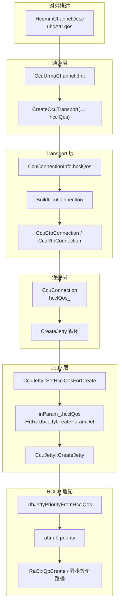
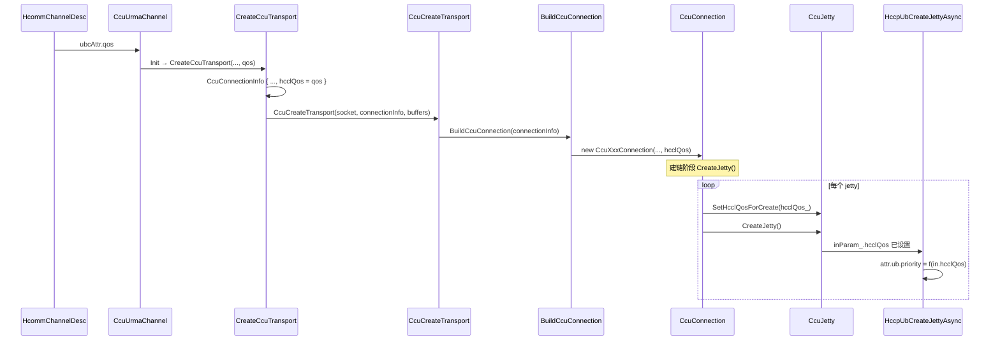

# CCU 通道：UBC QoS → RA Jetty `attr.ub.priority` 流程说明

本文描述 **hcomm Next 框架** 下，CCU URMA 通道如何将通信域 QoS（`HcommChannelDesc::ubcAttr.qos`）传递到 HCCP/RA 侧创建 UB Jetty 时的 **`attr.ub.priority`**。实现分布在 `ccu_urma_channel`、`ccu_transport`、`ccu_conn`、`ccu_jetty` 与 `hcomm_adapter_hccp` 中。

---

## 1. 适用范围与前提

| 项 | 说明 |
|----|------|
| **适用路径** | `CcuUrmaChannel` → `CcuTransport` → `CcuConnection` → `CcuJetty` → `HccpUbCreateJetty(Async)` |
| **协议** | `UBC_CTP` / `UBC_TP`（与 `LinkData` 中 `UB_CTP` / 非 CTP 对应 `CcuConnectionType`） |
| **QoS 来源** | C 侧 `HcommChannelDesc` 中 **union** 成员 `ubcAttr.qos`（与 HCCS 场景 `hccsAttr.qos` 语义对齐，见 `include/hcomm_res_defs.h`） |
| **未改路径** | Legacy `unified_platform` 下另一套 `CcuTransport::CcuConnectionInfo` / `ccu_transport_manager` 等若未同步加字段，则不走本链路 |

---

## 2. 端到端数据流（文字）

1. **通道初始化**  
   `CcuUrmaChannel::Init()` 在创建 transport 时，将 `channelDesc_.ubcAttr.qos` 作为 **`hcclQos`** 传入静态函数 `CreateCcuTransport(...)`。

2. **组装连接信息**  
   `CreateCcuTransport` 构造 `CcuTransport::CcuConnectionInfo`，除 `type / locAddr / rmtAddr / channelInfo / ccuJettys` 外，写入 **`hcclQos`** 字段。

3. **创建 Transport 与 Connection**  
   `CcuCreateTransport` → `BuildCcuConnection`：按链路类型 `new` **`CcuCtpConnection`** 或 **`CcuRtpConnection`**，构造函数最后一个参数传入 **`ccuConnectionInfo.hcclQos`**。

4. **连接对象持有 QoS**  
   基类 **`CcuConnection`** 成员 **`hcclQos_`** 在构造时赋值，供后续建链阶段使用。

5. **创建 Jetty 前写入参数**  
   `CcuConnection::CreateJetty()` 在循环中对每个 **`CcuJetty*`** 先调用 **`SetHcclQosForCreate(hcclQos_)`**，再调用 **`CreateJetty()`**。保证每次异步/同步创建前，`inParam_.hcclQos` 与当前通道一致。

6. **Jetty 入参结构**  
   **`CcuJetty::SetHcclQosForCreate`** 将 QoS 写入 **`HrtRaUbCreateJettyParam`（即 `HrtRaUbJettyCreateParamDef`）** 的 **`hcclQos`** 字段（`hcomm_adapter_hccp.h`）。`Init()` 里对 `inParam_` 的聚合初始化未显式设 `hcclQos` 时，该字段默认为 **0**。

7. **适配层映射到 RA**  
   **`HccpUbCreateJetty`** / **`HccpUbCreateJettyAsync`** 内：  
   `attr.ub.priority = UbJettyPriorityFromHcclQos(in.hcclQos)`，再调用 **`RaCtxQpCreate`** 等完成 Jetty 创建。

---

## 3. 整体流程图（Mermaid）

---

## 4. 时序图（Mermaid）

---

## 5. QoS → `priority` 映射规则

实现位于 `src/framework/next/comms/adpt/hcomm_adapter_hccp.cc` 中的 **`UbJettyPriorityFromHcclQos`**：

| `hcclQos`（`in.hcclQos`） | `attr.ub.priority` |
|---------------------------|---------------------|
| **0** | **2**（`CCU_UB_DEFAULT_JETTY_PRIORITY`，与原先硬编码默认一致） |
| **非 0** | **`hcclQos & 0xFU`**（仅低 4 位参与映射） |

同步与异步创建 Jetty 两条路径均使用同一映射函数。

---

## 6. 主要源码索引

| 阶段 | 路径 |
|------|------|
| 通道描述 QoS 字段 | `include/hcomm_res_defs.h`（`HcommChannelDesc` → `ubcAttr.qos`） |
| 传入 transport 创建 | `src/framework/next/comms/endpoint_pairs/channels/ccu/ccu_urma_channel.cc` |
| 连接信息结构 | `src/framework/next/comms/ccu/ccu_transport/ccu_transport_.h`（`CcuConnectionInfo::hcclQos`） |
| 构造 Connection | `src/framework/next/comms/ccu/ccu_transport/ccu_transport_.cc`（`BuildCcuConnection`） |
| 保存 QoS、建 Jetty 前设置 | `src/framework/next/comms/ccu/ccu_transport/ccu_conn.h` / `ccu_conn.cc` |
| 写入 `inParam_` | `src/framework/next/comms/ccu/ccu_transport/ccu_jetty_.h` / `ccu_jetty_.cc` |
| Jetty 入参定义 + RA 映射 | `src/framework/next/comms/adpt/hcomm_adapter_hccp.h` / `hcomm_adapter_hccp.cc` |

---

## 7. 与 AICPU TS URMA 通道的对比（概念）

- **AICPU** 侧通常从 `channelDesc_` 等路径取 QoS，经 `GetHccsQos` 等写入设备/资源结构（具体见 `aicpu_ts_urma_channel` 等）。
- **CCU** 侧本链路专门解决：**UBC Jetty 创建** 时 **`attr.ub.priority`** 此前固定为 2 的问题，改为由 **`ubcAttr.qos`** 驱动（0 仍表示“默认 2”）。

---

## 8. 注意事项

1. **`HcommChannelDesc` 的 union**：`ubcAttr`、`hccsAttr`、`roceAttr` 等同处一 union，调用方需保证对 **UBC 通道** 写入并读取的是 **`ubcAttr`**，避免与其他属性混用。
2. **Import Jetty**：若对端 import 路径也需要与 create 侧 priority 严格一致，需单独核对 **`HccpUbTpImportJetty`** 等是否需同步扩展（当前文档仅描述 **create** 链路）。
3. **其他入口**：未经过 `CcuUrmaChannel::Init` / 未填充 `CcuConnectionInfo.hcclQos` 的代码路径，行为仍为 **`hcclQos == 0` → priority 2**。

---

*文档版本：与仓库内 CCU QoS 透传实现一致；若后续改动映射或结构体字段，请同步更新本节与流程图。*
