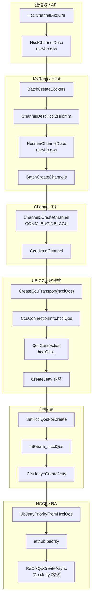
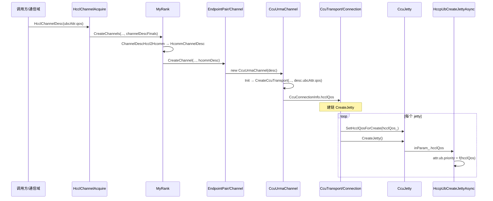

# CCU 通道：通信域 QoS → Host 框架 → UB Jetty `attr.ub.priority` 全流程

本文说明 **hcomm Next 框架** 下，从 **通信域（HcclComm / 集合通信）** 侧给出的 **UBC QoS**（`HcclChannelDesc::ubcAttr.qos`），如何在 **Host 进程内** 经 `HcommChannelDesc` 与 CCU 软件栈传递，最终在 **HCCP/RA** 创建 UB Jetty 时写入 **`attr.ub.priority`**，并由底层 **URMA/设备** 在建 Jetty 时消费。实现分布在 `coll_comm_res_c_adpt`、`my_rank`、`channel`、`ccu_urma_channel`、`ccu_transport`、`ccu_conn`、`ccu_jetty` 与 `hcomm_adapter_hccp` 中。

---

## 1. 适用范围与前提

| 项 | 说明 |
|----|------|
| **适用路径** | 集合通信 V2（`hcclComm->IsCommunicatorV2()`）下 `HcclChannelAcquire` → `MyRank::CreateChannels` → `COMM_ENGINE_CCU` → `CcuUrmaChannel` → … → `HccpUbCreateJetty(Async)` |
| **协议** | `COMM_PROTOCOL_UBC_CTP` / `COMM_PROTOCOL_UBC_TP`（与 `LinkData` 中 `UB_CTP` / 非 CTP 对应 `CcuConnectionType`） |
| **QoS 来源** | 调用方在通信域上构造的 **`HcclChannelDesc`**，在 **`channelProtocol` 为 UBC** 时使用 union 成员 **`ubcAttr.qos`**（与 HCCS 场景 `hccsAttr.qos` 语义对齐，见 `include/hccl/hccl_res.h`） |
| **未改路径** | 非 V2 communicator、或未走 `CcuUrmaChannel::Init` / 未填充 `CcuConnectionInfo.hcclQos` 的代码，行为仍为 **`hcclQos == 0` → priority 2**（见映射节） |

---

## 2. 从通信域到「应用在 Jetty 上」——分阶段说明

### 2.1 阶段 A：通信域入口（HCCL C API，Host）

1. 业务在 **Host** 调用 **`HcclChannelAcquire(HcclComm comm, CommEngine engine, const HcclChannelDesc *channelDescs, …)`**（`src/framework/next/coll_comms/api_c_adpt/coll_comm_res_c_adpt.cc`）。
2. `comm` 在 **A5 集合通信** 场景下对应 **`hcclComm->IsCommunicatorV2()`**，内部取得 **`CollComm::GetMyRank()`**。
3. 对每个 `channelDescs[i]` 先做 **`HcclChannelDescInit` + `ProcessHcclResPackReq`**，得到 **`channelDescFinals`**（补齐/校验资源包等，**不改变本链路关心的 `ubcAttr.qos` 语义**，只要调用方已按 UBC 写入 union 正确成员即可）。
4. 调用 **`myRank->CreateChannels(engine, commTag, channelDescFinals.data(), channelNum, channels)`**，后续通道创建 **全部在 Host 用户态框架** 内完成，直到 RA 创建 QP/Jetty 时才进入 **HCCP/驱动**。

**要点**：QoS 在此阶段已存在于 **`HcclChannelDesc::ubcAttr.qos`**，随 `channelDescFinals` 传入 `MyRank`，**尚未**单独做一次「只传 QoS 的下发」；它是 **通道描述符内存字段**，随创建流程一路传递。

### 2.2 阶段 B：HCCL 描述符 → Hcomm 描述符（Host，`my_rank.cc`）

1. **`MyRank::CreateChannels`** 先 **`BatchCreateSockets`**，再 **`BatchCreateChannels`**，共用同一 **`std::vector<HcommChannelDesc> hcommDescs`**。
2. 在 **`BatchCreateSockets`** 中，对每个通道执行：  
   **`hcommDescs[i] = MyRankUtils::ChannelDescHccl2Hcomm(channelDescs[i]);`**
3. **`ChannelDescHccl2Hcomm`**（`my_rank.cc`）在 **`channelProtocol == COMM_PROTOCOL_UBC_CTP || COMM_PROTOCOL_UBC_TP`** 时复制：  
   **`hcommDescs[i].ubcAttr.qos = hcclDesc.ubcAttr.qos`**。  
   RoCE 路径则复制 `roceAttr`，**不会**写 `ubcAttr`。
4. 随后 **`QueryListenPort`** 等只补全 **socket / port / role**，**不覆盖** 已拷贝的 **`ubcAttr.qos`**。

**要点**：这是 **Host 侧第一次显式把「通信域通道描述」从 HCCL ABI 结构映射到 hcomm 内部 `HcommChannelDesc`**。之后 Endpoint/Channel 层只认 **`HcommChannelDesc`**（定义见 `include/hcomm_res_defs.h`，其中 **`ubcAttr.qos`** 注释与 HCCL 对齐）。

### 2.3 阶段 C：Hcomm 通道工厂 → CCU URMA 通道（Host）

1. **`BatchCreateChannels`** 在注册内存等之后，调用 **`endpointPair->CreateChannel(epHandle, engine, reuseIdx, &hcommDescs[i], channelHandles + i)`**。
2. 经 **`EndpointPair` → `ChannelProcess::CreateChannelsLoop` → `Channel::CreateChannel`**（`src/framework/next/comms/endpoint_pairs/channels/channel.cc`）。
3. 当 **`engine == COMM_ENGINE_CCU`** 时，构造 **`CcuUrmaChannel(endpointHandle, channelDesc)`**，这里的 **`channelDesc` 是完整的 `HcommChannelDesc` 副本**，包含 **`ubcAttr.qos`**。
4. **`Channel::CreateChannel`** 末尾调用 **`channelPtr->Init()`**，进入 **`CcuUrmaChannel::Init()`**。

**要点**：从本阶段起，QoS 仍只是 **C++ 对象 `channelDesc_` 的成员**，随 **`CcuUrmaChannel`** 生命周期保存；**仍无单独 device 报文**，直到 Jetty 创建。

### 2.4 阶段 D：UB 协议栈内传递——Transport / Connection（Host）

1. **`CcuUrmaChannel::Init()`**（`ccu_urma_channel.cc`）在校验 endpoint、构造 **`LinkData`** 后调用：  
   **`CreateCcuTransport(..., channelDesc_.memHandles, channelDesc_.memHandleNum, channelDesc_.ubcAttr.qos, impl_)`**。  
   即将 **通信域侧配置的 QoS** 作为 **`hcclQos` 实参** 传入静态函数 **`CreateCcuTransport`**。
2. **`CreateCcuTransport`** 组装 **`CcuTransport::CcuConnectionInfo`**，其中除 **`type / locAddr / rmtAddr / channelInfo / ccuJettys`** 外，写入 **`hcclQos`**。
3. **`CcuCreateTransport` → `BuildCcuConnection`**（`ccu_transport_.cc`）按链路类型 **`new CcuCtpConnection(..., hcclQos)`** 或 **`CcuRtpConnection(..., hcclQos)`**。
4. 基类 **`CcuConnection`** 成员 **`hcclQos_`** 在构造函数中赋值，供建链阶段使用。

**要点**：这里把 **「UBC 通道 QoS」** 绑定到 **逻辑连接对象**；**CTP/RTP** 两条连接类型 **均** 传入同一 **`hcclQos`**，与历史提交「RTP CTP QOS 下发」一致。

### 2.5 阶段 E：写入 Jetty 创建入参并调用 HCCP（Host → RA/设备语义边界）

1. **`CcuConnection::CreateJetty()`**（`ccu_conn.cc`）在创建每个 **`CcuJetty*`** 前调用：  
   **`ccuJettys_[i]->SetHcclQosForCreate(hcclQos_)`**，再 **`CreateJetty()`**。
2. **`CcuJetty::SetHcclQosForCreate`**（`ccu_jetty_.cc`）设置 **`inParam_.hcclQos`**（类型为适配层 **`HrtRaUbCreateJettyParam` / `HrtRaUbJettyCreateParamDef`** 中的字段，见 `hcomm_adapter_hccp.h`）。  
   **`CcuJetty::Init()`** 聚合初始化 **`inParam_`** 时若未设 **`hcclQos`**，默认为 **0**。
3. **`CcuJetty::CreateJetty` → `HandleAsyncRequest`**：本链路 **只调用** **`HccpUbCreateJettyAsync`**。首次调用提交异步创建并返回 **`HCCL_E_AGAIN`**，后续在状态机轮询中再次进入，直到 **`HccpGetAsyncReqResult`** 完成后再 **`ParseCreateInfo`**。  
   **说明**：适配层另有同步封装 **`HccpUbCreateJetty`**（供 **`ccu_comp.cc`** 环回等路径使用），**`CcuJetty` 内不走同步接口**；二者 QoS→priority 映射相同，见 §2.6。

**要点**：**`inParam_.hcclQos`** 是 **传入 HCCP/RA 创建接口的最后一层 Host 侧字段**；之后由适配层转为 **`QpCreateAttr::ub.priority`**。

### 2.6 阶段 F：适配层映射并在 UB 属性上「应用」（HCCP → RA）

1. **`HccpUbCreateJetty`** 与 **`HccpUbCreateJettyAsync`**（`hcomm_adapter_hccp.cc`）中均执行：  
   **`attr.ub.priority = UbJettyPriorityFromHcclQos(in.hcclQos)`**。
2. **同步**：**`HccpUbCreateJetty`** 内调用 **`RaCtxQpCreate(ctxHandle, &attr, &info, &qpHandle)`**，一次返回创建结果。  
   **异步**（**`CcuJetty` 所用**）：**`HccpUbCreateJettyAsync`** 内调用 **`RaCtxQpCreateAsync(ctxhandle, &attr, QpCreateInfo 缓冲, &jettyHandle, &raReqHandle)`**，由调用方轮询异步请求完成后再解析 **`QpCreateInfo`**。  
   两种 RA 接口使用的 **`attr.ub`** 含义相同，**`priority`** 由硬件/驱动栈在 **建链资源** 上消费。
3. 平台侧（如 `rs_ub.c` 中 **`RsUbJettyCbInit`**）会将 **`jettyAttr->ub.priority`** 记入 **`jettyCb->priority`** 等，供后续 UDMA/UB 路径使用。

**要点**：**「传到 Jetty」** 在软件上表现为：**创建 Jetty 时把 priority 写入 `CtxQpAttr`**；**「最后应用」** 表现为：**RA/URMA 创建设备侧 Jetty 资源时携带该 priority**，而非用户态再二次设置。

---

## 3. 端到端数据流（与第 2 节对应的一览）

1. **通信域**：`HcclChannelAcquire` 收到 **`HcclChannelDesc::ubcAttr.qos`**（UBC 通道）。
2. **Host 转换**：`ChannelDescHccl2Hcomm` → **`HcommChannelDesc::ubcAttr.qos`**。
3. **通道对象**：`CcuUrmaChannel` 保存 **`channelDesc_`**，`Init` 时 **`channelDesc_.ubcAttr.qos` → CreateCcuTransport 的 `hcclQos`**。
4. **连接对象**：`CcuConnectionInfo.hcclQos` → **`CcuConnection::hcclQos_`**。
5. **Jetty 入参**：`SetHcclQosForCreate` → **`inParam_.hcclQos`**。
6. **UB / RA**：`UbJettyPriorityFromHcclQos` → **`attr.ub.priority`** → **`RaCtxQpCreateAsync`**（**`CcuJetty` 路径**；其它路径可能为 **`RaCtxQpCreate`**）。

---

## 4. 整体流程图（Mermaid）

---

## 5. 时序图（Mermaid）

---

## 6. QoS → `priority` 映射规则

实现位于 `src/framework/next/comms/adpt/hcomm_adapter_hccp.cc` 中的 **`UbJettyPriorityFromHcclQos`**：

| `hcclQos`（`in.hcclQos`） | `attr.ub.priority` |
|---------------------------|---------------------|
| **0** | **2**（`CCU_UB_DEFAULT_JETTY_PRIORITY`，与原先硬编码默认一致） |
| **非 0** | **`hcclQos & 0xFU`**（仅低 4 位参与映射） |

**`HccpUbCreateJetty`**（同步）与 **`HccpUbCreateJettyAsync`**（异步）均使用同一映射函数；**CCU Transport 的 `CcuJetty` 仅走异步**。

---

## 7. 主要源码索引

| 阶段 | 路径 |
|------|------|
| 通信域入口 | `src/framework/next/coll_comms/api_c_adpt/coll_comm_res_c_adpt.cc`（`HcclChannelAcquire`） |
| HCCL 通道描述 QoS 字段 | `include/hccl/hccl_res.h`（`HcclChannelDesc` → `ubcAttr.qos`） |
| HCCL → Hcomm 拷贝 | `src/framework/next/coll_comms/rank/my_rank.cc`（`ChannelDescHccl2Hcomm`、`BatchCreateSockets`） |
| Hcomm 描述 | `include/hcomm_res_defs.h`（`HcommChannelDesc` → `ubcAttr.qos`） |
| CCU 通道构造 | `src/framework/next/comms/endpoint_pairs/channels/channel.cc` |
| 传入 transport 创建 | `src/framework/next/comms/endpoint_pairs/channels/ccu/ccu_urma_channel.cc` |
| 连接信息结构 | `src/framework/next/comms/ccu/ccu_transport/ccu_transport_.h`（`CcuConnectionInfo::hcclQos`） |
| 构造 Connection | `src/framework/next/comms/ccu/ccu_transport/ccu_transport_.cc`（`BuildCcuConnection`） |
| 保存 QoS、建 Jetty 前设置 | `src/framework/next/comms/ccu/ccu_transport/ccu_conn.h` / `ccu_conn.cc` |
| 写入 `inParam_` | `src/framework/next/comms/ccu/ccu_transport/ccu_jetty_.h` / `ccu_jetty_.cc` |
| Jetty 入参定义 + RA 映射 | `src/framework/next/comms/adpt/hcomm_adapter_hccp.h` / `hcomm_adapter_hccp.cc` |

---

## 8. 与 AICPU TS URMA 通道的对比（概念）

- **AICPU** 侧通常从 `channelDesc_` 等路径取 QoS，经 `GetHccsQos` 等写入设备/资源结构（具体见 `aicpu_ts_urma_channel` 等）。
- **CCU** 侧本链路专门解决：**UBC Jetty 创建** 时 **`attr.ub.priority`** 此前固定为 2 的问题，改为由 **`ubcAttr.qos`** 驱动（0 仍表示「默认 2」）。

---

## 9. 注意事项

1. **`HcclChannelDesc` / `HcommChannelDesc` 的 union**：`ubcAttr`、`hccsAttr`、`roceAttr` 等同处一 union，调用方需保证对 **UBC 通道** 写入并读取的是 **`ubcAttr`**，避免与其他属性混用。
2. **Import Jetty**：若对端 import 路径也需要与 create 侧 priority 严格一致，需单独核对 **`HccpUbTpImportJetty`** 等是否需同步扩展（当前文档侧重 **create** 链路）。
3. **其他入口**：未经过 `CcuUrmaChannel::Init` / 未填充 `CcuConnectionInfo.hcclQos` 的代码路径，行为仍为 **`hcclQos == 0` → priority 2**。

---

*文档版本：与仓库内当前源码一致；若后续改动映射或结构体字段，请同步更新本节与流程图。*
