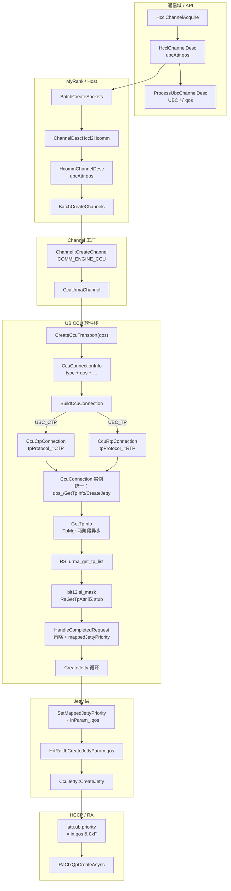
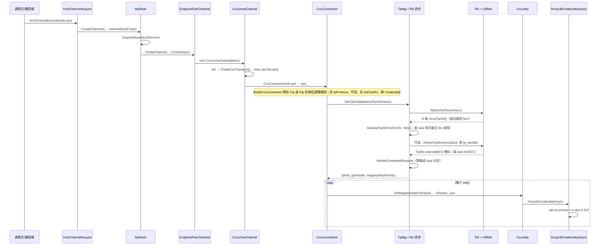

# CCU 通道：通信域 QoS → Host 框架 → UB Jetty `attr.ub.priority` 全流程

本文说明 **hcomm Next** 下，从 **通信域** 配置的 QoS 到 **`HccpUbCreateJetty(Async)`** 写入 **`attr.ub.priority`** 的完整数据与控制流。

**核心链路（与当前 `tp_mgr.cc` 一致）**：

1. **`get_tp_list`（N 条 `HccpTpInfo`）** → **`StartGetTpAttrForFirstTp`**：请求 **`tpAttrBitmap` 的 bit12**（扩展语义：16bit **SL 可用掩码**落在 **`struct TpAttr` 的 `reserved[0]`、`reserved[1]`**，见 `hccp_tp.h`；**非** URMA 文档 bit10 的 4bit `sl` 字段）。
2. **掩码 `M = popcount16(slMask)`**；**`K = min(N, mSl)`**（`mSl` 由 `slLevelCount` 与 `M` 取 min 等，见 `ApplyUbcQosTpSlPolicy`）。
3. **`ApplyUbcQosTpSlPolicy`**：普通连接按 **`param.qos & 7`** 在掩码内选 rank → **`mappedSl`**；**`loopFirstTpLowestSl == true`**（环回）在策略内**早退**：固定 **`tpListIndex = 0`**，**`mappedSl = SlValueAtRankInMask16(slMask, 0)`**，**不**按 qos 算 slot。
4. **`mappedJettyPriority`**：**由编译期开关 `kMapHcclQosToJettyPriority1to1` 决定**——**`true`** 时 **`param.qos & 7` 与 Jetty priority 一一对应**；**`false`** 时为 **`mappedSl & 0xF`**（与掩码/策略强相关，可能出现「通信域 qos=5 但 `attr.ub.priority=2`」）。
5. **`CcuJetty::SetMappedJettyPriority` → `HrtRaUbCreateJettyParam::qos` → `attr.ub.priority = in.qos & 0xFU`**（`hcomm_adapter_hccp.cc`）。

实现主要分布在 **`coll_comm`**（通信域 `hcclQos` 与环回 qos 同步）、**`coll_comm_res_c_adpt`**、**`comm_config`**、**`my_rank`**、**`channel`**、**`ccu_urma_channel`**、**`ccu_transport`**、**`tp_mgr`**、**`ccu_comp`**（环回 **`GetTpInfoParam`**）、**`ccu_conn`**、**`ccu_jetty`**、**`hcomm_adapter_hccp`**；**Legacy** 侧对称逻辑见 **`tp_manager.cc`**（Hccl 命名空间）。

**§10** 汇总了与「日志 qos 与 priority 不一致」「环回默认 4」等相关的**近期演进与开关**，便于对照提交历史。

---

## 0. 术语与字段对照（避免与 `hcclQos` 混淆）

| 层次 | 名称（代码） | 含义 |
|------|----------------|------|
| HCCL 通信域配置 | **`CommConfig::GetConfigHcclQos()`**、ABI **`hcclQos`** | 用户/配置侧的 **HCCL QoS**，可为 **`HCCL_COMM_QOS_CONFIG_NOT_SET`** |
| 通道描述（HCCL） | **`HcclChannelDesc::ubcAttr.qos`** | UBC CTP/TP 的 **uint32_t**，可与 **`INVALID_UINT`** 表示「未填」 |
| 通道描述（hcomm） | **`HcommChannelDesc::ubcAttr.qos`** | **`ChannelDescHccl2Hcomm`** 逐字段拷贝 |
| CCU Transport 入参 | **`CreateCcuTransport(..., uint32_t qos, ...)`**（`ccu_urma_channel.cc` **静态函数**） | **无** `hcclQos` 形参；实参为 **`channelDesc_.ubcAttr.qos`** |
| 连接对象 | **`CcuConnectionInfo::qos`** → **`CcuConnection::qos_`** | 与通道侧 **`ubcAttr.qos`** 一致传入 |
| 通信域写入 `CommConfig` | **`CollComm::Init`** 中 **`config_.SetConfigHcclQos(config->hcclQos)`**（`coll_comm.cc`） | 供 **`GetConfigHcclQos()`**、`ProcessUbcChannelDesc` 与 **环回 `SetLoopGetTpInfoQos`** 使用 |
| 环回 TpMgr 入参 | **`CcuComponent::loopGetTpInfoQos_`** ← **`SetLoopGetTpInfoQos`**（`ccu_comp`） | **`CollComm::Init`** 在构造 **`MyRank`** 之前按 **`GetConfigHcclQos()`**（未配置则 **`UB_QOS_DEFAULT`**）写入，**`MakeLoopGetTpInfoParam(commAddr, qos)`** 填入 **`param.qos`** |
| TpMgr 策略输入 | **`GetTpInfoParam::qos`** | **对端连接**：**`qos_ > 7`** → **`UB_QOS_DEFAULT`**，否则 **`qos_ & 7`**。**环回**：来自 **`loopGetTpInfoQos_`** |
| Jetty 创建结构体 | **`HrtRaUbCreateJettyParam::qos`** | 通常来自 **`TpInfo::mappedJettyPriority & 0xF`**；适配层写入 **`attr.ub.priority`** |

**说明**：仓库中其它 **`hcclQos`**（如 **`SetHcclQos`**、**`hcclQos_`**、AICPU SQE）属于 **调度器/通信域 API**，**不是** `CreateCcuTransport` 的参数名。

---

## 1. 适用范围与前提

| 项 | 说明 |
|----|------|
| **适用路径** | 集合通信 V2（`hcclComm->IsCommunicatorV2()`）下 **`HcclChannelAcquire` → `MyRank::CreateChannels` → `COMM_ENGINE_CCU` → `CcuUrmaChannel` → … → `HccpUbCreateJettyAsync`** |
| **协议** | **`COMM_PROTOCOL_UBC_CTP` / `COMM_PROTOCOL_UBC_TP`**（与 **`LinkData`** 中 **`UB_CTP` / 非 CTP** 对应 **`CcuConnectionType::UBC_CTP` / `UBC_TP`**） |
| **QoS 来源** | **`HcclChannelDesc`** 在 UBC 协议下使用 **`ubcAttr.qos`**（union 成员，见 **`include/hccl/hccl_res.h`**） |
| **未走本文链路** | 非 V2、或未走 **`CcuUrmaChannel::Init`**、或未正确填充 **`CcuConnectionInfo.qos`** 等，**不适用**下文成功条件 |
| **Next 成功条件** | **`TpMgr::GetTpInfo` 成功** 且 **`tpInfo_.hasMappedJettyPriority == true`**，否则 **`CcuConnection::CreateJetty`** 返回 **`HCCL_E_INTERNAL`**（见 §2.6） |
| **通信域写入 `ubcAttr.qos`** | **`ProcessUbcChannelDesc`**（`coll_comm_res_c_adpt.cc`）：协议为 **UBC CTP/TP** 时即覆盖 **`channelDescFinal.ubcAttr.qos`**：若 **`channelDesc.ubcAttr.qos == INVALID_UINT`**，则 **`GetConfigHcclQos() == HCCL_COMM_QOS_CONFIG_NOT_SET`** 时用 **`EnvConfig::UB_QOS_DEFAULT`**，否则用 **`GetConfigHcclQos()`**；若调用方已显式写 **`ubcAttr.qos`**（非 **`INVALID_UINT`**），则 **保留调用方值**。 |
| **连接侧与 TpMgr** | **`CcuConnection::MakeGetTpInfoParam`** 填写 **`qos`** 等；**`TpMgr`** 依赖 **`get_tp_list` + bit12 掩码（§2.5.3b，可为 stub）+ `ApplyUbcQosTpSlPolicy`**；**`mappedJettyPriority`** 另见 **`kMapHcclQosToJettyPriority1to1`**（§10）。**`CommAddr`** 需与 **`GetTpCfg`/RS** 一致。 |

---

## 2. 从通信域到「应用在 Jetty 上」——分阶段说明

### 2.1 阶段 A：通信域入口（HCCL C API，Host）

1. **`HcclChannelAcquire(HcclComm comm, CommEngine engine, const HcclChannelDesc *channelDescs, …)`**（`coll_comm_res_c_adpt.cc`）。
2. V2 场景下取得 **`CollComm::GetMyRank()`**。
3. **`HcclChannelDescInit` + `ProcessHcclResPackReq`** → **`channelDescFinals`**（资源包处理；**若已走 `ProcessUbcChannelDesc`，`ubcAttr.qos` 按 §1 规则已写入 final**）。
4. **`myRank->CreateChannels(...)`** — 后续在 Host 用户态直至 RA 创建 Jetty。

**要点**：**`ubcAttr.qos`** 随 **`channelDescFinals`** 传递；语义见 §1 **`ProcessUbcChannelDesc`**。

### 2.2 阶段 B：HCCL → Hcomm（`my_rank.cc`）

1. **`BatchCreateSockets`** / **`BatchCreateChannels`** 共用 **`std::vector<HcommChannelDesc> hcommDescs`**。
2. **`hcommDescs[i] = MyRankUtils::ChannelDescHccl2Hcomm(channelDescs[i])`**。
3. UBC CTP/TP：**`hcommDescs[i].ubcAttr.qos = hcclDesc.ubcAttr.qos`**；RoCE 只拷贝 **`roceAttr`**。
4. **`QueryListenPort`** 等 **不覆盖** **`ubcAttr.qos`**。

**要点**：**`HcommChannelDesc`** 定义见 **`include/hcomm_res_defs.h`**。

### 2.3 阶段 C：通道工厂 → `CcuUrmaChannel`（`channel.cc`）

1. **`endpointPair->CreateChannel(..., &hcommDescs[i], ...)`** → **`Channel::CreateChannel`**。
2. **`engine == COMM_ENGINE_CCU`** → **`CcuUrmaChannel(endpointHandle, channelDesc)`**，保留完整 **`HcommChannelDesc`**（含 **`ubcAttr.qos`**）。
3. **`channelPtr->Init()`** → **`CcuUrmaChannel::Init()`**。

### 2.4 阶段 D：Transport / Connection（`ccu_urma_channel.cc` + `ccu_transport_.cc`）

1. **`CcuUrmaChannel::Init()`** 调用 **`CreateCcuTransport(ccuEndpoint, linkData, socket, memHandles, memHandleNum, channelDesc_.ubcAttr.qos, impl_)`**。  
   - 函数签名为 **`uint32_t qos`**（**不是** `hcclQos`）。
2. **`CcuTransport::CcuConnectionInfo{ type, locAddr, rmtAddr, channelInfo, ccuJettys, qos }`**。
3. **`BuildCcuConnection`**：**`new CcuCtpConnection(..., qos)`** 或 **`CcuRtpConnection(..., qos)`**（子类构造里 **`tpProtocol_`** 已设为 **CTP/RTP**），再 **`CcuConnection::Init()`**：取本端 **RDMA Ctx**、**die**、**CCU RMA buffer/token**、**`innerStatus_ = INIT`** 等——**到这一步为止都不会调用 `GetTpInfo`**。
4. **`CcuCreateTransport`** 创建 **`CcuTransport`** 并 **`CcuTransport::Init()`**：申请 **cke/xn**，**`transStatus_ = TransStatus::INIT`**——**仍然没有 `GetTpInfo`**。

#### 2.4.1 实例建好以后，怎么才进到 `GetTpInfo`？

**要点**：**`GetTpInfo` 不在 `CcuConnection::Init()` 里调**，而是由**上层反复查通道状态**时，经 **Transport 状态机**间接推进到 **`CcuConnection::GetStatus()` → `UpdateInitStatus()` → `GetTpInfo()`**。

**调用链（Next，`ccu_urma_channel` / `ccu_transport` / `ccu_conn` / `channel_process`）**：

1. **`ChannelProcess::ConnectChannels`**（或等价路径）里 **`while` 轮询** **`ChannelGetStatus`**。  
2. **`ChannelGetStatus`**：对每个 **`ChannelHandle`** 调 **`channel.GetStatus()`**（**`channel_process.cc`**）。  
3. **`CcuUrmaChannel::GetStatus()`** → **`impl_->GetStatus()`**，即 **`CcuTransport::GetStatus()`**（**`ccu_urma_channel.cc`**）。  
4. **`CcuTransport::GetStatus()`** → **`StatusMachine()`**（**`ccu_transport_.cc`**）。当 **Socket** 已为 **`OK`** 且 **`transStatus_ == INIT`** 时，进入 **`case INIT`**：**`ccuConnection_->GetStatus()`**。  
5. **`CcuConnection::GetStatus()`**（**`ccu_conn.cc`**）：若尚未 **CONNECTED/INVALID**，则 **`StatusMachine()`** → **`UpdateInitStatus()`**。  
6. **`UpdateInitStatus()`** 在 **`innerStatus_` 为 `INIT` 或 `TP_INFO_GETTING`** 时调用 **`GetTpInfo()`**；**`TpMgr::GetTpInfo` 返回 `HCCL_E_AGAIN`** 时置 **`innerStatus_ = TP_INFO_GETTING`**，**下一轮** **`ConnectChannels` 再 poll** 时会**再次**进入 **`GetTpInfo()`**，直到成功或失败。

**因此**：从 **`CcuConnection` 实例**到 **`TpMgr`**，中间隔着 **`CcuTransport` + Socket 就绪 + 上层 `ChannelGetStatus` 轮询`**；**不是**「`Init` 返回后立刻同步进 `TpMgr`」。

**读代码时的直觉**：**「构造」与 `GetTpInfo` 之间的“距离感”**，主要来自 **（1）`TpMgr`/RA 侧两阶段异步**（列表 + 属性）以及 **（2）`ConnectChannels` 对 `ChannelGetStatus` 的轮询**——容易让人觉得 **`qos` 链断了，其实没有**；**`qos_` 已在连接对象上**，只是 **`GetTpInfo` 被推迟到** Socket 就绪且状态机跑到 **`UpdateInitStatus`** 时才消费它（**`MakeGetTpInfoParam()` → `param.qos`**）。

### 2.5 阶段 D′：`TpMgr::GetTpInfo`、TP 列表与 QoS→SL（`tp_mgr.cc` / `tp_mgr.h`）

策略与工具函数在 **`tp_mgr.cc`** 匿名命名空间：**`ApplyUbcQosTpSlPolicy`**、**`ReadSlAvailableMask16`**、**`SlValueAtRankInMask16`**、**`SlLevelCountFromSlAvailableField`** 等。

#### 2.5.0 符号 N、M、K

**勿与「同一链路上多个通信域」的个数混淆；§2.5.0 的 N 仅指 `get_tp_list` 返回的 TPID 条数。**

| 符号 | 含义（与代码一致） |
|------|---------------------|
| **N** | **`urma_get_tp_list`** 返回的 **TPID 条数**（**`tpInfoNum`**）。 |
| **M** | 对 **列表下标 0** 的 **`tp_handle`** 做 **`get_tp_attr`**（或见下 **stub**），请求 **`attrBitmap` 仅 `(1 << 12)`**。应答中 **16bit 掩码**由 **`TpAttr.reserved[0] | (reserved[1] << 8)`** 解析（**`ReadSlAvailableMask16`**）。**bit i = 1 ⇒ 可选用 SL = i**。**M = popcount(掩码)**，上限 **16**。 |
| **K** | **`min(N, M)`**（**`usableSlotCount`**），策略在该范围内选 **TP 下标** 与 **SL**。 |

**`N` 与「能否建链」**：**正常、可用的 UBC CCU 链路上约定 `N ≥ 1`**——没有 TPID 就无法走后续 QoS→SL 与 Jetty。**`N = 0`**（空列表）只应视为 **异常**（例如 RS 未就绪、**`CommAddr`/EID 与管控不一致**、环境未下发 TP 等）。**源码层具体措施**见 **§2.5.3c**（**`tp_mgr.cc`** / Legacy **`tp_manager.cc`** 对称）。

**`tpInfo_.tpHandle`**：**`baseInfoPtr[tpListIndex].tpHandle`**，**`tpListIndex`** 由 **`ApplyUbcQosTpSlPolicy`** 给出。**`loopFirstTpLowestSl`** 时策略内固定 **`tpListIndex = 0`**、**`mappedSl = SlValueAtRankInMask16(slMask, 0)`**。**`mappedJettyPriority`** 另见 **`kMapHcclQosToJettyPriority1to1`**（§10）：为 **`true`** 时与 **`mappedSl`** 解耦，直接取 **`param.qos & 7`**。

#### 2.5.1 建链状态顺序（`ccu_conn.cc`）

**谁在驱动**：见 **§2.4.1**（**`GetTpInfo` 由 `GetStatus` 轮询触发**，非 **`Init` 内**）。

1. **`UpdateInitStatus`**：**`INIT` / `TP_INFO_GETTING`** 先 **`GetTpInfo()``**；**`HCCL_E_AGAIN`** → 保持 **`TP_INFO_GETTING`**。
2. **`GetTpInfo` 成功** 后 **`CreateJetty()``**；异步 Jetty → **`JETTY_CREATING`**。
3. **`jettyImportCfg_.localTpHandle = tpInfo_.tpHandle`**（成功返回后）。

**注意**：**`CcuConnection::GetTpInfo`** 在 **`TpMgr::GetTpInfo` 返回非 `HCCL_SUCCESS` 且非 `AGAIN` 时，统一打日志并返回 `HCCL_E_NETWORK`**（**不**向状态机上层透传 **`HCCL_E_INTERNAL`**）。排障需结合 **`TpMgr` 日志**。

#### 2.5.2 `GetTpInfoParam`（`MakeGetTpInfoParam`）

| 字段 | **`CcuConnection` 当前赋值** |
|------|------------------------------|
| **`locAddr` / `rmtAddr` / `tpProtocol_`** | 与连接一致（**CTP / RTP**）。 |
| **`qos`** | **`qos_ > 7` → `EnvConfig::UB_QOS_DEFAULT`，否则 `qos_ & 7`**。 |
| **`slLevelCount`** | **`0`**：M 全由 **`sl_available`** 得出；若将来非 0，**`tp_mgr`** 与 M **取 min** 作为 **`mSlLevels` 上限**。 |
| **`loopFirstTpLowestSl`** | **`false`**（普通连接）；**`true`** 仅环回 **`MakeLoopGetTpInfoParam`**（§2.6）。 |

**缓存键**：**`(locIp, rmtIp, TpInfoCacheKey)`**，**`TpInfoCacheKey = param.qos & 0xFF`**。

#### 2.5.2a 多通信域与复用

同一 **(locIp, rmtIp, tpProtocol, qos)** 应命中 **`TpMgr` 缓存**，复用同一 **`tpHandle`** 与 **`mappedJettyPriority`**；**`ReleaseTpInfo`** 与 **`GetTpInfo`** 的 **`GetTpInfoParam`** 须一致。

#### 2.5.2c 平台约定（列表与 `sl_available`）

1. **`get_tp_list`** 在相同链路身份下 **N 与 TPID 集合稳定**。  
2. **首 TPID 的 `sl_available` 掩码稳定**。  
3. **`tp_mgr` 注释**假定 **`get_tp_list` 下标与 SL 升序档位对齐**；**具体 SL 数值** 仍以 **`sl_available` 掩码 + `SlValueAtRankInMask16`** 为准。

#### 2.5.3 第一段异步：TP 列表

**`GetTpInfoAsync`**：**`RaGetTpInfoListAsync`** → HDC → RS → **`urma_get_tp_list`**；完成回调 **`RaHdcAsyncHandleTpInfoList`** 将列表写入 **`RequestCtx.dataBuffer`**，**`*num = N`**。

#### 2.5.3b 第二段：`get_tp_attr`（bit12）与 `sl_available` 掩码

**条件（成功路径）**：**`N ≥ 1`** 且列表阶段完成后，进入 **`StartGetTpAttrForFirstTp`**（**`tp_mgr.cc`**）。**本段不读取、也不写入 `param.qos`**；QoS 仅在后续 **`ApplyUbcQosTpSlPolicy` / `HandleCompletedRequest`** 使用。

**两种实现路径（由 `kSkipRaGetTpAttrStubSlAvailable` 控制，当前默认 `true`）**：

| 开关 | 行为 |
|------|------|
| **`true`（stub）** | **不调用** **`RaGetTpAttrAsync`**；在 **`TpAttr.reserved[0/1]`** 写入临时掩码 **`0x007C`**（bit2–6），**`reqCtx.handle = 0`**，**`phase = WAIT_TP_ATTR`**，由 **`CheckRequestResult(0)`** 视为立即完成。用于 URMA 头文件仅定义 bitmap 0–11、**bit12 依赖驱动扩展**且 RS 可能未就绪的场景。 |
| **`false`** | **`RaGetTpAttrAsync(ctx, firstTpHandle, &tpAttrBitmap, &tpAttr, ...)`**，真正向 RS 拉 **bit12** 回填的 **`reserved[0/1]`**。 |

**`HandleCompletedRequest`** 中：**`slMask = ReadSlAvailableMask16(tpAttr)`**；若 **`mPop == 0`**（RS 未回填），再次写入 **`0x007C` 兜底**；仍为空则 **`HCCL_E_INTERNAL`**。随后 **`ApplyUbcQosTpSlPolicy`**；最后 **`mappedJettyPriority`** 见 **`kMapHcclQosToJettyPriority1to1`**（§10）。

**`N = 0`** 见 **§2.5.3c**，不进入本段成功语义。

#### 2.5.3c `N = 0`（`tpInfoNum == 0`）时源码行为

对应 **`TpMgr::GetTpInfo`**（**`tp_mgr.cc`**；Legacy **`TpManager::GetTpInfo`** 语义一致）。

| 步骤 | 行为 |
|------|------|
| **第一段列表完成**（**`reqPhase == kWaitList`**） | **`if (reqCtx.tpInfoNum > 0U)`** 为假 → **不调用** **`StartGetTpAttrForFirstTp`**，**不发起** **`RaGetTpAttrAsync`**，**`reqPhase` 保持 `kWaitList`**（不会进入 **`kWaitTpAttr`**）。 |
| **收尾** | 照常从 **`ReqCtxMap`** **erase** 本次请求上下文；**`pipelineRet`** 仍为成功时进入 **`HandleCompletedRequest`**。 |
| **`HandleCompletedRequest`** | 首部 **`if (tpInfoNum == 0)`**：打 **`HCCL_WARNING`**（日志含 **`tpInfoNum is 0`**），返回 **`HCCL_E_NOT_FOUND`**；**不**读 **`dataBuffer`** 条目、**不**解析 **`sl_available`**、**不**写 **`mappedJettyPriority`**。 |
| **缓存** | **不**向 **`InfoCtxMap`** 写入成功 **`TpInfo`**（无可用 **`tpHandle`**）。 |
| **连接侧** | **`CcuConnection::GetTpInfo`** 对非 **`AGAIN`/成功** 的返回多表现为 **`HCCL_E_NETWORK`**（§2.5.1），排障需看 **`TpMgr`** 上述 **WARNING**。 |

#### 2.5.4 `ApplyUbcQosTpSlPolicy`（`tp_mgr.cc` 匿名命名空间）

**仍被调用**（含环回）；环回在函数**内部早退**：

- **`param.loopFirstTpLowestSl == true`**：**`tpListIndexOut = 0`**，**`mappedSlOut = SlValueAtRankInMask16(slMask, 0)`**，**不使用** **`param.qos`** 计算 slot。
- **否则**：**`k = min(nTp, mSl)`**，**`numGroups = min(8, k)`**，**`groupIdx = ((param.qos & 7) * numGroups) / 8`**，**`slotIdx = (groupIdx * k) / numGroups`**，**`mappedSlOut = SlValueAtRankInMask16(slMask, slotIdx)`**，**`tpListIndexOut = slotIdx`**。

**失败**：**`mPop==0`**、**`nTp==0`** 等与 **`return false`** → **`HandleCompletedRequest`** 返回 **`HCCL_E_INTERNAL`**。

### 2.6 阶段 E：Jetty 入参与 HCCP（`ccu_conn` / `ccu_jetty_.cc` / `ccu_comp.cc`）

1. **`CreateJetty`**：**`CHK`** **`tpInfo_.hasMappedJettyPriority`**，否则 **`HCCL_E_INTERNAL`**。  
2. 每 **`CcuJetty`**：**`SetMappedJettyPriority(tpInfo_.mappedJettyPriority)`** → **`inParam_.qos = priority & 0xFU`**。  
3. **`CcuJetty::Init()`**：**`HrtRaUbCreateJettyParam`** 默认成员 **`qos = EnvConfig::UB_QOS_DEFAULT`**；**创建前** 由 **`SetMappedJettyPriority`** 覆盖。  
4. **`CcuJetty::CreateJetty`**：**`HccpUbCreateJettyAsync`**，轮询 **`HccpGetAsyncReqResult`**。  
5. **环回公共 Jetty（`ccu_comp.cc`）**：**`GetLoopTpInfo` → `RequestNewLoopTpInfo`** 使用 **`MakeLoopGetTpInfoParam(commAddr, loopGetTpInfoQos_)`**：**`locAddr = rmtAddr = commAddr`**，**`tpProtocol = RTP`**（**`LOOP_JETTY_PROTOCOL`**），**`param.qos = loopGetTpInfoQos_ & 7`**，**`loopFirstTpLowestSl = true`**。**`loopGetTpInfoQos_`** 由 **`CollComm::Init`** 在构造 **`MyRank`** 之前调用 **`CcuComponent::SetLoopGetTpInfoQos`** 同步（与 **`GetConfigHcclQos()`** / **`HCCL_COMM_QOS_CONFIG_NOT_SET` → UB_QOS_DEFAULT** 一致）。**`CreateAndImportLoopJettys`** 中 **`HccpUbCreateJetty`** 的 **`req.qos`** 取自 **`loopTpInfo.mappedJettyPriority`**（与对端路径相同，最终来自 **`TpMgr`**）。

### 2.7 阶段 F：适配层（`hcomm_adapter_hccp.cc`）

**`HccpUbCreateJetty` / `HccpUbCreateJettyAsync`**：**`attr.ub.priority = in.qos & 0xFU`**（**无**其它分支）。

---

## 3. 端到端一览

1. **`CollComm::Init`**：**`config_.SetConfigHcclQos`**（若传入 **`HcclCommConfig`**）+ **`CcuComponent::SetLoopGetTpInfoQos`**（环回 **`GetTpInfoParam::qos`**，见 §2.6）。  
2. **`ProcessUbcChannelDesc`**（UBC CTP/TP）：按 §1 规则写 **`channelDescFinal.ubcAttr.qos`**（依赖 **`GetConfigHcclQos()`**）。  
3. **`ChannelDescHccl2Hcomm`** → **`HcommChannelDesc.ubcAttr.qos`**。  
4. **`CcuUrmaChannel::Init`**：**`CreateCcuTransport(..., channelDesc_.ubcAttr.qos, ...)`**。  
5. **`CcuConnectionInfo.qos` → `qos_`**。  
6. **`TpMgr::GetTpInfo`**：列表异步 → **`StartGetTpAttrForFirstTp`**（bit12 / stub 见 §2.5.3b）→ **`HandleCompletedRequest`**（**`ApplyUbcQosTpSlPolicy` + `mappedJettyPriority`**，见 §10）。  
7. **`SetMappedJettyPriority` → `inParam_.qos`** → **`HccpUbCreateJetty(Async)`** → **`attr.ub.priority`**。

---

## 4. 整体流程图（Mermaid）

**`CcuCtpConnection` / `CcuRtpConnection` 只在 `BuildCcuConnection` 构造时二选一**（由 **`CcuConnectionInfo.type`**：`UBC_CTP` / `UBC_TP` 决定），子类仅设置 **`tpProtocol_`（CTP / RTP）**。**构造完成、`Init` 之后** 无第二套业务分叉：**`GetTpInfo` → `CreateJetty`** 等均在基类 **`CcuConnection`** 中执行；与 RS 的差异仅体现在 **`MakeGetTpInfoParam().tpProtocol_`** → **`TpMgr` / `GetTpCfg` 的 ctp、rtp 标志及独立缓存**，而不是图上再画两条并行「连接逻辑」。

**图注**：**成功建链路径上 `N≥1`**，故 **`urma_get_tp_list` → `GATTR`** 表示第二段（**真实 `get_tp_attr` 或 stub**，见 §2.5.3b）。**`N=0`** 时 **不经过 `GATTR`**，**`HandleCompletedRequest` → `HCCL_E_NOT_FOUND`**，见 **§2.5.3c**。

---

## 5. 时序图（Mermaid）

**说明**：**正常路径 `N≥1`**。**第二段**在 **`kSkipRaGetTpAttrStubSlAvailable`** 为 **`true`** 时可能**无**对 RS 的 **`RaGetTpAttrAsync`**（stub 掩码）。**`tpInfoNum==0`** 时 **不发起**第二段，**`HandleCompletedRequest` → `HCCL_E_NOT_FOUND`**，见 **§2.5.3c**。

---

## 6. `HrtRaUbCreateJettyParam::qos` → `attr.ub.priority`

| 路径 | 写入 **`::qos`** | 说明 |
|------|------------------|------|
| **`CcuJetty::Init`** | 默认值 **`EnvConfig::UB_QOS_DEFAULT`** | 随后 **`SetMappedJettyPriority`** 覆盖 |
| **`CcuJetty::SetMappedJettyPriority`** | **`tpInfo_.mappedJettyPriority & 0xF`** | 来自 **`TpMgr`** |
| **`ccu_comp` 环回** | **`loopTpInfo.mappedJettyPriority & 0xF`** | **`TpMgr::GetTpInfo(MakeLoopGetTpInfoParam(commAddr, loopGetTpInfoQos_))` + RTP**；**`loopGetTpInfoQos_`** 由 **`CollComm::Init`** 同步 |

**适配层**：**`attr.ub.priority = in.qos & 0xFU`**（同步/异步相同）。

---

## 7. 主要源码索引

| 内容 | 路径 |
|------|------|
| 通道描述处理 / **`ProcessUbcChannelDesc`** | `src/framework/next/coll_comms/api_c_adpt/coll_comm_res_c_adpt.cc` |
| HCCL → Hcomm | `src/framework/next/coll_comms/rank/my_rank.cc` |
| **`CcuUrmaChannel` / `CreateCcuTransport(qos)`** | `src/framework/next/comms/endpoint_pairs/channels/ccu/ccu_urma_channel.cc` |
| **`CcuConnectionInfo` / `BuildCcuConnection`** | `src/framework/next/comms/ccu/ccu_transport/ccu_transport_.h` / `ccu_transport_.cc` |
| **`TpMgr` / `GetTpInfoParam`** | `src/framework/next/comms/common/tp_mgr.h` / `tp_mgr.cc` |
| **`struct TpAttr` / `reserved[]`（bit12 掩码承载）** | `src/platform/hccp/inc/network/hccp_tp.h` |
| **`CcuConnection` / `GetStatus` / `UpdateInitStatus` / `GetTpInfo`** | `src/framework/next/comms/ccu/ccu_transport/ccu_conn.h` / `ccu_conn.cc` |
| **`CcuTransport::GetStatus` / `StatusMachine`** | `src/framework/next/comms/ccu/ccu_transport/ccu_transport_.cc` |
| **`ChannelProcess::ConnectChannels` / `ChannelGetStatus`** | `src/framework/next/comms/endpoint_pairs/channels/channel_process.cc` |
| **`CcuJetty`** | `src/framework/next/comms/ccu/ccu_transport/ccu_jetty_.h` / `ccu_jetty_.cc` |
| **`HccpUbCreateJetty(Async)`、`HrtRaUbCreateJettyParam`** | `src/framework/next/comms/adpt/hcomm_adapter_hccp.h` / `hcomm_adapter_hccp.cc` |
| 环回 **`MakeLoopGetTpInfoParam` / `SetLoopGetTpInfoQos`** | `src/framework/next/comms/ccu/ccu_device/ccu_comp/ccu_comp.{h,cc}` |
| **`CollComm::Init`**（`hcclQos`、环回 qos 同步） | `src/framework/next/coll_comms/communicator/coll_comm.cc` |
| **`CommConfig::SetConfigHcclQos` / `GetConfigHcclQos`** | `src/framework/inc/comm_config_pub.h`、`src/framework/communicator/comm_config.cc` |
| Legacy 对称 **`TpManager`** | `src/legacy/unified_platform/common/tp_manager.cc` |
| HDC / RS / URMA 调用链 | `ra_hdc_async_ctx.c`、`ra_adp_ctx.c`、`rs_ub_tp.c`、`dl_urma_function.c` 等（见仓库） |

---

## 8. 与 AICPU TS URMA 通道（概念）

- **AICPU**：多从 **`channelDesc_`** / **`GetHccsQos`** 等取 QoS 写设备结构（**`aicpu_ts_urma_channel`** 等）。  
- **CCU Next**：**`ubcAttr.qos` → `qos_` → `GetTpInfoParam::qos`**；**`mappedJettyPriority`** 见 **`kMapHcclQosToJettyPriority1to1`**（可与 **`mappedSl`** 解耦）；**Jetty** 侧 **`HrtRaUbCreateJettyParam::qos` → `attr.ub.priority = in.qos & 0xF`**。

---

## 9. 注意事项

1. **Union**：UBC 通道只读写 **`ubcAttr`**，勿与其它协议成员混用。  
2. **地址形态**：**`ProcessUbcChannelDesc`** 已对 **所有 UBC CTP/TP** 写入 **`ubcAttr.qos`**（**不再**要求双端 EID）；**`TpMgr`** 走 **`get_tp_list` + bit12 掩码 + `ApplyUbcQosTpSlPolicy`**；**`CommAddr`/RS** 不一致仍可导致 **`GetTpInfo` 失败**。  
3. **`Jetty priority` 与通信域 qos**：当 **`kMapHcclQosToJettyPriority1to1 == true`**（`tp_mgr.cc`）时，**`mappedJettyPriority`** 直接取 **`param.qos & 7`**，与 **`mappedSl`/掩码首位**解耦；**`false`** 时为 **`mappedSl & 0xF`**，易出现日志里 **qos=5、`attr.ub.priority=2`**。  
4. **`sl_available` 掩码**：**`mPop==0`** 时用 **`0x007C` 兜底**；仍为空 → **`HCCL_E_INTERNAL`**；**`CcuConnection::GetTpInfo`** 对外多表现为 **`HCCL_E_NETWORK`**（§2.5.1）。  
5. **`ReleaseTpInfo`** 与 **`GetTpInfo`** 的 **`GetTpInfoParam`**（含 **`param.qos`**）必须一致。  
6. **`set_tp_attr`**：当前创建 Jetty 前**未**强制调用；若需 TP 与 Jetty SL 严格一致，需在管控面/RS 保证 **`sl_available`** 与资源一致。  
7. **Legacy**：**`tp_manager.cc`** 与 Next **`tp_mgr.cc`** 语义应对齐；**Orion 适配**见 **`orion_adapter_hccp.*`**。  
8. **`get_tp_list` 空列表（`N=0`）**：不发起第二段，**`HandleCompletedRequest` → `HCCL_E_NOT_FOUND`**，见 **§2.5.3c**。  
9. **环回 qos 时序**：**`CollComm::Init`** 依赖 **`HcclGetThreadDeviceId() >= 0`** 才能 **`SetLoopGetTpInfoQos`**；若设备尚未绑定，环回可能仍用 **`CcuComponent` 默认 `loopGetTpInfoQos_`**（与 **`UB_QOS_DEFAULT`** 一致）。  
10. **`StartGetTpAttrForFirstTp`**：**不读写 `param.qos`**，只准备 **bit12 / stub 掩码**；**`param.qos`** 在 **`ApplyUbcQosTpSlPolicy` / `HandleCompletedRequest`** 消费。

---

## 10. 近期演进与开关（与多次排障/改动对齐）

下列条目按**问题 → 改动**归纳，对应本仓库当前实现（以 **`tp_mgr.cc` / `coll_comm.cc` / `ccu_comp.*`** 为准）。

| 主题 | 说明 |
|------|------|
| **通信域 `hcclQos` 进 `CommConfig`** | **`CollComm::Init`** 在校验后调用 **`config_.SetConfigHcclQos`**，使 **`GetConfigHcclQos()`** 在 **`ProcessUbcChannelDesc`** 等路径可用（与仅打日志、未写入配置的早先行为区分）。 |
| **`ProcessUbcChannelDesc` 与 `ubcAttr.qos`** | 通道 **`ubcAttr.qos == INVALID_UINT`** 时回退 **`GetConfigHcclQos()`**，未配置则用 **`EnvConfig::UB_QOS_DEFAULT`**。 |
| **日志「qos=5、`attr.ub.priority=2`」** | **`mappedJettyPriority` 曾等于 `mappedSl`**；在 **`0x007C` 掩码 + `loopFirstTpLowestSl` 或 `k=1`** 等组合下，**`mappedSl`** 常为掩码**第一个**置位 SL（如 **2**），与 HCCL qos **无关**。 |
| **`kMapHcclQosToJettyPriority1to1`**（`tp_mgr.cc`） | **`true`**：**`mappedJettyPriority = param.qos & 7`**，**Jetty `priority` 与通信域 qos 0–7 对齐**；**`false`**：恢复 **`mappedSl & 0xF`**。RS/bit12 稳定且产品语义要求「priority=硬件 SL」时可关。 |
| **`kSkipRaGetTpAttrStubSlAvailable`**（`tp_mgr.cc`） | **`true`**：**不调用** **`RaGetTpAttrAsync`**，在 **`StartGetTpAttrForFirstTp`** 写 **`0x007C`**；**`false`**：真实 **`get_tp_attr`（bit12）**。与 URMA 头文件仅定义 bitmap **0–11**、bit12 依赖驱动扩展的注释一致。 |
| **`HandleCompletedRequest` 中 `mPop==0`** | RS 未回填 **`reserved[0/1]`** 时写 **`0x007C`** 兜底，保证 **`ApplyUbcQosTpSlPolicy`** 可执行。 |
| **环回曾固定 `UB_QOS_DEFAULT`（4）** | 旧版 **`MakeLoopGetTpInfoParam(commAddr)`** 写死 **`param.qos`**；与对端 **`channelDesc` qos=5** 并存时，出现 **同步 `HccpUbCreateJetty` priority[4]、异步 [5]**。现改为 **`loopGetTpInfoQos_` + `CollComm::Init` → `SetLoopGetTpInfoQos`**，**`MakeLoopGetTpInfoParam(commAddr, qos)`**。 |
| **环回与对端在 `TpMgr` 的差异** | **同一套** **`GetTpInfo`/`StartGetTpAttrForFirstTp`/`HandleCompletedRequest`**；差别在 **`GetTpInfoParam`**：**RTP、loc==rmt、`loopFirstTpLowestSl=true`**，且 **`param.qos`** 来自 **`loopGetTpInfoQos_`** 而非 **`CcuConnection::qos_`**。策略内环回**不按 qos 选 slot**，但 **`kMapHcclQosToJettyPriority1to1`** 仍可用 **`param.qos`** 定 **Jetty priority**。 |

---

*文档与仓库同步要点：**`CreateCcuTransport` 参数名为 `qos`**；**bit12 掩码在 `TpAttr.reserved[0/1]`**（**`hccp_tp.h`**）；**`kSkipRaGetTpAttrStubSlAvailable` / `kMapHcclQosToJettyPriority1to1`**（**`tp_mgr.cc`**）；**环回 `loopGetTpInfoQos_` + `CollComm::Init` + `MakeLoopGetTpInfoParam(commAddr, qos)`**；**`HccpUbCreateJetty(Async)`：`attr.ub.priority = in.qos & 0xF`**；**`tpInfoNum==0` 见 §2.5.3c**。修订时请对照上述源码路径。*
