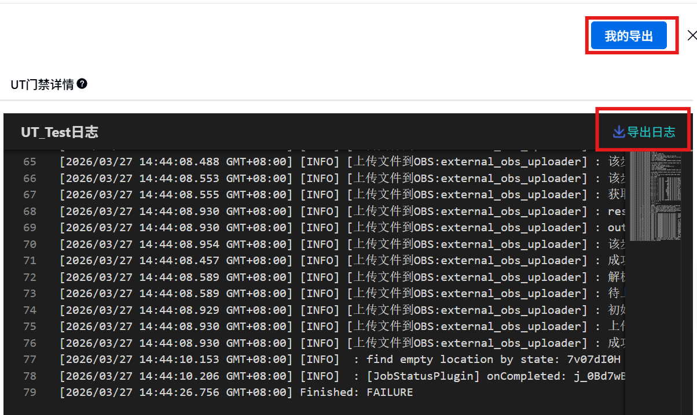
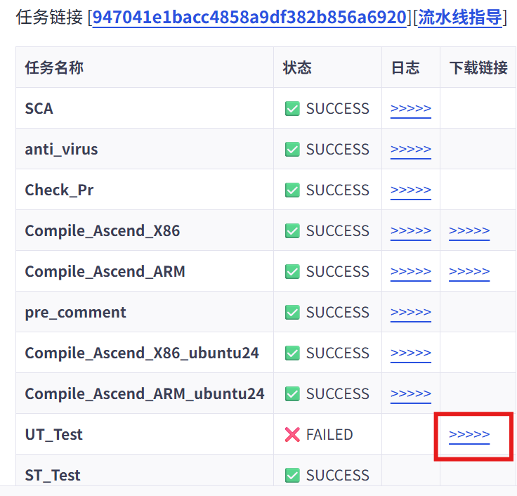
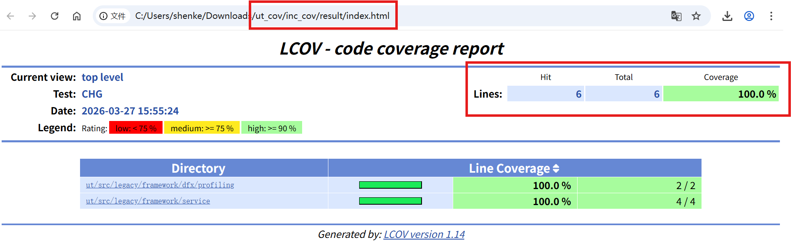

# CI 门禁指导

## UT_Test 门禁指导

### UT_Test 门禁介绍

UT_Test 门禁用于执行单元测试检查：

1. 编译、执行全量单元测试用例
2. 检查增量覆盖率

UT_Test 门禁运行的硬件环境为：

- 操作系统：Ubuntu 20.04
- 硬件架构：x86_64

UT_Test 门禁运行的软件版本为：

- gcc: 9.4.0
- CANN Toolkit: master 分支最新 weekly 版本（[链接](https://ascend.devcloud.huaweicloud.com/artifactory/cann-run-mirror/software/master/)）

UT_Test 门禁所执行的命令为：

```bash
bash build.sh --ut --cov --cann_3rd_lib_path=/home/jenkins/opensource
```

> 注意：执行时会指定 `cann_3rd_lib_path` 参数，会直接使用其中的三方件编译结果，不会重新编译

### UT_Test 门禁任务日志获取

1. 运行日志下载

在 openLiBing “流水线详情”页面下载运行日志，文件名为：`UT_Test.txt`



2. 覆盖率报告下载

在 PR “下载链接”位置下载覆盖率报告，文件名为：`ut_cov.tar.gz`



### UT_Test 门禁覆盖率报告结构

解压覆盖率报告压缩包后，其内容格式如下：

```
├── index.html            # 全量覆盖率报告
└── inc_cov
    └── result
        └── index.html    # 增量覆盖率报告
```

### UT_Test 门禁失败任务排查步骤

1. 排查编译问题

`UT_Test.txt` 运行日志中，搜索关键字：

```
Error 1
```

2. 排查用例失败问题

`UT_Test.txt` 运行日志中，搜索关键字：

```
Segment fault   # 表明出现 coredump
Failed tests    # 表明用例执行结果与预期不符
```

3. 排查覆盖率问题

查看 `ut_cov.tar.gz` 中 `inc_cov/result/index.html`，增量行覆盖率是否满足门禁要求

> 当前门禁要求行覆盖率 >= 50%，未来将逐步提高至 80%



### UT_Test 门禁任务失败 FAQ

#### 1. 覆盖率报告中 inc_cov 文件夹为空

问题现象：`UT_Test.txt` 运行日志中，文件最后有类似内容：

```
[ERROR] [***//CI/cann/pipeline/bin/common/llt/get_ai_inc_cov.py] [421] file not found in coverage.info ['src/framework/next/coll_comms/api_c_adpt/rank_graph_c_adpt.cc']
```

问题原因：源文件覆盖率为 0%，可能有以下2点原因：

    1. 该源文件未编译到测试用例的 target 中
    2. 该源文件未覆盖测试

#### 2. 覆盖率门禁临时屏蔽

> 注意：临时屏蔽需找 maintainer 加分才能合入

临时屏蔽有以下 2 种方式：

1. 代码仓根目录 `classify_rule.yaml` 文件中 `unrelease` 字段添加屏蔽路径：

```yaml
hcomm:
  src:
    unrelease:
      - path/to/a       # 文件夹路径（相对于代码仓根目录）
      - path/to/b.cc    # 文件路径（相对于代码仓根目录）
```

2. 代码仓根目录 `blacklist.txt` 文件中追加要屏蔽的文件路径（不支持文件夹）

```
path/to/a.cc
path/to/b.cc
```

上述 2 种方式区别如下：

- 屏蔽整个目录，且该目录经过决策，以后无需补充 UT，适合放到 `classify_rule.yaml` 中
- 屏蔽单个文件，但计划后续补充 UT，适合放到 `blacklist.txt` 中

建议：

- AIV、老流程算法代码，UT 无法覆盖的场景，经过决策后，可追加到 `classify_rule.yaml` 文件中进行永久屏蔽
- 着急上库，经过决策暂不补充 UT 的场景，可追加到 `blacklist.txt` 中进行临时屏蔽
