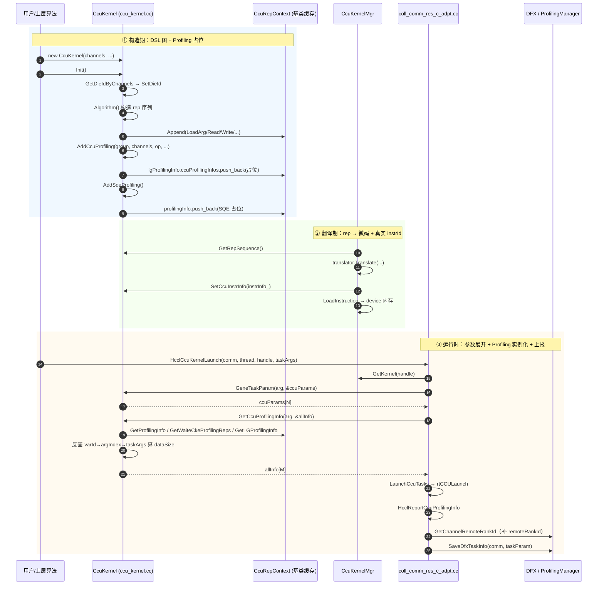
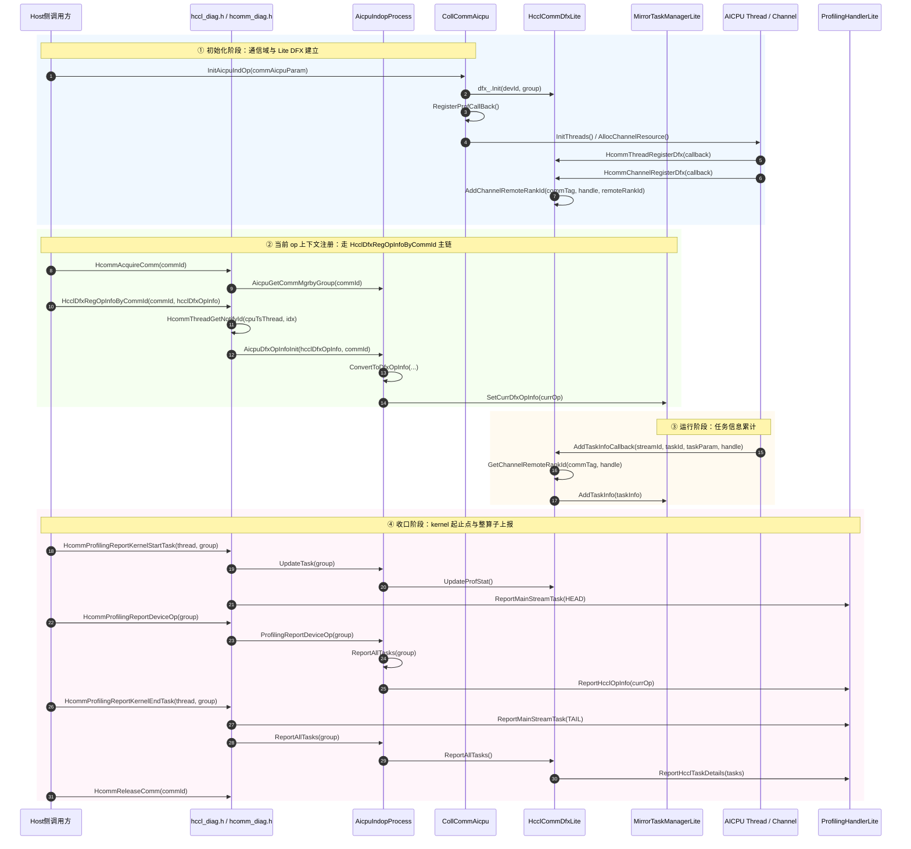
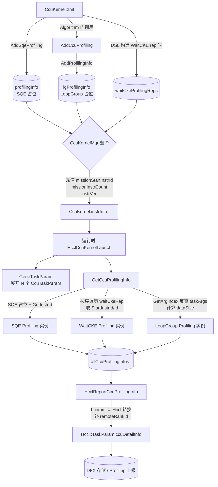
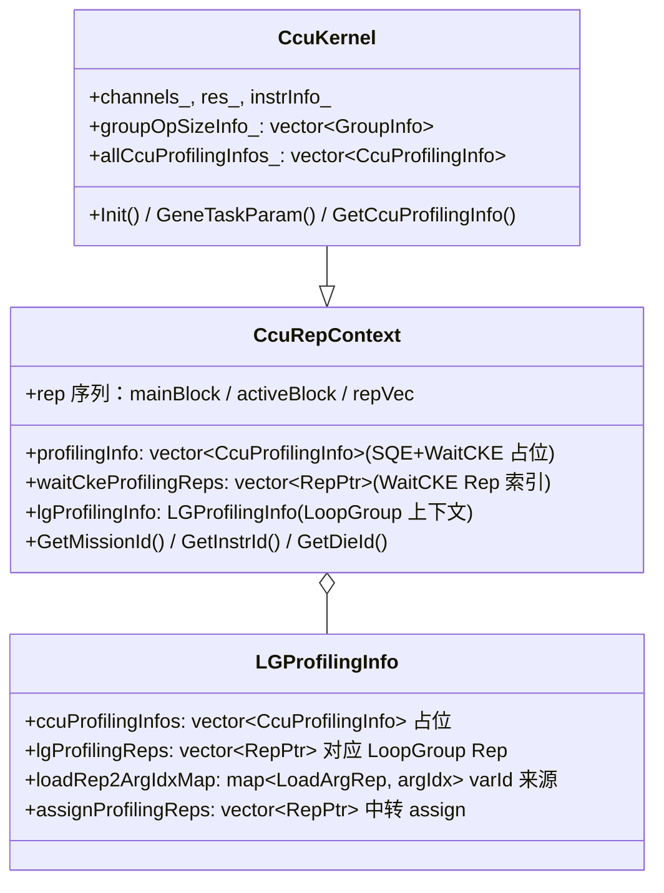
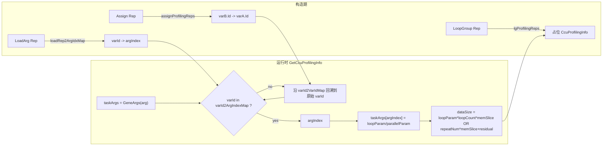
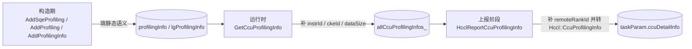
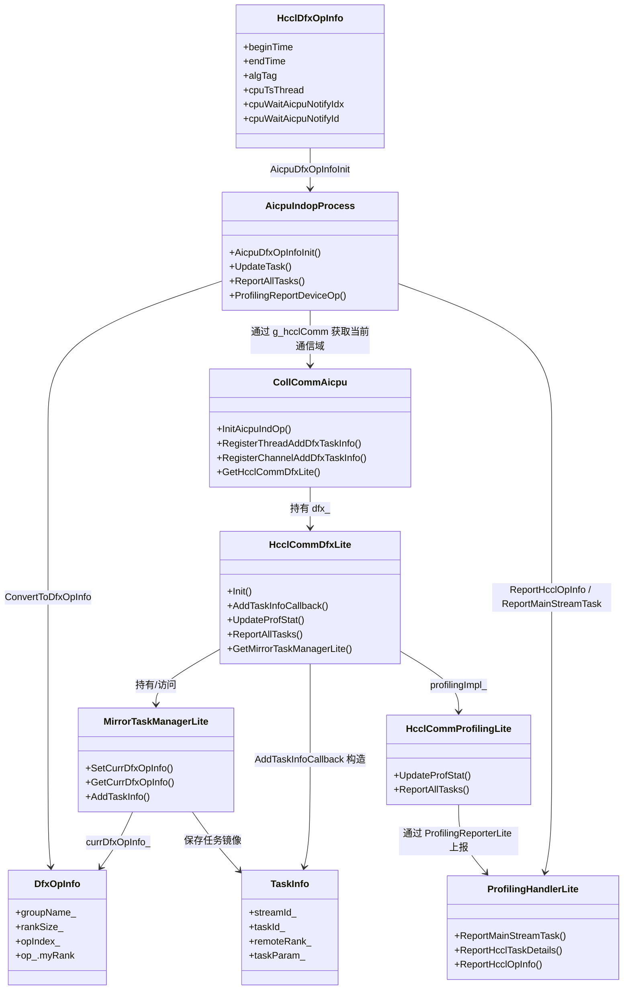

# HCCL CCU / AICPU DFX-Profiling 流程图

> **目的**：用最短篇幅讲清楚 HCCL 中 CCU 与 AICPU 两条 profiling 链路的**何时产生、何时绑定、何时上报**，便于对照源码阅读。
> **覆盖文件**：
> - `pkg_inc/hcomm/ccu/ccu_rep_context_v1.h` — rep 序列基类，profiling 三类缓存
> - `src/framework/next/comms/ccu/ccu_kernel/ccu_kernel.cc` — 内核实现：构造期收集 / 运行时绑定
> - `src/framework/next/comms/ccu/ccu_kernel/ccu_kernel_mgr.cc` — 翻译/加载，给 instrId 赋实值
> - `src/framework/next/coll_comms/api_c_adpt/coll_comm_res_c_adpt.cc` — 运行时入口与 DFX 上报
> - `src/framework/next/comms/api_c_adpt/hcomm_c_adpt.cc` — AICPU DFX init kernel 下发入口
> - `src/framework/next/coll_comms/communicator/aicpu/coll_comm_aicpu.cc` — AICPU 通信域、thread/channel DFX 挂接
> - `src/framework/next/coll_comms/communicator/aicpu/aicpu_indop_process.cc` — AICPU device 侧 DFX 上下文注册与汇总上报
> - `src/framework/communicator/impl/independent_op/data_api/hccl_api_data_aicpu_ts.cc` — AICPU profiling 收口接口

---

## 1. 三类 Profiling 信息一览

| 类型 | 枚举 | 何时收集 | 何时实例化 | 携带信息 |
|---|---|---|---|---|
| **SQE / Task** | `CCU_TASK_PROFILING` | `CcuKernel::Init()` 内 `AddSqeProfiling()` | 翻译后 `GetCcuProfilingInfo()` 注入 `instrId` | dieId / missionId / instrId |
| **WaitCKE** | `CCU_WAITCKE_PROFILING` | DSL 构造期间记入 `waitCkeProfilingReps` | 运行时按 rep 顺序绑定 `ckeId / instrId` | + ckeId / mask / channelId |
| **LoopGroup** | `CCU_LOOPGROUP_PROFILING` | `AddCcuProfiling()` / `AddProfilingInfo()` | 运行时通过 `varId → argIndex → taskArgs` 反查得到 `dataSize` | + 数据量 / op 类型 / channelHandle |

> 关键设计：**虚拟资源 → 物理资源**。构造期只填可静态确定的字段，剩余字段（`instrId / ckeId / dataSize / remoteRankId`）一律延迟到运行时绑定。

---

## 2. 总体时序图（端到端）

### 2.1 CCU 总体时序图（端到端）



### 2.2 AICPU 总体时序图（端到端）

> 图例：**实线**表示当前源码中已确认接线的主链；**虚线**表示仓内仍保留实现、但当前主流程未依赖的备用/预留能力。



### 2.3 与 AICPU profiling 的共流程 / 不共流程

> 说明：本节主图描述的是 **CCU profiling** 端到端流程；AICPU profiling 在当前 open `../hccl` 仓中未发现同款 `next/dfx` 实现，相关主链仍落在本仓 `hcomm`。

#### 共流程

- 都存在 **host 侧先建立通信域 / DFX 上下文**，再进入运行期的模式。
- 都存在 **device 侧保存当前 op 上下文** 的过程，只是保存容器不同：CCU 使用 `CcuRepContext` / `CcuKernel`，AICPU 使用 `MirrorTaskManagerLite` / `HcclCommDfxLite`。
- 都存在 **任务级信息收集 → 汇总 → 上报 DFX/ProfilingHandler** 的闭环。
- 都依赖 **channel / thread / taskParam** 等运行时对象补齐最终 profiling 语义，而不是在构造期一次性定稿。

#### 不共流程

- **CCU profiling** 的核心是“构造期占位、翻译期注入、运行时绑定”：入口集中在 `CcuKernel::Init()`、`AddSqeProfiling()`、`GetCcuProfilingInfo()`；中间必须经过 `CcuKernelMgr` 翻译和 `instrId/dataSize` 补全；最终通过 `HcclCcuKernelLaunch()` / `HcclReportCcuProfilingInfo()` 上报。
- **AICPU profiling** 当前已接线的核心是“先通过 `HcclDfxRegOpInfoByCommId()` 把当前 op 注册进 `MirrorTaskManagerLite`，再依赖 Lite DFX 回调累计 task，随后由 `HcommProfilingReportDeviceOp()` 先上报整算子信息，最后通过 `HcommProfilingReportKernelEndTask()` 打 TAIL 并补做 task 明细收口”。旧的 `HcommDfxKernelLaunch()` → `RunAicpuDfxOpInfoInitV2` 链路在当前源码中仍能看到实现，但不应再作为主流程理解。

### 2.4 快速判型

- 如果链路里出现 `CcuKernel`、`GetCcuProfilingInfo()`、`HcclReportCcuProfilingInfo()`，这是 **CCU profiling**。
- 如果链路里出现 `HcclDfxRegOpInfoByCommId()`、`HcclCommDfxLite`、`MirrorTaskManagerLite`、`HcommProfilingReportKernelStartTask()`，这是 **AICPU profiling**。
- 当前 open `../hccl` 仓未发现 `next/coll_comms/dfx` 下同款 AICPU profiling 结构，因此 AICPU profiling 总体时序图应以本仓 `hcomm` 为准。

---

## 3. CCU Profiling 专属细化链路

### 3.1 Profiling 数据生命周期（流程图）



---

### 3.2 关键函数定位表

| 阶段 | 函数 | 位置 |
|---|---|---|
| 构造 - SQE 占位 | [`CcuKernel::Init`](src/framework/next/comms/ccu/ccu_kernel/ccu_kernel.cc#L114) → `AddSqeProfiling()` | ccu_kernel.cc:114 |
| 构造 - LoopGroup 占位 | [`CcuKernel::AddProfilingInfo`](src/framework/next/comms/ccu/ccu_kernel/ccu_kernel.cc#L857) | ccu_kernel.cc:857 |
| 构造 - LoopGroup 入口 | [`CcuKernel::AddCcuProfiling`](src/framework/next/comms/ccu/ccu_kernel/ccu_kernel.cc#L900) | ccu_kernel.cc 末尾 |
| 翻译 - 赋真实 instrId | [`CcuKernelMgr::TransRepSequenceToMicrocode`](src/framework/next/comms/ccu/ccu_kernel/ccu_kernel_mgr.cc#L653) | ccu_kernel_mgr.cc:653 |
| 运行时 - 入口 | [`HcclCcuKernelLaunch`](src/framework/next/coll_comms/api_c_adpt/coll_comm_res_c_adpt.cc#L444) | coll_comm_res_c_adpt.cc:444 |
| 运行时 - 任务参数展开 | [`CcuKernel::GeneTaskParam`](src/framework/next/comms/ccu/ccu_kernel/ccu_kernel.cc#L132) | ccu_kernel.cc:132 |
| 运行时 - profiling 绑定 | [`CcuKernel::GetCcuProfilingInfo`](src/framework/next/comms/ccu/ccu_kernel/ccu_kernel.cc#L766) | ccu_kernel.cc:766 |
| 运行时 - varId 反查 | [`GetArgIndex`](src/framework/next/comms/ccu/ccu_kernel/ccu_kernel.cc#L691) | ccu_kernel.cc:691 |
| 上报 - DFX 转换 | [`HcclReportCcuProfilingInfo`](src/framework/next/coll_comms/api_c_adpt/coll_comm_res_c_adpt.cc#L360) | coll_comm_res_c_adpt.cc:360 |
| 上报 - 调试 dump | [`DumpCcuProfilingInfo`](src/framework/next/comms/ccu/ccu_kernel/ccu_kernel.cc#L727) | ccu_kernel.cc:727 |

---

### 3.3 CcuRepContext 中的三个缓存



---

### 3.4 LoopGroup `dataSize` 反查逻辑（最复杂的一段）



> **为什么这么绕**：rep 序列在构造期使用**虚拟资源 ID**，翻译后才映射到物理寄存器/参数槽。Profiling 必须在运行时拿到 `taskArgs` 才能解析出真实数据量。

---

### 3.5 一句话总览

> **构造期占位 → 翻译期注入 instrId → 运行时绑定 taskArgs → DFX 上报。**
> Profiling 数据**永远不脱离 rep 序列**，rep 提供锚点（`StartInstrId`、`varId`），三类缓存（`profilingInfo` / `waitCkeProfilingReps` / `lgProfilingInfo`）按需在 `GetCcuProfilingInfo()` 中合流到 `allCcuProfilingInfos_`，由 `HcclReportCcuProfilingInfo()` 转成 `Hccl::CcuProfilingInfo` 落盘到 DFX。

---

### 3.6 阅读建议

1. 先读 `ccu_rep_context_v1.h` —— 看清楚三个缓存字段。
2. 再读 `CcuKernel::Init` / `AddSqeProfiling` / `AddProfilingInfo` —— 了解占位是怎么塞进去的。
3. 跳到 `CcuKernelMgr::TransRepSequenceToMicrocode` —— 看 `instrId` 是怎么赋值的。
4. 最后读 `HcclCcuKernelLaunch` → `GeneTaskParam` → `GetCcuProfilingInfo` → `HcclReportCcuProfilingInfo` —— 一气呵成走完运行时。
5. 卡在 `GetArgIndex` 上时，回头对照本文 §6 的反查图。

---

### 3.7 为什么要这些缓存（不是性能优化，而是信息保活）

这组字段：

- `ccuProfilingInfoCache`
- `allLgProfilingReps`
- `lgProfilingInfo`
- `waitCkeProfilingReps`
- `profilingInfo`

核心作用不是“提速”，而是把**构造期才能拿到**、但**运行时才需要补全**的信息保留下来。

#### 3.7.1 信息分批到达

| 字段 | 何时可得 |
|---|---|
| `name/type/opType/dataType/channelId` | DSL 构造期 |
| `instrId/ckeId` | 翻译后（从 rep 拿 `StartInstrId()/GetId()`） |
| `dataSize` | 运行时（`taskArgs` 可见后推导） |
| `remoteRankId` | 上报阶段（按 channel 查询通信域） |

如果没有缓存，构造期语义会在运行时丢失，无法完整还原 profiling 条目。

#### 3.7.2 每个缓存做什么

| 缓存 | 职责 |
|---|---|
| `ccuProfilingInfoCache` | 单条 profiling 的临时拼装缓冲，再 push 到容器 |
| `profilingInfo` | SQE/WaitCKE 的占位仓 |
| `waitCkeProfilingReps` | WaitCKE 的 rep 锚点（运行时补 `instrId/ckeId`） |
| `allLgProfilingReps` | 记录最近构造的 loopGroup rep，便于 `AddProfilingInfo` 对应挂接 |
| `lgProfilingInfo` | LoopGroup 完整上下文：`ccuProfilingInfos + lgProfilingReps + loadRep2ArgIdxMap + assignProfilingReps` |

#### 3.7.3 结论

这套缓存是“语义中转层”，目标是**跨阶段拼完整 profiling**，不是为了减少计算复杂度。

#### 3.7.4 最短版字段对照表

| 字段 | 主要填充阶段 | 典型位置 |
|---|---|---|
| `name/type/dieId/mask/channelId/channelHandle` | 构造期 | `AddSqeProfiling()` / `AddProfiling()` / `AddProfilingInfo()` |
| `missionId` | 构造期 + 运行时校正 | `AddProfilingInfo()` / `GetCcuProfilingInfo()` |
| `instrId` | 运行时绑定 | `GetCcuProfilingInfo()` |
| `ckeId` | 构造期或运行时绑定 | `AddProfiling(channel, ...)` / `GetCcuProfilingInfo()` |
| `dataSize` | 运行时计算 | `GetCcuProfilingInfo()` |
| `remoteRankId` | 上报阶段补齐 | `HcclReportCcuProfilingInfo()` |

#### 3.7.5 字段生命周期小图



> 其中 `channelHandle` 是**构造期缓存的反查钥匙**，主要用于上报阶段通过通信域查询 `remoteRankId`，不是在 `HcclCcuKernelLaunch()` 时临时生成。

#### 3.7.6 字段 → 填充函数 → 最终消费函数

| 字段 | 填充函数 | 最终消费函数 |
|---|---|---|
| `name` / `type` | `AddSqeProfiling()` / `AddProfiling()` / `AddProfilingInfo()` | `DumpCcuProfilingInfo()` / `HcclReportCcuProfilingInfo()` |
| `dieId` | `AddSqeProfiling()` | `DumpCcuProfilingInfo()` / `HcclReportCcuProfilingInfo()` |
| `missionId` | `AddProfilingInfo()` / `GetCcuProfilingInfo()` | `DumpCcuProfilingInfo()` / `HcclReportCcuProfilingInfo()` |
| `instrId` | `GetCcuProfilingInfo()` | `DumpCcuProfilingInfo()` / `HcclReportCcuProfilingInfo()` |
| `ckeId` | `AddProfiling(channel, ...)` / `GetCcuProfilingInfo()` | `DumpCcuProfilingInfo()` / `HcclReportCcuProfilingInfo()` |
| `mask` | `AddProfiling(...)` | `DumpCcuProfilingInfo()` / `HcclReportCcuProfilingInfo()` |
| `reduceOpType` / `inputDataType` / `outputDataType` | `AddProfilingInfo()` | `DumpCcuProfilingInfo()` / `HcclReportCcuProfilingInfo()` |
| `dataSize` | `GetCcuProfilingInfo()` | `DumpCcuProfilingInfo()` / `HcclReportCcuProfilingInfo()` |
| `channelId[]` | `AddProfiling(...)` / `AddProfilingInfo()` | `DumpCcuProfilingInfo()` / `HcclReportCcuProfilingInfo()` |
| `channelHandle[]` | `AddProfiling(...)` / `AddProfilingInfo()` | `HcclReportCcuProfilingInfo()`（调用 `GetChannelRemoteRankId`） |
| `remoteRankId[]` | `HcclReportCcuProfilingInfo()` | `HcclReportCcuProfilingInfo()` → `taskParam.ccuDetailInfo` |

> 读这张表时可以记一个最短心智模型：**构造函数族负责“留线索”，`GetCcuProfilingInfo()` 负责“补运行时值”，`HcclReportCcuProfilingInfo()` 负责“转成最终 DFX 消费格式”。**

---

### 3.8 单 Kernel 为何只绑定一个 die

#### 3.8.1 hcomm 侧约束

`CcuKernel::Init()` 中通过 `GetDieIdByChannels` 校验同一 kernel 的 channels 必须同 die；若不一致直接报错。

这意味着 `CcuRepContext` 里的：

- `dieId`
- `missionId`
- `missionKey`

是**单 kernel 身份字段**，不是“多 die 聚合容器”。

#### 3.8.2 多 die 如何实现

多 die 并发不是靠“一个 kernel 含多个 die”，而是靠“**多个 kernel 实例**，每个实例绑定一个 die”。

这也是为什么资源仓是 `CCU_MAX_IODIE_NUM` 维度数组，但单 kernel 内部只落到其中一个 die 槽位。

---

### 3.9 hccl 仓真实例：AllReduce 2-die 会创建 2 个 CcuKernel

以下示例全部来自 `~/git/hccl`。

#### 3.9.1 算法模板按 die 分桶并创建 kernelInfo

文件：`src/ops/all_reduce/template/ccu/ccu_temp_all_reduce_mesh_1D_2die_oneshot.cc`

关键逻辑：

1. `GetChannelDieId(...)` 把 channel 分到 `channelDescsDie[dieId]`
2. `for (die = 0; die < ALL_REDUCE_DIE_NUM; die++)` 循环两次
3. 每次构造一个 `CcuKernelInfo` 并 `resourceRequest.ccuKernelInfos.push_back(kernelInfo)`

也就是说，一个 2-die AllReduce 模板会产生 2 个 kernel 注册请求。

#### 3.9.2 框架层逐个注册 handle

文件：`src/ops/op_common/op_common.cc`

`resCtxHost->ccuKernels.resize(totalKernelNum)` 后，循环调用：

- `HcclCcuKernelRegister(comm, &handle, creatorPtr, kernelArgPtr)`

每个 `kernelInfo` 生成一个 `CcuKernelHandle`，最终得到 `resCtx.ccuKernels[0..1]`。

#### 3.9.3 执行层显式要求 2 个 kernel

文件：`src/ops/all_reduce/executor/ins_v2_all_reduce_concurrent_executor.cc`

有明确检查：

- `EXPECTED_CCU_KERNEL_NUM_2 = 2`
- `tempAlgResource0.ccuKernels.push_back(resCtx.ccuKernels[0])`
- `tempAlgResource1.ccuKernels.push_back(resCtx.ccuKernels[1])`

即：模板 0/1 分别拿一个 kernel handle，在并发执行路径中分别 launch。

#### 3.9.4 一句话归纳

在 hccl 新流程中：

- **跨 die = 多 kernel（每 die 一个）**
- **单 kernel = 单 die 的 mission/profiling 上下文**

与本文第 10 节的 hcomm 约束完全一致。

---

### 3.10 最短对照清单（10行）

| # | hcomm 文件函数 | hccl 调用点 / 触发点 |
|---|---|---|
| 1 | `CcuKernel::Init` | `HcclCcuKernelRegister`（由 `HcclGetCcuKernel` 触发创建） |
| 2 | `GetDieIdByChannels` | 模板先在 hccl 按 `GetChannelDieId` 分桶，保证单 kernel 单 die |
| 3 | `CcuRepContext::AddSqeProfiling` | 各 CCU 模板 `KernelRun/Algorithm` 构造 DSL 时隐式触发 |
| 4 | `CcuKernel::AddCcuProfiling` | CCU 模板 group 级操作（AllReduce/ReduceScatter 等）构造时调用 |
| 5 | `CcuKernelMgr::TransRepSequenceToMicrocode` | `HcclCcuKernelRegisterFinish` 阶段触发翻译与加载 |
| 6 | `CcuKernel::SetCcuInstrInfo` | 同上，翻译后把 `instrInfo` 回填到 kernel |
| 7 | `CcuKernel::GeneTaskParam` | `HcclCcuKernelLaunch` 内部第一步（launch 前参数展开） |
| 8 | `CcuKernel::GetCcuProfilingInfo` | `HcclCcuKernelLaunch` 内部第二步（拼完整 profiling） |
| 9 | `LaunchCcuTasks` | `HcclCcuKernelLaunch` 内部执行 `rtCCULaunch` |
| 10 | `HcclReportCcuProfilingInfo` | `HcclCcuKernelLaunch` 尾部：转 `TaskParam` 并 `SaveDfxTaskInfo` |

其中你最关心的 2-die AllReduce 对应链路：

- hccl 模板：`src/ops/all_reduce/template/ccu/ccu_temp_all_reduce_mesh_1D_2die_oneshot.cc`
- hccl 资源注册：`src/ops/op_common/op_common.cc` 中 `HcclGetCcuKernel`
- hccl 执行侧：`src/ops/all_reduce/executor/ins_v2_all_reduce_concurrent_executor.cc`

---

### 3.11 Profiling 生成关键 DFX 日志速查表

当 profiling 生成出问题时，根据以下关键日志点快速定位问题。**搜索 `HCCL_INFO`，不含 `ERROR`**。

#### 3.11.1 构造期（DSL 构造 + 缓存填充）

| 日志输出 | 函数 | 行号 | 含义 / 调试要点 |
|---|---|---|---|
| `Construct CcuKernel: <kernel_sig>` | `CcuKernel::CcuKernel()` | 70 | Kernel 对象创建，打印完整签名。若无此日志 → kernel 创建失败 |
| `channelHandle[0x...], dieId[%u]` | `GetDieIdByChannel()` | 88 | 单个 channel 的 die ID 绑定。若 dieId 跨越异常 → 下一步会报 `HCCL_ERROR` |
| `Kernel inst %u` | `CcuKernel::GetInstrCount()` | 568 | 翻译完成后的指令总数统计。若为 0 → 算法没有生成 rep，检查 `Algorithm()` 逻辑 |

#### 3.11.2 运行时 profiling 参数生成阶段

| 日志输出 | 函数 | 行号 | 含义 / 调试要点 |
|---|---|---|---|
| `[GetCcuProfilingInfo] Enter.` | `CcuKernel::GetCcuProfilingInfo()` | 768 | profiling 数据拼装入口。**这是最关键的函数** |
| `[GetCcuProfilingInfo] Process sqe&waitcke profiling info start.` | 同上 | 774 | SQE + WaitCKE 阶段开始，预期能找到对应缓存 |
| `[CcuKernel][GetCcuProfilingInfo] waitcke[%u]` | 同上 | 794 | WaitCKE 的 `ckeId` 成功绑定。若无此日志 → WaitCKE profiling 为空或 rep 错误 |
| `[GetCcuProfilingInfo] create varId2ArgIndexMap start. size=%lu` | 同上 | 802 | LoadArg rep → varId 映射表大小。若 size=0 → 没有 LoadArg，数据大小无法计算 |
| `[GetCcuProfilingInfo] create varId2VarIdMap start. size=%lu` | 同上 | 813 | Assign rep（变量赋值链）映射表大小。若 size 很大 → 链式赋值过多，可能影响性能 |
| `[GetCcuProfilingInfo] process loop group profiling start: lgsize(%lu), goSize(%lu)` | 同上 | 824 | LoopGroup profiling 主循环开始，打印缓存大小。若 `lgsize ≠ 2*goSize` → 数据不一致 |
| `Collect loopgroup profiling info: repSize[%u], index[%u], loopParam[%llu], parallelParam[%llu].` | 同上 | 833 | 单个 LoopGroup 的 loopParam 和 parallelParam 值。若都为 0 → 此 LG 无有效数据 |
| `[GetCcuProfilingInfo] collect lg, residual start i=%lu` | 同上 | 843 | Parallel LG（第二个）的余数计算阶段。若无此日志 → parallelParam 为 0 |

#### 3.11.3 profiling 数据反射阶段（varId → 数据量）

| 日志输出 | 函数 | 行号 | 含义 / 调试要点 |
|---|---|---|---|
| `[GetArgIndex] Enter varId(%u)` | `GetArgIndex()` | 695 | 尝试从 taskArgs 反查 varId 对应的参数值。参数为 LoadArg 时的变量 ID |
| `[GetArgIndex] find end` | 同上 | 715 | 成功在 `varId2ArgIndexMap` 或追踪链后的 `oriVarId` 找到映射。若无此日志 → 继续往下看 ERROR |
| 成功日志：`GetArgIndex success: varId(%u) varId2VarIdMapSize(%u) varId2ArgIndexMapSize(%u) taskArgsSize(%u)` | 同上 | 720-722 | 反查成功，打印三个缓存和 taskArgs 大小。此日志出现次数应 = loopParam/parallelParam/residual 反查数 |

#### 3.11.4 最终 profiling 数据转储阶段

| 日志输出 | 函数 | 行号 | 含义 / 调试要点 |
|---|---|---|---|
| `Dump CCU Profiling Info:SQE Profiling Info: ctxSignautre(%s), dieId(%d), missionId(%d), instrId(%d).` | `DumpCcuProfilingInfo()` | 740-743 | SQE profiling 最终形态。检查 dieId/missionId/instrId 是否非负 |
| `Microcode WaitCKE Profiling Info: name(%s), dieId(%d), missionId(%d), instrId(%d), ckeId(%u), mask(%u).` | 同上 | 745-748 | WaitCKE profiling 最终形态。检查 ckeId 是否非 0（INVALID_CKE_ID = -1） |
| `Microcode LoopGroup Profiling Info: name(%s), dieId(%d), missionId(%d), instrId(%d), reduceOpType(%d), inputDataType(%d), outputDataType(%d), dataSize(%llu).` | 同上 | 751-754 | LoopGroup profiling 最终形态，**重点关注 `dataSize` 是否合理** |

#### 3.11.5 task 参数展开阶段

| 日志输出 | 函数 | 行号 | 含义 / 调试要点 |
|---|---|---|---|
| `[GeneTaskParam]task Param, dieId[%u] missionId[%u] instStartId[%u] instCnt[%u], argSize[%u]` | `CcuKernel::GeneTaskParam()` | 179-181 | task 参数头。检查 instStartId 和 instCnt 是否与翻译期一致 |
| `[GeneTaskParam]arg[%lu] = %lu` （跳过 index=2） | 同上 | 184 | 各参数值打印。若参数为 0 或极大值 → 可能是初始化错误或栈越界 |

#### 3.11.6 资源分配阶段

| 日志输出 | 函数 | 行号 | 含义 / 调试要点 |
|---|---|---|---|
| `resource request: dieId[%u], ms[%u], blockMs[%u], cke[%u], blockCke[%u], loopEngine[%u], blockLoopEngine[%u], gsa[%u], xn[%u], continuous xn[%u], missionId[%u]` | `CcuKernel::GetResourceRequest()` | 236 | 完整资源请求。若某字段过大 → 可能算法生成异常 rep 数量过多 |

#### 3.11.7 快速诊断清单

**问题：profiling 生成失败（返回 ERROR）**

| 现象 | 最可能原因 | 排查命令 |
|---|---|---|
| 无 `[GetCcuProfilingInfo] Enter.` | `GetCcuProfilingInfo()` 未被调用 | `grep "GetCcuProfilingInfo" launch.log` |
| 有 Enter，但无 `Process sqe&waitcke` | 缓存初始化失败 | `grep "GetProfilingInfo\|ccuProfilingCache" launch.log` |
| 有 sqe/waitcke，但无 loopGroup 日志 | `lgProfInfo` 为空 | `grep "lgsize.*goSize" launch.log`，若无 → `GetLGProfilingInfo()` 返回空结构 |
| loopgroup 日志存在但 dataSize=0 | varId 反查失败 | `grep "GetArgIndex.*success\|varId.*out of range" launch.log` |
| 所有日志都有，但 Dump 时缺字段 | 字段未被赋值 | `grep "Dump CCU\|Microcode.*Info" launch.log`，检查字段值是否 0 或 -1 |
| 有 profiling 日志但 launch 失败 | 下游（executor）问题 | `grep "HcclCcuKernelLaunch\|LaunchCcuTasks" launch.log` |

#### 3.11.8 关键反向追踪

若某个 profiling 字段错误，反向对应关键日志：

- **`dataSize` 错误** → 追踪 `Collect loopgroup profiling info` 中的 `loopParam/parallelParam` 值
- **`loopParam/parallelParam` 错误** → 追踪 `GetArgIndex success` 返回的 varId 映射和 taskArgs 值
- **缺少 varId 映射** → 追踪 `create varId2ArgIndexMap` 的 size，若为 0 → 检查 DSL 是否有 LoadArg
- **WaitCKE 绑定失败** → 追踪 `Process sqe&waitcke` 阶段，检查 `waitCkeProfilingReps` 大小与缓存是否匹配
- **指令数错误** → 翻译期 `Kernel inst %u` 与运行时 `instCnt` 比对

#### 3.11.9 日志抓取命令

```bash
# 抓取 profiling 关键日志
grep -A2 -B2 "GetCcuProfilingInfo\|Collect loopgroup\|Dump CCU\|GetArgIndex success" hcomm.log

# 特定 dieId / missionId 的完整 profiling 链
grep "missionId\[123\]\|dieId\[2\]" hcomm.log | head -50

# 检查是否有反查失败（ERROR）
grep -i "varId.*out of range\|GetArgIndex.*fail" hcomm.log
```

#### 3.11.10 总结

profiling 生成的关键路径是：

1. **构造** → 缓存填充（`ccuProfilingCache / profilingInfo / lgProfilingInfo`）
2. **翻译** → 指令 ID 绑定（`instrId` 赋值）
3. **运行时** → varId 反查 + 数据量计算（`GetArgIndex + dataSize`）
4. **上报** → Dump 完整结构体

**若某阶段日志丢失，对应阶段失败，向前追溯。** 日志输出点按执行顺序排列，按顺序对照可快速定位 bug。

---

## 4. AICPU Profiling 关键落点 / 阅读顺序

> 说明：本章聚焦当前 `hcomm` 仓中 **AICPU profiling 新增实现内容**。截至当前扫描，open `../hccl` 仓未发现同款 `next/coll_comms/dfx` 结构，因此 AICPU profiling 的关键阅读入口应以本仓为准。当前建议优先按 `HcclDfxRegOpInfoByCommId()` 主链理解；`HcommDfxKernelLaunch()` / `RunAicpuDfxOpInfoInitV2` 可视为保留实现，不再作为主图默认入口。

### 4.1 AICPU Profiling 主链一览

1. **当前 op 上下文注册（现行主链入口）**
    - 入口：`HcclDfxRegOpInfoByCommId()`
    - 位置：`src/framework/communicator/impl/independent_op/data_api/hccl_api_data_aicpu_ts.cc`
    - 作用：补齐 `cpuWaitAicpuNotifyId`，并转调 `AicpuIndopProcess::AicpuDfxOpInfoInit()` 把当前 op 注册进 `MirrorTaskManagerLite`

2. **device 侧把 `HcclDfxOpInfo` 落为当前 op 上下文**
    - 入口：`AicpuIndopProcess::AicpuDfxOpInfoInit()`
    - 位置：`src/framework/next/coll_comms/communicator/aicpu/aicpu_indop_process.cc`
    - 作用：`HcclDfxOpInfo -> DfxOpInfo`，补 `opIndex_/groupName_/rankSize_`，最终 `SetCurrDfxOpInfo()`

3. **AICPU 通信域初始化时挂接任务采集回调**
    - 入口：`CollCommAicpu::InitAicpuIndOp()` / `InitThreads()` / `ProcessUrmaRes()`
    - 位置：`src/framework/next/coll_comms/communicator/aicpu/coll_comm_aicpu.cc`
    - 作用：
      - 初始化 `HcclCommDfxLite`
      - 注册 `MsprofRegisterCallback(AICPU, ...)`
      - 对 thread 调 `HcommThreadRegisterDfx()`
      - 对 channel 调 `HcommChannelRegisterDfx()`

4. **运行中通过 Lite DFX 体系累计 taskInfo**
    - 入口：`HcclCommDfxLite::AddTaskInfoCallback()`
    - 位置：`src/framework/next/coll_comms/dfx/hcclCommDfxLite.cc`
    - 作用：把 `streamId / taskId / taskParam / remoteRankId` 封装为 `TaskInfo` 并挂入 `MirrorTaskManagerLite`

5. **kernel 起止点与整算子收口上报（当前已接线的主收口路径）**
    - 入口：`HcommProfilingReportKernelStartTask()` / `HcommProfilingReportKernelEndTask()` / `HcommProfilingReportDeviceOp()`
    - 位置：`src/framework/communicator/impl/independent_op/data_api/hccl_api_data_aicpu_ts.cc`
    - 作用：
      - `UpdateProfStat()` 更新统计
      - `ReportMainStreamTask(HEAD/TAIL)` 标记主流边界
    - `HcommProfilingReportDeviceOp()` 内先 `ReportAllTasks()`，再 `ReportHcclOpInfo()` 完成整算子上报
    - `HcommProfilingReportKernelEndTask()` 在当前 `../hccl` 主流程中位于 `DeviceOp` 之后，负责补 TAIL 标记并再次触发 `ReportAllTasks()`

### 4.2 AICPU Profiling 关键类间关系（现行主链）



> 关键维度可以压成两条线来看：
>
> - **op 维**：`HcclDfxOpInfo` → `DfxOpInfo` → `MirrorTaskManagerLite::currDfxOpInfo_`
> - **task 维**：`thread/channel callback` → `TaskInfo` → `MirrorTaskManagerLite queue` → `ProfilingHandlerLite`

### 4.3 新增 Profiling 实现内容归纳

当前 AICPU profiling 相比单纯的通信执行链，新增/显式化的实现点主要有以下几类：

1. **device 侧 Lite DFX 容器**
    - `HcclCommDfxLite`
    - `HcclCommProfilingLite`
    - `MirrorTaskManagerLite`

2. **当前 op 注册入口**
    - `HcclDfxRegOpInfoByCommId`
    - `AicpuDfxOpInfoInit`
    - 用于把 `HcclDfxOpInfo` 变成 device 当前 op 上下文

3. **thread/channel 维度的 DFX callback 挂接**
    - `HcommThreadRegisterDfx`
    - `HcommChannelRegisterDfx`
    - 这一步让 AICPU 运行时 task 能够自动进入 Lite DFX 采集链

4. **AICPU device 侧桥接函数**
    - `AicpuDfxOpInfoInit`
    - `UpdateTask`
    - `ReportAllTasks`
    - `ProfilingReportDeviceOp`

5. **独立算子收口接口**
    - `HcommProfilingReportKernelStartTask`
    - `HcommProfilingReportKernelEndTask`
    - `HcommProfilingReportDeviceOp`

### 4.4 关键函数定位表

| 阶段 | 关键函数 | 位置 | 作用 |
|---|---|---|---|
| op 注册入口 | `HcclDfxRegOpInfoByCommId` | `src/framework/communicator/impl/independent_op/data_api/hccl_api_data_aicpu_ts.cc` | 补 notifyId，并把 `HcclDfxOpInfo` 注册到当前 comm |
| device 桥接 | `AicpuDfxOpInfoInit` | `src/framework/next/coll_comms/communicator/aicpu/aicpu_indop_process.cc` | 转 `DfxOpInfo` 并 `SetCurrDfxOpInfo` |
| DFX Lite 初始化 | `CollCommAicpu::InitAicpuIndOp` | `src/framework/next/coll_comms/communicator/aicpu/coll_comm_aicpu.cc` | 初始化 `dfx_`、注册 prof callback |
| 线程挂接 | `RegisterThreadAddDfxTaskInfo` | 同上 | `HcommThreadRegisterDfx(thread, dfx_.GetCallback())` |
| 通道挂接 | `RegisterChannelAddDfxTaskInfo` | 同上 | `HcommChannelRegisterDfx(channel, dfx_.GetCallback())` |
| task 累计 | `HcclCommDfxLite::AddTaskInfoCallback` | `src/framework/next/coll_comms/dfx/hcclCommDfxLite.cc` | 构造 `TaskInfo` 并加入 `MirrorTaskManagerLite` |
| 统计更新 | `UpdateTask` | `src/framework/next/coll_comms/communicator/aicpu/aicpu_indop_process.cc` | 调 `UpdateProfStat()` |
| 任务汇总 | `ReportAllTasks` | 同上 | 调 `HcclCommDfxLite::ReportAllTasks()` |
| 整算子上报 | `ProfilingReportDeviceOp` | 同上 | 调 `ReportHcclOpInfo(currOp)` |
| 起始边界 | `HcommProfilingReportKernelStartTask` | `src/framework/communicator/impl/independent_op/data_api/hccl_api_data_aicpu_ts.cc` | 更新统计并打 HEAD 标记 |
| 结束边界 | `HcommProfilingReportKernelEndTask` | 同上 | 打 TAIL 标记并汇总 task |

### 4.5 推荐阅读顺序

如果你后面要继续 review / 扩展 AICPU profiling，建议按下面顺序看：

1. `HcclDfxRegOpInfoByCommId()`
    - 先看当前 op 信息是怎样进入 AICPU profiling 主链的

2. `AicpuIndopProcess::AicpuDfxOpInfoInit()`
    - 再确认 `HcclDfxOpInfo -> DfxOpInfo -> MirrorTaskManagerLite` 的真正落点

3. `CollCommAicpu::InitAicpuIndOp()`
    - 看 AICPU 通信域初始化时怎样建立 Lite DFX 体系

4. `RegisterThreadAddDfxTaskInfo()` / `RegisterChannelAddDfxTaskInfo()`
    - 看运行期 task 采集是如何挂到 thread/channel 上的

5. `HcclCommDfxLite::AddTaskInfoCallback()`
    - 看 taskInfo 真正入队时记录了哪些字段

6. `HcommProfilingReportKernelStartTask()` / `HcommProfilingReportKernelEndTask()` / `HcommProfilingReportDeviceOp()`
    - 最后看收口阶段如何把统计、主流边界和整算子上报串起来

### 4.6 一句话总结

> AICPU profiling 当前**已确认接线**的主干不是“host 下发 init kernel”，而是“`HcclDfxRegOpInfoByCommId()` 注册当前 op → `HcclCommDfxLite` 通过 thread/channel callback 累积 task → `HcommProfilingReportDeviceOp()` 先报整算子 → `HcommProfilingReportKernelEndTask()` 再打 TAIL 并补 task 收口上报”。
