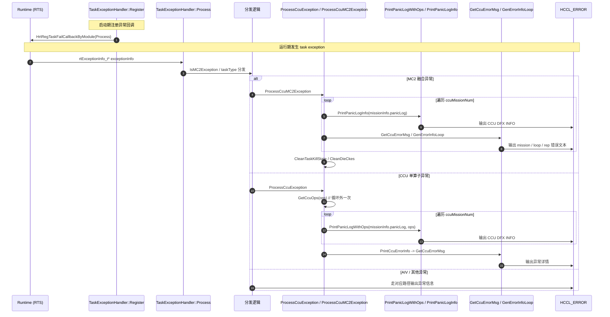
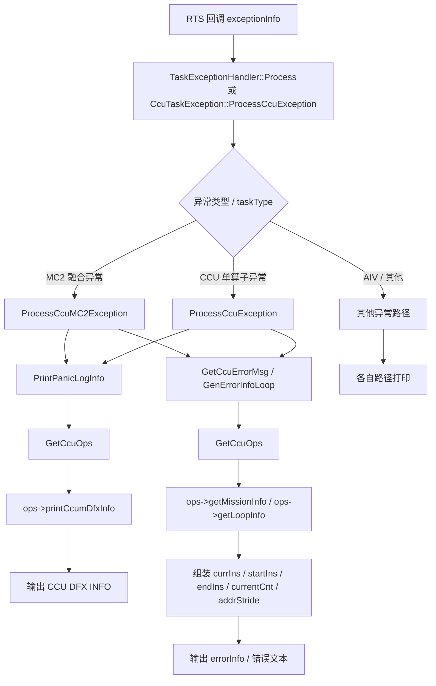
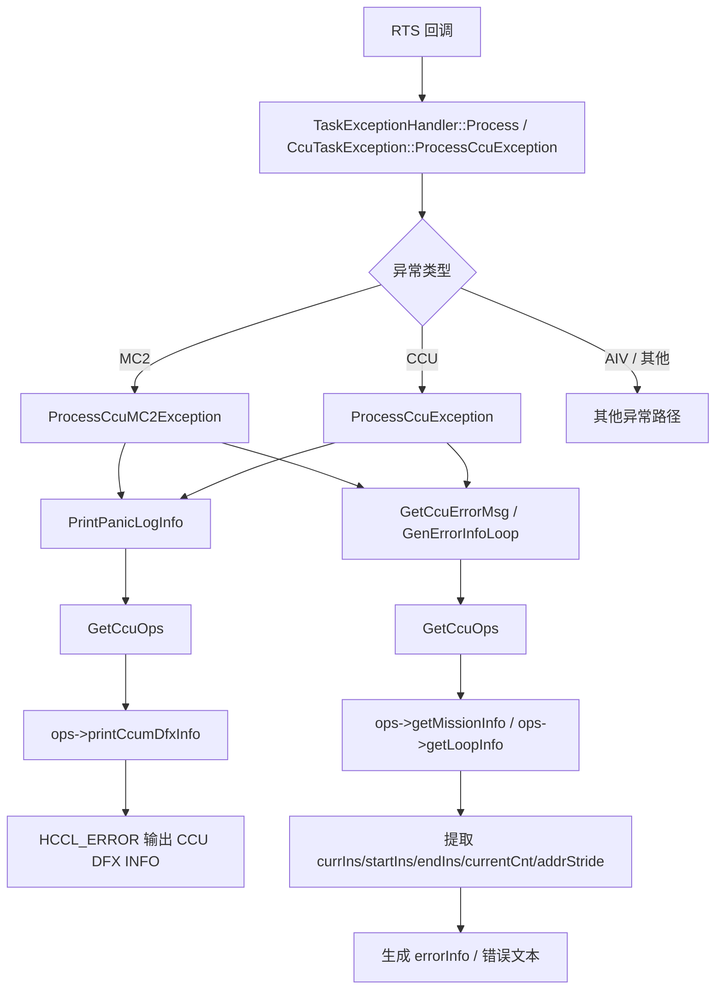
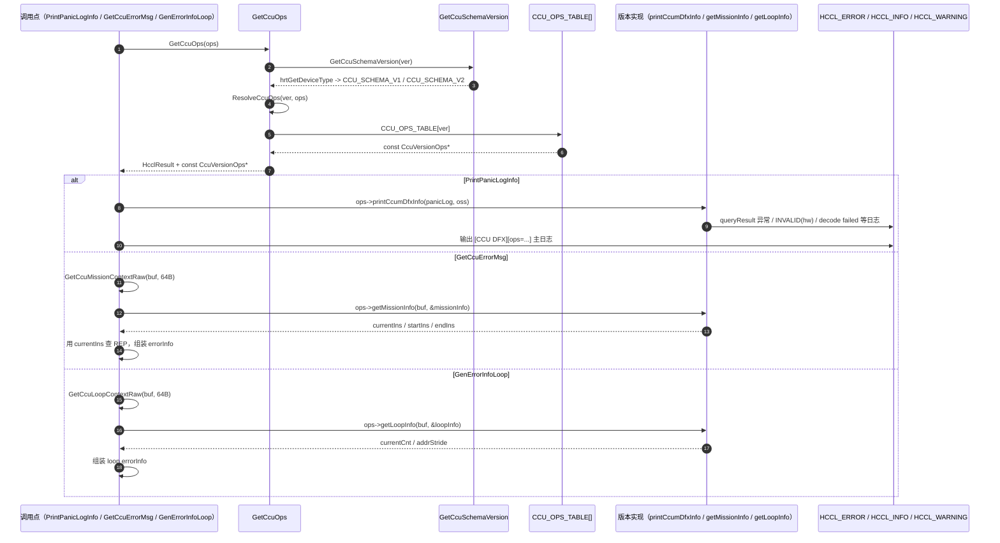

# HCCL DFX Task Exception 功能设计说明

> **文档定位**：本文档按照 **SRS / SD / SC** 三个部分组织，用于说明 HCCL Task Exception 的输入、处理、输出、设计方案、约束条件与测试范围。
>
> **当前结论**：CCU DFX 的 V1/V2 适配采用 **ops 注册表混合方案**：
>
> 1. `ccum_dfx_info` 走 **version-private print**，由 `printCcumDfxInfo` 直接按各版本 raw 布局输出日志；
> 2. `CcuMissionContext` / `CcuLoopContext` 不再暴露“大一统 view”，仅通过 `getMissionInfo` / `getLoopInfo` 提供 errorMsg 组装真正需要的最小标量；
> 3. 版本判型统一收敛在 `GetCcuOps()`，内部拆分为 `GetCcuSchemaVersion()` + `ResolveCcuOps()`，每次按当前设备类型无状态解析 ops。
>
> **范围说明**：本文档以 `next` 路径为主设计目标；`legacy` 路径中 mission/loop 的处理方式可作为收敛参考，重点是让 errorMsg 组装逻辑只依赖 `currIns`、`startIns`、`endIns`、`currentCnt`、`addrStride` 等必要标量，而不是依赖跨版本大 view。

---

## SRS

### 1. 介绍背景

HCCL 在运行期发生 task exception 时，会由 RTS 回调进入 host 侧异常处理逻辑，进一步分发到 CCU、MC2、AIV 或通用异常路径，打印运行时上下文、寄存器信息和任务信息，帮助定位 device 侧故障原因。

当前 task exception 处理中，`panicLog`、`CcuMissionContext`、`CcuLoopContext` 都是从 device 透传到 host 的裸缓冲。围绕这些 raw 数据的版本适配存在以下约束：

1. `ccum_dfx_info`、`CcuMissionContext`、`CcuLoopContext` 本体都不携带显式 schema 版本；
2. next 路径当前稳定可用的判型来源只有 `hrtGetDeviceType()`；
3. `ccum_dfx_info` 的消费点只有日志打印，而 mission/loop 的消费点还要参与 `GetCcuErrorMsg` / `GenErrorInfoLoop` 的分支判断；
4. 如果继续把所有版本字段折叠进一个统一 view，后续 V3/V4 会出现“字段不存在”和“字段存在但硬件标记无效”语义混淆；
5. 参考 legacy `2b868d4` 的处理方式，missionStatus、currIns、loopCurrentCnt、addrStride 等真正被 errorMsg 逻辑消费的字段其实很少，没有必要保留大而全的 decode view。

基于以上约束，本文档确定采用 **ops 注册表混合方案**：

- 保持对外异常处理接口不变；
- 引入统一的 `CcuSchemaVersion` 枚举和 `CcuVersionOps` ops 表，每版本一份静态实例，并通过 `CCU_OPS_TABLE[]` 数组按 schema 索引；
- 在 `GetCcuOps()` 中完成单点判型，并通过 `ResolveCcuOps()` 统一做 schema 到 ops 的索引解析；
- `ccum_dfx_info` 不再经过统一 view，改为每版本一个 `PrintCcumDfxInfoVx()`，直接访问本版本 raw 字段；
- `CcuMissionContext` / `CcuLoopContext` 只抽取 errorMsg 组装需要的最小标量，分别收敛到 `CcuMissionInfo` / `CcuLoopInfo`；
- 业务调用点只通过 ops 表拿能力，不再写 `if (version == V1) ... else ...` 分支。

#### 1.1 当前总体时序图（从 RTS 回调到 DFX 上报）



#### 1.2 相关代码范围

| 类型 | 文件 | 作用 |
| --- | --- | --- |
| next 入口 | `src/framework/next/coll_comms/dfx/taskException/host/ccuTaskException.cc` | CCU task exception 主处理逻辑 |
| next 头文件 | `src/framework/next/coll_comms/dfx/taskException/host/ccuTaskException.h` | 对外接口定义 |
| legacy 参考 | `src/legacy/unified_platform/ccu/dfx/ccu_error_handler.cpp` | `currIns` / errorMsg 组装的参考实现 |
| runtime 设备类型 | `src/platform/common/adapter/adapter_rts.cc` | `hrtGetDeviceType()` 实现 |
| 参考文档 | `docs/dfx_profiling_flow.md` | profiling 相关 DFX 链路说明 |

### 2. 输入

Task Exception 功能的主要输入如下。

| 输入项 | 来源 | 说明 |
| --- | --- | --- |
| `rtExceptionInfo_t* exceptionInfo` | RTS 回调 | 异常总入口，包含 taskId、streamId、expandInfo、mission 信息等 |
| `TaskInfo` / `GlobalMirrorTasks` | host 侧镜像 | 用于还原任务基础信息、group/rank、opData |
| `missionInfo.panicLog` | device 透传 | `ccum_dfx_info` 裸缓冲，供 `PrintPanicLogInfo` 使用 |
| mission raw bytes | custom channel 查询（`HccpRaCustomChannel(CCU_U_OP_GET_MISSION_CTX)`） | 32×u16=64B 协议；由 `GetCcuMissionContextRaw()` 拉到调用方 buffer，供 `GetCcuErrorMsg` 提取 `currIns` / `startIns` / `endIns` |
| loop raw bytes    | custom channel 查询（`HccpRaCustomChannel(CCU_U_OP_GET_LOOP_CTX)`）    | 32×u16=64B 协议；由 `GetCcuLoopContextRaw()` 拉到调用方 buffer，供 `GenErrorInfoLoop` 提取 `currentCnt` / `addrStride` |
| `missionInfo.status/subStatus` | device 透传 | 异常状态码，用于生成文本化错误描述 |
| `hrtGetDeviceType()` 返回值 | runtime | 当前唯一稳定可获取的芯片类型信息，用于选择 schema |

#### 2.1 `panicLog` 与 context 输入特征

| 特征 | 说明 |
| --- | --- |
| 数据类型 | `const uint8_t*` 或 custom channel 返回的 raw 结构体缓冲 |
| 自描述能力 | **无显式版本字段** |
| 当前版本来源 | 仅能通过 `hrtGetDeviceType()` 软判断 |
| 业务消费差异 | `ccum_dfx_info` 只打印；mission/loop 既要解码也要参与 errorMsg 逻辑 |
| 风险 | 若同一 `DevType` 下未来出现多种布局，仅靠当前机制无法 100% 判型 |

### 3. 处理

Task Exception 的处理分为“异常分发”和“ops 路由下的 DFX 消费”两层。

#### 3.1 总体流程图



#### 3.2 异常分发处理

1. `TaskExceptionHandler::Register` / `HrtRegTaskFailCallbackByModule` 在启动期注册回调；
2. 运行期异常进入 `TaskExceptionHandler::Process` 或 `CcuTaskException::ProcessCcuException`；
3. 根据 `exceptionInfo` 和 `taskType` 分发到 MC2、CCU、AIV 或通用异常路径；
4. 在 CCU / MC2 路径中调用 `PrintPanicLogInfo(panicLog)` 输出 CCU DFX 信息；
5. 随后在 `GetCcuErrorMsg` / `GenErrorInfoLoop` 中通过 `GetCcuMissionContextRaw()` / `GetCcuLoopContextRaw()` 拉 64B raw bytes 到栈上 buffer，并通过 ops 提取最小标量，完成 errorInfo 组装；
6. 最后继续清理 task kill 状态和 die 级 CKE。

#### 3.3 ops 路由处理（最终方案）

1. 保持 `PrintPanicLogInfo(const uint8_t *panicLog)`、`GetCcuErrorMsg(...)`、`GenErrorInfoLoop(...)` 对外接口不变；
2. 调用点内部通过 `GetCcuOps(ops)` 间接触发一次 `hrtGetDeviceType()`；
3. `GetCcuSchemaVersion()` 把 `DevType` 单点映射成 `CcuSchemaVersion`；
4. `GetCcuOps()` 先调用 `GetCcuSchemaVersion()`，再通过 `ResolveCcuOps()` 从 `CCU_OPS_TABLE[version]` 拿到对应 ops；
5. `PrintPanicLogInfo` 只调用 `ops->printCcumDfxInfo(panicLog, oss)`，日志组装完全下沉到版本私有 printer；
6. `GetCcuErrorMsg` 调用 `GetCcuMissionContextRaw()` 取得 mission raw bytes 后，调用 `ops->getMissionInfo(rawBuf, &missionInfo)`，用 `missionInfo.currentIns/startIns/endIns` 参与 REP 查询与日志输出；
7. `GenErrorInfoLoop` 调用 `GetCcuLoopContextRaw()` 取得 loop raw bytes 后，调用 `ops->getLoopInfo(rawBuf, &loopInfo)`，并直接检查 `HcclResult`，用 `loopInfo.currentCnt/addrStride` 组装 loop errorInfo；loop 的当前指令位由 errorMsg.loop 的外部字段提供，不重复从 raw 抽取；
8. 调用点不再感知 V1/V2 raw 布局差异。

#### 3.4 已删除的冗余方案

本次设计决策后，不再保留以下冗余正文方案：

- 裸 union + 调用点到处访问 `.v1/.v2`；
- `ccum_dfx_info` 统一 decode 成跨版本大 view；
- 为 `PrintPanicLogInfo` 额外增加 `deviceType` / `deviceId` 形参；
- mission/loop 暴露大而全 decode view，再由调用点二次筛字段。

保留的唯一待开发/待维护方案为：

> **ops 混合方案：`ccum_dfx_info` 走 print，下沉版本语义；mission/loop 走最小标量 getter，服务 errorMsg 组装。**

### 4. 输出

Task Exception 功能的输出包括日志、错误文本、清理动作与测试产物。

| 输出项 | 说明 |
| --- | --- |
| DFX 日志 | 打印 task 基础信息、group/rank、opData、CCU panicLog 信息、UB 辅助寄存器等 |
| 文本化错误信息 | 把 mission status / subStatus / rep 信息转换为可读文本 |
| 状态清理 | 清除 task kill 状态、清理 die 级 CKE |
| 测试结果 | UT/ST 用例执行结果、兼容性验证记录 |

---

## SD

### 1. 功能描述

本功能负责在 HCCL task exception 发生时，对异常路径进行分类处理，并针对 CCU 异常解析 `panicLog`、`CcuMissionContext`、`CcuLoopContext` 等 DFX 数据，为故障定位提供可读、稳定且可扩展的日志输出。

本设计采用 **ops 注册表混合方案**：

- `ccum_dfx_info`：版本私有 printer，直接按 raw 字段打印；
- `CcuMissionContext`：版本私有 getter，仅抽 `currentIns` / `startIns` / `endIns`；
- `CcuLoopContext`：版本私有 getter，仅抽 `currentCnt` / `addrStride`；
- `GetCcuOps()`：统一完成判型和 ops 解析。

#### 1.1 子功能拆分

| 子功能 | 说明 |
| --- | --- |
| 异常入口注册 | 在启动期向 RTS 注册异常回调 |
| 异常分发 | 根据融合异常类型和 taskType 分发到不同处理路径 |
| 版本判型 | `GetCcuOps()` 内单点判型，随后由 `ResolveCcuOps()` 解析 ops 表指针 |
| `panicLog` 打印 | `printCcumDfxInfo` 按版本直接输出日志 |
| mission 标量提取 | `getMissionInfo` 提取 `currIns/startIns/endIns` |
| loop 标量提取 | `getLoopInfo` 提取 `currentCnt/addrStride` |
| 错误文本生成 | 根据 mission status、repType、channel 信息生成可读错误文本 |
| 运行态清理 | 清除 task kill 状态与 die CKE |

#### 1.2 设计原则

1. **外部接口稳定**：不修改 `CcuTaskException::PrintPanicLogInfo`、`CcuTaskException::GetCcuErrorMsg`、`CcuTaskException::GenErrorInfoLoop` 等既有对外函数接口；
2. **判型单点收敛**：版本判型只在 `GetCcuOps()` 一处完成，schema 到 ops 的映射统一由 `ResolveCcuOps()` 负责；
3. **按消费方式拆能力**：只打印的数据走 printer，需要参与分支判断的数据走最小 getter；
4. **禁止统一大 view 扩散**：不再维护覆盖所有版本字段的 `CcumDfxDecodedInfo` / `CcuMissionDecodedInfo` / `CcuLoopDecodedInfo`；
5. **调用点零版本分支**：调用点只知道 `ops->printCcumDfxInfo`、`ops->getMissionInfo`、`ops->getLoopInfo`，不知道 raw 是 V1 还是 V2；
6. **C++14 兼容**：不使用 `std::optional` / `std::variant` 等 C++17 设施；
7. **ops 表保持 POD**：函数指针 + 静态实例，不引入虚函数和继承。

### 2. 流程描述

#### 2.1 总体流程



#### 2.2 ops 表加载与调用时序



#### 2.3 方案落地步骤

1. 在 `ccuTaskException.cc` 内部定义 `enum class CcuSchemaVersion`、`struct CcuVersionOps`；
2. 为 `ccum_dfx_info` 实现 `PrintCcumDfxInfoV1` / `PrintCcumDfxInfoV2`；
3. 为 mission / loop 实现版本私有最小 getter：`GetCcuMissionInfoV1/V2`、`GetCcuLoopInfoV1/V2`；
4. 实例化 `CCU_V1_OPS` / `CCU_V2_OPS`，并收录到 `CCU_OPS_TABLE[]`；
5. `GetCcuOps()` 通过 `GetCcuSchemaVersion()` 取索引后调用 `ResolveCcuOps()` 完成统一解析；
6. `PrintPanicLogInfo` 只保留 `GetCcuOps` + `ops->printCcumDfxInfo`；
7. `GetCcuErrorMsg` / `GenErrorInfoLoop` 改为只消费 `missionInfo` / `loopInfo` 的必要标量；
8. legacy 路径按需与该逻辑对齐，不再额外维护一套大 view 语义。

#### 2.4 增量变更说明

本次落地过程中额外完成以下两项 SC 整改：

**（1）`CcuMissionContextV2` 字段改名**

`CcuMissionContextV2`（[`ccu_error_info_v2.h`](../src/framework/next/coll_comms/dfx/taskException/host/ccu_error_info_v2.h)）的 `part0`/`part1` 别名字段改名，以消除与 `CcuMissionContext`（V1）的文本重复，避免静态扫描的重复代码 SC：

| 原字段名 | 新字段名 | 说明 |
| --- | --- | --- |
| `part0.taskId` | `part0.taskIdRaw` | 与 V1 `taskId` 对应同一硬件寄存器 |
| `part1.streamId` | `part1.streamIdRaw` | 与 V1 `streamId` 对应同一硬件寄存器 |

内存布局不变，外部无调用方直接访问上述字段，零影响范围改名。

**（2）`GenErrorInfoLoop` NBNC 超标、`GetCcuErrorMsg` 圈复杂度超标整改**

抽取三个 file-local static helper（位于匿名命名空间之后），消除函数内展开的 ops 调用链与重复逻辑：

| helper | 职责 |
| --- | --- |
| `DecodeRawMissionInfo(raw, out)` | 从 raw buffer 通过版本 ops 解码 `CcuMissionInfo`，提取自 `GetCcuErrorMsg` |
| `FetchAndDecodeLoopInfo(deviceId, dieId, loopCtxId, out)` | 拉取 loop raw context 并通过版本 ops 解码为 `CcuLoopInfo`，提取自 `GenErrorInfoLoop` |
| `FindSurroundingBeginInstr(ctx, startIns, currIns)` | 计算报错指令附近可用 Rep 的起始指令，提取自 `GetCcuErrorMsg` |

三者均为 file-local（不加入头文件），只服务上述两个函数，不改变对外接口。

### 3. 数据描述

#### 3.1 原始数据结构（保持不变）

| 数据结构 | 所在位置 | 说明 |
| --- | --- | --- |
| `ccum_dfx_info_v1` | legacy 路径 | legacy V1 raw |
| `ccum_dfx_info_v2` | legacy 路径 | legacy V2 raw（含 `valid_bits`） |
| `ccumDfxInfo` | `ccuTaskException.cc` | next V1 raw |
| `ccumDfxInfoV2` | `ccuTaskException.cc` | next V2 raw（位域 + `valid_bits` union，固定 128B） |
| `CcuMissionContextV1 / V2` | `ccu_error_info_v1.h` | mission 上下文 raw |
| `CcuLoopContextV1 / V2` | `ccu_error_info_v1.h` | loop 上下文 raw |

raw 结构本体由硬件 / 协议决定，本方案**不修改其布局**，只在其上增加版本私有打印器或最小 getter。

其中 `ccumDfxInfoV2` 当前布局约束为：`4B valid_bits + 31 * 4B reg payload = 128B`。UT 侧通过
`static_assert(sizeof(TestCcumDfxInfoV2) <= 128U)` 约束镜像结构不超过 panicLog 原始缓冲上限。

#### 3.2 新增的内部标准化数据

| 数据结构 | 用途 |
| --- | --- |
| `enum class CcuSchemaVersion` | 当前 CCU schema 版本枚举（`CCU_SCHEMA_V1` / `CCU_SCHEMA_V2`） |
| `struct CcuVersionOps` | 版本 ops 表，POD + 函数指针，每版本一份静态实例 |
| `CCU_OPS_TABLE[]` | ops 表指针数组，按 `CcuSchemaVersion` 索引 |
| `struct CcuMissionInfo` | mission 最小标量：`currentIns`、`startIns`、`endIns` |
| `struct CcuLoopInfo` | loop 最小标量：`currentCnt`、`addrStride` |

最小标量结构的设计原则如下：

1. **只保留调用点真实消费的字段**：不为“也许以后会用”保留跨版本大 view；
2. **字段语义直接对齐 errorMsg 逻辑**：mission 用于 REP 定位，loop 用于展示当前迭代计数与 stride；
3. **新增版本不破坏旧接口**：V3/V4 只需补对应 getter 实现，调用点无需改签名。

当前实现上有两个细节需要特别说明：

- `GetCcuMissionInfoV1` 直接复用 raw `GetCurrentIns()` / `GetStartIns()` / `GetEndIns()`；
- `GetCcuMissionInfoV2` 同样直接复用 raw `GetCurrentIns()` / `GetStartIns()` / `GetEndIns()`；
- `GetCcuLoopInfoV1/V2` 都可以直接复用 raw `GetCurrentCnt()` / `GetAddrStride()`。

另外，当前 `GetCcuMissionContextRaw()` / `GetCcuLoopContextRaw()` 是生产路径的唯一 raw 查询入口（方案 A：`HcclResult + uint8_t* buf + size_t bufLen + size_t& copiedLen`）：

- buffer 大小契约：调用方按 `.cc` 内部常量 `CCU_CTX_RAW_CAPACITY = 64`（对应 RTS 协议 32×u16）分配；该常量不对外暴露，头文件中无对应类成员；helper 在入参校验阶段会拒绝 `nullptr` / `bufLen < 64`；
- 失败语义：`hrtGetDevicePhyIdByIndex` / `HccpRaCustomChannel` / `memcpy_s` 任一失败都返回非 `HCCL_SUCCESS`，并把 `copiedLen` 置 0；helper 在拉数据前会先把 buffer 清零，避免上层误用残留；
- ABI tripwire 以 `static_assert(sizeof(CcuMissionContext{,V2}) == 64)` 等形式落在 UT 文件（`ut_ccu_task_exception_decode_test.cc`），上库必经 UT 编译，效果等价且不污染生产头文件；
- `GetCcuMissionContext()` / `GetCcuLoopContext()` 已删除，所有调用点（含原 profiling UT）已全部改用 `*Raw` 版本，调用点不再依赖任何 V1/V2 schema 类型；
- 后续由 `getMissionInfo` / `getLoopInfo` 继续做最小标量抽取；
- 文档中的错误传播描述，均以这一当前实现现状为准。

示意结构如下：

```cpp
struct CcuMissionInfo {
    uint16_t currentIns;
    uint16_t startIns;
    uint16_t endIns;
};

struct CcuLoopInfo {
    uint16_t currentCnt;
    uint32_t addrStride;
};
```

#### 3.3 ops 表与判型函数

当前方案的 ops 表定义如下：

```cpp
struct CcuVersionOps {
    const char *name;
    void (*printCcumDfxInfo)(const void *rawData, std::ostringstream &oss);
    HcclResult (*getMissionInfo)(const void *rawData, CcuMissionInfo *out);
    HcclResult (*getLoopInfo)(const void *rawData, CcuLoopInfo *out);
};

static const CcuVersionOps CCU_V1_OPS = {
    "CCU_V1",
    PrintCcumDfxInfoV1,
    GetCcuMissionInfoV1,
    GetCcuLoopInfoV1,
};

static const CcuVersionOps CCU_V2_OPS = {
    "CCU_V2",
    PrintCcumDfxInfoV2,
    GetCcuMissionInfoV2,
    GetCcuLoopInfoV2,
};
```

`GetCcuOps()` 的职责保持不变：

- 单点调用 `hrtGetDeviceType()`；
- 映射为 `CcuSchemaVersion`；
- 调用 `ResolveCcuOps()` 获取对应静态 ops；
- 结果不做进程级缓存，每次按当前设备类型无状态解析。

#### 3.4 判型来源

| 数据结构 | 判型来源 | 备注 |
| --- | --- | --- |
| `ccum_dfx_info` / `CcuMissionContext` / `CcuLoopContext` | `hrtGetDeviceType()` | next 路径当前唯一稳定来源，集中在 `GetCcuSchemaVersion()` 一处调用 |

设备类型 → schema 映射规则当前为：`DEV_TYPE_950 -> CCU_SCHEMA_V1`，其余设备 -> `CCU_SCHEMA_V2`。

判型频率：

- 每次异常路径可调用 `GetCcuOps()` 多次；
- 每次调用都会重新执行一次 `hrtGetDeviceType()` 与 `ResolveCcuOps()`；
- 当前路径属于 DFX / task exception 非热路径，这一无状态解析开销可接受，换来更直接的实现和更简单的 UT 隔离。

### 4. 依赖性描述

| 依赖模块 | 依赖内容 | 作用 |
| --- | --- | --- |
| RTS / Runtime | `hrtGetDeviceType`、异常回调 | 提供芯片类型和异常入口 |
| GlobalMirrorTasks / MC2GlobalMirrorTasks | 任务镜像 | 还原 task 上下文 |
| CCU Kernel / Context | `ccuKernelHandle`、rep 上下文 | 生成错误文本和上下文 |
| HCCP / Channel / Endpoint | channel handle、地址、rank | 获取网络上下文 |
| 日志系统 | `HCCL_ERROR` / `HCCL_INFO` / `HCCL_WARNING` | 输出 DFX 信息 |
| C++ 标准库 | `<sstream>` | 日志拼接 |
| 测试框架 | UT / ST 执行框架 | 兼容性和稳定性验证 |

### 5. 接口描述

#### 5.1 对外接口（保持不变）

| 接口 | 处理方式 |
| --- | --- |
| `TaskExceptionHandler::Process(...)` | 不变 |
| `TaskExceptionHandler::ProcessCcuException(...)` | 不变 |
| `CcuTaskException::ProcessCcuException(...)` | 不变 |
| `CcuTaskException::PrintPanicLogInfo(const uint8_t *panicLog)` | 不变 |
| `CcuTaskException::GetCcuErrorMsg(...)` | 不变 |
| `CcuTaskException::GenErrorInfoLoop(...)` | 不变 |

#### 5.2 新增的内部接口

| 接口 | 说明 |
| --- | --- |
| `enum class CcuSchemaVersion { CCU_SCHEMA_V1 = 0, CCU_SCHEMA_V2 = 1, CCU_SCHEMA_COUNT = 2 }` | schema 版本枚举 |
| `struct CcuMissionInfo` | mission 最小标量结构 |
| `struct CcuLoopInfo` | loop 最小标量结构 |
| `struct CcuVersionOps` | ops 表类型，见 §3.3 |
| `HcclResult GetCcuOps(const CcuVersionOps *&ops)` | 单点判型 + 无状态 ops 解析 |
| `static HcclResult ResolveCcuOps(CcuSchemaVersion, const CcuVersionOps *&ops)` | schema 到 `CCU_OPS_TABLE[]` 的统一索引解析 |
| `static void PrintCcumDfxInfoV1 / V2(const void*, std::ostringstream&)` | dfx_info 版本私有打印器 |
| `static HcclResult GetCcuMissionInfoV1 / V2(const void*, CcuMissionInfo*)` | mission 最小标量提取 |
| `static HcclResult GetCcuLoopInfoV1 / V2(const void*, CcuLoopInfo*)` | loop 最小标量提取，并直接返回标准错误码 |
| `static const CcuVersionOps CCU_V1_OPS / CCU_V2_OPS` | ops 表静态实例 |
| `static const CcuVersionOps* const CCU_OPS_TABLE[]` | ops 表指针数组 |
| `static HcclResult GetCcuSchemaVersion(CcuSchemaVersion&)` | 设备类型 → schema 单点映射 |

调用点最终形态如下：

```cpp
void CcuTaskException::PrintPanicLogInfo(const uint8_t *panicLog)
{
    if (panicLog == nullptr) {
        HCCL_ERROR("[PrintPanicLogInfo] panicLog is null");
        return;
    }
    const CcuVersionOps *ops = nullptr;
    CHK_RET(GetCcuOps(ops));

    std::ostringstream oss;
    oss << "[CCU DFX][ops=" << ops->name << "] CCU DFX INFO:";
    ops->printCcumDfxInfo(panicLog, oss);
    HCCL_ERROR("%s", oss.str().c_str());
}

HcclResult CcuTaskException::GetCcuErrorMsg(...)
{
    uint8_t missionRaw[CCU_CTX_RAW_CAPACITY] = {0};
    size_t missionRawLen = 0;
    if (GetCcuMissionContextRaw(deviceId, dieId, execMissionId,
            missionRaw, sizeof(missionRaw), missionRawLen) != HCCL_SUCCESS) {
        return HCCL_E_INTERNAL;
    }

    const CcuVersionOps *ops = nullptr;
    CHK_RET(GetCcuOps(ops));

    CcuMissionInfo missionInfo{};
    const HcclResult retGet = ops->getMissionInfo(missionRaw, &missionInfo);
    if (retGet != HCCL_SUCCESS) {
        return HCCL_E_INTERNAL;
    }
    const uint16_t currIns = missionInfo.currentIns;
    // 后续逻辑只依赖 currIns/startIns/endIns
}

HcclResult CcuTaskException::GenErrorInfoLoop(...)
{
    uint8_t loopRaw[CCU_CTX_RAW_CAPACITY] = {0};
    size_t loopRawLen = 0;
    if (GetCcuLoopContextRaw(baseInfo.deviceId, baseInfo.dieId, loopXm.loopCtxId,
            loopRaw, sizeof(loopRaw), loopRawLen) != HCCL_SUCCESS) {
        return HCCL_E_INTERNAL;
    }

    const CcuVersionOps *ops = nullptr;
    CHK_RET(GetCcuOps(ops));

    CcuLoopInfo loopInfo{};
    CHK_RET(ops->getLoopInfo(loopRaw, &loopInfo));
    errorMsg.msg.loop.loopCurrentCnt = loopInfo.currentCnt;
    errorMsg.msg.loop.addrStride = loopInfo.addrStride;
}
```

补充说明：当前代码中 mission getter 与 loop getter 都统一返回 `HcclResult`；其中：

- `GetCcuErrorMsg()` 会把 mission getter 失败统一翻译为 `HCCL_E_INTERNAL`；
- `GenErrorInfoLoop()` 则直接把 loop getter 的错误码向上返回。

### 6. 使用限制

1. **C++14 上限**：禁止引入 `std::optional` / `std::variant` 等 C++17 设施；
2. **判型函数唯一**：next 路径版本判型只能经过 `GetCcuOps()`，业务代码不得直接基于 `hrtGetDeviceType()` 写分支；
3. **`ccum_dfx_info` 只能由 printer 访问 raw 字段**：调用点禁止重新解析 `valid_bits`；
4. **mission/loop 只抽最小必要标量**：不得重新引入跨版本大 view；
5. **raw 字段访问只在版本实现内出现**：业务文件不得直接读取 V1/V2 raw 字段；
6. `panicLog == nullptr`、ops 获取失败都必须先行返回并打印明确日志；`GetCcuOps()` 只保证返回的 `ops` 指针非空，**不集中校验各子函数指针**（允许某些型号 ops 不实现部分能力），调用方在自己的使用点按需判 `printCcumDfxInfo` / `getMissionInfo` / `getLoopInfo` 是否为 `nullptr`；mission/loop raw 查询统一通过 `GetCcu{Mission,Loop}ContextRaw()`，由调用方按 `.cc` 内部常量 `CCU_CTX_RAW_CAPACITY`（64B）分配栈上 buffer，失败时 helper 返回非 `HCCL_SUCCESS` 并把 buffer/`copiedLen` 清零；`GetCcu{Mission,Loop}Context()` typed wrapper 已删除，所有 UT 已改为直接使用 `*Raw` 接口；
7. 新增 V3/V4 时只允许联动修改：加枚举值、加版本实现、加 `CCU_V3_OPS`、补 `CCU_OPS_TABLE[]`、补 `GetCcuSchemaVersion()` 映射，不允许触碰业务调用点签名。

### 7. log 等 DFX 设计

#### 7.1 日志输出原则

1. 日志关键词保持稳定，避免影响既有定位习惯；
2. `CCU DFX INFO` 主日志格式尽量保持兼容，新增字段做增量扩展；
3. 字段是否打印由版本私有 printer 决定，不再依赖统一 `validBits`；
4. 三类异常语义必须区分：
   - 字段不属于该版本：**静默不打**；
   - 硬件标记字段无效：输出 `INVALID(hw)` 并 `HCCL_WARNING`；
   - `memcpy_s` / 解码失败：输出 `[decode failed]` 并 `HCCL_ERROR`；
5. ops 表的 `name` 字段应在日志中打印一次，例如 `[CCU DFX][ops=CCU_V2]`；
6. mission / loop 的 getter 本身不负责打印完整日志，只负责给 errorMsg 组装提供必要标量。

#### 7.2 建议日志项

| 日志项 | 建议 |
| --- | --- |
| `GetCcuOps()` 判型失败 | 打印 `GetCcuSchemaVersion()` / `hrtGetDeviceType()` 返回值 |
| printer 失败 | 打印 ops 表 `name`、失败原因（如 `memcpy_s` ret） |
| `queryResult != 0` | 保留现有错误语义 |
| hw 无效字段 | 在同行日志中输出 `INVALID(hw)`，并额外打 `HCCL_WARNING` |
| mission / loop getter 失败 | 打印设备、die、missionId / loopCtxId 等上下文 |

### 8. 资料描述

#### 8.1 代码资料

- `src/framework/next/coll_comms/dfx/taskException/host/ccuTaskException.h`
- `src/framework/next/coll_comms/dfx/taskException/host/ccuTaskException.cc`
- `src/framework/next/coll_comms/dfx/taskException/host/ccu_error_info_v1.h`
- `src/legacy/unified_platform/ccu/dfx/ccu_error_handler.cpp`
- `src/platform/common/adapter/adapter_rts.cc`
- `test/ut/framework/next/coll_comms/dfx/ut_ccu_task_exception_decode_test.cc`

#### 8.2 文档资料

- `docs/dfx_task_exception_flow.md`
- `docs/dfx_profiling_flow.md`
- `.github/instructions/dfx-triage.instructions.md`
- `.github/instructions/cpp.instructions.md`

#### 8.3 测试资料

- 现有 CCU / DFX 相关 UT
- 新增的 ops / printer / getter UT
- ST 联调结果与日志样例

### 9. 性能质量描述

#### 9.1 性能要求

| 项 | 要求 |
| --- | --- |
| 异常路径额外开销 | 可接受，非主执行热路径 |
| 整进程判型次数 | 与异常路径内 `GetCcuOps()` 实际调用次数一致 |
| 单次异常路径中判型次数 | 与调用点触发次数一致，不做额外缓存 |
| printer / getter 复杂度 | O(1)，单次 `memcpy_s` + 少量字段抽取 |
| 函数指针调用开销 | 一次间接跳转，相对日志格式化可忽略 |
| 动态内存分配 | 仅打印路径使用 `std::ostringstream` |

#### 9.2 质量要求

| 项 | 要求 |
| --- | --- |
| 兼容性 | 同时兼容 V1/V2 raw 布局；后续 V3 只新增 ops 表项 |
| 稳定性 | `panicLog == nullptr` / getter 失败 / 判型失败时不崩溃，并打印明确日志 |
| 可维护性 | 判型、打印、最小标量提取、业务消费物理隔离 |
| 可演进性 | 新增 V3 改动量为常数，调用点 0 版本分支 |
| 安全性 | raw → struct 一律走 `memcpy_s`，ops 表为 `static const` |

---

## SC

以下测试内容覆盖 UT 与 ST，按功能、性能、异常、兼容性等类型组织。

| 用例类型 | 测试项 | 重要级别 | 测试内容 | 预期 | 已实现位置 |
| --- | --- | --- | --- | --- | --- |
| 功能-UT | `GetCcuOps` V1 路径 | 高 | mock `hrtGetDeviceType` 返回 `DEV_TYPE_950`，直接调用 `GetCcuOps` | 选中 `CCU_V1_OPS` | `Ut_GetCcuOps_WhenDeviceTypeIs950_ExpectV1Ops` |
| 功能-UT | `GetCcuOps` V2 路径 | 高 | mock 返回非 950 设备，直接调用 `GetCcuOps` | 选中 `CCU_V2_OPS` | `Ut_GetCcuOps_WhenDeviceTypeIs910B_ExpectV2Ops` |
| 功能-UT | `GetCcuOps` 同进程切换兼容 | 高 | 同一进程内先 mock V1，再 mock V2 | 两次调用分别返回 `CCU_V1_OPS` / `CCU_V2_OPS`，无跨 case 污染 | `Ut_GetCcuOps_WhenSwitchDeviceTypeInProcess_ExpectNoCrossCasePollution` |
| 功能-UT | `hrtGetDeviceType` 失败路径 | 高 | mock 返回失败 | 直接返回原始错误码，`ops == nullptr` | `Ut_GetCcuOps_WhenDeviceTypeQueryFails_ExpectErrorReturned` |
| 功能-UT | `ResolveCcuOps` 接口链路 | 高 | 经 `GetCcuOps` 走 `GetCcuSchemaVersion -> ResolveCcuOps -> CCU_OPS_TABLE` | schema 到 ops 的索引解析正确 | 已由上述 `GetCcuOps` 用例间接覆盖 |
| 功能-UT | V1 `PrintCcumDfxInfo` 输出 | 高 | 构造完整 V1 raw，并直接调用 printer | 输出 V1 固有字段，不包含 `MCM_DFX`，字符串无多余内容 | `Ut_PrintCcumDfxInfoV1_WhenDeviceTypeIs950_ExpectReadableString` |
| 功能-UT | V2 `PrintCcumDfxInfo` 全字段有效 | 高 | 构造 `valid_bits` 全开的 V2 raw，并直接调用 printer | 输出所有 V2 字段，包含 `MCM_DFX` | `Ut_PrintCcumDfxInfoV2_WhenDeviceTypeIs910B_ExpectReadableString` |
| 功能-UT | V2 `PrintCcumDfxInfo` 部分字段 hw 无效 | 高 | 部分 `valid_bits` 关闭 | 对应字段输出 `INVALID(hw)`，且不泄漏无效原始值 | `Ut_PrintCcumDfxInfoV2_WhenFieldInvalid_ExpectInvalidMarkerWithoutRawValue` |
| 功能-UT | V1 `PrintCcumDfxInfo` 空指针 | 中 | 直接调用 `ops->printCcumDfxInfo(nullptr, oss)` | 输出 `[rawData is null]` | `Ut_PrintCcumDfxInfoV1_WhenRawDataNull_ExpectReadableNullMarker` |
| 功能-UT | V2 `PrintCcumDfxInfo` 空指针 | 中 | 直接调用 `ops->printCcumDfxInfo(nullptr, oss)` | 输出 `[rawData is null]` | `Ut_PrintCcumDfxInfoV2_WhenRawDataNull_ExpectReadableNullMarker` |
| 功能-UT | V1 `getMissionInfo` | 高 | 构造 `CcuMissionContextV1` | `currentIns` / `startIns` / `endIns` 正确 | `Ut_CcuMissionContextV1_*` |
| 功能-UT | V2 `getMissionInfo` | 高 | 构造 `CcuMissionContextV2` | `currentIns` / `startIns` / `endIns` 正确 | `Ut_CcuMissionContextV2_*` |
| 功能-UT | V1 `getLoopInfo` | 高 | 构造 `CcuLoopContextV1` | 返回 `HCCL_SUCCESS`，且 `currentCnt` / `addrStride` 正确 | `Ut_CcuLoopContextV1_*` |
| 功能-UT | V2 `getLoopInfo` | 高 | 构造 `CcuLoopContextV2` | 返回 `HCCL_SUCCESS`，且 `currentCnt` / `addrStride` 正确 | `Ut_CcuLoopContextV2_*` |
| 功能-UT | raw context 查询失败保护 | 高 | `hrtGetDevicePhyIdByIndex` 失败 / `HccpRaCustomChannel` 失败 / buffer 不足 / buffer 为 nullptr | `GetCcu{Mission,Loop}ContextRaw` 返回非 `HCCL_SUCCESS`，`copiedLen=0`，buffer 被清零 | `Ut_GetCcuMissionContextRaw_WhenBufNull_ExpectParaError`、`Ut_GetCcuMissionContextRaw_WhenBufTooSmall_ExpectParaError`、`Ut_GetCcuMissionContextRaw_WhenGetDevicePhyIdFail_ExpectErrorAndZeroBuf`、`Ut_GetCcuMissionContextRaw_WhenChannelFail_ExpectErrorAndZeroBuf`、`Ut_GetCcuLoopContextRaw_WhenBufTooSmall_ExpectParaError`、`Ut_GetCcuLoopContextRaw_WhenGetDevicePhyIdFail_ExpectErrorAndZeroBuf`、`Ut_GetCcuLoopContextRaw_WhenChannelFail_ExpectErrorAndZeroBuf` |
| 功能-UT | getter 非法入参 | 高 | 传入 `rawData == nullptr` 或 `out == nullptr` | 直接返回对应 `HcclResult` 错误码，并打印 `HCCL_ERROR` | `Ut_GetCcuMissionInfoV1_WhenRawDataIsNull_ExpectErrorReturned`、`Ut_GetCcuMissionInfoV1_WhenOutIsNull_ExpectErrorReturned`、`Ut_GetCcuLoopInfoV1_WhenRawDataIsNull_ExpectErrorReturned`、`Ut_GetCcuLoopInfoV1_WhenOutIsNull_ExpectErrorReturned`、`Ut_GetCcuMissionInfoV2_WhenRawDataIsNull_ExpectErrorReturned`、`Ut_GetCcuMissionInfoV2_WhenOutIsNull_ExpectErrorReturned`、`Ut_GetCcuLoopInfoV2_WhenRawDataIsNull_ExpectErrorReturned`、`Ut_GetCcuLoopInfoV2_WhenOutIsNull_ExpectErrorReturned` |
| 功能-UT | `PrintPanicLogInfo` 空指针保护 | 高 | 调用 `PrintPanicLogInfo(nullptr)` | 安全返回，不崩溃 | `Ut_PrintPanicLogInfo_WhenNullPtr_ExpectNoCrash` |
| 功能-UT | 对外接口不变性 | 高 | 编译调用 `PrintPanicLogInfo` / `GetCcuErrorMsg` / `GenErrorInfoLoop` | 无需修改外部调用代码 | 待补 |
| 兼容-UT | `CcuMissionContextV2` 字段改名 | 中 | 确认外部无调用方直接使用 `part0.taskId` / `part1.streamId`（V2）；编译通过 | 无编译错误，行为不变 | 已验证（grep 确认无外部访问，UT 编译通过） |
| 质量-UT | `GenErrorInfoLoop` NBNC ≤ 50 | 高 | 通过 `FetchAndDecodeLoopInfo` helper 抽取后，NBNC 行数降至阈值以下 | SC 不再告警 | 已整改（helper 已落入 `ccuTaskException.cc`） |
| 质量-UT | `GetCcuErrorMsg` 圈复杂度 ≤ 20 | 高 | 通过 `DecodeRawMissionInfo` / `FindSurroundingBeginInstr` 抽取后，圈复杂度降至阈值以下 | SC 不再告警 | 已整改（helper 已落入 `ccuTaskException.cc`） |
| 兼容-UT | legacy / next 最小标量一致性 | 中 | 同一 V1/V2 raw 分别喂给两条路径 | `currIns` / `startIns` / `endIns` / `currentCnt` / `addrStride` 一致 | 待补 |
| 性能-UT | 单次异常路径判型次数 | 中 | 一次异常路径内统计判型函数调用 | `ProcessCcuException` 在循环外解析一次 ops 后按 mission 数复用，`hrtGetDeviceType` 调用次数 ≤ 1 | 待补 |
| 功能-ST | CCU 单算子异常链路 | 高 | 在真实/联调环境触发 CCU task exception | 打印统一格式 CCU DFX INFO + 错误文本 | 待补 |
| 功能-ST | MC2 融合异常链路 | 高 | 触发 MC2 融合异常 | panicLog、mission、loop 相关日志和错误文本正确 | 待补 |
| 功能-ST | AIV / 通用异常回归 | 中 | 回归 AIV 和通用异常路径 | 非 CCU 路径行为不受影响 | 待补 |
| 兼容-ST | 不同目标芯片验证 | 高 | 在当前支持的目标 `DevType` 环境验证 | ops 表选择与预期一致，日志头 `[ops=CCU_Vx]` 正确 | 待补 |
| 异常-ST | V2 无效字段日志表现 | 中 | 使用部分 `valid_bits` 关闭的联调样例 | 日志出现 `INVALID(hw)`，不出现误导性默认值 | 待补 |
| 性能-ST | 异常路径开销评估 | 低 | 在 task exception 场景采样日志和额外耗时 | 相比原流程无显著额外开销 | 待补 |

### SC 补充说明

1. **UT** 重点覆盖三块：`GetCcuOps()` 判型与 `ResolveCcuOps()` 索引解析、`PrintCcumDfxInfoV1/V2` 日志语义、mission/loop 最小 getter 的标量提取正确性；当前实现已改为无状态判型，V1/V2 双路径可以在同一个 gtest 进程内覆盖；
2. **ST** 重点验证真实异常链路、`[ops=CCU_Vx]` 标签可读性、不同芯片兼容性；
3. 后续新增 V3 时，直接复用本表新增 V3 路径用例即可，调用点不需要新增版本分支测试。

---

## 评审结论摘要

1. 本文档已按 **SRS / SD / SC** 三部分组织；
2. CCU DFX 的 V1/V2 适配方案统一收敛为 **ops 注册表混合方案**：`ccum_dfx_info` 走版本私有打印，mission/loop 走最小标量 getter；
3. 对外接口保持不变，不引入额外 `deviceId` / `deviceType` 形参；
4. `GetCcuOps()` 是唯一判型入口，内部通过 `ResolveCcuOps()` 统一完成 schema 到 ops 的索引解析；
5. 文档不再保留 `CcumDfxDecodedInfo` / `validBits` / `AppendCcumDfxField` 这类统一大 view 方案；
6. 后续新增 V3 仅需新增版本实现和 ops 表项，`GetCcuOps()` 与业务调用点保持不变。
