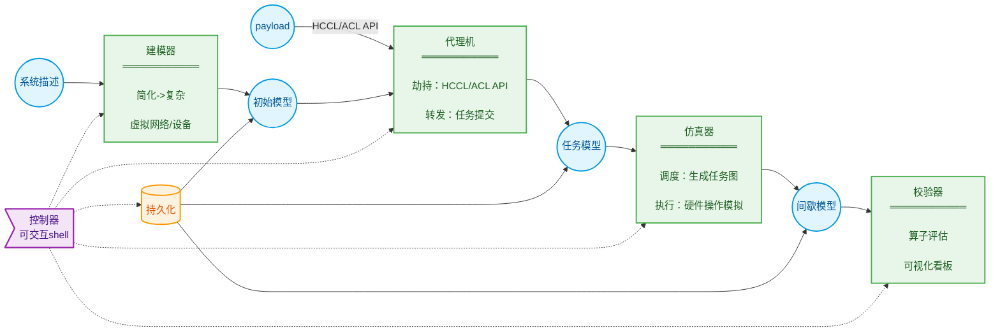
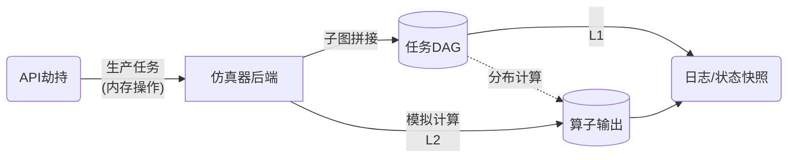
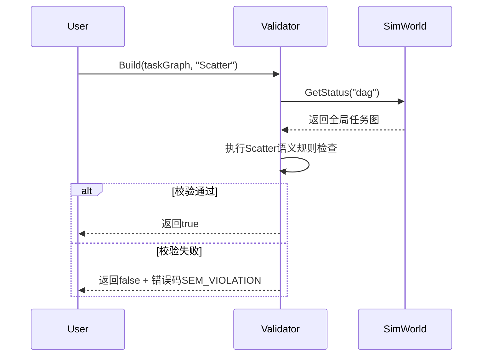
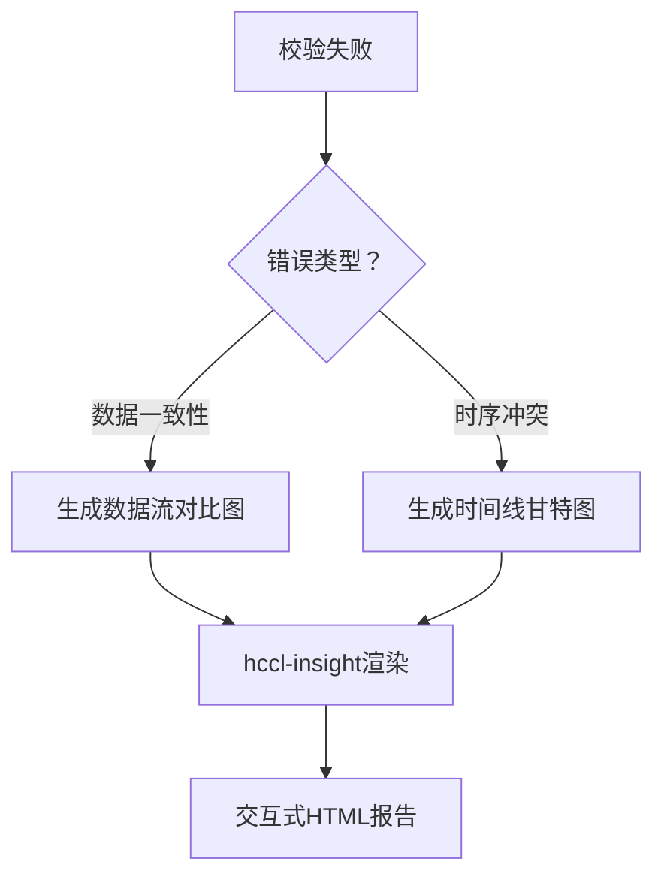

# HCCL 模拟器需求分析

## 需求背景

### 目的

为集群通信模块提供**离线、可扩展、高确定性**的测试框架：

- **新算法研发**  
  支持自定义通信算子（如 scatter 变种）的设计验证，提供算法可视化分析
- **基础包质量保障**
  - [x] 评审意见：增加新目标基础包看护 @`lijianbo`
        通过 Runtime/Driver/Net 等 HAL 接口实现 HCCL 用例的离线快速回归
- **架构验证（远期）**  
  验证算法与硬件拓扑（HCCS/RoCE）的物理兼容性

### 范围

分层模拟深度实现：
| 层级 | 能力 | 阶段 |
|------|------|------|
| L1 | 通信语义校验 | ✅ 当前 |
| L2 | 逻辑功能复现 | ⚠️ 挑战 |
| L3 | 网络性能建模 | ⏳ 远期 |
| L4 | 故障注入诊断 | ⏳ 远期 |

- [x] 评审意见：增加增加定语“通信" @`lijianbo`
- [x] 评审意见：希望未来能做到故障模拟 @`xiaoshizhong`

#### 使用场景

| 角色     | 用途                       |
| -------- | -------------------------- |
| 开源贡献 | 验证新增算子/算法语义      |
| 测试     | 运行 HCCL API 测试用例     |
| 开发     | 执行 Runtime/Driver 级用例 |

- [x] 评审意见：增加描述“算法” @`lijianbo`

#### 输入形式

- **配置驱动**  
  YAML 定义硬件拓扑（附录 B）
  - [ ] 遗留问题：是否考虑优先使用 JSON @`yuhao`
  - [ ] 遗留问题：明确拓扑定义内容 @`zhanhaifeng`
- **API 劫持**  
  重定向 hcclInitComm/aclrtMalloc 等调用到模拟后端

#### 输出形式

| 类型     | 用途                  |
| -------- | --------------------- |
| 程序日志 | 用户标准输出          |
| 验证结果 | 外置校验器报告        |
| 状态快照 | 二进制缓冲区文件      |
| 可视化   | hccl-insight 渲染分析 |

---

## 系统上下文(忽略)

---

## 需求概述

### 核心架构

#### 设计理念

**非侵入式运行时劫持**：


**核心优势**：

1. **高保真**：真实二进制执行路径
2. **零入侵**：无需修改用户代码
3. **强扩展**：支持任意 HCCL/ACL 程序

**确定性保证**：

- L1：通信语义检查（无并发通信域/算子）
- L2：全局事件序列化
- L3/L4：固定种子随机源或统一时钟

- [x] 评审意见：L1 阶段只需要通信语义检查，不涉及事件并发 @`chenchao`
- [ ] 遗留问题：稍微展开 L3/L4 阶段事件并发的保序列设计 @`yuhao`

### 典型工作流

- [x] 评审意见：补充用例视角描述 @`xiaoshizhong`

#### 开源贡献者自定义算子验证流程 (LLT)

1. **环境准备**

   - 克隆 `hccl_ops` 算子仓库
   - 根据贡献指南构建并运行预置的 **scatter 算子用例**

2. **算子开发**

   - 参考 scatter 算子实现 **CustomAllreduce 算子**
   - 完成算子构建并验证运行成功

3. **执行验证用例**  
   在代码工程中运行 Checker 用例（示例逻辑）：

   ```python
   model = SimWorld("./topologies/cloud_matrix.yaml")  # 初始化仿真模型

   # 单线程循环模拟各Rank执行
   foreach rank in rankGraph:
      HcclInitComm(...)
      ret = HcclScatter(rankGraph, scatter, array, 'root:0')  # 执行原算子

   # 任务图生成
   taskGraph = model.GetStatus('taskGraph')

   # 算子语义校验
   checker = Validator<Scatter>().Build(taskGraph)
   EXPECT(checker.CheckSemantic(), 'success')  # 验证结果
   ```

4. **验证自定义算子**  
   将上述代码中的 `HcclScatter` 替换为 `CustomAllreduce` 后重新执行用例

#### 开发者本地开发集合通信代码后，上库前在仿真系统上快速迭代验证

1. **启动模拟器：** 在 root 用户下运行 `hccl-vm` 命令并指定拓扑。

   ```bash
   root%> hccl-vm --topology=atlas900
   ```

   - **系统反馈：** `info: entered hccl-vm` _(模拟器：创建仿真模型)_
   - **系统状态：** 提示符变为 `hccl-vm%>` _(模拟器：启动交互式 shell)_

2. **执行通信程序：** 在模拟器 shell 中运行 `scatter.bin` 程序（可使用 MPI/slurm 等启动）。

   ```bash
   hccl-vm%> ./scatter.bin
   ```

3. **反复执行操作：** 在模拟器 shell 中（根据需要）单独执行 初始化通信域用例。

   ```bash
   hccl-vm%> ./test_init_comm
   ```

4. **退出模拟器：** 在模拟器 shell 中输入 `exit` 命令。

   ```bash
   hccl-vm%> exit
   ```

   - **系统反馈：** `info: exit hccl-vm` _(模拟器：清理资源后退出)_
   - **系统状态：** 提示符变回 `root%>`

#### 测试在多服务器上跑多 server 用例

1. **登录 Server1：** 在 root 用户启动模拟器。

   - **系统状态：** 提示符变为 `hccl-vm%>` _(模拟器：启动交互式 shell)_

2. **执行通信程序：** 在模拟器 shell 中运行 `scatter.bin` 程序

   ```bash
   hccl-vm%> py3 allreduce.py --host 90.91.103.38 --data-sample large-b16 --serverid 0 --deviceid 8 --op sum
   hccl-vm%> py3 allreduce.py --host 90.91.103.38 --data-sample small-b16 --serverid 1 --deviceid 1 --op sum
   ```

3. **登录 其它 server：** 反复 1-2 过程 _(模拟器：启动交互式 shell)_

4. **在某服务器命令行界面，查看程序日志：**：

   ```bash
   hccl-vm%> ...
   hccl-vm%> ...
   ```

### 约定

#### 术语

- hccl-vm：模拟器交付的控制器程序（交互式 shell + 后端进程）
- libhccl-vm.so：模拟器交付的核心库
- libhccl-proxy.so：劫持库（LD_PRELOAD）
- IPC：libhccl-proxy.so 与 hccl-vm 后端通过共享内存通信，以执行劫持 ACL/HCCL 后构造的负载(任务)

#### 关键机制

- CLI：
  1. hccl-vm --topology=`describe-file-path`
  2. 进入交互式 shell 后执行用户命令
- 环境变量：LD_PRELOAD 指向 libhccl-proxy.so，由 hccl-vm 设置并在子进程中生效
- 进程模型：hccl-vm 以 fork+exec 执行用户命令；OS loader 优先加载 libhccl-proxy.so

---

## 系统功能需求分解



按项目进度整理交付矩阵如下：

| 阶段    | 建模器    | 代理机     | 仿真器   | 校验器        | 持久化       | 控制器   |
| ------- | --------- | ---------- | -------- | ------------- | ------------ | -------- |
| L1      | A3 精简   | HCCL-AICPU | 任务成图 | checker 移植  | -            | -        |
| L2      | A2/5 全系 | HCCL/ACL   | 顺序执行 | A5 插件化移植 | ✅           | ✅       |
| L2 挑战 | 分布式    | 批量转发   | 并行计算 | 可视化        | 高并发 IO 库 | 集群管理 |

- **L1 阶段**：交付 模拟器核心库  
  `libhccl-vm.so`（A3/AICPU 的建模仿真+校验器） + `libhccl-proxy.so`（精简代理机）  
  用户通过 LLT 实现通信语义校验（FR2.1→FR3）
  - [x] 评审意见: checker 项目支持至少引入 3k 工作量，模拟器针对 L1 阶段分解出最小开源要求，可以参考 check 老的 llt 使用方式。@lijianbo/yinding
- **L2 阶段**：交付独立控制器  
  `hccl-vm`（FR5） + 完整建模器（FR1） + 持久化（FR4）  
  支持命令行启动非侵入式环境，实现逻辑功能复现
- **L2 挑战**：挑战直接运行测试组原有分布式真机用例
  - [x] 评审意见: 成图->执行的串行机制不符合系统行为，且中心化任务图容易造成 IO 瓶颈 @xiaoshizhong
  - [ ] 遗留问题: 穿刺系统效率瓶颈，给出性能报告 @yuhao

### FR1 构造集合通信仿真环境

**约束**：

- ✅ 仅支持动态链接（acl/aclRt/hccl-base）
- ❌ 不支持 setuid/setgid 程序。

**核心能力**：

> 新增/查询：集合通信仿真模型

```python
# 示例
model = SimWorld("./topologies/cloud_matrix.yaml")
device = model.GetStatus("device0")
```

**交互流程**：
| 步骤 | 动作 | 结果 |  
|------|-------|------|  
| 1 | 加载 YAML 配置 | 生成初始模型 |  
| 2 | 调用`SimWorld()` | 返回模型句柄 |  
| 3 | 查询`GetStatus()` | 获取指定状态数据 |

**失败场景**：配置文件错误，打印解析详情

### FR2 仿真执行集合通信算子



#### **核心能力说明（后台自动完成）**

| 阶段     | 功能                    | 用户（开发者）可见效果  |
| -------- | ----------------------- | ----------------------- |
| **劫持** | 动态重定向 HCCL/ACL API | 原 LLT 用例修改链接选项 |
| **转发** | 封装通信任务元数据      | ~~不可见~~              |
| **仿真** | 生成全局 DAG 任务图     | 可从建模接口获得该状态  |
| **执行** | 模拟内存搬运与状态迁移  | 可从建模接口获得该状态  |

**开发前置**：

1. 开发者已经开发 scatter 算子变体程序`./my_scatter.bin`
2. `./my_scatter.bin`使用 `lib-vm.so` 的接口完成仿真建模

**成功场景 1**：通过 `-lhccl-proxy` 链接代理库后运行

```bash
# 编译时链接（示意）
ld ./scatter.bin -lhccl-proxy -lhccl-vm
# 命令行执行
./scatter.bin
```

**成功场景 2**：通过 LD_PRELOAD 劫持代理库

```bash
# 单机执行（自动完成劫持→仿真）
LD_PRELOAD=libhccl-proxy.so ./scatter.bin
```

**功能演进，场景不变**：
| 阶段 | 能力 | 用户操作变化 |
| ------- | -------------------- | ----------------------- |
| L1 | 单进程多 Rank 模拟 | ~~无变化~~ |
| L2 | 多进程单 Server 模拟 | ~~无变化~~ |

### **FR3 仿真环境下算子结果的语义校验**

#### **核心能力**

1. **算子语义验证**
   - 支持预置算子（AllReduce/Scatter 等）的通信语义校验
   - 提供插件化扩展接口
2. **可视化分析**
   - 生成交互式通信拓扑图
   - 标记语义违规点
3. **校验报告生成**
   - 结构化错误诊断（数据一致性/时序冲突）

### **成功场景**

#### **场景 1：基础算子语义校验**



**用户操作**：

```python
# 加载任务图
task_graph = model.GetStatus('taskGraph')

# 创建校验器
scatter_validator = Validator<Scatter>()
scatter_validator.Build(task_graph)

# 执行校验
if scatter_validator.CheckSemantic():
   print("Scatter语义校验通过")
```

#### **场景 2：自定义算子热插拔**

```bash
# 在hccl-vm交互环境中
hccl-vm%> validator install ./custom_allreduce_validator.so
[System] Success: Validator 'CustomAllReduce' registered

# 代码调用
validator = Validator<CustomAllReduce>()
validator.Build(task_graph)
validator.CheckSemantic()
```

#### **场景 3：可视化诊断**



**输出示例**：

| 错误类型   | 节点  | 预期值         | 实际值       |
| ---------- | ----- | -------------- | ------------ |
| 数据不一致 | Rank1 | 0x7f8e (32782) | 0x0000 (0)   |
| 死锁风险   | Rank2 | 等待 Rank3     | 超时(>200ms) |

---

### **失败场景**

#### **场景 1：校验插件加载失败**

**触发条件**：

- 插件 ABI 版本不兼容
- 插件符号未导出`Validator_CreateInstance`

**系统响应**：

```bash
hccl-vm%> validator install ./broken_validator.so
[ERROR] Plugin load failed:
  - ABI version mismatch (expected v3, got v2)
  - Symbol 'Validator_CreateInstance' not found
[建议] 使用validator check-abi ./broken_validator.so 检查兼容性
```

#### **场景 2：无效任务图输入**

**触发条件**：

```python
# 传入非DAG结构
validator.Build("invalid_data")
```

**系统响应**：

```python
Traceback (most recent call last):
  File "test.py", line 12, in <module>
    validator.Build("invalid_data")
hccl.error.InvalidGraphError:
    Expected TaskGraph object, got <class 'str'>
```

#### **场景 3：运行时状态冲突**

**触发条件**：

```python
# 在通信执行中尝试校验
while HcclAllReduce(is_running=True):
    validator.CheckSemantic()  # 非法调用！
```

**系统响应**：

```
[FATAL] Validator state conflict:
  - Operation not allowed during HcclAllReduce execution
  - Call GetStatus('idle') before validation
```

---

### **约束与演进**

| 能力             | L1 阶段  | L2 阶段             |
| ---------------- | -------- | ------------------- |
| **预置校验器**   | Scatter  | 全量 HCCL 算子      |
| **插件机制**     | 静态链接 | 动态加载(.so)       |
| **可视化**       | 文本报告 | 交互式拓扑图+时间线 |
| **错误定位精度** | 节点级   | 缓冲区字节偏移量    |

**关键演进路径**：

1. 提供`validator-template`代码生成器（L2）
2. 支持分布式校验协调（L2 挑战阶段）
3. 集成内存访问轨迹追踪（L3）

### FR4 持久化

- [ ] 遗留问题：持久化作为扩展需求，到 L2 阶段 开发前 修订完成 @yuhao

#### `L2阶段`Story: 模拟器提供持久化接口，以便开发者测试结束快速定位问题

### FR5 控制器

- [ ] 遗留问题：控制器作为命令行需求，到 L2 阶段 开发前 修订完成 @yuhao

考虑到易用性，用户在一般在终端中使用 HCCL 测试程序，因此控制器通过命令行实例程序承载。

#### 控制器约定

- 命令行运行时不支持切换拓扑
- 以下用描述用`shell`代替`命令行`

#### `L2阶段`Story: 用户通过一个交互式`shell`启动模拟器，进而在后台自动创建一个虚拟通信集群。因此，用户直觉认为可以在该交互式`shell`环境中，可以反复测试/验证自己的 HCCL 程序

##### `shell`启动前置

- 模拟器在安装时，在其同级目录（如 `./topologies`）中预置了多个系统配置文件，例如 `cloud_matrix.yaml`, `atlas900.yaml`。
- 系统配置文件只读，且没有被损坏。

##### 成功场景: 系统模型发现

- [x] 评审意见：“拓扑发现”容易和专业术语混淆 @`lijianbo`

1. 用户通过 `hccl-vm --list-topologies` 查看支持模拟的系统。
2. 命令会打印出 cloud_matrix, atlas900 等所有内置系统模型的列表，但不启动模拟器。

##### 成功场景: 成功启动模拟器并劫持应用

1. 用户启动 `hccl-vm` 主控程序，指定拓扑配置文件，进入交互式 shell。
2. `hccl-vm` 解析并加载相应的系统配置文件，调用建模器，创建初始系统模型, 提示模拟器创建成功
3. 用户在`shell`中执行 `./scatter_perf`，例如:
4. `hccl-vm` 为子进程设置 `LD_PRELOAD=libhccl-proxy.so`，`fork/exec` 执行。
5. OS 装载器优先加载 `libhccl-proxy.so`。应用调用 CUDA/NCCL API 时被劫持。
6. `libhccl-proxy.so` 通过 IPC 委派到 `hccl-vm` 后端执行模拟。
7. 应用完成并将标准输出/错误回放给用户；返回码透传给 hccl-vm 交互式 shell。
8. 用户可 `exit` 退出 shell，sim_run 退出码为 0。流程交互示例如下

   ```bash
   root%>hccl-vm --topology=atlas900
   info: entered hccl-vm
   hccl-vm%>
   hccl-vm%>./scatter_perf
   hccl-vm%>exit
   info: exit hccl-vm
   root%>
   ```

##### 成功场景: 使用默认系统模型启动

1. 用户通过 `hccl-vm` ，而不携带任何参数，直接启动模拟器。
2. `hccl-vm` 在其预置目录中查找并定位到 `cloud_matrix.yaml` 文件。
3. 后续流程与 `成功场景: 成功启动模拟器并劫持应用` 完全一致。

##### 失败场景: 指定的系统配置名称不存在

1. 用户执行 `hccl-vm --topology=non_existent_topo`。
2. `hccl-vm` 输出错误信息后正常终止，如“错误：未找到名为 'non_existent_topo' 的系统。可用系统：cloud_matrix, atlas900”。

##### 失败场景: 拓扑配置文件格式错误

1. 用户提供的拓扑配置文件内容不符合 YAML 规范或缺少必要字段，导致 `hccl-vm` 在初始化时解析失败。
2. 模拟器向标准错误输出一条明确的错误信息，如“错误：解析拓扑文件 a.yaml 失败，原因：...”，并立即终止整个程序的执行。

##### 失败场景: 拓扑配置文件不存在或不可读

#### `L2阶段`Story: 用户可快速配置系统模型描述文件，启动模拟器。格式参考**附录 B**

#### `L2阶段`Story: 用户通过`shell`子命令管理校验器插件

##### 成功场景: 用户安装自定义校验器插件并成功完成校验

##### 成功场景: 用户查看可用校验器插件

##### 失败场景: 校验器插件和模拟器版本不匹配

##### 失败场景: 多校验器插件冲突安装失败

#### `L2阶段`Story: 开发者能够通过控制器子命令，将模拟环境的状态（如特定设备内存缓冲区内容）导出到文件，用于后续分析或可视化

##### 子命令查看系统状态约束

- 测试程序正在 `hccl-vm` 交互式 shell 中运行
- 导出操作在测试程序的任意时刻同步触发
- 导出的是`hccl-vm`当前系统模型的即时快照

##### 成功场景: 成功导出模拟设备的状态缓冲区

1. 用户在 交互`shell` 中，执行导出子命令。
   例如：`hccl-vm%> snapshot --path=/tmp/hccl_vm_state`
2. `hccl-vm` 调用持久化接口，该系统模型状态写入 `hccl_vm_state` 文件。
3. 写操作完成后，`hccl-vm` 向标准输出打印成功信息，例如：“快照导出成功：/tmp/global_sim_state.bin”。
4. 用户可以在 `/tmp/` 目录下找到 `hccl_vm_state` 文件，查看模拟设备当前时刻的内存。

##### 成功场景: 写入文件已经存在时覆盖

1. 用户执行 snapshot 命令，指定一个已存在的输出文件路径。
2. `hccl-vm` 提示用户文件已存在，并询问是否覆盖。
3. 用户确认覆盖。
4. `hccl-vm` 覆盖写入文件，并打印成功信息。

##### 失败场景 磁盘空间不够

1. `hccl-vm` 向标准错误输出明确的错误信息，如“错误：磁盘空间不足，无法写入快照文件：...”，并终止写入。

##### 失败场景: 无权限写入或者目录不存在

1. `hccl-vm` 向标准错误输出明确的错误信息，如“错误：无权限写入文件或目录不存在：...”，并终止写入。

#### `L2阶段`Story: 交互式 shell 中，用户可以在激活校验器插件后，通过可视化子命令直观查看算法结果

##### 校验结果可视化准备

- `hccl-vm` 安装了 `scatter` 算子校验器插件
- `hccl-vm` 集成了 `hccl-insight` 命令行可视化工具
- 模拟器一次运行结束，通过持久化 API 成功导出一个或多个二进制格式的算法校验结果文件（例如 `rank0_output.bin`）
- 快照文件 `rank0_output.bin` 中包含的是一个 8x8 的 float32 矩阵数据

##### 成功场景: 将单卡内存数据渲染为热力图

1. 用户在交互式`shell`中，针对导出的快照文件执行可视化工具。用户需要提供文件的元数据（数据类型和形状）以便工具正确解析,例如：

   ```bash
   hccl-insight --file=rank0_output.bin --dtype=float32 --shape=8x8
   ```

2. `hccl-insight` (Go 程序) 启动，并解析命令行参数。
3. 程序读取 `rank0_output.bin` 文件的二进制内容。
4. 根据 `--dtype=float32` 和 `--shape=8x8` 参数，程序将二进制流解析为一个二维数组。
5. 程序在本地一个随机可用的端口（例如 `:9527`）启动一个内建的 Web 服务器。
6. 程序向标准输出打印一条信息：“可视化服务已启动，请在浏览器中打开 <http://localhost:9527>”。
7. （可选）程序自动调用系统命令，尝试在用户的默认浏览器中打开该 URL。
8. 用户在浏览器中看到一个由 Vue/JS 渲染的页面，页面上显示了一个 8x8 的热力图，图中每个单元格的颜色代表了其对应的数值大小。用户可以将鼠标悬停在单元格上查看精确的数值。

##### 失败场景: 快照文件不存在

1. 用户提供的 `--file` 参数指向一个不存在的文件。
2. `hccl-insight` 工具在尝试打开文件时失败。
3. 工具向标准错误输出一条明确的错误信息，如“错误：文件 'xxx.bin' 未找到”，并以非零状态码退出。

##### 失败场景: 文件大小与元数据不匹配

1. 用户指定 `--shape=8x8` 和 `--dtype=float32`（需要 8 _8_ 4 = 256 字节），但实际文件 `rank0_output.bin` 的大小只有 100 字节。
2. `hccl-insight` 工具在读取文件后，发现文件大小与根据元数据计算出的期望大小不符。
3. 工具向标准错误输出一条明确的错误信息，如“错误：数据格式不匹配。根据 shape(8x8)和 dtype(float32)计算，需要 256 字节，但文件大小仅为 100 字节”，并以非零状态码退出。

##### 失败场景: 缺少必要的元数据参数

1. 用户执行 `hccl-insight --file=rank0_output.bin`，但未提供 `--dtype` 或 `--shape`。
2. `hccl-insight` 工具的命令行解析库发现缺少必要参数。
3. 工具向标准错误输出用法帮助信息，提示用户必须提供这些参数，并以非零状态码退出。

#### `L2阶段`Story: 用户可以切换 L1/L2 代理，以便选择不同速度的模拟器

- `hccl-vm` 集成了多个版本的模拟器核心库，例如：
  - `libhccl-proxy-l1.so`: 只进行 NCCL 通信算子语义层模拟
  - `libhccl-proxy-l2.so`: Runtime/Driver/Net 层次 的逻辑功能模拟（默认）
- `hccl-vm` 集成了校验器插件
- 启动`hccl-vm` 进入交互式`shell`
- [x] 评审意见：最好能通过子命令的配置不同级别的模拟速度，如最快，最慢，普通有用场景可能对模拟速度要求不同 @`lijianbo`

##### 成功场景（默认）：控制器用 L2 代理在 HAL 层劫持用户程序，并尝试模拟内存搬运操作，向模拟设备缓冲区写入算法结果

##### 成功场景（全功能）：控制器使用 L2 代理，模拟算法底层操作的同时调用校验器插件，输出校验结果与可视化文件

##### 成功场景（最轻量）：控制器使用 L1 代理，不执行内存搬运，用户手动通过持久化命令查看算法编排的任务图

##### 成功场景（算子研究常用）：控制器使用 L1 代理，不执行内存搬运，预置校验器插件，输出校验结果

1. 通过代理控制子命令指定模拟深度。
2. `hccl-vm` 根据子命令参数 `L1`，确定需要加载的核心库为 `libhccl-proxy-l1.so`。
3. `hccl-vm`将 `LD_PRELOAD` 环境变量设置为 `libhccl-proxy-l1.so` 的完整路径。
4. 测试程序启动后，被 `libhccl-proxy-l2.so` 劫持。当执行`ncclMemcpyWrite` 时，只通过校验器推断任务语义，而不会模拟完整的数据搬移操作。
5. 程序最终执行完毕，输出语义校验，其总耗时会比使用 `L2` 快的多。

   完整命令序列可能如下:

   ```bash
   hccl-vm%>validator install scatter
   hccl-vm%>proxy -l1
   hccl-vm%>./scatter_perf.bin
   info[validator]: scatter checking finished, result is ...
   ```

##### 失败场景: 指定了不存在子命令或参数

### 分布式控制器（NFR）

上板测试程序，会跑在真实的卡上。这时，需要用户手动或者脚本在多个服务器上启动同一份测试程序，如果要跑模拟器则需要在每个跑测试程序的服务器上都准备一份模拟器的控制器。而模拟器内部是需要对进行整个网络拓扑乃至硬件环境进行统一建模的，因此需要对控制器做分布式设计

- [ ] 遗留问题：分布式作为自动化测试场景挑战需求，到 L2 阶段 开发前 修订完成 @yuhao

#### `L2阶段`Story: 用户可以通过 k8s 等集群管理软件，在多个服务器上协同运行 HCCL 真实用例

## **附录**

### **附录 A: API 支持计划**

约定: 对以下列出 API 的行为进行 Host 离线实现。对于未在此列表中的 API 调用，模拟器的默认行为是打印一条警告信息并返回`0`，不做任何实际操作

#### `L1阶段`

- [ ] 遗留问题，锁定 L1 阶段需要支撑的 API @yuhao

- HCCL 通信域管理（25 个 API）
- HCCL 控制面编程（23 个 API）
- HCCL AICPU 编程（8 个 API）

#### `L2阶段`

- [ ] 遗留问题，锁定 L2 阶段需要支撑的 API @yuhao

- [ ] 遗留问题，锁定 L2 阶段需要支撑的 API @yuhao

### **附录 B: 拓扑配置文件格式 (Schema)**

拓扑配置文件采用 YAML 格式，用于描述模拟的硬件环境。文件必须包含以下字段：

- `gpus` (integer, required): GPU 的总数量
- `links` (list, required): 一个描述点对点物理连接的列表

每个 `link` 对象包含:

- `peer` (list of 2 integers, required): 描述相互连接的两个 GPU 的 ID
- `type` (string, optional): 连接类型，如 "HCCS", "PCIe"。当前 L1 阶段该字段仅为注释，不影响逻辑

**示例: `my_topo.yaml`**

- [ ] 遗留问题，锁定 拓扑配置文件格式 @yuhao

- [ ] 遗留问题，锁定 L1 阶段拓扑组网规格 @yuhao

```yaml
## 描述一个4卡的环形连接拓扑
npus: 4
links:
  - peer: [0, 1]
    type: "HCCS"
  - peer: [1, 2]
    type: "HCCS"
  - peer: [2, 3]
    type: "HCCS"
  - peer: [3, 0]
    type: "HCCS"
```

### **附录 C: 验证插件接口 (API) 定义**

为了创建一个有效的验证插件，用户需要实现并导出一个或多个符合以下规范的回调函数。模拟器将通过 `dlsym` 查找这些符号

#### **数据结构**

```c++
// sim_validator_api.h

// 描述 HCCL 数据类型，与真实 HCCL 保持一致
typedef enum { hcclInt8 = 0, ..., hcclFloat64 = 7 } SimHcclDataType_t;

// 传递给回调函数的上下文信息
struct SimCommContext {
    int world_size;             // 通信域中的 Rank 数量
    void** rank_output_buffers; // 指针数组，包含每个 Rank 的输出缓冲区在模拟内存中的地址
    size_t element_count;       // 缓冲区中的元素数量
    SimHcclDataType_t datatype;   // 数据类型
};

// 插件的返回值
struct SimValidationResult {
    bool success;               // 校验是否通过
    char error_message[256];    // 如果失败，提供错误信息
};
```

##### **回调函数签名**

插件必须根据需要，实现以下命名格式的 C 函数：
`SimValidationResult post_<hccl_function_name>_hook(const SimCommContext* context);`

##### **示例: AllReduce 校验函数**

```c++
// 在 allreduce_validator.so 中需要实现的函数
extern "C" SimValidationResult post_hcclAllReduce_hook(const SimCommContext* context) {
    // 1. 根据 context->datatype 确定数据类型
    // 2. 在 CPU 上分配内存，将所有 rank_output_buffers 的内容拷贝出来
    // 3. 实现 AllReduce 的数学逻辑校验 (e.g., 检查所有 Rank 的输出是否一致)
    // 4. 返回 SimValidationResult
}
```

### **附录 E: 系统模型**

- [ ] 遗留问题，完成系统数据建模 @yuhao
