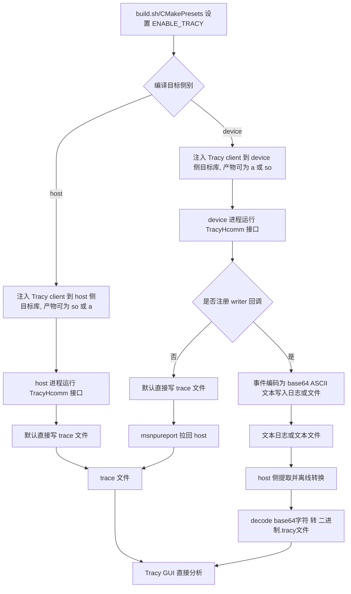

# HCOMM Tracy 打点集成设计说明

> 文档定位：本文档按照 SRS / SD / SC 三个部分组织，用于沉淀 HCOMM 中 Tracy 打点能力的可评审方案，并作为后续打点功能开发的主指导文档。
>
> 当前结论（最终待开发方案）：采用“Tracy client 源码直接编译进目标库（host/device 均注入，按侧别选择不同 so 或 .a）+ Tracy/TracyLite 用户接口 + 主路径直写 trace 文件 + 兼容文本旁路”的集成路径。
>
> 范围说明：本方案覆盖构建开关、源码集成边界、头文件暴露、打点接入规范与 UT/ST 验证。性能调优和具体业务函数打点清单由后续版本增量细化。当前仓内存在演进中的旧实现/截断实现，本文会显式区分“目标态方案”和“当前态代码差距”。

---

## SRS

### 1. 介绍背景

HCOMM 需要在不引入网络面风险、不改变现有 DFX 上报链路的前提下，提供可落地的低开销时序打点能力，用于定位通信路径中的热点与抖动。

结合现有 DFX 文档和流程约束：

1. Task Exception 链路与 Profiling 链路都依赖已有日志/上报体系，新增能力应复用现有通道，而不是引入新运行时服务。
2. HCOMM 同时包含 host/device 构建路径，打点集成必须明确两侧差异，避免把 host 依赖错误注入 device 产物。
3. 打点能力不仅是“加宏”，还必须同步覆盖 build 开关、符号边界、导出头文件、脚本转换与验证闭环。

本方案收敛为主路径是直写 trace 文件，文本旁路是受环境约束时的兼容导出路径

- 构建侧：通过 build.sh 与 CMakePresets.json 控制 ENABLE_TRACY。
- 代码侧：最终以 `/root/git/tracy` 中的 Tracy/TracyLite 用户接口为准，不额外发散出长期并存的自定义打点 API。
- 运行侧：
  - host 侧与 device 侧均直接写入指定文件。
  - device 侧可通过 `msnpureport` 将文件拉回 host 侧。
  - 默认路径为直接写 trace 文件。
  - 当 device 侧受日志库或导出方式限制时，可选通过 writer 回调把数据转换为 base64 ASCII 文本落入文件或日志，再由 host 侧提取。
  - 若启用日志链路，写入载荷应是可落入日志系统的 ASCII 文本，不直接写二进制数据。
- 可视化：直接使用生成trace文件在 Tracy GUI 查看。

#### 1.1 当前代码状态 / 与目标态差距

当前分支中的部分代码属于演进截断，不应当被视为最终接口真源。

1. [../src/pub_inc/hcomm_profiler.h](../src/pub_inc/hcomm_profiler.h) 当前提供了 `HCOMM_PROFILER_INIT` / `HCOMM_ZONE_*` 宏，用于早期验证链路和占位接线；该实现预计后续删除或退出主路径。
2. 最终推荐的对外接入方式应收敛到 `/root/git/tracy` 对应接口，避免长期维护两套打点 API。
3. 当前代码里若仍存在 `hcomm_profiler.h:127`、`hcomm_profiler.h:128` 一类旧宏接线，应视为迁移期兼容代码，而不是后续新增打点的推荐入口。
4. 因此，本文中的“目标态接口、流程、测试”优先服务最终方案；当前分支代码若与之不一致，应作为后续收敛项处理。

### 2. 输入

| 输入项 | 来源 | 说明 |
| --- | --- | --- |
| Tracy 上游源码 | tools/tracy_src/ | Tracy client 与 import-tracy 所需源码 |
| 构建开关 | build.sh / CMakePresets.json | ENABLE_TRACY、TRACY_SAVE_NO_SEND、TRACYLITE_PERFETTO 等控制项 |
| 打点宏调用 | 业务模块顶层函数/关键代码块 | `ChromeZoneScoped` / `ZoneNamedLite*` / `FrameMark` 等目标态接口 |
| writer 注册配置（可选） | runtime 初始化 | device 侧是否注册 writer 回调到 Tracy |
| 默认路径输入 | trace 文件 | 默认路径产物，直接用于 Tracy GUI 分析 |
| 文本旁路输入 | 文本日志或文本文件 | 注册 writer 后输出 base64 ASCII 文本，供 host 侧提取与解码 |
| 默认路径工具链 | Tracy GUI | 直接加载 trace 文件，无需依赖转换脚本 |
| 文本旁路工具链 | scripts/hcomm_trace_to_tracy.py / 提取解码脚本 | 输入 base64 ASCII 文本，输出可被 Tracy GUI 加载的结果文件 |

### 3. 处理

处理流程如下：

1. 编译阶段按 preset 或 build.sh 参数决定是否启用 Tracy client 编译。
2. host 侧与 device 侧目标库均注入最小 Tracy Client 代码；两侧注入载体可不同（例如 host 侧为 so，device 侧为 .a 或 device 侧专用 so）。
3. 代码运行时通过目标态 Tracy 接口记录 Begin/End/Instant 等事件，默认直接写 trace 文件。
4. device 侧如注册 writer 回调，则事件可改为写入 HCCL 日志链路或其他可导出的文本文件。
5. 离线分析时：
   - 直接写文件路径：可直接在 Tracy GUI 查看或走既有转换工具链。
   - 文本日志路径：Host 侧对 base64 ASCII 文本进行提取与离线转换。

### 4. 输出

| 输出项 | 说明 |
| --- | --- |
| 可控构建产物 | 启用/关闭 Tracy 的目标库产物（so/.a） |
| 打点统一接口 | 最终暴露 TracyHcomm 风格头 |
| 默认路径输出 | trace 文件（可直接被 Tracy GUI 加载） |
| 文本旁路中间产物 | base64 ASCII 文本日志或文本文件 |
| 文本旁路离线结果 | `.tracy` 或等价可视化结果文件 |
| 验证结果 | UT/ST 的编译与基础调用验证结果 |

---

## SD

### 1. 功能描述

在 HCOMM 内集成 Tracy 打点能力，满足以下目标：

1. 在不改变现有主链路行为的情况下，支持函数级和代码块级时序观测。
2. 通过编译开关做到“可启可停”，关闭时不引入额外运行时路径。
3. 与现有日志导出链路兼容，支持离线转换和可视化分析。

#### 1.1 默认实现路径与旁路

1. 默认实现路径是直写 trace 文件，这是主路径。
2. 日志链路/文件回传链路是受环境约束时的旁路，不应在正文中与主路径并列成两个等权方案。
3. device 侧通过 `msnpureport` 等方式把文件拉回 host，属于导出手段，不改变默认产物仍然是 trace 文件这一点。
4. 若因为日志库或设备侧限制必须走文本旁路，应要求 writer 输出 base64 ASCII 文本，而不是直接把二进制写入日志系统。

### 2. 流程描述

### 3. 数据描述

#### 3.1 原始数据结构

| 数据 | 形态 | 说明 |
| --- | --- | --- |
| trace 缓冲数据 | 二进制（Tracy `QueuePacketLite` 等内部结构） | 默认路径直接落盘为 trace 文件，由 Tracy GUI 加载 |
| 文本旁路数据 | ASCII 文本 | 注册 writer 后输出的 base64 编码文本，便于日志系统或文本文件承载 |
| 构建配置 | CMake 变量 | ENABLE_TRACY / TRACY_SAVE_NO_SEND / TRACYLITE_PERFETTO |

#### 3.2 标准化数据结构

| 数据 | 形态 | 说明 |
| --- | --- | --- |
| Tracy 结果文件 | `.tracy` | Tracy GUI 直接加载 |
| 可导出文本 | 文本 | 供 host 侧提取、解码和离线转换 |

#### 3.3 关键字段

数据字段整体以 Tracy/TracyLite 文档为准，主字段包括文件、函数、行号、线程、时间戳及事件类型。

### 4. 依赖性描述

| 依赖项 | 作用 |
| --- | --- |
| cmake/third_party/tracy.cmake | 管理 Tracy client 源码注入与工具集成 |
| tools/tracy_src/public/tracy/TracyHcomm.hpp | 目标态用户接口封装 |
| scripts/hcomm_trace_to_tracy.py | 仓内已有日志转换脚本，仅用于文本旁路的提取/解码/转换；默认直写 trace 文件路径不依赖该脚本 |
| Tracy Client | 上游 Tracy/TracyLite 代码真源 |
| src/pub_inc/hcomm_profiler.h | 当前分支中的演进截断实现，仅作迁移期参考 |

### 5. 接口描述

#### 5.1 对外接口（目标态推荐接口）

| 接口 | 类型 | 说明 |
| --- | --- | --- |
| `ChromeZoneScoped` | 宏 | 默认 RAII 作用域打点（区域名 = 函数名） |
| `ZoneNamedLite(varname, active)` / `ZoneNamedLiteN(varname, name, active)` | 宏 | 命名/受控的作用域打点 |
| `FrameMark` / `FrameMarkNamed(name)` | 宏 | 瞬时帧/事件打点 |
| `TracyPlot(name, val)` | 宏 | 数值类时序打点 |
| `ChromeSetThreadName(name)` | 宏 | 线程命名（影响 Tracy GUI 线程轴） |

#### 5.2 当前仓内兼容接口（迁移期，不建议继续扩散）

| 接口 | 类型 | 说明 |
| --- | --- | --- |
| `HCOMM_PROFILER_INIT` | 宏 | 当前仓内旧方案初始化宏，预计后续删除 |
| `HCOMM_ZONE_SCOPED` / `HCOMM_ZONE_SCOPED_N` | 宏 | 当前仓内旧方案 scoped 打点宏，预计迁移到 TracyHcomm 接口 |
| `HCOMM_ZONE_BEGIN/END/INSTANT` | 宏 | 当前仓内旧方案事件宏，属于演进截断实现 |

#### 5.3 内部接口建议

| 接口 | 类型 | 说明 |
| --- | --- | --- |
| `ENABLE_TRACY` | CMake 选项 | 控制是否注入 Tracy client 源码 |
| `TRACY_SAVE_NO_SEND` | 编译宏 | 启用离线导出与直写文件能力 |
| `TRACYLITE_PERFETTO` | 编译宏 | 控制 Perfetto 导出相关实现是否编译 |
| `build.sh --tracy/--no-tracy` | CLI 选项 | 命令行层启停控制 |
| `ChromeSetOutputCallback(cb)` | 宏（来自 TracyHcomm.hpp） | device 侧可选注册输出回调；注册后事件以 base64 ASCII 文本写入日志或文本文件 |
| `ChromeFlushToCallback()` | 宏（来自 TracyHcomm.hpp） | 主动触发把当前缓冲事件按已注册回调输出 |
| `TRACYLITE_SET_PRE_EXPORT(cb)` / `TRACYLITE_SET_POST_EXPORT(cb)` | 宏（来自 TracyLiteAll.hpp） | 默认写文件路径下，导出前/后钩子，可用于挂接 DFX 旁路 |

### 6. 使用限制

1. Tracy client 在 host 侧与 device 侧目标均可启用；两侧目标库类型与链接边界可不同，必须由各自 preset 明确约束。
2. 手工 Begin/End 必须严格配对，否则离线时序会失真。
3. device 侧日志链路为可选能力，仅在注册 writer 回调后生效；未注册时应维持默认写 trace 文件语义。
4. 在高频热路径应优先使用函数级 scoped 打点，避免过细粒度导致日志膨胀。
5. 当前仓内 `src/pub_inc/hcomm_profiler.h` 为迁移期接口，不作为后续新增打点的推荐入口。
6. 关闭开关构建时，不应残留 Tracy 依赖链接需求。

### 7. Log 等 DFX 设计

1. 默认模式为直写 trace 文件，这是主载体。
2. 仅在调用 `ChromeSetOutputCallback` 注册回调后才启用日志/文本旁路。
3. 旁路载荷必须为 base64 ASCII 文本，不能把二进制 packet 直接落入日志库。
4. 文本旁路的前缀、分段、落盘格式后续应单独固化，但不应破坏“host 侧可提取、可解码、可转换”的闭环。
5. 异常场景表现：
   - 注册回调缺失时，旁路不产生日志文本，默认 trace 文件路径仍正常工作。
   - base64 解码失败或 packet 长度异常时，离线工具应输出告警并跳过异常片段，不影响其他数据处理。

### 8. 资料描述

| 资料 | 说明 |
| --- | --- |
| docs/dev_guide/tracy-file-manifest.md | Tracy 文件清单、构建组合与同步规程 |
| docs/dev_guide/tracy-staged-files-audit.md | staged 审计文档，可提炼稳定结论但不直接作为方案真源 |
| docs/build.md | 仓库构建方式与 preset 约束 |

### 9. 性能质量描述

- 时间复杂度：打点记录为 O(1) 写入 Tracy 采集缓冲或导出缓冲；离线转换为 O(N)（N 为缓冲事件数或文本条目数）。
- 调用次数特征：函数级打点随函数调用次数线性增长；代码块级打点应仅覆盖诊断关键路径。
- 热路径属性：通信任务下发与关键同步路径属于热路径，应控制打点密度；初始化与一次性校准路径属于非热路径，可放置辅助打点。

---

## SC

### 1. 当前闭环测试（迁移期）

| 用例类型 | 测试项 | 重要级别 | 测试内容 | 预期 |
| --- | --- | --- | --- | --- |
| UT | 构建开关生效 | 高 | 分别在启用/关闭 `ENABLE_TRACY` 下编译 host/device 目标 | 开关行为符合 preset 预期，不出现多余依赖或缺失依赖 |
| UT | `TracyLitePerfetto.cpp` 独立 TU | 高 | 校验 `cmake/third_party/tracy.cmake` 是否把 `TracyLitePerfetto.cpp` 作为独立编译单元加入 | Perfetto 相关符号可正常解析 |
| UT | 旧接口兼容性 | 中 | 对当前 `HCOMM_ZONE_*` 宏所在代码做最小编译验证 | 迁移期代码可继续编译，但不再新增依赖面 |
| 回归 | 构建脚本参数回归 | 中 | 校验 `build.sh --tracy/--no-tracy` 与 presets 的一致性 | 参数行为与 preset 语义一致，无冲突配置 |

### 2. 目标态扩展测试

| 用例类型 | 测试项 | 重要级别 | 测试内容 | 预期 |
| --- | --- | --- | --- | --- |
| UT | 推荐接口编译生效 | 高 | 在启用 Tracy 的条件下编译使用 `ChromeZoneScoped` / `ZoneNamedLite*` 的代码 | 目标态接口可直接用于新增打点 |
| UT | 默认路径 trace 文件可用 | 高 | 默认路径运行最小打点用例，落盘 trace 文件 | Tracy GUI 可直接打开该 trace 文件，包含至少一个 zone 事件 |
| UT | device 文本旁路输出 | 高 | device 侧分别验证“未注册 `ChromeSetOutputCallback`”与“已注册”两种路径 | 未注册时默认直写 trace 文件；注册后输出 base64 ASCII 文本 |
| UT | 文本旁路解析正确性 | 高 | 以包含 base64 文本片段的样例数据执行离线转换 | 输出可被 Tracy GUI 加载，文本解码与事件恢复正确 |
| UT | 异常输入处理 | 中 | 构造 base64 损坏或长度异常的文本输入 | 工具对异常片段输出告警并跳过，不影响其他数据 |
| ST | 端到端打点闭环 | 高 | 运行一次带打点的典型通信流程，分别覆盖默认 trace 路径与文本旁路 | 两条路径均可生成可在 Tracy GUI 加载的结果 |
| ST | 关闭开关回归 | 高 | 在同一业务路径关闭 Tracy 后运行 | 功能行为与历史一致，无新增链接错误和运行时告警 |
| 功能 | 顶层函数打点策略 | 中 | 对指定顶层函数加入 `ChromeZoneScoped`，逐层扩展到必要子函数 | 能按预期定位耗时热点，且无明显日志噪音失控 |

---

## 附录 A：当前集成清单（持续更新）

### A.1 需编译进入目标库的 Tracy 代码

1. TracyClient.cpp（默认）
2. public 头文件目录（按编译依赖最小集）

### A.2 建议注入 Tracy 的目标库边界

1. 仅注入最底层且被上层复用的核心目标库（例如 ccl_kernel_plf 及其等价目标）
2. 避免在多个平级目标库重复注入，降低静态对象与全局符号冲突风险

### A.3 对外暴露并随 run 包安装的头文件

1. 最终暴露 TracyHcomm 风格头

### A.4 打点接入建议

1. 优先从顶层函数进入，先函数级，再按瓶颈向下分层细化。
2. 简单且无优化价值的短函数默认不加，减少噪声。
3. 若出现更低成本且更稳定的打点边界，应优先采用替代边界并记录原因。

### A.5 从 Tracy 文件清单吸收的稳定结论

1. `TracyClient.cpp` 是基础 unity build 入口。
2. `TRACY_SAVE_NO_SEND=ON` 时，`TracyLiteAll.cpp` 由 `TracyClient.cpp` 通过 `#include` 方式纳入，不作为独立编译单元。
3. `TRACYLITE_PERFETTO=ON` 时，`TracyLitePerfetto.cpp` 与 `perfetto.cc` 需要作为独立编译单元追加到构建中。
4. `TracyHcomm.hpp` 是目标态用户接口封装头，后续新增打点应优先围绕该头文件提供的宏收敛。

### A.6 从 staged 审计吸收的稳定结论

1. `TracyLitePerfetto.cpp` 不应被误删，也不应被当成仅靠 `#include` 即可满足链接需求的文件；它需要独立 TU 参与构建。
2. Windows/macOS 专用实现、AMD Rocprof、Fortran 绑定、图形 API 适配头、UI 颜色/版本辅助头等不属于 HCOMM 当前打点主路径的必需内容。
3. `perfetto_protozero.cc` 当前不需要单独编译，是否保留源码可由第三方同步策略决定，但不应默认纳入主构建路径。
4. staged 审计中的“数量统计、删除命令、一次性清单”属于历史过程信息，不纳入主方案正文，仅保留稳定结论。
