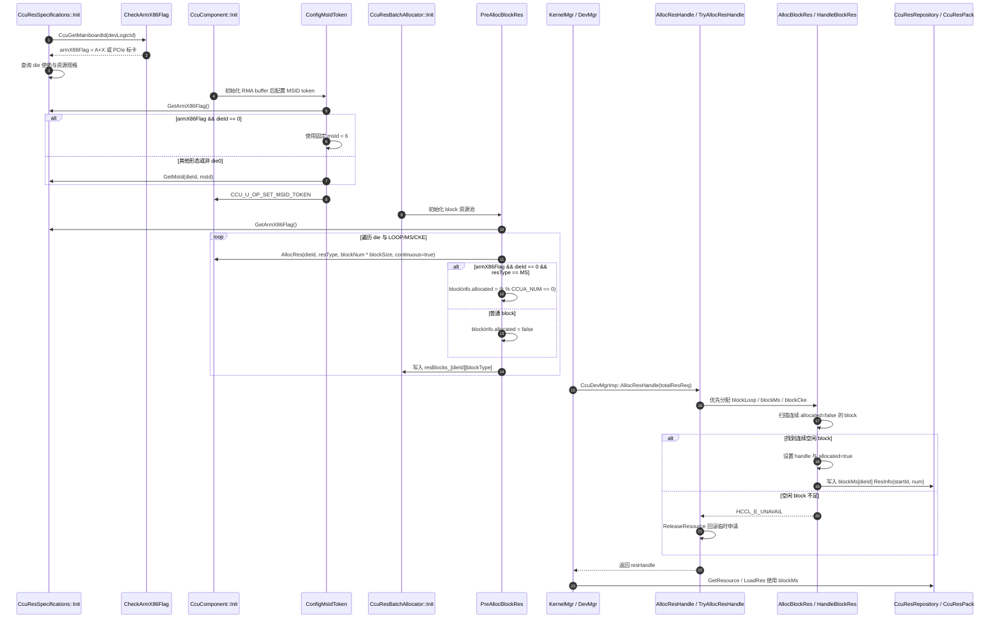
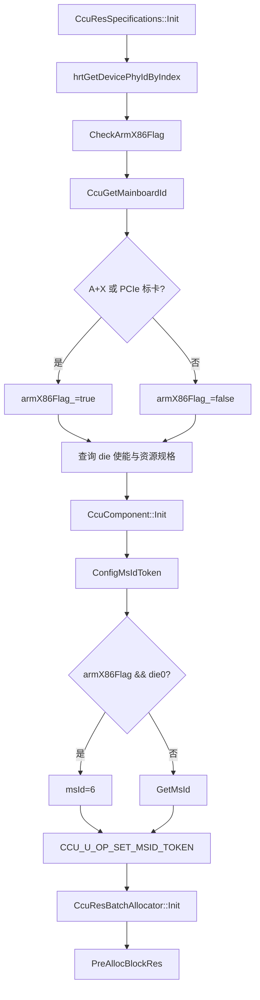
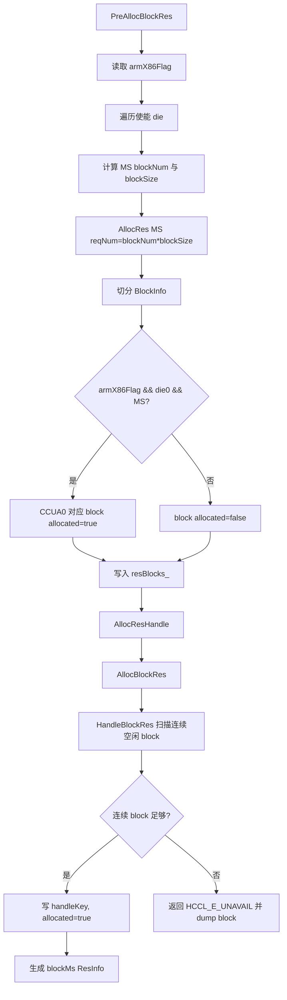

# MS 申请与分配流程说明

> **文档定位**：本文档按照 **SRS / SD / SC** 三个部分组织，用于梳理非纯 aarch64 / A+X / PCIe 标卡形态下 MS 资源申请、预分配与按 handle 分配流程。
>
> **当前结论**：现有 next 路径通过 `CheckArmX86Flag()` 将 `MAINBOARD_A_X_SERVER` 与 `MAINBOARD_PCIE_STD` 识别为 `armX86Flag_ = true`。该标志影响两处 MS 相关行为：
>
> 1. `CcuComponent::ConfigMsIdToken()` 在 A+X / PCIe 标卡形态的 die0 上使用固定 `msId = 6` 配置 MSID token；
> 2. `CcuResBatchAllocator::PreAllocBlockRes()` 在 A+X / PCIe 标卡形态的 die0 预分配 MS block 时，将 `k % CCUA_NUM == 0` 的 block 标记为 `blockInfo.allocated = true`，从而跳过连接 PCIe 的 CCUA0。
>
> **范围说明**：本文档聚焦 `src/framework/next/comms/ccu` 路径下的 MS 资源申请与 block 分配逻辑。legacy 路径存在相同思路的历史实现，但本文仅作为背景参照，不作为待开发主路径。

---

## SRS

### 1. 介绍背景

CCU 算子在注册、翻译或设备管理入口中会声明所需资源，MS 资源既可以按离散数量申请，也可以按 block 方式申请。block 方式由 `CcuResBatchAllocator` 在初始化阶段先从底层 `CcuComponent` 一次性预留连续资源，再在后续 handle 申请时从预留 block 池中切分。

非纯 aarch64 / A+X / PCIe 标卡形态下，die0 上连接 PCIe 的 CCUA0 不可作为普通 MS 分配目标。当前代码使用 `armX86Flag_` 表示该形态，并在 MS 相关链路中做两个适配：

1. die0 的 MSID token 配置使用固定交织粒度 `MSID_CONFIG_ARMX86_MAINBOARD = 6`；
2. die0 的 MS block 预分配阶段预先占用 CCUA0 对应 block，避免后续 `AllocBlockRes()` 分配给算法或内核。

#### 1.1 当前总体时序图（从设备初始化到 MS 分配）



#### 1.2 相关代码范围

| 类型 | 文件 | 作用 |
| --- | --- | --- |
| 主板形态判型 | `src/framework/next/comms/ccu/ccu_device/ccu_res_specs.cc` | `CcuGetMainboardId()`、`CheckArmX86Flag()`、`GetArmX86Flag()` |
| MSID token 配置 | `src/framework/next/comms/ccu/ccu_device/ccu_comp/ccu_comp.cc` | `ConfigMsIdToken()` 根据 `armX86Flag_` 决定 die0 `msId` 来源 |
| block 预分配与分配 | `src/framework/next/comms/ccu/ccu_device/ccu_res_batch_allocator.cc` | `PreAllocBlockRes()`、`AllocBlockRes()`、`HandleBlockRes()`、`ReleaseBlockResource()` |
| block 状态结构 | `src/framework/next/comms/ccu/ccu_device/ccu_res_batch_allocator.h` | `BlockInfo` 与 `resBlocks_` |
| 设备管理入口 | `src/framework/next/comms/ccu/ccu_device/ccu_dev_mgr_imp.cc` | `CcuAllocEngineResHandle()` 构造 MS/Sched 默认资源请求 |
| kernel 资源请求 | `src/framework/next/comms/ccu/ccu_kernel/ccu_kernel.cc` | `CcuKernel::GetResourceRequest()` 统计 `msReq` / `blockMsReq` |
| kernel 资源汇总 | `src/framework/next/comms/ccu/ccu_kernel/ccu_kernel_mgr.cc` | 汇总 total request、申请 handle、把 `blockMs` 映射回 kernel |

### 2. 输入

| 输入项 | 来源 | 说明 |
| --- | --- | --- |
| `deviceLogicId` | 初始化 / 设备管理 / kernel manager | 查询主板形态、设备物理 ID、资源规格和分配实例 |
| `MAINBOARD_ID` | `aclrtGetDeviceInfo(ACL_DEV_ATTR_MAINBOARD_ID)` | bit[7:5] 用于区分 POD、A+K、A+X、PCIe 标卡等形态 |
| die 使能信息 | `CCU_U_OP_GET_DIE_WORKING` | 决定哪些 die 参与预分配与后续申请 |
| CCU 基础资源规格 | `CCU_U_OP_GET_BASIC_INFO` | 提供 `msNum`、`loopEngineNum`、`ckeNum`、`msId` 等 |
| `CcuResReq::msReq[]` | kernel / dev mgr | 离散 MS 资源请求 |
| `CcuResReq::blockMsReq[]` | kernel / dev mgr | block MS 资源请求，本文重点关注 |
| `CcuBlockResStrategy::msNum` | `CcuResSpecifications` / batch allocator | 单个 MS block 的资源粒度 |
| `resBlocks_[dieId][blockType]` | `PreAllocBlockRes()` 生成 | 后续 `AllocBlockRes()` 的 block 池 |

### 3. 处理

#### 3.1 `CheckArmX86Flag` 判型处理

1. `CcuResSpecifications::Init()` 先通过 `hrtGetDevicePhyIdByIndex()` 查询物理设备 ID；
2. 调用 `CheckArmX86Flag(devLogicId_, armX86Flag_)`；
3. `CheckArmX86Flag()` 内部调用 `CcuGetMainboardId()`；
4. `CcuGetMainboardId()` 读取 `ACL_DEV_ATTR_MAINBOARD_ID`，取 bit[7:5] 映射为 `HcclMainboardId`；
5. 当主板形态为 `MAINBOARD_A_X_SERVER` 或 `MAINBOARD_PCIE_STD` 时，`armX86Flag_` 置为 true；
6. 后续 `ConfigMsIdToken()` 与 `PreAllocBlockRes()` 只通过 `GetArmX86Flag()` 读取该结果，不重复解析 mainboard ID。

#### 3.2 MSID token 配置处理

1. `CcuComponent::Init()` 在创建 RMA buffer、资源管理器和 loop channel 后调用 `ConfigMsIdToken()`；
2. `ConfigMsIdToken()` 读取 `armX86Flag`；
3. 若 `armX86Flag == true && dieId == 0`，使用固定 `MSID_CONFIG_ARMX86_MAINBOARD = 6`；
4. 其他形态或非 die0 时，通过 `CcuResSpecifications::GetMsId(dieId, msId)` 读取底层资源规格中的 `msId`；
5. 最终通过 `CCU_U_OP_SET_MSID_TOKEN` 将 `msId`、RMA buffer tokenId、tokenValue 配置给 CCU 驱动。

#### 3.3 `PreAllocBlockRes` 预分配处理

1. `CcuResBatchAllocator::Init()` 获取 `CcuComponent::GetDieEnableFlags()`；
2. die 均不可用时返回 `HCCL_E_UNAVAIL`；
3. 调用 `PreAllocBlockRes()` 预分配 LOOP / MS / CKE 三类 block 资源；
4. 对每个使能 die，`GetPreAllocatedMaxBlockNum()` 根据资源总数和策略粒度计算 block 数：
   - `loopNum / resStrategys_[dieId].loopNum`；
   - `msNum / resStrategys_[dieId].msNum`；
   - `cke` block 数取 `max(loopBlockNum, msBlockNum)` 与 `ckeNum / ckeBlockSize` 的较小值；
5. 对每类 block，按 `reqNum = blockNum * blockSize` 调用 `CcuComponent::AllocRes(..., continuous=true, ...)` 预留连续资源；
6. 以底层返回的 `startId` 为起点切分 `BlockInfo`：
   - `id = k`；
   - `startId = startId + k * blockSize`；
   - `num = blockSize`；
   - `handle = 0`；
   - `allocated` 按形态和资源类型决定；
7. 当 `armX86Flag && dieId == 0 && resType == ResType::MS` 时，`k % CCUA_NUM == 0` 的 MS block 初始化为 `allocated = true`；
8. 其他 block 初始化为 `allocated = false`；
9. 切分后的 block 列表写入 `resBlocks_[dieId]`，其中 block type 顺序为 LOOP、MS、CKE。

#### 3.4 `blockInfo.allocated` 状态语义

| 场景 | 状态变化 | 语义 |
| --- | --- | --- |
| 普通预分配 block | `false` | 可被后续 handle 申请使用 |
| A+X / PCIe die0 MS 的 CCUA0 block | `true` | 逻辑预占用，避免分配给算法 |
| `HandleBlockRes()` 成功分配 | `false -> true` | block 被当前 `handleKey` 占用 |
| `ReleaseBlockRes()` 释放 | `true -> false` | handle 释放后 block 回到可分配池 |
| 预占用 CCUA0 block | 保持 `true` | 无 handle 绑定，作为屏蔽位参与空闲扫描 |

需要注意：`HandleBlockRes()` 只扫描连续 `allocated == false` 的 block。预占用的 CCUA0 block 会切断连续区间，保证跨过该 block 的大段请求不会被误认为连续可用。

#### 3.5 `AllocBlockRes` 具体分配处理

1. 外部调用 `CcuDevMgrImp::AllocResHandle()` 或设备管理 public API 后进入 `CcuResBatchAllocator::AllocResHandle()`；
2. `AllocResHandle()` 先调用 `CheckReqValid()`，确保至少一个使能 die 有请求，且未使能 die 没有请求；
3. 创建临时 `CcuResRepository`，以其裸指针地址作为 `handleKey`；
4. 进入 `TryAllocResHandle()`，加锁后按固定顺序分配：
   - `AllocBlockRes()`：block LOOP / MS / CKE；
   - `missionMgr_.Alloc()`：mission block；
   - `AllocConsecutiveRes()`：连续 XN；
   - `AllocDiscreteRes()`：离散 LOOP / MS / CKE / XN / GSA；
5. `AllocBlockRes()` 对每个使能 die 构造三类请求：
   - `blockLoopEngineReq[dieId] -> blockLoopEngine[dieId]`；
   - `blockMsReq[dieId] -> blockMs[dieId]`；
   - `blockCkeReq[dieId] -> blockCke[dieId]`；
6. 对 `num != 0` 的请求调用 `HandleBlockRes(handleKey, num, blockSize, blocks, resInfos)`；
7. `HandleBlockRes()` 计算 `blockNum = ceil(num / blockSize)`，扫描连续空闲 block；
8. 找到足够连续 block 后，将这些 block 的 `handle` 写为 `handleKey`，并将 `allocated` 置为 true；
9. 输出一段 `ResInfo{startId, blockNum * blockSize}` 到 `CcuResRepository::blockMs[dieId]` 等目标数组；
10. 如果找不到连续空闲 block，返回 `HCCL_E_UNAVAIL`，上层打印 dump 并触发临时资源回滚。

#### 3.6 MS 请求来源

| 来源 | 请求字段 | 说明 |
| --- | --- | --- |
| `CcuKernel::GetResourceRequest()` | `msReq[dieId]`、`blockMsReq[dieId]` | 由 kernel 内部 `ccubufs` / `blockCcubufs` 数量统计得到 |
| `CcuKernelMgr::InstantiationTranslator()` | 合并 reference manager 与 translator 的资源请求 | 为 translator 预先申请物理资源 |
| `CcuAllocEngineResHandle(CCU_MS)` | `blockMsReq[dieId] = 64 * 8 * 2`，`msReq[dieId] = 0` | CCU_MS 设备管理入口默认走 block MS |
| `CcuAllocEngineResHandle(CCU_SCHED)` | `blockMsReq[dieId] = 128`，`msReq[dieId] = 0` | 调度引擎默认也会申请少量 block MS |

### 4. 输出

| 输出项 | 说明 |
| --- | --- |
| `armX86Flag_` | 主板形态判型结果，供 MSID token 和 MS block 预占用逻辑使用 |
| `resBlocks_` | batch allocator 内部 block 池，保存每个 block 的 `startId`、`num`、`handle`、`allocated` |
| `CcuResHandle` | 成功申请后返回给调用方的资源句柄 |
| `CcuResRepository::blockMs[]` | 当前 handle 申请到的 block MS 资源范围 |
| 日志 | 判型、预分配、分配失败、dump block 状态、释放失败等日志 |

---

## SD

### 1. 功能描述

MS 申请与分配功能负责把 kernel 或设备管理入口提出的 MS 资源需求，转换为 CCU 物理资源上的 `ResInfo` 范围，并通过 `CcuResHandle` 绑定生命周期。

当前设计中，block MS 是主要路径：初始化阶段先预留连续底层 MS 资源并切成 block；运行期申请 handle 时只在 block 池中做连续 block 查找和状态标记。非纯 aarch64 / A+X / PCIe 标卡形态通过 `armX86Flag_` 影响 die0 MSID token 和 die0 MS block 可用性。

#### 1.1 子功能拆分

| 子功能 | 说明 |
| --- | --- |
| 主板形态识别 | `CheckArmX86Flag()` 根据 mainboard ID 识别 A+X / PCIe 标卡 |
| 资源规格初始化 | `CcuResSpecifications::Init()` 查询 die 使能和基础资源规格 |
| MSID token 配置 | `ConfigMsIdToken()` 配置 MSID 与 RMA token |
| block 资源预分配 | `PreAllocBlockRes()` 预留 LOOP / MS / CKE 并生成 block 池 |
| block 状态屏蔽 | A+X / PCIe die0 MS 的 CCUA0 block 预置 `allocated=true` |
| handle 资源申请 | `AllocResHandle()` / `TryAllocResHandle()` 按顺序申请各类资源 |
| block MS 分配 | `AllocBlockRes()` / `HandleBlockRes()` 从 block 池分配连续 block |
| 资源释放 | `ReleaseBlockResource()` / `ReleaseNonBlockTypeRes()` 回收 handle 绑定资源 |

### 2. 流程描述

#### 2.1 初始化流程



#### 2.2 block MS 预分配与分配流程



#### 2.3 释放流程

1. `CcuReleaseResHandle()` 进入 `CcuDevMgrImp::ReleaseResHandle()`；
2. `CcuResBatchAllocator::ReleaseResHandle()` 根据 handle 查找 `CcuResRepository`；
3. `ReleaseResource()` 先调用 `ReleaseBlockResource()`；
4. `ReleaseBlockResource()` 对 `blockLoopEngine` / `blockMs` / `blockCke` 调用 `ReleaseBlockRes()`；
5. `ReleaseBlockRes()` 根据 `ResInfo.startId` 和 blockSize 定位 block 区间，将 `handle` 清 0、`allocated` 置 false；
6. mission 与非 block 资源随后释放；
7. handle 从 `handleMap_` 删除。

预占用的 CCUA0 block 不会出现在任何 handle 的 `blockMs` ResInfo 中，因此不会被正常释放流程误清空。

### 3. 数据描述

#### 3.1 原始与内部数据结构

| 数据结构 | 关键字段 | 说明 |
| --- | --- | --- |
| `HcclMainboardId` | `MAINBOARD_A_X_SERVER`、`MAINBOARD_PCIE_STD` | 当前判定非纯 aarch64 / x86 host 相关形态的枚举 |
| `CcuResSpecInfo` | `msNum`、`msId`、`resourceAddr` | 从 CCU 基础信息解析出的资源规格 |
| `CcuBlockResStrategy` | `loopNum`、`msNum`、`ckeNum`、`missionNum` | 单个 block 的资源粒度 |
| `BlockInfo` | `id`、`startId`、`num`、`handle`、`allocated` | batch allocator 的 block 管理单元 |
| `CcuResReq` | `msReq[]`、`blockMsReq[]` | 调用方提交的 MS 需求 |
| `CcuResRepository` | `ms[]`、`blockMs[]` | handle 实际持有的 MS 资源范围 |

#### 3.2 `BlockInfo` 字段语义

```cpp
struct BlockInfo {
    uint32_t id;
    uint32_t startId;
    uint32_t num;
    uintptr_t handle;
    bool allocated;
};
```

| 字段 | 语义 |
| --- | --- |
| `id` | 当前资源类型 block 池内的 block 序号 |
| `startId` | 底层资源起始 ID |
| `num` | 当前 block 覆盖的资源数量，即 blockSize |
| `handle` | 占用该 block 的 `CcuResRepository` 指针地址；预占用 block 为 0 |
| `allocated` | 是否不可再分配；可能来自真实 handle 占用，也可能来自 A+X / PCIe die0 MS 预屏蔽 |

#### 3.3 block type 顺序

`resBlocks_[dieId]` 中每个 `dieId` 下按固定顺序插入三类 block：

| 下标 | 资源类型 | 请求字段 | 输出字段 |
| --- | --- | --- | --- |
| 0 | `ResType::LOOP` | `blockLoopEngineReq[dieId]` | `blockLoopEngine[dieId]` |
| 1 | `ResType::MS` | `blockMsReq[dieId]` | `blockMs[dieId]` |
| 2 | `ResType::CKE` | `blockCkeReq[dieId]` | `blockCke[dieId]` |

### 4. 依赖性描述

| 依赖模块 | 依赖内容 | 作用 |
| --- | --- | --- |
| Runtime / ACL | `aclrtGetDeviceInfo`、`hrtGetDevicePhyIdByIndex` | 获取主板形态和物理设备 ID |
| CCU driver custom channel | `CCU_U_OP_GET_BASIC_INFO`、`CCU_U_OP_GET_DIE_WORKING`、`CCU_U_OP_SET_MSID_TOKEN` | 查询资源规格、die 使能并配置 token |
| `CcuResSpecifications` | `GetArmX86Flag()`、`GetMsNum()`、`GetMsId()` | 资源规格与形态判定真源 |
| `CcuComponent` | `AllocRes()`、`ReleaseRes()` | 底层连续 / 离散资源分配与释放 |
| `CcuKernelMgr` / `CcuKernel` | `GetResourceRequest()`、`LoadRes()` | 产生资源请求并消费分配结果 |

### 5. 接口描述

#### 5.1 对外接口（保持不变）

| 接口 | 说明 |
| --- | --- |
| `CcuAllocEngineResHandle()` | 设备管理 public 入口，按 CCU_MS / CCU_SCHED 构造默认请求 |
| `CcuCheckResource()` | 根据 handle 读取 `CcuResRepository` |
| `CcuReleaseResHandle()` | 释放 handle 绑定资源 |
| `CcuDevMgrImp::AllocResHandle()` | next 内部设备管理申请入口 |
| `CcuDevMgrImp::GetResource()` | next 内部读取资源入口 |
| `CcuDevMgrImp::ReleaseResHandle()` | next 内部释放入口 |

#### 5.2 内部接口

| 接口 | 说明 |
| --- | --- |
| `CheckArmX86Flag()` | mainboard ID 到 `armX86Flag_` 的单点映射 |
| `CcuResBatchAllocator::PreAllocBlockRes()` | 初始化阶段预留 block 资源池 |
| `CcuResBatchAllocator::AllocBlockRes()` | handle 申请阶段分配 block LOOP / MS / CKE |
| `HandleBlockRes()` | 连续空闲 block 查找与状态标记 |
| `ReleaseBlockRes()` | 根据 handle 持有的 `ResInfo` 回收 block |
| `CcuComponent::ConfigMsIdToken()` | 根据 `armX86Flag_` 配置 MSID token |

### 6. 使用限制

1. 当前 `armX86Flag_` 只覆盖 `MAINBOARD_A_X_SERVER` 与 `MAINBOARD_PCIE_STD`；新增非纯 aarch64 形态时必须先明确 mainboard ID 映射；
2. die0 MS 的 CCUA0 屏蔽只在 block MS 预分配阶段生效，离散 `msReq` 不经过 `resBlocks_`，不会自动继承该屏蔽语义；
3. `HandleBlockRes()` 要求连续 block，预屏蔽 block 会切断连续区间，较大的 `blockMsReq` 可能因此返回 `HCCL_E_UNAVAIL`；
4. `blockInfo.allocated` 同时表达“被 handle 占用”和“被平台限制预屏蔽”，排查时需要结合 `handle == 0` 区分；
5. `PreAllocBlockRes()` 依赖 `CcuBlockResStrategy` 的非 0 默认粒度（当前 LOOP=8、MS=64、CKE=8、MISSION=2），否则 block 数计算不成立；
6. `CcuAllocEngineResHandle(CCU_MS)` 在 `MAINBOARD_PCIE_STD` 下当前直接返回 `HCCL_E_NOT_SUPPORT`，不会进入后续 MS 分配。

### 7. log 等 DFX 设计

| 日志点 | 关键词 / 语义 |
| --- | --- |
| `CheckArmX86Flag()` | 打印 `hcclMainboardId` 与 `armX86Flag_` |
| `ConfigMsIdToken()` | 打印 dieId 与最终配置的 `msId` |
| `GetPreAllocatedMaxBlockNum()` | 打印 LOOP / MS / CKE 预分配 block 数 |
| `PreAllocBlockRes()` 失败 | 打印 dieId、resType、reqNum |
| `AllocBlockRes()` 失败 | 打印 dieId、resType、request num，并调用 `DumpBlockResInfo()` |
| `DumpBlockResInfo()` | 打印每个 block 的 `id/startId/num/handle/allocated` |
| `ReleaseBlockRes()` 间接日志 | 释放失败由外层 `ReleaseResource()` / `ReleaseNonBlockTypeRes()` 打印 |

排查 A+X / PCIe die0 MS 分配问题时，建议优先看三类日志：

1. `CheckArmX86Flag()` 是否识别到期望主板形态；
2. `ConfigMsIdToken()` die0 是否使用 `msId=6`；
3. `DumpBlockResInfo()` 中 die0 MS block 是否呈现 `k % 4 == 0` 的 block 已预置 `allocated=1`、`handle=0`。

### 8. 资料描述

#### 8.1 代码资料

- `src/framework/next/comms/ccu/ccu_device/ccu_res_specs.cc`
- `src/framework/next/comms/ccu/ccu_device/ccu_comp/ccu_comp.cc`
- `src/framework/next/comms/ccu/ccu_device/ccu_res_batch_allocator.h`
- `src/framework/next/comms/ccu/ccu_device/ccu_res_batch_allocator.cc`
- `src/framework/next/comms/ccu/ccu_device/ccu_dev_mgr_imp.cc`
- `src/framework/next/comms/ccu/ccu_kernel/ccu_kernel.cc`
- `src/framework/next/comms/ccu/ccu_kernel/ccu_kernel_mgr.cc`

#### 8.2 测试资料

- `test/ut/framework/next/comms/ccu/mocks/ccu_device_mock_utils.h`
- CCU 资源申请、kernel register / translator register 相关 UT
- A+X / PCIe 标卡环境下的 ST 或联调用例

### 9. 性能质量描述

| 项 | 要求 |
| --- | --- |
| 初始化开销 | `CheckArmX86Flag()` 与 block 预分配只在初始化阶段执行，非热路径 |
| handle 申请复杂度 | `HandleBlockRes()` 对单类 block 池线性扫描，复杂度 O(blockNum) |
| MSID 配置开销 | 每个存在 RMA buffer 的 die 配置一次 token |
| 内存分配 | block 池使用 `std::vector<BlockInfo>` 保存，大小与预分配 block 数成正比 |
| 正确性 | A+X / PCIe die0 MS 不应分配到 CCUA0 对应 block |
| 回滚完整性 | `TryAllocResHandle()` 后续阶段失败时必须通过 `ReleaseResource()` 回收已申请临时资源 |

---

## SC

| 用例类型 | 测试项 | 重要级别 | 测试内容 | 预期 |
| --- | --- | --- | --- | --- |
| 功能-UT | `CheckArmX86Flag` A+X | 高 | mock mainboard ID 为 `MAINBOARD_A_X_SERVER` | `armX86Flag_ == true` |
| 功能-UT | `CheckArmX86Flag` PCIe 标卡 | 高 | mock mainboard ID 为 `MAINBOARD_PCIE_STD` | `armX86Flag_ == true` |
| 功能-UT | `CheckArmX86Flag` 普通 aarch64 形态 | 高 | mock mainboard ID 为 POD / A+K / EVB | `armX86Flag_ == false` |
| 功能-UT | die0 MSID token 配置 | 高 | `armX86Flag=true` 且 die0 存在 RMA buffer | `CCU_U_OP_SET_MSID_TOKEN` 使用 `msId=6` |
| 功能-UT | 非 die0 MSID token 配置 | 中 | `armX86Flag=true` 且 die1 存在 RMA buffer | `msId` 来自 `GetMsId()` |
| 功能-UT | 普通形态 MSID token 配置 | 中 | `armX86Flag=false` | 所有 die 的 `msId` 均来自 `GetMsId()` |
| 功能-UT | A+X die0 MS block 预屏蔽 | 高 | 初始化 `PreAllocBlockRes()`，资源类型为 MS、die0、`armX86Flag=true` | `k % CCUA_NUM == 0` 的 block 为 `allocated=true`、`handle=0` |
| 功能-UT | 普通 MS block 初始化 | 高 | `armX86Flag=false` 或非 die0 | 所有新建 MS block 初始 `allocated=false` |
| 功能-UT | `AllocBlockRes` 成功分配 block MS | 高 | 构造 `blockMsReq[dieId] > 0` 且连续 block 足够 | 目标 block `allocated=true`、`handle=handleKey`，`blockMs[dieId]` 生成正确 `ResInfo` |
| 功能-UT | `AllocBlockRes` 跳过预屏蔽 block | 高 | A+X die0 MS，申请跨越 CCUA0 对应 block 的资源 | 不会把 `handle` 写入预屏蔽 block；连续资源不足时返回 `HCCL_E_UNAVAIL` |
| 异常-UT | block MS 不足回滚 | 高 | `AllocBlockRes()` 返回 `HCCL_E_UNAVAIL` | `AllocResHandle()` 返回失败并调用 `ReleaseResource()` 清理临时资源 |
| 功能-UT | `ReleaseBlockResource` 回收 block MS | 高 | handle 持有 `blockMs` 后释放 | 对应 block `allocated=false`、`handle=0`，`blockMs` 清空 |
| 兼容-UT | `CcuAllocEngineResHandle(CCU_MS)` PCIe 标卡限制 | 中 | mainboard 为 `MAINBOARD_PCIE_STD` 且申请 `CCU_MS` | 返回 `HCCL_E_NOT_SUPPORT`，不进入后续分配 |
| 功能-UT | kernel 资源请求统计 | 中 | kernel 持有 `ccubufs` 与 `blockCcubufs` | `msReq` / `blockMsReq` 数量与资源模板一致 |
| 功能-UT | translator 资源申请 | 中 | `InstantiationTranslator()` 合并 reference manager 与 translator 请求 | total request 正确进入 `AllocResHandle()` |
| 功能-ST | A+X 环境 CCU_MS 申请链路 | 高 | 真实 A+X 环境申请 CCU_MS / 注册 kernel | die0 MS 不使用 CCUA0，资源申请成功或按不足返回明确错误 |
| 功能-ST | 普通 aarch64 环境回归 | 高 | 普通形态注册含 block MS 的 CCU kernel | 所有 MS block 可正常申请释放 |
| 异常-ST | MS block 资源耗尽 | 中 | 连续申请超过 block 池容量 | 返回 `HCCL_E_UNAVAIL`，日志 dump block 状态可定位 |
| 回归-ST | handle 释放后复用 | 中 | 申请、释放、再次申请同等 block MS | 第二次申请可复用已释放 block，预屏蔽 block 仍保持不可用 |

### SC 补充说明

1. UT 应优先覆盖 `CheckArmX86Flag()`、`ConfigMsIdToken()`、`PreAllocBlockRes()`、`HandleBlockRes()` 四个决策点；
2. A+X / PCIe die0 MS 的核心验收点是 `allocated=true && handle=0` 的预屏蔽 block 不被后续 handle 绑定；
3. ST 需要覆盖真实 mainboard ID、真实 token 配置和真实 block MS 申请链路，避免仅靠 mock 漏掉 runtime / driver 侧差异。
