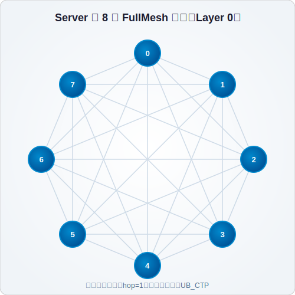
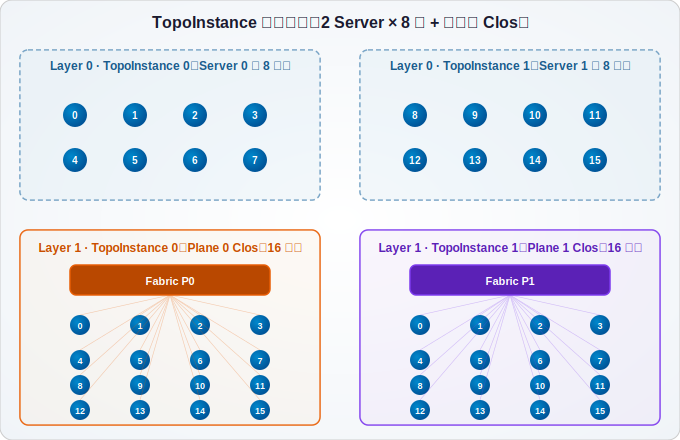
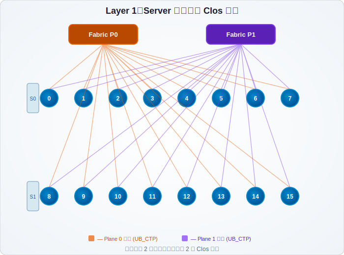
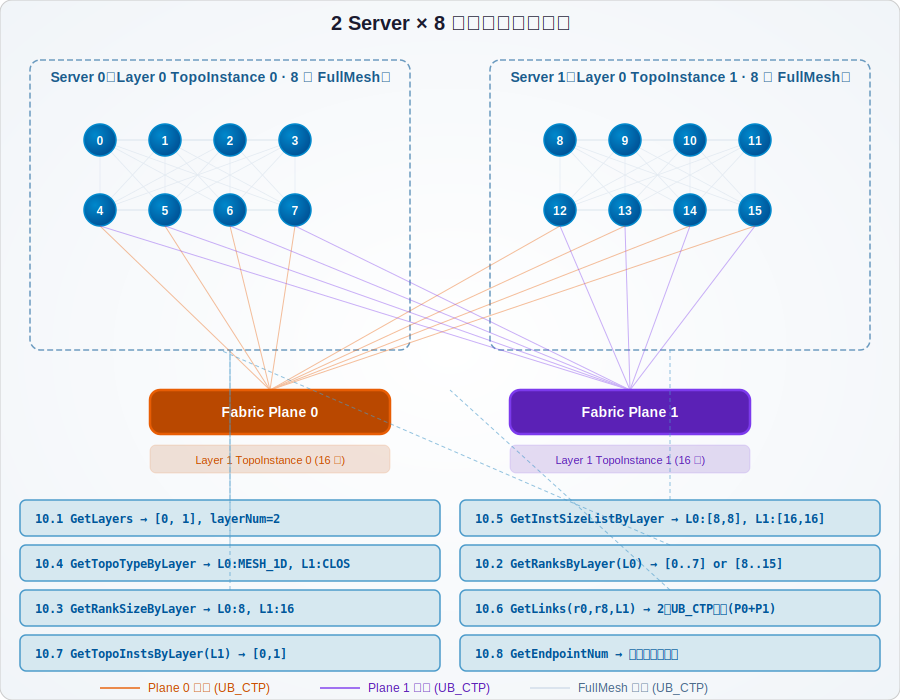
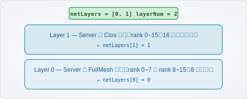
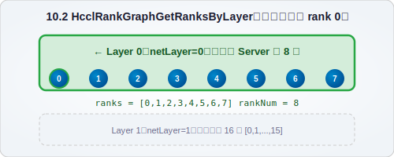
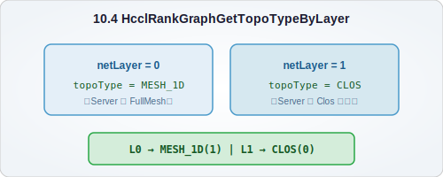
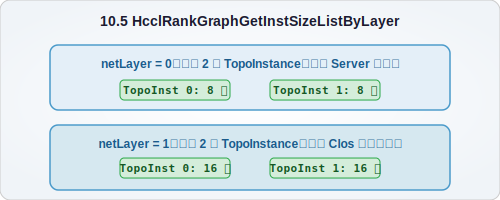
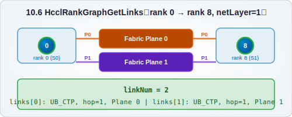

# HCCL 集合通信拓扑模块详解

> 基于 HCCL 开源仓库（https://gitcode.com/cann/hccl）和 HCOMM 代码仓库源码分析编写，适用于希望深入理解 HCCL 拓扑模块、以及开发感知拓扑的通信算子算法的开发者。
>
> 本文档对应的 hcomm 代码路径：`hcomm/src/legacy/framework/topo/new_topo_builder/`

---

## 目录

- [1. 概述](#1-概述)
- [2. 拓扑模型基础概念](#2-拓扑模型基础概念)
- [3. 链路协议与地址类型](#3-链路协议与地址类型)
- [4. 数据模型](#4-数据模型)
- [5. 目录结构与文件功能](#5-目录结构与文件功能)
- [6. 物理拓扑（PhyTopo）](#6-物理拓扑phytopo)
- [7. 拓扑构建流程（TopoBuilder）](#7-拓扑构建流程topobuilder)
- [8. RankGraph 数据结构](#8-rankgraph-数据结构)
- [9. Detour（借道）机制](#9-detour借道机制)
- [10. 拓扑查询 API](#10-拓扑查询-api)
- [11. 拓扑与算子算法的关系](#11-拓扑与算子算法的关系)
- [附录](#附录)

---

## 1. 概述

### 1.1 拓扑模块在 HCCL 中的位置与作用

HCCL（Huawei Collective Communication Library）是昇腾 AI 处理器的高性能集合通信库。在分布式训练中，不同 Server 内的 NPU 通过复杂的网络设施互联，形成多级拓扑结构。

**拓扑模块的核心职责：**

1. **建模**：将实际硬件网络连接关系抽象为图（Graph）数据结构
2. **构建**：从配置文件（rankTable JSON + 拓扑文件）中解析并构建完整的拓扑图
3. **查询**：提供控制面 API，供算子实现者查询拓扑信息
4. **支撑**：为算法选择器（Selector）和算法模板（Template）提供拓扑决策依据

### 1.2 拓扑模块与算子开发的关系

在 HCCL 的算子执行链路中，拓扑信息贯穿始终：

```
rankTable JSON + topoFile
         │
         ▼
   ┌─────────────────┐
   │  TopoBuilder    │  ← 解析配置文件，构建 RankGraph
   └───────┬─────────┘
           │
           ▼
   ┌─────────────────┐
   │   RankGraph     │  ← 完整的拓扑数据结构
   └───────┬─────────┘
           │
     ┌─────┴─────┐
     ▼           ▼
┌─────────┐  ┌──────────┐
│Selector │  │ Template │  ← 算子开发两大关键组件
│ (选择)  │  │  (执行)  │
└────┬────┘  └────┬─────┘
     │            │
     ▼            ▼
  选择哪个算法   如何创建 Channel
  (1DMesh→Ring   (通过 RankGraph
   Clos→RSAG)     的 Link 信息)
```

### 1.3 拓扑模块的整体架构分层

拓扑模块按职责分为 **三层**：

```
┌─────────────────────────────────────────────────────┐
│  第三层：RankGraph（通信域级）                        │
│  • 基于 Peer/NetInstance/Link 的高层抽象              │
│  • 支撑 HcclRankGraphGet* 系列查询 API               │
│  • 包含 Detour（借道）机制                            │
├─────────────────────────────────────────────────────┤
│  第二层：PhyTopo（物理拓扑级）                        │
│  • 基于 Peer/Fabric/ConnInterface/Link 的物理建模     │
│  • 按 netLayer 组织 Graph<Node, Link>                │
│  • 描述物理硬件的连接关系                              │
├─────────────────────────────────────────────────────┤
│  第一层：数据模型（JSON 解析级）                       │
│  • RankTableInfo：解析 rankTable JSON               │
│  • TopoInfo：解析拓扑 JSON 文件                      │
│  • 底层数据 → PhyTopo → RankGraph 的转换桥梁          │
└─────────────────────────────────────────────────────┘
```

---

## 2. 拓扑模型基础概念

### 2.1 图（Graph）抽象：Node + Edge

HCCL 使用经典的 **图（Graph）** 结构对拓扑建模：

- **Node（节点）**：代表通信对象（Rank）或网络交换设备（Fabric）
- **Edge（边）**：代表两个节点之间的连接关系，包含链路协议、端口等属性

图模板类 `Graph<NodeType, EdgeType>` 定义在 `common/graph.h` 中，提供：
- `AddNode` / `AddEdge` / `DeleteEdge`：图的增删
- `HasNode` / `HasEdge` / `GetEdges`：图的查询
- `TraverseNode` / `TraverseEdge`：函数式遍历

### 2.2 节点类型：通信对象（Peer）与 Fabric

HCCL 定义了两种节点类型：

| 节点类型 | 说明 | 标识 |
|---------|------|------|
| **Peer（通信对象）** | 通信域中以 rank ID 标识的实体，即每张 NPU 卡 | `LocalId`（服务器内编号）+ `RankId`（全局编号） |
| **Fabric（交换网络）** | 对网络交换/路由设备的抽象，可以是单个交换机或多个交换机组成的网络设施 | `FabricId` + `PlaneId`（网络平面 ID） |

**关键约束**：Fabric 只能与通信对象（Peer）相连，Fabric 之间不直接相连。

> **LocalId 说明**：LocalId 是一个 Rank 在其所属 Server 内的编号（0~63），不是"卡内编号"。例如 Server 0 中的 8 张卡的 LocalId 为 0~7，Server 1 中的 8 张卡的 LocalId 也为 0~7（但它们的 RankId 不同）。

### 2.3 Endpoint（逻辑端口）与 Link（链路）

**Endpoint（端点）**：
- 一个 Node 的逻辑端口，一个 Node 可以包含一个或多个 Endpoint
- Endpoint 具有属性：带宽系数（`bw_coeff`）、die ID、位置（`location`）

**Link（链路）**：
- 表示两个通信对象之间可以建链的信息
- 包含：源/目的端的 Endpoint、链路类型、链路协议、跳数（hop）、拓扑类型和实例 ID

### 2.4 拓扑层级（NetLayer）：分级组网的层级抽象

实际 AI 集群是分级组建的，典型场景：

```
Layer 1（Server 间）：跨 Server 的 Clos 网络（通过交换网络互联）
    │
    ├── Server 0 ───┐
    └── Server 1 ───┘

Layer 0（Server 内）：同一 Server 内 8 卡 FullMesh 互联
```

HCCL 最多支持 **8 层**（`MAX_NET_LAYER = 8`），`netLayer` 从 0 开始编号：
- **Layer 0**：最内层，通常是 Server 内部（同一物理链路上的设备）
- **Layer 1**：次内层，通常是 Server 之间（通过交换网络互联）
- **Layer 2+**：更大规模的分级组网

**Server 内 FullMesh 示例（8 卡）**：



> 上图展示了 Server 内 8 张卡的 FullMesh 互联关系——任意两张卡之间都有直连链路（hop = 1），链路协议通常为 UB_CTP。注意这不是 2D-Torus，而是每对节点间都有直接连接的全互联拓扑。

### 2.5 拓扑实例（TopoInstance）：同一层级内的子拓扑分组

同一 `netLayer` 内，可能存在多个独立的拓扑实例。以 2 Server × 8 卡 + 双平面 Clos 为例：



**Layer 0（Server 内）**：每个 Server 是一个独立的 TopoInstance
- **TopoInstance 0**：Server 0 内 8 卡（rank 0~7），1DMesh/FullMesh
- **TopoInstance 1**：Server 1 内 8 卡（rank 8~15），1DMesh/FullMesh

**Layer 1（Server 间）**：每个 Clos 网络平面对应一个 TopoInstance
- **TopoInstance 0**：Plane 0 的 Clos 网络，包含所有 16 张卡
- **TopoInstance 1**：Plane 1 的 Clos 网络，包含所有 16 张卡

> 注意：Layer 1 不是 1 个 TopoInstance，而是每个 Clos 平面各对应一个 TopoInstance。因为每个平面是独立的物理网络设施，它们之间没有交叉连接。

每个 `TopoInstance` 包含：
- `topoInstId`：拓扑实例 ID
- `topoType`：拓扑类型（CLOS / MESH_1D 等）
- `ranks`：属于该实例的 Rank ID 集合

### 2.6 网络类型：CLOS / MESH_1D / MESH_2D / A3_SERVER / A2_AX_SERVER

| 网络类型 | 枚举值 | 说明 |
|---------|--------|------|
| **CLOS** | 0 | Clos 架构（多级交换网络），Server 间互联的典型拓扑 |
| **MESH_1D** | 1 | 一维 Mesh，同一物理链路上所有设备互连（Server 内典型拓扑） |
| **MESH_2D** | 2 | 二维 Mesh |
| **A3_SERVER** | 3 | Atlas A3 机型专用 |
| **A2_AX_SERVER** | 4 | Atlas A2 AX 机型专用 |
| **TOPO_FILE_DESC** | 5 | 拓扑文件描述类型 |

---

## 3. 链路协议与地址类型

### 3.1 链路协议枚举

定义在 `topo_common_types.h` 的 `LinkProtocol` 枚举：

| 协议 | 说明 |
|------|------|
| **UB_CTP** | UB（Unified Bus）CTP 协议 |
| **UB_TP** | UB TP 协议 |
| **ROCE** | RDMA over Converged Ethernet |
| **HCCS** | Huawei Cache Coherent System，片间高速互联 |
| **TCP** | TCP 协议（控制面或降级场景） |
| **PCIE** | PCIe 互联 |
| **UBOE** | UB over Ethernet |

一条链路可以支持多种协议（`std::set<LinkProtocol>`），HCCL 会根据实际场景选择合适的协议建链。

### 3.2 地址类型

| 类型 | 全称 | 说明 |
|------|------|------|
| **EID** | Entity ID | 昇腾设备特有的实体标识 |
| **IPv4** | — | IPv4 地址（`in_addr`） |
| **IPv6** | — | IPv6 地址（`in6_addr`） |

### 3.3 网口/逻辑端口位置

| 位置 | 说明 |
|------|------|
| **HOST** | 端口位于 Host（CPU）侧 |
| **DEVICE** | 端口位于 Device（NPU）侧 |

> 该字段描述的是网口或逻辑端口所在的物理位置，而非一般意义上的"地址位置"。HOST 表示该端口在 CPU 侧可访问，DEVICE 表示该端口在 NPU 侧。

### 3.4 链路类型

| 类型 | 说明 |
|------|------|
| **PEER2PEER** | 两个通信对象之间的直接连接（如同 Server 内卡间互联） |
| **PEER2NET** | 通信对象到网络交换设备的连接（如卡 → Switch） |

---

## 4. 数据模型

### 4.1 TopoInfo：拓扑信息总结构

来源：解析拓扑 JSON 文件（由 PhyTopoBuilder 加载）。

```cpp
class TopoInfo {
    std::string                          version;       // 拓扑文件版本
    u32                                  peerCount{0};  // 节点总数
    u32                                  edgeCount{0};  // 边总数
    std::vector<PeerInfo>                peers;         // 节点信息列表
    std::map<u32, std::vector<EdgeInfo>> edges;         // 边信息，按 localId 分组
};
```

**核心方法**：
- `Deserialize(json)`：从 JSON 解析，内部调用 `DeserializePeers` 和 `DeserializeEdges`
- `VerifyEdges(edge)`：校验边的合法性（端点是否存在等）
- `Describe()` / `Dump()`：调试输出

### 4.2 PeerInfo：拓扑文件中的节点信息

```cpp
class PeerInfo {
    u32 localId{0};  // 节点在拓扑文件中的服务器内编号
};
```

这是拓扑 JSON 文件中最简单的数据单元，仅包含 `localId`。

### 4.3 EdgeInfo：边（连接）信息

```cpp
class EdgeInfo {
    u32                          netLayer{0};           // 网络层级（0/1/...）
    LinkType                     linkType;              // 链路类型（PEER2PEER / PEER2NET）
    TopoType                     topoType{CLOS};        // 拓扑类型
    u32                          topoInstId{0};         // 拓扑实例 ID
    std::set<LinkProtocol>       protocols;             // 支持的协议集合
    u32                          localA{0};             // 端点 A 的 localId
    std::set<std::string>        localAPorts;           // 端点 A 的端口标记
    u32                          localB{0};             // 端点 B 的 localId
    std::set<std::string>        localBPorts;           // 端点 B 的端口标记
    AddrPosition                 position;              // 网口/逻辑端口位置（HOST / DEVICE）
};
```

**关键字段说明**：
- `netLayer`：决定这条边属于哪个网络层级
- `topoInstId`：区分同层内不同拓扑实例
- `localAPorts` / `localBPorts`：端口标记，用于区分同一节点上的不同物理端口
- `position`：决定端口在 Host 还是 Device 侧

### 4.4 RankTableInfo：Rank 表信息

RankTable 是 HCCL 启动时传入的 JSON 配置文件，包含所有 Rank 的完整信息：

```cpp
class RankTableInfo {
    std::vector<NewRankInfo> serverList;  // 所有 Rank 的信息列表
    // ... 其他聚合信息
};
```

### 4.5 NewRankInfo：单个 Rank 的完整信息

```cpp
class NewRankInfo {
    u32                        rankId{0};             // 全局 Rank ID
    u32                        deviceId{0};           // 设备 ID
    u32                        localId{0};            // 服务器内编号
    u32                        replacedLocalId{0};    // 替换后的服务器内编号
    u32                        devicePort{16666};     // 设备监听端口
    std::vector<RankLevelInfo> rankLevelInfos{};      // 各层级信息
    ControlPlane               controlPlane{};        // 控制面信息
    TlsStatus                  tlsStatus{UNKNOWN};    // TLS 状态
};
```

### 4.6 RankLevelInfo：Rank 在某一层级的信息

```cpp
class RankLevelInfo {
    u32                      netLayer{0};             // 网络层级编号
    std::string              netInstId;               // 网络实例 ID
    NetType                  netType{CLOS};           // 网络类型
    std::string              netAttr;                 // 网络属性
    std::vector<AddressInfo> rankAddrs;               // 地址信息列表
    std::map<std::string, IpAddress> portAddrMap;     // 端口 → IP 映射
};
```

**解读**：一个 Rank 在不同层级可能有不同的 `netInstId`、`netType` 和 `rankAddrs`。例如 rank0 在 Layer 0 属于 "server0_inst"（MESH_1D），在 Layer 1 属于 "clos_inst_0"（CLOS）。

### 4.7 AddressInfo：地址信息

```cpp
class AddressInfo {
    IpAddress             addr;              // IP 地址（EID / IPv4 / IPv6）
    u32                   socketPort_{0};    // Socket 监听端口
    AddrType              addrType;          // 地址类型
    std::set<std::string> ports;             // 网口标记
    std::string           planeId{"0"};      // 网络平面 ID
};
```

`planeId` 是多平面 Clos 网络的关键标识——同一张卡可能在不同平面上有不同的地址。

### 4.8 ControlPlane：控制面信息

```cpp
class ControlPlane {
    AddrType    addrType;        // 地址类型
    IpAddress   addr;            // 控制面 IP 地址
    u32         listenPort{0};   // 控制面监听端口
};
```

用于 Rank 间的控制面通信（握手、状态同步、拓扑协商等）。

---

## 5. 目录结构与文件功能

### 5.1 new_topo_builder 完整目录树

```
new_topo_builder/
├── common/                          # 公共基础：通用类型和图模板
├── phy_topo/                        # 物理拓扑模型（单例）
├── phy_topo_builder/                # 物理拓扑构建器
├── rank_graph/                      # Rank 图数据结构
├── rank_graph_builder/              # Rank 图构建器 + 借道机制
├── rank_table_info/                 # Rank 表数据模型
├── topo_info/                       # 拓扑 JSON 数据模型
└── CMakeLists.txt                   # 构建配置
```

### 5.2 common/：公共基础类型和图模板

| 文件 | 功能 |
|------|------|
| `topo_common_types.h` | 核心类型定义：LocalId / NodeId / FabricId 等类型别名；LinkDirection / LinkProtocol / LinkType / AddrPosition / AddrType / NetType / TopoType 等枚举；CommAddr 相等运算符和 std::hash 特化 |
| `graph.h` | 通用图模板 `Graph<NodeType, EdgeType>`：AddNode/AddEdge/DeleteEdge、HasNode/HasEdge/GetEdges、TraverseNode/TraverseEdge。内部使用 unordered_map 存储节点和邻接表 |
| `conn_interface.h/cc` | ConnInterface 基础连接接口：addr / pos / linkType / linkProtocol |

### 5.3 phy_topo/：物理拓扑模型（单例）

| 文件 | 功能 |
|------|------|
| `phy_topo.h/cc` | PhyTopo 单例模型。内部类：ConnInterface（物理连接接口）、Node（Peer/Fabric 基类）、Peer（通信节点）、Fabric（交换节点）、Link（物理链路）、LinkAttributes（链路属性）。按 netLayer 管理多个 `Graph<PhyTopo::Node, PhyTopo::Link>` |

### 5.4 phy_topo_builder/：物理拓扑构建器

| 文件 | 功能 |
|------|------|
| `phy_topo_builder.h/cc` | PhyTopoBuilder 单例。`Build(topoPath)`：从拓扑 JSON 文件 → LoadTopoInfo → CreateGraph → 注册到 PhyTopo。`RecoverBuild(topoInfo)`：从已有 TopoInfo 恢复构建（用于反序列化场景） |

### 5.5 rank_graph/：Rank 图数据结构与网络实例

| 文件 | 功能 |
|------|------|
| `rank_gph.h/cc` | RankGraph：Rank 级别图（核心数据结构）。维护 peers_（所有 Rank）、netInsts_（按层级组织的网络实例）、innerRanks_（通信域内 Rank 集合）。提供查询接口（GetRankSize / GetLevels / GetNetInstance / GetPaths / GetTopoType 等）和子图创建接口（CreateSubRankGraph） |
| `net_instance.h/cc` | NetInstance：网络实例（RankGraph 的子图）。内部类：Peer / Fabric / Link / Path / TopoInstance / ConnInterface。派生类：ClosNetInstance（跨服务器互联）、InnerNetInstance（Server 内部互联） |

### 5.6 rank_graph_builder/：Rank 图构建器、借道机制

| 文件 | 功能 |
|------|------|
| `rank_graph_builder.h/cc` | RankGraphBuilder：从 rankTable + PhyTopo 构建 RankGraph。流程：BuildFromRankTable → BuildPeer2PeerLinks → AddFabricInfo → AddPeer2NetLink |
| `detour_rules.h/cc` | 静态借道规则表：2P/4P 场景下的中转节点映射表（LocalId → LocalId → vector\<LocalId\>） |
| `detour_service.h/cc` | DetourService 单例：根据借道规则向 RankGraph 插入借道 Link |
| `updater_for_64_plus_1.h/cc` | 处理超过 64 Rank 的场景（LocalId 上限为 64），replacedLocalId 替换逻辑 |

### 5.7 rank_table_info/：Rank 表数据模型

| 文件 | 功能 |
|------|------|
| `rank_table_info.h/cc` | RankTableInfo：Rank 表信息聚合，管理 serverList（NewRankInfo 列表） |
| `new_rank_info.h/cc` | NewRankInfo：单个 Rank 的完整信息（rankId / deviceId / localId / rankLevelInfos / controlPlane） |
| `rank_level_info.h/cc` | RankLevelInfo：Rank 在某一层级的信息（netLayer / netInstId / netType / rankAddrs / portAddrMap） |
| `address_info.h/cc` | AddressInfo：地址信息（addr / socketPort / addrType / ports / planeId），含 EID/IPv4/IPv6 解析 |
| `control_plane.h/cc` | ControlPlane：控制面信息（addrType / addr / listenPort） |
| `changed_rank_info.h/cc` | ChangedRankInfo：变更的 Rank 信息，用于 rankTable 动态更新场景 |

### 5.8 topo_info/：拓扑 JSON 数据模型

| 文件 | 功能 |
|------|------|
| `topo_info.h/cc` | TopoInfo：拓扑信息总结构（version / peerCount / edgeCount / peers / edges），含 JSON 解析和校验 |
| `peer_info.h/cc` | PeerInfo：拓扑文件中的节点信息（localId） |
| `edge_info.h/cc` | EdgeInfo：拓扑文件中的边信息（netLayer / linkType / topoType / topoInstId / protocols / localA / localB / ports / position），含字符串→枚举映射 |

---

## 6. 物理拓扑（PhyTopo）

### 6.1 PhyTopo 单例模型

PhyTopo 是物理拓扑的**全局单例**，定义在 `phy_topo.h` 中：

```cpp
class PhyTopo {
public:
    static std::unique_ptr<PhyTopo> &GetInstance();

    void AddTopoGraph(u32 netLayer, std::shared_ptr<Graph<PhyTopo::Node, PhyTopo::Link>> topo);
    std::shared_ptr<Graph<PhyTopo::Node, PhyTopo::Link>> GetTopoGraph(u32 netLayer) const;
    void InitFinish();
    bool IsInitFinished() const;
    bool IsNetLayerExisted(u32 netLayer) const;
    void Dump() const;

private:
    std::unordered_map<u32, std::shared_ptr<Graph<PhyTopo::Node, PhyTopo::Link>>> topos;
    bool initFlag{false};
};
```

**核心设计**：
- 按 `netLayer` 组织多个独立的图，每层一张图
- `topos` 是一个 `unordered_map<netLayer, Graph>` 映射
- `initFlag` 确保拓扑构建完成后不再修改

### 6.2 PhyTopo::Node：Peer 节点 / Fabric 节点

PhyTopo 中有两种节点类型，继承自统一的 `Node` 基类：

```cpp
class PhyTopo::Node {
    MAKE_ENUM(NodeType, PEER, FABRIC);

    NodeType GetType() const;
    void AddConnInterface(const std::shared_ptr<PhyTopo::ConnInterface> &interface);
    IfaceIterator IterIfaces() const;
    virtual std::string Describe() const;

private:
    NodeType type{};
    std::vector<std::shared_ptr<PhyTopo::ConnInterface>> interfaces{};
};
```

**Peer 节点**（通信对象）：
```cpp
class PhyTopo::Peer : public Node {
    explicit Peer(LocalId localId);
    LocalId GetLocalId() const;
    static NodeId GetId(LocalId localId);  // LocalId → NodeId 映射
};
```

**Fabric 节点**（交换网络）：
```cpp
class PhyTopo::Fabric : public Node {
    explicit Fabric();
    static NodeId GetId();  // Fabric 是全局唯一的，无需 ID 参数
};
```

### 6.3 PhyTopo::ConnInterface：连接接口

描述一个物理节点的连接端点：

```cpp
class PhyTopo::ConnInterface {
    ConnInterface(std::set<std::string> inputPorts, AddrPosition inputPos,
                  LinkType inputLinkType, std::set<LinkProtocol> inputLinkProtocols);

    std::set<std::string>  GetPorts() const;          // 端口标记集合
    AddrPosition           GetPos() const;            // 网口/逻辑端口位置（HOST / DEVICE）
    LinkType               GetLinkType() const;       // 链路类型
    std::set<LinkProtocol> GetLinkProtocols() const;  // 支持的协议
};
```

一个节点可以有多个 ConnInterface，每个 Interface 描述该节点通过一组端口、以某种协议、在某个位置上提供的连接能力。

### 6.4 PhyTopo::Link：物理链路

描述两个节点之间的物理连接：

```cpp
class PhyTopo::Link {
    Link(shared_ptr<Node> source, shared_ptr<Node> target,
         const LinkAttributes &linkAttrs, TopoType topoType, u32 topoInstId);

    LinkType            GetType() const;
    std::set<LinkProtocol> GetLinkProtocols() const;
    LinkDirection       GetLinkDirection() const;
    TopoType            GetTopoType() const;
    u32                 GetTopoInstId() const;
    u32                 GetHop() const;
    shared_ptr<ConnInterface> GetSourceIFace();
    shared_ptr<ConnInterface> GetTargetIFace();
    shared_ptr<Node>    GetSourceNode();
    shared_ptr<Node>    GetTargetNode();

private:
    shared_ptr<ConnInterface> sourceIface{nullptr};
    shared_ptr<ConnInterface> targetIface{nullptr};  // target 为 Fabric 时为空
    shared_ptr<Node>          source{nullptr};
    shared_ptr<Node>          target{nullptr};
    std::set<LinkProtocol>    linkProtocols{};
    LinkType                  linkType{};
    LinkDirection             direction{BOTH};
    TopoType                  topoType{CLOS};
    u32                       topoInstId{0};
    u32                       hop{1};
};
```

**关键字段**：
- `sourceIface` / `targetIface`：链路两端的连接接口
- `topoType` + `topoInstId`：该链路所属的拓扑类型和实例
- `hop`：跳数（直连为 1，借道场景可能大于 1）
- `targetIface` 在 target 为 Fabric 节点时为空（Fabric 是交换抽象，不需要具体的接口信息）

### 6.5 多层级图结构

PhyTopo 按 `netLayer` 组织多张图：

```
PhyTopo::topos = {
    0 → Graph<Layer0 Nodes, Layer0 Links>   // Server 内：Peer ↔ Peer (FullMesh)
    1 → Graph<Layer1 Nodes, Layer1 Links>   // Server 间：Peer → Fabric → Peer (Clos)
}
```

**Layer 0 图**：Server 内 FullMesh


**Layer 1 图**：Server 间双平面 Clos



> Layer 1 不是 FullMesh。每张 NPU 卡通过 2 条链路分别连接到 2 个 Clos Fabric 平面，跨 Server 的 Rank 间通信需要经过 Fabric 中转。虽然两张图看起来"所有卡都连通"，但 Layer 0 的连通是通过 Peer 间直连实现的（FullMesh），而 Layer 1 的连通是通过 Fabric 中转实现的（Clos）。

---

## 7. 拓扑构建流程（TopoBuilder）

### 7.1 整体构建流程图

```
┌──────────────────┐    ┌──────────────────┐
│  rankTable.json  │    │   topoFile.json  │
│  (Rank 表配置)   │    │  (物理拓扑描述)   │
└────────┬─────────┘    └────────┬─────────┘
         │                       │
         ▼                       ▼
┌────────────────┐      ┌──────────────────┐
│ RankTableInfo  │      │     TopoInfo     │
│ (JSON 解析)    │      │  (JSON 解析)     │
└────────┬───────┘      └────────┬─────────┘
         │                       │
         │              ┌────────▼──────────┐
         │              │   PhyTopoBuilder  │
         │              │  CreateGraph()    │
         │              └────────┬──────────┘
         │                       │
         │              ┌────────▼──────────┐
         │              │     PhyTopo       │
         │              │  (物理拓扑单例)    │
         │              └────────┬──────────┘
         │                       │
         ▼                       ▼
┌────────────────────────────────────────┐
│          RankGraphBuilder              │
│                                        │
│  1. BuildFromRankTable()               │
│     → 解析 RankTable，创建 Peer         │
│  2. BuildPeer2PeerLinks()              │
│     → 构建 Peer 间的直接链路            │
│  3. AddFabricInfo()                    │
│     → 按层级添加 Fabric 节点            │
│  4. AddPeer2NetLink()                  │
│     → 构建 Peer → Fabric 的链路         │
└────────────────┬───────────────────────┘
                 │
                 ▼
┌────────────────────────────────────────┐
│             RankGraph                  │
│  • peers_（所有 Peer）                  │
│  • netInsts_（按层级组织的网络实例）     │
│  • innerRanks_（通信域内 Rank 集合）     │
└────────────────────────────────────────┘
```

### 7.2 PhyTopoBuilder：从拓扑文件构建物理拓扑

**入口**：`PhyTopoBuilder::Build(topoPath)`

```cpp
void PhyTopoBuilder::Build(const std::string &topoPath) {
    // 1. 加载并解析拓扑 JSON 文件
    std::shared_ptr<TopoInfo> topoInfo = LoadTopoInfo(topoPath);

    // 2. 为每个 netLayer 创建 Graph
    for (auto &[localId, edgeVec] : topoInfo->edges) {
        for (const auto &edge : edgeVec) {
            u32 netLayer = edge.netLayer;
            // 按 netLayer 分组构建 Graph
            CreateGraph(edgesByLayer[netLayer]);
        }
    }

    // 3. 注册到 PhyTopo 单例
    for (auto &[netLayer, graph] : graphs) {
        PhyTopo::GetInstance()->AddTopoGraph(netLayer, graph);
    }
}
```

**核心步骤**：

1. **LoadTopoInfo**：解析拓扑 JSON 文件 → TopoInfo
   - 解析 `peers` 数组 → PeerInfo 列表
   - 解析 `edges` 数组 → EdgeInfo 列表（按 localId 分组）
   - 校验边的合法性（端点是否在 peers 中存在）

2. **CreateGraph**：从 EdgeInfo 列表构建 `Graph<PhyTopo::Node, PhyTopo::Link>`
   - 遍历 EdgeInfo，创建 Node（Peer / Fabric）
   - 创建 ConnInterface（从端口和协议信息）
   - 创建 Link（连接两个节点）
   - 调用 `Graph::AddNode` / `Graph::AddEdge` 注册到图中

### 7.3 RankGraphBuilder：从 rankTable + PhyTopo 构建 RankGraph

**入口**：`RankGraphBuilder::Build(ranktable, topoPath, myRank)`

```cpp
unique_ptr<RankGraph> RankGraphBuilder::Build(
    const string &ranktableM, const string &topoPath, RankId myRank) {
    // 0. 解析 rankTable JSON
    rankTable_ = ParseRankTable(ranktableM);

    // 1. 构建物理拓扑（如果 topoPath 不为空）
    if (!topoPath.empty()) {
        PhyTopoBuilder::GetInstance().Build(topoPath);
    }

    // 2. 从 rankTable 构建 Peer 和 NetInstance
    BuildFromRankTable();

    // 3. 构建 Peer 间的直接链路
    BuildPeer2PeerLinks();

    // 4. 初始化完成
    rankGraph_->InitFinish();
    return std::move(rankGraph_);
}
```

**核心子步骤**：

**(a) BuildFromRankTable**
- 遍历 `serverList`（NewRankInfo 列表），为每个 Rank 创建 Peer
- 遍历每个 Rank 的 `rankLevelInfos`，按 netLayer 组织
- 对每个 RankLevelInfo，创建或获取对应的 NetInstance
- 设置 Peer 的 netLayers、portAddrMapLayer0 等属性

**(b) BuildPeer2PeerLinks**
- 在同一 netLayer 的 NetInstance 内，遍历所有 Peer 对
- 根据 PhyTopo 中的物理链路信息（`GetPeer2PeerPhyLinks`）构建 Peer 间的直接链路
- 调用 `ConstructLinks` 创建 NetInstance::Link 并添加到 NetInstance 的 Graph 中

**(c) AddFabricInfo**
- 对每个 netLayer，从 AddressInfo 中提取 Fabric 信息（`GetFabricsFromAddrInfo`）
- 为每个 planeId 创建 Fabric 节点
- 将 Fabric 节点添加到 NetInstance 的 Graph 中

**(d) AddPeer2NetLink**
- 构建 Peer → Fabric 的链路
- 从 PhyTopo 中获取 Peer2Net 物理链路（`GetPeer2NetPhyLinks`）
- 调用 `ConstructConnIFromPhyTopoConnIAndPortMap` 构造 ConnInterface
- 调用 `ConstructLinks` 创建 NetInstance::Link

---

## 8. RankGraph 数据结构

### 8.1 RankGraph 核心成员

```cpp
class RankGraph {
private:
    RankId2PeerMap   peers_;     // <rankId, Peer>，所有 Rank 的 Peer 信息
    Level2Id2NetInst netInsts_;  // <netLayer, <netInstId, NetInstance>>，按层级组织的网络实例
    std::set<RankId> innerRanks_; // 通信域内的 Rank 集合
    RankId           myRank_;     // 本 Rank ID
    bool             initFlag_{false};
};
```

**类型说明**：
- `Level2Id2NetInst` = `vector<unordered_map<string, shared_ptr<NetInstance>>>`
- 外层 vector 下标为 netLayer（0~7）
- 内层 unordered_map 以 netInstId 为 key

### 8.2 NetInstance：网络实例基类

NetInstance 是 RankGraph 中的核心子图结构，定义在 `net_instance.h` 中。

**内部类总览**：

```
NetInstance
├── Node（基类）
│   ├── Peer（通信节点）
│   │   ├── rankId / localId / replacedLocalId
│   │   ├── deviceId / devicePort
│   │   ├── netLayers（所在层级集合）
│   │   └── portAddrMapLayer0（Layer 0 端口→IP 映射）
│   └── Fabric（交换节点）
│       ├── fabricId
│       └── planeId（网络平面 ID）
├── Link（链路）
│   ├── source / target（节点）
│   ├── sourceIface / targetIface（连接接口）
│   ├── type / linkProtocols / direction / hop
│   └── IsEmpty()：判断是否为空链路
├── Path（路径）
│   └── links（链路序列）+ direction
├── TopoInstance（拓扑实例）
│   ├── topoInstId
│   ├── topoType
│   └── ranks（Rank ID 集合）
└── ConnInterface（连接接口）
    ├── addr（IP 地址）
    ├── ports（端口标记）
    ├── pos（网口/逻辑端口位置）
    ├── linkType / linkProtocols
    ├── topoType / topoInstId
    └── localDieId_（本地 Die ID）
```

**派生类**：
- `ClosNetInstance`：Clos 网络（跨服务器互联），`GetPaths` 实现基于 Fabric 路由
- `InnerNetInstance`：Inner 网络（Server 内部互联），`GetPaths` 实现基于 Peer 直连

### 8.3 ClosNetInstance vs InnerNetInstance

| 特性 | ClosNetInstance | InnerNetInstance |
|------|-----------------|------------------|
| 网络类型 | CLOS | TOPO_FILE_DESC / MESH_1D |
| 适用场景 | Server 间互联（跨交换机） | Server 内互联（直连） |
| 路径查找 | 经 Fabric 中转（Peer → Fabric → Peer） | Peer 间直接查找 |
| 建链方式 | Peer → Fabric（PEER2NET 链路） | Peer ↔ Peer（PEER2PEER 链路） |

### 8.4 ConnInterface（NetInstance 层）

NetInstance 中的 ConnInterface 比 PhyTopo 的更丰富：

```cpp
class NetInstance::ConnInterface {
    IpAddress              addr{};           // IP 地址
    std::set<string>       ports{};          // 端口标记
    AddrPosition           pos{};            // 网口/逻辑端口位置
    LinkType               linkType{};       // 链路类型
    std::set<LinkProtocol> linkProtocols{};  // 协议集合
    u32                    localDieId_{};    // 本地 Die ID
    TopoType               topoType{CLOS};   // 拓扑类型
    u32                    topoInstId{0};    // 拓扑实例 ID
};
```

**关键字段**：
- `localDieId_`：在 multi-die 场景下标识本地 die
- `topoType` + `topoInstId`：标识该连接接口所属的拓扑

---

## 9. Detour（借道）机制

### 9.1 借道场景

当两个 Rank 之间**没有直接链路**时，HCCL 通过"借道"机制建立间接通信路径。例如在 8 卡 FullMesh 中，某些卡对之间可能因硬件限制无法直连，需要经由第三张卡中转。

```
Rank0 ───(无直连)─── Rank1

借道方案：
Rank0 → Rank2 → Rank1
Rank0 → Rank4 → Rank1
Rank0 → Rank6 → Rank1
```

### 9.2 DetourService：借道服务

`DetourService` 是借道服务的单例，核心方法：

```cpp
class DetourService {
    static DetourService &GetInstance();
    void InsertDetourLinks(RankGraph *rankGraph, const RankTableInfo *rankTable);
};
```

**工作流程**：
1. 根据 RankTable 的规模（2P / 4P / 8P）选择合适的借道规则表
2. 遍历所有需要借道的 Rank 对
3. 查找借道表获取中转节点列表
4. 为每条借道路径创建 Link 并插入到 RankGraph 中

### 9.3 借道规则表

借道规则表定义在 `detour_rules.cc` 中，以 `unordered_map<LocalId, unordered_map<LocalId, vector<LocalId>>>` 形式组织，即 `src → dst → [中转节点]`。

**DETOUR_2P_TABLE_01**（2P 场景，0↔1 借道）：
```
0→1 的中转：[2, 4, 6]
1→0 的中转：[3, 5, 7]
2→3 的中转：[0, 4, 6]
...
```

**DETOUR_4P_TABLE_0123**（4P 组 {0,1,2,3} 内部借道）：
```
0→1 的中转：[4]
0→2 的中转：[5]
0→3 的中转：[6]
1→0 的中转：[4]
...
```

共 6 张规则表，覆盖 2P/4P/8P 的典型借道场景。

### 9.4 借道 Link 插入流程

```
1. DetourService::InsertDetourLinks(rankGraph, rankTable)
   │
2. 根据 rankSize 选择规则表（2P/4P）
   │
3. 遍历需要借道的 Rank 对 (src, dst)
   │
4. 从规则表中获取中转节点列表 [relay1, relay2, ...]
   │
5. 对每个中转节点 relay：
   ├── 创建 src → relay 的 Link
   ├── 创建 relay → dst 的 Link
   └── 设置 hop = 2（两跳）
   │
6. 将 Link 插入 RankGraph 对应 NetInstance 的 Graph 中
```

---

## 10. 拓扑查询 API

本节以 **2 Server × 8 卡** 实际集群为例，展示每个 API 查询返回的具体信息。

### 10.0 集群拓扑全景图

以下图为后续所有 API 介绍的参照：



> **图说明**：
> - **上层**：两个 Server（Server 0 和 Server 1），每个 Server 内 8 卡 FullMesh 互联（Layer 0）
> - **下层**：两个 Fabric 平面（Plane 0 和 Plane 1），构成双平面 Clos 网络（Layer 1）
> - **连接**：每张 NPU 卡出 2 条 UB_CTP 链路，分别连接到 Plane 0 和 Plane 1
> - 下方标注框列出了每个 API 查询在该拓扑上返回的具体信息

### 10.1 HcclRankGraphGetLayers：获取网络层次列表

```c
HcclResult HcclRankGraphGetLayers(HcclComm comm, uint32_t **netLayers, uint32_t *netLayerNum);
```

**功能**：返回该通信域中包含的网络层次编号列表。



> 在该 2 Server 集群中：
> - `netLayers = [0, 1]` — 两个层级
> - `layerNum = 2` — 共 2 层
> - **Layer 0**（下层框）：Server 内 FullMesh 网络
> - **Layer 1**（上层框）：Server 间 Clos 网络

⚠️ **约束**：返回的内存由库内管理，调用者不可释放；同一通信域重复调用可能使前次结果失效。

### 10.2 HcclRankGraphGetRanksByLayer：获取指定层中本 Rank 所在 NetInstance 的所有 ranks

```c
HcclResult HcclRankGraphGetRanksByLayer(HcclComm comm, uint32_t netLayer,
                                        uint32_t **ranks, uint32_t *rankNum);
```

**功能**：返回**本 Rank** 在指定 `netLayer` 所在的 `NetInstance` 中的所有 ranks。



> 以 rank 0 为视角：
> - `netLayer = 0`：返回 Server 0 内所有 8 卡 → `ranks = [0,1,2,3,4,5,6,7]`, `rankNum = 8`
> - `netLayer = 1`：返回全局所有 16 卡（Clos 网络全连通） → `ranks = [0,1,...,15]`, `rankNum = 16`

> **重要说明**：该接口只反映拓扑连通性，不反映算法选择。例如 netLayer=1 查询结果是 16 张卡（所有可连通的卡），而不是算法实际使用的部分卡。

### 10.3 HcclRankGraphGetRankSizeByLayer：获取指定层的 rank 数量

```c
HcclResult HcclRankGraphGetRankSizeByLayer(HcclComm comm, uint32_t netLayer, uint32_t *rankNum);
```

**功能**：仅返回数量，不返回 list。适用于大规模集群（避免 list 内存开销）。

> - `netLayer = 0`：`rankNum = 8`（本 Server 内 8 卡）
> - `netLayer = 1`：`rankNum = 16`（全局 16 卡）

### 10.4 HcclRankGraphGetTopoTypeByLayer：获取指定层的拓扑类型

```c
HcclResult HcclRankGraphGetTopoTypeByLayer(HcclComm comm, uint32_t netLayer, CommTopo *topoType);
```

**功能**：返回本 Rank 在指定 netLayer 的硬件连接拓扑类型。



> - `netLayer = 0`：`topoType = COMM_TOPO_1DMESH`（Server 内 FullMesh）
> - `netLayer = 1`：`topoType = COMM_TOPO_CLOS`（Server 间 Clos 网络）

### 10.5 HcclRankGraphGetInstSizeListByLayer：获取各 NetInstance 的 size 列表

```c
HcclResult HcclRankGraphGetInstSizeListByLayer(HcclComm comm, uint32_t netLayer,
                                                uint32_t **instSizeList, uint32_t *listSize);
```

**功能**：返回该通信域在指定 netLayer 分为多少 NetInstance，以及每个 NetInstance 的 size。



> - `netLayer = 0`：`sizeList = [8, 8]`, `listSize = 2` — 2 个 Server，每个 8 卡
> - `netLayer = 1`：`sizeList = [16, 16]`, `listSize = 2` — 2 个 Clos 平面，每个 16 卡

> **注意**：Layer 1 返回的是 2 个 16 卡，因为每个 Clos 平面是一个独立的 TopoInstance，包含所有 16 张卡。

### 10.6 HcclRankGraphGetLinks：获取两 Rank 间的链路信息

```c
HcclResult HcclRankGraphGetLinks(HcclComm comm, uint32_t netLayer,
                                  uint32_t srcRank, uint32_t dstRank,
                                  CommLink **links, uint32_t *linkNum);
```

**功能**：返回指定层中两个 Rank 之间的所有链路信息。



> 以 rank 0 → rank 8（跨 Server 通信），`netLayer = 1` 为例：
> - `linkNum = 2` — 两条链路（双平面）
> - `links[0]`：协议 = UB_CTP，hop = 1，经 Plane 0 的 Fabric 中转
> - `links[1]`：协议 = UB_CTP，hop = 1，经 Plane 1 的 Fabric 中转

`CommLink` 结构体：
```c
typedef struct {
    CommAbiHeader header;
    EndpointDesc srcEndpointDesc;
    EndpointDesc dstEndpointDesc;
    union {
        uint8_t raws[128];
        struct {
            CommProtocol linkProtocol;  // 链路协议
            uint8_t hop;                // 跳数
        };
    } linkAttr;
} CommLink;
```

### 10.7 HcclRankGraphGetTopoInstsByLayer / GetTopoType / GetRanksByTopoInst

这三个 API 用于查询拓扑实例的详细信息（实验性 API）：

```c
// 获取本 Rank 在某层的所有 TopoInstance ID
HcclResult HcclRankGraphGetTopoInstsByLayer(HcclComm comm, uint32_t netLayer,
                                             uint32_t **topoInsts, uint32_t *topoInstNum);

// 获取指定 TopoInstance 的拓扑类型
HcclResult HcclRankGraphGetTopoType(HcclComm comm, uint32_t netLayer,
                                     uint32_t topoInstId, CommTopo *topoType);

// 获取指定 TopoInstance 中包含的 ranks
HcclRankGraphGetRanksByTopoInst(HcclComm comm, uint32_t netLayer, uint32_t topoInstId,
                                 uint32_t **ranks, uint32_t *rankNum);
```

> 以 2 Server × 8 卡为例：
> - `GetTopoInstsByLayer(netLayer=1)` → `topoInsts = [0, 1]`, `topoInstNum = 2`（两个 Clos 平面）
> - `GetTopoType(netLayer=1, topoInstId=0)` → `topoType = COMM_TOPO_CLOS`
> - `GetRanksByTopoInst(netLayer=1, topoInstId=0)` → `ranks = [0,1,...,15]`, `rankNum = 16`

### 10.8 Endpoint 查询 API

三个实验性 API，用于查询端点详细信息：

```c
// 获取指定层、指定 TopoInstance 的端点数量
HcclResult HcclRankGraphGetEndpointNum(HcclComm comm, uint32_t layer,
                                        uint32_t topoInstId, uint32_t *num);

// 获取端点描述列表（由调用方分配内存）
HcclResult HcclRankGraphGetEndpointDesc(HcclComm comm, uint32_t layer,
                                         uint32_t topoInstId, uint32_t *descNum,
                                         EndpointDesc *endpointDesc);

// 获取指定端点的拓扑属性
HcclResult HcclRankGraphGetEndpointInfo(HcclComm comm, uint32_t rankId,
                                         const EndpointDesc *endpointDesc,
                                         EndpointAttr endpointAttr,
                                         uint32_t infoLen, void *info);
```

**支持的属性类型**：
| 属性 | 类型 | 说明 |
|------|------|------|
| `ENDPOINT_ATTR_BW_COEFF` | `EndpointAttrBwCoeff`（uint32） | 带宽系数 |
| `ENDPOINT_ATTR_DIE_ID` | `EndpointAttrDieId`（uint32） | Die ID |
| `ENDPOINT_ATTR_LOCATION` | `EndpointAttrLocation`（uint32） | 位置 |

### 10.9 HcclGetHeterogMode：异构组网模式查询

```c
HcclResult HcclGetHeterogMode(HcclComm comm, HcclHeterogMode *mode);
```

**功能**：查询当前通信域的组网模式。

| 模式 | 说明 |
|------|------|
| `HCCL_HETEROG_MODE_HOMOGENEOUS` | 同构组网，所有 Rank 使用相同芯片 |
| `HCCL_HETEROG_MODE_MIX_A2_A3` | A2/A3 异构组网 |

---

## 11. 拓扑与算子算法的关系

### 11.1 感知拓扑进行算法选择

在 HCCL 中，**算法选择器（Selector）** 是拓扑感知的第一道关卡。选择器通过查询拓扑信息，决定使用哪个算法。

#### Selector 如何调用拓扑查询 API

选择器在 `Select()` 方法中通过 `TopoInfoWithNetLayerDetails* topoInfo` 参数获取拓扑信息，而不是直接调用查询 API。该结构体由 RankGraph 构建过程中填充，包含：

```cpp
struct TopoInfoWithNetLayerDetails {
    u32            topoLevelNums;                          // 拓扑层级数
    Level0Shape    level0Topo;                             // Layer 0 拓扑类型
    Level0MeshType level0MeshType;                         // Layer 0 Mesh 类型
    bool           Level1Nhr;                              // Layer 1 是否 NHR
    u32            userRankSize;                           // 用户 Rank 总数
    u32            localNetInsSizeOfLayer[MAX_NET_LAYER];  // 每层本地 NetInstance 的 Rank 数
    bool           level0PcieMix;                          // Layer 0 是否 PCIe 混合
    // ... 更多字段
};
```

该结构体的字段与查询 API 的返回值一一对应：
- `topoLevelNums` ← `HcclRankGraphGetLayers` 返回的 layerNum
- `level0Topo` ← `HcclRankGraphGetTopoTypeByLayer(comm, 0)` 返回的拓扑类型
- `localNetInsSizeOfLayer[0]` ← `HcclRankGraphGetRankSizeByLayer(comm, 0)` 返回的 rankNum
- `level0MeshType` ← 从 `HcclRankGraphGetLinks` 获取链路信息后推导

#### 拓扑类型对算法选择的决定性影响

以 AllReduce 的 `SelectAicpuAlgo` 为例（来自 `all_reduce_auto_selector.cc`）：

```cpp
SelectorStatus AllReduceAutoSelector::SelectMeshAlgoAicpu(
    const TopoInfoWithNetLayerDetails* topoInfo, const OpParam &opParam,
    std::string &selectAlgName) const {

    u64 dataSize = opParam.DataDes.count * DATATYPE_SIZE_TABLE[opParam.DataDes.dataType];

    // 决策维度 1：拓扑类型
    if (topoInfo->level0Topo == Level0Shape::MESH_1D) {
        // 1DMesh 场景：数据量 → OneShot / TwoShot
        if (dataSize <= AR_AICPU_1D_SMALL_DATA_SIZE) {
            selectAlgName = "InsAllReduceMesh1DOneShot";   // 小数据：一次传输
        } else {
            selectAlgName = "InsAllReduceMesh1DTwoShot";   // 大数据：两次传输
        }
    } else if (topoInfo->level0Topo == Level0Shape::CLOS) {
        // Clos 场景：使用 NHR（Non-Hierarchical Ring）算法
        if (isSpecialDataType) {
            selectAlgName = "InsAllReduceAicpuReduceNHR";  // 特殊类型用 ReduceNHR
        } else {
            selectAlgName = "InsAllReduceNHR";             // 普通类型用 NHR
        }
    } else if (topoInfo->level0Topo == Level0Shape::MESH_1D_CLOS) {
        // 混合拓扑：根据 PCIe 混合模式和连通性进一步分支
        // ...
    }
    return SelectorStatus::MATCH;
}
```

**决策维度总结**：

| 维度 | 获取方式 | 影响 |
|------|---------|------|
| 拓扑类型（1DMesh/CLOS） | `level0Topo` | 决定算法大类（Ring/RSAG/NHR/OneShot/TwoShot） |
| 数据量 | `opParam.DataDes.count * typeSize` | 决定 OneShot vs TwoShot |
| 数据类型 | `opParam.DataDes.dataType` | 特殊类型（INT64/FP64/PROD）走专用算法 |
| 多级拓扑 | `topoLevelNums > 1` | 是否启用分层算法 |
| NHR 标志 | `Level1Nhr` | 是否使用 NHR 算法 |
| 局部连通性 | `localNetInsSizeOfLayer[0]` | 本地实例的大小，影响算法并行度 |

#### 多级拓扑场景下的分层算法选择

当 `topoLevelNums > 1` 时（如 Server 内 + Server 间两级拓扑），选择器采用分层策略：

```cpp
SelectorStatus AllReduceAutoSelector::SelectAicpuAlgo(...) {
    if (topoInfo->topoLevelNums > 1) {
        // 多级拓扑：需要分层算法
        if (isSpecialDataType) {
            selectAlgName = "InsAllReduceAicpuReduceNHR";  // 特殊类型
        } else if (topoInfo->Level1Nhr) {
            selectAlgName = "InsAllReduceNHR";              // NHR 场景
        } else if (topoInfo->localNetInsSizeOfLayer[0] == 1) {
            selectAlgName = "InsAllReduceNHR";              // 单卡实例
        } else if (topoInfo->level0Topo == MESH_1D) {
            selectAlgName = "InsAllReduceParallelRSAG";     // 并行 RSAG
        }
    } else {
        // 单级拓扑：直接选择
        return SelectMeshAlgoAicpu(topoInfo, opParam, selectAlgName);
    }
    return SelectorStatus::MATCH;
}
```

### 11.2 感知拓扑进行算法设计

算法开发者在设计新的通信算子算法时，**必须首先感知拓扑**，才能设计出适配不同集群形态的高效算法。

#### 算法设计前应获取的拓扑信息清单

在设计新算法前，建议按以下顺序获取拓扑信息：

```c
// 第一步：获取网络层次
uint32_t *netLayers; uint32_t layerNum;
HcclRankGraphGetLayers(comm, &netLayers, &layerNum);

// 第二步：获取每层的拓扑类型
for (uint32_t i = 0; i < layerNum; i++) {
    CommTopo topoType;
    HcclRankGraphGetTopoTypeByLayer(comm, netLayers[i], &topoType);
}

// 第三步：获取每层的 NetInstance 分组
for (uint32_t i = 0; i < layerNum; i++) {
    uint32_t *sizeList; uint32_t listSize;
    HcclRankGraphGetInstSizeListByLayer(comm, netLayers[i], &sizeList, &listSize);
}

// 第四步：获取本层的 ranks 范围
for (uint32_t i = 0; i < layerNum; i++) {
    uint32_t *ranks; uint32_t rankNum;
    HcclRankGraphGetRanksByLayer(comm, netLayers[i], &ranks, &rankNum);
}
```

#### 如何利用各 API 获取拓扑信息

| API | 获取的信息 | 算法设计中的用途 |
|-----|-----------|-----------------|
| `GetLayers` | 有多少层拓扑 | 决定是否需要分层算法 |
| `GetTopoTypeByLayer` | 某层是 1DMesh / CLOS | 决定该层使用 Ring / RSAG / NHR 算法 |
| `GetInstSizeListByLayer` | 该层分为几个 NetInstance，每个多大 | 决定并行策略（每个 Instance 独立执行 vs 跨 Instance 聚合） |
| `GetRanksByLayer` | 该层连通的 ranks 范围 | 确定该层需要通信的 peers |
| `GetLinks` | 两个 rank 间的链路信息（协议、hop） | 确定使用什么协议建 Channel、是否需要借道 |
| `GetEndpointInfo` | 端点属性（带宽系数、die_id） | 根据带宽差异做负载均衡 |
| `GetHeterogMode` | 同构 / 异构 | 异构集群需要特殊的算法适配 |

#### 算法分层设计模板（以双层拓扑为例）

以 Server 内（Layer 0）+ Server 间（Layer 1）双层拓扑为例，典型的分层算法框架：

```cpp
HcclResult MyLayeredAllGather(const OpParam &param, HcclComm comm) {
    // 1. 获取拓扑信息
    uint32_t *netLayers; uint32_t layerNum;
    HcclRankGraphGetLayers(comm, &netLayers, &layerNum);

    // 2. 获取各层信息
    CommTopo layer0Topo, layer1Topo;
    HcclRankGraphGetTopoTypeByLayer(comm, netLayers[0], &layer0Topo);
    HcclRankGraphGetTopoTypeByLayer(comm, netLayers[1], &layer1Topo);

    uint32_t *l0Ranks; uint32_t l0RankNum;
    HcclRankGraphGetRanksByLayer(comm, netLayers[0], &l0Ranks, &l0RankNum);

    uint32_t *l1Ranks; uint32_t l1RankNum;
    HcclRankGraphGetRanksByLayer(comm, netLayers[1], &l1Ranks, &l1RankNum);

    // 3. 分层执行
    // Phase 1: Layer 0 内（Server 内）AllGather
    //   - 每个 Server 内 8 卡执行 Ring AllGather
    //   - 使用 PEER2PEER 通道
    CHK_RET(Layer0AllGather(param, comm, l0Ranks, l0RankNum));

    // Phase 2: Layer 1 间（Server 间）数据交换
    //   - 每张卡通过双平面 Clos 与其他 Server 的对应卡交换数据
    //   - 使用 PEER2NET → Fabric 通道
    CHK_RET(Layer1Exchange(param, comm, l1Ranks, l1RankNum));

    // Phase 3: Layer 0 内二次传播
    //   - 将 Layer 1 收到的数据在 Server 内再次 AllGather
    CHK_RET(Layer0SecondGather(param, comm, l0Ranks, l0RankNum));

    return HCCL_SUCCESS;
}
```

#### 基于借道机制的算法优化思路

当 `GetLinks` 返回的 hop > 1 时，说明该链路是借道链路。算法开发者可以：

1. **优先使用直连链路**（hop = 1），借道链路作为备选
2. **并行借道**：如果有多条借道路径，可以同时使用
3. **借道优先级**：选择 hop 最小的路径

```cpp
// 获取两个 rank 间的链路
CommLink *links; uint32_t linkNum;
HcclRankGraphGetLinks(comm, netLayer, srcRank, dstRank, &links, &linkNum);

// 优先选择 hop = 1 的直连链路
for (uint32_t i = 0; i < linkNum; i++) {
    if (links[i].linkAttr.hop == 1) {
        // 使用直连链路建 Channel
        CreateChannel(links[i]);
        break;
    }
}
// 如果没有直连链路，使用 hop 最小的借道链路
```

### 11.3 拓扑对通道创建的影响

Channel 是 HCCL 算子执行时数据收发基础，其创建强依赖于 RankGraph 的 Link 信息。

#### Channel 如何基于 RankGraph 的 Link 信息生成

```
RankGraph::GetLinks(srcRank, dstRank, netLayer)
    │
    ▼
CommLink[] = [
    { protocol: UB_CTP, hop: 1, srcEndpoint: ..., dstEndpoint: ... },
    { protocol: UB_CTP,   hop: 1, srcEndpoint: ..., dstEndpoint: ... },
]
    │
    ▼
根据协议类型选择 Channel 类型：
    • UB_CTP / UB_TP → UB Channel
    • UB_CTP → UB Channel
    • TCP → TCP Channel
    │
    ▼
创建 Channel：
    • 设置源/目的地址（从 Endpoint 获取）
    • 设置协议类型
    • 设置通道参数（带宽、延迟等）
```

#### 不同链路协议对应的通道类型

| 链路协议 | Channel 类型 | 特点 |
|---------|-------------|------|
| UB_CTP | UB CTP Channel | 昇腾 Unified Bus 协议，低延迟 |
| UB_TP | UB TP Channel | 昇腾 Unified Bus 传输协议 |
| TCP | TCP Channel | 降级场景或控制面 |

#### Peer2Peer vs Peer2NET 的通道差异

| 链路类型 | 通道建立方式 | 典型场景 |
|---------|------------|---------|
| **PEER2PEER** | 两个 Peer 直接建链，使用双方的地址和端口 | Server 内 FullMesh 互联 |
| **PEER2NET** | Peer → Fabric 建链，Fabric 作为中转，目标端地址为空 | Server 间 Clos 网络 |

**PEER2PEER 通道**：
```
Rank0 ──────────── Rank1
  addr:192.168.1.0    addr:192.168.1.1
  port:60001          port:60001
```

**PEER2NET 通道**：
```
Rank0 ──→ Fabric0 ──→ Rank8
  addr:192.168.2.0      addr:192.168.3.0
  port:60001            (通过 Fabric 路由)
```

### 11.4 AllGather 算子实战：拓扑感知算法设计

本节以 **AllGather** 算子为例，展示如何在两种典型拓扑场景下进行算法设计。

---

#### 场景一：单 Server（8 卡 FullMesh）

##### 拓扑特征分析


**拓扑查询结果**：
```c
// 查询层级
HcclRankGraphGetLayers(comm, &netLayers, &layerNum);
// netLayers = [0], layerNum = 1  ← 只有一层

// 查询拓扑类型
CommTopo topoType;
HcclRankGraphGetTopoTypeByLayer(comm, 0, &topoType);
// topoType = COMM_TOPO_1DMESH  ← 1DMesh

// 查询本层 ranks
uint32_t *ranks; uint32_t rankNum;
HcclRankGraphGetRanksByLayer(comm, 0, &ranks, &rankNum);
// ranks = [0,1,2,3,4,5,6,7], rankNum = 8

// 查询链路（以 rank0→rank1 为例）
CommLink *links; uint32_t linkNum;
HcclRankGraphGetLinks(comm, 0, 0, 1, &links, &linkNum);
// linkNum = 1, links[0].linkAttr.hop = 1  ← 直连
// links[0].linkAttr.linkProtocol = COMM_PROTOCOL_UB_CTP
```

**拓扑特征总结**：
| 特征 | 值 |
|------|-----|
| 层级数 | 1（仅 Layer 0） |
| 拓扑类型 | 1DMesh（FullMesh） |
| Rank 数 | 8 |
| NetInstance 数 | 1（全部 8 卡在同一实例中） |
| 链路特征 | 任意两卡直连，hop = 1 |
| 链路协议 | UB_CTP |

##### 算法设计：Ring AllGather vs Double Binary Tree

对于 8 卡 FullMesh 场景，有两种常见算法：

**方案 A：Ring AllGather**
```
数据流：
  Step 1: Card0→Card1, Card1→Card2, ..., Card7→Card0
  Step 2: Card0→Card2, Card1→Card3, ..., Card7→Card1
  ...
  Step 7: 所有卡收集完全部数据

特点：
  • 每个 Step 每张卡同时发送和接收
  • 总步数 = rankSize - 1 = 7
  • 带宽利用率高（所有链路同时工作）
  • 适合中等数据量
```

**方案 B：Double Binary Tree AllGather**
```
数据流：
  将 8 卡分为两棵二叉树：
    Tree 1: {0,1,2,3}   Tree 2: {4,5,6,7}
  每棵树内执行 Binary Tree Gather
  然后两棵树之间交换根节点数据
  最后每棵树内 Broadcast

特点：
  • 步数 = 2 * log2(8) = 6
  • 适合大数据量
  • 带宽利用率略低于 Ring
```

**选择建议**：
- 小数据量（≤ 256KB）：Ring AllGather（延迟低）
- 大数据量（> 256KB）：Double Binary Tree（带宽高）
- 实际中由 Selector 根据数据量自动选择

##### Channel 创建方案

```cpp
// 8 卡 Ring AllGather 的 Channel 创建
for (uint32_t i = 0; i < rankNum; i++) {
    if (i == myRank) continue;

    CommLink *links; uint32_t linkNum;
    HcclRankGraphGetLinks(comm, 0, myRank, i, &links, &linkNum);

    if (linkNum > 0) {
        // 创建 Channel：myRank → rank[i]
        ChannelInfo ch;
        ch.protocol = links[0].linkAttr.linkProtocol;  // UB_CTP
        ch.remoteRank = i;
        ch.srcEndpoint = links[0].srcEndpointDesc;
        ch.dstEndpoint = links[0].dstEndpointDesc;
        channels[i] = CreateChannel(ch);
    }
}
```

##### 代码框架示例

```cpp
HcclResult RingAllGatherMesh1D(const OpParam &param,
                                const TemplateDataParams &tempAlgParams,
                                TemplateResource &templateResource) {

    const std::map<u32, std::vector<ChannelInfo>> &channels = templateResource.channels;
    const std::vector<ThreadHandle> &threads = templateResource.threads;
    uint64_t sliceSize = tempAlgParams.sliceSize;
    uint64_t dataTypeSize = SIZE_TABLE[param.DataDes.dataType];
    uint64_t totalSize = sliceSize * dataTypeSize;

    // 计算 Ring 中的下一个和上一个 Rank
    uint32_t nextRank = (myRank + 1) % templateRankSize;
    uint32_t prevRank = (myRank + templateRankSize - 1) % templateRankSize;

    const ChannelInfo &sendCh = channels.at(nextRank).at(0);
    const ChannelInfo &recvCh = channels.at(prevRank).at(0);

    // Ring AllGather：step 0 ~ step (rankSize-2)
    for (uint32_t step = 0; step < templateRankSize - 1; step++) {
        uint64_t chunkOffset = (step * sliceSize) % totalSize;

        // 发送本 Rank 的数据到 nextRank
        DataSlice sendSlice(inputPtr, chunkOffset, sliceSize);
        CHK_RET(SendWrite(sendCh, threads.at(0), sendSlice));

        // 从 prevRank 接收数据
        uint64_t recvOffset = ((step + 1) * sliceSize) % totalSize;
        DataSlice recvSlice(outputPtr, recvOffset, sliceSize);
        CHK_RET(RecvWrite(recvCh, threads.at(0), recvSlice));

        // 线程同步
        CHK_RET(SyncInterThreads(threads));
    }

    return HCCL_SUCCESS;
}
```

---

#### 场景二：多 Server（Server 内 FullMesh + Server 间双平面 Clos）

##### 拓扑特征分析


**拓扑查询结果**：
```c
// 查询层级
HcclRankGraphGetLayers(comm, &netLayers, &layerNum);
// netLayers = [0, 1], layerNum = 2  ← 两层拓扑

// 查询各层拓扑类型
CommTopo l0Topo, l1Topo;
HcclRankGraphGetTopoTypeByLayer(comm, 0, &l0Topo);
// l0Topo = COMM_TOPO_1DMESH  ← Server 内 1DMesh
HcclRankGraphGetTopoTypeByLayer(comm, 1, &l1Topo);
// l1Topo = COMM_TOPO_CLOS    ← Server 间 Clos

// 查询 Layer 0 的 NetInstance 分组
uint32_t *l0SizeList; uint32_t l0ListSize;
HcclRankGraphGetInstSizeListByLayer(comm, 0, &l0SizeList, &l0ListSize);
// l0SizeList = [8, 8], l0ListSize = 2  ← 2 个 Server，每个 8 卡

// 查询 Layer 1 的 NetInstance 分组
uint32_t *l1SizeList; uint32_t l1ListSize;
HcclRankGraphGetInstSizeListByLayer(comm, 1, &l1SizeList, &l1ListSize);
// l1SizeList = [16, 16], l1ListSize = 2  ← 2 个 Clos 平面，每个 16 卡

// 查询 Layer 0 的 ranks（假设本卡为 rank0）
uint32_t *l0Ranks; uint32_t l0RankNum;
HcclRankGraphGetRanksByLayer(comm, 0, &l0Ranks, &l0RankNum);
// l0Ranks = [0,1,2,3,4,5,6,7], l0RankNum = 8  ← Server 0 内所有卡

// 查询 Layer 1 的 ranks
uint32_t *l1Ranks; uint32_t l1RankNum;
HcclRankGraphGetRanksByLayer(comm, 1, &l1Ranks, &l1RankNum);
// l1Ranks = [0,1,2,...,15], l1RankNum = 16  ← 所有 16 张卡

// 查询跨 Server 链路（rank0→rank8，跨 Server 通信）
CommLink *links; uint32_t linkNum;
HcclRankGraphGetLinks(comm, 1, 0, 8, &links, &linkNum);
// linkNum = 2  ← 双平面，两条链路
// links[0].linkAttr.linkProtocol = COMM_PROTOCOL_UB_CTP  ← Plane 0
// links[1].linkAttr.linkProtocol = COMM_PROTOCOL_UB_CTP  ← Plane 1
// links[0].linkAttr.hop = 1  ← 经 Fabric 中转，但对调用者呈现为直连
```

**拓扑特征总结**：
| 特征 | Layer 0（Server 内） | Layer 1（Server 间） |
|------|---------------------|---------------------|
| 拓扑类型 | 1DMesh（FullMesh） | CLOS（双平面） |
| Rank 数 | 8（本 Server 内） | 16（全局） |
| NetInstance 数 | 2（每个 Server 一个） | 2（每个 Clos 平面一个） |
| 链路协议 | UB_CTP | UB_CTP（双平面） |
| 链路数 | 1（两卡间一条直连） | 2（双平面两条链路） |

##### 算法设计：分层 AllGather

分层 AllGather 的核心思想：**将全局 AllGather 分解为三层阶段**，充分利用不同层级的拓扑特性。

**三阶段设计**：

```
Phase 1: Layer 0 内 AllGather（Server 内）
  ┌──────────────────────────────────────┐
  │ 每个 Server 内 8 卡执行 Ring AllGather │
  │ 输入：每张卡的本地数据块               │
  │ 输出：每张卡拥有该 Server 所有 8 块数据  │
  │ 通道：PEER2PEER（UB_CTP）         │
  └──────────────────────────────────────┘

Phase 2: Layer 1 间 AllGather（Server 间）
  ┌──────────────────────────────────────┐
  │ 每张卡与其他 Server 的对应卡交换数据   │
  │ rank0 ↔ rank8                        │
  │ 双平面并行传输（同时走 Plane 0 + 1）   │
  │ 通道：PEER2NET → Fabric（UB_CTP）        │
  └──────────────────────────────────────┘

Phase 3: Layer 0 内二次 AllGather（Server 内）
  ┌──────────────────────────────────────┐
  │ 每张卡将从其他 Server 收到的数据       │
  │ 在 Server 内再次 AllGather            │
  │ 输出：每张卡拥有全部 16 块数据          │
  │ 通道：PEER2PEER（UB_CTP）         │
  └──────────────────────────────────────┘
```

**数据流示例**（以 rank0 视角）：

```
初始：rank0 持有数据块 D0

Phase 1 后：rank0 持有 {D0, D1, D2, D3, D4, D5, D6, D7}  ← Server 0 所有数据

Phase 2 后：rank0 额外收到
  rank8  发来 {D8, D9, D10, D11, D12, D13, D14, D15}  ← Server 1 的数据

Phase 3 后：rank0 通过 Server 内 AllGather，将 Phase 2 收到的数据
  传播给 Server 0 的其他卡
  最终 rank0 持有 {D0, D1, ..., D15}  ← 全部数据
```

**双平面 Clos 的链路聚合与并行策略**：

在双平面 Clos 网络中，每张卡到其他 Server 的对应卡有 **两条独立链路**（Plane 0 + Plane 1）。算法可以：

1. **双平面并行发送**：将数据分片，同时走两个平面
   ```
   上半片数据 → Plane 0
   下半片数据 → Plane 1
   ```

2. **负载均衡**：根据两个平面的带宽系数（通过 `GetEndpointInfo` 获取）动态分配

3. **故障容错**：一个平面故障时自动切换到另一个

##### Channel 创建方案

```cpp
// 分层 AllGather 的 Channel 创建
struct ChannelGroup {
    std::vector<ChannelInfo> intraServerCh;  // Server 内通道（Layer 0）
    std::vector<ChannelInfo> interServerCh0; // Server 间通道 Plane 0（Layer 1）
    std::vector<ChannelInfo> interServerCh1; // Server 间通道 Plane 1（Layer 1）
};

HcclResult CreateChannelsForLayeredAllGather(HcclComm comm,
                                              ChannelGroup &chGroup) {
    // 1. Layer 0：Server 内 Peer2Peer 通道
    uint32_t *l0Ranks; uint32_t l0RankNum;
    HcclRankGraphGetRanksByLayer(comm, 0, &l0Ranks, &l0RankNum);

    for (uint32_t i = 0; i < l0RankNum; i++) {
        if (l0Ranks[i] == myRank) continue;

        CommLink *links; uint32_t linkNum;
        HcclRankGraphGetLinks(comm, 0, myRank, l0Ranks[i], &links, &linkNum);

        if (linkNum > 0) {
            ChannelInfo ch;
            ch.protocol = links[0].linkAttr.linkProtocol;  // UB_CTP
            ch.remoteRank = l0Ranks[i];
            ch.type = CHANNEL_PEER2PEER;
            chGroup.intraServerCh.push_back(ch);
        }
    }

    // 2. Layer 1：Server 间 Peer2NET 通道（双平面）
    uint32_t *l1Ranks; uint32_t l1RankNum;
    HcclRankGraphGetRanksByLayer(comm, 1, &l1Ranks, &l1RankNum);

    for (uint32_t i = 0; i < l1RankNum; i++) {
        if (l1Ranks[i] == myRank) continue;

        CommLink *links; uint32_t linkNum;
        HcclRankGraphGetLinks(comm, 1, myRank, l1Ranks[i], &links, &linkNum);

        // 双平面：两条链路分别创建通道
        for (uint32_t j = 0; j < linkNum && j < 2; j++) {
            ChannelInfo ch;
            ch.protocol = links[j].linkAttr.linkProtocol;  // UB_CTP
            ch.remoteRank = l1Ranks[i];
            ch.type = CHANNEL_PEER2NET;
            ch.planeId = j;  // 0 或 1

            if (j == 0) {
                chGroup.interServerCh0.push_back(ch);
            } else {
                chGroup.interServerCh1.push_back(ch);
            }
        }
    }

    return HCCL_SUCCESS;
}
```

##### 代码框架示例

```cpp
HcclResult LayeredAllGatherMultiServer(const OpParam &param,
                                        const TemplateDataParams &tempAlgParams,
                                        TemplateResource &templateResource) {

    HcclComm comm = param.hcclComm;
    const std::map<u32, std::vector<ChannelInfo>> &channels = templateResource.channels;
    const std::vector<ThreadHandle> &threads = templateResource.threads;

    uint64_t sliceSize = tempAlgParams.sliceSize;
    uint64_t dataTypeSize = SIZE_TABLE[param.DataDes.dataType];
    uint64_t totalSize = sliceSize * dataTypeSize;

    // ===== 获取拓扑信息 =====
    uint32_t *netLayers; uint32_t layerNum;
    HcclRankGraphGetLayers(comm, &netLayers, &layerNum);

    CommTopo l0Topo, l1Topo;
    HcclRankGraphGetTopoTypeByLayer(comm, 0, &l0Topo);
    HcclRankGraphGetTopoTypeByLayer(comm, 1, &l1Topo);

    uint32_t *l0Ranks; uint32_t l0RankNum;
    HcclRankGraphGetRanksByLayer(comm, 0, &l0Ranks, &l0RankNum);

    uint32_t *l1Ranks; uint32_t l1RankNum;
    HcclRankGraphGetRanksByLayer(comm, 1, &l1Ranks, &l1RankNum);

    // ===== Phase 1: Server 内 Ring AllGather =====
    CHK_RET(RingAllGatherIntraServer(param, channels, threads,
                                      l0Ranks, l0RankNum, sliceSize));

    // ===== Phase 2: Server 间双平面 AllGather =====
    CHK_RET(AllGatherInterServerDualPlane(param, channels, threads,
                                           l1Ranks, l1RankNum, sliceSize,
                                           totalSize));

    // ===== Phase 3: Server 内二次传播 =====
    CHK_RET(SecondGatherIntraServer(param, channels, threads,
                                     l0Ranks, l0RankNum, sliceSize,
                                     l1RankNum));

    return HCCL_SUCCESS;
}

// Phase 2 实现：双平面并行
HcclResult AllGatherInterServerDualPlane(const OpParam &param,
    const std::map<u32, std::vector<ChannelInfo>> &channels,
    const std::vector<ThreadHandle> &threads,
    uint32_t *l1Ranks, uint32_t l1RankNum,
    uint64_t sliceSize, uint64_t totalSize) {

    // 获取双平面通道
    auto ch0 = GetInterServerChannels(channels, 0);  // Plane 0
    auto ch1 = GetInterServerChannels(channels, 1);  // Plane 1

    // 将数据分片，同时走两个平面
    for (uint32_t step = 0; step < (l1RankNum / 8) - 1; step++) {
        uint64_t halfSize = sliceSize / 2;

        for (auto &ch : ch0) {
            DataSlice sendSlice(inputPtr, offset0, halfSize);
            CHK_RET(SendWrite(ch, threads.at(0), sendSlice));
        }
        for (auto &ch : ch1) {
            DataSlice sendSlice(inputPtr, offset1, halfSize);
            CHK_RET(SendWrite(ch, threads.at(0), sendSlice));
        }

        // 同时从两个平面接收
        for (auto &ch : ch0) {
            DataSlice recvSlice(outputPtr, recvOffset0, halfSize);
            CHK_RET(RecvWrite(ch, threads.at(0), recvSlice));
        }
        for (auto &ch : ch1) {
            DataSlice recvSlice(outputPtr, recvOffset1, halfSize);
            CHK_RET(RecvWrite(ch, threads.at(0), recvSlice));
        }

        CHK_RET(SyncInterThreads(threads));
    }

    return HCCL_SUCCESS;
}
```

---

## 附录

### A. 关键类型速查表

#### 核心枚举

| 枚举 | 值 | 说明 |
|------|-----|------|
| **LinkDirection** | BOTH / SEND_ONLY / RECV_ONLY | 链路方向 |
| **LinkProtocol** | UB_CTP / UB_TP / ROCE / HCCS / TCP / PCIE / UBOE | 链路协议 |
| **LinkType** | PEER2PEER / PEER2NET | 链路类型 |
| **AddrPosition** | HOST / DEVICE | 网口/逻辑端口位置 |
| **AddrType** | EID（Entity ID）/ IPV4 / IPV6 | 地址类型 |
| **NetType** | CLOS / MESH_1D / MESH_2D / A3_SERVER / A2_AX_SERVER / TOPO_FILE_DESC | 网络类型 |
| **TopoType** | CLOS / MESH_1D / MESH_2D / A3_SERVER / A2_AX_SERVER / TOPO_TYPE_RESERVED | 拓扑类型 |
| **CommTopo** | RESERVED(-1) / CLOS(0) / 1DMESH(1) / 910_93(2) / 310P(3) / A2AXSERVER(4) / CUSTOM(5) | 通信拓扑（API 层） |

#### 关键常量

| 常量 | 值 | 说明 |
|------|-----|------|
| `MAX_NET_LAYER` | 8 | 最大网络层级数 |
| `MAX_PEER_COUNT` | 65 | 最大 Peer 数（TopoInfo 中） |
| `MAX_PEER_LOCAL_ID` | 64 | 最大 LocalId（服务器内编号上限） |
| `DEFAULT_VALUE_DEVICEPORT` | 16666 | 默认设备端口 |
| `DEFAULT_LISTENING_PORT` | 60001 | NetInstance 默认监听端口 |
| `BACKUP_LOCAL_ID` | 64 | 备份 LocalId |
| `COMM_LINK_VERSION` | 1 | CommLink 版本号 |
| `COMM_LINK_MAGIC_WORD` | 0x0f0e0f0f | CommLink 魔数 |

#### 重要接口映射

| 查询需求 | 对应 API | 返回值 |
|---------|---------|--------|
| 有多少层拓扑 | `HcclRankGraphGetLayers` | `netLayers[]`, `layerNum` |
| 某层是什么拓扑 | `HcclRankGraphGetTopoTypeByLayer` | `CommTopo` |
| 某层有多少卡 | `HcclRankGraphGetRankSizeByLayer` | `rankNum` |
| 某层有哪些卡 | `HcclRankGraphGetRanksByLayer` | `ranks[]`, `rankNum` |
| 某层分几个组 | `HcclRankGraphGetInstSizeListByLayer` | `sizeList[]`, `listSize` |
| 两卡间链路 | `HcclRankGraphGetLinks` | `CommLink[]`, `linkNum` |
| 端点数量 | `HcclRankGraphGetEndpointNum` | `num` |
| 端点描述 | `HcclRankGraphGetEndpointDesc` | `EndpointDesc[]` |
| 端点属性 | `HcclRankGraphGetEndpointInfo` | 属性值 |
| 异构模式 | `HcclGetHeterogMode` | `HcclHeterogMode` |

### B. JSON 配置文件示例

> 📌 **来源说明**：本节示例取自 hcomm 仓库的测试用例文件，路径如下：
> - rankTable.json：`hcomm/test/legacy/st/algorithm/testcase/function_ut_testcase/common_files/1d_2p_mesh_topo/ranktable.json`
> - topoFile.json：`hcomm/test/legacy/st/algorithm/testcase/function_ut_testcase/common_files/1d_2p_mesh_topo/topo.json`
>
> 以下为 2 卡全互联（1DMESH）场景的精简示例，展示实际配置文件中的字段名称与嵌套结构。更大规模集群（如 16 卡、64 卡）的结构与此一致，仅 rank_list / peer_list / edge_list 条目更多。

#### rankTable.json（2 卡示例）

```json
{
    "version": "2.0",
    "rank_count": 2,
    "rank_list": [
        {
            "rank_id": 0,
            "device_id": 0,
            "local_id": 0,
            "level_list": [
                {
                    "net_layer": 0,
                    "net_instance_id": "az0-rack0",
                    "net_type": "TOPO_FILE_DESC",
                    "net_attr": "",
                    "rank_addr_list": [
                        {
                            "addr_type": "IPV4",
                            "addr": "223.0.0.28",
                            "ports": ["0/0"]
                        }
                    ]
                }
            ]
        },
        {
            "rank_id": 1,
            "local_id": 1,
            "device_id": 1,
            "level_list": [
                {
                    "net_layer": 0,
                    "net_instance_id": "az0-rack0",
                    "net_type": "TOPO_FILE_DESC",
                    "net_attr": "",
                    "rank_addr_list": [
                        {
                            "addr_type": "IPV4",
                            "addr": "223.0.0.10",
                            "ports": ["0/1"]
                        }
                    ]
                }
            ]
        }
    ]
}
```

**字段说明**：

| 字段 | 说明 |
|------|------|
| `version` | 配置文件版本号，当前为 "2.0" |
| `rank_count` | Rank 总数 |
| `rank_list` | Rank 信息列表，每个元素代表一张 NPU 卡 |
| `rank_id` | 全局唯一的 Rank 编号 |
| `device_id` | 设备 ID |
| `local_id` | 设备在 Server 内的本地编号 |
| `level_list` | 网络层级列表，数组结构，支持多层拓扑 |
| `net_layer` | 层级编号，从 0 开始 |
| `net_instance_id` | 网络实例标识（如机架/机柜名称） |
| `net_type` | 网络类型，`TOPO_FILE_DESC` 表示由 topo 文件描述拓扑 |
| `rank_addr_list` | 该 Rank 在该层的通信地址列表 |
| `addr_type` | 地址类型：`IPV4` / `EID` 等 |
| `addr` | 通信地址（IP 或 EID） |
| `ports` | 端口列表，格式为 `"device_id/port_id"` |

#### topoFile.json（2 卡全互联示例）

```json
{
    "version": "2.0",
    "peer_count": 2,
    "peer_list": [
        {"local_id": 0},
        {"local_id": 1}
    ],
    "edge_count": 1,
    "edge_list": [
        {
            "net_layer": 0,
            "link_type": "PEER2PEER",
            "topo_type": "1DMESH",
            "topo_instance_id": 0,
            "topo_attr": "",
            "local_a": 0,
            "local_a_ports": ["0/2"],
            "local_b": 1,
            "local_b_ports": ["0/5"],
            "protocols": ["UB_CTP", "UB_MEM"],
            "position": "DEVICE"
        }
    ]
}
```

**字段说明**：

| 字段 | 说明 |
|------|------|
| `version` | 配置文件版本号 |
| `hardware_type` | 硬件类型（大规模示例中会出现，如 "Atlas 550"） |
| `peer_count` | Peer（NPU 卡）总数 |
| `peer_list` | Peer 列表，仅包含 `local_id` |
| `edge_count` | 链路（Edge）总数 |
| `edge_list` | 链路列表，描述两卡之间的物理连接 |
| `net_layer` | 所属网络层级 |
| `link_type` | 链路类型，`PEER2PEER` 表示点对点直连 |
| `topo_type` | 拓扑类型，如 `1DMESH`（一维全互联） |
| `topo_instance_id` | 拓扑实例 ID，用于区分同一层内的多个子拓扑 |
| `local_a` / `local_b` | 链路两端的 local_id |
| `local_a_ports` / `local_b_ports` | 链路两端使用的端口 |
| `protocols` | 支持的传输协议，常见值：`UB_CTP`、`UB_MEM` |

### C. 术语表

| 术语 | 英文 | 说明 |
|------|------|------|
| Rank | Rank | 通信域中的设备标识，全局唯一 |
| LocalId | LocalId | 设备在其所属 Server 内的编号 |
| NetLayer | NetLayer | 网络拓扑层级，从 0 开始 |
| NetInstance | NetInstance | 同一层内的子拓扑分组 |
| TopoInstance | TopoInstance | 拓扑实例，包含 topoInstId/topoType/ranks |
| Fabric | Fabric | 网络交换设备的抽象 |
| Peer | Peer | 通信对象（一张 NPU 卡） |
| Endpoint | Endpoint | 节点的逻辑端口 |
| Link | Link | 两个节点之间的连接 |
| Channel | Channel | 算子执行时数据收发的通道 |
| Detour | Detour | 借道，非直连时的间接通信 |
| FullMesh | FullMesh | 全互联，任意两节点直连 |
| Clos | Clos | 多级交换网络拓扑 |
| Ring | Ring | 环形拓扑，数据沿环传递 |
| OneShot | OneShot | 单次传输算法 |
| TwoShot | TwoShot | 两次传输算法 |
| NHR | Non-Hierarchical Ring | 非分层环形算法 |
| RSAG | Reduce-Scatter + AllGather | 组合算法 |

---

*本文档基于 HCCL/hcomm 仓库源码分析编写，对应代码版本为 2026-04-25 master 分支。*
