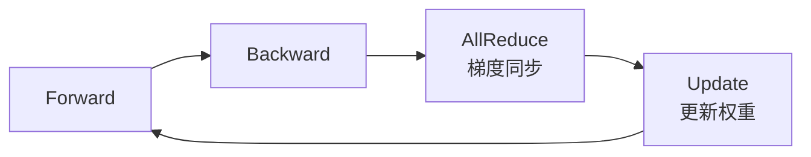
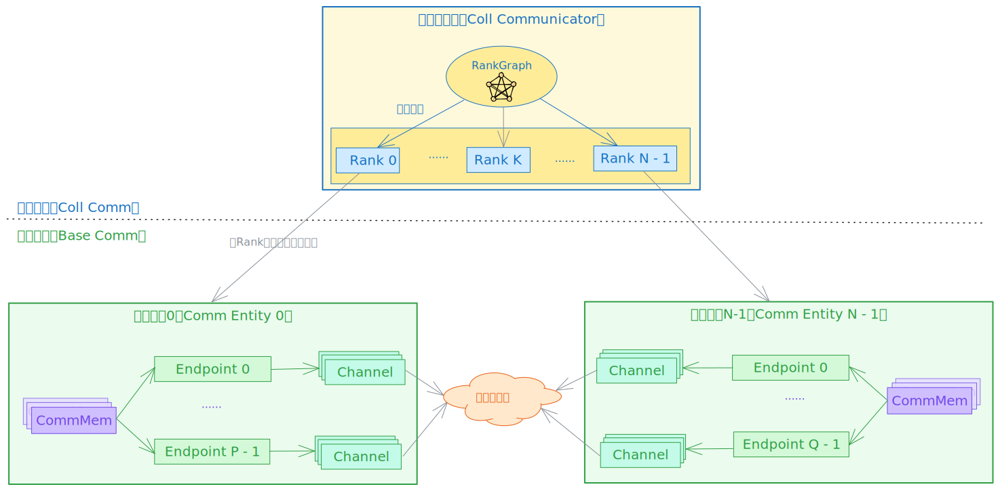
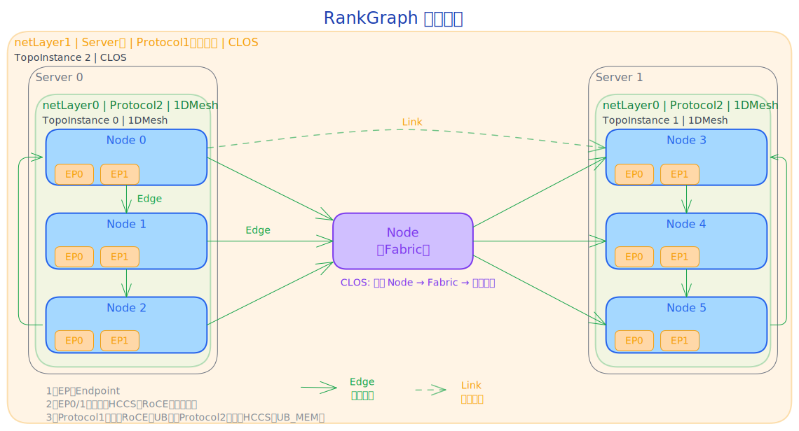
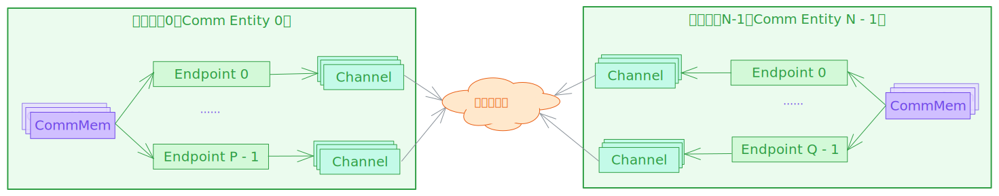
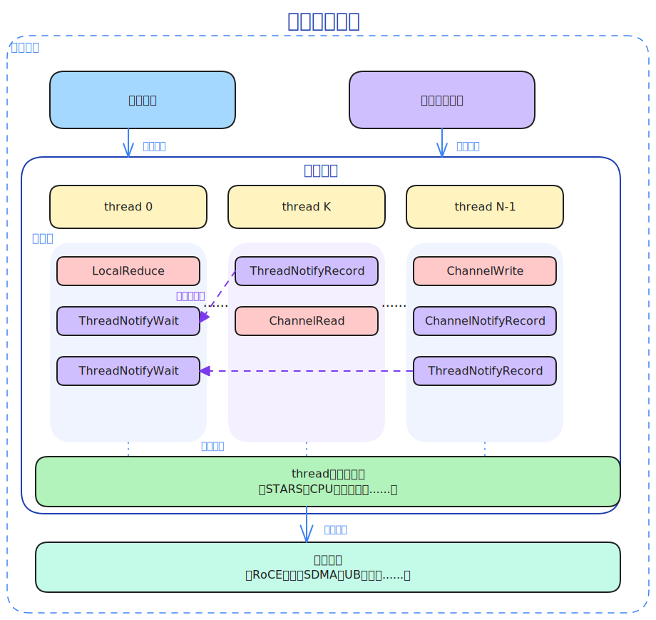
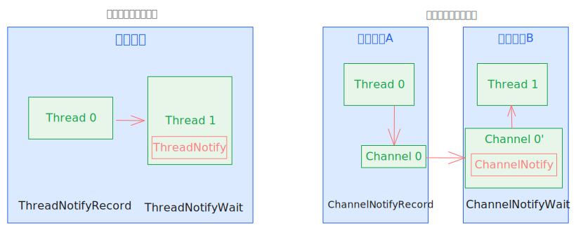
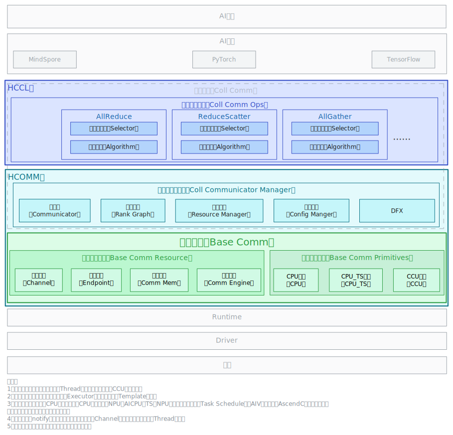
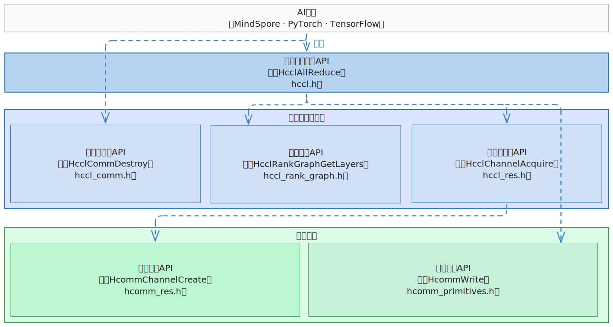

# HCCL & HCOMM 软件架构简介

---

## 1 HCCL 集合通信简介

### 1.1 为什么需要集合通信

大模型训练与推理 = 多卡协同，**通信是扩展瓶颈**



- **训练侧**：数据并行下每张 NPU 处理不同样本，迭代后需 AllReduce 同步梯度；模型/专家并行还依赖 AllGather、ReduceScatter、AlltoAll 协同
- **推理侧**：大模型推理同样需要张量并行/专家并行协同，通信时延直接影响首字时延与吞吐
- **集合通信**：让所有节点并行、高效、有序地交换数据，大幅减少同步开销
- HCCL = **昇腾 NPU 集群的高性能集合通信库**，让多块 NPU 高效协同工作

### 1.2 HCCL 核心能力一览

| 维度 | 能力 |
|------|------|
| **集合通信原语** | AllReduce、Broadcast、AllGather、ReduceScatter、AlltoAllv、Send、Receive、... |
| **通信算法** | Ring、Mesh、RHD(Halving-Doubling)、Star + 自研算法 |
| **通信协议** | UBC、UBG、UBoE、RoCE(v2)、HCCS、UB_MEM |
| **执行模式** | 单算子模式 + 图模式 |
| **扩展能力** | 通信算子自定义开发 |
| **应用场景** | 大模型训练（数据/模型/专家并行）与推理（TP/PP/EP）的集合通信 |

HCCL 在 CANN 软件栈中的位置——介于 AI 框架与硬件驱动之间，承上启下：


---

## 2 集合通信模型

### 2.1 概念及关系介绍

集合通信涉及三个核心概念：

| 术语 | 一句话解释 | 主要对应硬件 |
|------|-----------|---------|
| **集合通信域** | 集合通信执行的上下文，管理参与通信的实体和资源 | 多个 NPU 组成 |
| **Rank** | 集合通信域中的成员，拥有唯一 Rank ID（从0开始） | 一个 NPU |
| **RankGraph** | Rank 间的通信关系图，描述"谁和谁怎么连" | 网络拓扑 |



---

### 2.2 RankGraph 拓扑模型简介

RankGraph 使用图（Graph）对通信域内不同 Rank 间的连接关系进行建模，并引入拓扑层级抽象以适配大规模集群的分级结构。注意：RankGraph 中的 Edge/Link 与 NCCL 的 Link/Path 名称对应不同，详见下表。

| 概念 | 一句话解释 | 好理解的类比 |
|------|-----------|------------|
| **Node** | 图中的节点，分为通信实体和 Fabric（交换/路由抽象） | 通信实体 = 带网口的NPU；Fabric = 交换机组 |
| **Endpoint** | Node 的通信设备（逻辑概念），一个 Node 可有多个 Endpoint；一个 Endpoint 映射一个物理端口（可为 Bonding 口，硬件控制，软件不感知），一个物理端口可被多个 Endpoint 共享 | NPU上的网卡口，一个NPU可有多个网口；Bonding 口对软件透明 |
| **Edge** | Node 间的连接关系，两端是 Endpoint（对应 NCCL 的 Link） | 网线，两端插在不同NPU的网口上 |
| **Link** | 从 Edge 中提取的两个通信实体间可建链信息（含两端 Endpoint + 协议），对应 NCCL 的 Path | 两个NPU之间可建链的路径描述 |
| **netLayer** | 拓扑层级，通信质量逐层增加而递减；Server 内为 Layer0（如HCCS 直连），Server 间为 Layer1（如RoCE 经交换机） | Server 内 8 卡 HCCS 直连最快（Layer0），跨 Server 经交换机较慢（Layer1） |
| **Fabric** | 对网络交换/路由组的抽象，与它相连的通信实体两两互通。同一个网络层次不存在相连的两个Fabric。 | 一台交换机让所有插在上面的NPU互相通信 |
| **TopoInstance** | 每层内的拓扑实例 | 同机房内 8 个NPU卡组成一个 1DMesh 实例 |

> **层级要点**：集群天然分层（Layer），每层内有拓扑实例（TopoInstance），通信质量逐层增加而递减。拓扑类型包括 Fullmesh、1DMesh、CLOS、Ring 等。
> **递进关系**：Edge 描述"谁和谁连" → Link 描述"怎么建链" → Channel 描述"怎么通信"。Channel 基于 Link 实例化，是真正可用的数据通道，详见 2.3。



---

### 2.3 基础通信简介

集合通信的基础是四个**原语概念**——构成所有通信操作的基本元素：

| 概念 | 一句话解释 | 主要对应硬件 |
|------|-----------|---------|
| **通信设备(Endpoint)** | 网络通信的逻辑接口，包含协议与地址 | NPU 网口 / Host NIC |
| **通信通道(Channel)** | 两端通信设备间的数据通道（含同步 Notify） | RoCE QP / UB Jetty 连接 |
| **通信内存(CommMem)** | 注册到通信域、可被通信设备(Endpoint)访问的内存段 | NPU HBM / Host 内存 |
| **通信引擎(CommEngine)** | 执行通信任务的模块，含 Thread 与线程调度器，驱动通信硬件搬移数据 | AICPU_TS、CCU、AIV |

> **组合关系**: Channel = 两端通信设备 + 通信协议 + N Notifys



---

#### 2.3.1 内存语义原语 vs 网络语义原语

| | 网络语义原语 | 内存语义原语 |
|--|---------|---------|
| **核心对象** | Channel（通信通道） | 通信设备 + 映射内存 |
| **操作方式** | Write / Read / Notify | 本地拷贝（像操作本地内存） |
| **通信模型** | 单边操作、双边操作（需两端配合） | 单边操作（只需一端发起） |
| **适用协议** | RoCE、UB | UB_MEM、HCCS |

 

> 选择哪种语义取决于底层协议与场景需求

---

### 2.4 通信引擎介绍

通信引擎是通信实体中**执行通信任务的核心模块**。如下图，它向上接收**通信资源**（Endpoint/Channel/CommMem，见 2.3）与**通信任务编排**下发的任务，向下通过**线程执行调度器**驱动**通信硬件**完成数据搬移。



- **Thread（线程）**：通信任务的执行上下文，承载一串数据面算子（LocalReduce、ChannelRead/Write、Notify 等）；一个引擎可含多个 Thread 并发执行
- **线程执行调度器**：将 Thread 上的算子调度到硬件执行，如 TS（Task Scheduler）/ STARS / 操作系统
- **通信硬件**：实际搬移数据的硬件，如 RoCE 网卡、SDMA、UB 网卡
- **线程间同步**：不同 Thread 通过 ThreadNotify/ChannelNotify 协调执行顺序（详见 2.5）

> **一句话**：通信引擎 = Thread（执行上下文）+ 线程调度器（调度执行）；AICPU_TS 引擎即由 **AICPU 运行通信 Kernel、TS 调度 Task** 协同完成。

按 Thread 抽象与调度方式不同，通信引擎常见有 AICPU_TS、CPU_TS、AIV、CCU 等：

| 通信引擎 | Thread 抽象 | 介绍 | 特点 | 适用场景 |
|------|------------|------|-------|---------|
| **AICPU_TS** | NPU Stream | AICPU 运行通信 Kernel 并下发通信 Task 描述符，TS 调度到硬件执行 | 不占计算核，Task 描述符下发 | 大数据量通信 |
| **CPU_TS** | NPU Stream | Host CPU 运行通信逻辑，TS 调度下发 | 不占计算核，下发开销大 | Atlas A2 专用 |
| **AIV** | AICore Block | Vector Core 直接执行通信算子 | 低延迟，占 Vector 核 | 小数据低延迟 |
| **CCU** | Mission | 硬化通信单元，微码执行 | 硬化调度，微码执行 | 专用硬件通信 |

> 同一集合通信域默认只用一种引擎；算子开发者通过算法选择器自动选择引擎

---

#### 2.4.1 AICPU_TS通信引擎

- Task 描述符下发模式


1. Host 提交 AICPU Kernel 至任务队列
2. TS 调度器将 AICPU Kernel 分发至 AICPU 执行
3. AICPU 提交通信 Task 描述符至 TS 队列
4. TS 调度器将通信 Task 分发至执行器

> **要点**: AICPU 通过 Task 描述符下发通信任务，**不占计算核**，适合大数据高带宽场景

#### 2.4.2 CCU通信引擎
- 专用加速单元执行模式

CCU（Collective Communication Unit，集合通信加速单元）是位于 IO Die 的专用集合通信协处理器，Thread 抽象为 Mission。


1. Host 将 CCU 指令序列（由 CCU 可识别的指令组成）下发至 CCU 指令空间，同时提交 CCU Kernel 任务至任务队列
2. CCU Kernel 被调度器调度后发送至 CCU 执行
3. CCU 执行对应指令流，并利用 URMA（Unified Remote Memory Access，统一远端内存访问）完成数据搬运

> **要点**: CCU 是专用集合通信加速单元，执行预置的 CCU 指令流（经 URMA 搬运数据）；**高带宽、低时延**且少占计算核与访存带宽，但受片上资源限制、支持的通信域数量有限（Ascend 950PR/950DT）

#### 2.4.3 AIV通信引擎
- Vector Core 执行模式


1. Host 提交 AIV Kernel 至任务队列
2. TS 调度器将 AIV Kernel 分发至 Vector Core
3. Vector Core 利用不同协议完成数据搬运

> **要点**: AIV 低延迟但**占 Vector 计算核**，适合小数据低延迟场景

---

### 2.5 同步机制介绍

通信中的同步有两种场景：

| 同步方式 | 场景 | 说明 | 接口原型 |
|---------|------|------|-----|
| **ThreadNotify** | 同一通信实体内 | Thread 向同通信实体内另一个 Thread 发送/等待同步信号 | `ThreadNotifyRecord` / `ThreadNotifyWait` |
| **ChannelNotify** | 不同通信实体间 | Thread 通过 Channel上的notify及Channel数据通道向远端通信实体的Thread发送/等待同步信号 | `ChannelNotifyRecord` / `ChannelNotifyWait` |



---

## 3 软件分层逻辑

### 3.1 分层架构概览

| 软件层次 | 职责 | 代码仓位置 |
|----|------|--------|
| HCCL 集合通信算子 | 算子入口 → 算法选择 → 算法执行 | hccl |
| HCOMM 集合通信域管理 | 通信域 + 拓扑管理 + 资源管理 | hcomm / coll_communicator_mgr (HCCM) |
| HCOMM 基础通信 | 资源管理 + 通信原语执行 | hcomm / base_comm |



---

### 3.2 目标目录结构——与软件架构对应

HCCL仓的目标目录结构：
```text
hccl
│── src                         # HCCL算子源码目录
|    ├── common                 # 通用逻辑，包括类型定义、日志模块等
|    └── ops                    # HCCL算子实现
|        ├── all_gather         # AllGather算子实现
|        ├── all_gather_v       # AllGatherV算子实现
|        ├── all_reduce         # AllReduce算子实现
|        ├── all_to_all_v       # AlltoAll、AlltoAllV、AlltoAllVC算子实现
|        ├── batch_send_recv    # BatchSendRecv算子实现
|        ├── broadcast          # Broadcast算子实现
|        ├── op_common          # 算子通用组件
|        │   ├── executor       # 算法执行器
|        │   ├── selector       # 算法选择器
|        │   ├── template       # 算法模板
|        │   └── topo           # 通信算子的rankGraph拓扑信息适配
|        ├── recv               # Recv算子实现
|        ├── reduce             # Reduce算子实现
|        ├── reduce_scatter     # ReduceScatter算子实现
|        ├── reduce_scatter_v   # ReduceScatterV算子实现
|        ├── scatter            # Scatter算子实现
|        └── send               # Send算子实现
├── include                     # HCCL对外头文件
├── experimental                # 社区贡献的试验性代码目录（内部主要目录结构和src保持一致，不保证新接口的兼容性，当前也不会被商用版本采纳）
```

HCOMM仓的目标目录结构：
```text
hcomm
├── src                                  # 源码目录
│   ├── base_comm                        # 基础通信层
│   │   ├── common                       # 基础通信层公共基础功能目录
│   │   ├── primitives                   # 基础通信原语
│   │   └── resource                     # 基础通信资源
│   ├── coll_communicator_mgr            # 集合通信域管理
│   │   ├── api_c_adpt                   # C接口适配
│   │   ├── common                       # 集合通信层公共基础功能目录
│   │   ├── communicator                 # 通信域
│   │   ├── dfx                          # 维测
│   │   ├── rank_graph                   # 拓扑管理
│   │   ├── config_mgr                   # 配置管理
│   │   └── resource_mgr                 # 资源管理
│   └── legacy                           # 历史版本兼容目录
│       ├── ascend910                    # A2&A3兼容代码
│       └── ascend950                    # A5旧流程兼容代码
├── include                              # 对外头文件
├── pkg_inc                              # 包间接口头文件
├── experimental                         # 社区贡献的试验性代码目录（内部主要目录结构和src保持一致，不保证新接口的兼容性，当前也不会被商用版本采纳）
```

> **legacy = 历史兼容，不持续演进**

---

### 3.3 对外API分层关系



| 层次 | 接口 | 面向 | 职责概述 |
|------|------|------|---------|
| L1 | HCCL 算子（hccl.h） | AI框架适配层 | 提供 AllReduce 等标准集合通信算子入口 |
| L2-comm | HCOMM 集合通信域管理中的通信域（hccl_comm.h） | 框架适配层 | 通信域创建 |
| L2-res-rank_graph | HCOMM 集合通信域管理（hccl_res.h / hccl_rank_graph.h） | 算子开发者 | 拓扑查询、资源（Thread/Channel）获取 |
| L3-prim | HCOMM 基础通信原语（hcomm_primitives.h） | 算子开发者、通信库开发者 | 数据搬运（Write/Read/Reduce）+ 同步（Notify） |
| L3-res | HCOMM 基础通信资源（hcomm_res.h） | 通信库开发者 | 通信设备/通道/内存等基础资源的获取与管理 |

- L2-res-rank_graph + L3-prim 是**新开放的算子编程接口**，专门面向自定义通信算子开发
- L3-res + L3-prim 是**通信库开发接口**，专门面向集合通信库等开发

## 软件架构约束说明

| 约束 | 说明 |
|------|------|
| **分层依赖方向** | 上层依赖下层，下层不能反向依赖上层：`base_comm` 不能反向依赖 `coll_communicator_mgr`；`coll_communicator_mgr` 与 `base_comm` 不能反向依赖 `coll_comm_ops` |
| **控制面/数据面分离** | 资源管理、拓扑查询属控制面；数据搬运（Write/Read/Reduce）与同步（Notify）属数据面；两层接口独立演进、互不耦合 |
| **HCCL 与 HCOMM 解耦** | HCCL 算子通过 dlsym 动态加载 HCOMM 接口，两仓可独立编译、独立版本演进 |
| **legacy 不持续演进** | `legacy/` 仅用于历史版本兼容，不承接新特性；新能力一律落在标准目录 |
