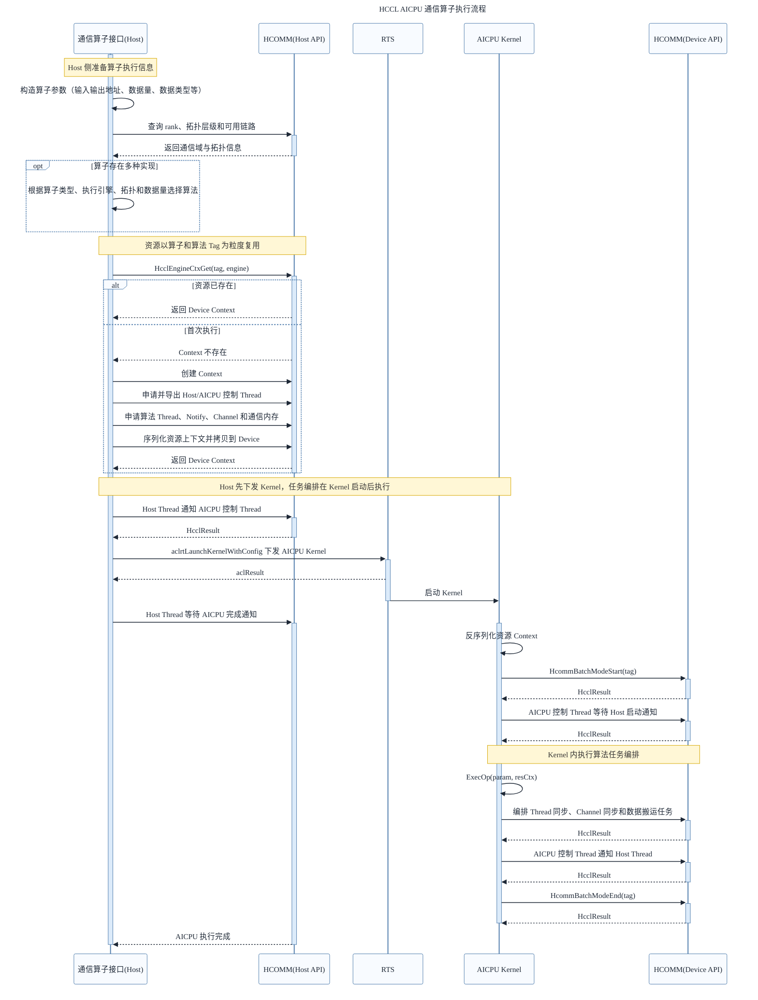

HCCL AICPU 通信算子的开发与执行分为 Host 侧准备和 AICPU 侧执行两个阶段。Host 侧负责解析拓扑、选择算法、申请资源并下发 AICPU Kernel；Kernel 启动后，AICPU 侧才根据资源上下文进行任务编排。因此，***Kernel 下发在前，任务编排在后***。

各阶段的主要职责如下：

1. ***定义算子接口***：明确输入输出、数据量、数据类型、通信域和执行流等信息。
2. ***查询拓扑信息***：获取 rank 数量、拓扑层级、层内连接关系和可用链路，为算法选择和资源计算提供依据。
3. ***算法选择***：根据算子类型、执行引擎、拓扑形态、数据量和数据类型等条件选择已注册的算法实现。只有一种固定实现的自定义算子可以省略该步骤。
4. ***创建资源***：计算并申请 Thread、Notify、Channel、通信内存和资源 Context，并将 AICPU 执行所需的上下文拷贝到 Device。
5. ***下发 Kernel***：Host 与 AICPU 控制 Thread 建立启动同步关系，然后将 AICPU Kernel 下发到执行流。
6. ***任务编排***：AICPU Kernel 启动并取得资源上下文后，调用算法执行逻辑，将 Thread 同步、Channel 同步、数据搬运等操作编排到对应 Thread 上。
7. ***完成同步***：AICPU 侧完成编排后通知 Host，Host 侧等待该通知，保证通信任务与业务流的执行顺序。