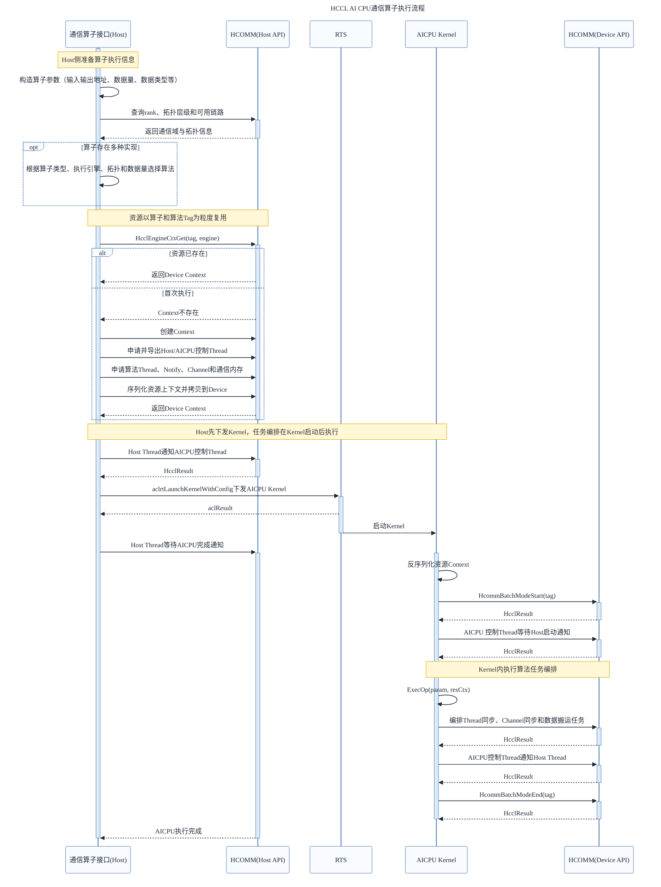

# 总体流程

HCCL AI CPU通信算子的开发与执行分为Host侧准备和AICPU侧执行两个阶段。Host侧负责解析拓扑、选择算法、申请资源并下发AICPU Kernel；Kernel启动后，AICPU侧才根据资源上下文进行任务编排。因此，***Kernel下发在前，任务编排在后***。

各阶段的主要职责如下：

1. ***定义算子接口***：明确输入输出、数据量、数据类型、通信域和执行流等信息。
2. ***查询拓扑信息***：获取rank数量、拓扑层级、层内连接关系和可用链路，为算法选择和资源计算提供依据。
3. ***算法选择***：根据算子类型、执行引擎、拓扑形态、数据量和数据类型等条件选择已注册的算法实现。只有一种固定实现的自定义算子可以省略该步骤。
4. ***创建资源***：计算并申请Thread、Notify、Channel、通信内存和资源Context，并将AICPU执行所需的上下文拷贝到Device。
5. ***下发Kernel***：Host与AICPU控制Thread建立启动同步关系，然后将AICPU Kernel 下发到执行流。
6. ***任务编排***：AICPU Kernel启动并取得资源上下文后，调用算法执行逻辑，将Thread同步、Channel同步、数据搬运等操作编排到对应Thread上。
7. ***完成同步***：AICPU侧完成编排后通知Host，Host侧等待该通知，保证通信任务与业务流的执行顺序。
