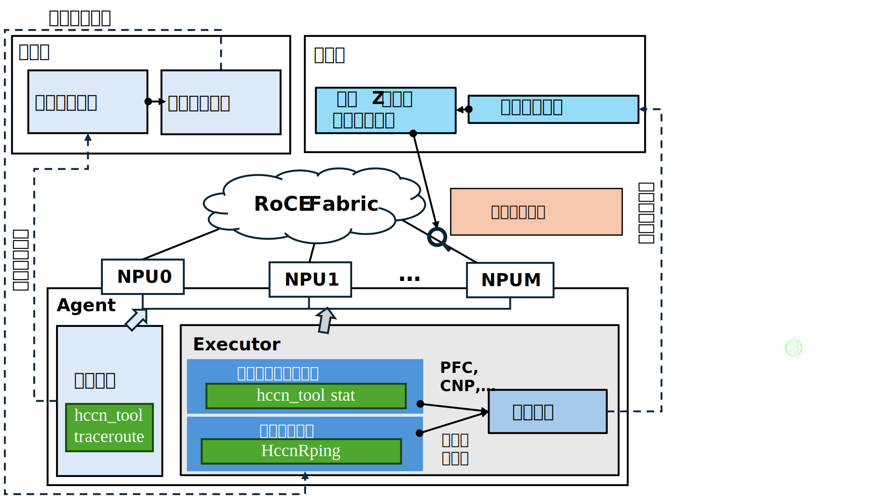
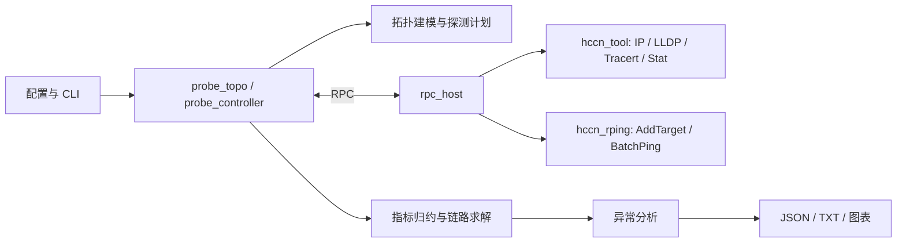
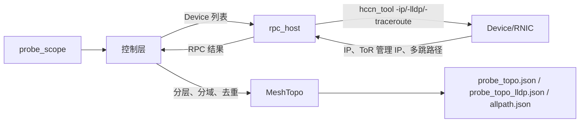
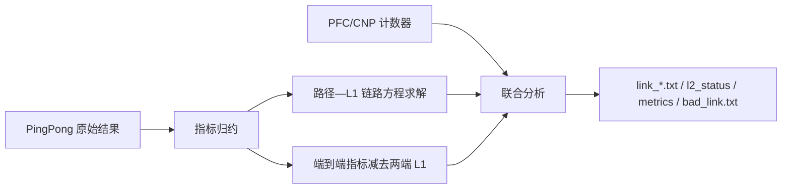

# RFC：基于拓扑的集群通信快速亚健康监测

- 起始日期：2026-06-01
- 修订日期：2026-07-13
- RFC PR 编号：2491
- 相关 Issue：249、261
- 状态：修订后待评审

## 概要

本 RFC 提出一种面向 RoCE 无损集群的“分层分域最小代价网络探测 + 链路级故障定位”方案。系统通过拓扑发现识别 Device、Host、ToR/Leaf 与上层网络域之间的关系，在域内使用可求解的环形路径集合，在相邻域之间按需构造探测任务；再联合 HCCN PingPong 的路径时延/通过率和 RNIC 的 PFC、CNP 计数器，输出 L1 链路指标、L2 路径指标及异常链路候选。

本文定义的是该特性的目标设计和用户契约。尚未完成生产实测或尚未与实现对齐的内容均显式标记为“发布门槛”或“待确认”，不视为当前版本已经达到的能力。

## 1. 背景与动机

### 1.1 问题

稳定的高速网络是 HCCL 性能的基础。链路抖动、拥塞、Host 内瓶颈、配置偏差等问题会引发集合通信长尾、训练任务降速甚至中断。现有监控手段通常存在以下不足：

1. 全量 PingMesh 的探测对随集群规模平方增长，探测开销高。
2. 仅观测端到端时延或丢包，无法把异常归因到具体接入链路。
3. 静态阈值不能适应不同规模、不同层级和不同负载阶段，误报率高。
4. 单控制节点串行收敛数据，在大规模集群中容易形成控制面瓶颈。

### 1.2 要解决的四类问题

| 编号 | 问题 | 本方案的处理方式 |
| --- | --- | --- |
| Q1 | 复杂拓扑认知 | 基于 Tracert 和 LLDP 发现 Spine-Leaf、HammingMesh、3D-Torus 等拓扑的可观测层级与局部 Mesh |
| Q2 | 网络指标获取 | 生成可求解的最小探测集合，采集 P90/P99/Mean 时延、通过率及 PFC/CNP 计数器 |
| Q3 | 异常分析定位 | 对 L1 建立路径—链路方程求解，对 L2 输出扣除接入链路后的跨域路径指标，并使用时序异常判定 |
| Q4 | 大规模适应 | 分层分域、Host 并行执行、控制层聚合，避免全局全互联探测 |

### 1.3 使用场景

- 在大规模分布式训练运行期间，辅助定位 AllReduce、RingAllReduce 等集合通信的时延抖动、吞吐突降和通信长尾。
- 在 RoCE 网络中检测链路闪断、拥塞、交换机或 NPU 丢包、Hash 碰撞等异常。
- 在训练任务开始前进行网络基线检查，或在任务运行期间以低频方式持续巡检。

### 1.4 非目标

- 不替代交换机 Telemetry、NMS 或告警平台。
- 不直接修改 HCCL/HCOMM 数据面、QP 创建流程或训练任务的通信拓扑。
- 当前版本不承诺把所有 L2 异常唯一定位到一条物理交换机链路；L2 输出首先是路径或通信 Pair 级候选。

## 2. 术语表

| 术语 | 定义 |
| --- | --- |
| Device / NPU | 参与 HCCL 通信、具有 HCCN/RNIC 端口的加速设备 |
| Host | 管理一个或多个 Device，并运行 `rpc_host` 的服务器节点 |
| 控制层 / Controller | 运行 `probe_topo`、`probe_controller` 和部署脚本的中控节点 |
| Leaf / ToR | Device 接入的机架顶交换机；本文把两者作为同一接入层概念使用 |
| L1 链路 | Device/RNIC 到其直连 Leaf/ToR 的接入链路；当前实现可通过路径方程求解到链路级 |
| L2 路径 | 两个不同 Leaf/ToR 域之间的网络段。当前实现为“端到端 P99 时延减去两端 L1 求解值”，并非对应单条物理链路 |
| Mesh | 在同一网络层级上共享父级网络结构、可按局部路径集合建模的一组节点或子域 |
| 探测路径 | 一次从源 Device 到目的 Device、使用指定源端口执行的 Tracert 或 PingPong 路径 |
| PingList | 控制层下发给各源 Device 的 PingPong 任务集合，元素包含源 IP、目的 IP和源端口 |
| 亚健康 | 网络尚可连通，但时延、通过率或拥塞计数器持续偏离同层基线，已影响或可能影响业务性能的状态 |
| 慢故障 | 不表现为完全中断，而表现为持续或间歇性高时延、低吞吐、重传或拥塞的故障 |
| 长尾 | P99 等高分位时延显著高于均值或中位数，导致同步式集合通信被最慢路径拖慢 |
| 3σ | 以同层基线均值 `μ` 和标准差 `σ` 构造的异常阈值 `μ + 3σ` |
| 轮次（turn） | 一次完整的 PingPong 采样、指标归约、链路求解和异常判定 |

## 3. 总体架构与数据流

### 3.1 两层架构



系统分为两层：

- 控制层：解析配置，发现拓扑，生成 PingList，并行下发任务，聚合结果，求解链路指标并生成产物。
- Host 层：运行 `rpc_host`，调用 `hccn_tool` 和 `hccn_rping` 执行 Device 侧探测，采集 RNIC 计数器，并通过 RPC 返回结果。

模块关系精简如下：



### 3.2 拓扑发现流



### 3.3 网络探测流


### 3.4 异常定位流



数据方向统一为 `Device → Host → 控制层 → 产物`；控制命令和任务下发方向相反。

## 4. 接口设计（面向用户）

### 4.1 构建与环境

```bash
cd <repo_dir>

export THIRDLIB_ROOT=/usr/local/third_lib
export ASCEND_HOME_PATH=/usr/local/Ascend
export ASCEND_CANN_PATH=/usr/local/Ascend/ascend-toolkit/latest/aarch64-linux
source "$THIRDLIB_ROOT/share/disp_probe/third_party/env.sh"

cmake -S . -B build \
  -DTHIRDLIB_ROOT="$THIRDLIB_ROOT" \
  -DCMAKE_BUILD_TYPE=Release
cmake --build build -j"$(nproc)"
```

### 4.2 配置文件

用户使用 JSON 文件同时描述部署拓扑、探测范围和运行参数。推荐模板如下：

```json
{
  "deploy": {
    "default_ssh_port": 22,
    "default_timeout": 5,
    "host_to_user_pair": {
      "10.90.15.67": {"root": "<password>"},
      "10.90.15.69": {"root": "<password>"}
    },
    "control_topo": ["10.90.15.67", "10.90.15.69"],
    "controller": {"10.90.15.67": "root"},
    "host_to_su_pswd": {},
    "host_to_key_filename": {
      "10.90.15.67": {"root": "/root/.ssh/id_ed25519"}
    },
    "to_path": "~/disp_probe",
    "from_path": "."
  },
  "probe_scope": {
    "10.90.15.67": ["0", "1", "2", "3"],
    "10.90.15.69": ["4", "5", "6", "7"]
  },
  "probe_topo": {
    "tracert": {
      "sport_begin": 49152,
      "sport_count": 32,
      "tree_probe_sport_count": 1,
      "topology_optimized": true,
      "l2_path_aware": true,
      "output_subdir": "",
      "allpath_output": "allpath.json",
      "l2_path_output": "l2_fullmesh_path.json"
    }
  },
  "probe_controller": {
    "pingpong": {
      "times": 50,
      "turns": 1000,
      "payload_len": 12,
       "interval_ms": 1
    }
  }
}
```

| 字段 | 类型/默认值 | 语义与约束 |
| --- | --- | --- |
| `deploy.default_ssh_port` | int / `22` | SSH 端口 |
| `deploy.default_timeout` | int / `5` | Dispatcher SSH 连接超时，单位秒 |
| `deploy.host_to_user_pair` | object / 必填 | Host 到用户名、密码映射；一个 Host 可配置多个用户 |
| `deploy.control_topo` | array/object / 必填 | 分发和远程执行的主机树。空数组或空对象时回退为 `host_to_user_pair` 的平铺主机列表 |
| `deploy.controller` | object / 可空 | 控制节点 IP 到用户名映射。为空时取 `host_to_user_pair` 第一台 Host；用户名为空时取该 Host 配置中的第一个用户名 |
| `deploy.host_to_su_pswd` | object / `{}` | 可选的 `su` 密码；缺失时取对应 Host 第一个用户的密码 |
| `deploy.host_to_key_filename` | object / `{}` | 可选的 SSH 私钥映射 |
| `deploy.to_path` | string / 必填 | 远端部署根目录；`~` 按控制用户展开 |
| `deploy.from_path` | string / 必填 | 本地源路径。当前 Dispatcher 的 `abs_from_path` 处理存在待修正实现问题，见开放问题 O4 |
| `probe_scope` | object / 必填 | 唯一探测范围，Key 为 Host 管理 IP，Value 为非空 Device ID 数组；元素可为字符串或整数，不支持 `"0-7"` 范围写法，不允许重复 |
| `sport_begin` | positive int / `49152` | Tracert 源端口起始值 |
| `sport_count` | positive int / `1` | 跨域多路径覆盖时每个有向 Pair 的源端口数 |
| `tree_probe_sport_count` | positive int / `1` | 环形拓扑骨架发现时每个 Pair 的源端口数 |
| `topology_optimized` | bool / `true` | `true` 使用相邻域同槽位环形覆盖；`false` 使用跨域全互联 Tracert |
| `l2_path_aware` | bool / `true` | 是否额外生成相邻 L1 域之间的 L2 路径发现产物 |
| `output_subdir` | string / `""` | `output/` 下的相对目录；不得为绝对路径，且不得包含 `.`、`..` 或空路径段 |
| `allpath_output` | filename / `allpath.json` | 跨域路径 JSON 文件名，不得包含父目录 |
| `l2_path_output` | filename / `l2_fullmesh_path.json` | L2 路径 JSON 文件名，不得包含父目录 |
| `times` | positive int / `50` | 每轮每个 PingPong 任务的采样次数 |
| `turns` | positive int / `1000` | PingPong 轮次数；实际周期还包含执行、RPC 和求解耗时 |
| `payload_len` | int / `12` | HCCN Rping Payload 字节数，范围 `1～1500`。每个目标在 AddTarget 时独立生成指定长度的随机字节，不按字符串处理 |
| `interval_ms` | int / `12` | HCCN Rping 的探测周期。 |

`probe_topo.tracert` 与 `probe_controller.pingpong` 必须同时出现；只配置其中之一会被拒绝。

### 4.3 CLI 与执行顺序

#### 4.3.1 `rpc_host`

| 参数 | 说明 |
| --- | --- |
| `-f, --file <PATH>` | 控制 JSON，默认 `./control_json/910b2_info.json` |
| `-d, --dev <IFACE>` | Host 管理网卡名称 |
| `-i, --ip <IP>` | Host 管理 IP |
| `-p, --port <PORT>` | RPC 监听端口 |
| `--pingpong-local-log` | 在各 Host 保存本地 PingPong 结果日志，默认关闭 |
| `--pingpong-log-dir <PATH>` | 本地日志根目录，默认 `/root/output` |

#### 4.3.2 `probe_topo`

| 参数 | 说明 |
| --- | --- |
| `-f, --file <PATH>` | 控制 JSON；执行拓扑发现并生成拓扑产物 |

#### 4.3.3 `probe_controller`

| 参数 | 说明 |
| --- | --- |
| `-f, --file <PATH>` | 控制 JSON |
| `--print-pingpong-plan` | 只打印任务计划，不下发 PingList、不执行 PingPong |
| `--l1-only` | 只探测和求解 L1，关闭 L2 FullMesh 任务及 L2 输出 |
| `--no-metrics` | 关闭 PFC/CNP 计数器采集 |

推荐执行顺序：

```bash
# 1. 清理程序占用（Terminal 0）
python3 ./dispatcher/exec_realtime_cmd.py "ps aux | grep 'rpc_host' | grep -v grep | tr ' ' '\n' | grep -E '^[0-9]+$' | tr '\n' ' ' | xargs -r kill"

# 2. 分发同一个构建产物和配置文件。（Terminal 0）
python3 ./dispatcher/disp_file_scp.py './build/rpc_host' './bin/rpc_host'
python3 ./dispatcher/disp_file_scp.py \
  './control_json/910b2_info.json' './control_json/910b2_info.json'

# 3. 在所有目标 Host 启动 rpc_host。（Terminal 0）
python3 ./dispatcher/exec_realtime_cmd.py -l \
  './bin/rpc_host -f ./control_json/910b2_info.json'

# 4. 发现拓扑。（Terminal 1）
./build/probe_topo -f ./control_json/910b2_info.json

# 5. 持续探测和分析。（Terminal 1）
./build/probe_controller -f ./control_json/910b2_info.json
```

`disp_file_scp.py` 按 `deploy.control_topo` 递归确定分发目标；仅当该字段为空时，才使用 `host_to_user_pair` 的全部 Host。

### 4.4 产物契约

#### 4.4.1 拓扑发现产物

| 产物 | 格式 | 内容 |
| --- | --- | --- |
| `output/<subdir>/probe_topo.json` | JSON | 环形 Tracert 发现的网络层级和 Mesh 骨架 |
| `output/<subdir>/probe_topo_lldp.json` | JSON | 依据 LLDP 管理 IP 聚合的 L1 域拓扑；`probe_controller` 的默认拓扑输入 |
| `output/<subdir>/allpath.json` | JSON | 跨域 Pair、端口样本、多跳 IP、空路径和唯一路径统计 |
| `output/<subdir>/l2_fullmesh_path.json` | JSON | 相邻 L1 域之间的 L2 路径发现结果；仅 `l2_path_aware=true` 时生成 |

拓扑 JSON 使用 `status` 表示 Device 数完整性：已发现 Device 数与 `probe_scope` 配置数一致时为 `complete`，不一致时为 `incomplete`，并同时记录 `configured_device_count`、`discovered_device_count`、配置 Device 列表和已发现 Device IP 列表。完整性只比较 Device 数，不依据 LLDP 域数量、空路径率或路径覆盖率改变 `status`。

#### 4.4.2 网络状态产物

```text
output/<time>/
├── link_lat.txt
├── link_pass_rate.txt
├── bad_link.txt
├── l2_status/
│   ├── l2_path_lat.txt
│   └── l2_path_passrate.txt
└── metrics/
    ├── mac_tx_pfc_pkt_num.txt
    ├── mac_rx_pfc_pkt_num.txt
    ├── roce_tx_cnp_pkt_num.txt
    └── roce_rx_cnp_pkt_num.txt
```

| 产物 | 格式契约 |
| --- | --- |
| `link_lat.txt` | 第一行为定宽 L1 链路列名 `[device_ip-tor_ip]`，后续每行对应一个轮次的浮点时延 |
| `link_pass_rate.txt` | 与 `link_lat.txt` 列顺序一致，值域目标为 `[0,1]` |
| `bad_link.txt` | 文本告警，每行包含告警类型、链路端点、时延和通过率；多条链路可以在同一轮分别出现 |
| `l2_path_lat.txt` | Tab 分隔：`turn, task_index, tag, from_label, from_ip, to_label, to_ip, src_sport, l2_path_lat` |
| `l2_path_passrate.txt` | Tab 分隔，最后一列为 `pass_rate`；其余字段同上 |
| `metrics/*.txt` | CSV：`time,port,value,valid`；`port` 形如 `<host>_dev<id>`。四个计数器字段全部成功解析时 `valid=true`；缺 Key、非数字或命令失败时值按 `0` 占位且 `valid=false`；采样周期约 1 秒 |

可运行 `python3 ./plot/topo_plot.py` 和 `python3 ./plot/status_plot.py --input-dir "output/<time>"` 生成拓扑和状态图。图表是派生产物，JSON/TXT/CSV 是稳定数据接口。

## 5. 外部依赖

### 5.1 生态内运行期接口

| 依赖/接口 | 调用方式 | 用途 | 输入约定 | 输出与解析约定 | 稳定性来源 | 已知限制 |
| --- | --- | --- | --- | --- | --- | --- |
| HCCN Device IP | `hccn_tool -i <dev> -ip -g` | Device ID 到 HCCN IP 映射 | `<dev>` 为本机非负 Device ID | 按行解析工具输出，提取有效 IP；缺失或格式变化视为该 Device 查询失败 | 按当前 CANN 工具实现假设 | 文本格式无版本化 Schema |
| LLDP 邻居 | `hccn_tool -i <dev> -lldp -g` | 获取直连 Leaf/ToR 管理 IP | 同上 | 提取交换机管理 IP；空值归入 `unknown:<device>` 域 | 按当前实现假设 | LLDP 未启用或无权限时不能可靠分域 |
| Tracert | `hccn_tool -i <dev> -traceroute ... -sport <port>` | 获取多跳路径 | 源 Device、目的 IP、源端口 | 返回有序多跳 IP 列表；空列表是失败样本；单跳结果在控制层补齐占位以保持路径形状 | 按当前实现假设 | TC/DSCP、返回方向端口可控性有限；ECMP 覆盖依赖源端口 Hash |
| RNIC Stat | `hccn_tool -i <dev> -stat -g` | 获取 PFC/CNP 累积计数器 | Device ID | 按 `key:value` 解析 `mac_tx_pfc_pkt_num`、`mac_rx_pfc_pkt_num`、`roce_tx_cnp_pkt_num`、`roce_rx_cnp_pkt_num`；RPC 行末携带有效标记，Controller 输出 `valid=true/false` | 按当前实现假设 | 任一目标 Key 缺失、值非无符号整数或命令失败时整行 `valid=false`，数值 `0` 仅为占位，不参与联合判断 |
| HCCN Rping 初始化 | `HccnRpingInit/Deinit` | 初始化每个 Device 的探测上下文 | 本地 Device ID | 返回码必须为成功才允许进入探测 | CANN/HCCL 头文件和库接口 | 运行环境必须提供匹配版本的 `libhccl*` |
| HCCN Rping 目标配置 | `HccnRpingAddTarget` | 下发目的 IP、源/回程端口 | 目标 IP、源端口、接收端口等 | 返回码映射为 RPC 成功/失败 | 同上 | 目标数量和端口资源上限需按版本验证 |
| HCCN Rping 批量探测 | `HccnRpingBatchPingStart/Stop/GetResult/GetPayload` | 执行 PingPong 并取得统计值 | Device、任务集合、`times` | 归一化为 `[P90Lat,P99Lat,Mean,Pass]` 的 `uint64_t` 数组 | 同上 | 原始时延单位需由接口版本确认并在发布文档固定；当前日志按 ms 展示 |

这些接口均为 Host 运行期依赖。项目不修改 HCCL/HCOMM 数据面，保持与 HCCL↔HCOMM 解耦原则一致；但 C++ 构建仍需要 CANN/HCCL/ACL 头文件和链接库，不能表述为“完全无编译期依赖”。

### 5.2 通用第三方库

| 依赖 | 版本 | 用途 | 许可证 | 依赖阶段 |
| --- | --- | --- | --- | --- |
| CLI11 | 2.5.0 | C++ CLI 解析 | BSD-3-Clause | 编译期，Header-only |
| nlohmann_json | 3.12.0 | JSON 配置与产物 | MIT | 编译期，Header-only |
| Eigen | 3.4.0 | SVD 链路方程求解 | MPL-2.0 | 编译期，Header-only |
| rpclib | 2.3.0 | Controller ↔ Host RPC | MIT | 编译期静态链接 + 运行期通信 |
| fmt | 12.0.0 | 可选格式化支持 | MIT | 可选，编译期 |
| spdlog | 1.15.3 | 可选日志支持 | MIT | 可选，编译期 |
| paramiko | 5.0.0 | Dispatcher SSH | LGPL-2.1-or-later | Python 运行期 |
| scp | 0.15.0 | 文件分发 | LGPL-2.1-or-later | Python 运行期 |
| matplotlib | 3.9.4 | 绘图 | PSF-based | Python 绘图运行期 |

发布包必须以 `third_party/manifest.json`、`third_party/python/requirements.txt` 和实际安装包元数据生成第三方声明；若版本或许可证不一致，以发布构建审计结果为准。

## 6. 关键算法设计

### 6.1 分层分域与 L1/L2 定义

1. 使用 Device IP 和环形 Tracert 识别网络层级骨架。
2. 使用 LLDP 管理 IP 把 Device 聚合到直连 Leaf/ToR 域。
3. 域内 Device 到 Leaf/ToR 的边定义为 L1 链路。
4. 不同 Leaf/ToR 域之间的剩余网络段定义为 L2 路径。当前设计对 L2 只承诺路径级候选，不承诺唯一物理链路定位。

### 6.2 最小开销拓扑探测

设集群共有 `D` 个 L1 域，第 `i` 个域有 `n_i` 个 Device，总 Device 数 `N=Σn_i`，每个 Pair 使用 `s` 个源端口样本。

- 骨架发现：所有 Device 组成有向环，每个 Device 探测下一个 Device，路径数约为 `N × tree_probe_sport_count`，即 `O(N)`。
- 优化跨域覆盖：每个域只连接下一个域的相同槽位，Pair 数约为 `Σ min(n_i,n_(i+1))`，路径数乘以 `sport_count`；均匀域规模下约为 `N × s`，即 `O(Ns)`。
- 非优化跨域覆盖：所有不同域 Device 做有向全互联，Pair 数为 `Σ_{i≠j} n_i n_j = N²-Σn_i²`，即最坏 `O(N²s)`。
- L1 PingPong：每个域按可求解环生成任务，均匀情况下约 `O(N)` 个 Pair。
- 当前 L2 PingPong：相邻域形成环，并在相邻域间执行 FullMesh，任务数为 `Σ n_i n_(i+1)`；均匀域规模 `k` 时为 `Dk²=Nk`。它不是严格 `O(N)`，因此必须在上线前用 `--print-pingpong-plan` 审核任务量，必要时使用 `--l1-only`。

“最小代价”指在保证目标链路方程可辨识的约束下减少路径，而不是固定声称全流程始终为线性复杂度。

### 6.3 PingPong 指标归约

Host 返回的原始数组与控制层指标枚举映射如下：

| 原始 `PingpongResult` | 下标 | 控制层 `PingpongMetric` | 处理 |
| --- | --- | --- | --- |
| `P90Lat` | 0 | `P90Lat` | 转为 `float` |
| `P99Lat` | 1 | `P99Lat` | 转为 `float` |
| `Mean` | 2 | `MeanLat` | 转为 `float`；名称不同以避免和统计均值混淆 |
| `Pass` | 3 | `LogPassRate` | 计算 `log2(pass/times)` |
| `Size` | 4 | 无 | 枚举哨兵，表示数组字段数，不是观测指标 |

通过率在对数域求解：

```text
r_path = pass / times
b_path = log2(r_path)
b_path = Σ log2(r_link)
```

边界约定：

- `times <= 0`：配置或调用错误，直接失败。
- `pass > times`：数据异常，样本标记无效，不进入求解；发布前需补实现校验。
- `pass = 0`：数学上为 `-∞`。当前实现用 `-1e10` 作为有限哨兵参与求解；目标实现应同时携带 `all_lost=true`，最终输出通过率 `0`，并避免把哨兵误解释为可比较的正常值。
- 原始数组字段缺失：时延返回 `NaN`；通过率当前按 `pass=0` 处理。目标实现应统一标记为无效样本。

### 6.4 L1 链路求解

对每个路径样本建立线性方程：

```text
A × x = b
```

- `A[m,n]` 表示第 `m` 条路径是否经过第 `n` 条 L1 链路。
- 时延的 `b` 为路径 P99 时延，`x` 为链路时延。
- 通过率的 `b` 为路径通过率的 `log2` 值，求解后用 `exp2` 还原链路通过率。
- 使用 Eigen `BDCSVD` 求最小二乘解。

探测计划必须使目标链路对应列可辨识。若矩阵秩不足、条件数过大、输入含无效样本或解明显越界，该轮链路结果应标记为 `NaN/invalid`，不得产生确定性故障结论。矩阵秩和条件数检查是发布门槛，当前实现尚未完整提供。

### 6.5 L2 路径指标

当前 L2 时延计算为：

```text
l2_path_lat = end_to_end_p99 - src_l1_lat - dst_l1_lat
```

任一端 L1 不可求解时输出 `NaN`。L2 通过率直接使用端到端 Pair 的通过率，尚未扣除两端 L1 通过率，因此产物名使用 `l2_path_passrate` 而不是 `l2_link_passrate`。

### 6.6 异常判定

目标异常判定按同层链路分别维护滚动基线：

1. 排除 `NaN`、全丢包哨兵和已知维护窗口样本。
2. 使用最近 `W` 个有效轮次计算稳健基线；初始方案为均值 `μ` 和标准差 `σ`，后续可切换中位数/MAD。
   当前实现使用全部时延有效的 L1 链路建立基线，不再根据 IP 字符串或特定网段筛选链路。
3. 时延异常条件：`latency > μ + 2σ`。
4. 通过率异常条件：`pass_rate < 0.99`，阈值后续配置化。
5. 连续 3 个有效轮次满足任一条件才写入持续性告警；单轮异常记录为候选事件。
6. PFC/CNP 增量同时抬升时，提高拥塞类异常置信度，但计数器不作为唯一告警条件。

当前代码使用指数平滑基线（EWMA）进一步过滤噪声。

## 7. 内部模块实现

### 7.1 目录与职责

```text
disp_probe-main/
├── control_json/       # 用户配置示例
├── dispatcher/         # SSH/SCP 分发与远程执行
├── docs/               # RFC、用户与环境文档
├── plot/               # 拓扑和状态可视化
├── scripts/            # 系统与第三方依赖安装
├── src/
│   ├── probe_topo.cpp          # 拓扑发现入口
│   ├── probe_controller.cpp    # 探测、求解、分析入口
│   ├── rpc_host.cpp            # Host RPC 服务
│   └── util/
│       ├── helper/             # 流程协调、PingList、方程求解
│       ├── topo/               # 配置、控制拓扑、MeshTopo
│       ├── tool/               # Tracert、PingPong、指标采集
│       ├── rpc_call/           # RPC 代理
│       └── file_path/          # 工作目录管理
└── third_party/        # 依赖清单
```

### 7.2 跨模块契约

RFC 只保留会跨模块或跨进程传递的签名，不列纯内部 Getter/Setter。

```cpp
using PingpongRawResult =
    std::vector<std::vector<std::vector<uint64_t>>>; // device -> task -> metric
using PingpongMetricMatrix =
    std::vector<std::vector<float>>;                 // device -> task
using LinkMetricVector = std::vector<float>;         // link_global_id -> value

using HccnDeviceIpListParallel =
    std::function<std::vector<std::vector<std::string>>(
        const std::vector<std::string>& control_devices,
        const std::vector<int>& device_counts)>;

MeshTopo& probe_topo_ring();
MeshTopo& probe_topo();
std::map<std::string, std::vector<std::tuple<std::string, std::string, int>>>&
get_pinglist();
void set_pinglist(const PingList& pinglist);
PingpongRawResult get_pingpong_res(int times);
PingpongMetricMatrix reduce_pingpong_res(
    const PingpongRawResult&, PingpongMetric, int times);
LinkMetricVector solve_pingpong_res(
    const PingpongMetricMatrix&, const PingList&);
```

`probe_topo_ring()` 与 `probe_topo()` 的差异：

| 接口 | 行为 | 使用场景 |
| --- | --- | --- |
| `probe_topo_ring()` | 仅执行 `gen_topo()`，生成环形 Tracert 得到的层级/Mesh 骨架 | 新配置路径；随后由 `probe_topo.cpp` 结合 LLDP 和显式跨域探测补齐产物 |
| `probe_topo()` | 执行 `gen_topo()`、域内 `mesh_full_trace()`、`gen_pinglist()`、补充 Tracert 和链路 ID 分配 | 旧配置兼容路径或需要一次性构造完整求解状态时 |

Host RPC 边界：

```cpp
std::vector<std::vector<std::vector<std::string>>>
tracert_ports_multi_by_src_ip_with_sport_begin(
    std::string src_dev_ip,
    std::vector<std::string> targets,
    std::vector<int> port_num,
    int sport_begin);

int pinglist_insert_muti(
    std::string src_dev_ip,
    std::vector<std::string> target_dev_ips,
    std::vector<int> src_ports,
    std::vector<int> return_ports,
    int rx_num);

std::vector<std::vector<uint64_t>>
ud_pingpong_tx_muti(std::string src_dev_ip, int times);

std::vector<std::string> get_metrics_counter_name();
std::vector<std::vector<uint64_t>> get_metrics_counter_value();
```

### 7.3 `metrics_collector` 与分析模块职责

- `metrics_collector`：每秒调用 `hccn_tool -stat -g`，解析四类 PFC/CNP 累积计数器；内存队列最多保存 100 行，Controller 拉取后清空。读取异常当前被吞掉并写零值，目标实现应返回有效性状态和错误原因。
- 分析逻辑（位于 `probe_controller.cpp`）：维护同层基线、判定时延/通过率异常、关联计数器增量、输出 `bad_link.txt`。

## 8. 影响分析

### 8.1 生产侵入影响

| 资源 | 影响来源 | 控制措施 |
| --- | --- | --- |
| NPU/RNIC | HCCN Rping 初始化、AddTarget、探测包收发 | 限制每 Device 任务数和 `times`；上线前执行 `--print-pingpong-plan`；支持 `--l1-only` |
| 网络带宽 | Tracert 与 PingPong 报文 | 拓扑发现低频执行；状态探测分域；配置探测周期；超过预算时停发 |
| 集合通信时延 | 探测流与业务流争用队列、Hash 路径或端口资源 | A/B 验证；灰度启用；避免在业务峰值执行全量拓扑发现 |
| Host CPU/内存 | RPC、SSH、结果聚合、1 秒计数器轮询 | Host 并行；计数队列上限 100；监控 Controller/Host CPU 与 RSS |
| 文件系统 | 长轮次文本产物持续增长 | 按时间目录滚动、保留策略和压缩；发布前补磁盘配额 |

### 8.2 进一步评估

对每个RNIC，假设每轮1ms发送500B探针包，在100Gbps网络下，其带宽占用率小于千分之一。方案进一步通过hccl_test多机测试说明，是否存在探针流对hccl任务的完成时间影响小于1%。当前方案默认探测周期为每1ms发送探针包，连续探测 `turns` 轮，每轮 `times` 次采样。

### 8.3 失败模式与降级

| 失败模式 | 检测 | 处理与降级 | 产物语义 |
| --- | --- | --- | --- |
| Tracert 失败/空路径 | 返回空 Hop 列表、超时或非零状态 | 对 Pair/端口有限重试；仍失败则标记缺测，不用猜测路径；空路径率超阈值时终止拓扑发布 | `allpath.json` 记录空样本和统计 |
| RPC 超时 | 客户端异常/无返回 | 单 Host 隔离，其他 Host 继续；指数退避重试；不得把超时当丢包 | 对应样本为 `invalid` |
| 部分 Host 不可达 | SSH/RPC 健康检查失败 | 从本轮范围剔除并报告覆盖率；若破坏矩阵可辨识性，停止链路求解 | 输出缺失 Host 列表 |
| 拓扑发现不全 | 已发现 Device 数与 `probe_scope` 配置数不一致 | `probe_topo` 写入诊断产物后停止后续 LLDP/路径探测；`probe_controller` 拒绝执行 PingPong 和告警 | 拓扑标记 `status=incomplete`，记录配置数与发现数；不再检查 LLDP 域或路径覆盖完整性 |
| 计数器读取异常 | 缺 Key、非数字、命令失败 | 样本标记 `valid=false`，不参与联合判断；探测主流程继续 | `metrics/*.txt` 写入 `value=0,valid=false`，与真实的 `value=0,valid=true` 区分 |
| PingPong 全丢包 | `pass=0` | 直接生成连通性候选告警；对数域使用哨兵但不做普通数值比较 | 最终通过率为 0，附 `all_lost` |
| 方程秩不足/病态 | 秩、条件数检查 | 不输出确定性链路定位；增加探测路径或退化为路径级告警 | 链路值为 `NaN/invalid` |
| 输出文件不可写 | 文件打开/写入失败 | 终止本次 Controller 运行，避免无产物探测 | 进程非零退出 |
| Controller 退出 | 进程信号或异常 | 停止下发；Host 服务可保留供重连；清理策略由运维执行 | 已落盘轮次保留 |

### 8.4 开销模型

设：

- `P`：每轮 PingPong 有向任务数；
- `times`：每任务每轮报文次数；
- `B_req`、`B_rsp`：请求和响应在线路上的平均字节数，包含协议开销；
- `T_cycle`：轮次周期秒数；
- `C_link`：端口线速 bit/s。

则集群平均探测带宽估算为：

```text
BW_cluster = P × times × (B_req + B_rsp) × 8 / T_cycle
```

单 Device `d` 的平均占比为：

```text
Util_d = P_d × times × (B_req + B_rsp) × 8 / (T_cycle × C_link)
```


### 8.5 安全与运维影响

- Dispatcher 使用 SSH/SCP，配置中可能包含明文密码；生产环境优先使用私钥，并限制配置文件权限。
- `hccn_tool` 和 Device 操作可能需要高权限，应采用最小权限账户和命令白名单。
- RPC 当前未在本文定义鉴权和加密，必须部署在受控管理网络；跨安全域使用前需补安全设计。

## 9. 兼容性、特性开关与灰度

### 9.1 兼容性

- 工具以独立进程运行，不修改训练进程或 HCCL/HCOMM 接口。
- 新式配置以 `probe_scope + probe_topo.tracert + probe_controller.pingpong` 为契约；缺少整组探测配置时保留旧 ranktable 路径，但不新增能力。
- JSON/TXT 产物一旦被外部系统消费，新增字段应保持向后兼容；破坏性修改必须升级 Schema 或文件名。

### 9.2 特性开关

| 开关 | 作用 | 推荐场景 |
| --- | --- | --- |
| 不启动 `probe_controller` | 完全关闭持续探测 | 默认关闭/回滚 |
| `--print-pingpong-plan` | 只审查计划，不产生网络探测 | 上线前容量检查 |
| `--l1-only` | 关闭 L2 FullMesh | 首轮灰度、带宽紧张或 L2 任务过多 |
| `--no-metrics` | 关闭 PFC/CNP 采集 | `hccn_tool -stat` 不稳定或权限不足 |
| `topology_optimized=true` | 使用低开销跨域覆盖 | 默认生产模式 |
| `l2_path_aware=false` | 不生成额外 L2 路径发现任务 | 只关注 L1 时 |

后续应增加统一的顶层 `feature_enabled` 和可配置轮间隔；当前版本通过是否启动进程及上述开关控制。

### 9.3 灰度策略

实验室 2 Host/16 Device：验证接口、产物和故障注入。


## 10. 测试方案

### 10.1 目标—用例映射

| 用例 | 对应问题/标准 | 场景与检查点 | 层级 |
| --- | --- | --- | --- |
| T1 配置解析 | Q1、兼容性 | 必填字段、默认值、重复 Device、范围字符串、非法输出路径 | UT |
| T2 拓扑建模 | Q1、拓扑完整率 | 控制拓扑、多个 LLDP 域、未知 LLDP、JSON 往返和异常访问 | UT |
| T3 探测计划规模 | Q4、带宽门槛 | 验证 L1 环、L2 相邻域 FullMesh 任务公式和任务去重 | UT|
| T4 指标归约 | Q2 | P90/P99/Mean 映射，`times<=0`、`pass=0`、`pass>times`、字段缺失 | UT |
| T5 方程求解 | Q3、定位准确率 | 可解、超定、秩不足和 NaN 输入 | UT |
| T6 计数器异常 | Q2/Q3 | Key 缺失、非法值、Device ID 归一化、计数器增长与重置/回绕 | UT |


### 10.2 UT 接入

当前仓库使用 CMake `BUILD_TESTS` 和 CTest，没有可用的根目录 `build.sh -u/-s` 入口。RFC 以仓库现状为准：

```bash
cmake -S . -B build-test \
  -DTHIRDLIB_ROOT="$THIRDLIB_ROOT" \
  -DBUILD_TESTS=ON \
  -DCMAKE_BUILD_TYPE=Debug
cmake --build build-test -j"$(nproc)"
ctest --test-dir build-test --output-on-failure -L UT
```

T1、T2、T3、T4、T5、T6 已在 `tests/` 下实现，并由 `tests/CMakeLists.txt` 注册为 CTest 的 `UT` 标签。测试不依赖真实 NPU、RPC Host 或交换机，可在满足编译依赖的开发环境中运行。若项目后续恢复统一 `build.sh -u/-s`，应让其封装上述 CMake/CTest 流程，而不是形成两套测试体系。

## 11. 风险与缓解

| 风险 | 影响 | 缓解措施 | 状态 |
| --- | --- | --- | --- |
| `traffic_tc/dscp` 仅源端生效，返回方向 TC/DSCP 和源端口不可控 | 探测路径与业务路径不一致，可能误测丢包或时延 | 通过 Issue 261 推动接口能力；在解决前标记置信度并使用多源端口/业务 A/B 校准 | 已知，跟踪中 |
| L2 目前是路径级而非物理链路级 | 无法唯一定位 Spine/Leaf 间具体边 | 产物命名为 path，输出 Top-10 Pair和路径，结合交换机 Telemetry 二次定位 | 已缓解但能力有限 |
| 简单的基于Z-Score异常分析对非平稳、重尾分布敏感 | 误报或漏报 | 连续三轮、分层基线；评估 MAD/分位数方案 | 目前采用EWMA+2sigma的滤噪算法，已16卡验证通过；更大的拓扑规模需进一步验证。 |

## 12. 替代方案

| 方案 | 探测开销 | 定位精度 | 实现/部署复杂度 | RoCE 兼容性 | 结论 |
| --- | --- | --- | --- | --- | --- |
| R-pingmesh | 中等，依赖仿真业务五元组的 Traceroute | 可观察更接近业务的路径 | 高；依赖 eBPF，并需在 RDMA QP 创建处获取五元组 | 若 RoCE 五元组生成移到用户态，内核侧获取困难 | 暂不采用 |
| NetBouncer | 取决于探测频率 | 偏路径/设备级 | 需要特殊报文处理 | 依赖 IP-in-IP，不适合当前 RoCE 环境 | 不采用 |
| RDMA Pingmesh | 全互联时 `O(N²)` | 端到端异常可见，链路定位有限 | 中等 | 原生 RDMA/RoCE，但大规模探测周期长 | 仅作基线对照 |
| 本方案 | L1 近 `O(N)`；L2 当前为相邻域 FullMesh `Σn_i n_(i+1)` | L1 链路级，L2 路径/Pair 级 | 中高；需要拓扑发现、RPC、求解与分析 | 使用 HCCN/Rping，面向当前昇腾 RoCE 环境 | 推荐继续推进 |

## 13. 开放问题

已知且已有缓解措施的事项放在第 11 节，不重复列出。

| 编号 | 问题 | 需要的决定 |
| --- | --- | --- |
| O1 | L2 是否必须从 Pair 级进一步定位到物理交换机链路 | 若需要，可引入交换机 Telemetry等信息进一步辨别 |
| O2 | 异常基线使用均值/3σ 还是中位数/MAD | 通过实际部署情况决定具体采用的指标 |
| O3 | RPC 鉴权、加密和版本协商 | 确认仅限受控管理网，或补独立安全设计 |
| O4 | `hccn_rping` 原始时延单位、AddTarget 上限和 CANN 版本兼容矩阵 | 由上游接口文档或版本化适配层固定，使用前确认hccn_tool相关UT测试例能通过。 |

## 评审记录

- PR 2491 首轮意见：方向认可；要求重构章节、补影响分析、补用户/外部依赖契约、明确算法边界和测试映射。
- 本次修订：按首轮意见逐项处理。
