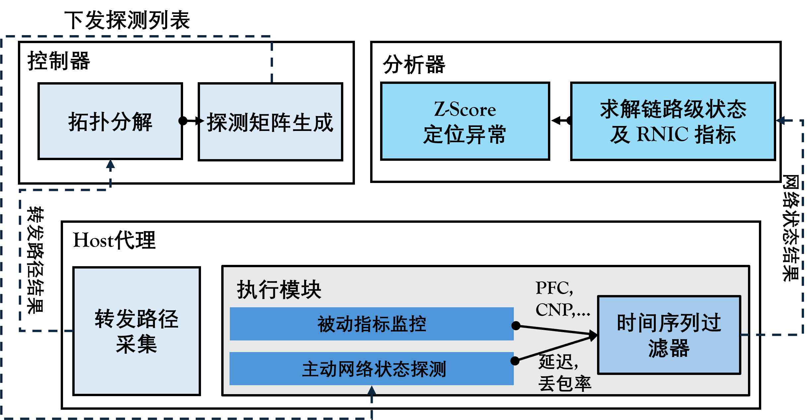
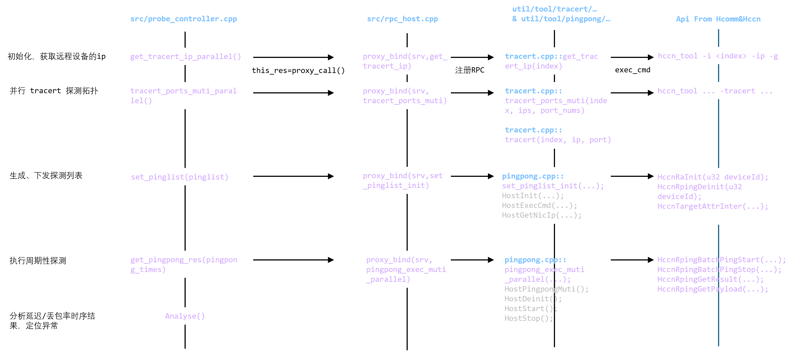

# RFC：集群通信快速亚健康监测

- 起始日期：2026-06-01
- RFC PR编号：002
- 相关Issue：249

## 概要

本RFC提出一种**面向RoCE无损集群的分层分域最小代价网络探测方法**，通过拓扑感知生成最小开销探测矩阵，结合RNIC硬件计数器与自适应异常判定，实现低开销、高精度的网络状态监测与链路级故障定位，为昇腾HCCL提供无侵入、可大规模部署的通信观测能力。

## 背景与动机

- 为什么需要这个功能/修改？

  稳定的高速网络支撑起HCCL的性能表现。链路抖动、拥塞、HOST内瓶颈、配置偏差等问题，会直接引发集合通信长尾、任务降速甚至中断，制约集群稳定性与算力效率。现有监控手段存在探测开销大、依赖丢包、主机内故障误报高等缺陷，无法为HCCL提供低侵入、高精度、链路可识别的网络监测能力。为补齐昇腾生态在大规模集群下的可观测性短板，需构建轻量化、自适应、联合指标增强的网络监测系统。

- 它解决了什么问题？

  **针对复杂网络拓扑的认知问题**，设计了在Spine-Leaf、HammingMesh、3D-Torus等集群拓扑下，自动识别拓扑、和保证最少探测路径数的分层分域探测的功能。

  **针对网络监测指标获取问题**，解决传统探测冗余高、链路不可识别、无法精准获取全链路时延 / 丢包率，缺少RNIC硬件计数器（CNP）分析能力的问题。

  **针对异常分析定位问题**，解决静态阈值误报高、无法准确定位到链路级根因的问题。

  **针对大规模集群的适应问题**，解决大规模集群下单主机/单卡探测压力过大、全链路信息收敛慢、监控系统可扩展性不足的问题。

- 预期的使用场景是什么？

  在昇腾集群大规模分布式训练中，为AllReduce、RingAllReduce等集合通信提供实时网络质量监测。针对**训练时延抖动、迭代速度变慢、吞吐突降、算力利用率不足、通信长尾**等性能衰减问题，实现网络层快速定位。

  面向RoCE网络，对**链路闪断、拥塞、交换机丢包、NPU丢包、hash 碰撞**等异常进行检测与定位。解决无法识别慢故障、故障定位不准等问题。


## 详细设计

### 1. 总体架构

架构设计分两层：`控制层 `为中控设备，用户直接操作。设置ranktable、拓扑发现、编排pinglist、数据聚合、异常诊断（可独立运行）等模块。`Host层 `控制device执行探测、数据上传。依赖hcomm基本通信原语，并行多对多探测。

#### 模块设计



网络监控应先进行拓扑发现，之后支持反复地网络探测。

| 拓扑发现阶段     | 数据内容                                         |
| ---------------- | ------------------------------------------------ |
| 控制层 → Host层  | tracert探测任务列表（源目的ip、端口）            |
| Host层 → 控制层  | tracert路径结果（路径多跳ip列表）                |
| **网络探测阶段** | **数据内容**                                     |
| 控制层 → Host层  | 每个device的PingList（from_ip, to_ip, port_num） |
| Host层 → 控制层  | PingPong 结果（P99 时延、通过率）                |

#### 代码文件结构

> ```json
> disp_probe-master/
> ├── src/                          ### 入口程序 ###
> │   ├── probe_controller.cpp      # 控制层主程序（拓扑、探测、异常定位）
> │   ├── probe_topo.cpp            # 拓扑发现
> │   ├── rpc_host.cpp              # Host层RPC服务，控制节点调用Host侧函数
> │   ├── CMakeLists.txt
> │   ├── util/                     ### 核心功能库 ###
> │   │   ├── topo/                     # 拓扑解析工具
> │   │   │   ├── control_topo.h/cpp    
> │   │   │   ├── mesh_topo.h/cpp       
> │   │   │   ├── mesh.h/cpp           
> │   │   │   └── ranktable_info.h/cpp  # ranktable解析
> │   │   ├── tool/                     # 探测工具
> │   │   │   ├── cmd/
> │   │   │   │   ├── exec_cmd.h/cpp    # Shell命令执行
> │   │   │   │   └── get_IP.h/cpp      # 网卡IP获取
> │   │   │   ├── tracert/
> │   │   │   │   └── tracert.h/cpp     # Tracert路径探测
> │   │   │   └── pingpong/
> │   │   │       ├── rpc_func.h        # PingPong RPC 函数
> │   │   │       └── pingpong_res.h    # PingPong 结果结构
> │   │   ├── helper/                   # 协调模块
> │   │   │   ├── probe_helper.h/cpp    # 核心协调器（拓扑发现、PingList、求解）
> │   │   │   └── probe_test.cpp        # 测试程序
> │   │   ├── rpc_call/                 # RPC通信
> │   │   │   ├── proxy_call.hpp        # RPC代理调用（路由转发）
> │   │   │   ├── proxy_call_paralled.hpp 
> │   │   │   └── rpc_info.h            # RPC 信息定义
> │   │   ├── file_path/                # 路径管理
> │   │   │   └── workspace.h/cpp
> │   │   └── data_struct/              # 数据结构
> │   │       └── c_queue.hpp
> |── pyutil/                   ### python工具库，用于部署控制器和Host代理 ###
> │   ├── ssh_controller.py
> │   ├── ssh_push_controller.py    
> │   └── ...
> ```

#### 源代码交互关系

控制器`src/probe_controller.cpp`通过 `proxy_call()` 请求 Host 进程、并且在控制器侧拿到返回值。

`util/tool/`中定义的操作函数：定义了RNIC行为，由Host进程里的 rpc_server 根据绑定关系调用。

`util/topo/`中的操作函数：定义了维护逻辑拓扑、Pinglist设计、任务下发、结果收集、分析与异常定位等功能，是控制器核心功能的实现代码。



（注：灰色部分为操作函数的子函数）


### 2. 接口设计

#### ControlTopo 控制拓扑管理

控制层支持从 JSON 文件路径加载网络逻辑拓扑，是探测流程的入口，包含端侧节点信息。

```cpp
// util/topo/control_topo.h:129-160
explicit ControlTopo(const json &j);
explicit ControlTopo(const std::string &json_path);
```

路由查询功能。`route_to_device()` 查找设备ID或IP，用于探测根节点到目标设备的完整路由路径。`get_leaf_index()` 提供叶子节点到索引映射，用于数组访问。

```cpp
// util/topo/control_topo.h:167-168
std::vector<std::string> route_to_device(const std::string &device_id_or_ip) const;
int get_leaf_index(const std::string &device_id_or_ip) const;
void set_controller_ip(std::string controller_ip);
```

`leaf_list` 直接暴露所有叶子节点。叶子节点即实际探测节点。上层调用者可方便遍历所有探测节点。无需每次查询。

```cpp
// util/topo/control_topo.h:38
std::vector<std::string> leaf_list;
```

#### MeshTopo 物理拓扑表示

存储Tracert发现的Mesh树状结构。记录各Mesh的父子关系、链路信息。

```cpp
// util/topo/mesh_topo.h:46-49
MeshTopo() = default;
MeshTopo(const ControlTopo &control_topo);
MeshTopo(const json &j);
MeshTopo(const std::string &json_path);
```

JSON序列化/反序列化。用于添加/获取Mesh、Mesh的叶子节点、获取父Mesh。

```cpp
// util/topo/mesh_topo.h:52-66
static MeshTopo from_json(const json &j);
static MeshTopo from_json(const std::string &json_path);
json to_json() const;
void to_json(const std::string &json_path);
void add_mesh(const Mesh &mesh);
Mesh &get_mesh(const std::string &mesh_name);
static std::string get_mesh_name(int level, int index);
static int parse_mesh_name(const std::string &mesh_name);
std::vector<std::string> get_leaf_kids(const Mesh &mesh) const;
std::vector<std::string> get_leaf_kids(const std::string &mesh_name) const;
void add_kid(const std::string &mesh_name, const std::string &kid_name);
std::string get_mesh_father(const std::string &mesh_name) const;
```

`mesh_map` 存储所有Mesh。`mesh_father` 记录 Mesh 父子关系。`root_mesh` 记录根节点名称。

```cpp
// util/topo/mesh_topo.h:40-42
std::map<std::string, Mesh> mesh_map;
std::map<std::string, std::string> mesh_father;
std::string root_mesh;
```

#### ProbeHelper 探测流程协调

核心协调器。串联拓扑发现、PingList 生成、链路测量、结果求解。

`ProbeHelper`接受五个参数：`ControlTopo` 指针、四个RPC回调函数。`get_tracert_ip_parallel` 获取网卡 IP。`tracert_ports_muti_parallel` 并行Tracert。`pinglist_insert_muti_parallel` 插入 PingList。`ud_pingpong_tx_muti_parallel` 节点上批量PingPong。

```cpp
// util/helper/probe_helper.h:59-64
ProbeHelper(
        ControlTopo *ct,
        std::function<std::vector<std::string>(const std::vector<std::string> &)> get_tracert_ip_parallel,
        std::function<std::vector<std::vector<std::vector<std::vector<std::string>>>>(const std::vector<std::string> &, const std::vector<std::vector<std::string>> &, const std::vector<std::vector<int>> &)> tracert_ports_muti_parallel,
        std::function<void(const std::vector<std::string> &, const std::vector<std::vector<std::string>> &, const std::vector<std::vector<int>> &, const std::vector<std::vector<int>> &, const std::vector<int> &)> pinglist_insert_muti_parallel,
        std::function<std::vector<std::vector<std::vector<uint64_t>>>(const std::vector<std::string> &, const std::vector<int> &)> ud_pingpong_tx_muti_parallel);
```

`probe_topo()` 执行拓扑发现。`get_pinglist()` 获取测量任务。`set_pinglist()` 下发测量任务。`get_pingpong_res()` 获取 PingPong 结果。`solve_pingpong_res()` 求解链路时延。

```cpp
// util/helper/probe_helper.h:83-95
// 探测拓扑,初始化类里的所有私有变量
MeshTopo &probe_topo();
void set_mesh_topo(const MeshTopo &meshTopo);
void set_mesh_topo(const json &j);
void set_mesh_topo(const std::string &json_path);
void set_mesh_topo(MeshTopo &meshTopo);
// 获取pinglist:map<mesh_name, task<from, to, portnum>>
std::map<std::string, std::vector<std::tuple<std::string, std::string, int>>> &get_pinglist();
// 设置pinglist到每个节点上
void set_pinglist(const std::map<std::string, std::vector<std::tuple<std::string, std::string, int>>> pinglist);
// 获取tracert结果res:muti_device<tasks<res_vec<uint64_t>>>
std::vector<std::vector<std::vector<u_int64_t>>> get_pingpong_res(int times = 1);
// 求解结果res:link_global_id->link_res
std::vector<float> solve_pingpong_res(const std::vector<std::vector<float>> &pingpong_res, const std::map<std::string, std::vector<std::tuple<std::string, std::string, int>>> &pinglist);
```

#### Device 探测逻辑

Host层是端侧探测执行层。Host监听RPC请求，执行探测命令并上传结果。

完整任务链为：初始化服务 -> 启动服务监听 -> 接收控制层下发的探测任务 -> 执行Pingpong探测/执行ethtool命令-> 返回探测结果。

```cpp
// util/tool/cmd/exec_cmd.h
// util/tool/tracert/tracert.h
HostResult HostInit(uint32_t port, uint32_t maxConnections); //初始化 Host 服务
HostResult HostDeinit();  // 释放Host进程
HostResult HostStart();   // 启动服务监听
HostResult HostStop();    // 停止服务监听

HostResult HostExecCmd(const char *cmd, char *output, size_t outputSize, int32_t *exitCode);   // 执行Shell命令
HostResult HostGetNicIp(int32_t index, char *ip, size_t ipSize);  // 获取网卡IP
HostResult HostPingpongMuti(int32_t index, const char *dstIp, int32_t port, char path[128][64], int32_t *pathLen);
```


### 3. 数据结构

`disp_probe` 使用 JSON 配置文件描述控制拓扑和访问信息。

**模板**：

```json
{
    "default_ssh_port": 22,
    "host_to_user_pair": {
        "ip": {
            "user": "&lt;password&gt;"
        }
    },
    "control_topo": {
        "&lt;node_id&gt;": ["&lt;node_id&gt;", "&lt;node_id&gt;"]
    },
    "to_path": "~/disp_probe",
    "from_path": "."
}
```

**示例**：

```json
{
    "default_ssh_port": 22,
    "host_to_user_pair": {
        "10.90.15.67": {"root": "HCCL@Helper2023"},
        "10.90.15.69": {"root": "HCCL@Helper2023"}
    },
    "control_topo": {
        "10.90.15.67": ["1-2", "4", "6-7"],
        "10.90.15.69": "0-7"
    },
    "controller": {"10.90.15.67": ""},
    "to_path": "~/xdu_test/disp_probe",
    "from_path": "."
}
```

**字段说明**：

| 字段 | 类型 | 说明 |
|------|------|------|
| `default_ssh_port` | int | 默认 SSH 端口 |
| `host_to_user_pair` | object | 主机到用户名/密码映射 |
| `control_topo` | object | 控制拓扑，key 是父节点，value 是子节点列表 |
| `to_path` | string | 远程部署路径 |
| `from_path` | string | 本地源路径 |

**注意**：`control_topo` 的值支持两种格式：
- 数组：`["1-2", "4", "6-7"]` - 混合范围和单个节点
- 字符串：`"0-7"` - 范围表示，会自动展开成连续的节点 ID

` Host层`定义了探测数据输入输出的数据结构，用于网卡 IP 获取、Shell 命令执行、Tracert 路径探测等网络探测功能的参数传递。

```cpp
// 初始化配置
typedef struct HostInitConfig {
    uint32_t port;           // 监听端口
    uint32_t maxConnections; // 最大并发连接数
} HostInitConfig;

// 命令执行输入
typedef struct HostCmdInput {
    char cmd[4096]; // Shell 命令
} HostCmdInput;

// 命令执行输出
typedef struct HostCmdOutput {
    char output[8192]; // 标准输出
    int32_t exitCode;   // 退出码
} HostCmdOutput;

// Pingpong输入
typedef struct HostPingpongInput {
    int32_t index;   // 网卡索引
    char dstIp[64]; // 目标 IP
    int32_t port;    // 目标端口
} HostTracertInput;

// Pingpong输出
typedef struct HostPingpongOutput {
    char res[128][64]; // 探测延迟/丢包
} HostTracertOutput;

// IP获取输入
typedef struct HostGetIpInput {
    int32_t index; // 网卡索引
} HostGetIpInput;

// IP获取输出
typedef struct HostGetIpOutput {
    char ip[64]; // 网卡 IP
} HostGetIpOutput;
```

---


### 4. 关键逻辑

#### 最小开销探测

探测计划不能简单增加probe数量，需要确保求解过程中链路可分辨。控制层用少量路径测量恢复可用的拓扑骨架，这一点区别于全量探测。随后只在已经识别出的局部拓扑展开完整探测。

Failleaper采用如下探测策略：

1. **拓扑发现阶段**`gen_topo()`：先对相邻节点进行少量 Tracert 探测，识别网络层级和Mesh拓扑结构。
2. **Mesh 内全网格探测**`mesh_full_trace()`：在每个识别出的 Mesh 区域内部，对其叶子节点进行全网格探测，以获取链路信息。
3. **PingList 生成**`gen_pinglist()`：基于识别出的拓扑，只在必要的链路上生成探测任务，大幅减少探测。

#### 链路时延/丢包率求解

分析器基于路径结果反推链路（网络中直连的两个设备之间的链路）延迟/丢包。输入是路径级测量值，输出是链路级测量值。

求解按 Mesh 分块进行。已经求出的链路值会先从后续观测中扣除，只把剩余未知链路放进当前局部方程组。`solve_equation()`使用Eigen的`BDCSVD`计算最小二乘解。

#### 自适应快速故障定位算法-时空交叉分析

主动监测收集关键网络信号后，应用Z-score分析来比较链路和节点随时间的延迟以及拓扑层的延迟。


### 5. 兼容性考虑

- 是否影响向后兼容？

  不影响，作为独立监控工具使用，依赖hcomm基本通信接口。

- 是否需要特性开关？

  可添加。

- 灰度发布策略是什么？

  先在小规模集群测试，确认无问题后，再作为实验特性发布。


### 6. 测试方案

基于昇腾环境，在如下场景下运行性能探测功能。

测试1：`拓扑探测功能`，基于ranktable文件识别通信域中的各个节点，识别网络后导出拓扑信息文件。

测试2：`探测性能`，spine-leaf拓扑下，测试监控系统一轮探测用时、数据收集用时、及对HCCL算子的影响。

测试3：`集群故障定位功能`，添加集合通信算子作为背景流，并构造NPU端口丢包、现网拥塞等用例，测试定位准确率。


## 风险评估

昇腾NPU集群traffic_tc/dscp的设置只对源设备生效，目的端返回时的TC/dscp无法修改（为0），可能产生异常丢包以及时延无法正确侧测量。

## 替代方案

描述考虑过的其他方案及其优缺点。
现有方案有依赖eBPF向交换机发送Traceourte命令，但该方法需要在RDMA接口处陷入内核态，当前环境下可能不被支持。


## 开放问题

昇腾NPU集群traffic_tc/dscp的设置只对源设备生效，目的端返回时的TC/dscp无法修改（为0），仍需向昇腾社区提交issue。

## 评审记录

评审过程在PR评论区进行，详细评审意见请参阅对应的PR评论。
