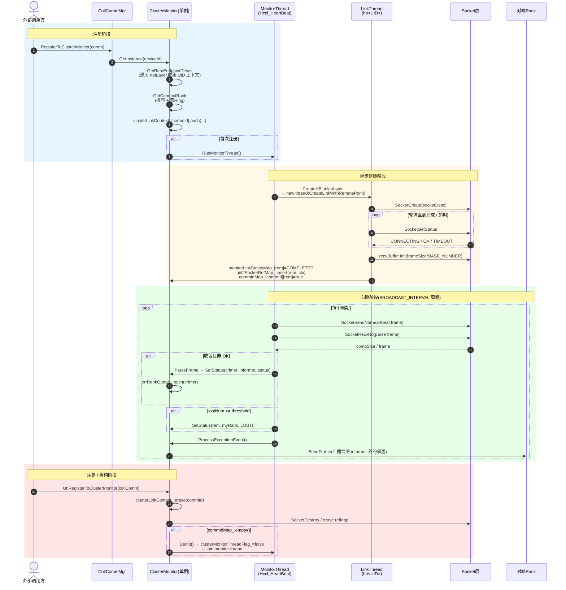
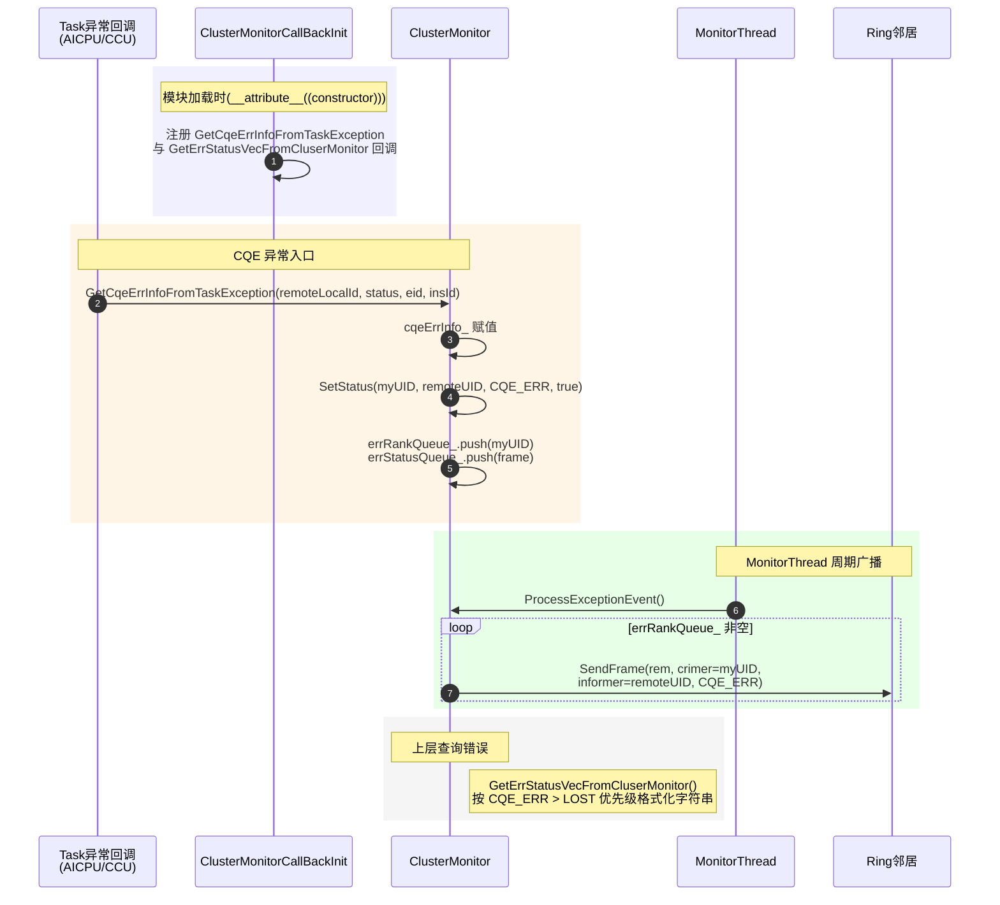

# ClusterMonitor集群心跳检测功能说明

---

## 功能描述

`ClusterMonitor` 是HCCL（华为集合通信库）在 `coll_communicator_mgr/dfx` 路径下的集群级心跳监控模块，主要用于 **在集合通信域（Communicator）建立后，对所有参与节点进行可达性与存活状态的持续探测和异常扩散**。

核心能力包括：

1. **节点UID标识**：将每个Rank通过 `netInstId + localId` 编码为唯一的 `ClusterUIDType`（最大2048字节），用于跨层（device / server / pod / superPod）标识节点。
2. **双Ring建链**：在每个 `netLayer` 平面内，对节点按 `localId` 或 `netInstId` 排序后构成Ring拓扑；每个Rank与环上"左手"和"右手"两个邻居建立心跳socket连接（仅2个节点时只连一个邻居）。
3. **异步建链**：每个远端UID启动独立线程 `CreateLinkWithRemotePonit` 进行 `SocketCreate` + 状态轮询，受 `HCCL_CONNECT_TIMEOUT` 控制超时。
4. **周期心跳收发**：后台 `MonitorThread` 以 `BROADCAST_INTERVAL` 周期遍历所有socket，先 `SocketSendNb` 发心跳再 `SocketRecvNb` 收心跳；每 `HEARTBEAT_COUNT` 个周期累加 `lostNum`，达到 `HCCL_LOST_THRESHOLD`（30s）即判定 `LOST`。
5. **异常状态传播**：节点 `LOST` 或 `CQE_ERR` 状态通过Ring链路向其他邻居广播（`SetStatus` → `errRankQueue_` → `ProcessExceptionEvent` → `SendFrame`）。
6. **错误信息上抛**：通过 `__attribute__((constructor))` 注册的 `GetCqeErrInfoFromTaskException` 回调，将AICPU/CCU任务的CQE错误归集到 `cqeErrInfo_`，并以 `SetStatus(..., CLUSTER_MONITOR_CQE_ERR, true)` 触发广播；查询接口 `GetErrStatusVecFromCluserMonitor` 按优先级（CQE_ERR > LOST）格式化错误描述返回给上层。

模块整体属于DFX（Design For X）范畴，是HCCL在集群级提供"网络断连 / 对端CoreDump"可观测性的关键组件。

---

## 目录描述

```text
cluster_monitor/
├── CMakeLists.txt          # 构建脚本，仅将 cluster_monitor.cc 加入 hcomm 目标
├── cluster_monitor.h       # 类与数据结构定义（ClusterMonitor、Frame、SockCtx、UID 等）
└── cluster_monitor.cc      # 模块实现，包含心跳主线程、异步建链、收发帧、异常处理
```

**目录特征**：

- 位于 `coll_communicator_mgr/dfx/`，隶属DFX监控类功能；
- 模块自治：单例（`GetInstance(u32 deviceId)`），不依赖目录内其它文件；
- 依赖外部：`ring_buffer`、`reference_map`、`hcclCommSocket`、`hccl_communicator`、`hcclCommDfx`、`coll_comm`、`log`、`comm_addr_logger` 等。

---

## 流程描述（Mermaid时序图）

### 整体注册 / 建链 / 心跳 / 注销主流程



### CQE异常上抛与广播时序



---

## 数据描述（Mermaid类图）

```mermaid
classDiagram
    direction LR

    %% ===== 枚举与辅助 =====
    class ClusterMonitorStatus {
        <<enum>>
        CLUSTER_MONITOR_OK
        CLUSTER_MONITOR_LOST
        CLUSTER_MONITOR_NOTIFY
        CLUSTER_MONITOR_CQE_ERR
        CLUSTER_MONITOR_OPRETRY_NOT_SUPPORT
        CLUSTER_MONITOR_STUCK
        CLUSTER_MONITOR_INCONSISTENT
    }

    class MonitorLinkStatus {
        <<enum>>
        MONITOR_LINK_NOT_START
        MONITOR_LINK_BUILDING
        MONITOR_LINK_COMPLETED
    }

    %% ===== UID 标识 =====
    class HcclClusterMonitorUID {
        +char id[2048]
        +operator==()
        +operator!=()
        +operator<()
    }

    class ClusterUIDCxt {
        +string netInstId
        +uint32_t localId
    }

    class UIDContext {
        +ClusterUIDType uid
        +uint32_t netLayer
        +uint32_t rankId
        +uint32_t localId
        +string netInstId
    }

    %% ===== 帧与 Socket =====
    class ClusterMonitorFrame {
        +ClusterUIDType src
        +ClusterUIDType dst
        +ClusterUIDType crimer
        +ClusterUIDType informer
        +ClusterMonitorStatus status
        +HcclUs TOARelative
        +HcclSystemTime TOASystem
        +char reserved[256]
    }

    class ClusterMonitorSocketCtx {
        +SocketDesc socketDesc
        +SocketHandle socketHandler
        +queue~ClusterMonitorFrame~ sendBuffer
        +u32 restSize
        +RingBuffer recvBuffer
        +u32 lostNum
        +bool newConn
    }

    class ErrorCqeInfo {
        +u32 cqeLocalId
        +u32 cqeRemoteLocalId
        +uint16_t cqeStatus
        +string cqeLocalEid
        +string cqeRemoteEid
        +string cqeRemoteInsId
        +string cqeLocalInsId
    }

    %% ===== FrameStatus(嵌套) =====
    class FrameStatus {
        +ClusterMonitorStatus status
        +ClusterUIDType informer
        +bool needBroadcast
    }

    %% ===== ClusterMonitor 类 =====
    class ClusterMonitor {
        +RegisterToClusterMonitor(comm)
        +UnRegisterToClusterMonitor(collComm)
        +FormatUID(ClusterUIDCxt)
        +GetUID(const ClusterUIDType&)
        +FormatConnTag(role, uidPair)
        +InsertClusterMonitorCxt(comm, remoteCtx, needConnectRank)
        +GetSamePlaneRank(comm, singlePlaneCtx, needConnectRank)
        +GetConnectRank(comm, needConnectRank, uidCtxs, netLayersVector)
        +CreateHBLinksAsync()
        +SetStatus(crimer, informer, status, needBroadcast)
        +MonitorThread()
        +RunMonitorThread()
        +SendFrame(dst, crimer, informer, status)
        +RecvFrame(rem)
        +ParseFrame(cmFrame, src)
        +DelErrorSocket()
        +ProcessExceptionEvent()
        +DeInit()
        +GetInstance(deviceId)$ static
        +GetCqeErrInfoFromTaskException(remoteLocalId, status, localEid, remoteEid, remoteInsId)
        +GetErrStatusVecFromCluserMonitor()
        +PrintEvents(keyEvents)
        +MakeErrMsg(keyEvents, errStatusVec)
        -GetRemEndpointDescs(comm, uidCtxs, netLayersVector)
        -GetRemEndpointDescsPerLayer(netLayer, comm, rankGraph, collComm, uidCtxs, rankIdsSet)
        -CreateTransportHandle(info)
        -CreateLinkWithRemotePonit(group, rem, ctx)
        -uid2SocketRefMap_ ReferenceMap~ClusterUIDType,ClusterMonitorSocketCtx~
        -uid2FrameStatusMap_ ReferenceMap~ClusterUIDType,FrameStatus~
        -monitorLinkStatusMap_ map~ClusterUIDType,MonitorLinkStatus~
        -commIdMap_ map~string, map~ClusterUIDType,bool~~
        -clusterLinkContext_ map~string, queue~pair~
        -linkThreadMap_ map~ClusterUIDType, thread~
        -errRankQueue_ queue~ClusterUIDType~
        -errStatusQueue_ queue~ClusterMonitorFrame~
        -cqeErrInfo_ ErrorCqeInfo
    }

    %% ===== 关系 =====
    ClusterMonitorFrame --> HcclClusterMonitorUID : src/dst/crimer/informer
    ClusterMonitorFrame --> ClusterMonitorStatus : status
    ClusterMonitorSocketCtx --> ClusterMonitorFrame : sendBuffer
    UIDContext --> HcclClusterMonitorUID : uid
    HcclClusterMonitorUID ..> ClusterUIDCxt : 由其构造
    FrameStatus --> ClusterMonitorStatus : status

    ClusterMonitor "1" o-- "*" FrameStatus : uid2FrameStatusMap_
    ClusterMonitor "1" o-- "*" ClusterMonitorSocketCtx : uid2SocketRefMap_
    ClusterMonitor "1" o-- "*" MonitorLinkStatus : monitorLinkStatusMap_
    ClusterMonitor "1" o-- "*" HcclClusterMonitorUID : commIdMap_/clusterLinkContext_/linkThreadMap_
    ClusterMonitor "1" o-- "*" ClusterMonitorFrame : errStatusQueue_
    ClusterMonitor "1" *-- "1" ErrorCqeInfo : cqeErrInfo_
    ClusterMonitor ..> MonitorLinkStatus : 嵌套枚举
    ClusterMonitor ..> FrameStatus : 嵌套结构
```



---

## 接口描述

### 公共API（对外）

| 接口 | 说明 |
|------|------|
| `static ClusterMonitor& GetInstance(u32 deviceId)` | 按device取模块单例（通过 `CollCommMgr` 间接持有）。 |
| `HcclResult RegisterToClusterMonitor(HcclComm comm)` | 注册一个通信域：建立UID上下文、计算Ring待连接集合、推入 `clusterLinkContext_` 等待后台建链；首次注册会启动 `MonitorThread`。 |
| `HcclResult UnRegisterToClusterMonitor(hccl::CollComm* collComm)` | 注销一个通信域：清空该commId在 `clusterLinkContext_`、`commIdMap_`、`monitorLinkStatusMap_`、`uid2SocketRefMap_` 中的引用计数；最后一个commId注销时触发 `DeInit`。 |
| `void GetCqeErrInfoFromTaskException(u32 remoteLocalId, uint16_t status, std::string localEid, std::string remoteEid, std::string remoteInsId)` | 由AICPU/CCU CQE错误回调调用，记录CQE错误并以广播形式扩散。 |
| `std::vector<std::string> GetErrStatusVecFromCluserMonitor()` | 排空 `errStatusQueue_`，按优先级（CQE_ERR > LOST）格式化错误描述，供上层查询。 |
| `HcclResult RunMonitorThread()` | 显式启动后台心跳线程（`MonitorThread`）。 |
| `HcclResult DeInit()` | 停止心跳线程、销毁socket、清理所有内部容器；幂等。 |
| `void SetStatus(crimer, informer, status, needBroadcast=true)` | 设置 / 更新某节点的状态，必要时压入 `errRankQueue_` 触发广播。 |
| `ClusterUIDType FormatUID(ClusterUIDCxt cxt)` | 用 `netInstId/localId` 拼装UID。 |
| `std::string FormatConnTag(role, uidPair)` | 生成形如 `HeartBeat_<src>_to_<dst>` 的socket tag。 |

### 内部 / 私有接口

| 接口 | 说明 |
|------|------|
| `GetRemEndpointDescs / GetRemEndpointDescsPerLayer` | 从 `RankGraph` 枚举各 `netLayer` 全部rank，生成 `UIDContext`，初始化 `uid2FrameStatusMap_`、`commIdMap_`。 |
| `InsertClusterMonitorCxt` | 给定对端UID，查询RankGraph得到link、devicePort，决策SERVER/CLIENT角色并构造 `SocketDesc`。 |
| `GetSamePlaneRank` | 同一平面按Ring拓扑选出左右邻居（size==2时仅一个邻居）。 |
| `GetConnectRank` | 合并netLayer=0平面（按 `localId` 排序）与 `>=1` 平面（按 `netInstId` 排序），分别成环。 |
| `CreateHBLinksAsync` | 后台线程入口，遍历 `clusterLinkContext_` 为每个remUID启动 / 重启独立建链线程。 |
| `CreateLinkWithRemotePonit` | 单个remUID的建链线程入口：`SocketCreate` → 轮询 `SocketGetStatus` → 初始化 `recvBuffer` → 注册到 `uid2SocketRefMap_`。 |
| `CreateTransportHandle` | 包装 `SocketCreate`，避免重复创建。 |
| `SendFrame` / `RecvFrame` / `ParseFrame` | 心跳帧的非阻塞发送（含部分发送续传）、非阻塞接收（含环形缓冲区）、合法性校验与状态更新。 |
| `MonitorThread` | 后台主循环：`CreateHBLinksAsync` → 每 `HEARTBEAT_COUNT` 周期发心跳 + 累加 `lostNum` → 收心跳 → 处理 `lostNum` 超阈 → `ProcessExceptionEvent`。 |
| `DelErrorSocket` | 销毁 `errorSocket_` 中标记为异常的socket。 |
| `ProcessExceptionEvent` | 消费 `errRankQueue_`，对所有"非informer且状态OK"的邻居广播异常帧。 |
| `PrintEvents / MakeErrMsg` | 把 `ClusterMonitorFrame` 队列格式化为可读字符串向量。 |

### 跨模块回调注册（`__attribute__((constructor))`）

```cpp
ClusterMonitorCallBackInit() {
    RegisterGetAicpuCqeErrInfoCallBackHcomm(GetCqeErrInfoFromTaskException);
    RegisterGetCcuCqeErrInfoCallBackHcomm(GetCqeErrInfoFromTaskException);
    RegisterAicpuGetErrStatusVecCallBack(GetErrStatusVecFromCluserMonitor);
    RegisterCcuGetErrStatusVecCallBack(GetErrStatusVecFromCluserMonitor);
}
```

模块在加载时即向AICPU/CCU框架注册两个回调：**异常入口**（错误上抛）和 **错误查询**（错误格式化导出），是模块与上层Task异常系统的唯一耦合点。

---

## 使用限制（支持场景与约束规格）

### 支持场景

1. **多Rank通信域**：rankSize >= 2的通信域；rankSize == 1时 `RegisterToClusterMonitor` 直接返回 `HCCL_SUCCESS` 并打 `WARNING`，不会建链。
2. **多平面拓扑**：支持 `netLayer = 0`（同server/device内，按 `localId` 排序）与 `netLayer >= 1`（跨server/pod/superPod，按 `netInstId` 排序）的双Ring建链。
3. **跨通信域共享socket**：通过 `hccl::ReferenceMap` 计数，多个通信域连接同一远端时只创建一份socket；注销时引用计数 `--`，归零才真正销毁。
4. **环形故障传播**：单点 `LOST` / `CQE_ERR` 状态可沿Ring链路向其他节点扩散，便于在任意节点上查询到全集群异常。
5. **CQE错误捕获**：通过AICPU/CCU回调接收 `Task` 异常，格式化为带本地 / 远端 `instanceId / localId / Eid` 的可读日志。
6. **可关闭开关**：通过环境变量 `HCCL_DFS_CONFIG.cluster_heartbeat` 关闭心跳注册 / CQE错误捕获链路。
7. **HCCL v2通信域**：依赖 `HcclCommunicator::GetRankGraphV2` 与 `RankGraph`，仅当 `CommunicatorV2` 存在时生效；否则在 `GetRemEndpointDescs` 中 `CHK_PTR_NULL` 失败。

### 约束规格

| 类别 | 约束 |
|------|------|
| **线程模型** | 1个 `MonitorThread`（Hccl_HeartBeat）+ N个 `LinkThread`（hb<UID>）；`threadLock_` 保护 `commIdMap_ / uid2SocketRefMap_ / uid2FrameStatusMap_ / monitorLinkStatusMap_ / errRankQueue_ / errStatusQueue_`；`clusertMonitorLinkMtx_` 保护 `clusterLinkContext_`。 |
| **生命周期** | 模块单例随 `CollCommMgr` 持有；`DeInit` 由最后一个commId注销或 `~ClusterMonitor` 触发，幂等（`isDeInit_` 守护）。 |
| **超时控制** | 建链超时取自 `EnvConfig::GetSocketConfig().GetLinkTimeOut()`（即 `HCCL_CONNECT_TIMEOUT`）；心跳丢失阈值 `lostThreshold_ = HCCL_LOST_THRESHOLD`（30s）。 |
| **端口合法性** | `devicePort` / `rmtPort` 必须 `<= Hccl::MAX_VALUE_TCPPORT`，否则返回 `HCCL_E_PARA`。 |
| **帧大小** | `ClusterMonitorFrame` 含4个2048字节UID + 状态 + 双时间戳 + 256字节预留，总长固定（`sizeof(ClusterMonitorFrame)`）；`recvBuffer.Init` 容量为 `BASE_NUMBER * frameSize`（约2倍）。 |
| **UID长度** | `HcclClusterMonitorUID.id` 固定2048字节，要求 `netInstId + "/" + localId` 不超过2048字节。 |
| **角色决策** | SERVER/CLIENT由 `localIpAddr < remoteIpAddr` 决定；本地为SERVER时填本地 `listenPort`，否则填对端 `rmtPort`，需与SocketConfig中监听方策略一致。 |
| **广播策略** | `ProcessExceptionEvent` 仅向 "`rem != informer` 且 `status == OK`" 的邻居广播，避免回环风暴；非OK邻居已自感知。 |
| **状态优先级** | 错误查询顺序：CQE_ERR > LOST（`PrintEvents` 内调用顺序）。 |
| **设备范围** | 仅按device维护单例；多device场景下每个device独立心跳，互不影响。 |
| **平台依赖** | 依赖 `HcclCommunicator`（v2）、`RankGraph`、Socket抽象层（`SocketCreate/SendNb/RecvNb/GetStatus/Destroy`）；v1 communicator路径不受支持。 |
| **环境开关** | `clusterHeartBeatEnable = false` 时，注册阶段不发起新socket（保留commIdMap_标记），CQE错误回调直接 `return`。 |
| **错误传播路径** | 异常帧通过Ring链路逐步扩散，传播延迟 ≈ `BROADCAST_INTERVAL` × Ring跳数；非即时同步。 |
| **资源释放** | `DeInit` / `UnRegister` 中均会 `SocketDestroy` 并清空引用映射；多次调用安全（`isDeInit_` 守护、`while(uid2SocketRefMap_.erase(rem)) {}` 自旋）。 |

---
