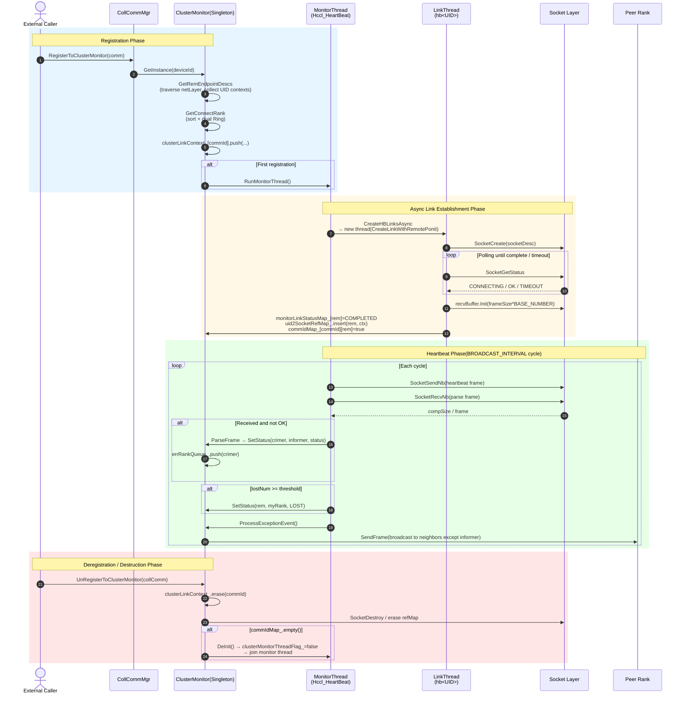
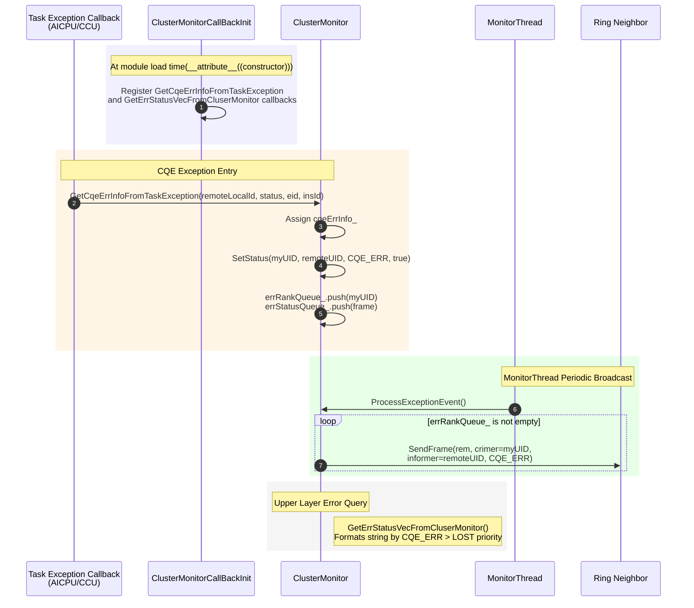

# ClusterMonitor Cluster Heartbeat Detection Function Description

---

## Function Description

`ClusterMonitor` is the cluster-level heartbeat monitoring module of HCCL (Huawei Collective Communication Library) under the `coll_communicator_mgr/dfx` path, mainly used for **continuous detection of reachability and liveness of all participating nodes and abnormal propagation after the establishment of a collective communication domain (Communicator)**.

Core capabilities include:

1. **Node UID identification**: Each Rank is encoded as a unique `ClusterUIDType` (up to 2048 bytes) via `netInstId + localId`, used for cross-layer (device / server / pod / superPod) node identification.
2. **Dual Ring link establishment**: Within each `netLayer` plane, nodes are sorted by `localId` or `netInstId` to form a Ring topology; each Rank establishes heartbeat socket connections with the "left" and "right" neighbors on the ring (only one neighbor when there are only 2 nodes).
3. **Async link establishment**: Each remote UID starts an independent thread `CreateLinkWithRemotePonit` for `SocketCreate` + status polling, controlled by `HCCL_CONNECT_TIMEOUT`.
4. **Periodic heartbeat send/receive**: The background `MonitorThread` traverses all sockets at `BROADCAST_INTERVAL` intervals, first `SocketSendNb` to send heartbeats then `SocketRecvNb` to receive heartbeats; `lostNum` accumulates every `HEARTBEAT_COUNT` cycles, and when `HCCL_LOST_THRESHOLD` (30s) is reached, the status is determined as `LOST`.
5. **Abnormal status propagation**: Node `LOST` or `CQE_ERR` status is broadcast to other neighbors via the Ring link (`SetStatus` → `errRankQueue_` → `ProcessExceptionEvent` → `SendFrame`).
6. **Error information reporting**: Through the `GetCqeErrInfoFromTaskException` callback registered via `__attribute__((constructor))`, CQE errors from AICPU/CCU tasks are collected into `cqeErrInfo_`, and triggered via `SetStatus(..., CLUSTER_MONITOR_CQE_ERR, true)` to broadcast; the query interface `GetErrStatusVecFromCluserMonitor` formats error descriptions by priority (CQE_ERR > LOST) and returns them to the upper layer.

The module belongs to the DFX (Design For X) category and is a key component of HCCL for providing "network disconnection / peer CoreDump" observability at the cluster level.

---

## Directory Description

```text
cluster_monitor/
├── CMakeLists.txt          # Build script, only adds cluster_monitor.cc to the hcomm target
├── cluster_monitor.h       # Class and data structure definitions (ClusterMonitor, Frame, SockCtx, UID, etc.)
└── cluster_monitor.cc      # Module implementation, including heartbeat main thread, async link establishment, frame send/receive, exception handling
```

**Directory features**:

- Located in `coll_communicator_mgr/dfx/`, belongs to DFX monitoring functionality;
- Module autonomous: singleton (`GetInstance(u32 deviceId)`), does not depend on other files in the directory;
- External dependencies: `ring_buffer`, `reference_map`, `hcclCommSocket`, `hccl_communicator`, `hcclCommDfx`, `coll_comm`, `log`, `comm_addr_logger`, etc.

---

## Flow Description (Mermaid Sequence Diagram)

### Overall Registration / Link Establishment / Heartbeat / Deregistration Main Flow



### CQE Exception Reporting and Broadcast Sequence



---

## Data Description (Mermaid Class Diagram)

```mermaid
classDiagram
    direction LR

    %% ===== Enums and Helpers =====
    class ClusterMonitorStatus {
        <<enum>>
        CLUSTER_MONITOR_OK
        CLUSTER_MONITOR_LOST
        CLUSTER_MONITOR_NOTIFY
        CLUSTER_MONITOR_CQE_ERR
        CLUSTER_MONITOR_OPRETRY_NOT_SUPPORT
        CLUSTER_MONITOR_STUCK
        CLUSTER_MONITOR_INCONSISTENT
    }

    class MonitorLinkStatus {
        <<enum>>
        MONITOR_LINK_NOT_START
        MONITOR_LINK_BUILDING
        MONITOR_LINK_COMPLETED
    }

    %% ===== UID Identification =====
    class HcclClusterMonitorUID {
        +char id[2048]
        +operator==()
        +operator!=()
        +operator<()
    }

    class ClusterUIDCxt {
        +string netInstId
        +uint32_t localId
    }

    class UIDContext {
        +ClusterUIDType uid
        +uint32_t netLayer
        +uint32_t rankId
        +uint32_t localId
        +string netInstId
    }

    %% ===== Frame and Socket =====
    class ClusterMonitorFrame {
        +ClusterUIDType src
        +ClusterUIDType dst
        +ClusterUIDType crimer
        +ClusterUIDType informer
        +ClusterMonitorStatus status
        +HcclUs TOARelative
        +HcclSystemTime TOASystem
        +char reserved[256]
    }

    class ClusterMonitorSocketCtx {
        +SocketDesc socketDesc
        +SocketHandle socketHandler
        +queue~ClusterMonitorFrame~ sendBuffer
        +u32 restSize
        +RingBuffer recvBuffer
        +u32 lostNum
        +bool newConn
    }

    class ErrorCqeInfo {
        +u32 cqeLocalId
        +u32 cqeRemoteLocalId
        +uint16_t cqeStatus
        +string cqeLocalEid
        +string cqeRemoteEid
        +string cqeRemoteInsId
        +string cqeLocalInsId
    }

    %% ===== FrameStatus(nested) =====
    class FrameStatus {
        +ClusterMonitorStatus status
        +ClusterUIDType informer
        +bool needBroadcast
    }

    %% ===== ClusterMonitor Class =====
    class ClusterMonitor {
        +RegisterToClusterMonitor(comm)
        +UnRegisterToClusterMonitor(collComm)
        +FormatUID(ClusterUIDCxt)
        +GetUID(const ClusterUIDType&)
        +FormatConnTag(role, uidPair)
        +InsertClusterMonitorCxt(comm, remoteCtx, needConnectRank)
        +GetSamePlaneRank(comm, singlePlaneCtx, needConnectRank)
        +GetConnectRank(comm, needConnectRank, uidCtxs, netLayersVector)
        +CreateHBLinksAsync()
        +SetStatus(crimer, informer, status, needBroadcast)
        +MonitorThread()
        +RunMonitorThread()
        +SendFrame(dst, crimer, informer, status)
        +RecvFrame(rem)
        +ParseFrame(cmFrame, src)
        +DelErrorSocket()
        +ProcessExceptionEvent()
        +DeInit()
        +GetInstance(deviceId)$ static
        +GetCqeErrInfoFromTaskException(remoteLocalId, status, localEid, remoteEid, remoteInsId)
        +GetErrStatusVecFromCluserMonitor()
        +PrintEvents(keyEvents)
        +MakeErrMsg(keyEvents, errStatusVec)
        -GetRemEndpointDescs(comm, uidCtxs, netLayersVector)
        -GetRemEndpointDescsPerLayer(netLayer, comm, rankGraph, collComm, uidCtxs, rankIdsSet)
        -CreateTransportHandle(info)
        -CreateLinkWithRemotePonit(group, rem, ctx)
        -uid2SocketRefMap_ ReferenceMap~ClusterUIDType,ClusterMonitorSocketCtx~
        -uid2FrameStatusMap_ ReferenceMap~ClusterUIDType,FrameStatus~
        -monitorLinkStatusMap_ map~ClusterUIDType,MonitorLinkStatus~
        -commIdMap_ map~string, map~ClusterUIDType,bool~~
        -clusterLinkContext_ map~string, queue~pair~
        -linkThreadMap_ map~ClusterUIDType, thread~
        -errRankQueue_ queue~ClusterUIDType~
        -errStatusQueue_ queue~ClusterMonitorFrame~
        -cqeErrInfo_ ErrorCqeInfo
    }

    %% ===== Relationships =====
    ClusterMonitorFrame --> HcclClusterMonitorUID : src/dst/crimer/informer
    ClusterMonitorFrame --> ClusterMonitorStatus : status
    ClusterMonitorSocketCtx --> ClusterMonitorFrame : sendBuffer
    UIDContext --> HcclClusterMonitorUID : uid
    HcclClusterMonitorUID ..> ClusterUIDCxt : constructed from
    FrameStatus --> ClusterMonitorStatus : status

    ClusterMonitor "1" o-- "*" FrameStatus : uid2FrameStatusMap_
    ClusterMonitor "1" o-- "*" ClusterMonitorSocketCtx : uid2SocketRefMap_
    ClusterMonitor "1" o-- "*" MonitorLinkStatus : monitorLinkStatusMap_
    ClusterMonitor "1" o-- "*" HcclClusterMonitorUID : commIdMap_/clusterLinkContext_/linkThreadMap_
    ClusterMonitor "1" o-- "*" ClusterMonitorFrame : errStatusQueue_
    ClusterMonitor "1" *-- "1" ErrorCqeInfo : cqeErrInfo_
    ClusterMonitor ..> MonitorLinkStatus : nested enum
    ClusterMonitor ..> FrameStatus : nested struct
```



---

## Interface Description

### Public API (External)

| Interface | Description |
|------|------|
| `static ClusterMonitor& GetInstance(u32 deviceId)` | Get module singleton by device (held indirectly via `CollCommMgr`). |
| `HcclResult RegisterToClusterMonitor(HcclComm comm)` | Register a communicator: build UID context, calculate Ring connection set, push into `clusterLinkContext_` waiting for background link establishment; first registration starts `MonitorThread`. |
| `HcclResult UnRegisterToClusterMonitor(hccl::CollComm* collComm)` | Deregister a communicator: clear reference counts for that commId in `clusterLinkContext_`, `commIdMap_`, `monitorLinkStatusMap_`, `uid2SocketRefMap_`; triggers `DeInit` when the last commId is deregistered. |
| `void GetCqeErrInfoFromTaskException(u32 remoteLocalId, uint16_t status, std::string localEid, std::string remoteEid, std::string remoteInsId)` | Called by the AICPU/CCU CQE error callback, records CQE errors and propagates them via broadcast. |
| `std::vector<std::string> GetErrStatusVecFromCluserMonitor()` | Drain `errStatusQueue_`, format error descriptions by priority (CQE_ERR > LOST), for upper layer queries. |
| `HcclResult RunMonitorThread()` | Explicitly start the background heartbeat thread (`MonitorThread`). |
| `HcclResult DeInit()` | Stop the heartbeat thread, destroy sockets, clean up all internal containers; idempotent. |
| `void SetStatus(crimer, informer, status, needBroadcast=true)` | Set / update a node's status, push into `errRankQueue_` if broadcast is needed. |
| `ClusterUIDType FormatUID(ClusterUIDCxt cxt)` | Assemble UID using `netInstId/localId`. |
| `std::string FormatConnTag(role, uidPair)` | Generate a socket tag in the format `HeartBeat_<src>_to_<dst>`. |

### Internal / Private Interfaces

| Interface | Description |
|------|------|
| `GetRemEndpointDescs / GetRemEndpointDescsPerLayer` | Enumerate all ranks in each `netLayer` from `RankGraph`, generate `UIDContext`, initialize `uid2FrameStatusMap_`, `commIdMap_`. |
| `InsertClusterMonitorCxt` | Given a peer UID, query RankGraph to obtain link and devicePort, decide SERVER/CLIENT role and construct `SocketDesc`. |
| `GetSamePlaneRank` | Select left and right neighbors within the same plane according to Ring topology (only one neighbor when size==2). |
| `GetConnectRank` | Merge netLayer=0 plane (sorted by `localId`) with `>=1` plane (sorted by `netInstId`), form rings respectively. |
| `CreateHBLinksAsync` | Background thread entry, traverse `clusterLinkContext_` to start / restart independent link establishment threads for each remUID. |
| `CreateLinkWithRemotePonit` | Link establishment thread entry for a single remUID: `SocketCreate` → poll `SocketGetStatus` → initialize `recvBuffer` → register into `uid2SocketRefMap_`. |
| `CreateTransportHandle` | Wrap `SocketCreate` to avoid duplicate creation. |
| `SendFrame` / `RecvFrame` / `ParseFrame` | Non-blocking heartbeat frame send (with partial send resume), non-blocking receive (with ring buffer), validity check and status update. |
| `MonitorThread` | Background main loop: `CreateHBLinksAsync` → send heartbeat + accumulate `lostNum` every `HEARTBEAT_COUNT` cycles → receive heartbeat → handle `lostNum` threshold exceeded → `ProcessExceptionEvent`. |
| `DelErrorSocket` | Destroy sockets marked as abnormal in `errorSocket_`. |
| `ProcessExceptionEvent` | Consume `errRankQueue_`, broadcast abnormal frames to all neighbors where "rem != informer and status == OK". |
| `PrintEvents / MakeErrMsg` | Format `ClusterMonitorFrame` queue into readable string vectors. |

### Cross-module Callback Registration (`__attribute__((constructor))`)

```cpp
ClusterMonitorCallBackInit() {
    RegisterGetAicpuCqeErrInfoCallBackHcomm(GetCqeErrInfoFromTaskException);
    RegisterGetCcuCqeErrInfoCallBackHcomm(GetCqeErrInfoFromTaskException);
    RegisterAicpuGetErrStatusVecCallBack(GetErrStatusVecFromCluserMonitor);
    RegisterCcuGetErrStatusVecCallBack(GetErrStatusVecFromCluserMonitor);
}
```

The module registers two callbacks with the AICPU/CCU framework at load time: **Exception Entry** (error reporting) and **Error Query** (error formatting export), which are the only coupling points between the module and the upper-layer Task exception system.

---

## Usage Limitations (Supported Scenarios and Constraint Specifications)

### Supported Scenarios

1. **Multi-Rank communicator**: rankSize >= 2 communicators; when rankSize == 1, `RegisterToClusterMonitor` directly returns `HCCL_SUCCESS` with a `WARNING` log and no link establishment.
2. **Multi-plane topology**: Supports dual Ring link establishment for `netLayer = 0` (within same server/device, sorted by `localId`) and `netLayer >= 1` (cross-server/pod/superPod, sorted by `netInstId`).
3. **Cross-communicator shared socket**: Via `hccl::ReferenceMap` counting, only one socket is created when multiple communicators connect to the same remote node; reference count `--` on deregistration, truly destroyed only when it reaches zero.
4. **Ring fault propagation**: Single node `LOST` / `CQE_ERR` status can spread to other nodes along the Ring link, enabling querying cluster-wide exceptions from any node.
5. **CQE error capture**: Receives `Task` exceptions via AICPU/CCU callbacks, formatted as readable logs with local / remote `instanceId / localId / Eid`.
6. **Toggle switch**: The environment variable `HCCL_DFS_CONFIG.cluster_heartbeat` can disable heartbeat registration / CQE error capture chain.
7. **HCCL v2 communicator**: Depends on `HcclCommunicator::GetRankGraphV2` and `RankGraph`, only effective when `CommunicatorV2` exists; otherwise fails with `CHK_PTR_NULL` in `GetRemEndpointDescs`.

### Constraint Specifications

| Category | Constraint |
|------|------|
| **Thread model** | 1 `MonitorThread` (Hccl_HeartBeat) + N `LinkThread`s (hb<UID>); `threadLock_` protects `commIdMap_ / uid2SocketRefMap_ / uid2FrameStatusMap_ / monitorLinkStatusMap_ / errRankQueue_ / errStatusQueue_`; `clusertMonitorLinkMtx_` protects `clusterLinkContext_`. |
| **Lifecycle** | Module singleton is held by `CollCommMgr`; `DeInit` is triggered by the last commId deregistration or `~ClusterMonitor`, idempotent (guarded by `isDeInit_`). |
| **Timeout control** | Link establishment timeout taken from `EnvConfig::GetSocketConfig().GetLinkTimeOut()` (i.e., `HCCL_CONNECT_TIMEOUT`); heartbeat loss threshold `lostThreshold_ = HCCL_LOST_THRESHOLD` (30s). |
| **Port validity** | `devicePort` / `rmtPort` must be `<= Hccl::MAX_VALUE_TCPPORT`, otherwise returns `HCCL_E_PARA`. |
| **Frame size** | `ClusterMonitorFrame` contains 4 UIDs of 2048 bytes each + status + dual timestamps + 256 bytes reserved, fixed total length (`sizeof(ClusterMonitorFrame)`); `recvBuffer.Init` capacity is `BASE_NUMBER * frameSize` (approximately 2x). |
| **UID length** | `HcclClusterMonitorUID.id` is fixed at 2048 bytes, requiring `netInstId + "/" + localId` to not exceed 2048 bytes. |
| **Role decision** | SERVER/CLIENT is determined by `localIpAddr < remoteIpAddr`; when local is SERVER, fill local `listenPort`, otherwise fill peer `rmtPort`, must be consistent with SocketConfig's listener strategy. |
| **Broadcast strategy** | `ProcessExceptionEvent` only broadcasts to neighbors where "`rem != informer` and `status == OK`", avoiding loop storms; non-OK neighbors are already self-aware. |
| **Status priority** | Error query order: CQE_ERR > LOST (call order within `PrintEvents`). |
| **Device scope** | Singleton maintained per device; each device has independent heartbeats in multi-device scenarios without mutual interference. |
| **Platform dependencies** | Depends on `HcclCommunicator` (v2), `RankGraph`, and Socket abstraction layer (`SocketCreate/SendNb/RecvNb/GetStatus/Destroy`); v1 communicator path is not supported. |
| **Environment switch** | When `clusterHeartBeatEnable = false`, no new sockets are created during registration (commIdMap_ markers are retained), CQE error callbacks directly `return`. |
| **Error propagation path** | Abnormal frames spread gradually through the Ring link; propagation delay ≈ `BROADCAST_INTERVAL` × Ring hops; not instantaneous synchronization. |
| **Resource release** | `DeInit` / `UnRegister` both perform `SocketDestroy` and clear reference mappings; multiple calls are safe (guarded by `isDeInit_`, `while(uid2SocketRefMap_.erase(rem)) {}` spin). |

---
