# Profiling 模块代码解析

## 功能描述

Profiling 模块负责HCCL集合通信任务的性能数据采集与上报，是HCCL DFX（诊断与可观测性）体系的核心组件。模块在Host侧和Device侧分别部署，提供统一的Profiling能力。

核心能力：

1. **上报通信任务**：将集合通信任务（AllReduce、Broadcast等）的执行信息上报给Profiling框架
2. **上报算子信息**：上报通信算子的起止时间、算子类型等关键指标（仅Host侧）
3. **上报MC2通信信息**：上报MC2通信域的Stream、Rank等元信息（仅Host侧）
4. **上报Kernel**：上报AICPU/AIV Kernel的执行时间线信息；Device侧上报内核启停任务事件
5. **更新Profiling状态**：根据任务队列消费进度更新Profiling统计信息
6. **管理Profiling开关**：响应Profiling框架的订阅/取消订阅命令，控制数据采集的启停

### 对外接口

| 头文件 | 接口 | 侧别 | 功能说明 |
|--------|------|------|----------|
| `hccl_diag.h` | `HcclDfxRegOpInfoByCommId` | Host + Device | 注册算子信息到通信域，记录`beginTime`并存入`MirrorTaskManager` |
| `hccl_diag.h` | `HcclProfilingReportOp` | Host | 上报算子执行事件：先`ReportAllTasks`再`ReportOp` |
| `hccl_diag.h` | `HcclReportAicpuKernel` | Host | 上报AICPU Kernel执行事件，记录taskId/streamId并添加任务信息 |
| `hccl_diag.h` | `HcclReportAivKernel` | Host | 上报AIV Kernel执行事件，记录taskId/streamId并添加任务信息 |
| `hccl_diag.h` | `HcommGetProfilingSysCycleTime` | Host | 获取Profiling系统周期时间 |
| `hcomm_diag.h` | `HcommProfilingReportDeviceOp` | Device | 上报Device算子执行事件：先`ReportAllTasks`再通过`ProfilingHandlerLite`上报OP信息 |
| `hcomm_diag.h` | `HcommProfilingReportKernelStartTask` | Device | 上报内核启动任务事件，通过`ProfilingHandlerLite`上报HEAD类型的`FlagTaskInfo` |
| `hcomm_diag.h` | `HcommProfilingReportKernelEndTask` | Device | 上报内核结束任务事件，通过`ProfilingHandlerLite`上报TAIL类型的`FlagTaskInfo` |

## 目录描述

```text
profiling/
├── CMakeLists.txt                          # 顶层构建，包含aicpu和host子目录
├── host/
│   ├── CMakeLists.txt                      # Host侧构建，编译hcclCommProfiling.cc
│   ├── hcclCommProfiling.h                 # Host侧Profiling门面类定义
│   └── hcclCommProfiling.cc                # Host侧Profiling门面类实现
└── aicpu/
    ├── CMakeLists.txt                      # AICPU侧构建，编译hcclCommProfilingLite.cc
    ├── hcclCommProfilingLite.h             # AICPU侧Profiling门面类定义
    ├── hcclCommProfilingLite.cc            # AICPU侧Profiling门面类实现
    ├── aicpu_ts_urma_dfx_kernel.h          # [已废弃] URMA DFX Kernel
    └── aicpu_ts_urma_dfx_kernel.cc         # [已废弃] URMA DFX Kernel
```

### 文件关系

| 文件 | 功能 | 依赖关系 |
|------|------|----------|
| `host/hcclCommProfiling.h` | Host侧Profiling门面类声明 | 依赖`MirrorTaskManager`、`ProfilingReporter` |
| `host/hcclCommProfiling.cc` | Host侧Profiling门面类实现 | 依赖`profiling_reporter.h`、`profiling_handler.h`、`dlprof_function.h` |
| `aicpu/hcclCommProfilingLite.h` | AICPU侧Profiling门面类声明 | 依赖`MirrorTaskManagerLite`、`ProfilingReporterLite` |
| `aicpu/hcclCommProfilingLite.cc` | AICPU侧Profiling门面类实现 | 依赖`profiling_reporter_lite.h`、`mirror_task_manager_lite.h` |

### Profiling文件交互

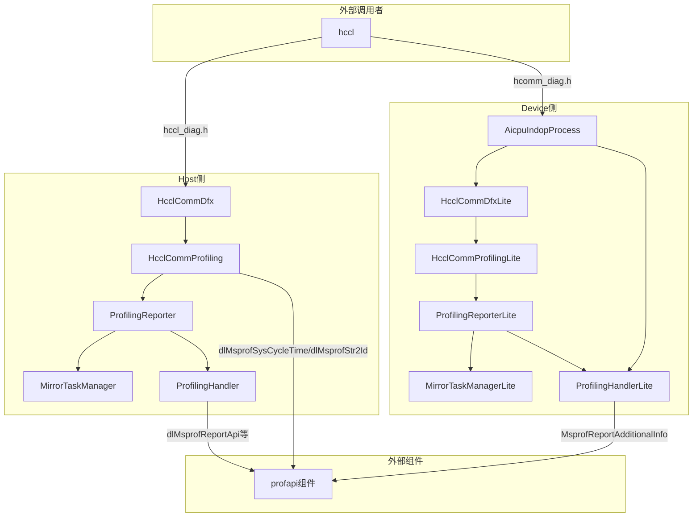

## 流程描述

### Host Profiling流程

#### 注册算子信息（HcclDfxRegOpInfoByCommId）

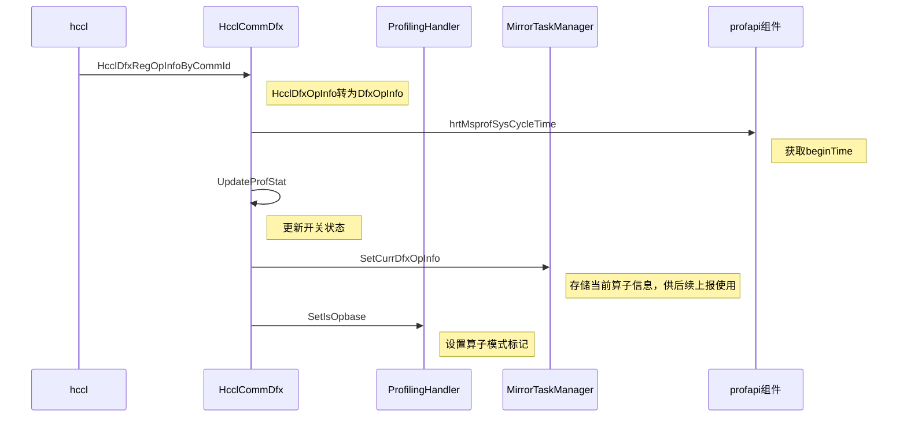

#### 上报算子（HcclProfilingReportOp）

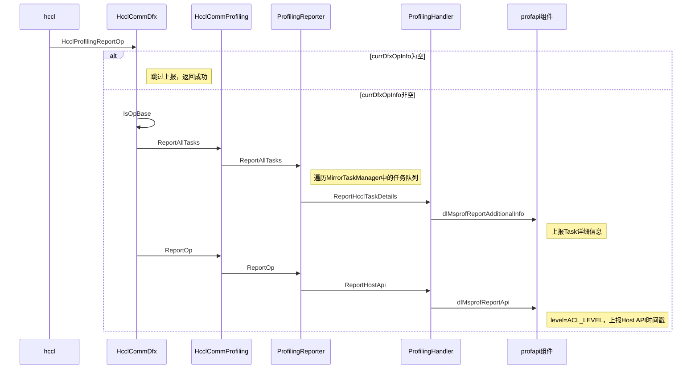

#### 上报AICPU Kernel（HcclReportAicpuKernel）

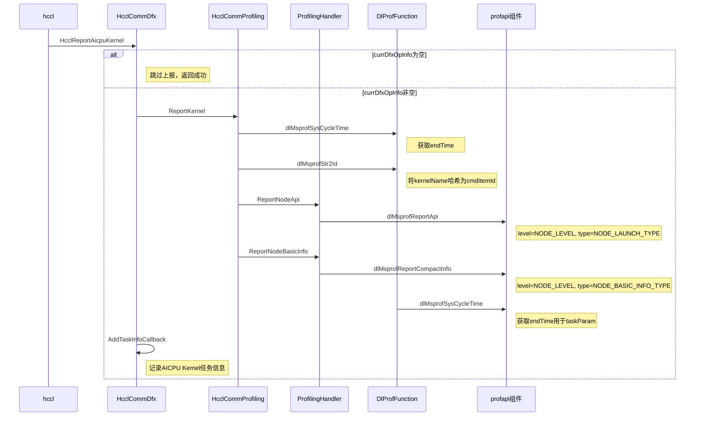

#### 上报AIV Kernel（HcclReportAivKernel）

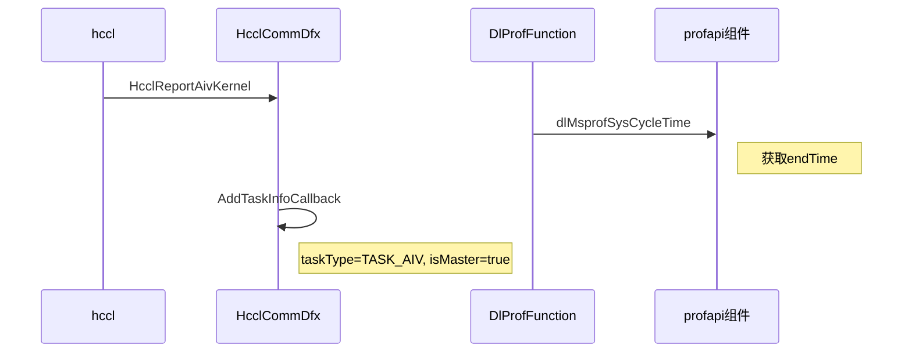

#### 上报MC2通信信息

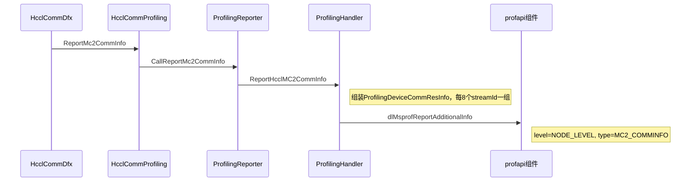

#### 管理Host侧Profiling开关

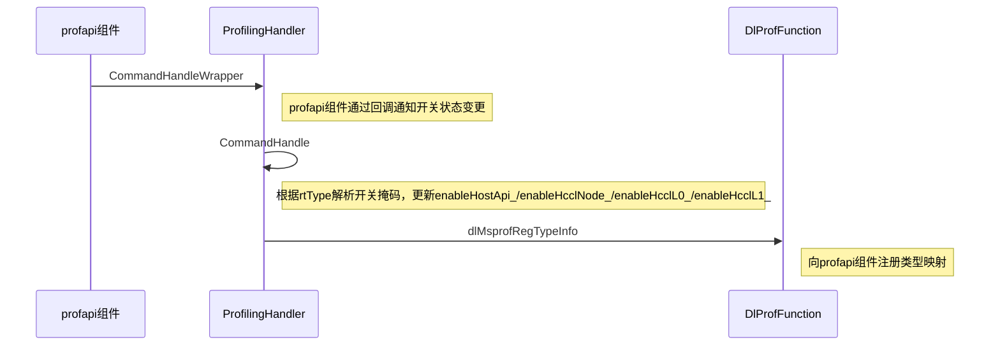

### Device Profiling流程

#### 注册算子信息（HcclDfxRegOpInfoByCommId）

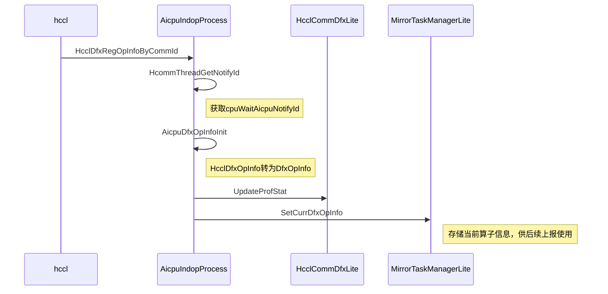

#### 上报Device算子（HcommProfilingReportDeviceOp）

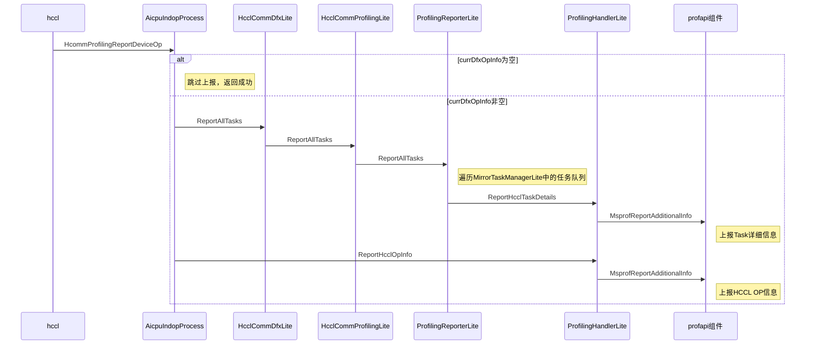

#### 上报内核启动任务（HcommProfilingReportKernelStartTask）

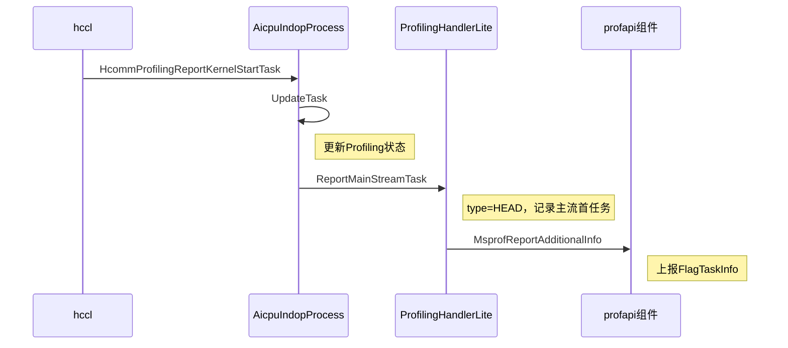

#### 上报内核结束任务（HcommProfilingReportKernelEndTask）

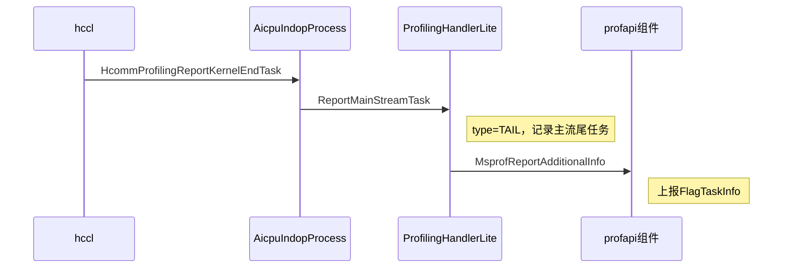

#### 管理Device侧Profiling开关

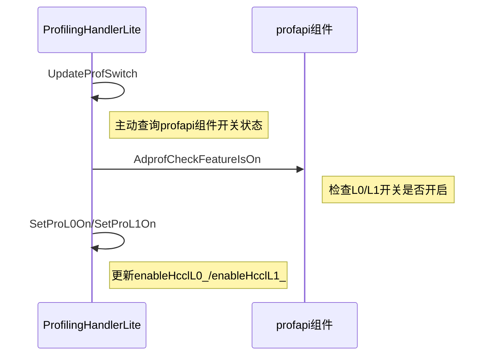

### 上报级别与类型常量汇总

| 常量名 | 值 | 说明 |
|--------|-----|------|
| `MSPROF_REPORT_ACL_LEVEL` | 20000 | ACL级别，用于Host API上报 |
| `MSPROF_REPORT_NODE_LEVEL` | 10000 | Node级别，用于Node BasicInfo/HCCL OP/MC2 CommInfo上报 |
| `MSPROF_REPORT_HCCL_NODE_LEVEL` | 5500 | HCCL Node级别，用于Task详细信息/CCU信息上报 |
| `MSPROF_REPORT_ACL_HOST_HCCL_BASE_TYPE` | 0x070000 | ACL Host HCCL基础类型 |
| `MSPROF_REPORT_NODE_LAUNCH_TYPE` | 5 | Node Launch类型，用于`ReportNodeApi` |
| `MSPROF_REPORT_NODE_BASIC_INFO_TYPE` | 0 | Node基本信息类型，用于`ReportNodeBasicInfo` |
| `MSPROF_REPORT_NODE_HCCL_OP_INFO_TYPE` | 10 | Node HCCL OP信息类型 |
| `MSPROF_REPORT_NODE_MC2_COMMINFO_TYPE` | 12 | Node MC2通信资源信息类型 |
| `MSPROF_REPORT_HCCL_MASTER_TYPE` | 0x010001 | HCCL主流类型 |
| `MSPROF_REPORT_HCCL_SLAVE_TYPE` | 0x010002 | HCCL从流类型 |
| `MSPROF_REPORT_CCU_TASK_INFO` | 14 | CCU Task信息类型 |
| `MSPROF_REPORT_CCU_WAIT_SIGNAL_INFO` | 15 | CCU Wait Signal信息类型 |
| `MSPROF_REPORT_CCU_GROUP_INFO` | 16 | CCU Group信息类型 |

### 开关控制与上报内容对应关系

| 开关 | 对应Mask | 控制的上报内容 |
|------|----------|---------------|
| `enableHostApi_` | `PROF_ACL_API_MASK` = 0x1 | Host API时间戳上报（`ReportAclApi`、`ReportNodeApi`、`ReportHcclOpApi`、`ReportHcclOpInfo`、`ReportMc2AdditionInfo`） |
| `enableHcclL0_` | `PROF_TASK_TIME_MASK` = 0x800 | HCCL算子粒度打点（`ReportHcclOpApi`） |
| `enableHcclNode_` | `PROF_TASK_TIME_L1_MASK` = 0x2 | Task粒度打点（`ReportHcclTaskApi`） |
| `enableHcclL1_` | `PROF_TASK_TIME_L1_MASK` = 0x2 | Task详细信息上报（`CallAddtionInfo`、`ReportNodeBasicInfo`） |
| `enableHcclL2_` | `PROF_TASK_TIME_L2_MASK` = 0x2000 | CCU详细信息上报（`ReportCcuInfo`） |

## 接口描述（类图）

```mermaid
classDiagram
    class HcclCommProfiling {
        -MirrorTaskManager* mirrorTaskManager_
        -unique_ptr~ProfilingReporter~ profilingReporter_
        +HcclCommProfiling(u32 deviceId, MirrorTaskManager* mirrorTaskManager)
        +ReportAllTasks(bool cachedReq) void
        +ReportOp(uint64_t beginTime, bool cachedReq, bool opbased) void
        +ReportMc2CommInfo(Mc2CommInfo& mc2CommInfo) void
        +UpdateProfStat() void
        +GetMirrorTaskManager() MirrorTaskManager*
        +ReportKernel(uint64_t beginTime, string& commTag, string& kernelName, uint32_t threadId, bool cachedReq) HcclResult
    }

    class HcclCommProfilingLite {
        -MirrorTaskManagerLite* mirrorTaskManagerLite_
        -unique_ptr~ProfilingReporterLite~ profilingReporterLite_
        +HcclCommProfilingLite(DevId deviceId, MirrorTaskManagerLite* mirrorTaskManagerLite)
        +ReportAllTasks() void
        +UpdateProfStat() void
        +GetMirrorTaskManagerLite() MirrorTaskManagerLite*
    }

    class ProfilingReporter {
        -MirrorTaskManager* mirrorTaskMgr_
        -bool enableHcclL1_
        -ProfilingHandler* profilingHandler_
        +ProfilingReporter(MirrorTaskManager*, ProfilingHandler*)
        +Init() void
        +ReportOp(uint64_t beginTime, bool cachedReq, bool opbased) void
        +ReportAllTasks(bool cachedReq) void
        +UpdateProfStat() void
        +CallReportMc2CommInfo(u32 kfcStreamId, vector~u32~ aicpuStreamsId, string id, RankId myRank, u32 rankSize, RankId rankInParentComm) void
    }

    class ProfilingReporterLite {
        -MirrorTaskManagerLite* mirrorTaskMgrLite_
        -ProfilingHandlerLite* profilingHandlerLite_
        -map lastPoses_
        +ProfilingReporterLite(MirrorTaskManagerLite*, ProfilingHandlerLite*, bool isIndop)
        +Init() void
        +ReportAllTasks() void
        +UpdateProfStat() void
    }

    class ProfilingHandler {
        -static ProfilingHandler instance_
        -bool enableHostApi_
        -bool enableHcclNode_
        -bool enableHcclL0_
        -bool enableHcclL1_
        +GetInstance() ProfilingHandler&$
        +ReportNodeApi(uint64_t beginTime, uint64_t endTime, uint64_t cmdItemId, uint32_t threadId, bool cachedReq) void
        +ReportNodeBasicInfo(uint64_t timeStamp, uint64_t cmdItemId, uint32_t threadId, bool cachedReq) void
        +ReportHostApi(OpType opType, uint64_t beginTime, uint64_t endTime, bool cachedReq, bool isAiCpu) void
        +ReportHcclOp(DfxOpInfo& opInfo, bool cachedReq) void
    }

    class ProfilingHandlerLite {
        -static ProfilingHandlerLite instance_
        -bool enableHcclL0_
        -bool enableHcclL1_
        +GetInstance() ProfilingHandlerLite&$
        +ReportHcclOpInfo(DfxOpInfo& opInfo) void
        +ReportHcclTaskDetails(vector~TaskInfo~& taskInfo) void
        +ReportMainStreamTask(FlagTaskInfo& flagTaskInfo) void
        +UpdateProfSwitch() void
    }

    class Mc2CommInfo {
        +u32 FreeStreamId
        +vector~u32~ streamsId
        +string groupname
        +u32 myRankId
        +u32 rankSize
        +u32 parentRankId
    }

    HcclCommProfiling o-- ProfilingReporter : 持有
    HcclCommProfiling o-- MirrorTaskManager : 持有指针
    HcclCommProfiling ..> ProfilingHandler : 通过Reporter间接访问
    HcclCommProfiling ..> profapi组件 : dlMsprofSysCycleTime/dlMsprofStr2Id
    HcclCommProfiling --> Mc2CommInfo : 使用

    HcclCommProfilingLite o-- ProfilingReporterLite : 持有
    HcclCommProfilingLite o-- MirrorTaskManagerLite : 持有指针
    HcclCommProfilingLite ..> ProfilingHandlerLite : 通过Reporter间接访问

    ProfilingReporter o-- MirrorTaskManager : 持有指针
    ProfilingReporter ..> ProfilingHandler : 调用上报接口

    ProfilingReporterLite o-- MirrorTaskManagerLite : 持有指针
    ProfilingReporterLite ..> ProfilingHandlerLite : 调用上报接口

    ProfilingHandler ..> profapi组件 : dlMsprofReportApi/dlMsprofReportCompactInfo/dlMsprofReportAdditionalInfo
    ProfilingHandler ..> rts组件 : orion_adapter_rts.h
    ProfilingHandlerLite ..> profapi组件 : MsprofReportAdditionalInfo/AdprofReportAdditionalInfo
```

## 接口描述

### HcclCommProfiling（Host侧）

| 接口名 | 类型 | 参数 | 返回值 | 功能说明 |
|--------|------|------|--------|----------|
| `HcclCommProfiling` | 公有 | `[in] u32 deviceId`, `[in] MirrorTaskManager* mirrorTaskManager` | - | 构造函数，保存任务管理器指针，创建`ProfilingReporter`实例（关联`ProfilingHandler::GetInstance()`） |
| `ReportAllTasks` | 公有 | `[in] bool cachedReq = false` | void | 上报所有通信任务；`cachedReq=true`表示缓存请求模式，委托`ProfilingReporter::ReportAllTasks`遍历任务队列并通过`ProfilingHandler`上报 |
| `ReportOp` | 公有 | `[in] uint64_t beginTime`, `[in] bool cachedReq`, `[in] bool opbased` | void | 上报算子信息，委托`ProfilingReporter::ReportOp`，最终通过`ProfilingHandler::ReportHostApi`调用profapi组件`dlMsprofReportApi`上报 |
| `ReportMc2CommInfo` | 公有 | `[in] const Mc2CommInfo& mc2CommInfo` | void | 上报MC2通信域信息，将`Mc2CommInfo`字段拆分后调用`ProfilingReporter::CallReportMc2CommInfo`，最终通过`dlMsprofReportAdditionalInfo`上报 |
| `UpdateProfStat` | 公有 | - | void | 更新Profiling统计，委托`ProfilingReporter::UpdateProfStat`更新开关状态 |
| `GetMirrorTaskManager` | 公有 | - | `MirrorTaskManager*` | 获取内部持有的`MirrorTaskManager`指针 |
| `ReportKernel` | 公有 | `[in] uint64_t beginTime`, `[in] const string& commTag`, `[in] const string& kernelName`, `[in] uint32_t threadId`, `[in] bool cachedReq` | HcclResult | 上报CCU Kernel信息；调用profapi组件`dlMsprofSysCycleTime`获取endTime、`dlMsprofStr2Id`获取cmdItemId，再调用`ProfilingHandler`上报`ReportNodeApi`和`ReportNodeBasicInfo`；`EXCEPTION_CATCH`宏捕获异常，失败返回`HCCL_E_PTR` |

### HcclCommProfilingLite（Device侧）

| 接口名 | 类型 | 参数 | 返回值 | 功能说明 |
|--------|------|------|--------|----------|
| `HcclCommProfilingLite` | 公有 | `[in] DevId deviceId`, `[in] MirrorTaskManagerLite* mirrorTaskManagerLite` | - | 构造函数，保存任务管理器指针，创建`ProfilingReporterLite`实例（`isIndop=true`，关联`ProfilingHandlerLite::GetInstance()`） |
| `ReportAllTasks` | 公有 | - | void | 上报所有通信任务，委托`ProfilingReporterLite::ReportAllTasks`，最终通过弱符号调用profapi组件`MsprofReportAdditionalInfo`上报 |
| `UpdateProfStat` | 公有 | - | void | 更新Profiling统计，委托`ProfilingReporterLite::UpdateProfStat`更新开关状态 |
| `GetMirrorTaskManagerLite` | 公有 | - | `MirrorTaskManagerLite*` | 获取内部持有的`MirrorTaskManagerLite`指针 |

## 使用限制

### 支持的场景

| 场景 | Host侧 | Device侧 | 说明 |
|------|---------|----------|------|
| 注册算子信息 | ✅ | ✅ | 通过`HcclDfxRegOpInfoByCommId`注册 |
| 上报算子 | ✅ | ✅ | Host通过`HcclProfilingReportOp`；Device通过`HcommProfilingReportDeviceOp` |
| 上报Kernel | ✅ | ✅ | Host支持AICPU/AIV Kernel上报；Device支持内核启停任务上报 |
| 上报MC2通信信息 | ✅ | ❌ | 仅Host侧支持`ReportMc2CommInfo` |
| 更新Profiling状态 | ✅ | ✅ | 两端均支持 |
| 多设备任务管理 | ✅ | ❌ | Host侧`MirrorTaskManager`支持多设备队列映射 |
| 上报CCU信息 | ✅ | ❌ | 仅Host侧支持CCU Task/WaitSignal/Group信息上报 |
| 获取系统周期时间 | ✅ | ❌ | 仅Host侧支持`HcommGetProfilingSysCycleTime` |

### 规格约束

1. **设备数上限**：Host侧`ProfilingReporter`的`allLastPoses_`静态数组大小为`REPORTER_MAX_MODULE_DEVICE_NUM` = 65，即最多支持65个设备的Profiling位置记录
2. **ProfilingHandler单例模式**：Host侧和Device侧的`ProfilingHandler`/`ProfilingHandlerLite`均为单例，全局唯一，禁止拷贝和赋值
3. **DlProfFunction动态加载**：Host侧通过`DlProfFunction`以`dlopen`动态加载`libprofapi.so`，若SDK不可用则回退到Stub函数（打印WARNING日志并跳过）
4. **Device侧弱符号链接**：Device侧通过`__attribute__((weak))`声明profapi组件函数（`MsprofReportAdditionalInfo`、`AdprofReportAdditionalInfo`等），运行时按优先级选择：`MsprofReportBatchAdditionalInfo` > `AdprofReportAdditionalInfo` > `MsprofReportAdditionalInfo`
5. **空指针保护**：所有上报接口在调用Reporter前均检查指针非空，避免空指针解引用
6. **EXCEPTION_CATCH宏**：`ReportKernel`中使用`EXCEPTION_CATCH`宏捕获`ProfilingHandler`上报异常，失败时返回`HCCL_E_PTR`
7. **MC2 Stream分组上报**：`ReportMc2CommInfo`每8个streamId为一组通过`ProfilingDeviceCommResInfo`上报，`commStreamIds`数组大小固定为8
8. **Device侧设备类型限制**：`HcommProfilingReportDeviceOp`、`HcommProfilingReportKernelStartTask`、`HcommProfilingReportKernelEndTask`仅在`DEV_TYPE_950`设备上执行，其他设备类型直接返回成功

### 已知限制

1. **`aicpu_ts_urma_dfx_kernel`已废弃**：Device侧的`aicpu_ts_urma_dfx_kernel.h`/`.cc`文件已废弃，不再维护，但`CMakeLists.txt`中仍保留编译项
2. **`Mc2CommInfo`无校验**：`ReportMc2CommInfo`接口不校验`mc2CommInfo`中`streamsId`向量的长度，由底层`CallReportMc2CommInfo`处理
3. **线程安全**：Host侧`ProfilingHandler`内部通过多个mutex（`cacheTaskInfosMutex_`、`cachedTaskApiInfoMutex_`、`cacheHcclOpInfoMutex_`、`cacheHcclAdditionInfoMutex_`）保护缓存数据；Device侧`ProfilingHandlerLite`未使用锁，依赖单线程执行环境
4. **Device侧开关查询模式**：与Host侧通过回调被动接收开关状态不同，Device侧`ProfilingHandlerLite`需主动调用`UpdateProfSwitch()`查询profapi组件的开关状态
5. **非V2通信域处理**：`HcclProfilingReportOp`在`DEV_TYPE_910B`设备上非`CommunicatorV2`通信域直接返回成功跳过上报，其他设备类型非V2返回`HCCL_E_NOT_SUPPORT`
