# Profiling Module Code Analysis

## Feature Description

The Profiling module is responsible for collecting and reporting performance data of HCCL collective communication tasks. It is a core component of the HCCL DFX (Diagnostics and Observability) system. The module is deployed on both the Host side and the Device side, providing unified profiling capabilities.

Core capabilities:

1. **Report communication tasks**: Report execution information of collective communication tasks (AllReduce, Broadcast, and so on) to the Profiling framework.
2. **Report operator information**: Report key metrics such as start and end times and operator types for communication operators (Host side only).
3. **Report MC2 communication information**: Report Stream, Rank, and other metadata of the MC2 communication domain (Host side only).
4. **Report Kernel**: Report AICPU or AIV Kernel execution timeline information. The Device side reports kernel start and end task events.
5. **Update Profiling status**: Update Profiling statistics based on task queue consumption progress.
6. **Manage Profiling switches**: Respond to subscription and unsubscription commands from the Profiling framework to control data collection start and stop.

### External Interfaces

| Header File | Interface | Side | Description |
|--------|------|------|----------|
| `hccl_diag.h` | `HcclDfxRegOpInfoByCommId` | Host + Device | Registers operator information with the communication domain, records `beginTime`, and stores it in `MirrorTaskManager`. |
| `hccl_diag.h` | `HcclProfilingReportOp` | Host | Reports operator execution events: first `ReportAllTasks`, then `ReportOp`. |
| `hccl_diag.h` | `HcclReportAicpuKernel` | Host | Reports AICPU Kernel execution events, records taskId and streamId, and adds task information. |
| `hccl_diag.h` | `HcclReportAivKernel` | Host | Reports AIV Kernel execution events, records taskId and streamId, and adds task information. |
| `hccl_diag.h` | `HcommGetProfilingSysCycleTime` | Host | Obtains the Profiling system cycle time. |
| `hcomm_diag.h` | `HcommProfilingReportDeviceOp` | Device | Reports Device operator execution events: first `ReportAllTasks`, then reports OP information through `ProfilingHandlerLite`. |
| `hcomm_diag.h` | `HcommProfilingReportKernelStartTask` | Device | Reports kernel start task events, reports HEAD type `FlagTaskInfo` through `ProfilingHandlerLite`. |
| `hcomm_diag.h` | `HcommProfilingReportKernelEndTask` | Device | Reports kernel end task events, reports TAIL type `FlagTaskInfo` through `ProfilingHandlerLite`. |

## Directory Description

```text
profiling/
├── CMakeLists.txt                          # Top-level build, includes aicpu and host subdirectories
├── host/
│   ├── CMakeLists.txt                      # Host-side build, compiles hcclCommProfiling.cc
│   ├── hcclCommProfiling.h                 # Host-side Profiling facade class definition
│   └── hcclCommProfiling.cc                # Host-side Profiling facade class implementation
└── aicpu/
    ├── CMakeLists.txt                      # AICPU-side build, compiles hcclCommProfilingLite.cc
    ├── hcclCommProfilingLite.h             # AICPU-side Profiling facade class definition
    ├── hcclCommProfilingLite.cc            # AICPU-side Profiling facade class implementation
    ├── aicpu_ts_urma_dfx_kernel.h          # [Deprecated] URMA DFX Kernel
    └── aicpu_ts_urma_dfx_kernel.cc         # [Deprecated] URMA DFX Kernel
```

### File Relationships

| File | Function | Dependencies |
|------|------|----------|
| `host/hcclCommProfiling.h` | Host-side Profiling facade class declaration | Depends on `MirrorTaskManager`, `ProfilingReporter` |
| `host/hcclCommProfiling.cc` | Host-side Profiling facade class implementation | Depends on `profiling_reporter.h`, `profiling_handler.h`, `dlprof_function.h` |
| `aicpu/hcclCommProfilingLite.h` | AICPU-side Profiling facade class declaration | Depends on `MirrorTaskManagerLite`, `ProfilingReporterLite` |
| `aicpu/hcclCommProfilingLite.cc` | AICPU-side Profiling facade class implementation | Depends on `profiling_reporter_lite.h`, `mirror_task_manager_lite.h` |

### Profiling File Interaction

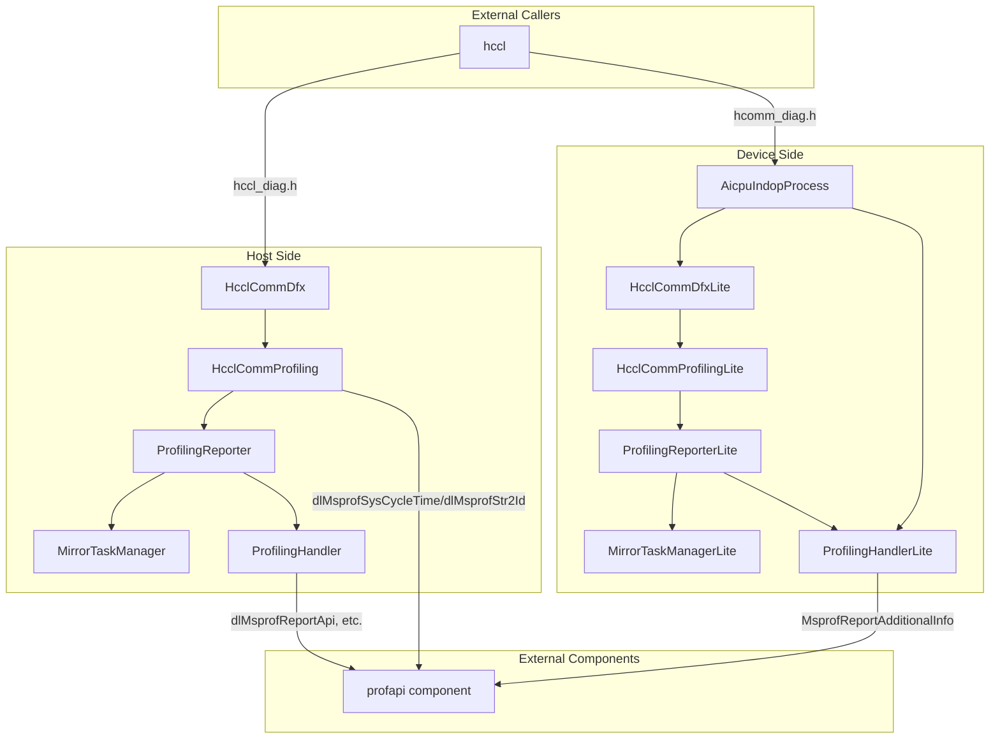

## Flow Description

### Host Profiling Flow

#### Register Operator Information (HcclDfxRegOpInfoByCommId)

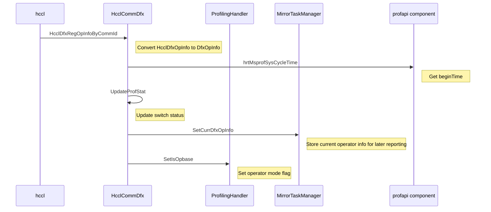

#### Report Operator (HcclProfilingReportOp)

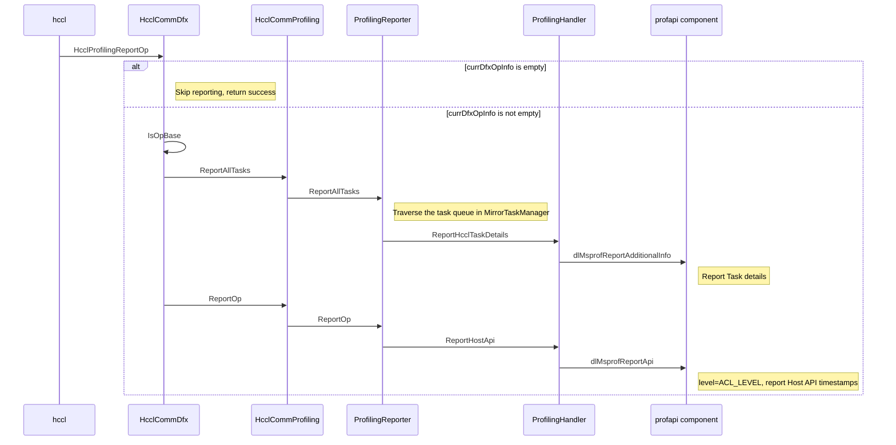

#### Report AICPU Kernel (HcclReportAicpuKernel)

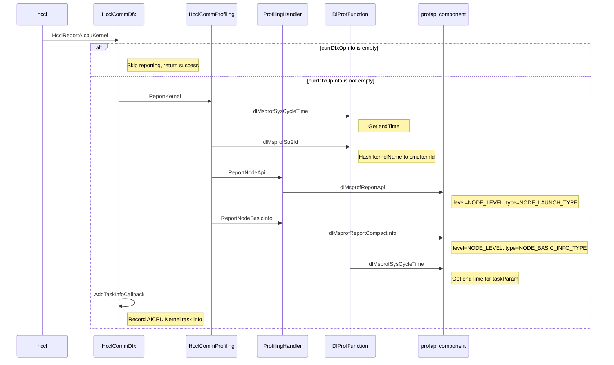

#### Report AIV Kernel (HcclReportAivKernel)

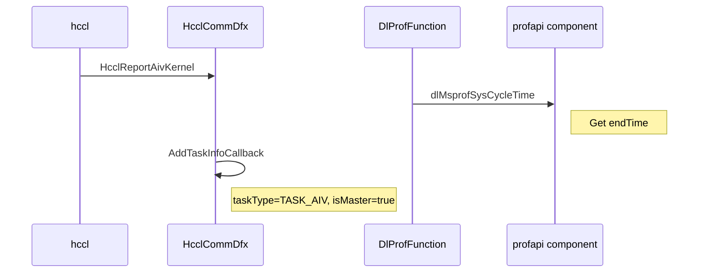

#### Report MC2 Communication Information

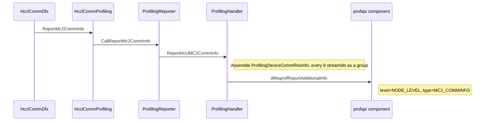

#### Manage Host-Side Profiling Switch

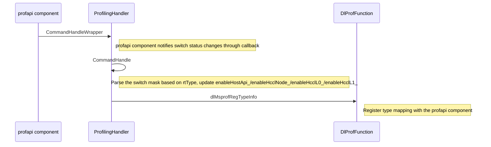

### Device Profiling Flow

#### Register Operator Information (HcclDfxRegOpInfoByCommId)

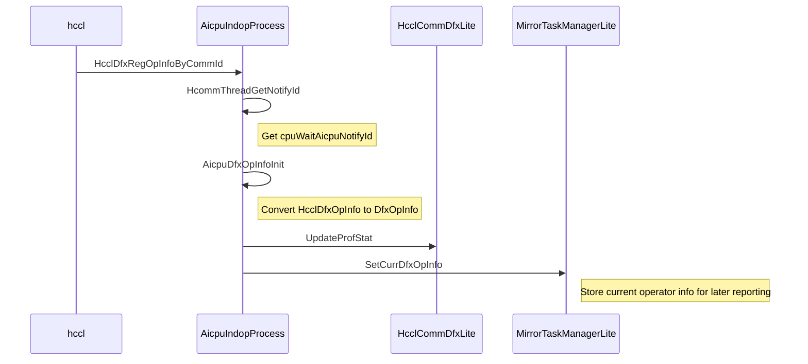

#### Report Device Operator (HcommProfilingReportDeviceOp)

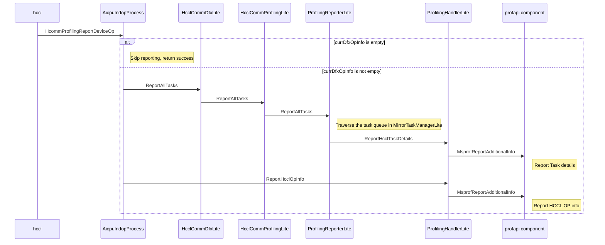

#### Report Kernel Start Task (HcommProfilingReportKernelStartTask)

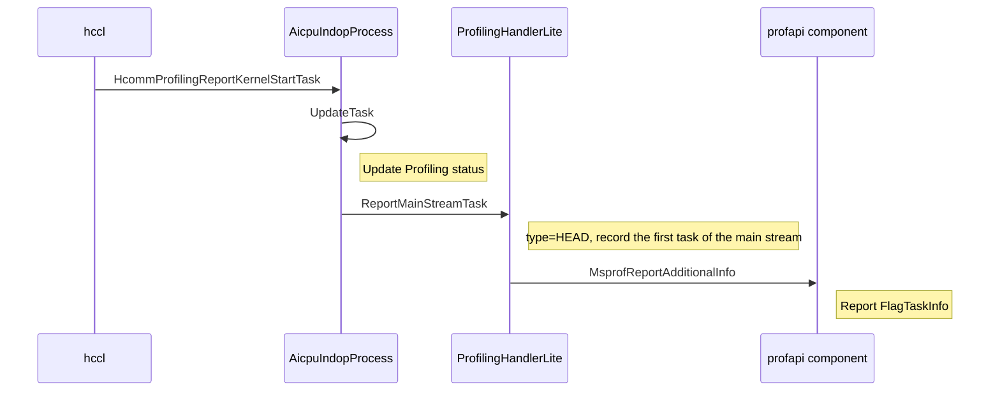

#### Report Kernel End Task (HcommProfilingReportKernelEndTask)

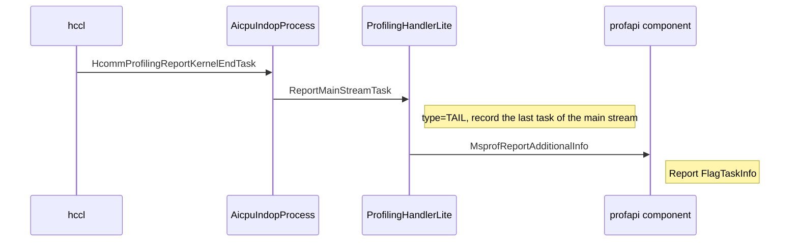

#### Manage Device-Side Profiling Switch

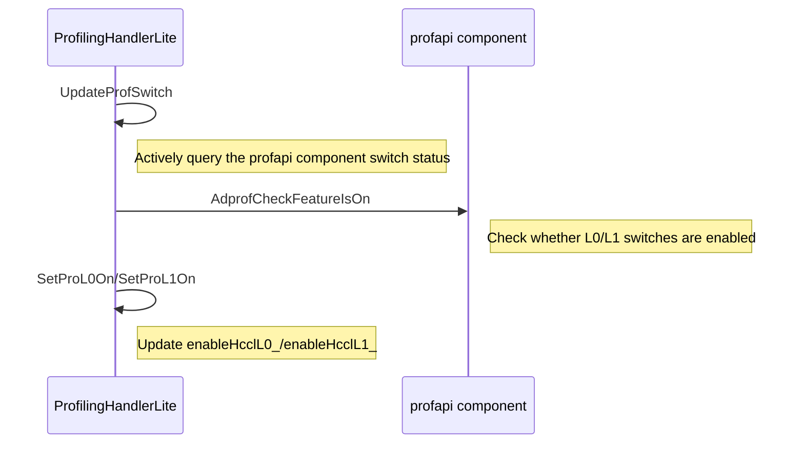

### Report Level and Type Constants Summary

| Constant Name | Value | Description |
|--------|-----|------|
| `MSPROF_REPORT_ACL_LEVEL` | 20000 | ACL level, used for Host API reporting |
| `MSPROF_REPORT_NODE_LEVEL` | 10000 | Node level, used for Node BasicInfo, HCCL OP, and MC2 CommInfo reporting |
| `MSPROF_REPORT_HCCL_NODE_LEVEL` | 5500 | HCCL Node level, used for Task details and CCU information reporting |
| `MSPROF_REPORT_ACL_HOST_HCCL_BASE_TYPE` | 0x070000 | ACL Host HCCL base type |
| `MSPROF_REPORT_NODE_LAUNCH_TYPE` | 5 | Node Launch type, used for `ReportNodeApi` |
| `MSPROF_REPORT_NODE_BASIC_INFO_TYPE` | 0 | Node basic information type, used for `ReportNodeBasicInfo` |
| `MSPROF_REPORT_NODE_HCCL_OP_INFO_TYPE` | 10 | Node HCCL OP information type |
| `MSPROF_REPORT_NODE_MC2_COMMINFO_TYPE` | 12 | Node MC2 communication resource information type |
| `MSPROF_REPORT_HCCL_MASTER_TYPE` | 0x010001 | HCCL main stream type |
| `MSPROF_REPORT_HCCL_SLAVE_TYPE` | 0x010002 | HCCL slave stream type |
| `MSPROF_REPORT_CCU_TASK_INFO` | 14 | CCU Task information type |
| `MSPROF_REPORT_CCU_WAIT_SIGNAL_INFO` | 15 | CCU Wait Signal information type |
| `MSPROF_REPORT_CCU_GROUP_INFO` | 16 | CCU Group information type |

### Switch Control and Report Content Mapping

| Switch | Corresponding Mask | Controlled Report Content |
|------|----------|---------------|
| `enableHostApi_` | `PROF_ACL_API_MASK` = 0x1 | Host API timestamp reporting (`ReportAclApi`, `ReportNodeApi`, `ReportHcclOpApi`, `ReportHcclOpInfo`, `ReportMc2AdditionInfo`) |
| `enableHcclL0_` | `PROF_TASK_TIME_MASK` = 0x800 | HCCL operator granularity tracing (`ReportHcclOpApi`) |
| `enableHcclNode_` | `PROF_TASK_TIME_L1_MASK` = 0x2 | Task granularity tracing (`ReportHcclTaskApi`) |
| `enableHcclL1_` | `PROF_TASK_TIME_L1_MASK` = 0x2 | Task details reporting (`CallAddtionInfo`, `ReportNodeBasicInfo`) |
| `enableHcclL2_` | `PROF_TASK_TIME_L2_MASK` = 0x2000 | CCU details reporting (`ReportCcuInfo`) |

## Interface Description (Class Diagram)

```mermaid
classDiagram
    class HcclCommProfiling {
        -MirrorTaskManager* mirrorTaskManager_
        -unique_ptr~ProfilingReporter~ profilingReporter_
        +HcclCommProfiling(u32 deviceId, MirrorTaskManager* mirrorTaskManager)
        +ReportAllTasks(bool cachedReq) void
        +ReportOp(uint64_t beginTime, bool cachedReq, bool opbased) void
        +ReportMc2CommInfo(Mc2CommInfo& mc2CommInfo) void
        +UpdateProfStat() void
        +GetMirrorTaskManager() MirrorTaskManager*
        +ReportKernel(uint64_t beginTime, string& commTag, string& kernelName, uint32_t threadId, bool cachedReq) HcclResult
    }

    class HcclCommProfilingLite {
        -MirrorTaskManagerLite* mirrorTaskManagerLite_
        -unique_ptr~ProfilingReporterLite~ profilingReporterLite_
        +HcclCommProfilingLite(DevId deviceId, MirrorTaskManagerLite* mirrorTaskManagerLite)
        +ReportAllTasks() void
        +UpdateProfStat() void
        +GetMirrorTaskManagerLite() MirrorTaskManagerLite*
    }

    class ProfilingReporter {
        -MirrorTaskManager* mirrorTaskMgr_
        -bool enableHcclL1_
        -ProfilingHandler* profilingHandler_
        +ProfilingReporter(MirrorTaskManager*, ProfilingHandler*)
        +Init() void
        +ReportOp(uint64_t beginTime, bool cachedReq, bool opbased) void
        +ReportAllTasks(bool cachedReq) void
        +UpdateProfStat() void
        +CallReportMc2CommInfo(u32 kfcStreamId, vector~u32~ aicpuStreamsId, string id, RankId myRank, u32 rankSize, RankId rankInParentComm) void
    }

    class ProfilingReporterLite {
        -MirrorTaskManagerLite* mirrorTaskMgrLite_
        -ProfilingHandlerLite* profilingHandlerLite_
        -map lastPoses_
        +ProfilingReporterLite(MirrorTaskManagerLite*, ProfilingHandlerLite*, bool isIndop)
        +Init() void
        +ReportAllTasks() void
        +UpdateProfStat() void
    }

    class ProfilingHandler {
        -static ProfilingHandler instance_
        -bool enableHostApi_
        -bool enableHcclNode_
        -bool enableHcclL0_
        -bool enableHcclL1_
        +GetInstance() ProfilingHandler&$
        +ReportNodeApi(uint64_t beginTime, uint64_t endTime, uint64_t cmdItemId, uint32_t threadId, bool cachedReq) void
        +ReportNodeBasicInfo(uint64_t timeStamp, uint64_t cmdItemId, uint32_t threadId, bool cachedReq) void
        +ReportHostApi(OpType opType, uint64_t beginTime, uint64_t endTime, bool cachedReq, bool isAiCpu) void
        +ReportHcclOp(DfxOpInfo& opInfo, bool cachedReq) void
    }

    class ProfilingHandlerLite {
        -static ProfilingHandlerLite instance_
        -bool enableHcclL0_
        -bool enableHcclL1_
        +GetInstance() ProfilingHandlerLite&$
        +ReportHcclOpInfo(DfxOpInfo& opInfo) void
        +ReportHcclTaskDetails(vector~TaskInfo~& taskInfo) void
        +ReportMainStreamTask(FlagTaskInfo& flagTaskInfo) void
        +UpdateProfSwitch() void
    }

    class Mc2CommInfo {
        +u32 FreeStreamId
        +vector~u32~ streamsId
        +string groupname
        +u32 myRankId
        +u32 rankSize
        +u32 parentRankId
    }

    HcclCommProfiling o-- ProfilingReporter : holds
    HcclCommProfiling o-- MirrorTaskManager : holds pointer
    HcclCommProfiling ..> ProfilingHandler : accessed indirectly through Reporter
    HcclCommProfiling ..> profapi component : dlMsprofSysCycleTime/dlMsprofStr2Id
    HcclCommProfiling --> Mc2CommInfo : uses

    HcclCommProfilingLite o-- ProfilingReporterLite : holds
    HcclCommProfilingLite o-- MirrorTaskManagerLite : holds pointer
    HcclCommProfilingLite ..> ProfilingHandlerLite : accessed indirectly through Reporter

    ProfilingReporter o-- MirrorTaskManager : holds pointer
    ProfilingReporter ..> ProfilingHandler : calls reporting interface

    ProfilingReporterLite o-- MirrorTaskManagerLite : holds pointer
    ProfilingReporterLite ..> ProfilingHandlerLite : calls reporting interface

    ProfilingHandler ..> profapi component : dlMsprofReportApi/dlMsprofReportCompactInfo/dlMsprofReportAdditionalInfo
    ProfilingHandler ..> rts component : orion_adapter_rts.h
    ProfilingHandlerLite ..> profapi component : MsprofReportAdditionalInfo/AdprofReportAdditionalInfo
```

## Interface Description

### HcclCommProfiling (Host Side)

| Interface | Type | Parameters | Return Value | Description |
|--------|------|------|--------|----------|
| `HcclCommProfiling` | Public | `[in] u32 deviceId`, `[in] MirrorTaskManager* mirrorTaskManager` | - | Constructor, saves the task manager pointer, creates a `ProfilingReporter` instance (associated with `ProfilingHandler::GetInstance()`). |
| `ReportAllTasks` | Public | `[in] bool cachedReq = false` | void | Reports all communication tasks. When `cachedReq=true`, indicates cache request mode. Delegates to `ProfilingReporter::ReportAllTasks` to traverse the task queue and report through `ProfilingHandler`. |
| `ReportOp` | Public | `[in] uint64_t beginTime`, `[in] bool cachedReq`, `[in] bool opbased` | void | Reports operator information. Delegates to `ProfilingReporter::ReportOp`, which ultimately calls the profapi component `dlMsprofReportApi` through `ProfilingHandler::ReportHostApi`. |
| `ReportMc2CommInfo` | Public | `[in] const Mc2CommInfo& mc2CommInfo` | void | Reports MC2 communication domain information. Splits the `Mc2CommInfo` fields and calls `ProfilingReporter::CallReportMc2CommInfo`, which ultimately reports through `dlMsprofReportAdditionalInfo`. |
| `UpdateProfStat` | Public | - | void | Updates Profiling statistics. Delegates to `ProfilingReporter::UpdateProfStat` to update the switch status. |
| `GetMirrorTaskManager` | Public | - | `MirrorTaskManager*` | Returns the internally held `MirrorTaskManager` pointer. |
| `ReportKernel` | Public | `[in] uint64_t beginTime`, `[in] const string& commTag`, `[in] const string& kernelName`, `[in] uint32_t threadId`, `[in] bool cachedReq` | HcclResult | Reports CCU Kernel information. Calls the profapi component `dlMsprofSysCycleTime` to get endTime and `dlMsprofStr2Id` to get cmdItemId, then calls `ProfilingHandler` to report `ReportNodeApi` and `ReportNodeBasicInfo`. The `EXCEPTION_CATCH` macro catches exceptions and returns `HCCL_E_PTR` on failure. |

### HcclCommProfilingLite (Device Side)

| Interface | Type | Parameters | Return Value | Description |
|--------|------|------|--------|----------|
| `HcclCommProfilingLite` | Public | `[in] DevId deviceId`, `[in] MirrorTaskManagerLite* mirrorTaskManagerLite` | - | Constructor, saves the task manager pointer, creates a `ProfilingReporterLite` instance (`isIndop=true`, associated with `ProfilingHandlerLite::GetInstance()`). |
| `ReportAllTasks` | Public | - | void | Reports all communication tasks. Delegates to `ProfilingReporterLite::ReportAllTasks`, which ultimately calls the profapi component `MsprofReportAdditionalInfo` through a weak symbol. |
| `UpdateProfStat` | Public | - | void | Updates Profiling statistics. Delegates to `ProfilingReporterLite::UpdateProfStat` to update the switch status. |
| `GetMirrorTaskManagerLite` | Public | - | `MirrorTaskManagerLite*` | Returns the internally held `MirrorTaskManagerLite` pointer. |

## Usage Limitations

### Supported Scenarios

| Scenario | Host Side | Device Side | Description |
|------|---------|----------|------|
| Register operator information | Supported | Supported | Registered through `HcclDfxRegOpInfoByCommId`. |
| Report operator | Supported | Supported | Host reports through `HcclProfilingReportOp`; Device reports through `HcommProfilingReportDeviceOp`. |
| Report Kernel | Supported | Supported | Host supports AICPU and AIV Kernel reporting; Device supports kernel start and end task reporting. |
| Report MC2 communication info | Supported | Not supported | Only the Host side supports `ReportMc2CommInfo`. |
| Update Profiling status | Supported | Supported | Both sides support this. |
| Multi-device task management | Supported | Not supported | The Host-side `MirrorTaskManager` supports multi-device queue mapping. |
| Report CCU information | Supported | Not supported | Only the Host side supports CCU Task, WaitSignal, and Group information reporting. |
| Get system cycle time | Supported | Not supported | Only the Host side supports `HcommGetProfilingSysCycleTime`. |

### Constraint Specifications

1. **Maximum device count**: The Host-side `ProfilingReporter` static array `allLastPoses_` has a size of `REPORTER_MAX_MODULE_DEVICE_NUM` = 65, supporting profiling position records for up to 65 devices.
2. **ProfilingHandler singleton pattern**: Both Host-side and Device-side `ProfilingHandler` and `ProfilingHandlerLite` are singletons, globally unique. Copying and assignment are prohibited.
3. **DlProfFunction dynamic loading**: The Host side dynamically loads `libprofapi.so` through `DlProfFunction` using `dlopen`. If the SDK is unavailable, it falls back to stub functions (printing a WARNING log and skipping).
4. **Device-side weak symbol linking**: The Device side declares profapi component functions through `__attribute__((weak))` (such as `MsprofReportAdditionalInfo` and `AdprofReportAdditionalInfo`). At runtime, the selection priority is: `MsprofReportBatchAdditionalInfo` > `AdprofReportAdditionalInfo` > `MsprofReportAdditionalInfo`.
5. **Null pointer protection**: All reporting interfaces check for non-null pointers before calling the Reporter to avoid null pointer dereferences.
6. **EXCEPTION_CATCH macro**: `ReportKernel` uses the `EXCEPTION_CATCH` macro to catch exceptions during `ProfilingHandler` reporting, returning `HCCL_E_PTR` on failure.
7. **MC2 Stream group reporting**: `ReportMc2CommInfo` groups every 8 streamIds into a group and reports them through `ProfilingDeviceCommResInfo`. The `commStreamIds` array size is fixed at 8.
8. **Device-side device type restriction**: `HcommProfilingReportDeviceOp`, `HcommProfilingReportKernelStartTask`, and `HcommProfilingReportKernelEndTask` only execute on `DEV_TYPE_950` devices. For other device types, they directly return success.

### Known Limitations

1. **`aicpu_ts_urma_dfx_kernel` is deprecated**: The Device-side `aicpu_ts_urma_dfx_kernel.h` and `.cc` files are deprecated and no longer maintained, but the build entry is still retained in `CMakeLists.txt`.
2. **`Mc2CommInfo` has no validation**: The `ReportMc2CommInfo` interface does not validate the length of the `streamsId` vector in `mc2CommInfo`. This is handled by the underlying `CallReportMc2CommInfo`.
3. **Thread safety**: The Host-side `ProfilingHandler` uses multiple mutexes (`cacheTaskInfosMutex_`, `cachedTaskApiInfoMutex_`, `cacheHcclOpInfoMutex_`, `cacheHcclAdditionInfoMutex_`) to protect cached data. The Device-side `ProfilingHandlerLite` does not use locks and relies on a single-threaded execution environment.
4. **Device-side switch query mode**: Unlike the Host side, which receives switch status passively through callbacks, the Device-side `ProfilingHandlerLite` must actively call `UpdateProfSwitch()` to query the switch status from the profapi component.
5. **Non-V2 communication domain handling**: On `DEV_TYPE_910B` devices, `HcclProfilingReportOp` directly returns success and skips reporting for non-`CommunicatorV2` communication domains. For other device types, `HCCL_E_NOT_SUPPORT` is returned for non-V2 domains.
