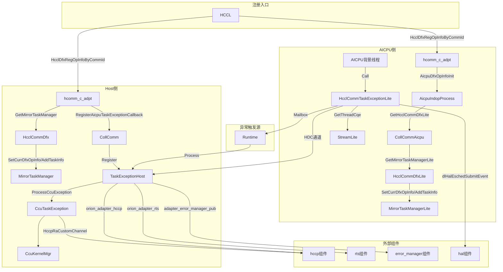
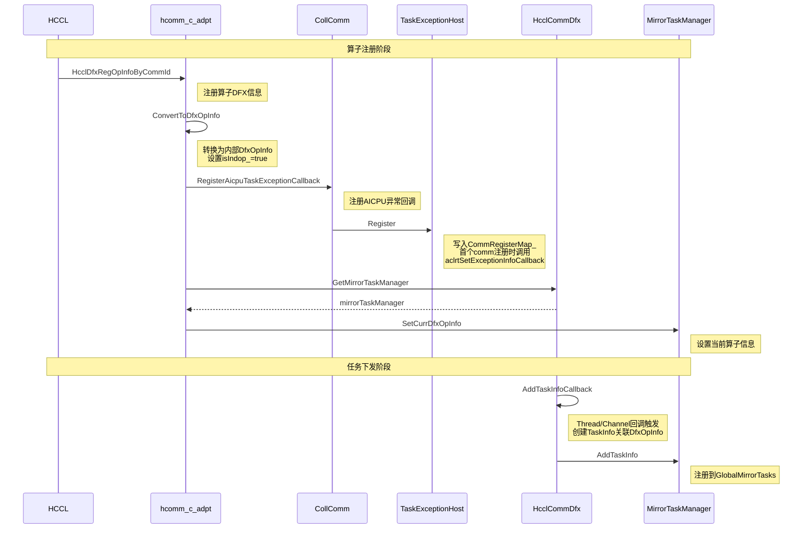
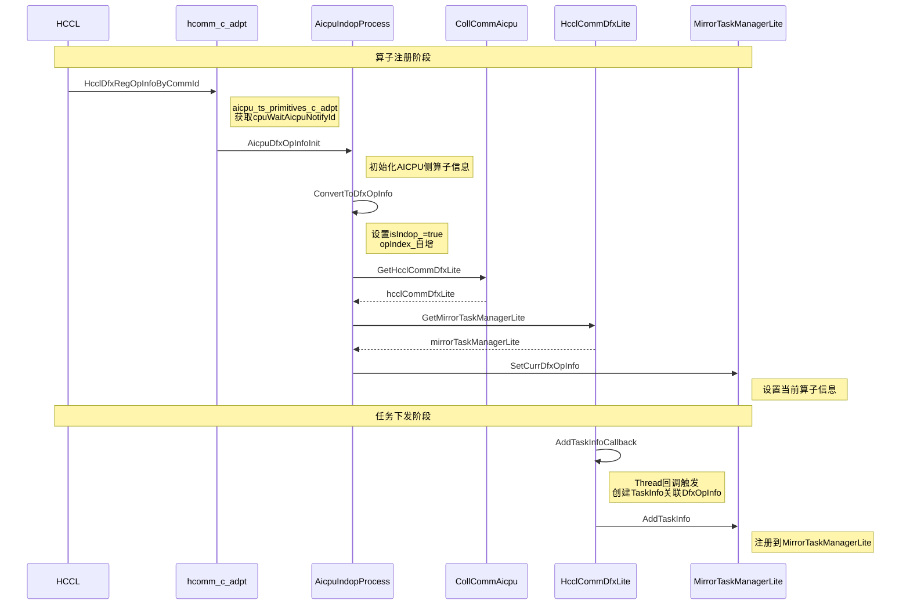
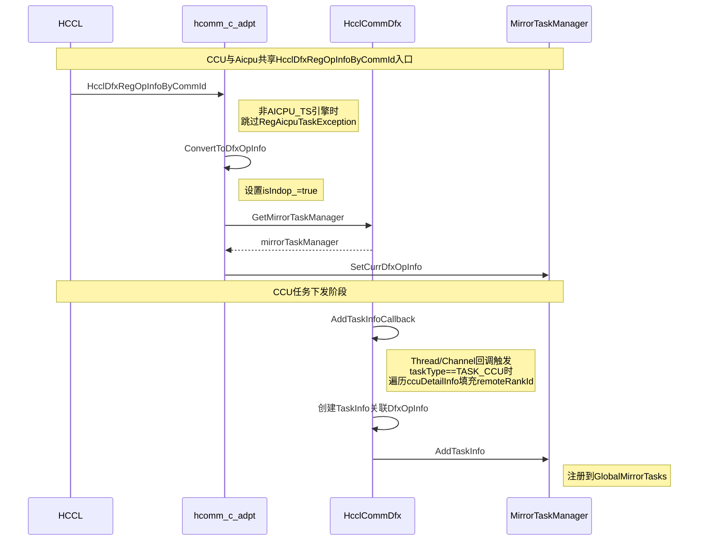
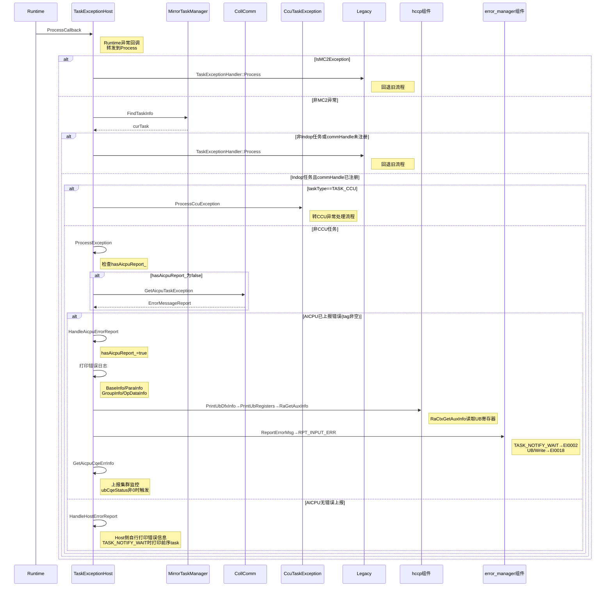
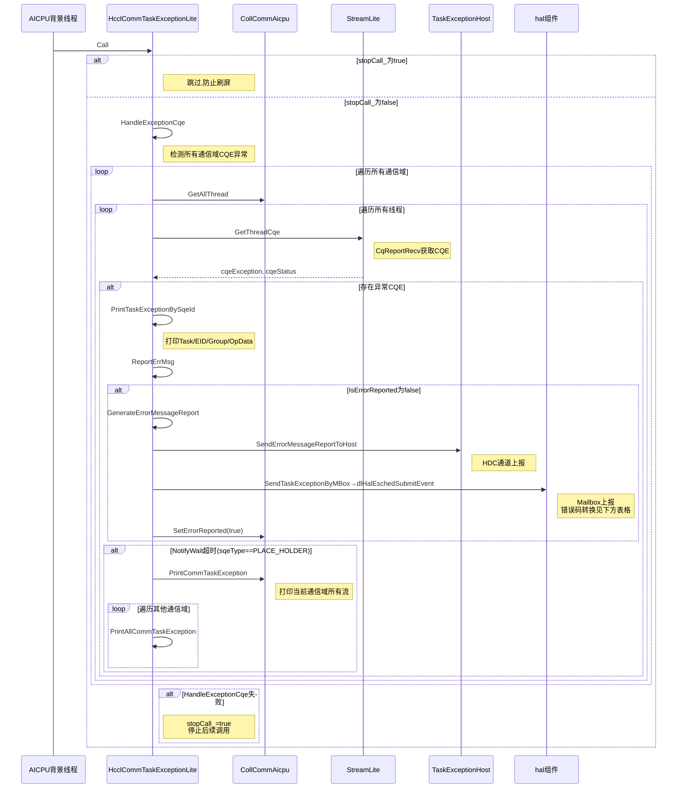
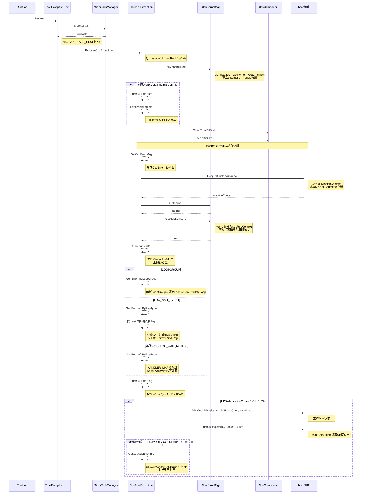
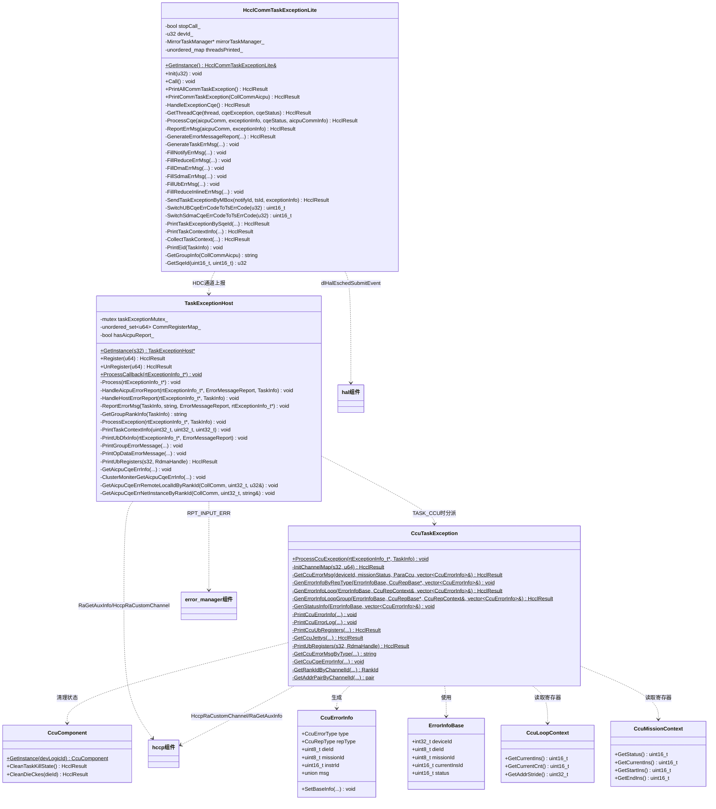

# taskException 模块代码解析

## 功能描述

taskException 模块是 HCCL 集合通信库中的 **DFX（Design for eXcellence）异常诊断子系统**，负责在集合通信任务执行失败时进行异常捕获、错误信息解析、诊断日志打印和错误上报。该模块横跨 Host 侧和 AICPU 侧两个运行环境：

- **Host 侧**：接收 Runtime 下发的异常回调，根据任务类型分发到不同的异常处理流程（通用任务异常 / CCU 任务异常），完成 AICPU 错误信息读取、UB DFX 寄存器信息打印、集群监控错误上报等。
- **AICPU 侧**：以守护线程方式定期检测各通信域流上的 CQE（Completion Queue Entry）异常，完成异常 CQE 解析、错误信息组织、通过 HDC 通道上报到 Host 侧、通过 Mailbox 通知 TSFW。

核心能力包括：

1. 向 Runtime 注册/注销异常回调函数
2. 基于 GlobalMirrorTasks 查找异常 TaskInfo
3. 通过 HDC 通道从 AICPU 侧读取 ErrorMessageReport
4. 解析 CCU（Cube Compute Unit）任务异常，基于 CcuRep 指令表示体系还原出错指令上下文
5. 打印 UB DFX 寄存器信息辅助硬件诊断
6. 向集群监控上报 CQE 错误信息
7. 打印异常任务前序上下文（最多 50 条 task 信息）

---

## 目录描述

```text
taskException/
├── host/                                    # Host 侧异常处理
│   ├── hcclCommTaskException.h              # TaskExceptionHost / TaskExceptionHostManager 类声明
│   ├── hcclCommTaskException.cc             # Host 侧通用异常处理实现 + 回调注册管理
│   ├── ccuTaskException.h                   # CcuTaskException 类声明
│   ├── ccuTaskException.cc                  # CCU 任务异常处理实现（指令解析、寄存器读取、错误信息生成）
│   └── ccu_error_info_v1.h                  # CCU 错误信息数据结构定义（CcuErrorInfo、CcuLoopContext、CcuMissionContext 等）
└── aicpu/                                   # AICPU 侧异常处理
    ├── hcclCommTaskExceptionLite.h          # HcclCommTaskExceptionLite 类声明
    └── hcclCommTaskExceptionLite.cc         # AICPU 侧异常检测、CQE 解析、错误上报实现
```

### 文件间关系

| 文件 | 功能 | 依赖关系 |
|------|------|----------|
| `hcclCommTaskException.h/.cc` | Host 侧主入口，注册 Runtime 异常回调，分发到通用/CCU 异常处理 | 依赖 `ccuTaskException.h` 处理 CCU 类型异常；依赖 `global_mirror_tasks.h` 查找 TaskInfo；通过回调从 AICPU 侧获取 ErrorMessageReport |
| `ccuTaskException.h/.cc` | CCU 任务异常专用处理，解析 CcuRep 指令表示、读取硬件寄存器 | 依赖 `ccu_error_info_v1.h` 的数据结构；依赖 `ccu_kernel_mgr.h` 获取 CcuRepContext；依赖 `ccu_urma_channel.h` 获取通道信息 |
| `ccu_error_info_v1.h` | CCU 错误信息数据结构定义 | 被 `ccuTaskException.h/.cc` 引用；依赖 `ccu_rep_type_v1.h` 定义 CcuRepType 枚举 |
| `hcclCommTaskExceptionLite.h/.cc` | AICPU 侧守护线程，检测 CQE 异常并上报 Host | 依赖 `coll_comm_aicpu.h` 获取 AICPU 通信域；依赖 `error_message_v2.h` 组织 ErrorMessageReport 并通过 HDC 上报 Host |

### TaskException文件交互



---

## 流程描述

### 注册流程

#### Aicpu模式Host侧注册流程



#### Aicpu模式Device侧注册流程



#### CCU模式注册流程



### 异常处理流程

#### Aicpu模式Host侧异常处理流程



#### Aicpu模式Device侧异常处理流程



**SendTaskExceptionByMBox 错误码转换表**（源码：`hcclCommTaskExceptionLite.cc:429-435`，常量定义：`hcomm_task_scheduler_error.h`）

| CQE sqeType | CQE errorCode | TS 错误码 | 值 | 说明 |
|-------------|--------------|-----------|-----|------|
| UB (sqeType=9) | 0x02 | TS_ERROR_HCCL_OP_UB_DDRC_FAILED | 0x3ea | UB本端返回ERROR |
| UB (sqeType=9) | 0x03 | TS_ERROR_HCCL_OP_UB_POISON_FAILED | 0x3eb | UB远端返回ERROR |
| UB (sqeType=9) | 0x05 | TS_ERROR_HCCL_OP_UB_LINK_FAILED | 0x3ec | UB网络异常，taack超时 |
| UB (sqeType=9) | 其他 | TS_ERROR_HCCL_OTHER_ERROR | 0x223 | UB其他错误 |
| SDMA (sqeType=11) | 0x09 | TS_ERROR_SDMA_LINK_ERROR | 0x222 | SDMA写拷贝超时代答或地址译码错误 |
| SDMA (sqeType=11) | 0x0a | TS_ERROR_SDMA_POISON_ERROR | 0x221 | SDMA读拷贝超时代答或读HBM返回ERROR |
| SDMA (sqeType=11) | 0x08 | TS_ERROR_SDMA_DDRC_ERROR | 0x220 | SDMA读HBM返回ERROR |
| SDMA (sqeType=11) | 其他 | TS_ERROR_HCCL_OTHER_ERROR | 0x223 | SDMA其他错误 |
| 其他sqeType | - | TS_ERROR_HCCL_OTHER_ERROR | 0x223 | 非UB/SDMA错误 |

#### CCU模式异常处理流程



---

## 接口描述（类图）



---

## 接口描述

### TaskExceptionHost

| 接口 | 类型 | 参数 | 返回值 | 功能说明 |
|------|------|------|--------|----------|
| `GetInstance(s32)` | 公有静态 | [in] deviceLogicID | `TaskExceptionHost*` | 获取指定设备的异常处理器，最大支持 65 个设备 |
| `Register(u64)` | 公有 | [in] commHandle | `HcclResult` | 将 commHandle 写入 CommRegisterMap_；首个 comm 注册时调用 `aclrtSetExceptionInfoCallback(ProcessCallback)` 向 RTS 注册异常回调 |
| `UnRegister(u64)` | 公有 | [in] commHandle | `HcclResult` | 从 CommRegisterMap_ 移除 commHandle；最后一个 comm 注销时将回调设为 nullptr |
| `ProcessCallback(rtExceptionInfo_t*)` | 公有静态 | [in] exceptionInfo | void | Runtime 异常回调入口，通过 GetInstance 获取处理器后转发到 Process |
| `HandleAicpuErrorReport(rtExceptionInfo_t*, const ErrorMessageReport&, const TaskInfo&)` | 私有 | [in] exceptionInfo, [in] errorMessage, [in] taskInfo | void | 处理 AICPU 侧已上报的错误：打印 BaseInfo/ParaInfo/GroupInfo/OpDataInfo，调用 PrintUbDfxInfo、ReportErrorMsg，ubCqeStatus 非零时调用 GetAicpuCqeErrInfo |
| `HandleHostErrorReport(rtExceptionInfo_t*, const TaskInfo&)` | 私有 | [in] exceptionInfo, [in] taskInfo | void | Host 侧自行处理异常：TASK_NOTIFY_WAIT 时打印前序 task 上下文并上报 EI0002，打印集群监控错误信息 |
| `ReportErrorMsg(const TaskInfo&, const string&, const ErrorMessageReport&, rtExceptionInfo_t*)` | 私有 | [in] exceptionTaskInfo, [in] groupRankContent, [in] errorMessage, [in] exceptionInfo | void | 根据任务类型上报不同错误码：TASK_NOTIFY_WAIT→EI0002，UB/Write 类型→EI0018 |
| `ProcessException(rtExceptionInfo_t*, const TaskInfo&)` | 私有 | [in] exceptionInfo, [in] taskInfo | void | 通用异常处理入口：检查 hasAicpuReport_，未上报时通过 CollComm::GetAicpuTaskException 获取 ErrorMessageReport，分派到 HandleAicpuErrorReport 或 HandleHostErrorReport |
| `PrintTaskContextInfo(uint32_t, uint32_t, uint32_t)` | 私有 | [in] deviceId, [in] streamId, [in] taskId | void | 打印异常任务前最多 50 条前序 task 上下文信息 |
| `PrintUbDfxInfo(rtExceptionInfo_t*, const ErrorMessageReport&)` | 私有 | [in] exceptionInfo, [in] errorMessage | void | 针对 UB 类型任务（TASK_WRITE_WITH_NOTIFY/TASK_UB 等）打印 UB CQE 状态和 EID 信息，并读取 UB DFX 寄存器 |
| `PrintUbRegisters(s32, RdmaHandle)` | 私有 | [in] devLogicId, [in] rdmaHandle | `HcclResult` | 通过 RaGetAuxInfo 读取并打印 UB DFX 寄存器信息 |
| `GetGroupRankInfo(const TaskInfo&)` | 私有 | [in] taskInfo | string | 从 TaskInfo 中获取 group/rankSize/rankId 信息 |
| `GetAicpuCqeErrRemoteLocalIdByRankId(CollComm*, uint32_t, u32&)` | 私有 | [in] collComm, [in] rankid, [out] remoteLocalId | void | 通过 RankGraph 获取远端 rank 对应的 LocalId |
| `GetAicpuCqeErrNetInstanceByRankId(CollComm*, uint32_t, string&)` | 私有 | [in] collComm, [in] rankid, [out] netInstanceId | void | 通过 RankGraph 获取远端 rank 对应的 NetInstanceId |

### CcuTaskException

| 接口 | 类型 | 参数 | 返回值 | 功能说明 |
|------|------|------|--------|----------|
| `ProcessCcuException(const rtExceptionInfo_t*, const TaskInfo&)` | 公有静态 | [in] exceptionInfo, [in] taskInfo | void | CCU 任务异常处理主入口，初始化通道映射、遍历 Mission、打印错误和寄存器、清理 TaskKill 状态 |
| `InitChannelMap(s32, u64)` | 私有静态 | [in] deviceId, [in] ccuKernelHandle | `HcclResult` | 初始化 channelId→channelHandle 全局映射 `g_channelIdToHandle` |
| `GetCcuErrorMsg(int32_t, uint16_t, const ParaCcu&, vector<CcuErrorInfo>&)` | 私有静态 | [in] deviceId, [in] missionStatus, [in] ccuTaskParam, [out] errorInfo | `HcclResult` | 获取 CCU 错误信息核心方法：读取 MissionContext，查找异常 Rep，分派到不同的 GenErrorInfo 方法 |
| `GenErrorInfoByRepType(const ErrorInfoBase&, shared_ptr<CcuRepBase>, vector<CcuErrorInfo>&)` | 私有静态 | [in] baseInfo, [in] repBase, [out] errorInfo | void | 根据 CcuRepType 分派到对应的 GenErrorInfo 方法（使用 HANDLER_MAP 函数表） |
| `GenErrorInfoLoop(const ErrorInfoBase&, CcuRepContext&, vector<CcuErrorInfo>&)` | 私有静态 | [in] baseInfo, [in] ctx, [out] errorInfo | `HcclResult` | 解析 Loop 类型异常：读取 LoopContext 寄存器，递归解析 Loop 内的 Rep |
| `GenErrorInfoLoopGroup(const ErrorInfoBase&, shared_ptr<CcuRepBase>, CcuRepContext&, vector<CcuErrorInfo>&)` | 私有静态 | [in] baseInfo, [in] repBase, [in] ctx, [out] errorInfo | `HcclResult` | 解析 LoopGroup 类型异常：展开所有 Loop 并逐个解析 |
| `PrintCcuUbRegisters(const vector<CcuErrorInfo>&, s32, const TaskInfo&)` | 私有静态 | [in] errorInfos, [in] devLogicId, [in] taskInfo | `HcclResult` | 获取 CCU Jetty 状态，对错误 Jetty 打印 UB 寄存器 |
| `GetCcuJettys(const CcuErrorInfo&, pair<CcuChannelInfo, vector<CcuJetty*>>&)` | 私有静态 | [in] errorInfo, [out] ctx | `HcclResult` | 从 CcuErrorInfo 中获取 channelId，通过 channel→endpoint→ctxPool 链路获取 Jetty |
| `GetCcuCqeErrorInfo(const CcuErrorInfo&, const TaskInfo&, u32, uint8_t)` | 私有静态 | [in] ccuErrorInfo, [in] taskInfo, [in] locDeviceId, [in] missionStatus | void | 通过 channelId 获取 remoteRankId 和 NetInstanceId，调用 ClusterMoniterGetCcuCqeErrInfo 上报集群监控 |

### HcclCommTaskExceptionLite

| 接口 | 类型 | 参数 | 返回值 | 功能说明 |
|------|------|------|--------|----------|
| `GetInstance()` | 公有静态 | 无 | `HcclCommTaskExceptionLite&` | 获取单例实例 |
| `Init(u32)` | 公有 | [in] devId | void | 初始化设备ID |
| `Call()` | 公有 | 无 | void | 守护线程回调入口，调用 HandleExceptionCqe；失败后设置 stopCall_ 防止刷屏 |
| `HandleExceptionCqe()` | 私有 | 无 | `HcclResult` | 遍历所有通信域的所有线程，检测 CQE 异常并处理 |
| `GetThreadCqe(Thread*, rtLogicCqReport_t&, CqeStatus&)` | 私有 | [in] thread, [out] cqeException, [out] cqeStatus | `HcclResult` | 通过 CqReportRecv 获取指定线程的 CQE 异常信息 |
| `ProcessCqe(CollCommAicpu*, const rtLogicCqReport_t&, const CqeStatus&, const vector<pair<string,CollCommAicpuMgr*>>&)` | 私有 | [in] aicpuComm, [in] exceptionInfo, [in] cqeStatus, [in] aicpuCommInfo | `HcclResult` | 处理 CQE 异常：打印 TaskException + 上报 Host + NotifyWait 超时时打印全通信域信息 |
| `ReportErrMsg(CollCommAicpu*, const rtLogicCqReport_t&)` | 私有 | [in] aicpuComm, [in] exceptionInfo | `HcclResult` | 检查 IsErrorReported，未上报时生成 ErrorMessageReport 通过 HDC 上报 Host，并通过 Mailbox 通知 TSFW，然后 SetErrorReported(true) |
| `GenerateErrorMessageReport(CollCommAicpu*, const TaskInfo&, const rtLogicCqReport_t&, ErrorMessageReport&)` | 私有 | [in] aicpuComm, [in] taskInfo, [in] exceptionInfo, [out] errMsgInfo | `HcclResult` | 根据任务信息填充 ErrorMessageReport 的公共字段，然后调用 GenerateTaskErrMsg 填充任务类型特定字段 |
| `GenerateTaskErrMsg(const TaskInfo&, ErrorMessageReport&, const rtLogicCqReport_t&)` | 私有 | [in] taskInfo, [out] errMsgInfo, [in] exceptionInfo | void | 根据 taskType 分派到 FillNotifyErrMsg/FillReduceErrMsg/FillDmaErrMsg/FillUbErrMsg/FillSdmaErrMsg/FillReduceInlineErrMsg |
| `FillNotifyErrMsg(const TaskInfo&, ErrorMessageReport&)` | 私有 | [in] taskInfo, [out] errMsgInfo | void | 填充 NOTIFY_WAIT/NOTIFY_RECORD 类型的 notifyId 和 notifyValue |
| `FillReduceErrMsg(const TaskInfo&, ErrorMessageReport&, const rtLogicCqReport_t&)` | 私有 | [in] taskInfo, [out] errMsgInfo, [in] exceptionInfo | void | 填充 UB_REDUCE_INLINE/WRITE_REDUCE_WITH_NOTIFY 类型的 reduceOp、notifyId、locEid、rmtEid、ubCqeStatus 等 |
| `FillDmaErrMsg(const TaskInfo&, ErrorMessageReport&, const rtLogicCqReport_t&)` | 私有 | [in] taskInfo, [out] errMsgInfo, [in] exceptionInfo | void | 填充 UB_INLINE_WRITE/WRITE_WITH_NOTIFY 类型，内部调用 FillUbErrMsg |
| `FillUbErrMsg(const TaskInfo&, ErrorMessageReport&, const rtLogicCqReport_t&)` | 私有 | [in] taskInfo, [out] errMsgInfo, [in] exceptionInfo | void | 填充 UB 类型的 locEid、rmtEid、ubCqeStatus、linkType、size 等 |
| `FillSdmaErrMsg(const TaskInfo&, ErrorMessageReport&)` | 私有 | [in] taskInfo, [out] errMsgInfo | void | 填充 SDMA 类型的 linkType、size、srcAddr、dstAddr |
| `FillReduceInlineErrMsg(const TaskInfo&, ErrorMessageReport&)` | 私有 | [in] taskInfo, [out] errMsgInfo | void | 填充 REDUCE_INLINE 类型的 reduceOp |
| `SendTaskExceptionByMBox(u32, u32, const rtLogicCqReport_t&)` | 私有 | [in] notifyId, [in] tsId, [in] exceptionInfo | `HcclResult` | 通过 Mailbox 向 TSFW 上报任务异常事件，包含错误码转换（UB/SDMA 错误码→TS 错误码） |
| `SwitchUBCqeErrCodeToTsErrCode(u32)` | 私有 | [in] cqeErrCode | `uint16_t` | UB CQE 错误码转 TS 错误码（详见 3.2.2 表格） |
| `SwitchSdmaCqeErrCodeToTsErrCode(u32)` | 私有 | [in] cqeErrCode | `uint16_t` | SDMA CQE 错误码转 TS 错误码（详见 3.2.2 表格） |
| `PrintAllCommTaskException()` | 公有 | 无 | `HcclResult` | 打印所有通信域的所有 Task 异常信息 |
| `PrintCommTaskException(CollCommAicpu*)` | 公有 | [in] aicpuComm | `HcclResult` | 打印指定通信域所有线程的 Task 异常信息 |
| `PrintTaskExceptionBySqeId(CollCommAicpu*, u32, u32)` | 私有 | [in] aicpuComm, [in] sqId, [in] sqeId | `HcclResult` | 打印指定 sqId/sqeId 的 Task 异常信息：BaseInfo/ParaInfo、EID、GroupInfo、OpData/TaskContext |
| `PrintTaskContextInfo(CollCommAicpu*, u32, u32)` | 私有 | [in] aicpuComm, [in] sqId, [in] taskId | `HcclResult` | 打印异常 task 前最多 50 条前序 task 上下文信息（按 opIndex 分段打印） |
| `CollectTaskContext(CollCommAicpu*, u32, u32, vector<TaskInfo*>&)` | 私有 | [in] aicpuComm, [in] sqId, [in] taskId, [out] taskContext | `HcclResult` | 从 MirrorTaskManagerLite 的队列中收集异常 task 前最多 50 条 task 信息 |
| `PrintEid(const TaskInfo&)` | 私有 | [in] taskInfo | void | UB 类型任务打印 localEid 和 remoteEid |
| `GetGroupInfo(CollCommAicpu*)` | 私有 | [in] aicpuComm | string | 获取通信域的 group/rankSize/localRank 信息 |
| `GetSqeId(uint16_t, uint16_t)` | 私有 | [in] taskId, [in] streamId | `u32` | 将 taskId 和 streamId 组合为 sqeId |

### 全局回调注册接口

| 接口 | 参数 | 功能说明 |
|------|------|----------|
| `RegisterGetAicpuCqeErrInfoCallBackHcomm(callback)` | AICPU CQE 错误信息回调 | 注册 AICPU CQE 错误信息上报到集群监控的回调 |
| `RegisterAicpuGetErrStatusVecCallBack(callback)` | AICPU 错误状态向量回调 | 注册获取 AICPU 侧异常设备状态列表的回调 |
| `RegisterGetCcuCqeErrInfoCallBackHcomm(callback)` | CCU CQE 错误信息回调 | 注册 CCU CQE 错误信息上报到集群监控的回调 |
| `RegisterCcuGetErrStatusVecCallBack(callback)` | CCU 错误状态向量回调 | 注册获取 CCU 侧异常设备状态列表的回调 |

---

## 使用限制

### 支持的场景

| 芯片 | 模式 | Host 侧 | AICPU 侧 | 说明 |
|------|------|---------|----------|------|
| Ascend 950PR/Ascend 950DT | AICPU | 支持 | 支持 | Indop 任务走新流程，非 Indop 任务回退 legacy TaskExceptionHandler |
| Ascend 950PR/Ascend 950DT | CCU | 支持 | 不涉及 | TASK_CCU 类型由 CcuTaskException 处理 |
| Ascend 950PR/Ascend 950DT | MC2 | 回退 legacy | 不涉及 | 回退至 legacy 目录下的 TaskExceptionHandler |

### 规格约束

1. **设备数量限制**：最大支持 65 个设备（`MAX_MODULE_DEVICE_NUM_V2 = 65`），`TaskExceptionHostManager::GetHandler` 在 devId >= 65 时返回 nullptr
2. **CCU 消息长度**：CCU 传输长度不能超过 256MB（`CCU_MSG_256MB_LEN`），超出时打印警告
3. **AICPU 重复上报防护**：Host 侧通过 `hasAicpuReport_` 标志位防止同一 TaskExceptionHost 重复处理 AICPU 上报的错误；AICPU 侧通过 `CollCommAicpu::IsErrorReported()` 标志位防止同一通信域重复上报
4. **Host 侧 comm 注册管理**：通过 `CommRegisterMap_` 管理 commHandle 注册，Process 时校验 commHandle 是否已注册，最后一个 comm 注销时清除 RTS 回调
4. **AICPU 侧刷屏防护**：`HcclCommTaskExceptionLite` 在 `HandleExceptionCqe` 失败后设置 `stopCall_=true`，停止后续调用
5. **CQE 错误信息获取**：CCU 侧通过 `isGetCqeErrInfo` 原子标志位避免重复获取 CQE 错误信息
6. **集群监控上报限制**：异常设备信息最多列出 3 个（`maxListSize = 3`）
7. **任务上下文打印限制**：最多打印异常 task 前 50 条 task 信息（`TASK_CONTEXT_SIZE = 50`），单次打印长度不超过 `TASK_CONTEXT_INFO_SIZE`
8. **CCU Mission 数量**：当前 `ccuMissionNum` 为 1，仅处理单个 Mission 异常
9. **CCU 指令回溯限制**：打印出错指令前最多 10 条指令（`loopUpInstrNum = 10`）
10. **CCU Loop 展开**：Loop 内的指令通过 `GenErrorInfoLoop` 递归展开，LoopGroup 通过 `GenErrorInfoLoopGroup` 展开所有 Loop
11. **错误码转换**：AICPU 侧 UB/SDMA 错误码需转换为 TS 错误码后才能通过 Mailbox 上报，未识别的错误码统一转为 `TS_ERROR_HCCL_OTHER_ERROR`
12. **线程安全**：`g_communicatorCallbackMapV2` 和 `g_channelIdToHandle` 均通过 mutex 保护并发访问
