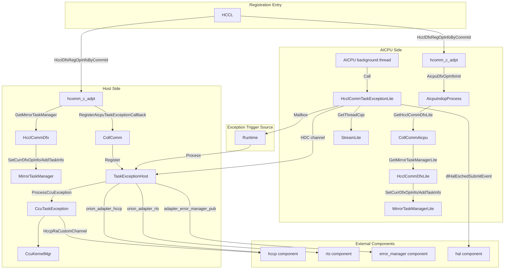
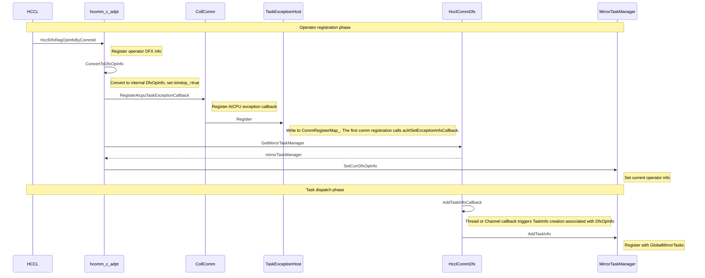
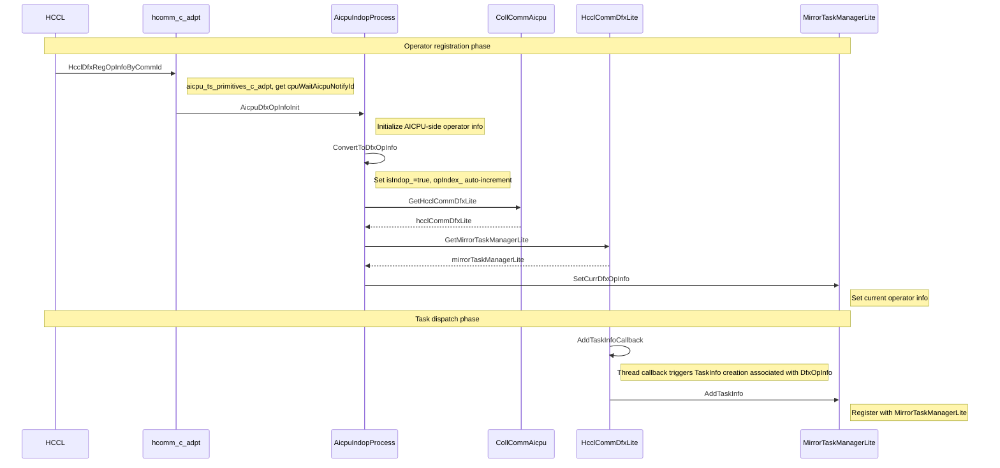
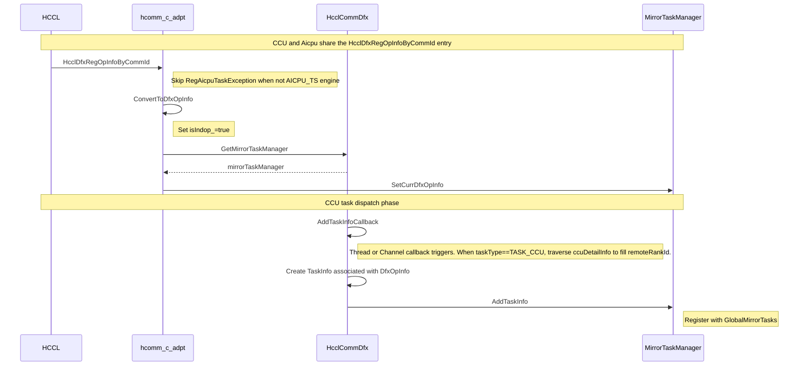
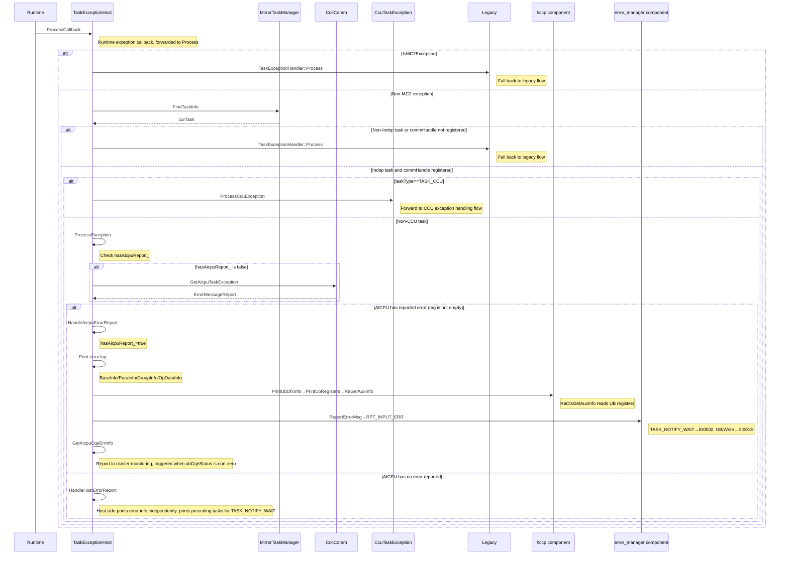
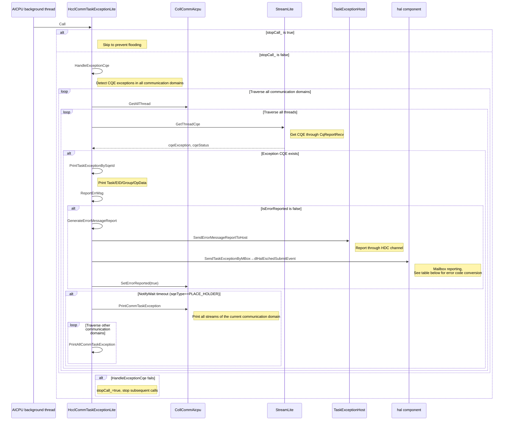
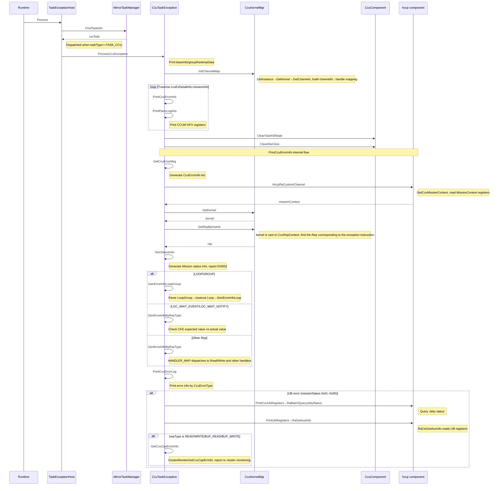
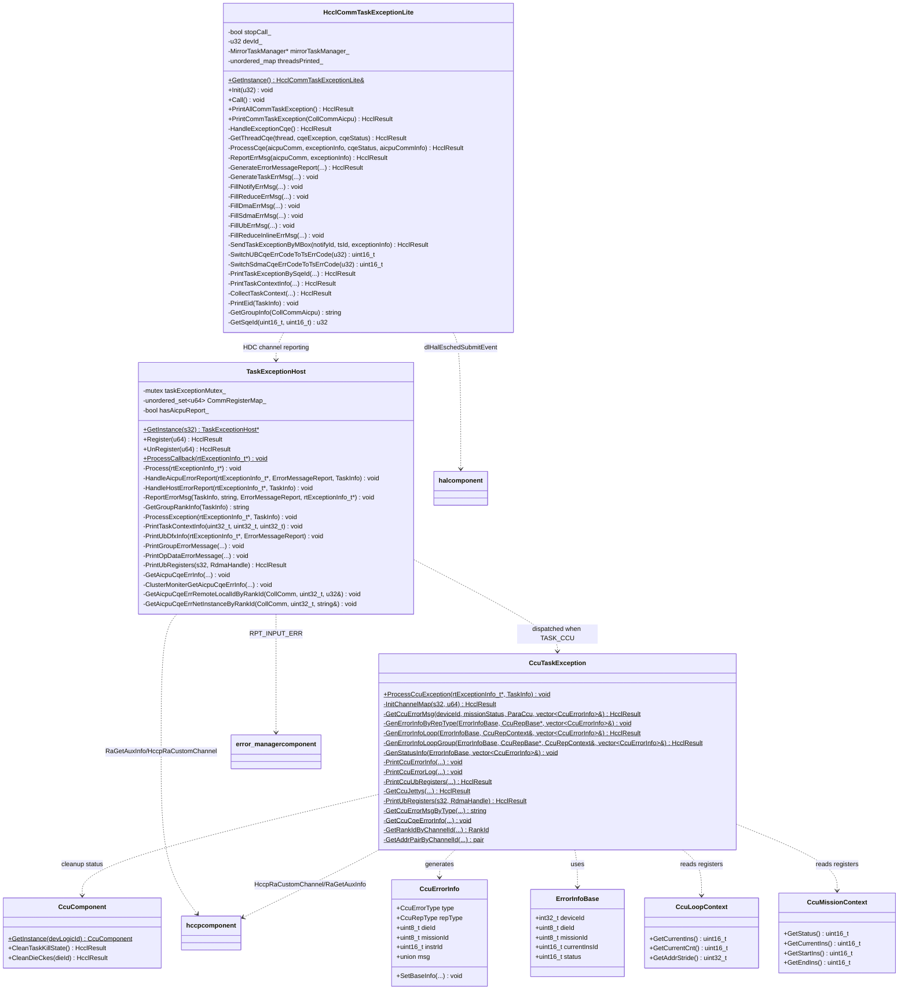

# taskException Module Code Analysis

## Feature Description

The taskException module is the **DFX (Design for eXcellence) exception diagnosis subsystem** in the HCCL collective communication library. It is responsible for exception capture, error information parsing, diagnostic log printing, and error reporting when collective communication tasks fail to execute. This module spans two runtime environments: the Host side and the AICPU side.

- **Host side**: Receives exception callbacks from the Runtime, distributes them to different exception handling flows based on task type (general task exception or CCU task exception), reads AICPU error information, prints UB DFX register information, and reports cluster monitoring errors.
- **AICPU side**: Runs as a daemon thread that periodically checks for CQE (Completion Queue Entry) exceptions on each communication domain stream. It parses exception CQEs, organizes error information, reports to the Host side through the HDC channel, and notifies TSFW through Mailbox.

Core capabilities include:

1. Registering and unregistering exception callback functions with the Runtime
2. Searching for abnormal TaskInfo based on GlobalMirrorTasks
3. Reading ErrorMessageReport from the AICPU side through the HDC channel
4. Parsing CCU (Cube Compute Unit) task exceptions and restoring the error instruction context based on the CcuRep instruction representation system
5. Printing UB DFX register information for hardware diagnostics
6. Reporting CQE error information to cluster monitoring
7. Printing the context of up to 50 preceding tasks before the exception task

---

## Directory Description

```text
taskException/
├── host/                                    # Host-side exception handling
│   ├── hcclCommTaskException.h              # TaskExceptionHost / TaskExceptionHostManager class declarations
│   ├── hcclCommTaskException.cc             # Host-side general exception handling implementation + callback registration management
│   ├── ccuTaskException.h                   # CcuTaskException class declaration
│   ├── ccuTaskException.cc                  # CCU task exception handling implementation (instruction parsing, register reading, error information generation)
│   └── ccu_error_info_v1.h                  # CCU error information data structure definitions (CcuErrorInfo, CcuLoopContext, CcuMissionContext, and so on)
└── aicpu/                                   # AICPU-side exception handling
    ├── hcclCommTaskExceptionLite.h          # HcclCommTaskExceptionLite class declaration
    └── hcclCommTaskExceptionLite.cc         # AICPU-side exception detection, CQE parsing, and error reporting implementation
```

### File Relationships

| File | Function | Dependencies |
|------|------|----------|
| `hcclCommTaskException.h/.cc` | Host-side main entry point, registers Runtime exception callbacks, distributes to general or CCU exception handling | Depends on `ccuTaskException.h` for CCU type exception handling; depends on `global_mirror_tasks.h` for finding TaskInfo; obtains ErrorMessageReport from the AICPU side through callbacks |
| `ccuTaskException.h/.cc` | CCU task exception-specific handling, parses CcuRep instruction representation, reads hardware registers | Depends on data structures in `ccu_error_info_v1.h`; depends on `ccu_kernel_mgr.h` for CcuRepContext; depends on `ccu_urma_channel.h` for channel information |
| `ccu_error_info_v1.h` | CCU error information data structure definitions | Referenced by `ccuTaskException.h/.cc`; depends on `ccu_rep_type_v1.h` for the CcuRepType enum definition |
| `hcclCommTaskExceptionLite.h/.cc` | AICPU-side daemon thread, detects CQE exceptions and reports to Host | Depends on `coll_comm_aicpu.h` for the AICPU communication domain; depends on `error_message_v2.h` for organizing ErrorMessageReport and reporting to the Host through HDC |

### TaskException File Interaction



---

## Flow Description

### Registration Flow

#### Aicpu Mode Host-Side Registration Flow



#### Aicpu Mode Device-Side Registration Flow



#### CCU Mode Registration Flow



### Exception Handling Flow

#### Aicpu Mode Host-Side Exception Handling Flow



#### Aicpu Mode Device-Side Exception Handling Flow



**SendTaskExceptionByMBox Error Code Conversion Table** (Source: `hcclCommTaskExceptionLite.cc:429-435`, constants defined in: `hcomm_task_scheduler_error.h`)

| CQE sqeType | CQE errorCode | TS Error Code | Value | Description |
|-------------|--------------|-----------|-----|------|
| UB (sqeType=9) | 0x02 | TS_ERROR_HCCL_OP_UB_DDRC_FAILED | 0x3ea | UB local side returns ERROR |
| UB (sqeType=9) | 0x03 | TS_ERROR_HCCL_OP_UB_POISON_FAILED | 0x3eb | UB remote side returns ERROR |
| UB (sqeType=9) | 0x05 | TS_ERROR_HCCL_OP_UB_LINK_FAILED | 0x3ec | UB network exception, taack timeout |
| UB (sqeType=9) | Other | TS_ERROR_HCCL_OTHER_ERROR | 0x223 | UB other error |
| SDMA (sqeType=11) | 0x09 | TS_ERROR_SDMA_LINK_ERROR | 0x222 | SDMA write copy timeout acknowledgment or address decoding error |
| SDMA (sqeType=11) | 0x0a | TS_ERROR_SDMA_POISON_ERROR | 0x221 | SDMA read copy timeout acknowledgment or read HBM returns ERROR |
| SDMA (sqeType=11) | 0x08 | TS_ERROR_SDMA_DDRC_ERROR | 0x220 | SDMA read HBM returns ERROR |
| SDMA (sqeType=11) | Other | TS_ERROR_HCCL_OTHER_ERROR | 0x223 | SDMA other error |
| Other sqeType | - | TS_ERROR_HCCL_OTHER_ERROR | 0x223 | Non-UB or SDMA error |

#### CCU Mode Exception Handling Flow



---

## Interface Description (Class Diagram)



---

## Interface Description

### TaskExceptionHost

| Interface | Type | Parameters | Return Value | Description |
|------|------|------|--------|----------|
| `GetInstance(s32)` | Public static | [in] deviceLogicID | `TaskExceptionHost*` | Gets the exception handler for the specified device. Supports up to 65 devices. |
| `Register(u64)` | Public | [in] commHandle | `HcclResult` | Writes commHandle to CommRegisterMap_. The first comm registration calls `aclrtSetExceptionInfoCallback(ProcessCallback)` to register the exception callback with RTS. |
| `UnRegister(u64)` | Public | [in] commHandle | `HcclResult` | Removes commHandle from CommRegisterMap_. When the last comm is unregistered, sets the callback to nullptr. |
| `ProcessCallback(rtExceptionInfo_t*)` | Public static | [in] exceptionInfo | void | Runtime exception callback entry point. Obtains the handler through GetInstance and forwards to Process. |
| `HandleAicpuErrorReport(rtExceptionInfo_t*, const ErrorMessageReport&, const TaskInfo&)` | Private | [in] exceptionInfo, [in] errorMessage, [in] taskInfo | void | Handles errors already reported by the AICPU side: prints BaseInfo/ParaInfo/GroupInfo/OpDataInfo, calls PrintUbDfxInfo, ReportErrorMsg. When ubCqeStatus is non-zero, calls GetAicpuCqeErrInfo. |
| `HandleHostErrorReport(rtExceptionInfo_t*, const TaskInfo&)` | Private | [in] exceptionInfo, [in] taskInfo | void | Host-side independent exception handling: prints preceding task context for TASK_NOTIFY_WAIT and reports EI0002, prints cluster monitoring error info. |
| `ReportErrorMsg(const TaskInfo&, const string&, const ErrorMessageReport&, rtExceptionInfo_t*)` | Private | [in] exceptionTaskInfo, [in] groupRankContent, [in] errorMessage, [in] exceptionInfo | void | Reports different error codes based on task type: TASK_NOTIFY_WAIT→EI0002, UB/Write type→EI0018. |
| `ProcessException(rtExceptionInfo_t*, const TaskInfo&)` | Private | [in] exceptionInfo, [in] taskInfo | void | General exception handling entry point: checks hasAicpuReport_, obtains ErrorMessageReport through CollComm::GetAicpuTaskException if not reported, dispatches to HandleAicpuErrorReport or HandleHostErrorReport. |
| `PrintTaskContextInfo(uint32_t, uint32_t, uint32_t)` | Private | [in] deviceId, [in] streamId, [in] taskId | void | Prints up to 50 preceding task context entries before the exception task. |
| `PrintUbDfxInfo(rtExceptionInfo_t*, const ErrorMessageReport&)` | Private | [in] exceptionInfo, [in] errorMessage | void | For UB type tasks (TASK_WRITE_WITH_NOTIFY/TASK_UB, and so on), prints UB CQE status and EID information, and reads UB DFX registers. |
| `PrintUbRegisters(s32, RdmaHandle)` | Private | [in] devLogicId, [in] rdmaHandle | `HcclResult` | Reads and prints UB DFX register information through RaGetAuxInfo. |
| `GetGroupRankInfo(const TaskInfo&)` | Private | [in] taskInfo | string | Gets group/rankSize/rankId information from TaskInfo. |
| `GetAicpuCqeErrRemoteLocalIdByRankId(CollComm*, uint32_t, u32&)` | Private | [in] collComm, [in] rankid, [out] remoteLocalId | void | Gets the LocalId corresponding to the remote rank through RankGraph. |
| `GetAicpuCqeErrNetInstanceByRankId(CollComm*, uint32_t, string&)` | Private | [in] collComm, [in] rankid, [out] netInstanceId | void | Gets the NetInstanceId corresponding to the remote rank through RankGraph. |

### CcuTaskException

| Interface | Type | Parameters | Return Value | Description |
|------|------|------|--------|----------|
| `ProcessCcuException(const rtExceptionInfo_t*, const TaskInfo&)` | Public static | [in] exceptionInfo, [in] taskInfo | void | Main entry point for CCU task exception handling: initializes channel mapping, traverses Missions, prints errors and registers, cleans up TaskKill status. |
| `InitChannelMap(s32, u64)` | Private static | [in] deviceId, [in] ccuKernelHandle | `HcclResult` | Initializes the global channelId→channelHandle mapping `g_channelIdToHandle`. |
| `GetCcuErrorMsg(int32_t, uint16_t, const ParaCcu&, vector<CcuErrorInfo>&)` | Private static | [in] deviceId, [in] missionStatus, [in] ccuTaskParam, [out] errorInfo | `HcclResult` | Core method for obtaining CCU error information: reads MissionContext, finds the exception Rep, dispatches to different GenErrorInfo methods. |
| `GenErrorInfoByRepType(const ErrorInfoBase&, shared_ptr<CcuRepBase>, vector<CcuErrorInfo>&)` | Private static | [in] baseInfo, [in] repBase, [out] errorInfo | void | Dispatches to the corresponding GenErrorInfo method based on CcuRepType (uses HANDLER_MAP function table). |
| `GenErrorInfoLoop(const ErrorInfoBase&, CcuRepContext&, vector<CcuErrorInfo>&)` | Private static | [in] baseInfo, [in] ctx, [out] errorInfo | `HcclResult` | Parses Loop type exceptions: reads LoopContext registers, recursively parses Reps within the Loop. |
| `GenErrorInfoLoopGroup(const ErrorInfoBase&, shared_ptr<CcuRepBase>, CcuRepContext&, vector<CcuErrorInfo>&)` | Private static | [in] baseInfo, [in] repBase, [in] ctx, [out] errorInfo | `HcclResult` | Parses LoopGroup type exceptions: expands all Loops and parses them individually. |
| `PrintCcuUbRegisters(const vector<CcuErrorInfo>&, s32, const TaskInfo&)` | Private static | [in] errorInfos, [in] devLogicId, [in] taskInfo | `HcclResult` | Gets CCU Jetty status and prints UB registers for error Jetties. |
| `GetCcuJettys(const CcuErrorInfo&, pair<CcuChannelInfo, vector<CcuJetty*>>&)` | Private static | [in] errorInfo, [out] ctx | `HcclResult` | Gets channelId from CcuErrorInfo and obtains Jetties through the channel→endpoint→ctxPool chain. |
| `GetCcuCqeErrorInfo(const CcuErrorInfo&, const TaskInfo&, u32, uint8_t)` | Private static | [in] ccuErrorInfo, [in] taskInfo, [in] locDeviceId, [in] missionStatus | void | Gets remoteRankId and NetInstanceId through channelId, calls ClusterMoniterGetCcuCqeErrInfo to report to cluster monitoring. |

### HcclCommTaskExceptionLite

| Interface | Type | Parameters | Return Value | Description |
|------|------|------|--------|----------|
| `GetInstance()` | Public static | None | `HcclCommTaskExceptionLite&` | Gets the singleton instance. |
| `Init(u32)` | Public | [in] devId | void | Initializes the device ID. |
| `Call()` | Public | None | void | Daemon thread callback entry point. Calls HandleExceptionCqe. Sets stopCall_ on failure to prevent flooding. |
| `HandleExceptionCqe()` | Private | None | `HcclResult` | Traverses all threads in all communication domains, detects and handles CQE exceptions. |
| `GetThreadCqe(Thread*, rtLogicCqReport_t&, CqeStatus&)` | Private | [in] thread, [out] cqeException, [out] cqeStatus | `HcclResult` | Gets CQE exception information for the specified thread through CqReportRecv. |
| `ProcessCqe(CollCommAicpu*, const rtLogicCqReport_t&, const CqeStatus&, const vector<pair<string,CollCommAicpuMgr*>>&)` | Private | [in] aicpuComm, [in] exceptionInfo, [in] cqeStatus, [in] aicpuCommInfo | `HcclResult` | Processes CQE exceptions: prints TaskException, reports to Host, prints all communication domain information on NotifyWait timeout. |
| `ReportErrMsg(CollCommAicpu*, const rtLogicCqReport_t&)` | Private | [in] aicpuComm, [in] exceptionInfo | `HcclResult` | Checks IsErrorReported. If not reported, generates ErrorMessageReport, reports to Host through HDC, notifies TSFW through Mailbox, and sets ErrorReported(true). |
| `GenerateErrorMessageReport(CollCommAicpu*, const TaskInfo&, const rtLogicCqReport_t&, ErrorMessageReport&)` | Private | [in] aicpuComm, [in] taskInfo, [in] exceptionInfo, [out] errMsgInfo | `HcclResult` | Fills common fields of ErrorMessageReport based on task information, then calls GenerateTaskErrMsg to fill task-type-specific fields. |
| `GenerateTaskErrMsg(const TaskInfo&, ErrorMessageReport&, const rtLogicCqReport_t&)` | Private | [in] taskInfo, [out] errMsgInfo, [in] exceptionInfo | void | Dispatches to FillNotifyErrMsg/FillReduceErrMsg/FillDmaErrMsg/FillUbErrMsg/FillSdmaErrMsg/FillReduceInlineErrMsg based on taskType. |
| `FillNotifyErrMsg(const TaskInfo&, ErrorMessageReport&)` | Private | [in] taskInfo, [out] errMsgInfo | void | Fills notifyId and notifyValue for NOTIFY_WAIT/NOTIFY_RECORD types. |
| `FillReduceErrMsg(const TaskInfo&, ErrorMessageReport&, const rtLogicCqReport_t&)` | Private | [in] taskInfo, [out] errMsgInfo, [in] exceptionInfo | void | Fills reduceOp, notifyId, locEid, rmtEid, ubCqeStatus, and so on for UB_REDUCE_INLINE/WRITE_REDUCE_WITH_NOTIFY types. |
| `FillDmaErrMsg(const TaskInfo&, ErrorMessageReport&, const rtLogicCqReport_t&)` | Private | [in] taskInfo, [out] errMsgInfo, [in] exceptionInfo | void | Fills for UB_INLINE_WRITE/WRITE_WITH_NOTIFY types. Internally calls FillUbErrMsg. |
| `FillUbErrMsg(const TaskInfo&, ErrorMessageReport&, const rtLogicCqReport_t&)` | Private | [in] taskInfo, [out] errMsgInfo, [in] exceptionInfo | void | Fills locEid, rmtEid, ubCqeStatus, linkType, size, and so on for UB types. |
| `FillSdmaErrMsg(const TaskInfo&, ErrorMessageReport&)` | Private | [in] taskInfo, [out] errMsgInfo | void | Fills linkType, size, srcAddr, dstAddr for SDMA types. |
| `FillReduceInlineErrMsg(const TaskInfo&, ErrorMessageReport&)` | Private | [in] taskInfo, [out] errMsgInfo | void | Fills reduceOp for REDUCE_INLINE types. |
| `SendTaskExceptionByMBox(u32, u32, const rtLogicCqReport_t&)` | Private | [in] notifyId, [in] tsId, [in] exceptionInfo | `HcclResult` | Reports task exception events to TSFW through Mailbox, including error code conversion (UB/SDMA error codes to TS error codes). |
| `SwitchUBCqeErrCodeToTsErrCode(u32)` | Private | [in] cqeErrCode | `uint16_t` | Converts UB CQE error codes to TS error codes. |
| `SwitchSdmaCqeErrCodeToTsErrCode(u32)` | Private | [in] cqeErrCode | `uint16_t` | Converts SDMA CQE error codes to TS error codes. |
| `PrintAllCommTaskException()` | Public | None | `HcclResult` | Prints all Task exception information for all communication domains. |
| `PrintCommTaskException(CollCommAicpu*)` | Public | [in] aicpuComm | `HcclResult` | Prints Task exception information for all threads in the specified communication domain. |
| `PrintTaskExceptionBySqeId(CollCommAicpu*, u32, u32)` | Private | [in] aicpuComm, [in] sqId, [in] sqeId | `HcclResult` | Prints Task exception information for the specified sqId/sqeId: BaseInfo/ParaInfo, EID, GroupInfo, OpData/TaskContext. |
| `PrintTaskContextInfo(CollCommAicpu*, u32, u32)` | Private | [in] aicpuComm, [in] sqId, [in] taskId | `HcclResult` | Prints up to 50 preceding task context entries before the exception task (printed in segments by opIndex). |
| `CollectTaskContext(CollCommAicpu*, u32, u32, vector<TaskInfo*>&)` | Private | [in] aicpuComm, [in] sqId, [in] taskId, [out] taskContext | `HcclResult` | Collects up to 50 task entries before the exception task from the MirrorTaskManagerLite queue. |
| `PrintEid(const TaskInfo&)` | Private | [in] taskInfo | void | Prints localEid and remoteEid for UB type tasks. |
| `GetGroupInfo(CollCommAicpu*)` | Private | [in] aicpuComm | string | Gets the group/rankSize/localRank information of the communication domain. |
| `GetSqeId(uint16_t, uint16_t)` | Private | [in] taskId, [in] streamId | `u32` | Combines taskId and streamId into sqeId. |

### Global Callback Registration Interfaces

| Interface | Parameters | Description |
|------|------|----------|
| `RegisterGetAicpuCqeErrInfoCallBackHcomm(callback)` | AICPU CQE error info callback | Registers the callback for AICPU CQE error information reporting to cluster monitoring. |
| `RegisterAicpuGetErrStatusVecCallBack(callback)` | AICPU error status vector callback | Registers the callback for getting the AICPU-side abnormal device status list. |
| `RegisterGetCcuCqeErrInfoCallBackHcomm(callback)` | CCU CQE error info callback | Registers the callback for CCU CQE error information reporting to cluster monitoring. |
| `RegisterCcuGetErrStatusVecCallBack(callback)` | CCU error status vector callback | Registers the callback for getting the CCU-side abnormal device status list. |

---

## Usage Limitations

### Supported Scenarios

| Chip | Mode | Host Side | AICPU Side | Description |
|------|------|---------|----------|------|
| Ascend 950PR/Ascend 950DT | AICPU | Supported | Supported | Indop tasks use the new flow; non-Indop tasks fall back to legacy TaskExceptionHandler. |
| Ascend 950PR/Ascend 950DT | CCU | Supported | Not applicable | TASK_CCU type is handled by CcuTaskException. |
| Ascend 950PR/Ascend 950DT | MC2 | Fall back to legacy | Not applicable | Falls back to TaskExceptionHandler under the legacy directory. |

### Constraint Specifications

1. **Device count limit**: Supports up to 65 devices (`MAX_MODULE_DEVICE_NUM_V2 = 65`). `TaskExceptionHostManager::GetHandler` returns nullptr when devId >= 65.
2. **CCU message length**: CCU transfer length must not exceed 256MB (`CCU_MSG_256MB_LEN`). A warning is printed when exceeded.
3. **AICPU duplicate report prevention**: The Host side uses the `hasAicpuReport_` flag to prevent the same TaskExceptionHost from repeatedly handling AICPU-reported errors. The AICPU side uses the `CollCommAicpu::IsErrorReported()` flag to prevent duplicate reporting from the same communication domain.
4. **Host-side comm registration management**: Uses `CommRegisterMap_` to manage commHandle registration. The Process callback validates whether the commHandle is registered. The RTS callback is cleared when the last comm is unregistered.
5. **AICPU-side flooding prevention**: `HcclCommTaskExceptionLite` sets `stopCall_=true` after `HandleExceptionCqe` fails, stopping subsequent calls.
6. **CQE error information retrieval**: The CCU side uses the `isGetCqeErrInfo` atomic flag to avoid redundant CQE error information retrieval.
7. **Cluster monitoring report limit**: The abnormal device information list is limited to up to 3 entries (`maxListSize = 3`).
8. **Task context print limit**: Prints up to 50 task entries before the exception task (`TASK_CONTEXT_SIZE = 50`). The single print length does not exceed `TASK_CONTEXT_INFO_SIZE`.
9. **CCU Mission count**: Currently `ccuMissionNum` is 1, only handling a single Mission exception.
10. **CCU instruction backtracking limit**: Prints up to 10 instructions before the error instruction (`loopUpInstrNum = 10`).
11. **CCU Loop expansion**: Instructions within a Loop are recursively expanded through `GenErrorInfoLoop`. LoopGroup expands all Loops through `GenErrorInfoLoopGroup`.
12. **Error code conversion**: AICPU-side UB and SDMA error codes must be converted to TS error codes before reporting through Mailbox. Unrecognized error codes are uniformly converted to `TS_ERROR_HCCL_OTHER_ERROR`.
13. **Thread safety**: `g_communicatorCallbackMapV2` and `g_channelIdToHandle` are both protected by mutexes for concurrent access.
