# Checker 上手指导

本文介绍 Checker 的基本概念和处理流程。[错误码 FAQ](faq/modules/checker_faq.md) 按错误码展开具体场景。

[toc]

## 1 Checker 是什么

Checker 是一个静态验证工具，它不介入算子运行，而是通过读取算子执行后留下的记录，重建执行图并进行静态分析，判断本次算子执行在逻辑上是否正确。
- Checker 输入：算子信息 + 各 Rank 的任务数据 + CCU指令序列
- Checker 输出：校验结论(成功/失败) + 错误日志

---

## 2 Checker 整体流程

### 2.1 关键术语介绍

| 名词 | 说明 |
|------|------|
| 通信域 | 一组通信成员的组合，描述通信范围|
| 通信成员 | 通常称为rank，是参与通信的最小逻辑实体，每个rank都会分配一个唯一标识，即 `rankId`|
| 通信算子 | 一次集合通信操作，例如 `AllReduce`、`AllGather`，针对不同网络拓扑、数据量、硬件资源等场景，通信算子通常会采用不同的通信算法实现 |
| 任务 | Checker 的核心数据结构，描述某个rank一次原子操作的记录，例如内存搬运、Reduce、内存拷贝等 |
| 任务图 | Checker 的核心数据结构，用来表达一个算子执行所生成的任务节点及其依赖关系 |
| 节点 | 任务图上的每个节点即为一个任务 |
| Stream | rank内按顺序执行任务的队列，每个任务内都使用`streamId`记录自己属于哪个队列 |
| 任务类型 | 不同类型的任务的作用不同，例如：执行内存搬运、Reduce、或是同步 |

### 2.2 Checker 处理流程

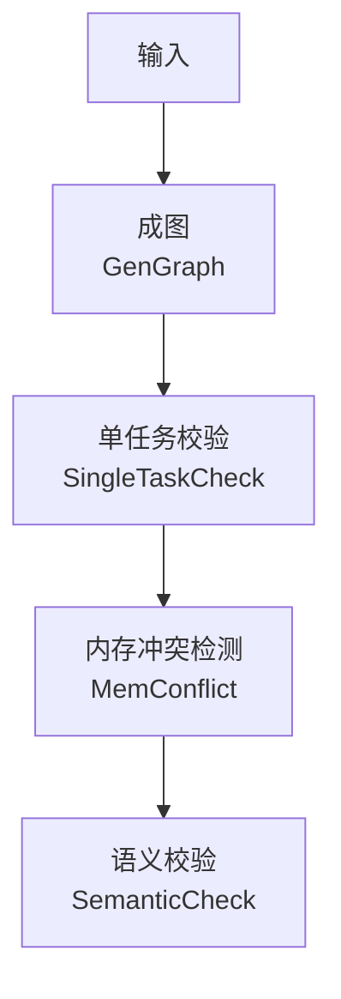

| 阶段 | 作用 |
|------|------|
| 成图 | 基于Checker输入生成任务图，若为CCU模式，会将CCU指令转换为任务图 |
| 单任务校验 | 检查单条任务的内存区间是否合法，并校验从流的头尾结构 |
| 内存冲突检测 | 检查并发任务之间是否存在未保护的内存重叠 |
| 语义校验 | 模拟算子执行过程，验证最终输出是否符合算子预期 |

---

## 3 任务图
任务图是 Checker 的核心数据结构，它用来表达一个算子执行所生成的任务节点及其依赖关系，任务图是在成图阶段基于 Checker 输入生成的

### 3.1 节点与边

任务图上的每个节点即为一个任务，都有明确的任务类型，表示该节点执行的具体操作。常见类型如下：

| 任务类型 | 说明 | 核心字段 |
|---|---|---|
| `TRANS_MEM` | 内存数据搬运 | `srcRankId`, `srcOffset`<br>`dstRankId`, `dstOffset`<br>`len`, `type` |
| `BATCH_TRANS_MEM` | 批量内存数据搬运，一个节点内包含多组 `(src -> dst)` 搬运关系 | `srcs[]`<br>`dsts[]` |
| `REDUCE` | 数据规约 | `srcRankId`, `srcOffset`<br>`dstRankId`, `dstOffset`<br>`type`, `dataCount`, `dataType`, `reduceOp` |
| `BATCH_REDUCE` | 批量数据规约，一个节点内包含多组 `(src -> dst)` 规约关系 | `srcs[][]`<br>`dsts[]`<br>`dataType`, `reduceOp` |
| `RECORD` / `WAIT` | 同步任务，分别表示发出同步信号和等待同步信号 | `srcRankId`（发出方）<br>`dstRankId`（等待方）<br>`notifyId` |

除上述真实执行任务外，任务图中还会补充 `START` / `END` 两类虚拟边界节点。它们不对应实际的数据搬运或计算动作，主要用于表达主图、子图和 Loop 结构的边界。

| 虚拟节点类型 | 支持的 `boundaryType` | 说明 |
|---|---|---|
| `START` | `MAIN_GRAPH`、`CCU_SUB_GRAPH`、`AIV_SUB_GRAPH`、`LOOP` | 起始边界节点。用于标记整个任务图入口，或某个 CCU/AIV 子图、Loop 片段的开始位置 |
| `END` | `CCU_SUB_GRAPH`、`AIV_SUB_GRAPH`、`LOOP` | 结束边界节点。用于标记某个 CCU/AIV 子图、Loop 片段的结束位置，并统一汇聚该边界内的尾节点 |

边表示节点之间的执行先后关系，即一个有向边的尾节点一定在首节点之后执行，边可分为以下两类：

| 边类型 | 说明 |
|--------|------|
| 顺序边 | 同一 stream 内按执行顺序连接的依赖边，如下图示例：`rank0/stream0` 上有两个先后执行的任务，`rank1/stream0` 上有三个先后执行的任务 |
| 同步边 | 同步任务节点间的依赖边，如下图示例：`WAIT` 节点需要等待 `RECORD` 节点的信号然后才能继续执行，所以用一条从 `RECORD` 指向 `WAIT` 的边表示此类依赖关系 |

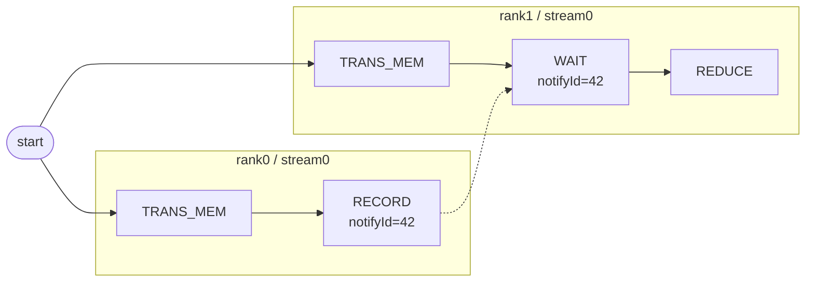

### 3.2 任务图示例

#### 3.2.1 AICPU模式
AICPU 模式下，任务图通常由 `RECORD`、`WAIT` 和 `TRANS_MEM` 这几类节点组合而成。下面给出一个典型的 2-rank、每个 rank 含两条 stream 的 `AllGather` 示例，按实际执行序列展示 stream 内顺序边，并用虚线表示 `RECORD` 到 `WAIT` 的同步依赖。

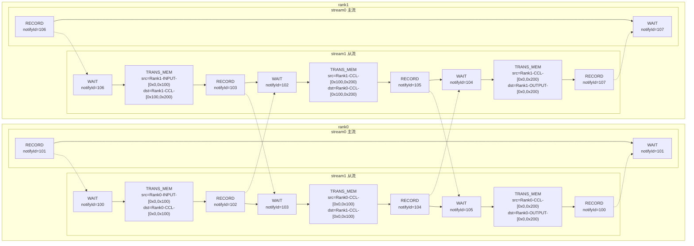

#### 3.2.2 CCU模式
在 CCU 模式下，Checker 会把 CCU 指令展开成 CCU 子图。下面沿用 2-rank `AllReduce` 的数据流，省略了 CCU 子图外部的同步操作，只保留 CCU 子图内部的任务序列。CCU 使用同步字段从 `notifyId` 变为 `cke` / `mask`，中间缓冲区使用的是 CCU 的 `MS` 类型。

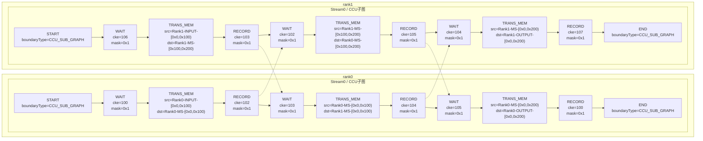

#### 3.2.3 Graphviz 简易可视化
Checker 提供了任务图导出能力，用于把任务图输出成 Graphviz 的 `.dot` 文件。

它导出的内容不只是“有哪些节点”，还会尽量把调试时常用的信息直接放进图里：
- 按 `rank / stream` 排布节点，便于观察同一执行队列上的顺序关系
- 用实线表示普通依赖边，用虚线表示 `RECORD -> WAIT` 这类同步依赖边
- 节点标签中会带上任务类型、`nodeId`、位置信息，以及内存片段、`notifyId` 或 `cke/mask` 等关键字段

使用方式如下：
- Checker 在成图完成后会自动尝试导出该 `.dot` 文件，不需要额外开关
- 导出成功后，可在日志中搜索 `[GraphvizDot]`，日志里会打印最终落盘路径，通常为`hccl_vm_install/data/`
- 输出文件名格式为 `TaskGraph_YYYYMMDDHHMMSS.dot`

> 拿到 `.dot` 文件后，可使用 `Microsoft VS Code` 相关的插件如 `Graphviz Interactive Preview` 来实现即时浏览。


---

## 4. 单任务校验
此阶段主要检查单条任务的内存区间是否合法，并校验从流的头尾结构

### 4.1 内存区间 (MemSlice)

内存搬运与规约类的任务中最重要的信息就是内存区间 (MemSlice)，一个内存区间由以下信息组成：

```
MemSlice = { rankId, type, offset, len }
```

- `rankId` 表示内存属于哪个 rank
- `type` 表示内存类型
  | 内存类型 | 用途 |
  |----------|------|
  | INPUT | 算子输入BUFFER |
  | OUTPUT | 算子输出BUFFER |
  | CCL | CCL_BUFFER |
  | MS_CCU | CCU MS |
- `offset` 和 `len` 共同确定内存访问区间
  - `offset` 表示本次访问在该内存片段上的起始地址
  - `len` 表示本次内存访问的长度
  - 访问区间采用半开表示，即 `[offset, offset + length)` 为本次访问的内存段


单条任务内存区间的校验点如下：
- `offset + length` 不能溢出 `uint64` 上界，否则会报错
- 同一任务内部的多个 MemSlice 在相同 `(rankId, memType)` 下不能有区间重叠，否则会报错
    ```mermaid
    gantt
        title MemSlice 区间对比
        dateFormat x
        axisFormat %L
        tickInterval 100millisecond

        section 合法（不重叠）
        Slice A  0x000-0x400 : 0, 400
        Slice B  0x400-0x800 : 400, 800

        section 违规（重叠）
        Slice A  0x000-0x600 : crit, 0, 600
        Slice B  0x400-0x800 : crit, 400, 800
    ```
- 不同 `type` 是相互独立的地址空间，同一 `offset` 在不同 `type` 下不视为重叠
- `offset + length` 不能越过当前 `type` 地址空间的边界
    ```mermaid
    gantt
        title MemSlice 边界检查
        dateFormat x
        axisFormat %L
        tickInterval 100millisecond

        section 合法（未越界）
        Type Space [0x000,0x800) : 0, 800
        MemSlice   [0x200,0x500) : 200, 500

        section 违规（越界）
        Type Space [0x000,0x800) : 0, 800
        MemSlice   [0x600,0x900) : crit, 600, 900
    ```

### 4.2 从流（slave stream）结构校验

从流用于执行算子的辅助任务，例如数据预搬运。在HCCL编程模型中主流通过同步任务 `RECORD -> WAIT` 触发从流，从流完成后，再通过另一组同步任务通知主流，所以从流必须满足固定的首尾结构：首任务为 `WAIT` && 末任务为 `RECORD`

下图为一个错误示例，标红的节点都是违规节点：
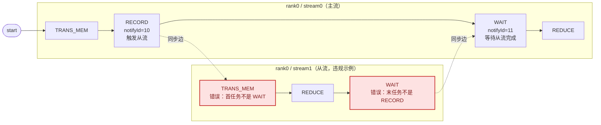

---

## 5. 内存冲突校验

本阶段是校验任务图中是否存在内存冲突的可能，内存冲突是指：同一时刻有多个内存操作访问同一段内存，且至少有一个操作为写操作。发生内存冲突时，冲突的内存段的值是无法确定的，会导致集合通信算子的精度问题。

### 5.1 内存冲突的判定标准

两个内存访问类任务节点同时满足以下三个条件时，会判定为内存冲突：
1. 两个节点可能并发执行 (任务图上两个节点之间不存在路径)
2. 访问的内存地址区间重叠
3. 至少一方是写操作

Checker会高效地校验每一对内存访问类任务节点，保证不发生漏报

### 5.2 内存冲突示例
下图为一个存在内存冲突的任务图示例：

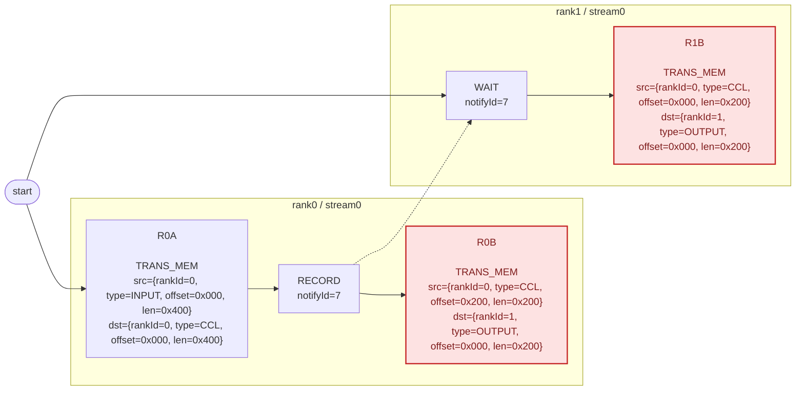

- `R0A` 和 `R0B` 在同一个 stream 上先后执行，不满足并行执行的条件，所以不会发生内存冲突
- `R0A` 和 `R1B` 之间通过同步节点限制了执行顺序，即 `R0A -> R0RECORD -> R1WAIT -> R1B`，所以不会发生内存冲突
- `R0B` 和 `R1B` 之间可以并发，且它们的写内存 `dst` 完全重叠，因此存在内存冲突

### 5.3 冲突日志解读

内存冲突校验的错误日志格式如下：

```text
[ErrorCode: 302] Two tasks may access the same memory range in parallel, and at least one access is a write.
  Conflict memory : rank 0 OUTPUT
  Overlap range    : [0x0,0xc80)
  Conflict task 1:
    node 17, action=write
    access range : [0x0,0xc80)
    task         : [TaskTransMem] node=17, rank=1, stream=0, queue=0, protocol=SDMA, src=rank 1 CCL [0x0,0xc80), dst=rank 0 OUTPUT [0x0,0xc80)
  Conflict task 2:
    node 23, action=write
    access range : [0x0,0xc80)
    task         : [TaskTransMem] node=23, rank=2, stream=0, queue=0, protocol=SDMA, src=rank 2 CCL [0x0,0xc80), dst=rank 0 OUTPUT [0x0,0xc80)
```

日志说明：

| 字段 | 含义 |
|----|------|
| `[ErrorCode: 302]` | 内存冲突错误码，对应 `MEMCONFLICT_DETECTED` |
| `Conflict memory : rank X TYPE` | 发生冲突的内存所在位置 |
| `Overlap range : [start,end)` | 两条访问真正重叠的地址区间 |
| `Conflict task 1 / Conflict task 2` | 最终被判定为“可并发执行且地址重叠”的两个访问 |
| `node X, action=read/write` | 任务图中的节点 ID 与本次访问的读写类型。只要两条访问中至少一条是 `write`，就可能报冲突 |
| `access range : [start,end)` | 这条访问自身覆盖的完整地址区间，不一定与 `Overlap range` 完全相同 |
| `task :` | 具体任务详情（任务类型、节点 ID、位置、src/dst 内存区间等） |
---

## 6. 语义校验

语义校验阶段按拓扑序遍历任务图，模拟算子执行过程，验证最终输出是否符合算子预期

### 6.1 BufferSemantic

语义校验过程中，Checker 会为每段内存维护数据来源记录：

```
BufferSemantic = {
  startAddr:  内存区间起始地址（offset）
  size:       内存区间长度（len）
  srcBufs:    内存来源集合，每项为 {rankId, bufferType, srcAddr}
  isReduce:   是否为Reduce操作
  reduceType: Reduce操作类型 SUM/MAX/MIN/...
}
```

其中 `srcBufs` 记录内存数据来源，`bufferType` 表示来源所属缓冲区类型，例如 `INPUT`、`OUTPUT` 或 `CCL`。

每个节点执行时，将每一组 `(src -> dst)` 关系翻译为如下两种操作之一，再写回目标地址空间。`(src -> dst)` 表示一组从源地址到目标地址的搬运或规约关系：

| TaskType | 操作 | 行为 |
|----------|------|------|
| `TRANS_MEM` / `BATCH_TRANS_MEM` | overwrite | 先清除目标区间的已有语义，再将源语义复制过去 |
| `REDUCE` / `BATCH_REDUCE` | reduce | 要求目标区间已预填满语义，否则会报错；随后将新来源追加进 `srcBufs` 并标记 `isReduce=true` |

### 6.2 各算子 OUTPUT 期望

语义校验的目标是判断每个 rank 的 `OUTPUT` 是否符合当前算子的预期。不同算子的期望如下：

| 算子 | OUTPUT 语义期望 |
|------|----------------|
| AllReduce | 每个 rank 的 OUTPUT 都是全部 rank INPUT 的 reduce 结果 |
| AllGather | 每个 rank 的 OUTPUT 都是所有 rank INPUT 的按序拼接结果 |
| ReduceScatter | 每个 rank 的 OUTPUT 都是全局 reduce 后分配给本 rank 的分片 |
| AllGatherV | 与 AllGather 相同，但各 rank 的贡献大小不同 |
| ReduceScatterV | 与 ReduceScatter 相同，但各 rank 的分片大小不同 |
| Send/Recv | 目标 rank 的 OUTPUT 等于源 rank 的 INPUT，单源且无 reduce |
| BatchSendRecv | 多对 Send/Recv 同时进行 |
| Broadcast | 所有 rank 的 OUTPUT 都等于 root rank 的 INPUT |
| Reduce | 只有 root rank 的 OUTPUT 是全部 rank INPUT 的 reduce 结果 |
| All2All | 每个 rank 的 `OUTPUT[i]` 等于 `rank i` 的 `INPUT[本 rank 偏移]` |

下图以 2 rank 集合通信算子为例，展示了各算子 `OUTPUT` 预期：

**AllReduce**

```mermaid
gantt
    title AllReduce（2-rank）
    dateFormat x
    axisFormat %L
    tickInterval 100millisecond

    section rank0.INPUT
    rank0.INPUT : 0, 100

    section rank1.INPUT
    rank1.INPUT : 0, 100

    section rank0.OUTPUT
    rank0.INPUT + rank1.INPUT : 0, 100

    section rank1.OUTPUT
    rank0.INPUT + rank1.INPUT : 0, 100
```

**AllGather / AllGatherV**

```mermaid
gantt
    title AllGather（2-rank）
    dateFormat x
    axisFormat %L
    tickInterval 100millisecond

    section rank0.INPUT
    rank0.INPUT : 0, 100

    section rank1.INPUT
    rank1.INPUT : 0, 100

    section rank0.OUTPUT
    rank0.INPUT : 0, 100
    rank1.INPUT : 100, 200

    section rank1.OUTPUT
    rank0.INPUT : 0, 100
    rank1.INPUT : 100, 200
```

`AllGatherV` 的语义与上图相同，只是各 rank 的贡献长度可以不同。

**ReduceScatter / ReduceScatterV**

```mermaid
gantt
    title ReduceScatter（2-rank，每片Len=100）
    dateFormat x
    axisFormat %L
    tickInterval 100millisecond

    section rank0.INPUT
    rank0.INPUT1 : 0, 50
    rank0.INPUT2 : 50, 100

    section rank1.INPUT
    rank1.INPUT1 : 0, 50
    rank1.INPUT2 : 50, 100

    section rank0.OUTPUT
    rank0.INPUT1 + rank1.INPUT1 : 0, 50

    section rank1.OUTPUT
    rank0.INPUT2 + rank1.INPUT2 : 50, 100
```

`ReduceScatterV` 的语义与上图相同，只是各 rank 输出分片的长度可以不同。

**Send/Recv**

```mermaid
gantt
    title Send/Recv（2-rank，src=0，dst=1）
    dateFormat x
    axisFormat %L
    tickInterval 100millisecond

    section rank0.INPUT
    rank0.INPUT : 0, 100

    section rank1.INPUT
    None: 0,0

    section rank0.OUTPUT
    None: 0,0

    section rank1.OUTPUT
    rank0.INPUT : 0, 100
```

**BatchSendRecv**

```mermaid
gantt
    title BatchSendRecv（2-rank）
    dateFormat x
    axisFormat %L
    tickInterval 100millisecond

    section rank0.INPUT
    rank0.INPUT : 0, 100

    section rank1.INPUT
    rank1.INPUT : 0, 100

    section rank0.OUTPUT
    rank1.INPUT : 0, 100

    section rank1.OUTPUT
    rank0.INPUT : 0, 100
```

**Broadcast**

```mermaid
gantt
    title Broadcast（2-rank，root=0）
    dateFormat x
    axisFormat %L
    tickInterval 100millisecond

    section rank0.INPUT
    rank0.INPUT : 0, 100

    section rank1.INPUT
    None: 0,0

    section rank0.OUTPUT
    rank0.INPUT : 0, 100

    section rank1.OUTPUT
    rank0.INPUT : 0, 100
```

**Reduce**

```mermaid
gantt
    title Reduce（2-rank，root=0，SUM）
    dateFormat x
    axisFormat %L
    tickInterval 100millisecond

    section rank0.INPUT
    rank0.INPUT : 0, 100

    section rank1.INPUT
    rank1.INPUT : 0, 100

    section rank0.OUTPUT
    rank0.INPUT + rank1.INPUT : 0, 100

    section rank1.OUTPUT
    None: 0,0
```

**All2All**

```mermaid
gantt
    title All2All（2-rank）
    dateFormat x
    axisFormat %L
    tickInterval 100millisecond

    section rank0.INPUT
    rank0.INPUT1 : 0, 100
    rank0.INPUT2 : 100, 200

    section rank1.INPUT
    rank1.INPUT1 : 0, 100
    rank1.INPUT2 : 100, 200

    section rank0.OUTPUT
    rank0.INPUT1 : 0, 100
    rank1.INPUT1 : 100, 200

    section rank1.OUTPUT
    rank0.INPUT2 : 0, 100
    rank1.INPUT2 : 100, 200
```

### 6.3 最终校验流程

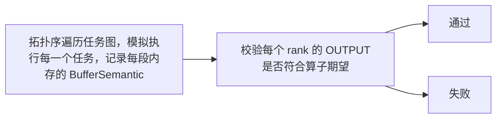

以 4-rank `AllReduce` 为例：

```
rank0.OUTPUT[0,L) 期望：
  sources    = { rank0.INPUT, rank1.INPUT, rank2.INPUT, rank3.INPUT }
  reduceType = SUM

假设 sources 缺失 rank3.INPUT：
  actualSourceRankCount=3，expectedRankSize=4 -> 校验失败
```

### 6.4 语义传播示例

以 2-rank `AllGather`（每 rank INPUT 大小 100 字节）为例，说明语义传播过程。

**初始状态**

每个 rank 的 INPUT 已有自己的初始语义（来源指向自身）：

```
rank0.INPUT[0, 100):  srcBufs = { (rank0, INPUT, 0) }
rank1.INPUT[0, 100):  srcBufs = { (rank1, INPUT, 0) }
rank0.OUTPUT:         空
rank1.OUTPUT:         空
```

**传播过程**

下图展示 rank0.OUTPUT 的语义填充过程。每条箭头表示一次 overwrite 操作：读取源 buffer 的语义，写入目标 buffer 的对应区间。

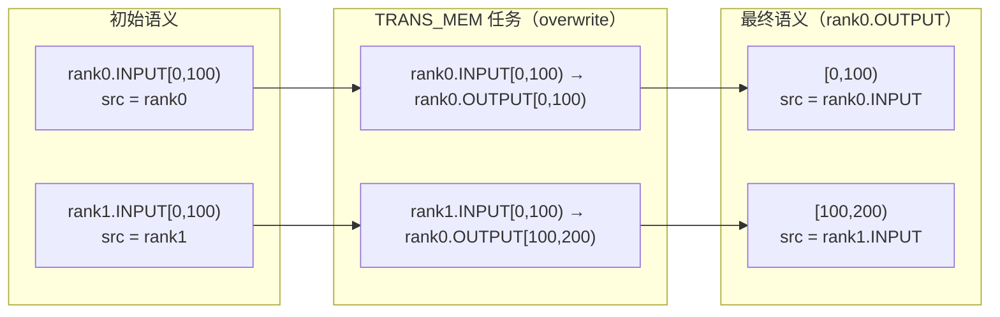

rank1.OUTPUT 的传播过程同理。最终两个 rank 的 OUTPUT 均填满，来源正确，校验通过。

**区间拆分**

若写入区间与已有语义边界不对齐，Checker 会先拆分再覆盖。例如 rank0.OUTPUT[0,100) 已有整段语义，此时写入 [35,65)：

```mermaid
gantt
    title 区间拆分示意
    dateFormat x
    axisFormat %L
    tickInterval 100millisecond

    section 写入前
    rank0.OUTPUT[0,100) src=rank0.INPUT : 0, 100

    section 写入后
    [0,35) 保持原语义 : 0, 35
    [35,65) 替换为新来源 :crit, 35, 65
    [65,100) 保持原语义 : 65, 100
```

写入前在 offset 35 和 65 处拆分原有语义块，将 [35,65) 替换为新来源，其余部分保持不变。

### 6.5 语义错误的两类根因

语义校验失败本质上只有两类问题：

- **数据缺失**：表示 OUTPUT 区间没有被写到，或写入不完整（缺头、断裂或缺尾）。
- **数据来源错误**：表示 OUTPUT 已被写满，但来源 rank、偏移或 reduce 类型不符合预期。

排查时先判断问题类型：如果是数据缺失，重点检查 task 编排是否缺少传输；如果是数据来源错误，重点检查 src/dst 地址和 reduceOp 是否正确。

### 6.6 错误日志解读

```text
[ErrorCode: 407] AllGather output range [0x1000,0x1400) for rank 3 should come from rank 4, but it actually comes from rank 5.
Current result range detail:
  range=[0x1000,0x1400), size=0x400, sourceCount=1
  sources:
    - sourceRank=5, sourceBufferType=INPUT, sourceAddr=0x0
```

日志说明：

| 行 | 含义 |
|----|------|
| 第 1 行 | 错误码和主错误信息。`407` 表示最终输出来源属性错误；`output range [0x1000,0x1400) for rank 3` 指出错的输出 rank 与区间，`should come from rank 4, but it actually comes from rank 5` 表示预期来源 rank 与实际来源 rank 不一致 |
| `Current result range detail` | 当前这段输出区间的完整语义展开，帮助继续定位 |
| `range / size / sourceCount` | 当前输出语义块的地址范围、长度，以及该区间包含多少个来源 |
| `sources` | 当前区间的来源列表，每项包含来源 rank、来源 buffer 类型和来源地址 |

---

## 7. 术语速查表

| 术语 | 说明 |
|------|------|
| 通信域 | 一组通信成员的组合，描述通信范围|
| 通信成员 | 通常称为rank，是参与通信的最小逻辑实体，每个rank都会分配一个唯一标识，即 `rankId`|
| 通信算子 | 一次集合通信操作，例如 `AllReduce`、`AllGather`，针对不同网络拓扑、数据量、硬件资源等场景，通信算子通常会采用不同的通信算法实现 |
| 任务 | Checker 的核心数据结构，描述某个rank一次原子操作的记录，例如内存搬运、Reduce、内存拷贝等 |
| 任务图 | Checker 的核心数据结构，用来表达一个算子执行所生成的任务节点及其依赖关系 |
| 节点 | 任务图上的每个节点即为一个任务 |
| Stream | rank内按顺序执行任务的队列，每个任务内都使用`streamId`记录自己属于哪个队列 |
| 任务类型 | 不同类型的任务的作用不同，例如：执行内存搬运、Reduce、或是同步 |
| Queue | CCU 内部串行指令队列 |
| MemSlice | 内存访问区间 `{rankId, type, offset, len}` |
| 从流 | 执行副任务的辅助 stream，要求首 `WAIT`、尾 `RECORD` |
| `RECORD` / `WAIT` | 一组配套的同步任务，分别表示发出同步信号和等待同步信号 |
| 同步边 | 由 `RECORD -> WAIT` 建立的跨 stream 或跨 rank 执行依赖 |
| 内存冲突 | 同一时刻有多个内存操作访问同一段内存，且至少有一个操作为写操作 |
| BufferSemantic | 语义校验阶段的重要数据结构，记录一段内存数据来自哪里 |
| `reduceType` | 语义中的规约类型，例如 `SUM`、`MAX`、`MIN`，用于描述多来源数据如何合并 |
| OUTPUT 期望 | 某个通信算子最终输出结果应满足的正确语义定义，用于和实际结果做最终比对 |
