# Checker Quick Start Guide

This document introduces the basic concepts and processing flow of Checker. For error code specific scenarios, see [Error Code FAQ](faq/modules/checker_faq_en.md).

[toc]

## 1 What is Checker

Checker is a static verification tool. It does not intervene in operator execution. Instead, it reads the records left after operator execution, reconstructs the execution graph, and performs static analysis to determine whether the operator execution is logically correct.
- Checker input: operator information + task data of each rank + CCU instruction sequence
- Checker output: verification conclusion (success/failure) + error log

---

## 2 Checker Overall Flow

### 2.1 Key Terms

| Term | Description |
|------|-------------|
| Communication domain | A group of communication members, describing the communication scope |
| Communication member | Usually referred to as a rank, the smallest logical entity participating in communication. Each rank is assigned a unique identifier called `rankId` |
| Communication operator | A collective communication operation, such as `AllReduce` or `AllGather`. Different communication algorithms may be used depending on network topology, data volume, hardware resources, etc. |
| Task | The core data structure of Checker, describing a record of an atomic operation for a rank, such as memory copy, Reduce, memory move, etc. |
| Task graph | The core data structure of Checker, used to express the task nodes generated by an operator execution and their dependency relationships |
| Node | Each node on the task graph is a task |
| Stream | A queue within a rank that executes tasks sequentially. Each task uses `streamId` to record which queue it belongs to |
| Task type | Different task types serve different purposes, such as memory copy, Reduce, or synchronization |

### 2.2 Checker Processing Flow

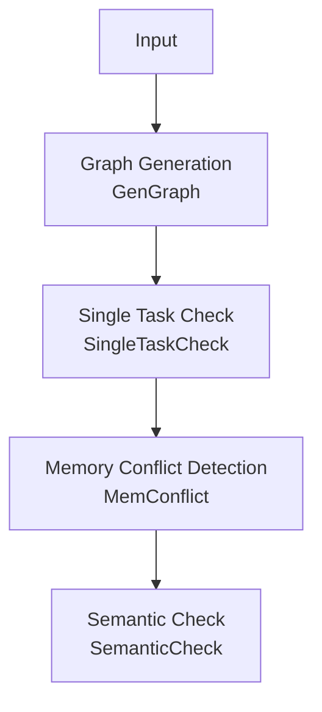

| Phase | Purpose |
|-------|---------|
| Graph Generation | Generate the task graph based on Checker input. In CCU mode, CCU instructions are converted into the task graph |
| Single Task Check | Check whether the memory range of a single task is valid, and verify the slave stream head/tail structure |
| Memory Conflict Detection | Check for unprotected memory overlaps between concurrent tasks |
| Semantic Check | Simulate the operator execution process and verify whether the final output meets operator expectations |

---

## 3 Task Graph

The task graph is the core data structure of Checker, used to express the task nodes generated by an operator execution and their dependency relationships. It is generated during the graph generation phase based on Checker input.

### 3.1 Nodes and Edges

Each node on the task graph is a task with a specific task type indicating the operation it performs. Common types are:

| Task Type | Description | Core Fields |
|-----------|-------------|-------------|
| `TRANS_MEM` | Memory data copy | `srcRankId`, `srcOffset`<br>`dstRankId`, `dstOffset`<br>`len`, `type` |
| `BATCH_TRANS_MEM` | Batch memory data copy, containing multiple `(src -> dst)` relationships per node | `srcs[]`<br>`dsts[]` |
| `REDUCE` | Data reduce | `srcRankId`, `srcOffset`<br>`dstRankId`, `dstOffset`<br>`type`, `dataCount`, `dataType`, `reduceOp` |
| `BATCH_REDUCE` | Batch data reduce, containing multiple `(src -> dst)` reduce relationships per node | `srcs[][]`<br>`dsts[]`<br>`dataType`, `reduceOp` |
| `RECORD` / `WAIT` | Synchronization tasks, representing sending and waiting for synchronization signals respectively | `srcRankId` (sender)<br>`dstRankId` (waiter)<br>`notifyId` |

In addition to the real execution tasks above, the task graph also includes `START` / `END` virtual boundary nodes. They do not correspond to actual data copy or computation, but serve to mark the boundaries of the main graph, subgraphs, and Loop structures.

| Virtual Node Type | Supported `boundaryType` | Description |
|-------------------|--------------------------|-------------|
| `START` | `MAIN_GRAPH`, `CCU_SUB_GRAPH`, `AIV_SUB_GRAPH`, `LOOP` | Start boundary node. Marks the entry of the entire task graph, or the start of a CCU/AIV subgraph or Loop fragment |
| `END` | `CCU_SUB_GRAPH`, `AIV_SUB_GRAPH`, `LOOP` | End boundary node. Marks the end of a CCU/AIV subgraph or Loop fragment, and converges the tail nodes within the boundary |

Edges represent the execution order relationships between nodes. A directed edge means the tail node executes after the head node. Edges can be categorized as follows:

| Edge Type | Description |
|-----------|-------------|
| Sequential edge | Dependency edge connecting tasks in execution order within the same stream. Example: two sequential tasks on `rank0/stream0`, three sequential tasks on `rank1/stream0` |
| Synchronization edge | Dependency edge between synchronization task nodes. Example: a `WAIT` node needs to wait for a signal from a `RECORD` node before it can proceed. An edge from `RECORD` to `WAIT` represents this dependency |

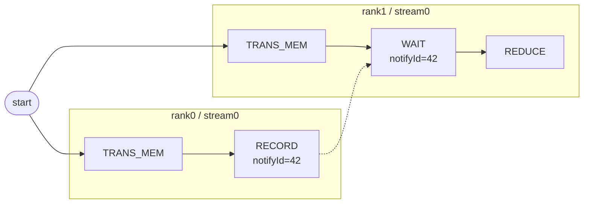

### 3.2 Task Graph Examples

#### 3.2.1 AICPU Mode

In AICPU mode, the task graph typically consists of `RECORD`, `WAIT`, and `TRANS_MEM` nodes. Below is a typical 2-rank `AllGather` example with each rank containing two streams, showing sequential edges in actual execution order and dashed lines for `RECORD` to `WAIT` synchronization dependencies.

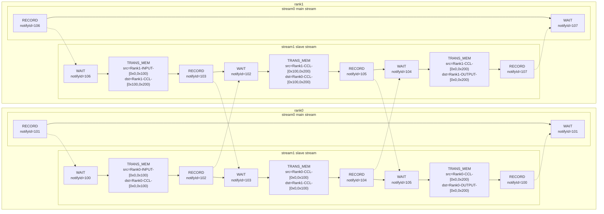

#### 3.2.2 CCU Mode

In CCU mode, Checker expands CCU instructions into CCU subgraphs. Using the 2-rank `AllReduce` data flow, the synchronization operations outside the CCU subgraph are omitted, retaining only the internal task sequence of the CCU subgraph. CCU uses `cke` / `mask` instead of `notifyId` for synchronization, and uses the CCU `MS` type for the intermediate buffer.

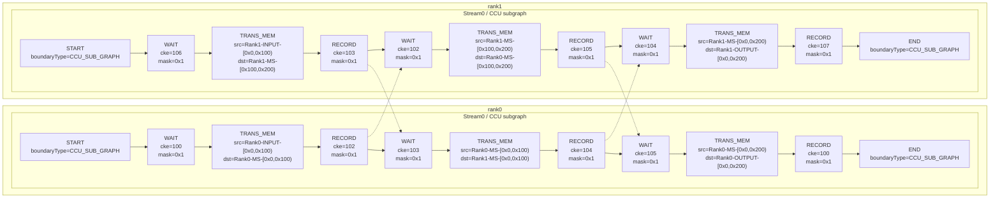

#### 3.2.3 Graphviz Visualization

Checker provides task graph export capability for outputting the task graph as a Graphviz `.dot` file.

The exported content includes not only "which nodes exist" but also commonly used debugging information directly in the graph:
- Nodes arranged by `rank / stream` for easy observation of sequential relationships on the same execution queue
- Solid lines for normal dependency edges, dashed lines for `RECORD -> WAIT` synchronization dependencies
- Node labels include task type, `nodeId`, location information, key fields such as memory slices, `notifyId`, or `cke/mask`

Usage:
- Checker automatically attempts to export the `.dot` file after graph generation without requiring an additional switch
- After successful export, search the logs for `[GraphvizDot]` to find the output path, typically `hccl_vm_install/data/`
- Output file name format: `TaskGraph_YYYYMMDDHHMMSS.dot`

> After obtaining the `.dot` file, use `Microsoft VS Code` plugins such as `Graphviz Interactive Preview` for instant browsing.

---

## 4. Single Task Check

This phase checks whether the memory range of a single task is valid and verifies the slave stream head/tail structure.

### 4.1 MemSlice

The most important information in memory copy and reduce tasks is the memory slice (MemSlice). A memory slice consists of the following:

```
MemSlice = { rankId, type, offset, len }
```

- `rankId` indicates which rank the memory belongs to
- `type` indicates the memory type
  | Memory Type | Usage |
  |-------------|-------|
  | INPUT | Operator input buffer |
  | OUTPUT | Operator output buffer |
  | CCL | CCL buffer |
  | MS_CCU | CCU MS |
- `offset` and `len` together define the memory access range
  - `offset` is the starting address of this access on the memory slice
  - `len` is the length of this memory access
  - The access range uses half-open notation: `[offset, offset + length)`

The check points for a single task's memory slice are:
- `offset + length` must not overflow the `uint64` upper bound, otherwise an error is reported
- Multiple MemSlices within the same task with the same `(rankId, memType)` must not overlap, otherwise an error is reported

    ```mermaid
    gantt
        title MemSlice Range Comparison
        dateFormat x
        axisFormat %L
        tickInterval 100millisecond

        section Valid (no overlap)
        Slice A  0x000-0x400 : 0, 400
        Slice B  0x400-0x800 : 400, 800

        section Invalid (overlap)
        Slice A  0x000-0x600 : crit, 0, 600
        Slice B  0x400-0x800 : crit, 400, 800
    ```

- Different `type` values represent independent address spaces. The same `offset` under different `type` values is not considered overlapping
- `offset + length` must not exceed the boundary of the current `type` address space

    ```mermaid
    gantt
        title MemSlice Boundary Check
        dateFormat x
        axisFormat %L
        tickInterval 100millisecond

        section Valid (within bounds)
        Type Space [0x000,0x800) : 0, 800
        MemSlice   [0x200,0x500) : 200, 500

        section Invalid (out of bounds)
        Type Space [0x000,0x800) : 0, 800
        MemSlice   [0x600,0x900) : crit, 600, 900
    ```

### 4.2 Slave Stream Structure Check

The slave stream executes auxiliary tasks for the operator, such as data pre-copy. In the HCCL programming model, the main stream triggers the slave stream via a synchronization task `RECORD -> WAIT`. After the slave stream completes, it notifies the main stream through another set of synchronization tasks. Therefore, the slave stream must satisfy a fixed head/tail structure: first task is `WAIT` && last task is `RECORD`.

The following diagram shows an incorrect example, with the offending nodes highlighted in red:

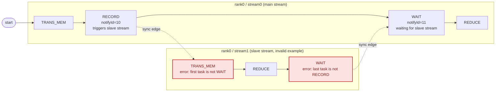

---

## 5. Memory Conflict Check

This phase checks whether there is a potential memory conflict in the task graph. A memory conflict occurs when multiple memory operations access the same memory segment at the same time, and at least one operation is a write. When a memory conflict occurs, the value of the conflicting memory segment is indeterminate, leading to accuracy issues in collective communication operators.

### 5.1 Memory Conflict Criteria

Two memory-accessing task nodes are judged as having a memory conflict when all three conditions below are met:
1. The two nodes may execute concurrently (no path exists between the two nodes on the task graph)
2. The accessed memory address ranges overlap
3. At least one is a write operation

Checker efficiently checks every pair of memory-accessing task nodes to ensure no false negatives.

### 5.2 Memory Conflict Example

The following diagram shows a task graph with a memory conflict:

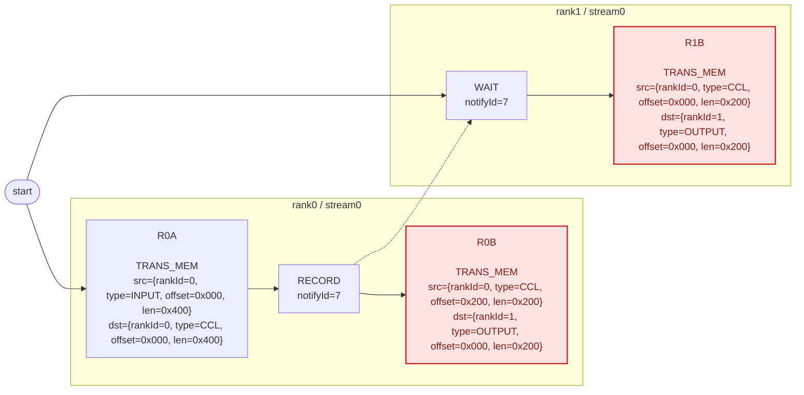

- `R0A` and `R0B` execute sequentially on the same stream, so concurrent execution is not possible and no memory conflict occurs
- `R0A` and `R1B` have their execution order constrained by synchronization nodes: `R0A -> R0RECORD -> R1WAIT -> R1B`, so no memory conflict occurs
- `R0B` and `R1B` can execute concurrently, and their write memory `dst` completely overlaps, so a memory conflict exists

### 5.3 Conflict Log Interpretation

The error log format for memory conflict is as follows:

```text
[ErrorCode: 302] Two tasks may access the same memory range in parallel, and at least one access is a write.
  Conflict memory : rank 0 OUTPUT
  Overlap range    : [0x0,0xc80)
  Conflict task 1:
    node 17, action=write
    access range : [0x0,0xc80)
    task         : [TaskTransMem] node=17, rank=1, stream=0, queue=0, protocol=SDMA, src=rank 1 CCL [0x0,0xc80), dst=rank 0 OUTPUT [0x0,0xc80)
  Conflict task 2:
    node 23, action=write
    access range : [0x0,0xc80)
    task         : [TaskTransMem] node=23, rank=2, stream=0, queue=0, protocol=SDMA, src=rank 2 CCL [0x0,0xc80), dst=rank 0 OUTPUT [0x0,0xc80)
```

Log description:

| Field | Meaning |
|-------|---------|
| `[ErrorCode: 302]` | Memory conflict error code, corresponding to `MEMCONFLICT_DETECTED` |
| `Conflict memory : rank X TYPE` | Location of the conflicting memory |
| `Overlap range : [start,end)` | The actual overlapping address range of the two accesses |
| `Conflict task 1 / Conflict task 2` | The two accesses determined to be "concurrently executable with overlapping addresses" |
| `node X, action=read/write` | Node ID on the task graph and the read/write type of this access. If at least one is `write`, a conflict may be reported |
| `access range : [start,end)` | The complete address range covered by this access, may not be identical to the `Overlap range` |
| `task :` | Specific task details (task type, node ID, location, src/dst memory ranges, etc.) |

---

## 6. Semantic Check

The semantic check phase traverses the task graph topologically, simulates the operator execution process, and verifies whether the final output meets operator expectations.

### 6.1 BufferSemantic

During the semantic check, Checker maintains data source records for each memory segment:

```
BufferSemantic = {
  startAddr:   Memory segment start address (offset)
  size:        Memory segment length (len)
  srcBufs:     Set of memory sources, each item is {rankId, bufferType, srcAddr}
  isReduce:    Whether it is a Reduce operation
  reduceType:  Reduce operation type SUM/MAX/MIN/...
}
```

`srcBufs` records the data source of the memory. `bufferType` indicates the buffer type the source belongs to, such as `INPUT`, `OUTPUT`, or `CCL`.

When each node executes, each `(src -> dst)` relationship is translated into one of the following two operations, then written back to the target address space. `(src -> dst)` represents a set of copy or reduce relationships from source address to destination address:

| TaskType | Operation | Behavior |
|----------|-----------|----------|
| `TRANS_MEM` / `BATCH_TRANS_MEM` | overwrite | First clears the existing semantics of the target range, then copies the source semantics over |
| `REDUCE` / `BATCH_REDUCE` | reduce | Requires that the target range is pre-filled with semantics, otherwise an error is reported. Then appends the new source to `srcBufs` and sets `isReduce=true` |

### 6.2 OUTPUT Expectations by Operator

The goal of semantic check is to determine whether each rank's `OUTPUT` meets the current operator's expectations. The expectations for different operators are:

| Operator | OUTPUT Semantic Expectation |
|----------|-----------------------------|
| AllReduce | Each rank's OUTPUT is the reduce result of all ranks' INPUT |
| AllGather | Each rank's OUTPUT is the concatenation of all ranks' INPUT in order |
| ReduceScatter | Each rank's OUTPUT is the fragment of the global reduce assigned to this rank |
| AllGatherV | Same as AllGather, but each rank contributes a different size |
| ReduceScatterV | Same as ReduceScatter, but each rank's fragment size differs |
| Send/Recv | The target rank's OUTPUT equals the source rank's INPUT, single source without reduce |
| BatchSendRecv | Multiple pairs of Send/Recv simultaneously |
| Broadcast | All ranks' OUTPUT equal the root rank's INPUT |
| Reduce | Only the root rank's OUTPUT is the reduce result of all ranks' INPUT |
| All2All | Each rank's `OUTPUT[i]` equals `rank i`'s `INPUT[this rank's offset]` |

The diagrams below show the OUTPUT expectations for each operator using a 2-rank collective communication operator example:

**AllReduce**

```mermaid
gantt
    title AllReduce (2-rank)
    dateFormat x
    axisFormat %L
    tickInterval 100millisecond

    section rank0.INPUT
    rank0.INPUT : 0, 100

    section rank1.INPUT
    rank1.INPUT : 0, 100

    section rank0.OUTPUT
    rank0.INPUT + rank1.INPUT : 0, 100

    section rank1.OUTPUT
    rank0.INPUT + rank1.INPUT : 0, 100
```

**AllGather / AllGatherV**

```mermaid
gantt
    title AllGather (2-rank)
    dateFormat x
    axisFormat %L
    tickInterval 100millisecond

    section rank0.INPUT
    rank0.INPUT : 0, 100

    section rank1.INPUT
    rank1.INPUT : 0, 100

    section rank0.OUTPUT
    rank0.INPUT : 0, 100
    rank1.INPUT : 100, 200

    section rank1.OUTPUT
    rank0.INPUT : 0, 100
    rank1.INPUT : 100, 200
```

`AllGatherV` semantics are the same as above, except that each rank's contribution length can differ.

**ReduceScatter / ReduceScatterV**

```mermaid
gantt
    title ReduceScatter (2-rank, each slice Len=100)
    dateFormat x
    axisFormat %L
    tickInterval 100millisecond

    section rank0.INPUT
    rank0.INPUT1 : 0, 50
    rank0.INPUT2 : 50, 100

    section rank1.INPUT
    rank1.INPUT1 : 0, 50
    rank1.INPUT2 : 50, 100

    section rank0.OUTPUT
    rank0.INPUT1 + rank1.INPUT1 : 0, 50

    section rank1.OUTPUT
    rank0.INPUT2 + rank1.INPUT2 : 50, 100
```

`ReduceScatterV` semantics are the same as above, except that each rank's output fragment size can differ.

**Send/Recv**

```mermaid
gantt
    title Send/Recv (2-rank, src=0, dst=1)
    dateFormat x
    axisFormat %L
    tickInterval 100millisecond

    section rank0.INPUT
    rank0.INPUT : 0, 100

    section rank1.INPUT
    None: 0,0

    section rank0.OUTPUT
    None: 0,0

    section rank1.OUTPUT
    rank0.INPUT : 0, 100
```

**BatchSendRecv**

```mermaid
gantt
    title BatchSendRecv (2-rank)
    dateFormat x
    axisFormat %L
    tickInterval 100millisecond

    section rank0.INPUT
    rank0.INPUT : 0, 100

    section rank1.INPUT
    rank1.INPUT : 0, 100

    section rank0.OUTPUT
    rank1.INPUT : 0, 100

    section rank1.OUTPUT
    rank0.INPUT : 0, 100
```

**Broadcast**

```mermaid
gantt
    title Broadcast (2-rank, root=0)
    dateFormat x
    axisFormat %L
    tickInterval 100millisecond

    section rank0.INPUT
    rank0.INPUT : 0, 100

    section rank1.INPUT
    None: 0,0

    section rank0.OUTPUT
    rank0.INPUT : 0, 100

    section rank1.OUTPUT
    rank0.INPUT : 0, 100
```

**Reduce**

```mermaid
gantt
    title Reduce (2-rank, root=0, SUM)
    dateFormat x
    axisFormat %L
    tickInterval 100millisecond

    section rank0.INPUT
    rank0.INPUT : 0, 100

    section rank1.INPUT
    rank1.INPUT : 0, 100

    section rank0.OUTPUT
    rank0.INPUT + rank1.INPUT : 0, 100

    section rank1.OUTPUT
    None: 0,0
```

**All2All**

```mermaid
gantt
    title All2All (2-rank)
    dateFormat x
    axisFormat %L
    tickInterval 100millisecond

    section rank0.INPUT
    rank0.INPUT1 : 0, 100
    rank0.INPUT2 : 100, 200

    section rank1.INPUT
    rank1.INPUT1 : 0, 100
    rank1.INPUT2 : 100, 200

    section rank0.OUTPUT
    rank0.INPUT1 : 0, 100
    rank1.INPUT1 : 100, 200

    section rank1.OUTPUT
    rank0.INPUT2 : 0, 100
    rank1.INPUT2 : 100, 200
```

### 6.3 Final Verification Flow

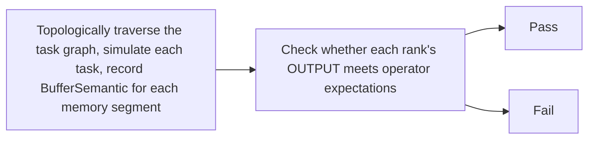

Using a 4-rank `AllReduce` as an example:

```
rank0.OUTPUT[0,L) expected:
  sources    = { rank0.INPUT, rank1.INPUT, rank2.INPUT, rank3.INPUT }
  reduceType = SUM

Assuming sources is missing rank3.INPUT:
  actualSourceRankCount=3, expectedRankSize=4 -> check fails
```

### 6.4 Semantic Propagation Example

Using a 2-rank `AllGather` (each rank INPUT size 100 bytes) as an example to illustrate the semantic propagation process.

**Initial State**

Each rank's INPUT already has its own initial semantics (source pointing to itself):

```
rank0.INPUT[0, 100):  srcBufs = { (rank0, INPUT, 0) }
rank1.INPUT[0, 100):  srcBufs = { (rank1, INPUT, 0) }
rank0.OUTPUT:         empty
rank1.OUTPUT:         empty
```

**Propagation Process**

The diagram below shows the semantic filling process of rank0.OUTPUT. Each arrow represents an overwrite operation: reading the source buffer's semantics and writing them to the corresponding range of the target buffer.

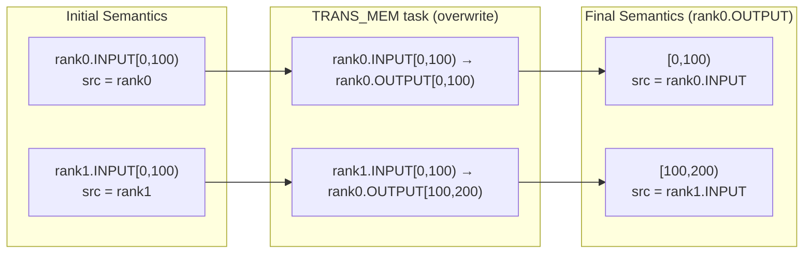

The propagation process for rank1.OUTPUT is similar. Finally, both ranks' OUTPUT are filled, sources are correct, and the check passes.

**Range Splitting**

If the write range does not align with the existing semantic boundary, Checker splits first, then overwrites. For example, rank0.OUTPUT[0,100) already has a full semantic segment, and then [35,65) is written:

```mermaid
gantt
    title Range Splitting Illustration
    dateFormat x
    axisFormat %L
    tickInterval 100millisecond

    section Before Write
    rank0.OUTPUT[0,100) src=rank0.INPUT : 0, 100

    section After Write
    [0,35) retain original semantics : 0, 35
    [35,65) replace with new source :crit, 35, 65
    [65,100) retain original semantics : 65, 100
```

Before the write, the original semantic block is split at offsets 35 and 65, [35,65) is replaced with the new source, and the remaining parts are kept unchanged.

### 6.5 Two Root Causes of Semantic Errors

Semantic check failures essentially have only two types of problems:

- **Missing data**: The OUTPUT range was not written to, or was written incompletely (missing head, fragmented, or missing tail).
- **Incorrect data source**: The OUTPUT is fully written, but the source rank, offset, or reduce type does not match expectations.

When debugging, first determine the problem type: if data is missing, focus on whether the task scheduling lacks a transmission; if the data source is incorrect, focus on whether the src/dst addresses and reduceOp are correct.

### 6.6 Error Log Interpretation

```text
[ErrorCode: 407] AllGather output range [0x1000,0x1400) for rank 3 should come from rank 4, but it actually comes from rank 5.
Current result range detail:
  range=[0x1000,0x1400), size=0x400, sourceCount=1
  sources:
    - sourceRank=5, sourceBufferType=INPUT, sourceAddr=0x0
```

Log description:

| Line | Meaning |
|------|---------|
| Line 1 | Error code and main error message. `407` indicates an output source attribute error; `output range [0x1000,0x1400) for rank 3` specifies the failing output rank and range; `should come from rank 4, but it actually comes from rank 5` indicates the expected source rank differs from the actual source rank |
| `Current result range detail` | Full semantic expansion of the current output range for further debugging |
| `range / size / sourceCount` | Address range, length, and number of sources for the current output semantic block |
| `sources` | Source list for the current range, each item includes source rank, source buffer type, and source address |

---

## 7. Quick Term Reference

| Term | Description |
|------|-------------|
| Communication domain | A group of communication members, describing the communication scope |
| Communication member | Usually referred to as a rank, the smallest logical entity participating in communication. Each rank is assigned a unique identifier called `rankId` |
| Communication operator | A collective communication operation, such as `AllReduce` or `AllGather` |
| Task | The core data structure of Checker, which describes a record of one atomic operation performed by a given rank, such as memory transfer, Reduce, memory copy, etc |
| Task graph | The core data structure of Checker, used to express task nodes and their dependency relationships |
| Node | Each node on the task graph is a task |
| Stream | A queue within a rank that executes tasks in sequential order, where each task uses a streamId to record which queue it belongs to |
| Task type | Different task types serve different purposes, such as memory copy, Reduce, or synchronization |
| Queue | CCU internal serial instruction queue |
| MemSlice | Memory access range `{rankId, type, offset, len}` |
| Slave stream | An auxiliary stream for executing secondary tasks, requiring first `WAIT`, last `RECORD` |
| `RECORD` / `WAIT` | A pair of synchronization tasks for sending and waiting for synchronization signals |
| Synchronization edge | A cross-stream or cross-rank execution dependency established by `RECORD -> WAIT` |
| Memory conflict | Multiple memory operations access the same memory segment at the same time with at least one write |
| BufferSemantic | An important data structure in the semantic check phase, recording where a memory segment's data comes from |
| `reduceType` | The reduce type in semantics, such as `SUM`, `MAX`, `MIN`, used to describe how multi-source data is merged |
| OUTPUT expectation | The correct semantic definition that the final output of a communication operator should satisfy, used for final comparison with actual results |
