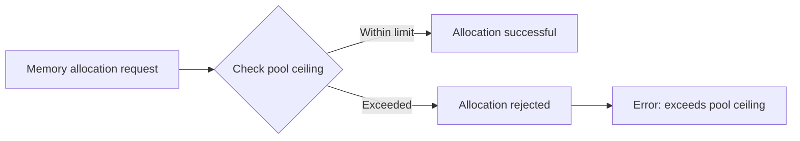
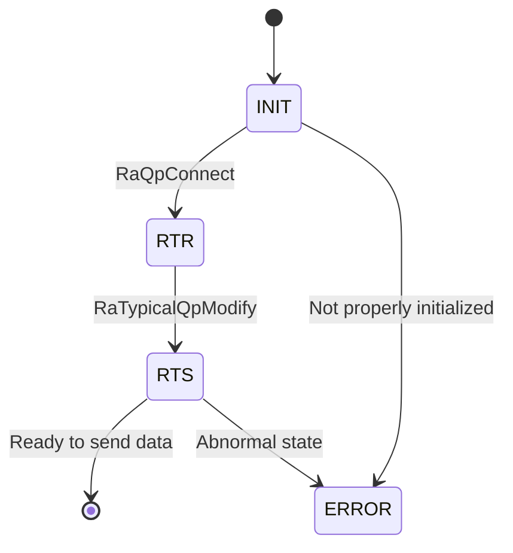
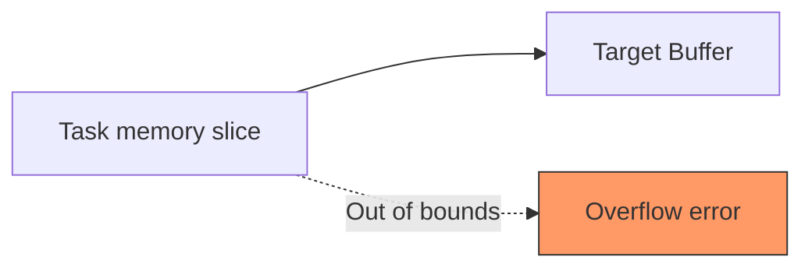
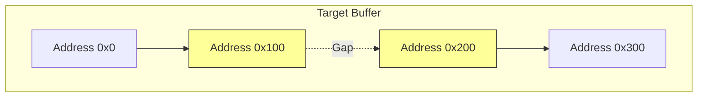

# HCCL-VM FAQ Test Document

> This document is used to test the FAQ HTML generation framework.

---

## Module: HCCL-VM

### Submodule: Command Line

---

#### FAQ-E001

**Title:** Communication domain not configured

**Error code:**
```
NA (4)
```

**Error function:**
```
db_sim_runner_common.cc::GetDeviceByRankId()
```

**Key log:**
```
[error][PID:173579][TID:173579][db_sim_runner_common.cc][GetDeviceByRankId] cannot find rank by rank id 0
[error][PID:173579][TID:173579][aclrt_device_stub.cc][aclrtSetDevice] [DEVICE_STUB]device not found by rankId:0
acl interface return err ./common/src/hccl_test_common.cc:861, retcode: 100000.
This is an error in device_init.
```

**Symptoms:** When executing a business case, the device with rank id 0 cannot be found.

**Troubleshooting:**
```
[Possible Causes]
Before executing the business case, users need to determine the communication domain size used by the operator and configure the communication domain using the `hccl-vm mock-comm aa` command. The aa.yaml file is located at $HCCL_VM_INSTALL_DIR/config/topo_meta/aa.yaml.
```
---

#### FAQ-E002

**Title:** RANK_TABLE_FILE not set

**Error code:**
```
HCCL_SIM_E_PARA (1)
```

**Error function:**
```
hccl_comm_stub.cc::HcclCommInitRootInfo()
```

**Key log:**
```
RANK_TABLE_FILE env not set, please check your config.
```

**Symptoms:** The rank table configuration file cannot be found during communication domain initialization.

**Troubleshooting:**
```
[Possible Causes]
1. Environment variable not set
2. Incorrect file path

[Solution]
export RANK_TABLE_FILE=/path/to/rank_table.json
```
---

#### FAQ-E003

**Title:** HCCL_VM_INSTALL_DIR not set

**Error code:**
```
HCCL_SIM_E_INTERNAL (4)
```

**Error function:**
```
hccl_op_stub.cc::VirtualExecuteAivKernel()
```

**Key log:**
```
[virtual-aiv] env HCCL_VM_INSTALL_DIR is not set, can not locate <path> for kernel <name>
```

**Symptoms:** AIV kernel virtual execution failed; the corresponding .so file cannot be found.

**Troubleshooting:**
```
[Solution]
export HCCL_VM_INSTALL_DIR=/path/to/hccl_vm/install/dir
```
---

#### FAQ-E004

**Title:** Repeated execution of start command in a subshell

**Error code:**
```
NA (no error code, only WARNING)
```

**Error function:**
```
subcmd_start.cc::StartCommand::Execute()
```

**Key log:**
```
[warning][PID:<PID>][TID:<TID>][subcmd_start.cc][Execute] hccl-vm has already started. Please do not start it again in a sub-bash.
```

**Symptoms:** In the hvm subshell environment, executing the `hccl-vm start` command again causes the system to prompt that it has already started and ignore this operation.

**Troubleshooting:**
```
[Possible Causes]
`hccl-vm start` forks a sub-bash process. When the user enters `hccl-vm start` again inside that sub-bash (prompt `(hvm)$>`), the system refuses to start again.

[Solution]
Do not execute `hccl-vm start` repeatedly inside the subshell. To restart the simulation environment, first exit the current subshell (type `exit`), then re-execute `hccl-vm start`.
```
---

#### FAQ-E005

**Title:** Fork subprocess failed

**Error code:**
```
HCCL_SIM_HOST_ERROR_CMD (no standard error code)
```

**Error function:**
```
cmd_base_utils.cc::StartHvmCmd()
```

**Key log:**
```
fork failed: Resource temporarily unavailable
```

**Symptoms:** After executing the `hccl-vm start` command, the system cannot create a subshell process, and the simulation environment fails to start.

**Troubleshooting:**
```
[Possible Causes]
1. The system user process limit has been reached (ulimit -u)
2. Insufficient system memory to allocate resources for the new process
3. PID resources exhausted (/proc/sys/kernel/pid_max)

[Steps]
ulimit -u
cat /proc/sys/kernel/pid_max
free -m
ps -eLf | wc -l

[Solution]
1. Increase the user process limit: `ulimit -u <larger value>`
2. Clean up zombie processes remaining in the system
3. Check if other programs are consuming excessive system resources
```
---

#### FAQ-E006

**Title:** Plugin name format error

**Error code:**
```
NA (CLI parameter validation)
```

**Error function:**
```
subcmd_plugin.cc::PluginCommand::Setup()
```

**Key log:**
```
[HVM] [ERROR] Install plugin : Invalid format! Plugin name must start with '@' (e.g., @myplugin).
[HVM] [ERROR] Uninstall plugin : Invalid format! Plugin name must start with '@' (e.g., @myplugin).
[HVM] [ERROR] Run plugin : Invalid format! Plugin name must start with '@' (e.g., @myplugin).
```

**Symptoms:** When executing the `hccl-vm plugin install/run/uninstall` command, CLI parameter validation fails and the operation is rejected.

**Troubleshooting:**
```
[Possible Causes]
The plugin name does not start with the `@` symbol. For example, entering `hccl-vm plugin install runner` instead of `hccl-vm plugin install @runner`.

[Solution]
Ensure the plugin name starts with `@`, for example:
hccl-vm plugin install @runner
hccl-vm plugin install @checker
hccl-vm plugin uninstall @runner
```
---

#### FAQ-E007

**Title:** Topology configuration file not found

**Error code:**
```
NA (CLI parameter validation)
```

**Error function:**
```
cmd_base_utils.cc::FileInModelDir()
```

**Key log:**
```
[HVM] model File not found: <install_path>/config/topo_meta/<name>.yaml
```

**Symptoms:** When executing the `hccl-vm mock-comm <name>` command, the specified topology yaml configuration file does not exist, and CLI parameter validation directly rejects the operation. The communication domain configuration file describes the scale of the operator's communication domain (e.g., how many super nodes, how many servers, and which cards are selected within each server; see the file description for details).

**Troubleshooting:**
```
[Possible Causes]
1. The specified topology name is misspelled
2. The corresponding yaml file is not placed in the `$HCCL_VM_INSTALL_DIR/config/topo_meta/` directory
3. Incorrect file extension (should be `.yaml`)

[Steps]
ls $HCCL_VM_INSTALL_DIR/config/topo_meta/

[Solution]
Ensure the topology yaml file is placed in the correct directory and the filename matches the command parameter. For example, executing `hccl-vm mock-comm 121` requires the `config/topo_meta/121.yaml` file to exist.
```
---

#### FAQ-E008

**Title:** YAML topology file format parsing error

**Error code:**
```
NA (runtime parsing error)
```

**Error function:**
```
cmd_cluster_model_utils.cc::ParseYamlTopoImpl()
```

**Key log:**
```
[error][PID:<PID>][TID:<TID>][cmd_cluster_model_utils.cc][ParseYamlTopoImpl] Exception when parsing YAML: <detail>
```

**Symptoms:** When executing the `hccl-vm mock-comm <name>` command, the YAML topology configuration file parsing fails, and communication domain initialization is interrupted.

**Troubleshooting:**
```
[Possible Causes]
1. Syntax errors in the YAML file (e.g., incorrect indentation, missing space after colon, illegal characters)
2. Unsupported field types or formats in the YAML file
3. YAML file encoding is not UTF-8

[Steps]
# Use python to verify the yaml format
python3 -c "import yaml; yaml.safe_load(open('$HCCL_VM_INSTALL_DIR/config/topo_meta/<name>.yaml'))"

[Solution]
Fix the YAML file syntax errors based on the `<detail>` information in the log. Common issues include:
1. Indentation must use spaces, not Tab
2. A space is required after the colon in key-value pairs
3. Indentation of list items (`-`) must be consistent with their parent level
```
---

### Submodule: Memory Management

---

#### FAQ-M001

**Title:** Device memory allocation exceeded limit

**Error code:**
```
HCCL_SIM_E_MEMORY (3)
```

**Error function:**
```
store_sim_device_memory_manager.cc::AllocPhyMem()
```

**Key log:**
```
dev:<N> alloc phy mem:<ADDR> size:<SIZE> exceeds pool ceiling:<CEILING>, reject
```

**Symptoms:** The device memory allocation request exceeds the simulated memory pool ceiling.

**Diagram:**

---

#### FAQ-M002

**Title:** Shared memory creation failed

**Error code:**
```
HCCL_SIM_E_SYSCALL (8)
```

**Error function:**
```
store_sim_shm_ops.cc::ShmCreate()
```

**Key log:**
```
[SHM_OPS] create: shm_open failed, name: <name>
[SHM_OPS] create: ftruncate failed, name: <name>
[SHM_OPS] create: mmap failed, name: <name>
```

**Symptoms:** Unable to create a shared memory segment.

**Troubleshooting:**
```
[Possible Causes]
1. Insufficient `/dev/shm` space
2. Insufficient permissions
3. A shared memory with the same name already exists and conflicts

[Steps]
df -h /dev/shm
ls /dev/shm/ | grep hccl
```
---

#### FAQ-M003

**Title:** Communication memory allocation failed

**Error code:**
```
HCCL_SIM_E_NOT_FOUND (6)
```

**Error function:**
```
store_sim_comm_memory_manager.cc
```

**Key log:**
```
[COMM_MEM] alloc failed, name: <name>
[COMM_MEM] acquire failed, name: <name>
[COMM_MEM] write size too large, size: <N>, max: <MAX>
```

**Symptoms:** Cross-process communication memory operation failed.

---

### Submodule: Stub Proxy

---

#### FAQ-PX001

**Title:** AIV Kernel virtual execution failed

**Error code:**
```
HCCL_SIM_E_INTERNAL (4)
```

**Error function:**
```
hccl_op_stub.cc::VirtualExecuteAivKernel()
```

**Key log:**
```
[virtual-aiv] env HCCL_VM_INSTALL_DIR is not set
[virtual-aiv] missing aiv stub shared library, kernel=<name>
[virtual-aiv] dlopen <so> failed, err = <error>
[virtual-aiv] dlsym <symbol> from <so> failed, err = <error>
```

**Symptoms:** AIV kernel execution failed in the virtual environment.

**Troubleshooting:**
```
[Steps]
echo $HCCL_VM_INSTALL_DIR
ls -la $HCCL_VM_INSTALL_DIR/lib/aiv/
nm -D $HCCL_VM_INSTALL_DIR/lib/aiv/<kernel>.so | grep <symbol>
```
---

#### FAQ-PX002

**Title:** Operator database recording failed

**Error code:**
```
HCCL_SIM_E_INTERNAL (4)
```

**Error function:**
```
hccl_op_stub.cc::RecordOpDbInfo()
```

**Key log:**
```
[RecordOpDbInfo] insert op detail+mem failed
[HcclAllReduce] record op db info failed
```

**Symptoms:** HCCL collective communication operator parameters cannot be written to the simulation database.

**Affected operators:** AlltoAll, AlltoAllV, AllGather, Broadcast, AllReduce, Scatter, Reduce, ReduceScatter

---

#### FAQ-PX003

**Title:** QP not found or status error

**Error code:**
```
HCCL_SIM_E_NOT_FOUND (6)
```

**Error function:**
```
hccp_stub.cc::RaSendWr()
```

**Key log:**
```
[HCCP] RaSendWr: QP <N> not found
[HCCP] RaSendWr: QP <N> not in RTS state, current state:<N>
```

**Symptoms:** RDMA QP operation failed—QP does not exist or has not reached the RTS state.

**Diagram:**

---

#### FAQ-PX004

**Title:** EndPoint lookup failed

**Error code:**
```
HCCL_SIM_E_NOT_FOUND (6)
```

**Error function:**
```
hccp_stub.cc::RaCtxQpImport()
```

**Key log:**
```
[HCCP] cannot find endpoint addr:<IP>
Get remote endpoint failed. ip:<IP>, eid:<EID>
```

**Symptoms:** Network endpoint lookup failed.

**Troubleshooting:**
```
[Possible Causes]
The IP address is not in the endpoint list configured in the rank table.
```
---

#### FAQ-PX005

**Title:** CCU microcode loading failed

**Error code:**
```
HCCL_SIM_E_INTERNAL (4)
```

**Error function:**
```
hccp_ccu_stub.cc::LoadMicrocodeInstruction()
```

**Key log:**
```
[LoadMicrocodeInstruction] get device by logic id <N> failed.
[LoadMicrocodeInstruction] get ccu from device by die id <N> failed.
[LoadMicrocodeInstruction] insert instr failed
```

**Symptoms:** CCU microcode instruction failed to load into the simulator.

---

#### FAQ-PX006

**Title:** Unable to get current Context

**Error code:**
```
HCCL_SIM_E_NOT_FOUND (6)
```

**Error function:**
```
hccp_stub.cc::RaRdevInit()
```

**Key log:**
```
[error][PID:<PID>][TID:<TID>][hccp_stub.cc][RaRdevInit] can not get CurrContext: <N>
```

**Symptoms:** During RDMA device initialization, the active Context cannot be obtained from the current Runner, causing RDMA device creation to fail.

**Troubleshooting:**
```
[Possible Causes]
1. The application layer did not call `aclrtSetDevice`/`aclrtCreateContext` to initialize the device and context
2. The Context was destroyed prematurely
3. The current_ctx_id in the Runner's TLS (Thread Local Storage) is invalid
4. The application layer called other runtime interfaces to obtain a context before calling `aclrtSetDevice` to initialize the device context

[Steps]
# Check the Context table
hccl-vm table show Context
# Check the current_ctx_id in the Runner table
hccl-vm table show Runner

[Solution]
Ensure that the application layer has correctly called `aclrtSetDevice` and `aclrtCreateContext` before performing RDMA operations, and that the Context has not been destroyed prematurely.
```
---

#### FAQ-PX007

**Title:** AICPU binary file not found

**Error code:**
```
ACL_ERROR_RT_FEATURE_NOT_SUPPORT
```

**Error function:**
```
aclrt_kernel_stub.cc::aclrtDestroyBinary()
```

**Key log:**
```
[error][PID:<PID>][TID:<TID>][aclrt_kernel_stub.cc][aclrtDestroyBinary] can not find this binary
```

**Symptoms:** When destroying an AICPU binary object, the corresponding binary handle cannot be found in the global kernel binary registry.

**Troubleshooting:**
```
[Possible Causes]
1. The binary file was not properly loaded (`aclrtLoadBinary` was not executed or failed)
2. The binary handle was destroyed twice (double-free)
3. The binary object was accessed concurrently in a multi-threaded environment, causing state inconsistency

[Steps]
# Check for duplicate destroy calls
# Verify the return value of aclrtLoadBinary

[Solution]
Ensure that `aclrtLoadBinary` returns successfully before calling `aclrtDestroyBinary`, and do not destroy the same binary object twice.
```
---

#### FAQ-PX008

**Title:** AICPU device process exited abnormally

**Error code:**
```
NA (process-level error)
```

**Error function:**
```
aclrt_kernel_stub.cc::WaitAicpuProcess()
```

**Key log:**
```
[error][PID:<PID>][TID:<TID>][aclrt_kernel_stub.cc][WaitAicpuProcess] device process[<PID>] exited with status <N>
[error][PID:<PID>][TID:<TID>][aclrt_kernel_stub.cc][WaitAicpuProcess] device process[<PID>] killed by signal <N>
```

**Symptoms:** The AICPU device subprocess exited abnormally or was killed by a signal, causing the main process to also exit (`exit(EXIT_FAILURE)`).

**Troubleshooting:**
```
[Possible Causes]
1. Uncaught exception or segmentation fault inside the AICPU process
2. Insufficient system resources (memory, file descriptors, etc.) causing the subprocess to be killed by OOM killer
3. Bugs in the AICPU binary file itself
4. Missing shared libraries required by the subprocess

[Steps]
# Check system logs for OOM records
dmesg | grep -i "oom\|killed"
# Verify the integrity of the AICPU binary file
ls -la $HCCL_VM_INSTALL_DIR/bin/
# Check system resources
ulimit -a
free -m

[Solution]
1. Check whether the AICPU binary file is correctly compiled and deployed
2. Ensure sufficient system resources (memory, file descriptor limits, etc.)
3. If killed by a signal, further locate the cause based on the signal number (e.g., 11=SIGSEGV, 9=SIGKILL)
```
---

#### FAQ-PX009

**Title:** No ranks found when CCU loads microcode

**Error code:**
```
HCCL_SIM_E_NOT_FOUND (6)
```

**Error function:**
```
hccp_ccu_stub.cc::LoadMicrocodeInstruction()
```

**Key log:**
```
[error][PID:<PID>][TID:<TID>][hccp_ccu_stub.cc][LoadMicrocodeInstruction] can not find any rank
```

**Symptoms:** During CCU microcode instruction loading, no rank records can be found in the Rank table corresponding to the current device.

**Troubleshooting:**
```
[Possible Causes]
1. The communication domain has not been initialized via the `mock-comm` command, so the Rank table is empty
2. The current device ID does not exist in the communication domain configuration

[Steps]
# Check if the Rank table has data
hccl-vm table show Rank
# Check the Device table
hccl-vm table show Device

[Solution]
Ensure that before performing CCU-related operations, the communication domain has been correctly initialized via the `hccl-vm mock-comm` command, and the communication domain configuration covers the current device.
```
---

#### FAQ-PX010

**Title:** Failed to find device by rankId

**Error code:**
```
HCCL_E_NOT_FOUND
```

**Error function:**
```
aclrt_device_stub.cc::hrtSetDevice()
```

**Key log:**
```
[error][PID:<PID>][TID:<TID>][aclrt_device_stub.cc][hrtSetDevice] device not found by rankId:<N>
```

**Symptoms:** When calling `aclrtSetDevice` to set the current device, looking up the device by rankId fails.

**Troubleshooting:**
```
[Possible Causes]
1. The rankId exceeds the actual rank range in the communication domain — e.g., the communication domain is configured with 4 NPUs, but mpirun starts 6 NPU processes, causing rankIds 4 and 5 to report device not found.
2. The communication domain has not been initialized (the `mock-comm` command was not executed) — [High probability] The tool initializes the Rank table only after the communication domain is initialized.
3. The ranktable configuration does not match the actual number of ranks used — possibly `RANK_TABLE_FILE` points to the wrong file path.

[Steps]
# Check if the rankId is within the valid range
hccl-vm table show Rank

[Solution]
Ensure that the rankId is within the legal range of the communication domain configuration (0 to rank_count-1), and that the `RANK_TABLE_FILE` environment variable points to the correct ranktable.json file.
```
---

#### FAQ-PX011

**Title:** Stub interface not yet implemented

**Error code:**
```
HCCL_SIM_E_INTERNAL (4) or NA
```

**Error function:**
```
Multiple stub function files (hccp_stub.cc, ascend_hal_stub.cc, aclrt_kernel_stub.cc, etc.)
```

**Key log:**
```
[warning][PID:<PID>][TID:<TID>][ascend_hal_stub.cc][*] [STUB] is empty
[warning][PID:<PID>][TID:<TID>][hccp_stub.cc][*] [STUB] is empty
[error][PID:<PID>][TID:<TID>][hccp_stub.cc][RaCtxGetAuxInfo] Not support yet
[error][PID:<PID>][TID:<TID>][hccp_stub.cc][RaCtxGetCrErrInfoList] Not support yet
```

**Symptoms:** The application layer called a low-level driver or runtime interface that is not yet implemented by the simulator. The log shows `[STUB] is empty` or `Not support yet` warnings/errors. Such stub functions return default values directly (usually 0 or success) without performing any actual operations.

**Troubleshooting:**
```
[Possible Causes]
The current version of the simulator only implements the core interface subset required for HCCL collective communication. Some low-level driver interfaces (such as drvGetDeviceCapability, RaCtxGetAuxInfo, drvMemPrefetch, etc.) are not on the core path of HCCL communication, so the stub function body is empty or marked as unsupported.
   Generally, flows supported by the HCCL-VM tool do not call these interfaces, so such warnings should not occur. If the user calls the wrong application layer interface or enters an incorrect HCCL business flow, such warnings may appear.

[Solution]
1. Such warnings usually do not affect the correctness simulation of HCCL operators and can be safely ignored.
2. If the warning is accompanied by functional anomalies, it means the application depends on an unimplemented interface. Please report it to the simulator development team.
3. If a stub implementation for a specific interface is needed, contact the development team for prioritized adaptation.
```

**Main interface types involved:**
1. **Driver layer interfaces** (`ascend_hal_stub.cc`): drvGetDeviceCapability, drvMemPrefetch, drvStreamQuery, etc., approximately 315 interfaces
2. **RDMA interfaces** (`hccp_stub.cc`): RaRestoreSnapshot, RaRdevInitWithBackup, RaCtxGetAuxInfo, etc., approximately 44 interfaces
3. **Runtime adaptation layer** (`adapter_rts_stub.cc`): some aclrt extension interfaces
4. **TSD client** (`tsd_client_stub.cc`): TSD-related interfaces

---

### Submodule: Networking

---

#### FAQ-N001

**Title:** Ranktable environment variable configuration error

**Error code:**
```
NA (1)
```

**Error function:**
```
param_check_v2.cc::RanktableRealPath
```

**Key log:**
```
[error][PID:172019][TID:172019][log_stub.cc][DlogPrintStub] [HCCL_LOG][param_check_v2.cc:457][172019]RanktableRealPath: /home/teamserver/workspace/CheckerL2_2128/hccl_vm_install/ranktable.json is not a valid real path

[info][PID:172021][TID:172021][log_stub.cc][DlogPrintStub] [HCCL_LOG][adapter_rts.cc:234] [172021][hrtGetDeviceRefresh]deviceLogicId[3]
[error][PID:172020][TID:172020][log_stub.cc][DlogPrintStub] [HCCL_LOG][param_check_v2.cc:457][172020]RanktableRealPath: /home/teamserver/workspace/CheckerL2_2128/hccl_vm_install/ranktable.json is not a valid real path

[info][PID:172018][TID:172018][log_stub.cc][DlogPrintStub] [HCCL_LOG][adapter_rts.cc:234] [172018][hrtGetDeviceRefresh]deviceLogicId[0]
[error][PID:172019][TID:172019][log_stub.cc][DlogPrintStub] [HCCL_LOG][op_base_v2.cc:294][172019][HcclCommInitClusterInfoV2]call trace: hcclRet -> 1

[error][PID:172019][TID:172019][log_stub.cc][DlogPrintStub] [HCCL_LOG][op_base.cc:811] [172019][operator()]call trace: hcclRet -> 1
```

**Symptoms:** Running a test case fails to initialize the communication domain.

**Troubleshooting:**
```
[Possible Causes]
The ranktable.json file path is configured incorrectly. Check the RANK_TABLE_FILE environment variable. The ranktable.json is generated by the tool, and its path is $HCCL_VM_INSTALL_DIR/data/ranktable.json.

[Steps]
echo $RANK_TABLE_FILE

[Solution]
Ensure the RANK_TABLE_FILE environment variable is correctly set to point to the ranktable.json file path.
```
---

#### FAQ-N002

**Title:** topo.json path configuration error

**Error code:**
```
NA (1)
```

**Error function:**
```
communicator_impl.cc::GetTopoFilePath
```

**Key log:**
```
[error][PID:172635][TID:172635][log_stub.cc][DlogPrintStub] [HCCL_LOG][communicator_impl.cc:1339][172635][GetTopoFilePath] topo_file_path[/home/teamserver/workspace/CheckerL2_2128/hccl_vm_install/topo.json] is not a valid real path
```

**Symptoms:** Running a test case fails to initialize the communication domain.

**Troubleshooting:**
```
[Possible Causes]
The topo.json file path is incorrectly configured in the /etc/hccl_rootinfo.json file. Check the topo_file_path field. The topo.json is generated by the tool, and its path is $HCCL_VM_INSTALL_DIR/data/topo.json.

[Steps]
echo $TOPO_FILE_PATH

[Solution]
Ensure the TOPO_FILE_PATH environment variable is correctly set to point to the topo.json file path.
```
---

#### FAQ-N003

**Title:** mock-comm command error

**Error code:**
```
NA
```

**Error function:**
```
db_sim_runner_ops.cc::GetServerKeyById
```

**Key log:**
```
(hvm)$> hccl-vm mock-comm 144
[error][PID:172799][TID:172875][db_sim_runner_ops.cc][GetServerKeyById] can not find server by id: 0, 2
[error][PID:172799][TID:172875][topo_ascend_cluster_parser.cc][InitDynamicModelData] cannot find device by physical id 0
[error][PID:172799][TID:172875][cmd_base_utils.cc][InitHvmCommEnv] [HVM] InitHvmCommEnv failed
[error][PID:172799][TID:172875][subcmd_mock_comm.cc][Execute] [HVM] Failed to initialize mock communication environment. Cleaning up environment.
```

**Symptoms:** Before running a test case, configuring the communication domain via the mock-comm command fails.

**Troubleshooting:**
```
[Possible Causes]
The communication domain 144 configured by the mock-comm command exceeds the cluster configuration used when starting the tool. For example, the cluster started by the tool has only 2 servers per super node, but communication domain 144 indicates that the super node has 4 servers.

[Steps]
Check the cluster configuration file used when starting the tool and the communication domain configuration file for the mock-comm command.

[Solution]
Check the cluster configuration used when starting the tool to confirm the number of servers per super node. If communication domain 144 is indeed needed, ensure the tool is started with a larger cluster networking configuration.
Ensure that the communication domain configured by the mock-comm command does not exceed the cluster configuration used when starting the tool.
```
---

#### FAQ-N004

**Title:** EndPoint IP lookup failed

**Error code:**
```
HCCL_SIM_E_NOT_FOUND (6)
```

**Error function:**
```
topo_ascend_cluster_parser.cc::AddLinkInfo()
```

**Key log:**
```
cannot find endPoint by ip <IP_ADDR>
```

**Symptoms:** The IP address referenced in the network link configuration does not exist in the topology.

---

#### FAQ-N005

**Title:** Superpod index out of range

**Error code:**
```
HCCL_SIM_E_NOT_FOUND (6)
```

**Error function:**
```
topo_ascend_cluster_parser.cc::InitDynamicModelData()
```

**Key log:**
```
[InitDynamicModelData] superpod index <N> out of range
```

**Symptoms:** When parsing the ranktable to generate ranktable.json, the referenced superpod index exceeds the actual number of superpods in the cluster, causing initialization to fail.

**Troubleshooting:**
```
[Possible Causes]
The number of superpods to which the devices in the ranktable belong exceeds the cluster networking configuration used when starting the tool. For example, the cluster has only 1 superpod, but the ranktable references a second superpod.

[Steps]
1. Check the cluster networking configuration (topo_meta/*.yaml) used when starting the tool to confirm the number of superpods.
2. Check the ranktable configuration ($HCCL_VM_INSTALL_DIR/data/ranktable.json) to verify that the referenced superpod index is within range.

[Solution]
Ensure that the number of superpods referenced by the communication domain configured via mock-comm does not exceed the cluster networking configuration. If more superpods are needed, start the tool with a larger cluster networking configuration.
```
---

#### FAQ-N006

**Title:** Server index out of range

**Error code:**
```
HCCL_SIM_E_NOT_FOUND (6)
```

**Error function:**
```
topo_ascend_cluster_parser.cc::InitDynamicModelData()
```

**Key log:**
```
[InitDynamicModelData] server index <N> out of range in superpod <M>
```

**Symptoms:** When parsing the ranktable to generate ranktable.json, the referenced server index exceeds the actual number of servers in the superpod, causing initialization to fail.

**Troubleshooting:**
```
[Possible Causes]
The number of servers under a certain superpod in the ranktable exceeds the number of servers in that superpod in the cluster networking configuration used when starting the tool. For example, the cluster networking has 2 servers per superpod, but the ranktable references a third server.

[Steps]
1. Check the cluster networking configuration (topo_meta/*.yaml) used when starting the tool to confirm the number of servers per superpod.
2. Check the ranktable configuration ($HCCL_VM_INSTALL_DIR/data/ranktable.json) to verify that the referenced server index is within range.

[Solution]
Ensure that the number of servers per superpod in the communication domain configured via mock-comm does not exceed the cluster networking configuration. If more servers are needed, start the tool with a larger cluster networking configuration.
```
---

#### FAQ-N007

**Title:** Failed to find device by physical ID

**Error code:**
```
HCCL_SIM_E_NOT_FOUND (6)
```

**Error function:**
```
topo_ascend_cluster_parser.cc::InitDynamicModelData()
```

**Key log:**
```
[InitDynamicModelData] cannot find device by physical id <N>
```

**Symptoms:** When parsing the ranktable, finding a device by its physical device ID fails, typically occurring when configuring the communication domain via mock-comm.

**Troubleshooting:**
```
[Possible Causes]
The physical device ID referenced in the communication domain configured by the mock-comm command exceeds the actual device range in the cluster networking. For example, the cluster has only 2 devices (physical id 0 and 1), but the communication domain configuration references physical id 2.

[Steps]
1. Check the cluster networking configuration (topo_meta/*.yaml) used when starting the tool to confirm the number of devices per server.
2. Check the ranktable configuration ($HCCL_VM_INSTALL_DIR/data/ranktable.json) to verify that the referenced device_id is within range.

[Solution]
Ensure that the physical device IDs referenced in the communication domain configured via mock-comm do not exceed the device range in the cluster networking configuration. If more devices are needed, start the tool with a larger cluster networking configuration.
```
---

### Submodule: Database

---

#### FAQ-DB001

**Title:** SQLite database connection failed

**Error code:**
```
HCCL_SIM_E_OPEN_FILE_FAILURE (10)
```

**Error function:**
```
db_hccl_db_sqlite.cc::Connect()
```

**Key log:**
```
[dbInit] Connect database failed
Connect database:<path> failed
```

**Symptoms:** Unable to connect to the SQLite database file.

**Troubleshooting:**
```
[Possible Causes]
1. The database file does not exist
2. Insufficient file permissions
3. The file is locked by another process
```
---

#### FAQ-DB002

**Title:** Database backup file not found

**Error code:**
```
HCCL_SIM_E_OPEN_FILE_FAILURE (10)
```

**Error function:**
```
sim_loader.cc::BackupDatabase()
```

**Key log:**
```
[Loader] Backup database file not found: <dbPath>
```

**Symptoms:** The Loader cannot find the simulation database file.

**Troubleshooting:**
```
[Possible Causes]
1. Incorrect simulation data file path configuration
2. Simulation data has not been generated yet
3. Insufficient file permissions

[Steps]
ls -la <dbPath>
```
---

#### FAQ-DB003

**Title:** SQLite query failed

**Error code:**
```
HCCL_SIM_E_INTERNAL (4)
```

**Error function:**
```
db_hccl_db_sqlite.cc
```

**Key log:**
```
Prepare failed: <error> sql:<SQL>
Step failed: <error>, sql:<SQL>
```

**Symptoms:** SQL query execution failed.

**Troubleshooting:**
```
[Possible Causes]
1. Database table structure mismatch (version incompatibility)
2. Database file corruption
3. Insufficient disk space
```
---

## Module: Plugin

### Submodule: checker

---

##### HCCL_SIM_E_INTERNAL (4)

---

#### FAQ-C001

**Title:** Memory slice overflow

**Error function:**
```
task_graph_single_task_check_v3.cc::CheckMemorySlice()
```

**Key log:**
```
[TaskGraphSingleTaskCheckV3] Memory slice overflow while accumulating coverage, <detail>
[TaskGraphSingleTaskCheckV3] Memory slice overflow, node=<node>, slice=<slice>
```

**Symptoms:** The memory slice coverage of a single task exceeds the total size of the target buffer.

**Troubleshooting:**
```
[Possible Causes]
1. Incorrect memory offset calculation in the HCCL algorithm layer (HCCL business issue)
2. Mismatch between the memory layout information in the simulation data and the task parameters (tool data issue)
```

**Diagram:**

---

#### FAQ-C002

**Title:** Buffer semantic incomplete

**Error function:**
```
task_graph_semantic_check_v3.cc::CheckBufferContinuity()
```

**Key log:**
```
[TaskGraphSemanticCheckV3] Head gap, expect start=0x<ADDR>, actual start=0x<ADDR>
[TaskGraphSemanticCheckV3] Middle gap, prev end=0x<ADDR>, cur start=0x<ADDR>
[TaskGraphSemanticCheckV3] Tail gap, expect end=0x<ADDR>, actual end=0x<ADDR>
```

**Symptoms:** There are gaps in the data semantic coverage of the target buffer.

**Troubleshooting:**
```
[Possible Causes]
1. The HCCL algorithm missed some data regions
2. The Checker failed to correctly trace the transfer path
```

**Diagram:**

---

#### FAQ-C003

**Title:** Reduce semantic error

**Error function:**
```
task_graph_semantic_check_v3.cc::CheckReduceSemantics()
```

**Key log:**
```
[TaskGraphSemanticCheckV3] Reduce type mismatch, pair=<pair>
[TaskGraphSemanticCheckV3] Duplicate reduce source, pair=<pair>, srcOffset=0x<ADDR>
[TaskGraphSemanticCheckV3] Destination reduce semantic incomplete, pair=<pair>
```

**Symptoms:** Data semantic validation of the Reduce operation failed.

**Troubleshooting:**
```
[Possible Causes]
1. Data type mismatch in the Reduce operation
2. Duplicate reduce source exists
3. The target buffer is not fully covered by all reduce sources
```
---

##### HCCL_SIM_E_PARA (1)

---

#### FAQ-C004

**Title:** rankSize is zero

**Error function:**
```
task_graph_semantic_check_v3.cc
```

**Key log:**
```
[TaskGraphSemanticCheckV3] rankSize is zero
```

**Symptoms:** The number of ranks participating in communication is 0 during semantic check.

**Troubleshooting:**
```
[Possible Causes]
The communication domain has not been properly initialized, or the rank table parsing failed.
```
---

#### FAQ-C005

**Title:** Batch Trans pair size mismatch

**Error function:**
```
task_graph_single_task_check_v3.cc::CheckBatchTrans()
```

**Key log:**
```
[TaskGraphSingleTaskCheckV3] Batch trans slice length mismatch, node=<node>, label=<label>, index=<N>
[TaskGraphSingleTaskCheckV3] Batch trans pair size mismatch, node=<node>, label=<label>
```

**Symptoms:** Slice length or pair count mismatch in batch transfer operations.

**Troubleshooting:**
```
[Possible Causes]
Uneven data distribution among ranks for operators such as AlltoAll.
```
---

##### HCCL_SIM_E_NOT_SUPPORT (5)

---

#### FAQ-C006

**Title:** Unsupported memory type

**Error function:**
```
task_graph_single_task_check_v3.cc
```

**Key log:**
```
[TaskGraphSingleTaskCheckV3] Unsupported memory type, node=<node>, slice=<slice>
[TaskGraphSingleTaskCheckV3] Invalid memory slice, node=<node>, slice=<slice>
```

**Symptoms:** The memory slice type is not within the range supported by Checker.

---

##### HCCL_SIM_E_OPEN_FILE_FAILURE (10)

---

#### FAQ-C007

**Title:** Dump file write failed

**Error function:**
```
dump_manager.cc, dump_v3_manager.cc
```

**Key log:**
```
[DumpManager::WriteMsgpackFile] failed to open file: <path>
[DumpManager::WriteJsonFile] json serialize failed: <error>, file: <path>
[DumpV3Manager::WriteMsgpack] failed to open file: <path>
```

**Symptoms:** Failed to write Checker intermediate result dump file.

**Troubleshooting:**
```
[Possible Causes]
1. Insufficient disk space
2. Directory does not exist or lacks write permissions
```
---

#### FAQ-C008

**Title:** Binary file magic number mismatch

**Error function:**
```
binary_data_operator.cc::FileHeaderRead()
```

**Key log:**
```
[FileHeaderRead] Unmatched magic number:0x<N>≠0x<M>
```

**Symptoms:** When reading the simulation data file, the magic number in the file header does not match.

**Troubleshooting:**
```
[Possible Causes]
1. The data file version is incompatible with the tool version
2. The file is corrupted
```
---

## Appendix: Error Code Quick Reference

| Error Code | Enum Value | Description |
|--------|--------|------|
| 0 | HCCL_SIM_SUCCESS | Success |
| 1 | HCCL_SIM_E_PARA | Parameter error |
| 2 | HCCL_SIM_E_PTR | Null pointer |
| 3 | HCCL_SIM_E_MEMORY | Memory error |
| 4 | HCCL_SIM_E_INTERNAL | Internal error |
| 5 | HCCL_SIM_E_NOT_SUPPORT | Unsupported feature |
| 6 | HCCL_SIM_E_NOT_FOUND | Resource not found |
| 8 | HCCL_SIM_E_SYSCALL | System call error |
| 9 | HCCL_SIM_E_TIMEOUT | Timeout |
| 10 | HCCL_SIM_E_OPEN_FILE_FAILURE | File open failed |
