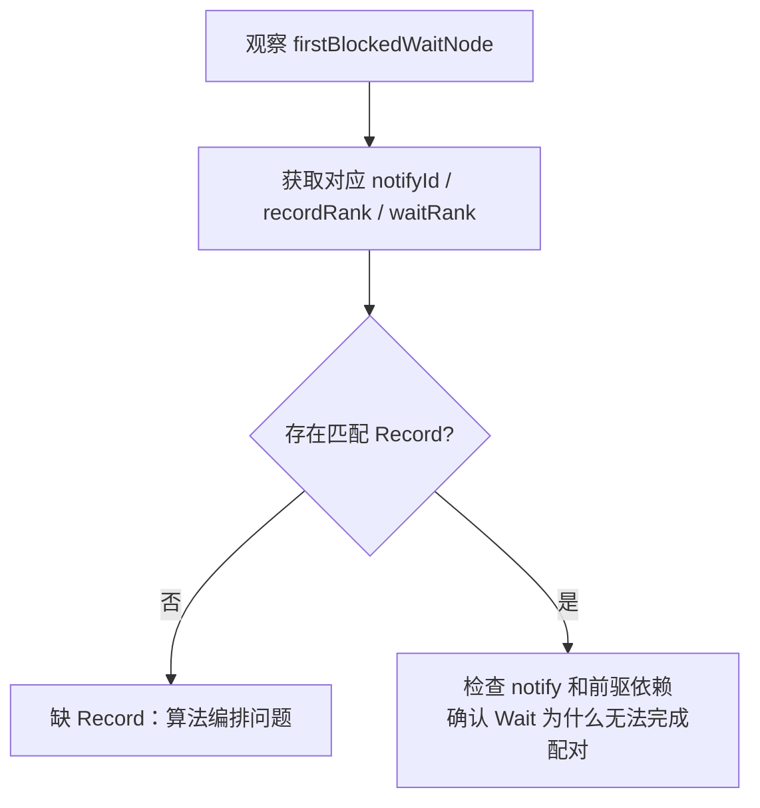
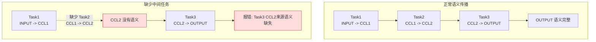
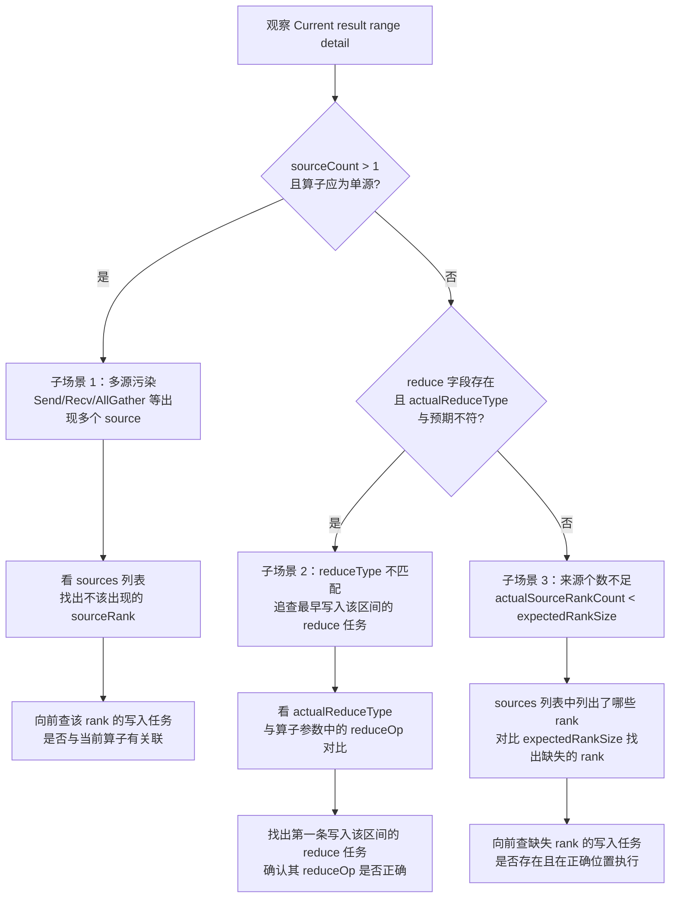

```mermaid
---
config:
  gantt:
    displayMode: compact
---
gantt
    title 目标Buffer
    dateFormat x
    axisFormat 0x%L
    tickInterval 100millisecond
    todayMarker off

    section 地址布局
    0x000-0x100 已有数据 :done, blk0, 0, 100ms
    0x100-0x200 空洞   :crit, hole, 100, 100ms
    0x200-0x300 已有数据 :done, blk1, 200, 100ms
```

# Checker 错误码 FAQ

> 本文基于当前分支 `hvrm/0701/CheckerL2/src/plugin/checker` 的实际代码整理。

---

## 模块：Checker

### 子模块：成图阶段错误

---

#### FAQ-CHK101

**标题:** 成图翻译失败

**错误码:**
```
GRAPH_TRANSLATE_FAILED (101)
```

**关键日志:**
```
[GenGraph] [ErrorCode: 101] Failed to convert one task into a graph node, taskIndex=128, taskType=0, rankId=3, streamId=7, ret=1, taskMeta={taskType=0, rankId=3, streamId=7, srcRankId=3, dstRankId=4, srcOffset=0, dstOffset=4096, len=1024, protocol=1}
```

**问题现象:** 成图阶段无法将输入 task meta 翻译为内部图节点，常见于任务类型不支持或字段组合不满足翻译条件。

**定位指导:**
```
【可能原因】
1. 该 `taskType` 当前没有对应的翻译实现。
2. `rankId`、`streamId`、偏移、长度等字段异常。
3. 上游生成的 task meta 自身有问题。

【排查步骤】
典型报错点:
- `src/framework/task_graph_generator_v3/task_meta_translator_v3.cc`
1. 普通 task meta 无法翻译成图节点: 先按 `taskIndex` 在原始 task 列表里定位是哪一条任务；再根据具体任务信息，确认问题根因。
```
---

#### FAQ-CHK102

**标题:** 成图阶段死锁

**错误码:**
```
GRAPH_DEADLOCK (102)
```

**关键日志:**
```
[GenGraph] [ErrorCode: 102] Local Record/Wait matching is stuck on this rank. Some Wait tasks are still blocked, but no new local Record task can unblock them, rankId=0, firstBlockedWaitNode=[TaskWaitAICPU] node=143, rank=0, stream=3, protocol=SDMA, notify={recordRank=0, waitRank=0, notifyId=17}, blockedWaitNodeCount=5
```

**问题现象:** 成图阶段的同步配对推进卡住，仍有 Wait 节点等待，但没有新的 Record 节点能够与 Wait 节点配对。

**定位指导:**
```
【可能原因】
1. Wait 数量多于 Record，或 Record 因其他依赖未执行到而无法参与配对。
2. `notifyId` 错误，Wait 和 Record 的 `notifyId` 不一致，导致无法完成配对。
3. Record 本身已执行，但其后继 Wait 的前驱依赖尚未满足，Wait 无法进入可配对队列。

【排查步骤】
1. 阅读日志中 `firstBlockedWaitNode` 的 `notifyId`、`recordRank` 和 `waitRank`，确认这条 Wait 理论上应该由谁解锁。
2. 查询同 rank 或对应的对端 rank 上是否存在匹配的 Record；如果存在，再继续看两者能否正确配对。
```

**图示说明:**

---

#### FAQ-CHK103

**标题:** 同步配对残留未消费

**错误码:**
```
GRAPH_UNMATCHED (103)
```

**关键日志:**
```
[GenGraph] [ErrorCode: 103] Found cross-rank Record tasks that were never consumed by any matching Wait task, recordRankId=0, waitRankId=3, notifyId=21, firstUnconsumedRecordNode=[TaskRecordAICPU] node=77, rank=0, stream=1, protocol=RDMA, notify={recordRank=0, waitRank=3, notifyId=21}, unconsumedRecordCount=2
```

**问题现象:** 同步配对结束后仍残留未被消费的同步节点，通常表现为 Record 没有对应的 Wait。

**定位指导:**
```
【可能原因】
1. Record 与 Wait 数量不匹配。
2. 使用的 `notifyId` 不正确。

【排查步骤】
1. 查看 `recordRankId`、`waitRankId`、`notifyId` 是否符合预期。
```
---

#### FAQ-CHK104

**标题:** AIV 分组成员缺失

**错误码:**
```
GRAPH_MEMBER_MISSING (104)
```

**问题现象:** 该错误码主要表示 AIV 模式下成图阶段发现分组成员不完整。

---

#### FAQ-CHK105

**标题:** 图结构非法

**错误码:**
```
GRAPH_STRUCTURE_INVALID (105)
```

**关键日志:**
```
[GenGraph] [ErrorCode: 105] Failed to remove one graph edge because the parent or child node does not exist, parentNodeId=91, childNodeId=123, parentNode=[TaskTransMem] node=91, rank=2, stream=0, protocol=SDMA, src={rank=2, mem=INPUT, offset=0x0, len=0x400}, dst={rank=2, mem=CCL, offset=0x1000, len=0x400}, childNode=null
```

**问题现象:** 图边关系不满足建图前提，例如删边或重连时父节点、子节点不存在。

**定位指导:**
```
【可能原因】
1. 该问题通常不是算法编排问题。

【排查步骤】
1. 先确认 `Checker` 中是否已经生成了任务节点。
2. 可联系工具支撑人员协助定位。
```
---

#### FAQ-CHK106

**标题:** AIV 快照不一致

**错误码:**
```
GRAPH_SNAPSHOT_MISMATCH (106)
```

**问题现象:** 该错误码主要表示 AIV 模式下成图阶段加载的快照或环境信息不一致。

---

#### FAQ-CHK107

**标题:** 成图资源缺失

**错误码:**
```
GRAPH_RESOURCE_NOT_FOUND (107)
```

**问题现象:** 该错误码主要表示 AIV 模式下成图阶段依赖的资源、映射或数据文件缺失。

---

#### FAQ-CHK108

**标题:** 寄存器或 HBM 未初始化

**错误码:**
```
GRAPH_REGISTER_UNINITIALIZED (108)
```

**关键日志:**
```
[GenGraphCCU] [ErrorCode: 108] Failed to read XN register before it was initialized, rankId=2, dieId=0, instrId=73, xnId=11

[GenGraphCCU] [ErrorCode: 108] Failed to read HBM content before it was initialized, rankId=2, dieId=0, instrId=73, hbmAddr=0x1000
```

**问题现象:** 当前指令在读取寄存器或 HBM 内容时，没有找到对应的已初始化数据，通常说明前序写入链路没有正确建立。

**定位指导:**
```
【可能原因】
1. 前置 Load / Set / Store 指令未执行到。
2. 负责初始化的 queue 被 Wait 等依赖阻塞，未能推进。
3. 地址或寄存器解析错位，读到了不该访问的位置。

【排查步骤】
1. 如果日志里给出了 `xnId`，向前回看该 queue 中最近一次对该寄存器的合法写入。
2. 如果日志里给出了 `hbmAddr`，检查对应地址区间在更早任务中是否存在合法写入。
```
---

#### FAQ-CHK109

**标题:** 编号或索引越界

**错误码:**
```
GRAPH_OUT_OF_RANGE (109)
```

**关键日志:**
```
[GenGraphCCU] [ErrorCode: 109] dieId is out of range when converting address to MS id, dieId=4, maxDieId=1

[GenGraphCCU] [ErrorCode: 109] Xn register id is out of the valid range, xnId=37, validMin=0, validMax=31
```

**问题现象:** 编号、索引或地址归属字段超出当前资源或指令约束范围，常见于 `dieId`、寄存器编号或地址解析中间结果越界。

**定位指导:**
```
【可能原因】
1. 资源库规模与任务数据不匹配，例如只加载了部分 die。
2. 地址归属解析错误，把本地地址映射到了不存在的资源编号。
3. 指令字段解析错位，导致寄存器编号或索引值异常。
4. 当前数据来自不同版本或不同分支的指令集。

【排查步骤】
1. 如果日志里给出了 `dieId/maxDieId`，先核对当前资源文件中的 die 数量是否和任务数据一致。
2. 如果日志里给出了 `xnId/validMin/validMax`，再回看原始指令字段，确认寄存器编号是否被错误解析或计算。
```
---

#### FAQ-CHK110

**标题:** 地址非法或未满足对齐约束

**错误码:**
```
GRAPH_ADDRESS_INVALID (110)
```

**关键日志:**
```
[GenGraphCCU] [ErrorCode: 110] Address does not fall into any known MS address range, localMsAddr=0x27f0000, rawAddr=0x82ff000

[GenGraphCCU] [ErrorCode: 110] Load source address must be 8-byte aligned, sourceAddress=0x1003
```

**问题现象:** 地址无法映射到 Checker 已知的资源区间，或 Load/Store 相关地址、长度不满足当前指令的对齐约束。

**定位指导:**
```
【可能原因】
1. 基础地址表不匹配。
2. 原始地址被上游错误写入，导致值异常。
3. 上游地址计算偏了。
4. 某条指令的地址或长度没有按要求对齐。

【排查步骤】
1. 如果日志给出了 `rawAddr/localMsAddr` 或 `addr/dieBaseAddr`，先判断该地址理论上应落在哪类资源区间。
2. 如果日志给出了 `sourceAddress`、`hbmAddr` 或 `dataLengthBytes`，再核对是否满足 8 字节或 64 字节粒度约束。
```
---

#### FAQ-CHK111

**标题:** 当前任务或指令暂不支持

**错误码:**
```
GRAPH_UNSUPPORTED (111)
```

**关键日志:**
```
[GenGraph] [ErrorCode: 111] This task type is not supported for CheckerV3 graph generation, taskIndex=128, taskType=9, rankId=3, streamId=7, taskMeta={taskType=9, rankId=3, streamId=7}

[GenGraphCCU] [ErrorCode: 111] This CCU instruction type is not supported by CheckerV3 graph expansion, rankId=2, queueId=1, instructionHeader=0xf431
```

**问题现象:** 使用了尚未被 Checker 支持的特性。

**定位指导:**
```
【可能原因】
1. Checker 尚未支持该特性。

【排查步骤】
1. 查看日志中的对应字段，确认是否符合预期。
2. 可联系工具支撑人员协助定位。
```
---

#### FAQ-CHK112

**标题:** 远端 Rank 推导不一致

**错误码:**
```
GRAPH_REMOTE_RANK_MISMATCH (112)
```

**关键日志:**
```
[GenGraphCCU] [ErrorCode: 112] Remote address resolves to a different rank than the selected channel, instruction=TransLocMemToRmtMem, rankId=2, dieId=0, queueId=1, instrId=73, channelId=7, expectedRemoteRankId=5, actualRemoteRankId=6, remoteAddr=140737488363520
```

**问题现象:** 按 channel 或 remote address 推导出来的远端 rank 不一致。

**定位指导:**
```
【可能原因】
1. channel 表错误。
2. 远端地址被错误编码。

【排查步骤】
1. 核对 `channelId` 和 `remoteAddr` 所属 rank，确认是否符合预期。
```
---

#### FAQ-CHK113

**标题:** Merged Loop 发射失败

**错误码:**
```
GRAPH_LOOP_MERGE_ERROR (113)
```

**关键日志:**
```
[GenGraphCCU] [ErrorCode: 113] Failed to emit one merged loop instruction because the merged instruction entry is null, rankId=2, queueId=1

[GenGraphCCU] [ErrorCode: 113] Failed to emit one merged loop transfer task, rankId=2, queueId=1, mergedLoopInstr={rankId=2, dieId=0, instrId=73, srcs=4, dsts=4, waitOps=1, setOps=1}
```

**问题现象:** CCU 模式下 Loop 合并失败。

**定位指导:**
```
【可能原因】
1. Loop 串行、并行展开时出现资源冲突（内存地址、CKE 等）。
注: Loop 合并失败后会尝试正常展开，可能会影响性能。

【排查步骤】
1. 确认 Loop 体指令模板设计符合预期。

```
---

### 子模块：单任务与从流校验错误

---

#### FAQ-CHK201

**标题:** Memory Slice 非法

**错误码:**
```
SINGLETASK_SLICE_INVALID (201)
```

**错误函数:**
```
task_graph_single_task_check_v3.cc::CheckMemorySlice()
task_graph_single_task_check_v3.cc::CheckBatchTrans()
task_graph_mem_conflict_v3.cc
task_graph_semantic_check_v3.cc
```

**关键日志:**
```
[MemConflict] [ErrorCode: 201] One memory slice is missing a valid rank or memory type, task=[TaskTransMem] node=42, rank=0, stream=2, protocol=SDMA, src={rank=0, mem=INPUT, offset=0x0, len=0x400}, dst={rank=0, mem=CCL, offset=0x1000, len=0x400}, rankId=invalid, memType=invalid, offset=0x0, length=0x400
    

[SingleTaskCheck] [ErrorCode: 201] One memory slice is invalid because its end address overflows while total coverage is being calculated, task=[TaskBatchTransMem] node=108, rank=1, stream=5, protocol=CCU, pairCount=2, mergedPairCount=2, src0={rank=1, mem=CCL, offset=0xfffffffffffffff0, len=0x40}, dst0={rank=1, mem=OUTPUT, offset=0x0, len=0x40}, memorySlice={rankId=1, memType=CCL, offset=0xfffffffffffffff0, length=0x40}, offset=0xfffffffffffffff0, length=0x40
    

[SingleTaskCheck] [ErrorCode: 201] Batch trans slice length mismatch, node=[TaskBatchTransMem] node=108, rank=1, stream=5, protocol=CCU, label=src, index=2, expectedLen=0x400, actualLen=0x200

[SingleTaskCheck] [ErrorCode: 201] Batch trans pair size mismatch, node=[TaskBatchTransMem] node=108, rank=1, stream=5, protocol=CCU, label=src, srcCount=4, dstCount=3

[SingleTaskCheck] [ErrorCode: 201] Batch reduce has different counts of source groups and target memory slices, task=[TaskBatchReduce] node=176, rank=2, stream=4, protocol=CCU, group=src, sourceGroupCount=3, targetMemorySliceCount=2

[SingleTaskCheck] [ErrorCode: 201] Source data size is not an integer multiple of target data size, task=[TaskBatchReduce] node=176, rank=2, stream=4, protocol=CCU, srcDataSize=0xc00, dstDataSize=0x800, group=src
```

**问题现象:** memory slice 本体不合法，或同组 slice 出现重叠；问题可能出现在单任务校验、内存冲突检查或语义模拟阶段。

**定位指导:**
```
【可能原因】
1. slice 字段不完整。
2. 内存类型转换失败。
3. 长度或偏移不符合预期。
4. CCU Loop 合并时发现 loop 间有 slice 重叠。

【排查步骤】
1. 观察日志中输出的 slice 字段的 `rankId/memType/offset/length` 是否符合预期。
```

---

#### FAQ-CHK202

**标题:** 单任务内 Slice 冲突

**错误码:**
```
SINGLETASK_SLICE_CONFLICT (202)
```

**关键日志:**
```
[SingleTaskCheck] [ErrorCode: 202] Two memory slices overlap inside the same task, task=[TaskReduce] node=57, rank=0, stream=4, protocol=CCU, dataType=0, reduceOp=0, srcs=[{rank=0, mem=CCL, offset=0x1000, len=0x400}, {rank=0, mem=CCL, offset=0x1200, len=0x400}], dst={rank=0, mem=OUTPUT, offset=0x0, len=0x400}, memorySlice1={rankId=0, memType=CCL, offset=0x1000, length=0x400}, memorySlice2={rankId=0, memType=CCL, offset=0x1200, length=0x400}, position=rankId=0, streamId=4
```

**问题现象:** 同一条任务内部存在重叠的 memory slice，导致同一 buffer 的地址区间发生交叉。

**定位指导:**
```
【可能原因】
1. Transmem 源和目的地址有重叠。
2. Reduce 源片段划分错了。
3. Batch 合并后仍有重叠残留。
注: CCU 模式下允许源和目的地址完全一致的情况。

【排查步骤】
1. 观察日志中输出的 slice 字段的 `rankId/memType/offset/length` 是否符合预期。
```

---

#### FAQ-CHK203

**标题:** 从流结构非法

**错误码:**
```
SINGLETASK_SLAVE_STREAM_INVALID (203)
```

**关键日志:**
```
[StreamCheck] [ErrorCode: 203] This slave stream is missing its start node or end node, rankId=0, streamId=6, taskCount=4, startNode=null, endNode=[TaskRecordAICPU] node=241, rank=0, stream=6, protocol=SDMA, notify={recordRank=0, waitRank=0, notifyId=32}
    

[StreamCheck] [ErrorCode: 203] The first task in this slave stream is not a local WAIT task, rankId=0, streamId=6, actualFirstTaskType=TRANS_MEM, firstTask=[TaskTransMem] node=214, rank=0, stream=6, protocol=SDMA, src={rank=0, mem=INPUT, offset=0x0, len=0x400}, dst={rank=0, mem=CCL, offset=0x4000, len=0x400}
    

[StreamCheck] [ErrorCode: 203] The last task in this slave stream is not a local RECORD task, rankId=0, streamId=6, actualLastTaskType=WAIT, lastTask=[TaskWaitAICPU] node=245, rank=0, stream=6, protocol=SDMA, notify={recordRank=0, waitRank=0, notifyId=32}
    

[StreamCheck] [ErrorCode: 203] This slave stream still has no valid end node after empty local-copy tasks are skipped, rankId=0, streamId=6, skippedEmptyLocalCopyCount=3, currentTailNode=null
```

**问题现象:** 从流结构不满足 Checker 的约束，常见表现为缺少有效头尾节点、首任务不是本地 `WAIT`，或尾任务不是本地 `RECORD`。

**定位指导:**
```
【可能原因】
1. 从流缺少头尾同步节点。

【排查步骤】
1. 从流缺开始或结束节点: 确认 stream 节点列表本身是否完整，再确认当前的首尾节点是否符合预期
```

---

### 子模块：内存冲突与可达性错误

---

#### FAQ-CHK301

**标题:** 内存冲突 DAG 非法

**错误码:**
```
MEMCONFLICT_DAG_INVALID (301)
```

**关键日志:**
```
[MemConflict] [ErrorCode: 301] Reachability analysis cannot start because the main start node is invalid, mainStartNode=[TaskTransMem] node=42, rank=0, stream=2, protocol=SDMA, src={rank=0, mem=INPUT, offset=0x0, len=0x400}, dst={rank=0, mem=CCL, offset=0x1000, len=0x400}
    

[MemConflict] [ErrorCode: 301] This data-move node is missing its reachability index, node=[TaskBatchTransMem] node=318, rank=3, stream=2, protocol=CCU, pairCount=4, mergedPairCount=2, src0={rank=3, mem=CCL, offset=0x8000, len=0x400}, dst0={rank=3, mem=OUTPUT, offset=0x0, len=0x400}
    

[MemConflict] [ErrorCode: 301] This V3 graph is not a complete DAG from the main start node, topoSize=412, expectedTopoSize=415, reachableTaskCount=411, taskNodeCount=414, mainStartNodeId=-1
```

**问题现象:** 内存冲突检查依赖的主图结构异常，常见于主图起点非法、可达性索引缺节点，或任务图并非完整 DAG。

**定位指导:**
```
【可能原因】
1. 成图阶段生成的主图不完整。
2. 部分任务节点不在 `main_start` 头节点的可达路径上。

【排查步骤】
1. 先确认任务图生成是否正确执行。
2. 可联系工具支撑人员协助定位。
```

---

#### FAQ-CHK302

**标题:** 检测到真实内存冲突

**错误码:**
```
MEMCONFLICT_DETECTED (302)
```

**关键日志:**
```
[MemConflict] [ErrorCode: 302] Memory conflict detected, memory={rankId=0, memoryType=OUTPUT}, overlap=[0x1000,0x1400), conflictTask1={taskNodeId=214, taskAction=write, memory={rankId=0, memoryType=OUTPUT}, byteRange=[0x1000,0x1800), task=[TaskTransMem] node=214, rank=0, stream=6, protocol=SDMA, src={rank=0, mem=CCL, offset=0x4000, len=0x800}, dst={rank=0, mem=OUTPUT, offset=0x1000, len=0x800}}, conflictTask2={taskNodeId=233, taskAction=write, memory={rankId=0, memoryType=OUTPUT}, byteRange=[0x1000,0x1400), task=[TaskReduce] node=233, rank=0, stream=8, protocol=CCU, dataType=0, reduceOp=0, srcs=[{rank=0, mem=CCL, offset=0x5000, len=0x400}, {rank=3, mem=CCL, offset=0x5000, len=0x400}], dst={rank=0, mem=OUTPUT, offset=0x1000, len=0x400}}
```

**问题现象:** 检测到了真实的内存并发冲突，两条任务访问同一内存区间，且至少一方是写。

**定位指导:**
```
【可能原因】
1. 两条 stream 间缺少同步约束。
2. 原本应串行的任务被错误建成可并发。
3. 读写区间切分或地址计算不正确。
注: 仅校验 `读-写` / `写-写` 冲突，`读-读` 不认为冲突。

【排查步骤】
1. 查看日志，确认是哪两条任务在什么地址区间发生冲突，检查任务排布和同步信号设计是否符合预期。
```

---

### 子模块：语义模拟与最终输出校验错误

---

#### FAQ-CHK401

**标题:** 目标区间没有语义来源

**错误码:**
```
SEMANTIC_BUFFER_EMPTY (401)
```

**关键日志:**
```
[SemanticCheck] [ErrorCode: 401] No source/output information was found for the target memory range, startAddr=0x0, size=0x1000
```

**问题现象:** 语义检查在目标区间上找不到任何可用的源数据或输出语义。

**定位指导:**
```
【可能原因】
1. 相关写入任务还没被执行到。
2. 更早的语义构造已因其他错误提前失败。
注: Checker 只会默认初始化 INPUT 内存语义，后续将根据内存操作任务进行语义传播。

【排查步骤】
1. 先确认这段结果理论上应由哪条任务写入，确认其使用的 src 源地址语义是否被正确设置。
```

**图示说明:**


---

#### FAQ-CHK402

**标题:** 语义结果区间断裂

**错误码:**
```
SEMANTIC_GAP (402)
```

**关键日志:**
```
[SemanticCheck] [ErrorCode: 402] Output data does not start from the expected address; the beginning is missing, expectedStart=0x0, actualStart=0x400
    

[SemanticCheck] [ErrorCode: 402] Output data is broken in the middle; one piece ends at 0x800 but the next starts at 0xc00
    

[SemanticCheck] [ErrorCode: 402] Output data ends too early; the tail is missing, expectedEnd=0x2000, actualEnd=0x1c00
```

**问题现象:** 语义结果区间不连续，常见表现为开头缺失、中间断裂或尾部未覆盖完整。

**定位指导:**
```
【可能原因】
1. 相关写入任务没有完整执行。
2. 偏移量或长度计算不符合预期。

【排查步骤】
1. 先根据 `expectedStart/actualStart`、断点地址或 `expectedEnd/actualEnd` 判断是头部缺失、中间断裂还是尾部缺失。
2. 再查看对应的写任务，确认是哪一段数据没有写入或写入长度不正确。
```

**图示说明:**


---

#### FAQ-CHK403

**标题:** Reduce 语义不正确

**错误码:**
```
SEMANTIC_REDUCE_ERROR (403)
```

**关键日志:**
```
[SemanticCheck] [ErrorCode: 403] Target output range is only partially filled before reduce continues, dataMapping={operation=reduce, sourceMemorySlice={rankId=3, memoryType=CCL, offset=0x800, length=0x400}, targetMemorySlice={rankId=1, memoryType=OUTPUT, offset=0x0, length=0x400}, launchIdx=18446744073709551615, blockId=4294967295, pipeId=4294967295, taskId=4294967295, reduceType=HCCL_REDUCE_SUM}, outputRange=[0x0,0x400), pieceCount=1
    

[SemanticCheck] [ErrorCode: 403] Reduce result type is inconsistent while merging one source data range, dataMapping={operation=reduce, sourceMemorySlice={rankId=2, memoryType=CCL, offset=0x0, length=0x400}, targetMemorySlice={rankId=0, memoryType=OUTPUT, offset=0x0, length=0x400}, launchIdx=18446744073709551615, blockId=4294967295, pipeId=4294967295, taskId=4294967295, reduceType=HCCL_REDUCE_MAX}
    

[SemanticCheck] [ErrorCode: 403] Source data needed by this reduce is missing, dataMapping={operation=reduce, sourceMemorySlice={rankId=5, memoryType=INPUT, offset=0x400, length=0x400}, targetMemorySlice={rankId=0, memoryType=OUTPUT, offset=0x400, length=0x400}, launchIdx=18446744073709551615, blockId=4294967295, pipeId=4294967295, taskId=4294967295, reduceType=HCCL_REDUCE_SUM}
    

```

**问题现象:** reduce 语义链路不完整或不一致，常见表现为目标区间覆盖不完全就继续 reduce、reduce 类型不一致，或 reduce 源数据缺失。

**定位指导:**
```
【可能原因】
1. 前序 overwrite 或搬运没有把目标区间、源区间覆盖完整。
2. reduce 执行顺序异常，或不同 `reduceOp` 被写到同一目标区间。
3. 某些 rank 未正确参与 reduce。

【排查步骤】
1. 观察日志信息，先判断是区间不完整、类型不一致还是源数据缺失。
2. 再查看对应前序内存操作任务，确认是哪一段语义链路缺失。
```

---

#### FAQ-CHK404

**标题:** overwrite 源语义缺失

**错误码:**
```
SEMANTIC_SIMULATE_FAILED (404)
```

**关键日志:**
```
[SemanticCheck] [ErrorCode: 404] Source data needed by this overwrite is missing, dataMapping={operation=overwrite, sourceMemorySlice={rankId=1, memoryType=INPUT, offset=0x0, length=0x800}, targetMemorySlice={rankId=1, memoryType=OUTPUT, offset=0x0, length=0x800}, launchIdx=18446744073709551615, blockId=4294967295, pipeId=4294967295, taskId=4294967295}
```

**问题现象:** overwrite 依赖的源区间语义不完整。当前语义实现会继续模拟，但会告警提示该 overwrite 不是“完整 memcpy 语义”，后续语义分析结果可能受影响。

**定位指导:**
```
【可能原因】
1. overwrite 的源区间在此前没有被完整初始化，或只建立了部分来源语义。
2. 前序搬运/切片任务的源地址、长度配置有误，导致 overwrite 读取到未建立语义的空洞区间。
3. 某些依赖任务缺失、顺序异常，导致 overwrite 执行时对应源数据尚未准备好。

【排查步骤】
1. 根据 `sourceMemorySlice` 定位 overwrite 读取的源 buffer 区间，确认该区间在前序任务中是否已建立完整语义。
2. 检查 overwrite 前的搬运、切片、reduce 等任务，确认地址范围连续、长度匹配，且不存在中间空洞。
3. 如果这是预期行为，需进一步确认后续分析是否允许“部分来源语义”继续传播；否则应补齐前序数据链路。
```

---

#### FAQ-CHK405

**标题:** 最终输出校验前置条件不满足

**错误码:**
```
SEMANTIC_FINAL_CHECK_FAILED (405)
```

**关键日志:**
```
[SemanticCheck] [ErrorCode: 405] Send/Recv final output validation supports exactly 2 ranks, but got expectedRankSize=2, actualRankSize=3, sourceRank=1, targetRank=5
```

**问题现象:** 最终输出校验的前置条件不满足，例如 Send/Recv 场景使用的 rank 数不是 2。

**定位指导:**
```
【可能原因】
1. 输入 rank 数配置不正确。
2. 把不属于同一个 Send/Recv 的 rank 混到了一起。

【排查步骤】
1. 确认本轮 Send/Recv 校验理论上是否只应包含两个 rank。
```

---

#### FAQ-CHK406

**标题:** 最终输出存在缺失

**错误码:**
```
SEMANTIC_FINAL_MISSING (406)
```

**关键日志:**
```
[SemanticCheck] [ErrorCode: 406] AllGatherV produced no result data for rank 3, but this rank is expected to receive data from all ranks, expectedSourceRankCount=8, expectedResultSize=0x1c00
    

[SemanticCheck] [ErrorCode: 406] Send/Recv result data does not start from the expected address, rankId=5, expectedStartAddr=0x0, actualStartAddr=0x400, actualBufferRange=[0x400,0x800)
    Current result range detail:
      range=[0x400,0x800), size=0x400, sourceCount=1
      sources:
        - sourceRank=1, sourceBufferType=INPUT, sourceAddr=0x0
    

[SemanticCheck] [ErrorCode: 406] ReduceScatter result data ends before the expected total size is reached, rankId=6, checkedSize=0x1800, expectedSize=0x1c00
```

**问题现象:** 最终输出存在缺失，常见表现为某个 rank 完全没有结果、结果起始地址不对，或结果尾部未写满。

**定位指导:**
```
【可能原因】
1. 结果写入链路没有完整执行。
2. 内存搬运过程有缺失或异常偏移。
3. 地址偏移或分片大小不符合预期。

【排查步骤】
1. 先根据 `expectedStartAddr/actualStartAddr`、`expectedSize/checkedSize` 判断缺的是哪一段结果。
2. 再从对应 rank 的内存搬运任务往前回溯，确认各处内存搬运任务是否符合预期。
```

---

#### FAQ-CHK407

**标题:** 最终输出来源属性错误

**错误码:**
```
SEMANTIC_FINAL_SRC_ERROR (407)
```

**关键日志:**
```
[SemanticCheck] [ErrorCode: 407] This AllGatherV result range comes from the wrong source rank, rankId=3, actualSourceRank=5, expectedSourceRank=4, actualBufferRange=[0x1000,0x1400)
    Current result range detail:
      range=[0x1000,0x1400), size=0x400, sourceCount=1
      sources:
        - sourceRank=5, sourceBufferType=INPUT, sourceAddr=0x0
    

[SemanticCheck] [ErrorCode: 407] This AllReduce result range comes from a non-INPUT buffer, but it should come from INPUT, rankId=0, actualSourceRank=3, actualSourceBufferType=CCL, actualBufferRange=[0x0,0x400)
    Current result range detail:
      range=[0x0,0x400), size=0x400, reduce=HCCL_REDUCE_SUM, sourceCount=8
      sources:
        - sourceRank=0, sourceBufferType=INPUT, sourceAddr=0x0
        - sourceRank=1, sourceBufferType=INPUT, sourceAddr=0x0
        - sourceRank=2, sourceBufferType=INPUT, sourceAddr=0x0
        - sourceRank=3, sourceBufferType=CCL, sourceAddr=0x0
        - sourceRank=4, sourceBufferType=INPUT, sourceAddr=0x0
        - sourceRank=5, sourceBufferType=INPUT, sourceAddr=0x0
        - sourceRank=6, sourceBufferType=INPUT, sourceAddr=0x0
        - sourceRank=7, sourceBufferType=INPUT, sourceAddr=0x0
    

[SemanticCheck] [ErrorCode: 407] Source address for this Send/Recv result range does not match the expected input address, rankId=5, sourceRank=1, expectedAddr=0x400, actualAddr=0x0, actualBufferRange=[0x400,0x800)
    Current result range detail:
      range=[0x400,0x800), size=0x400, sourceCount=1
      sources:
        - sourceRank=1, sourceBufferType=INPUT, sourceAddr=0x0
```

**问题现象:** 最终输出的来源属性不正确，可能表现为来源 rank、来源 buffer 类型或来源地址与预期不一致。

**定位指导:**
```
【可能原因】
1. 结果拼接顺序或 rank 语义标记错误。
2. 中间 buffer 被错误当成最终来源。
3. 地址偏移或分片顺序不符合预期。

【排查步骤】
1. 先观察 `actualSourceRank`、`actualSourceBufferType`、`expectedAddr` 和 `actualAddr`，判断问题类型。
2. 再查看对应的内存搬运任务，确认各处内存搬运任务是否符合预期。
```

---

#### FAQ-CHK408

**标题:** 单个来源数据量过大

**错误码:**
```
SEMANTIC_FINAL_SIZE_ERROR (408)
```

**关键日志:**
```
[SemanticCheck] [ErrorCode: 408] Data taken from one source rank is larger than expected in AllGatherV, rankId=3, sourceRank=4, actualSize=0x600, expectedSize=0x400, actualBufferRange=[0x1000,0x1600)
    Current result range detail:
      range=[0x1000,0x1600), size=0x600, sourceCount=1
      sources:
        - sourceRank=4, sourceBufferType=INPUT, sourceAddr=0x0
```

**问题现象:** 最终输出中某个源 rank 的贡献数据量超过算子语义允许的范围。

**定位指导:**
```
【可能原因】
1. 该 source rank 的长度配置不正确。
2. 同一段数据被重复拼接。

【排查步骤】
1. 先核对 `expectedSize` 对应的 counts/displs 配置，再确认该源 rank 的结果是否被重复拼接。
```

---

#### FAQ-CHK409

**标题:** 最终输出 Reduce 语义错误

**错误码:**
```
SEMANTIC_FINAL_REDUCE_ERROR (409)
```

**关键日志:**
```
[SemanticCheck] [ErrorCode: 409] This Send/Recv result range combines multiple sources, but this operator expects exactly one source, rankId=5, actualSourceCount=2, expectedSourceCount=1, outputRange=[0x0,0x400)
    Current result range detail:
      range=[0x0,0x400), size=0x400, sourceCount=2
      sources:
        - sourceRank=1, sourceBufferType=INPUT, sourceAddr=0x0
        - sourceRank=2, sourceBufferType=INPUT, sourceAddr=0x0
    

[SemanticCheck] [ErrorCode: 409] Reduce mode of this AllReduce result range does not match the operator setting, rankId=0, actualReduceType=HCCL_REDUCE_MAX, expectedReduceType=HCCL_REDUCE_SUM, outputRange=[0x0,0x400)
    Current result range detail:
      range=[0x0,0x400), size=0x400, reduce=HCCL_REDUCE_MAX, sourceCount=8
      sources:
        - sourceRank=0, sourceBufferType=INPUT, sourceAddr=0x0
        - sourceRank=1, sourceBufferType=INPUT, sourceAddr=0x0
        - sourceRank=2, sourceBufferType=INPUT, sourceAddr=0x0
        - sourceRank=3, sourceBufferType=INPUT, sourceAddr=0x0
        - sourceRank=4, sourceBufferType=INPUT, sourceAddr=0x0
        - sourceRank=5, sourceBufferType=INPUT, sourceAddr=0x0
        - sourceRank=6, sourceBufferType=INPUT, sourceAddr=0x0
        - sourceRank=7, sourceBufferType=INPUT, sourceAddr=0x0
    

[SemanticCheck] [ErrorCode: 409] This ReduceScatter result range does not include the expected number of source ranks, rankId=6, actualSourceRankCount=6, expectedRankSize=8, outputRange=[0x0,0x400)
    Current result range detail:
      range=[0x0,0x400), size=0x400, reduce=HCCL_REDUCE_SUM, sourceCount=6
      sources:
        - sourceRank=0, sourceBufferType=INPUT, sourceAddr=0x1800
        - sourceRank=1, sourceBufferType=INPUT, sourceAddr=0x1800
        - sourceRank=2, sourceBufferType=INPUT, sourceAddr=0x1800
        - sourceRank=3, sourceBufferType=INPUT, sourceAddr=0x1800
        - sourceRank=4, sourceBufferType=INPUT, sourceAddr=0x1800
        - sourceRank=5, sourceBufferType=INPUT, sourceAddr=0x1800
```

**问题现象:** 最终输出的 reduce 语义不正确，可能表现为单源算子出现多源、`reduceType` 不匹配，或来源 rank 个数不足。

**定位指导:**
```
【可能原因】
1. overwrite / reduce 合并逻辑不符合预期。
2. `reduceOp` 不一致，或中间语义被污染。
3. 某些 rank 的贡献没有进入结果区间。

【排查步骤】
1. 先观察 `sourceCount`、`expectedSourceCount`、`actualReduceType` 和 `sources` 列表，判断是多源、类型不一致还是来源缺失。
2. 再查看对应内存搬运和 Reduce 类任务，确认各处内存操作是否符合预期。
```

**图示说明:**


---

### 子模块：Dump 输出错误

---

#### FAQ-CHK501

**标题:** Dump 输出失败

**错误码:**
```
DUMP_FAILED (501)
```

**问题现象:** Dump 管理器初始化、文件写出或序列化过程失败，导致校验结果无法正常落盘。

**定位指导:**
```
【可能原因】
1. 输出目录或目标路径不可写。
2. 磁盘空间不足，或 dump 路径没有准备好。
3. 文件句柄、flush 或序列化失败。

【排查步骤】
1. 先检查 dump 输出目录、权限和磁盘空间。
2. 可联系工具支撑人员协助定位。
```

---

### 子模块：主流程与配置错误

---

#### FAQ-CHK901

**标题:** 运行时通用错误

**错误码:**
```
CHECKER_RUNTIME_ERROR (901)
```

**关键日志:**
```
[Main] [ErrorCode: 901] Failed to load instruction data for this rank, rankId=3
    

[Main] [ErrorCode: 901] Unsupported collective type, collectiveTypeCode=37
    

[SemanticCheck] [ErrorCode: 901] Semantic check initialization failed because the rank count is 0, collectiveType=AllReduce, dataType=FLOAT, elementCount=1024, reduceType=SUM
    

[SemanticCheck] [ErrorCode: 901] Output simulation stopped because some tasks still have unresolved dependencies, handledNodeCount=410, totalNodeCount=415, firstRemainingNode=[TaskReduce] node=233, rank=2, stream=5, protocol=CCU, dataType=0, reduceOp=0, srcs=[{rank=2, mem=CCL, offset=0x2000, len=0x400}], dst={rank=2, mem=OUTPUT, offset=0x0, len=0x400}
```

**问题现象:** 主流程运行时发生通用异常。

**定位指导:**
```
【可能原因】
1. 该问题通常为 Checker 内部问题。

【排查步骤】
1. 先确定报错类型，如为 `Unsupported` 等不支持类型，可自行排查数据是否符合 Checker 要求。
2. 可联系工具支撑人员协助定位。
```
---

#### FAQ-CHK902

**标题:** 配置或运行策略告警

**错误码:**
```
SETTING_WARNING (902)
```

**关键日志:**
```
[Main] [ErrorCode: 902] This op is skipped because both the new checker and the old checker are disabled, opIndex=47, newCheckerEnabled=0, oldCheckerEnabled=0
```

**问题现象:** 配置开关或运行策略不满足当前 op 的执行条件，例如新旧 checker 同时被关闭。

**定位指导:**
```
【可能原因】
1. manifest.json 或运行参数将 checker 关闭了。

【排查步骤】
1. 优先检查开关配置，确认至少启动一个 Checker。
```

---
