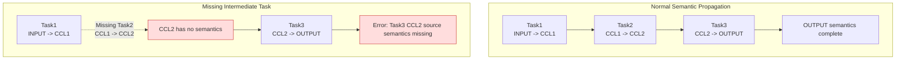

```mermaid
---
config:
  gantt:
    displayMode: compact
---
gantt
    title Target Buffer
    dateFormat x
    axisFormat 0x%L
    tickInterval 100millisecond
    todayMarker off

    section Address Layout
    0x000-0x100 Existing data :done, blk0, 0, 100ms
    0x100-0x200 Gap   :crit, hole, 100, 100ms
    0x200-0x300 Existing data :done, blk1, 200, 100ms
```

# Checker Error Code FAQ

---

## Module: Checker

### Submodule: Graph Generation Stage

---

#### FAQ-CHK101

**Title:** Graph Translation Failed

**Error Code:**

```
GRAPH_TRANSLATE_FAILED (101)
```

**Key Log:**

```
[GenGraph] [ErrorCode: 101] Failed to convert one task into a graph node, taskIndex=128, ret=1, taskMeta=taskType=0, rankId=3, streamId=7, srcRankId=3, dstRankId=4, src=[0x0,0x400), dst=[0x1000,0x1400), protocol=1
```

**Symptom:** During graph generation, the input task meta cannot be translated into an internal graph node. This commonly occurs when the task type is unsupported or field combinations do not meet translation conditions.

**Troubleshooting Guide:**

```
[Possible Causes]
1. No translation implementation exists for this `taskType`.
2. Fields such as `rankId`, `streamId`, offset, or length are abnormal.
3. The upstream-generated task meta itself is malformed.

[Troubleshooting Steps]
Typical error points:
1. A normal task meta cannot be translated into a graph node: First locate the specific task in the original task list using `taskIndex`; then determine the root cause based on the task details.
```
---

#### FAQ-CHK102

**Title:** Graph Generation Deadlock

**Error Code:**

```
GRAPH_DEADLOCK (102)
```

**Key Log:**

```
[GenGraph] [ErrorCode: 102] Local Record/Wait matching is stuck on this rank. Some Wait tasks are still blocked, but no new local Record task can unblock them, rankId=0, firstBlockedWaitNode=[TaskWaitAICPU] node=143, rank=0, stream=3, protocol=SDMA, notify={recordRank=0, waitRank=0, notifyId=17}, blockedWaitNodeCount=5
```

**Symptom:** During graph generation, synchronization pairing progression is stuck. Wait nodes are still waiting, but no new Record nodes can pair with them.

**Troubleshooting Guide:**

```
[Possible Causes]
1. Number of Waits exceeds Records, or Records cannot participate in pairing due to other unmet dependencies.
2. `notifyId` mismatch: Wait and Record have inconsistent `notifyIds`, preventing successful pairing.
3. Record has already executed, but its subsequent Wait's predecessors are not yet satisfied, so the Wait cannot enter the pairable queue.

[Troubleshooting Steps]
1. Read the `notifyId`, `recordRank`, and `waitRank` of `firstBlockedWaitNode` from the log to determine which rank should theoretically unlock this Wait.
2. Check if a matching Record exists on the same rank or the corresponding remote rank; if it exists, continue to examine whether they can pair correctly.
```

---

#### FAQ-CHK103

**Title:** Unconsumed Synchronization Pairing Residue

**Error Code:**

```
GRAPH_UNMATCHED (103)
```

**Key Log:**

```
[GenGraph] [ErrorCode: 103] Found cross-rank Record tasks that were never consumed by any matching Wait task, recordRankId=0, waitRankId=3, notifyId=21, firstUnconsumedRecordNode=[TaskRecordAICPU] node=77, rank=0, stream=1, protocol=RDMA, notify={recordRank=0, waitRank=3, notifyId=21}, unconsumedRecordCount=2
```

**Symptom:** After synchronization pairing completes, there are still unconsumed synchronization nodes. Typically, Records exist without corresponding Waits.

**Troubleshooting Guide:**

```
[Possible Causes]
1. Mismatch between the number of Records and Waits.
2. Incorrect `notifyId` used.

[Troubleshooting Steps]
1. Verify that `recordRankId`, `waitRankId`, and `notifyId` match expectations.
```
---

#### FAQ-CHK104

**Title:** AIV Group Member Missing

**Error Code:**

```
GRAPH_MEMBER_MISSING (104)
```

**Symptom:** This error indicates that during graph generation in AIV mode, a group member is incomplete.

---

#### FAQ-CHK105

**Title:** Invalid Graph Structure

**Error Code:**

```
GRAPH_STRUCTURE_INVALID (105)
```

**Key Log:**

```
[GenGraph] [ErrorCode: 105] Failed to remove one graph edge because the parent or child node does not exist, parentNodeId=91, childNodeId=123, parentNode=[TaskTransMem] node=91, rank=2, stream=0, protocol=SDMA, src=rank 2 INPUT [0x0,0x400), dst=rank 2 CCL [0x1000,0x1400), childNode=null
```

**Symptom:** Graph edge relationships violate graph construction prerequisites, such as parent or child nodes not existing during edge removal or reconnection.

**Troubleshooting Guide:**

```
[Possible Causes]
1. This issue is typically not an algorithm orchestration problem.

[Troubleshooting Steps]
1. First confirm whether the task node has been generated in `Checker`.
2. Contact tool support personnel for assistance.
```

---

#### FAQ-CHK106

**Title:** AIV Snapshot Inconsistency

**Error Code:**

```
GRAPH_SNAPSHOT_MISMATCH (106)
```

**Symptom:** This error indicates that the snapshot or environment information loaded during graph generation in AIV mode is inconsistent.

---

#### FAQ-CHK107

**Title:** Missing Graph Generation Resources

**Error Code:**

```
GRAPH_RESOURCE_NOT_FOUND (107)
```

**Symptom:** This error indicates that resources, mappings, or data files required during graph generation in AIV mode are missing.

---

#### FAQ-CHK108

**Title:** Register or HBM Uninitialized

**Error Code:**

```
GRAPH_REGISTER_UNINITIALIZED (108)
```

**Key Log:**

```
[GenGraphCCU] [ErrorCode: 108] Failed to read XN register before it was initialized, rankId=2, dieId=0, instrId=73, xnId=11

[GenGraphCCU] [ErrorCode: 108] Failed to read HBM content before it was initialized, rankId=2, dieId=0, instrId=73, hbmAddr=0x1000
```

**Symptom:** The current instruction cannot find initialized data when reading a register or HBM content. This typically indicates that the preceding write chain was not correctly established.

**Troubleshooting Guide:**

```
[Possible Causes]
1. Preceding Load/Set/Store instructions have not yet executed.
2. The queue responsible for initialization is blocked by dependencies (e.g., Wait) and cannot proceed.
3. Address or register parsing is misaligned, accessing unintended locations.

[Troubleshooting Steps]
1. If the log provides `xnId`, trace back to the most recent valid write to that register in the queue.
2. If the log provides `hbmAddr`, check whether a valid write exists for that address range in earlier tasks.
```

---

#### FAQ-CHK109

**Title:** ID or Index Out of Range

**Error Code:**

```
GRAPH_OUT_OF_RANGE (109)
```

**Key Log:**

```
[GenGraphCCU] [ErrorCode: 109] dieId is out of range when converting address to MS id, dieId=4, maxDieId=1

[GenGraphCCU] [ErrorCode: 109] Xn register id is out of the valid range, xnId=37, validMin=0, validMax=31
```

**Symptom:** An ID, index, or address attribution field exceeds the current resource or instruction constraint range. This commonly occurs with `dieId`, register numbers, or address parsing intermediate results.

**Troubleshooting Guide:**

```
[Possible Causes]
1. Resource pool size does not match task data (e.g., only a subset of dies is loaded).
2. Address attribution parsing error maps a local address to a nonexistent resource ID.
3. Instruction field parsing is misaligned, causing abnormal register numbers or index values.
4. Current data comes from instruction sets of different versions or branches.

[Troubleshooting Steps]
1. If the log provides `dieId/maxDieId`, first verify that the die count in the current resource file matches the task data.
2. If the log provides `xnId/validMin/validMax`, review the original instruction fields to confirm whether the register number was incorrectly parsed or calculated.
```

---

#### FAQ-CHK110

**Title:** Invalid Address or Unmet Alignment Constraints

**Error Code:**

```
GRAPH_ADDRESS_INVALID (110)
```

**Key Log:**

```
[GenGraphCCU] [ErrorCode: 110] Address does not fall into any known MS address range, localMsAddr=0x27f0000, rawAddr=0x82ff000

[GenGraphCCU] [ErrorCode: 110] Load source address must be 8-byte aligned, sourceAddress=0x1003
```

**Symptom:** The address cannot be mapped to a known resource range in Checker, or Load/Store-related addresses or lengths do not meet the alignment constraints of the current instruction.

**Troubleshooting Guide:**

```
[Possible Causes]
1. Base address table mismatch.
2. The original address was incorrectly written upstream, causing abnormal values.
3. Upstream address calculation is off.
4. An instruction's address or length is not properly aligned.

[Troubleshooting Steps]
1. If the log provides `rawAddr/localMsAddr` or `addr/dieBaseAddr`, first determine which resource range the address should theoretically fall into.
2. If the log provides `sourceAddress`, `hbmAddr`, or `dataLengthBytes`, verify whether it meets 8-byte or 64-byte granularity constraints.
```

---

#### FAQ-CHK111

**Title:** Current Task or Instruction Not Supported

**Error Code:**

```
GRAPH_UNSUPPORTED (111)
```

**Key Log:**

```
[GenGraph] [ErrorCode: 111] This task type is not supported for CheckerV3 graph generation, taskIndex=128, taskMeta=taskType=9, rankId=3, streamId=7

[GenGraphCCU] [ErrorCode: 111] This CCU instruction type is not supported by CheckerV3 graph expansion, rankId=2, queueId=1, instructionHeader=0xf431
```

**Symptom:** A feature not yet supported by Checker is being used.

**Troubleshooting Guide:**

```
[Possible Causes]
1. Checker does not yet support this feature.

[Troubleshooting Steps]
1. Check the corresponding fields in the log to confirm whether they match expectations.
2. Contact tool support personnel for assistance.
```

---

#### FAQ-CHK112

**Title:** Remote Rank Derivation Inconsistency

**Error Code:**

```
GRAPH_REMOTE_RANK_MISMATCH (112)
```

**Key Log:**

```
[GenGraphCCU] [ErrorCode: 112] Remote address resolves to a different rank than the selected channel, instruction=TransLocMemToRmtMem, rankId=2, dieId=0, queueId=1, instrId=73, channelId=7, expectedRemoteRankId=5, actualRemoteRankId=6, remoteAddr=140737488363520
```

**Symptom:** The remote rank derived from the channel or remote address is inconsistent.

**Troubleshooting Guide:**

```
[Possible Causes]
1. Channel table error.
2. Remote address incorrectly encoded.

[Troubleshooting Steps]
1. Verify the ranks to which `channelId` and `remoteAddr` belong to confirm they match expectations.
```

---

#### FAQ-CHK113

**Title:** Merged Loop Emission Failed

**Error Code:**

```
GRAPH_LOOP_MERGE_ERROR (113)
```

**Key Log:**

```
[GenGraphCCU] [ErrorCode: 113] Failed to emit one merged loop instruction because the merged instruction entry is null, rankId=2, queueId=1

[GenGraphCCU] [ErrorCode: 113] Failed to emit one merged loop transfer task, rankId=2, queueId=1, mergedLoopInstr={rankId=2, dieId=0, instrId=73, srcs=4, dsts=4, waitOps=1, setOps=1}
```

**Symptom:** Loop merging fails in CCU mode.

**Troubleshooting Guide:**

```
[Possible Causes]
1. Resource conflicts (memory addresses, CKE, etc.) occur during loop serial or parallel expansion.
Note: After loop merge failure, normal expansion will be attempted, which may impact performance.

[Troubleshooting Steps]
1. Confirm that the loop body instruction template design meets expectations.

```

---

### Submodule: Single Task and Slave Stream Validation

---

#### FAQ-CHK201

**Title:** Invalid Memory Slice

**Error Code:**

```
SINGLETASK_SLICE_INVALID (201)
```

**Error Functions:**

```
task_graph_single_task_check_v3.cc::CheckMemorySlice()
task_graph_single_task_check_v3.cc::CheckBatchTrans()
task_graph_mem_conflict_v3.cc
task_graph_semantic_check_v3.cc
```

**Key Log:**

```
[MemConflict] [ErrorCode: 201] One memory slice is missing a valid rank or memory type, task=[TaskTransMem] node=42, rank=0, stream=2, protocol=SDMA, src=rank 0 INPUT [0x0,0x400), dst=rank 0 CCL [0x1000,0x1400), rankId=invalid, memType=invalid, offset=0x0, length=0x400
    

[SingleTaskCheck] [ErrorCode: 201] One memory slice is invalid because its end address overflows while total coverage is being calculated, task=[TaskBatchTransMem] node=108, rank=1, stream=5, protocol=CCU, pairCount=2, mergedPairCount=2, src0=rank 1 CCL [0xfffffffffffffff0,0xffffffffffffff30), dst0=rank 1 OUTPUT [0x0,0x40), memorySlice={rankId=1, memType=CCL, offset=0xfffffffffffffff0, length=0x40}
    

[SingleTaskCheck] [ErrorCode: 201] Batch trans slice length mismatch, node=[TaskBatchTransMem] node=108, rank=1, stream=5, protocol=CCU, label=src, index=2, expectedLen=0x400, actualLen=0x200

[SingleTaskCheck] [ErrorCode: 201] Batch trans pair size mismatch, node=[TaskBatchTransMem] node=108, rank=1, stream=5, protocol=CCU, label=src, srcCount=4, dstCount=3

[SingleTaskCheck] [ErrorCode: 201] Batch reduce has different counts of source groups and target memory slices, task=[TaskBatchReduce] node=176, rank=2, stream=4, protocol=CCU, group=src, sourceGroupCount=3, targetMemorySliceCount=2

[SingleTaskCheck] [ErrorCode: 201] Source data size is not an integer multiple of target data size, task=[TaskBatchReduce] node=176, rank=2, stream=4, protocol=CCU, srcDataSize=0xc00, dstDataSize=0x800, group=src
```

**Symptom:** The memory slice itself is invalid, or slices in the same group overlap. The issue may occur during single task validation, memory conflict checking, or semantic simulation.

**Troubleshooting Guide:**

```
[Possible Causes]
1. Incomplete slice fields.
2. Memory type conversion failed.
3. Length or offset does not meet expectations.
4. Slice overlap detected between loops during CCU loop merging.

[Troubleshooting Steps]
1. Observe whether the `rankId/memType/offset/length` fields of the slice in the log match expectations.
```

---

#### FAQ-CHK202

**Title:** Slice Conflict Within a Single Task

**Error Code:**

```
SINGLETASK_SLICE_CONFLICT (202)
```

**Key Log:**

```
[SingleTaskCheck] [ErrorCode: 202] Two memory slices overlap inside the same task, task=[TaskReduce] node=57, rank=0, stream=4, protocol=CCU, dataType=0, reduceOp=0, srcs=[rank 0 CCL [0x1000,0x1400), rank 0 CCL [0x1200,0x1600)], dst=rank 0 OUTPUT [0x0,0x400), memorySlice1={rankId=0, memType=CCL, offset=0x1000, length=0x400}, memorySlice2={rankId=0, memType=CCL, offset=0x1200, length=0x400}, position=rankId=0, streamId=4
```

**Symptom:** Overlapping memory slices exist within a single task, causing address range intersections on the same buffer.

**Troubleshooting Guide:**

```
[Possible Causes]
1. Source and destination addresses in Transmem overlap.
2. Source segment partitioning in Reduce is incorrect.
3. Overlap remains after Batch merging.
Note: In CCU mode, source and destination addresses being identical is allowed.

[Troubleshooting Steps]
1. Observe whether the `rankId/memType/offset/length` fields of the slices in the log match expectations.
```

---

#### FAQ-CHK203

**Title:** Invalid Slave Stream Structure

**Error Code:**

```
SINGLETASK_SLAVE_STREAM_INVALID (203)
```

**Key Log:**

```
[StreamCheck] [ErrorCode: 203] This slave stream is missing its start node or end node, rankId=0, streamId=6, taskCount=4, startNode=null, endNode=[TaskRecordAICPU] node=241, rank=0, stream=6, protocol=SDMA, notify={recordRank=0, waitRank=0, notifyId=32}
    

[StreamCheck] [ErrorCode: 203] The first task in this slave stream is not a local WAIT task, rankId=0, streamId=6, actualFirstTaskType=TRANS_MEM, firstTask=[TaskTransMem] node=214, rank=0, stream=6, protocol=SDMA, src=rank 0 INPUT [0x0,0x400), dst=rank 0 CCL [0x4000,0x4400)
    

[StreamCheck] [ErrorCode: 203] The last task in this slave stream is not a local RECORD task, rankId=0, streamId=6, actualLastTaskType=WAIT, lastTask=[TaskWaitAICPU] node=245, rank=0, stream=6, protocol=SDMA, notify={recordRank=0, waitRank=0, notifyId=32}
    

[StreamCheck] [ErrorCode: 203] This slave stream still has no valid end node after empty local-copy tasks are skipped, rankId=0, streamId=6, skippedEmptyLocalCopyCount=3, currentTailNode=null
```

**Symptom:** The slave stream structure violates Checker constraints. Common manifestations include missing valid head/tail nodes, the first task not being a local `WAIT`, or the last task not being a local `RECORD`.

**Troubleshooting Guide:**

```
[Possible Causes]
1. Slave stream is missing head/tail synchronization nodes.

[Troubleshooting Steps]
1. Slave stream missing start or end node: First verify whether the stream node list itself is complete, then confirm whether the current head/tail nodes match expectations.
```

---

### Submodule: Memory Conflict Validation

---

#### FAQ-CHK301

**Title:** Invalid Memory Conflict DAG

**Error Code:**

```
MEMCONFLICT_DAG_INVALID (301)
```

**Key Log:**

```
[MemConflict] [ErrorCode: 301] Reachability analysis cannot start because the main start node is invalid, mainStartNode=[TaskTransMem] node=42, rank=0, stream=2, protocol=SDMA, src=rank 0 INPUT [0x0,0x400), dst=rank 0 CCL [0x1000,0x1400)
    

[MemConflict] [ErrorCode: 301] This data-move node is missing its reachability index, node=[TaskBatchTransMem] node=318, rank=3, stream=2, protocol=CCU, pairCount=4, mergedPairCount=2, src0=rank 3 CCL [0x8000,0x8400), dst0=rank 3 OUTPUT [0x0,0x400)
    

[MemConflict] [ErrorCode: 301] This V3 graph is not a complete DAG from the main start node, topoSize=412, expectedTopoSize=415, reachableTaskCount=411, taskNodeCount=414, mainStartNodeId=-1
```

**Symptom:** The main graph structure required by memory conflict checking is abnormal. Common causes include invalid main graph start point, missing reachability index nodes, or the task graph not being a complete DAG.

**Troubleshooting Guide:**

```
[Possible Causes]
1. The main graph generated during graph generation is incomplete.
2. Some task nodes are not on the reachable path from the `main_start` head node.

[Troubleshooting Steps]
1. First confirm whether task graph generation executed correctly.
2. Contact tool support personnel for assistance.
```

---

#### FAQ-CHK302

**Title:** Real Memory Conflict Detected

**Error Code:**

```
MEMCONFLICT_DETECTED (302)
```

**Key Log:**

```
[MemConflict] [ErrorCode: 302] Two tasks may access the same memory range in parallel, and at least one access is a write.
  Conflict memory : rank 0 OUTPUT
  Overlap range    : [0x1000,0x1400)
  Conflict task 1:
    node 214, action=write
    access range : [0x1000,0x1800)
    task         : [TaskTransMem] node=214, rank=0, stream=6, protocol=SDMA, src=rank 0 CCL [0x4000,0x4800), dst=rank 0 OUTPUT [0x1000,0x1800)
  Conflict task 2:
    node 233, action=write
    access range : [0x1000,0x1400)
    task         : [TaskReduce] node=233, rank=0, stream=8, protocol=CCU, dataType=0, reduceOp=0, srcs=[rank 0 CCL [0x5000,0x5400), rank 3 CCL [0x5000,0x5400)], dst=rank 0 OUTPUT [0x1000,0x1400)
```

**Symptom:** A real concurrent memory conflict is detected. Two tasks access the same memory range, and at least one access is a write.

**Troubleshooting Guide:**

```
[Possible Causes]
1. Synchronization constraints between two streams are missing.
2. Tasks that should be serialized are incorrectly modeled as concurrent.
3. Read/write range partitioning or address calculation is incorrect.
Note: Only `read-write` / `write-write` conflicts are validated; `read-read` is not considered a conflict.

[Troubleshooting Steps]
1. Review the log to identify which two tasks conflict at which address range, and check whether task scheduling and synchronization signal design match expectations.
```

---

### Submodule: Semantic Validation

---

#### FAQ-CHK401

**Title:** Target Range Has No Semantic Source

**Error Code:**

```
SEMANTIC_BUFFER_EMPTY (401)
```

**Key Log:**

```
[SemanticCheck] [ErrorCode: 401] No source/output information was found for the target memory range, startAddr=0x0, size=0x1000
```

**Symptom:** The semantic check cannot find any available source data or output semantics for the target range.

**Troubleshooting Guide:**

```
[Possible Causes]
1. The relevant write task has not yet executed.
2. Earlier semantic construction failed prematurely due to other errors.
Note: Checker only initializes INPUT memory semantics by default; subsequent propagation is based on memory operation tasks.

[Troubleshooting Steps]
1. First confirm which task should theoretically write to this result, and verify whether the src source address semantics it uses were correctly set.
```

**Diagram:**



---

#### FAQ-CHK402

**Title:** Semantic Result Range Gap

**Error Code:**

```
SEMANTIC_GAP (402)
```

**Key Log:**

```
[SemanticCheck] [ErrorCode: 402] Output data does not start from the expected address; the beginning is missing, expectedStart=0x0, actualStart=0x400
    

[SemanticCheck] [ErrorCode: 402] Output data is broken in the middle; one piece ends at 0x800 but the next starts at 0xc00
    

[SemanticCheck] [ErrorCode: 402] Output data ends too early; the tail is missing, expectedEnd=0x2000, actualEnd=0x1c00
```

**Symptom:** The semantic result range is discontinuous. Common manifestations include missing beginning, middle gap, or incomplete tail coverage.

**Troubleshooting Guide:**

```
[Possible Causes]
1. Relevant write task did not execute completely.
2. Offset or length calculation does not meet expectations.

[Troubleshooting Steps]
1. First determine whether it is missing beginning, middle gap, or missing tail based on `expectedStart/actualStart`, breakpoint address, or `expectedEnd/actualEnd`.
2. Then check the corresponding write task to identify which data segment was not written or has incorrect write length.
```

**Diagram:**



---

#### FAQ-CHK403

**Title:** Incorrect Reduce Semantics

**Error Code:**

```
SEMANTIC_REDUCE_ERROR (403)
```

**Key Log:**

```
[SemanticCheck] [ErrorCode: 403] Target output range is only partially filled before reduce continues, dataMapping={operation=reduce, sourceMemorySlice={rankId=3, memoryType=CCL, offset=0x800, length=0x400}, targetMemorySlice={rankId=1, memoryType=OUTPUT, offset=0x0, length=0x400}, launchIdx=18446744073709551615, blockId=4294967295, pipeId=4294967295, taskId=4294967295, reduceType=HCCL_REDUCE_SUM}, outputRange=[0x0,0x400), pieceCount=1
    

[SemanticCheck] [ErrorCode: 403] Reduce result type is inconsistent while merging one source data range, dataMapping={operation=reduce, sourceMemorySlice={rankId=2, memoryType=CCL, offset=0x0, length=0x400}, targetMemorySlice={rankId=0, memoryType=OUTPUT, offset=0x0, length=0x400}, launchIdx=18446744073709551615, blockId=4294967295, pipeId=4294967295, taskId=4294967295, reduceType=HCCL_REDUCE_MAX}
    

[SemanticCheck] [ErrorCode: 403] Source data needed by this reduce is missing, dataMapping={operation=reduce, sourceMemorySlice={rankId=5, memoryType=INPUT, offset=0x400, length=0x400}, targetMemorySlice={rankId=0, memoryType=OUTPUT, offset=0x400, length=0x400}, launchIdx=18446744073709551615, blockId=4294967295, pipeId=4294967295, taskId=4294967295, reduceType=HCCL_REDUCE_SUM}
```

**Symptom:** The reduce semantic chain is incomplete or inconsistent. Common manifestations include continuing reduce before the target range is fully covered, inconsistent reduce types, or missing reduce source data.

**Troubleshooting Guide:**

```
[Possible Causes]
1. Preceding overwrite or transfer did not fully cover the target or source range.
2. Reduce execution order is abnormal, or different `reduceOp` values are written to the same target range.
3. Some ranks did not correctly participate in reduce.

[Troubleshooting Steps]
1. Review the log information to determine whether it is range incompleteness, type inconsistency, or source data deficiency.
2. Then check the corresponding preceding memory operation tasks to identify which semantic link is missing.
```

---

#### FAQ-CHK404

**Title:** Overwrite Source Semantics Missing

**Error Code:**

```
SEMANTIC_SIMULATE_FAILED (404)
```

**Key Log:**

```
[SemanticCheck] [ErrorCode: 404] Source data needed by this overwrite is missing, dataMapping={operation=overwrite, sourceMemorySlice={rankId=1, memoryType=INPUT, offset=0x0, length=0x800}, targetMemorySlice={rankId=1, memoryType=OUTPUT, offset=0x0, length=0x800}, launchIdx=18446744073709551615, blockId=4294967295, pipeId=4294967295, taskId=4294967295}
```

**Symptom:** The source range semantics required by overwrite are incomplete. The current semantic implementation will continue simulation but will warn that this overwrite is not a "complete memcpy semantics"; subsequent semantic analysis results may be affected.

**Troubleshooting Guide:**

```
[Possible Causes]
1. The overwrite source range was not fully initialized earlier, or only partial source semantics were established.
2. Preceding transfer/slice tasks have incorrect source address or length configuration, causing overwrite to read uninitialized semantic holes.
3. Some dependency tasks are missing or have abnormal ordering, causing the corresponding source data to be unprepared when overwrite executes.

[Troubleshooting Steps]
1. Based on `sourceMemorySlice`, locate the overwrite source buffer range and verify whether complete semantics were established for that range in preceding tasks.
2. Check preceding transfer, slice, reduce, and other tasks to confirm continuous address ranges, matched lengths, and no intermediate holes.
3. If this is expected behavior, further confirm whether subsequent analysis allows "partial source semantics" to continue propagating; otherwise, complete the preceding data chain.
```

---

#### FAQ-CHK405

**Title:** Final Output Validation Prerequisite Not Met

**Error Code:**

```
SEMANTIC_FINAL_CHECK_FAILED (405)
```

**Key Log:**

```
[SemanticCheck] [ErrorCode: 405] Send/Recv final output validation supports exactly 2 ranks, but got expectedRankSize=2, actualRankSize=3, sourceRank=1, targetRank=5
```

**Symptom:** The prerequisite for final output validation is not met (e.g., Send/Recv scenario uses a rank count other than 2).

**Troubleshooting Guide:**

```
[Possible Causes]
1. Input rank count configuration is incorrect.
2. Ranks not belonging to the same Send/Recv are mixed together.

[Troubleshooting Steps]
1. Confirm whether this round of Send/Recv validation should theoretically contain only two ranks.
```

---

#### FAQ-CHK406

**Title:** Final Output Missing Data

**Error Code:**

```
SEMANTIC_FINAL_MISSING (406)
```

**Key Log:**

```
[SemanticCheck] [ErrorCode: 406] AllGatherV produced no result data for rank 3, but this rank is expected to receive data from all 8 participating ranks with an expected total result size of 0x1c00 bytes.
    

[SemanticCheck] [ErrorCode: 406] Send/Recv output for rank 5 should continue at 0x0, but the next actual range starts at 0x400 (actual range: [0x400,0x800)).
    Current result range detail:
      range=[0x400,0x800), size=0x400, sourceCount=1
      sources:
        - sourceRank=1, sourceBufferType=INPUT, sourceAddr=0x0
    

[SemanticCheck] [ErrorCode: 406] ReduceScatter output for rank 6 ends too early: the checker validated 0x1800 bytes in total, but the expected result size is 0x1c00.
```

**Symptom:** The final output is missing data. Common manifestations include a rank having no results at all, incorrect result start address, or result tail not fully written.

**Troubleshooting Guide:**

```
[Possible Causes]
1. Result write chain did not execute completely.
2. Memory transfer process has missing data or abnormal offsets.
3. Address offset or shard size does not meet expectations.

[Troubleshooting Steps]
1. First determine which result segment is missing based on `expectedStartAddr/actualStartAddr` or `expectedSize/checkedSize`.
2. Then trace backwards from the corresponding rank's memory transfer tasks to confirm each memory transfer task matches expectations.
```

---

#### FAQ-CHK407

**Title:** Final Output Source Attribute Error

**Error Code:**

```
SEMANTIC_FINAL_SRC_ERROR (407)
```

**Key Log:**

```
[SemanticCheck] [ErrorCode: 407] AllGatherV output range [0x1000,0x1400) for rank 3 should come from rank 4, but it actually comes from rank 5.
    Current result range detail:
      range=[0x1000,0x1400), size=0x400, sourceCount=1
      sources:
        - sourceRank=5, sourceBufferType=INPUT, sourceAddr=0x0
    

[SemanticCheck] [ErrorCode: 407] AllReduce result range [0x0,0x400) for rank 0 should come from INPUT, but source rank 3 actually provides buffer type CCL.
    Current result range detail:
      range=[0x0,0x400), size=0x400, reduce=HCCL_REDUCE_SUM, sourceCount=8
      sources:
        - sourceRank=0, sourceBufferType=INPUT, sourceAddr=0x0
        - sourceRank=1, sourceBufferType=INPUT, sourceAddr=0x0
        - sourceRank=2, sourceBufferType=INPUT, sourceAddr=0x0
        - sourceRank=3, sourceBufferType=CCL, sourceAddr=0x0
        - sourceRank=4, sourceBufferType=INPUT, sourceAddr=0x0
        - sourceRank=5, sourceBufferType=INPUT, sourceAddr=0x0
        - sourceRank=6, sourceBufferType=INPUT, sourceAddr=0x0
        - sourceRank=7, sourceBufferType=INPUT, sourceAddr=0x0
    

[SemanticCheck] [ErrorCode: 407] Send/Recv output range [0x400,0x800) for rank 5 should take data from source rank 1 at input address 0x400, but it actually takes data from source rank 1 at input address 0x0.
    Current result range detail:
      range=[0x400,0x800), size=0x400, sourceCount=1
      sources:
        - sourceRank=1, sourceBufferType=INPUT, sourceAddr=0x0
```

**Symptom:** The source attributes of the final output are incorrect. Possible manifestations include source rank, source buffer type, or source address not matching expectations.

**Troubleshooting Guide:**

```
[Possible Causes]
1. Result concatenation order or rank semantic labeling is incorrect.
2. Intermediate buffer is incorrectly treated as the final source.
3. Address offset or shard order does not meet expectations.

[Troubleshooting Steps]
1. First observe `actualSourceRank`, `actualSourceBufferType`, `expectedAddr`, and `actualAddr` to determine the problem type.
2. Then check the corresponding memory transfer tasks to confirm each memory transfer task matches expectations.
```

---

#### FAQ-CHK408

**Title:** Single Source Data Size Too Large

**Error Code:**

```
SEMANTIC_FINAL_SIZE_ERROR (408)
```

**Key Log:**

```
[SemanticCheck] [ErrorCode: 408] AllGatherV data collected from rank 4 for rank 3 becomes larger than expected after outputRange [0x1000,0x1600). The accumulated size is 0x600, but the expected size from this source rank is 0x400.
    Current result range detail:
      range=[0x1000,0x1600), size=0x600, sourceCount=1
      sources:
        - sourceRank=4, sourceBufferType=INPUT, sourceAddr=0x0
```

**Symptom:** The contribution data size from a single source rank in the final output exceeds the range permitted by operator semantics.

**Troubleshooting Guide:**

```
[Possible Causes]
1. Length configuration for this source rank is incorrect.
2. The same data segment is concatenated multiple times.

[Troubleshooting Steps]
1. First verify the counts/displs configuration corresponding to `expectedSize`, then confirm whether this source rank's result is being concatenated repeatedly.
```

---

#### FAQ-CHK409

**Title:** Final Output Reduce Semantic Error

**Error Code:**

```
SEMANTIC_FINAL_REDUCE_ERROR (409)
```

**Key Log:**

```
[SemanticCheck] [ErrorCode: 409] Send/Recv output range [0x0,0x400) for rank 5 should come from exactly one source, but it actually comes from 2 sources.
    Current result range detail:
      range=[0x0,0x400), size=0x400, sourceCount=2
      sources:
        - sourceRank=1, sourceBufferType=INPUT, sourceAddr=0x0
        - sourceRank=2, sourceBufferType=INPUT, sourceAddr=0x0
    

[SemanticCheck] [ErrorCode: 409] AllReduce result range [0x0,0x400) for rank 0 was reduced with mode HCCL_REDUCE_MAX, but the operator expects reduce mode HCCL_REDUCE_SUM.
    Current result range detail:
      range=[0x0,0x400), size=0x400, reduce=HCCL_REDUCE_MAX, sourceCount=8
      sources:
        - sourceRank=0, sourceBufferType=INPUT, sourceAddr=0x0
        - sourceRank=1, sourceBufferType=INPUT, sourceAddr=0x0
        - sourceRank=2, sourceBufferType=INPUT, sourceAddr=0x0
        - sourceRank=3, sourceBufferType=INPUT, sourceAddr=0x0
        - sourceRank=4, sourceBufferType=INPUT, sourceAddr=0x0
        - sourceRank=5, sourceBufferType=INPUT, sourceAddr=0x0
        - sourceRank=6, sourceBufferType=INPUT, sourceAddr=0x0
        - sourceRank=7, sourceBufferType=INPUT, sourceAddr=0x0
    

[SemanticCheck] [ErrorCode: 409] ReduceScatter output range [0x0,0x400) for rank 6 expected 8 source ranks but got 6.
    Current result range detail:
      range=[0x0,0x400), size=0x400, reduce=HCCL_REDUCE_SUM, sourceCount=6
      sources:
        - sourceRank=0, sourceBufferType=INPUT, sourceAddr=0x1800
        - sourceRank=1, sourceBufferType=INPUT, sourceAddr=0x1800
        - sourceRank=2, sourceBufferType=INPUT, sourceAddr=0x1800
        - sourceRank=3, sourceBufferType=INPUT, sourceAddr=0x1800
        - sourceRank=4, sourceBufferType=INPUT, sourceAddr=0x1800
        - sourceRank=5, sourceBufferType=INPUT, sourceAddr=0x1800
```

**Symptom:** The reduce semantics in the final output are incorrect. Possible manifestations include a single-source operator having multiple sources, `reduceType` mismatch, or insufficient source rank count.

**Troubleshooting Guide:**

```
[Possible Causes]
1. Overwrite/reduce merging logic does not meet expectations.
2. `reduceOp` is inconsistent, or intermediate semantics are corrupted.
3. Some rank contributions did not enter the result range.

[Troubleshooting Steps]
1. First observe `sourceCount`, `expectedSourceCount`, `actualReduceType`, and `sources` list to determine whether it is multi-source, type inconsistency, or source deficiency.
2. Then check the corresponding memory transfer and Reduce tasks to confirm each memory operation matches expectations.
```

---

### Submodule: Dump Output

---

#### FAQ-CHK501

**Title:** Dump Output Failed

**Error Code:**

```
DUMP_FAILED (501)
```

**Symptom:** Dump manager initialization, file writing, or serialization fails, preventing validation results from being persisted to disk.

**Troubleshooting Guide:**

```
[Possible Causes]
1. Output directory or target path is not writable.
2. Insufficient disk space, or dump path not ready.
3. File handle, flush, or serialization failure.

[Troubleshooting Steps]
1. First check the dump output directory, permissions, and disk space.
2. Contact tool support personnel for assistance.
```

---

### Submodule: Main Flow and Configuration

---

#### FAQ-CHK901

**Title:** Runtime General Error

**Error Code:**

```
CHECKER_RUNTIME_ERROR (901)
```

**Key Log:**

```
[Main] [ErrorCode: 901] Failed to load instruction data for this rank, rankId=3
    

[Main] [ErrorCode: 901] Unsupported collective type, collectiveTypeCode=37
    

[SemanticCheck] [ErrorCode: 901] Semantic check initialization failed because the rank count is 0, collectiveType=AllReduce, dataType=FLOAT, elementCount=1024, reduceType=SUM
    

[SemanticCheck] [ErrorCode: 901] Output simulation stopped because some tasks still have unresolved dependencies, handledNodeCount=410, totalNodeCount=415, firstRemainingNode=[TaskReduce] node=233, rank=2, stream=5, protocol=CCU, dataType=0, reduceOp=0, srcs=[rank 2 CCL [0x2000,0x2400)], dst=rank 2 OUTPUT [0x0,0x400)
```

**Symptom:** A general exception occurs during main flow runtime.

**Troubleshooting Guide:**

```
[Possible Causes]
1. This is typically an internal Checker issue.

[Troubleshooting Steps]
1. First determine the error type. For `Unsupported` and similar errors, you may self-diagnose whether the data meets Checker requirements.
2. Contact tool support personnel for assistance.
```

---

#### FAQ-CHK902

**Title:** Configuration or Runtime Strategy Warning

**Error Code:**

```
SETTING_WARNING (902)
```

**Key Log:**

```
[Main] [ErrorCode: 902] This op is skipped because both the new checker and the old checker are disabled, opIndex=47, newCheckerEnabled=0, oldCheckerEnabled=0
```

**Symptom:** Configuration switches or runtime strategies do not meet the execution conditions for the current op (e.g., both new and old checkers are disabled simultaneously).

**Troubleshooting Guide:**

```
[Possible Causes]
1. manifest.json or runtime parameters disabled the checker.

[Troubleshooting Steps]
1. Prioritize checking the switch configuration to confirm at least one Checker is enabled.
```
