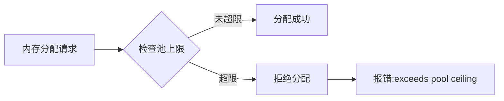
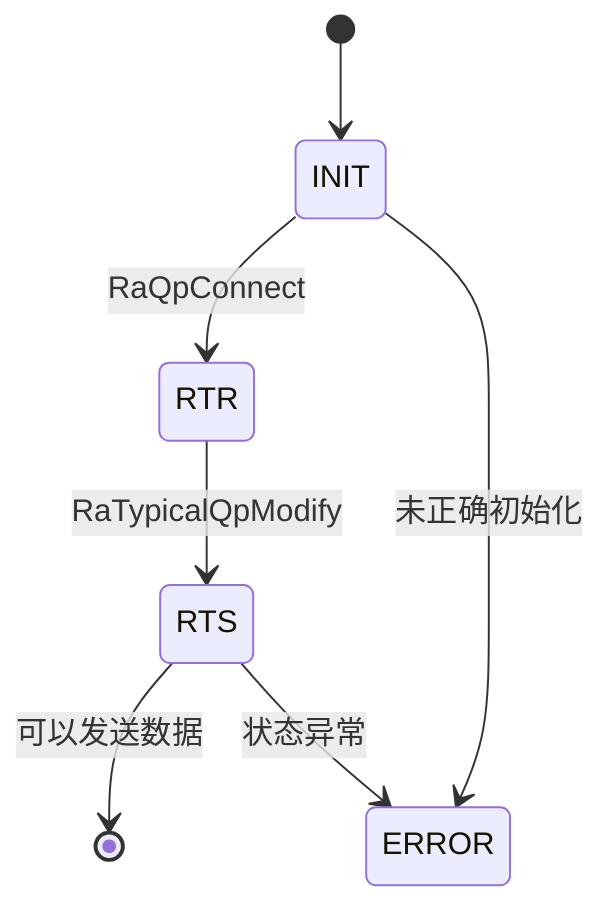
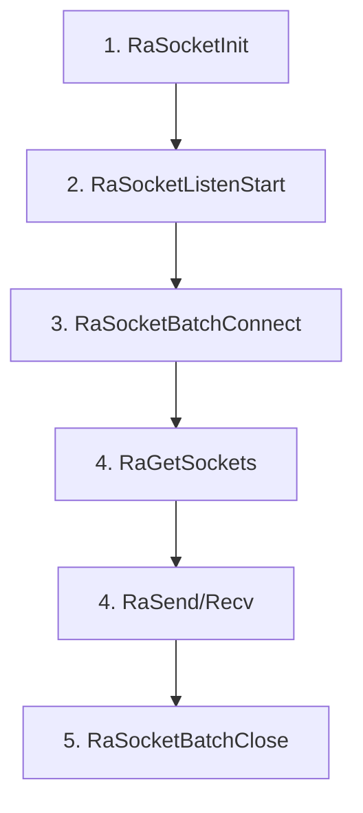
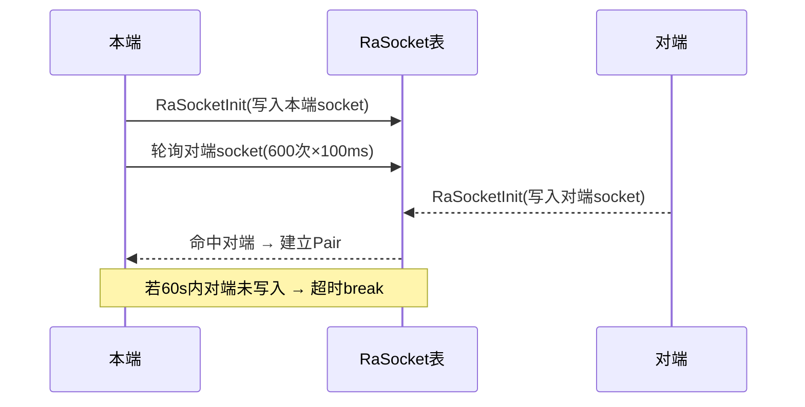

# HCCL-VM FAQ 测试文档

> 本文档用于测试FAQ HTML生成框架。

---

## 模块：CANN包安装和WSL环境配置

---

#### FAQ-C001

**标题:** WSL环境配置

**错误码:**
```
NA (4)
```

**错误函数:**
```
NA
```

**关键日志:**
```
[ 85%] Building CXX object src/legacy/ascend910/framework/CMakeFiles/hcomm.dir/common/src/config/env_config_host.cc.o
{standard input}: Assembler messages:
{standard input}:61985: Warning: end of file not at end of a line; newline inserted
{standard input}:61986: Error: expecting operand after ','; got nothing
{standard input}: Error: open CFI at the end of file; missing .cfi_endproc directive
c++: fatal error: Killed signal terminated program cc1plus
compilation terminated.
gmake[2]: *** [src/legacy/ascend910/framework/CMakeFiles/hcomm.dir/build.make:160: src/legacy/ascend910/framework/CMakeFiles/hcomm.dir/common/src/topo/topoinfo_ranktableParser.cc.o] Error 1
gmake[2]: *** Waiting for unfinished jobs....
gmake[1]: *** [CMakeFiles/Makefile2:6400: src/legacy/ascend910/framework/CMakeFiles/hcomm.dir/all] Error 2
gmake: *** [Makefile:156: all] Error 2
  完整日志: /home/zhf/workspace/.hccl_vm_install_logs/build-pkg-20260705-234844.log
  也可手动执行: bash /home/zhf/workspace/hcomm/test/hccl_vm/build_pkg.sh --tool_path /home/zhf/workspace/hcomm/test/hccl_vm
[ERROR] 子包编译未通过，请检查日志后重试。
```

**问题现象:** 在wsl环境采用一键式命令编译hcomm子包，或手动编译hcomm子包，报错如上。

**定位指导:**
```
【可能原因】
编译hcomm子包对wsl虚拟linux环境有一定的要求。
1. 确保wsl的系统版本是ubuntu22.04或Ubuntu24.04;
2. 确保wsl setting配置满足如下条件：可用内存>=8GB, swap space>=4GB;用户可以通过wsl setting进行配置。
```

---

## 模块：HCCL-VM

### 子模块：命令行

---

#### FAQ-E001

**标题:** 未配置通信域

**错误码:**
```
NA (4)
```

**错误函数:**
```
db_sim_runner_common.cc::GetDeviceByRankId()
```

**关键日志:**
```
[error][PID:173579][TID:173579][db_sim_runner_common.cc][GetDeviceByRankId] cannot find rank by rank id 0
[error][PID:173579][TID:173579][aclrt_device_stub.cc][aclrtSetDevice] [DEVICE_STUB]device not found by rankId:0
acl interface return err ./common/src/hccl_test_common.cc:861, retcode: 100000.
This is an error in device_init.
```

**问题现象:** 执行业务用例，报找不到rank id为0的设备。

**定位指导:**
```
【可能原因】
在执行业务用例前，需要用户自行判断本次算子所使用的通信域规模，并通过hccl-vm mock-comm aa命令配置通信域。其中aa.yaml文件所在路径为$HCCL_VM_INSTALL_DIR/config/topo_meta/aa.yaml。
```

---

#### FAQ-E002

**标题:** RANK_TABLE_FILE 未设置

**错误码:**
```
HCCL_SIM_E_PARA (1)
```

**错误函数:**
```
hccl_comm_stub.cc::HcclCommInitRootInfo()
```

**关键日志:**
```
RANK_TABLE_FILE env not set, please check your config.
```

**问题现象:** 通信域初始化时找不到 rank table 配置文件。

**定位指导:**
```
【可能原因】
1. 环境变量未设置
2. 文件路径错误

【解决方案】
export RANK_TABLE_FILE=/path/to/rank_table.json
```

---

#### FAQ-E003

**标题:** HCCL_VM_INSTALL_DIR 未设置

**错误码:**
```
HCCL_SIM_E_INTERNAL (4)
```

**错误函数:**
```
hccl_op_stub.cc::VirtualExecuteAivKernel()
```

**关键日志:**
```
[virtual-aiv] env HCCL_VM_INSTALL_DIR is not set, can not locate <path> for kernel <name>
```

**问题现象:** AIV kernel 虚拟执行失败，找不到对应的 .so 文件。

**定位指导:**
```
【解决方案】
export HCCL_VM_INSTALL_DIR=/path/to/hccl_vm/install/dir
```

---

#### FAQ-E004

**标题:** 在子shell中重复执行start命令

**错误码:**
```
NA (无错误码，仅WARNING)
```

**错误函数:**
```
subcmd_start.cc::StartCommand::Execute()
```

**关键日志:**
```
[warning][PID:<PID>][TID:<TID>][subcmd_start.cc][Execute] hccl-vm has already started. Please do not start it again in a sub-bash.
```

**问题现象:** 在hvm子shell环境中再次执行`hccl-vm start`命令，系统提示已启动并忽略本次操作。

**定位指导:**
```
【可能原因】
`hccl-vm start`会fork一个子bash进程，用户在该子bash（提示符为`(hvm)$>`）内再次输入`hccl-vm start`时，系统拒绝重复启动。

【解决方案】
不要在子shell内重复执行`hccl-vm start`。如需重新启动仿真环境，先退出当前子shell（输入`exit`），再重新执行`hccl-vm start`。
```

---

#### FAQ-E005

**标题:** fork子进程失败

**错误码:**
```
HCCL_SIM_HOST_ERROR_CMD (无标准错误码)
```

**错误函数:**
```
cmd_base_utils.cc::StartHvmCmd()
```

**关键日志:**
```
fork failed: Resource temporarily unavailable
```

**问题现象:** 执行`hccl-vm start`命令后，系统无法创建子shell进程，仿真环境启动失败。

**定位指导:**
```
【可能原因】
1. 系统用户进程数已达上限（ulimit -u）
2. 系统内存不足，无法为新进程分配资源
3. PID资源耗尽（/proc/sys/kernel/pid_max）

【排查步骤】
ulimit -u
cat /proc/sys/kernel/pid_max
free -m
ps -eLf | wc -l

【解决方案】
1. 增大用户进程数限制：`ulimit -u <更大的值>`
2. 清理系统中残留的僵尸进程
3. 检查是否有其他程序占用过多系统资源
```

---

#### FAQ-E006

**标题:** 插件名称格式错误

**错误码:**
```
NA (CLI参数校验)
```

**错误函数:**
```
subcmd_plugin.cc::PluginCommand::Setup()
```

**关键日志:**
```
[HVM] [ERROR] Install plugin : Invalid format! Plugin name must start with '@' (e.g., @myplugin).
[HVM] [ERROR] Uninstall plugin : Invalid format! Plugin name must start with '@' (e.g., @myplugin).
[HVM] [ERROR] Run plugin : Invalid format! Plugin name must start with '@' (e.g., @myplugin).
```

**问题现象:** 执行`hccl-vm plugin install/run/uninstall`命令时，CLI参数校验失败，拒绝执行。

**定位指导:**
```
【可能原因】
插件名称未以`@`符号开头。例如输入`hccl-vm plugin install runner`而非`hccl-vm plugin install @runner`。

【解决方案】
确保插件名称以`@`开头，例如：
hccl-vm plugin install @runner
hccl-vm plugin install @checker
hccl-vm plugin uninstall @runner
```

---

#### FAQ-E007

**标题:** 拓扑配置文件不存在

**错误码:**
```
NA (CLI参数校验)
```

**错误函数:**
```
cmd_base_utils.cc::FileInModelDir()
```

**关键日志:**
```
[HVM] model File not found: <install_path>/config/topo_meta/<name>.yaml
```

**问题现象:** 执行`hccl-vm mock-comm <name>`命令时，指定的拓扑yaml配置文件不存在，CLI参数校验直接拒绝。通信域配置文件是用于描述算子执行通信域的规模（如通信域包含几个超节点，几个server，以及每个server内取哪几张卡，具体详见文件描述）。

**定位指导:**
```
【可能原因】
1. 指定的拓扑名称拼写错误
2. 对应的yaml文件未放置在`$HCCL_VM_INSTALL_DIR/config/topo_meta/`目录下
3. 文件扩展名错误（应为`.yaml`）

【排查步骤】
ls $HCCL_VM_INSTALL_DIR/config/topo_meta/

【解决方案】
确认拓扑yaml文件已放置在正确目录中，且文件名与命令参数一致。例如执行`hccl-vm mock-comm 121`需要`config/topo_meta/121.yaml`文件存在。
```

---

#### FAQ-E008

**标题:** YAML拓扑文件格式解析异常

**错误码:**
```
NA (运行时解析错误)
```

**错误函数:**
```
cmd_cluster_model_utils.cc::ParseYamlTopoImpl()
```

**关键日志:**
```
[error][PID:<PID>][TID:<TID>][cmd_cluster_model_utils.cc][ParseYamlTopoImpl] Exception when parsing YAML: <detail>
```

**问题现象:** 执行`hccl-vm mock-comm <name>`命令时，YAML拓扑配置文件解析失败，通信域初始化中断。

**定位指导:**
```
【可能原因】
1. YAML文件存在语法错误（如缩进不正确、冒号后缺少空格、非法字符等）
2. YAML文件中包含不支持的字段类型或格式
3. YAML文件编码非UTF-8

【排查步骤】
# 使用python验证yaml格式
python3 -c "import yaml; yaml.safe_load(open('$HCCL_VM_INSTALL_DIR/config/topo_meta/<name>.yaml'))"

【解决方案】
根据日志中的`<detail>`信息修正YAML文件的语法错误。常见问题包括：
1. 缩进必须使用空格，不能使用Tab
2. 键值对的冒号后需要有空格
3. 列表项（`-`）的缩进需要与所在层级一致
```

---

### 子模块：内存管理

---

#### FAQ-M001

**标题:** 设备内存分配超限

**错误码:**
```
HCCL_SIM_E_MEMORY (3)
```

**错误函数:**
```
store_sim_device_memory_manager.cc::AllocPhyMem()
```

**关键日志:**
```
dev:<N> alloc phy mem:<ADDR> size:<SIZE> exceeds pool ceiling:<CEILING>, reject
```

**问题现象:** 设备内存分配请求超出模拟的内存池上限。

**图示说明:**


---

#### FAQ-M002

**标题:** 共享内存创建失败

**错误码:**
```
HCCL_SIM_E_SYSCALL (8)
```

**错误函数:**
```
store_sim_shm_ops.cc::ShmCreate()
```

**关键日志:**
```
[SHM_OPS] create: shm_open failed, name: <name>
[SHM_OPS] create: ftruncate failed, name: <name>
[SHM_OPS] create: mmap failed, name: <name>
```

**问题现象:** 无法创建共享内存段。

**定位指导:**
```
【可能原因】
1. `/dev/shm` 空间不足
2. 权限不足
3. 同名共享内存已存在且冲突

【排查步骤】
df -h /dev/shm
ls /dev/shm/ | grep hccl
```

---

#### FAQ-M003

**标题:** 通信内存分配失败

**错误码:**
```
HCCL_SIM_E_NOT_FOUND (6)
```

**错误函数:**
```
store_sim_comm_memory_manager.cc
```

**关键日志:**
```
[COMM_MEM] alloc failed, name: <name>
[COMM_MEM] acquire failed, name: <name>
[COMM_MEM] write size too large, size: <N>, max: <MAX>
```

**问题现象:** 跨进程通信内存操作失败。

---

#### FAQ-M004

**标题:** 操作设备内存出现BUS error程序崩溃

**错误码:** `NA`

**错误函数:** `CommunicationMemoryManager::WriteCommMem`

**关键日志:**
```
Bus error
```

**问题现象:** 业务进程直接崩溃报错bus error。

**可能原因:** `/dev/shm`无可用空间，查看命令`df -h /dev/shm`。

---

### 子模块：桩代理（proxy）

---

#### FAQ-PX001

**标题:** AIV Kernel虚拟执行失败

**错误码:**
```
HCCL_SIM_E_INTERNAL (4)
```

**错误函数:**
```
hccl_op_stub.cc::VirtualExecuteAivKernel()
```

**关键日志:**
```
[virtual-aiv] env HCCL_VM_INSTALL_DIR is not set
[virtual-aiv] missing aiv stub shared library, kernel=<name>
[virtual-aiv] dlopen <so> failed, err = <error>
[virtual-aiv] dlsym <symbol> from <so> failed, err = <error>
```

**问题现象:** AIV kernel在虚拟环境中执行失败。

**定位指导:**
```
【排查步骤】
echo $HCCL_VM_INSTALL_DIR
ls -la $HCCL_VM_INSTALL_DIR/lib/aiv/
nm -D $HCCL_VM_INSTALL_DIR/lib/aiv/<kernel>.so | grep <symbol>
```

---

#### FAQ-PX002

**标题:** 算子数据库记录失败

**错误码:**
```
HCCL_SIM_E_INTERNAL (4)
```

**错误函数:**
```
hccl_op_stub.cc::RecordOpDbInfo()
```

**关键日志:**
```
[RecordOpDbInfo] insert op detail+mem failed
[HcclAllReduce] record op db info failed
```

**问题现象:** HCCL集合通信算子的参数无法写入仿真数据库。

**影响的算子:** AlltoAll, AlltoAllV, AllGather, Broadcast, AllReduce, Scatter, Reduce, ReduceScatter

---

#### FAQ-PX003

**标题:** QP未找到或状态错误

**错误码:**
```
HCCL_SIM_E_NOT_FOUND (6)
```

**错误函数:**
```
hccp_stub.cc::RaSendWr()
```

**关键日志:**
```
[HCCP] RaSendWr: QP <N> not found
[HCCP] RaSendWr: QP <N> not in RTS state, current state:<N>
```

**问题现象:** RDMA QP操作失败——QP不存在或未达到RTS状态。

**图示说明:**


---

#### FAQ-PX004

**标题:** EndPoint查找失败

**错误码:**
```
HCCL_SIM_E_NOT_FOUND (6)
```

**错误函数:**
```
hccp_stub.cc::RaCtxQpImport()
```

**关键日志:**
```
[HCCP] cannot find endpoint addr:<IP>
Get remote endpoint failed. ip:<IP>, eid:<EID>
```

**问题现象:** 网络端点查找失败。

**定位指导:**
```
【可能原因】
IP地址不在rank table配置的端点列表中。
```

---

#### FAQ-PX005

**标题:** CCU微码加载失败

**错误码:**
```
HCCL_SIM_E_INTERNAL (4)
```

**错误函数:**
```
hccp_ccu_stub.cc::LoadMicrocodeInstruction()
```

**关键日志:**
```
[LoadMicrocodeInstruction] get device by logic id <N> failed.
[LoadMicrocodeInstruction] get ccu from device by die id <N> failed.
[LoadMicrocodeInstruction] insert instr failed
```

**问题现象:** CCU微码指令加载到模拟器失败。

---

#### FAQ-PX006

**标题:** 无法获取当前Context

**错误码:**
```
HCCL_SIM_E_NOT_FOUND (6)
```

**错误函数:**
```
hccp_stub.cc::RaRdevInit()
```

**关键日志:**
```
[error][PID:<PID>][TID:<TID>][hccp_stub.cc][RaRdevInit] can not get CurrContext: <N>
```

**问题现象:** 在RDMA设备初始化时，无法通过当前Runner获取活跃的Context，导致RDMA设备创建失败。

**定位指导:**
```
【可能原因】
1. 应用层未调用`aclrtSetDevice`/`aclrtCreateContext`初始化设备和上下文
2. Context已被提前销毁
3. Runner的TLS（线程局部存储）中current_ctx_id无效
4. 应用层在调用`aclrtSetDevice`初始化设备上下文前，调用了其他runtime接口获取了上下文

【排查步骤】
# 检查Context表
hccl-vm table show Context
# 检查Runner表中的current_ctx_id
hccl-vm table show Runner

【解决方案】
确认应用层在调用RDMA操作前已正确调用`aclrtSetDevice`和`aclrtCreateContext`，且Context未被提前销毁。
```

---

#### FAQ-PX007

**标题:** 找不到AICPU二进制文件

**错误码:**
```
ACL_ERROR_RT_FEATURE_NOT_SUPPORT
```

**错误函数:**
```
aclrt_kernel_stub.cc::aclrtDestroyBinary()
```

**关键日志:**
```
[error][PID:<PID>][TID:<TID>][aclrt_kernel_stub.cc][aclrtDestroyBinary] can not find this binary
```

**问题现象:** 销毁AICPU二进制对象时，在全局kernel binary注册表中找不到对应的二进制句柄。

**定位指导:**
```
【可能原因】
1. 该二进制文件未被正确加载（`aclrtLoadBinary`未执行或失败）
2. 二进制句柄已被重复销毁（double-free）
3. 二进制对象在多线程环境下被并发操作导致状态不一致

【排查步骤】
# 检查是否存在重复的destroy调用
# 确认aclrtLoadBinary的返回值

【解决方案】
确保`aclrtLoadBinary`成功返回后再调用`aclrtDestroyBinary`，且不要对同一二进制对象重复销毁。
```

---

#### FAQ-PX008

**标题:** AICPU设备进程异常退出

**错误码:**
```
NA (进程级错误)
```

**错误函数:**
```
aclrt_kernel_stub.cc::WaitAicpuProcess()
```

**关键日志:**
```
[error][PID:<PID>][TID:<TID>][aclrt_kernel_stub.cc][WaitAicpuProcess] device process[<PID>] exited with status <N>
[error][PID:<PID>][TID:<TID>][aclrt_kernel_stub.cc][WaitAicpuProcess] device process[<PID>] killed by signal <N>
```

**问题现象:** AICPU设备子进程异常退出或被信号杀死，导致主进程随后也退出（`exit(EXIT_FAILURE)`）。

**定位指导:**
```
【可能原因】
1. AICPU进程内部发生未捕获异常或段错误
2. 系统资源不足（内存、文件描述符等）导致子进程被OOM killer杀死
3. AICPU二进制文件本身存在bug
4. 子进程依赖的共享库缺失

【排查步骤】
# 检查系统日志是否有OOM记录
dmesg | grep -i "oom\|killed"
# 确认AICPU二进制文件是否完整
ls -la $HCCL_VM_INSTALL_DIR/bin/
# 检查系统资源
ulimit -a
free -m

【解决方案】
1. 检查AICPU二进制文件是否正确编译和部署
2. 确认系统资源充足（内存、文件描述符限制等）
3. 如为信号杀死，根据信号编号（如11=SIGSEGV, 9=SIGKILL）进一步定位原因
```

---

#### FAQ-PX009

**标题:** CCU加载微码时找不到任何rank

**错误码:**
```
HCCL_SIM_E_NOT_FOUND (6)
```

**错误函数:**
```
hccp_ccu_stub.cc::LoadMicrocodeInstruction()
```

**关键日志:**
```
[error][PID:<PID>][TID:<TID>][hccp_ccu_stub.cc][LoadMicrocodeInstruction] can not find any rank
```

**问题现象:** CCU微码指令加载过程中，无法在当前设备对应的Rank表中找到任何rank记录。

**定位指导:**
```
【可能原因】
1. 通信域未通过`mock-comm`命令初始化，Rank表为空
2. 当前设备ID在通信域配置中不存在

【排查步骤】
# 检查Rank表是否有数据
hccl-vm table show Rank
# 检查设备表
hccl-vm table show Device

【解决方案】
确保在执行CCU相关操作前，已通过`hccl-vm mock-comm`命令正确初始化通信域，且通信域配置覆盖当前设备。
```

---

#### FAQ-PX010

**标题:** 按rankId查找设备失败

**错误码:**
```
HCCL_E_NOT_FOUND
```

cc
```
aclrt_device_stub.cc::hrtSetDevice()
```

**关键日志:**
```
[error][PID:<PID>][TID:<TID>][aclrt_device_stub.cc][hrtSetDevice] device not found by rankId:<N>
```

**问题现象:** 调用`aclrtSetDevice`设置当前设备时，根据rankId查找对应的设备失败。

**定位指导:**
```
【可能原因】
1. rankId超出了通信域中实际存在的rank范围  —— 如通信域配置4个NPU，但实际mpirun起了6个NPU进程，导致rankid 4, 5都报找不到device。
2. 通信域未初始化（未执行`mock-comm`命令） —— 【大概率】初始化通信域后，工具内部才会初始化Rank表
3. ranktable配置与实际使用的rank数量不匹配 —— 可能是`RANK_TABLE_FILE`配置了错误的文件路径

【排查步骤】
# 检查rankId是否在有效范围内
hccl-vm table show Rank

【解决方案】
确认rankId在通信域配置的合法范围内（0 到 rank_count-1），且`RANK_TABLE_FILE`环境变量指向正确的ranktable.json文件。
```

---

#### FAQ-PX011

**标题:** 桩接口暂未实现

**错误码:**
```
HCCL_SIM_E_INTERNAL (4) 或 NA
```

**错误函数:**
```
多个桩函数文件（hccp_stub.cc、ascend_hal_stub.cc、aclrt_kernel_stub.cc等）
```

**关键日志:**
```
[warning][PID:<PID>][TID:<TID>][ascend_hal_stub.cc][*] [STUB] is empty
[warning][PID:<PID>][TID:<TID>][hccp_stub.cc][*] [STUB] is empty
[error][PID:<PID>][TID:<TID>][hccp_stub.cc][RaCtxGetAuxInfo] Not support yet
[error][PID:<PID>][TID:<TID>][hccp_stub.cc][RaCtxGetCrErrInfoList] Not support yet
```

**问题现象:** 应用层调用了仿真器尚未实现的底层驱动或运行时接口，日志中出现`[STUB] is empty`或`Not support yet`告警/错误。此类桩函数直接返回默认值（通常为0或成功），不进行任何实际操作。

**定位指导:**
```
【可能原因】
仿真器当前版本仅实现了HCCL集合通信所需的核心接口子集。部分底层驱动接口（如drvGetDeviceCapability、RaCtxGetAuxInfo、drvMemPrefetch等）不在HCCL通信的核心路径上，因此桩函数体为空或标记为不支持。
  一般情况下，对于HCCL-VM工具支持的流程不会调用这些接口，因此不会出现此类告警。若用户调用错误应用层接口，或进入了错误的HCCL业务流程，可能会出现此类告警。

【解决方案】
1. 此类告警通常不影响HCCL算子的正确性仿真，可安全忽略
2. 如果该告警伴随功能异常，说明应用依赖了未实现的接口，请反馈给仿真器开发团队
3. 如需特定接口的桩实现，可联系开发团队优先适配
```

**涉及的主要接口类型:**
1. **驱动层接口**（`ascend_hal_stub.cc`）：drvGetDeviceCapability、drvMemPrefetch、drvStreamQuery等约315个接口
2. **RDMA接口**（`hccp_stub.cc`）：RaRestoreSnapshot、RaRdevInitWithBackup、RaCtxGetAuxInfo等约44个接口
3. **Runtime适配层**（`adapter_rts_stub.cc`）：部分aclrt扩展接口
4. **TSD客户端**（`tsd_client_stub.cc`）：TSD相关接口

---

#### FAQ-PX012

**标题:** 获取socket失败

**错误码:** `NA`

**错误函数:** `hccp_ra_socket_stub.cc::RaGetSockets()`

**关键日志:**
```
[RASOCKET_STUB]get socket failed local:socketFd peerAddr:ipaddr role:0
```

**问题现象:** 获取希望的建链socket句柄失败。

**可能原因:**
1. 对端socket未调用RaSocketInit
2. 对端socket未调用RaSocketBatchConnect
3. 对端socket已经调用RaSocketBatchClose

**图示说明:**


---

#### FAQ-PX013

**标题:** 申请socket buffer失败

**错误码:** `NA`

**错误函数:** `hccp_ra_socket_stub.cc::RaSocketBatchConnect()`

**关键日志:**
```
[RASOCKET_STUB] alloc sock name ra_sock_1_c2s mem failed
```

**问题现象:** socket申请链路缓冲区内存失败。

**可能原因:** 可能存在残留的socket缓冲区未清除，执行`ls /dev/shm/`查看。

---

#### FAQ-PX014

**标题:** waitpid等待AICPU设备进程失败

**错误码:**
```
NA (进程级错误)
```

**错误函数:**
```
aclrt_kernel_stub.cc::WaitAicpuProcess()
```

**关键日志:**
```
[error][PID:<PID>][TID:<TID>][aclrt_kernel_stub.cc][WaitAicpuProcess] waitpid failed for pid <PID>, errno: <N> (<description>)
```

**问题现象:** 主进程在等待AICPU设备子进程退出时，`waitpid`系统调用未返回目标设备进程PID，主进程随后调用`exit(EXIT_FAILURE)`退出，仿真中断。与FAQ-PX008不同，本场景下设备子进程的退出状态未被成功采集（waitpid本身失败），而非子进程主动崩溃。

**定位指导:**
```
【可能原因】
waitpid返回值不对，常见errno原因：
1. ECHILD (10): 当前进程无可被等待的子进程——设备子进程已被其他线程/进程回收，或fork父子关系错乱（如子进程已被signal handler中的wait4抢先回收）
2. EINVAL (22): 传入的options或signal参数非法（一般为代码逻辑bug）
3. EINTR (4): waitpid被信号中断且未自动重启（罕见，waitpid默认对EINTR会重试，但部分调用路径未处理）

【排查步骤】
# 确认目标PID是否存在及其父进程是否为当前进程
ps -eo pid,ppid,stat,cmd | grep <PID>
# 查看系统日志是否有进程被异常回收或信号处理
dmesg | grep -i "process\|killed"
# 确认是否存在重复的WaitAicpuProcess调用或多线程竞争回收子进程
# （代码侧）检查是否注册了SIGCHLD处理函数并内部调用了wait/waitpid

```

---

#### FAQ-PX015

**标题:** Socket建链找不到远端IP端点

**错误码:**
```
NA (返回-1，无标准错误码)
```

**错误函数:**
```
hccp_ra_socket_stub.cc::RaSocketInit()
hccp_ra_socket_stub.cc::RaSocketBatchConnect()
```

**关键日志:**
```
[RASOCKET_STUB] get device by phy id <N> failed
[RASOCKET_STUB] cannot find remote ip <IP>
```

**问题现象:** `RaSocketInit`根据`rdevInfo.localIp`或`RaSocketBatchConnect`根据`conn[i].remoteIp`解析出IP后，在EndPoint表中查不到对应端点，socket初始化/建链直接返回-1中断。日志中`<IP>`通常为IPv6字符串去掉前缀后的地址。

**定位指导:**
```
【可能原因】
1. ranktable.json中未配置该IP对应的端点（EndPoint表缺失该条目）
2. 通信域未初始化（未执行`mock-comm`），EndPoint表为空
3. IP地址不匹配——ranktable中配置的IP与运行时实际下发的IP不一致（如IPv6地址缩写/前缀映射差异）
4. ranktable中server_count或device_list数量不足，部分rank的IP未纳入端点表

【排查步骤】
# 查看端点表是否包含该IP
hccl-vm table show EndPoint
# 确认ranktable配置
echo $RANK_TABLE_FILE
cat $RANK_TABLE_FILE | python3 -m json.tool
# 确认通信域是否已初始化
hccl-vm table show Rank

```

---

#### FAQ-PX016

**标题:** Socket建链对端超时未就绪

**错误码:**
```
NA (函数返回0，但该条连接未建立pair，后续RaGetSockets会触发FAQ-PX012)
```

**错误函数:**
```
hccp_ra_socket_stub.cc::RaSocketBatchConnect()
```

**关键日志:**
```
[RASOCKET_STUB] can not find remote dev:<N>, endpoint:<N>
[RASOCKET_STUB] can not get break dev:<N> sock:<N> connect dev:<N> ip addr:<IP> tag:<tag>
```

**问题现象:** `RaSocketBatchConnect`轮询等待对端在RaSocket表中出现对应记录，循环600次×100ms=60s后仍未找到，超时`break`。该条连接未建立RaSocketPair，后续`RaGetSockets`将取不到socket并报FAQ-PX012。

**定位指导:**
```
【可能原因】
1. 对端rank进程未启动，或尚未调用`RaSocketInit`/`RaSocketListenStart`
2. 多rank启动顺序错乱——发起BatchConnect时对端还未完成socket初始化
3. 对端的device_id/endpoint_id与本端查询条件不匹配（ranktable端点配置不一致）
4. 对端进程异常退出，RaSocket记录未写入DB

【排查步骤】
# 查看RaSocket表，确认对端是否已创建socket记录
hccl-vm table show RaSocket
# 确认所有rank进程均已启动
ps -ef | grep <业务进程名>
# 确认通信域内rank数量与进程数一致
hccl-vm table show Rank

```

**图示说明:**


---

#### FAQ-PX017

**标题:** socketHandle在RaSocket表中不存在

**错误码:**
```
NA (返回-1)
```

**错误函数:**
```
hccp_ra_socket_stub.cc::RaSocketListenStart()
hccp_ra_socket_stub.cc::RaSocketListenStop()
hccp_ra_socket_stub.cc::RaSocketBatchConnect()
hccp_ra_socket_stub.cc::RaGetSockets()
```

**关键日志:**
```
[RASOCKET_STUB] can not get Socket:<N>
[RASOCKET_STUB] can not get Local Ra Socket:<N>
[RASOCKET_STUB] can not get local socket fd:<N>
```

**问题现象:** 调用`RaSocketListenStart`/`RaSocketListenStop`/`RaSocketBatchConnect`/`RaGetSockets`时，传入的`socketHandle`在RaSocket表中`GetById`查不到记录，对应操作失败返回-1。

**定位指导:**
```
【可能原因】
1. 该socketHandle已被`RaSocketDeinit`删除（先Deinit后使用）
2. socketHandle值非法——来自未初始化内存、或其他进程的句柄
3. 跨进程传递了句柄——仿真器RaSocket表为进程内DB，句柄不跨进程共享，若业务层在进程间传递fd会导致对端进程查不到
4. RaSocketInit返回失败（如FAQ-PX015），调用方未检查返回值仍使用空句柄

【排查步骤】
# 确认handle是否存在于RaSocket表
hccl-vm table show RaSocket
# 确认调用顺序——是否在Deinit之后仍使用该handle
# 确认handle来源——是否由RaSocketInit成功返回

```

---

#### FAQ-PX018

**标题:** Socket链路收发读写失败

**错误码:**
```
NA (返回-1)
```

**错误函数:**
```
hccp_ra_socket_stub.cc::RaSocketSend()
hccp_ra_socket_stub.cc::RaSocketRecv()
hccp_ra_socket_stub.cc::RaSocketRecvAsync()
```

**关键日志:**
```
[RASOCKET_STUB] cannot pair socket:<N> role:<N>, key=<key>
[RASOCKET_STUB] socket pair:<N> role:<N>, key=<key> recv failed
[RASOCKET_STUB] socket pair:<N> role:<N>, key=<key> read try again
```

**问题现象:** `RaSocketSend`调用`WriteCommMem`写入c2s/s2c共享内存失败返回-1；或`RaSocketRecv`/`RaSocketRecvAsync`调用`ReadCommMem`返回-1。链路数据收发中断。其中`read try again`为WARN，表示暂无数据可读（对端尚未发送），会sleep后重试返回0，非本FAQ范畴。

**定位指导:**
```
【可能原因】
1. pair的c2s/s2c共享内存已被`RaSocketBatchClose`释放——ref_cnt归零后`DestoryRaSocketBufKeyByPairId`删除了buffer，但仍有线程在Send/Recv
2. /dev/shm空间不足或存在残留的ra_sock_*旧buffer导致内存段冲突
3. key对应的共享内存段不存在（pair创建时`GenRaSocketBufKeyByPairId`失败但pair记录已存在）
4. 调用方传入了错误的fdHandle——pairId解析错误，对应的key从未创建

【排查步骤】
# 检查/dev/shm是否残留ra_sock_* buffer
ls /dev/shm/ | grep ra_sock
# 检查/dev/shm空间
df -h /dev/shm
# 查看RaSocketPair状态及buf_status
hccl-vm table show RaSocketPair

```

---

### 子模块：组网

---

#### FAQ-N001

**标题:** Ranktable环境变量配置错误

**错误码:**
```
NA (1)
```

**错误函数:**
```
param_check_v2.cc::RanktableRealPath
```

**关键日志:**
```
[error][PID:172019][TID:172019][log_stub.cc][DlogPrintStub] [HCCL_LOG][param_check_v2.cc:457][172019]RanktableRealPath: /home/teamserver/workspace/CheckerL2_2128/hccl_vm_install/ranktable.json is not a valid real path

[info][PID:172021][TID:172021][log_stub.cc][DlogPrintStub] [HCCL_LOG][adapter_rts.cc:234] [172021][hrtGetDeviceRefresh]deviceLogicId[3]
[error][PID:172020][TID:172020][log_stub.cc][DlogPrintStub] [HCCL_LOG][param_check_v2.cc:457][172020]RanktableRealPath: /home/teamserver/workspace/CheckerL2_2128/hccl_vm_install/ranktable.json is not a valid real path

[info][PID:172018][TID:172018][log_stub.cc][DlogPrintStub] [HCCL_LOG][adapter_rts.cc:234] [172018][hrtGetDeviceRefresh]deviceLogicId[0]
[error][PID:172019][TID:172019][log_stub.cc][DlogPrintStub] [HCCL_LOG][op_base_v2.cc:294][172019][HcclCommInitClusterInfoV2]call trace: hcclRet -> 1

[error][PID:172019][TID:172019][log_stub.cc][DlogPrintStub] [HCCL_LOG][op_base.cc:811] [172019][operator()]call trace: hcclRet -> 1
```

**问题现象:** 运行用例，初始化通信域失败。

**定位指导:**
```
【可能原因】
ranktable.json文件路径配置错误，请查看RANK_TABLE_FILE环境变量的配置。ranktable.json由工具生成，其路径为$HCCL_VM_INSTALL_DIR/data/ranktable.json。

【排查步骤】
echo $RANK_TABLE_FILE

【解决方案】
确认RANK_TABLE_FILE环境变量配置正确，指向ranktable.json文件的路径。
```

---

#### FAQ-N002

**标题:** topo.json路径配置错误

**错误码:**
```
NA (1)
```

**错误函数:**
```
communicator_impl.cc::GetTopoFilePath
```

**关键日志:**
```
[error][PID:172635][TID:172635][log_stub.cc][DlogPrintStub] [HCCL_LOG][communicator_impl.cc:1339][172635][GetTopoFilePath] topo_file_path[/home/teamserver/workspace/CheckerL2_2128/hccl_vm_install/topo.json] is not a valid real path
```

**问题现象:** 运行用例，初始化通信域失败。

**定位指导:**
```
【可能原因】
topo.json文件路径在/etc/hccl_rootinfo.json文件中配置错误，请查看topo_file_path字段。topo.json由工具生成，其路径为$HCCL_VM_INSTALL_DIR/data/topo.json。

【排查步骤】
echo $TOPO_FILE_PATH

【解决方案】
确认TOPO_FILE_PATH环境变量配置正确，指向topo.json文件的路径。
```

---

#### FAQ-N003

**标题:** mock-comm命令报错

**错误码:**
```
NA
```

**错误函数:**
```
db_sim_runner_ops.cc::GetServerKeyById
```

**关键日志:**
```
(hvm)$> hccl-vm mock-comm 144
[error][PID:172799][TID:172875][db_sim_runner_ops.cc][GetServerKeyById] can not find server by id: 0, 2
[error][PID:172799][TID:172875][topo_ascend_cluster_parser.cc][InitDynamicModelData] cannot find device by physical id 0
[error][PID:172799][TID:172875][cmd_base_utils.cc][InitHvmCommEnv] [HVM] InitHvmCommEnv failed
[error][PID:172799][TID:172875][subcmd_mock_comm.cc][Execute] [HVM] Failed to initialize mock communication environment. Cleaning up environment.
```

**问题现象:** 运行用例前，通过mock-comm命令配置通信域失败。

**定位指导:**
```
【可能原因】
mock-comm命令配置的通信域144配置，超过了工具启动的集群配置。比如工具启动的集群，一个超节点只有2个server，但通信域144表示该超节点下有4个server。

【排查步骤】
确认工具启动时的集群配置文件和mock-comm命令配置的通信域配置文件。

【解决方案】
检查工具启动的集群配置，确认每个超节点下的server数量。若确实需要配置144通信域，则确保工具启动时选择一个更大的集群组网配置。
确保mock-comm命令配置的通信域，不超过工具启动的集群配置。
```

---

#### FAQ-N004

**标题:** EndPoint IP 查找失败

**错误码:**
```
HCCL_SIM_E_NOT_FOUND (6)
```

**错误函数:**
```
topo_ascend_cluster_parser.cc::AddLinkInfo()
```

**关键日志:**
```
cannot find endPoint by ip <IP_ADDR>
```

**问题现象:** 网络链路配置中引用的 IP 地址在拓扑中不存在。

---

#### FAQ-N005

**标题:** superpod索引越界

**错误码:**
```
HCCL_SIM_E_NOT_FOUND (6)
```

**错误函数:**
```
topo_ascend_cluster_parser.cc::InitDynamicModelData()
```

**关键日志:**
```
[InitDynamicModelData] superpod index <N> out of range
```

**问题现象:** 解析ranktable生成ranktable.json时，引用的superpod索引超出集群实际的superpod数量，导致初始化失败。

**定位指导:**
```
【可能原因】
ranktable中配置的设备所属superpod数量，超过了工具启动的集群组网配置。例如集群只有1个superpod，但ranktable中引用了第2个superpod。

【排查步骤】
1. 检查工具启动时的集群组网配置（topo_meta/*.yaml），确认superpod数量。
2. 检查ranktable配置（$HCCL_VM_INSTALL_DIR/data/ranktable.json），确认其中引用的superpod索引是否超出范围。

【解决方案】
确保mock-comm命令配置的通信域所引用的superpod数量不超过集群组网配置。若需要更多superpod，请选择更大的集群组网配置启动工具。
```

---

#### FAQ-N006

**标题:** server索引越界

**错误码:**
```
HCCL_SIM_E_NOT_FOUND (6)
```

**错误函数:**
```
topo_ascend_cluster_parser.cc::InitDynamicModelData()
```

**关键日志:**
```
[InitDynamicModelData] server index <N> out of range in superpod <M>
```

**问题现象:** 解析ranktable生成ranktable.json时，引用的server索引超出superpod内实际的server数量，导致初始化失败。

**定位指导:**
```
【可能原因】
ranktable中配置的某个superpod下的server数量，超过了工具启动的集群组网配置中该superpod的server数量。例如集群组网中每个superpod有2个server，但ranktable中引用了第3个server。

【排查步骤】
1. 检查工具启动时的集群组网配置（topo_meta/*.yaml），确认每个superpod下的server数量。
2. 检查ranktable配置（$HCCL_VM_INSTALL_DIR/data/ranktable.json），确认其中引用的server索引是否超出范围。

【解决方案】
确保mock-comm命令配置的通信域中每个superpod下的server数量不超过集群组网配置。若需要更多server，请选择更大的集群组网配置启动工具。
```

---

#### FAQ-N007

**标题:** 按物理ID查找设备失败

**错误码:**
```
HCCL_SIM_E_NOT_FOUND (6)
```

**错误函数:**
```
topo_ascend_cluster_parser.cc::InitDynamicModelData()
```

**关键日志:**
```
[InitDynamicModelData] cannot find device by physical id <N>
```

**问题现象:** 解析ranktable时，按物理设备ID查找设备失败，通常发生在mock-comm配置通信域时。

**定位指导:**
```
【可能原因】
mock-comm命令配置的通信域中引用的物理设备ID（physical id），超出了集群组网中实际的设备范围。例如集群只有2个设备（physical id 0和1），但通信域配置引用了physical id 2。

【排查步骤】
1. 检查工具启动时的集群组网配置（topo_meta/*.yaml），确认每个server下的设备数量。
2. 检查ranktable配置（$HCCL_VM_INSTALL_DIR/data/ranktable.json），确认其中引用的device_id是否超出范围。

【解决方案】
确保mock-comm命令配置的通信域中引用的物理设备ID不超过集群组网配置中的设备范围。若需要更多设备，请选择更大的集群组网配置启动工具。
```

---

### 子模块：数据库

---

#### FAQ-DB001

**标题:** SQLite 数据库连接失败

**错误码:**
```
HCCL_SIM_E_OPEN_FILE_FAILURE (10)
```

**错误函数:**
```
db_hccl_db_sqlite.cc::Connect()
```

**关键日志:**
```
[dbInit] Connect database failed
Connect database:<path> failed
```

**问题现象:** 无法连接到 SQLite 数据库文件。

**定位指导:**
```
【可能原因】
1. 数据库文件不存在
2. 文件权限不足
3. 文件被其他进程锁定
```

---

#### FAQ-DB002

**标题:** 数据库备份文件未找到

**错误码:**
```
HCCL_SIM_E_OPEN_FILE_FAILURE (10)
```

**错误函数:**
```
sim_loader.cc::BackupDatabase()
```

**关键日志:**
```
[Loader] Backup database file not found: <dbPath>
```

**问题现象:** Loader 无法找到仿真数据库文件。

**定位指导:**
```
【可能原因】
1. 仿真数据文件路径配置错误
2. 仿真数据尚未生成
3. 文件权限不足

【排查步骤】
ls -la <dbPath>
```

---

#### FAQ-DB003

**标题:** SQLite 查询失败

**错误码:**
```
HCCL_SIM_E_INTERNAL (4)
```

**错误函数:**
```
db_hccl_db_sqlite.cc
```

**关键日志:**
```
Prepare failed: <error> sql:<SQL>
Step failed: <error>, sql:<SQL>
```

**问题现象:** SQL 查询执行失败。

**定位指导:**
```
【可能原因】
1. 数据库表结构不匹配（版本不兼容）
2. 数据库文件损坏
3. 磁盘空间不足
```

---

## 模块：插件

### 子模块：checker

> Checker 插件的错误码（101-902）已迁移至 [Checker 错误码 FAQ](checker_faq.md)，本文档不再重复列出。以下仅保留不属于 V3 错误码体系的条目。

---

#### FAQ-C008

**标题:** 二进制文件magic number不匹配

**错误函数:**
```
binary_data_operator.cc::FileHeaderRead()
```

**关键日志:**
```
[FileHeaderRead] Unmatched magic number:0x<N>≠0x<M>
```

**问题现象:** 读取仿真数据文件时，文件头中的magic number不匹配。

**定位指导:**
```
【可能原因】
1. 数据文件版本与工具版本不兼容
2. 文件损坏
```

---

## 附录：错误码速查表

| 错误码 | 枚举值 | 含义 |
|--------|--------|------|
| 0 | HCCL_SIM_SUCCESS | 成功 |
| 1 | HCCL_SIM_E_PARA | 参数错误 |
| 2 | HCCL_SIM_E_PTR | 空指针 |
| 3 | HCCL_SIM_E_MEMORY | 内存错误 |
| 4 | HCCL_SIM_E_INTERNAL | 内部错误 |
| 5 | HCCL_SIM_E_NOT_SUPPORT | 不支持的特性 |
| 6 | HCCL_SIM_E_NOT_FOUND | 资源未找到 |
| 8 | HCCL_SIM_E_SYSCALL | 系统调用错误 |
| 9 | HCCL_SIM_E_TIMEOUT | 超时 |
| 10 | HCCL_SIM_E_OPEN_FILE_FAILURE | 文件打开失败 |