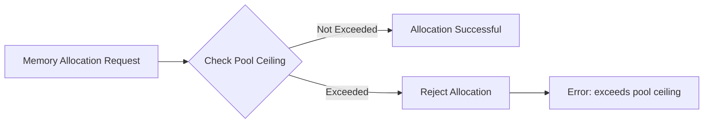
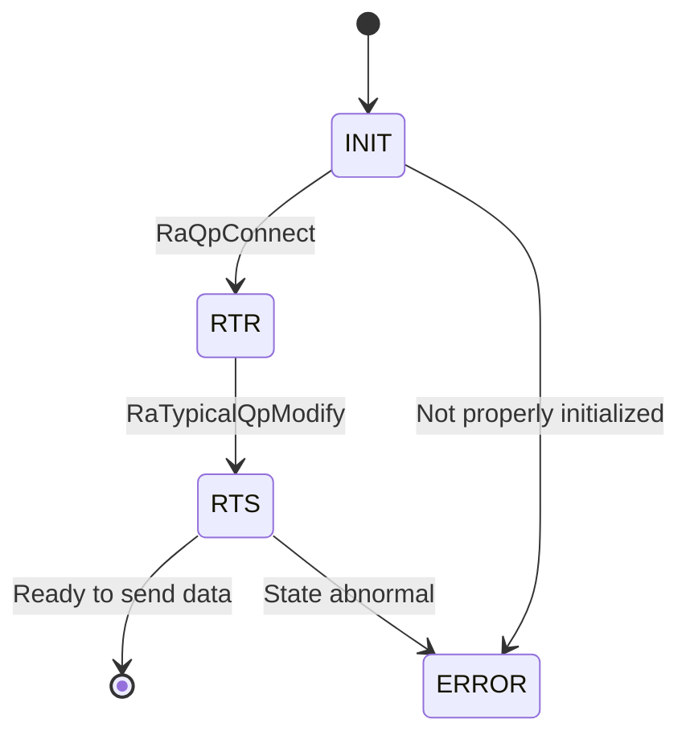
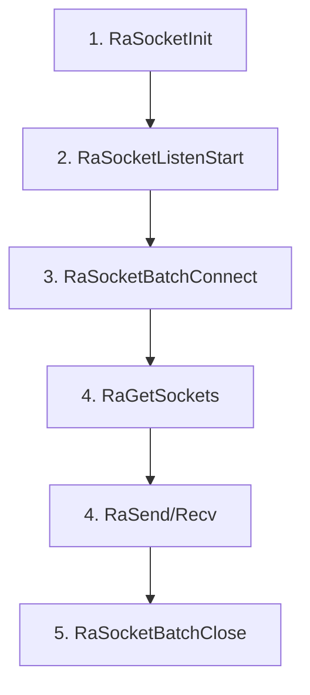
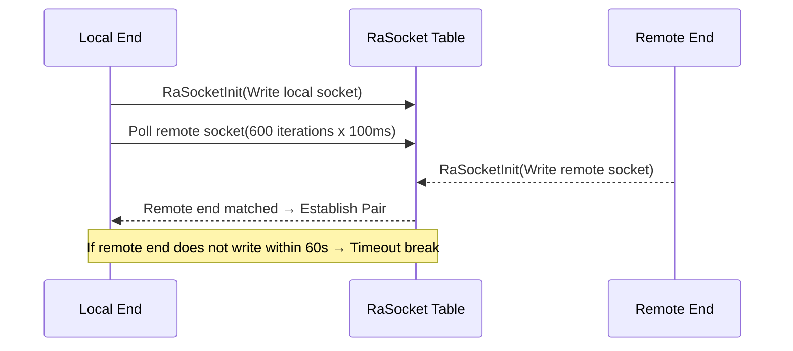

# HCCL-VM FAQ Test Document

> This document is used to test the FAQ HTML generation framework.

---

## Module: CANN Package Installation and WSL Environment Configuration

---

#### FAQ-C001

**Title:** WSL Environment Configuration

**Error Code:**
```
NA (4)
```

**Error Function:**
```
NA
```

**Key Log:**
```
[ 85%] Building CXX object src/legacy/ascend910/framework/CMakeFiles/hcomm.dir/common/src/config/env_config_host.cc.o
{standard input}: Assembler messages:
{standard input}:61985: Warning: end of file not at end of a line; newline inserted
{standard input}:61986: Error: expecting operand after ','; got nothing
{standard input}: Error: open CFI at the end of file; missing .cfi_endproc directive
c++: fatal error: Killed signal terminated program cc1plus
compilation terminated.
gmake[2]: *** [src/legacy/ascend910/framework/CMakeFiles/hcomm.dir/build.make:160: src/legacy/ascend910/framework/CMakeFiles/hcomm.dir/common/src/topo/topoinfo_ranktableParser.cc.o] Error 1
gmake[2]: *** Waiting for unfinished jobs....
gmake[1]: *** [CMakeFiles/Makefile2:6400: src/legacy/ascend910/framework/CMakeFiles/hcomm.dir/all] Error 2
gmake: *** [Makefile:156: all] Error 2
  Full log: /home/zhf/workspace/.hccl_vm_install_logs/build-pkg-20260705-234844.log
  Or run manually: bash /home/zhf/workspace/hcomm/test/hccl_vm/build_pkg.sh --tool_path /home/zhf/workspace/hcomm/test/hccl_vm
[ERROR] Sub-package compilation failed. Please check the log and retry.
```

**Symptom:** When compiling the hcomm sub-package using the one-click command or manual compilation in the WSL environment, the above error occurs.

**Troubleshooting Guide:**
```
[Possible Causes]
Compiling the hcomm sub-package has certain requirements for the WSL virtual Linux environment.
1. Ensure the WSL system version is Ubuntu 22.04 or Ubuntu 24.04.
2. Ensure the WSL settings meet the following conditions: Available memory >= 8GB, swap space >= 4GB. Users can configure these via WSL settings.
```

---

## Module: HCCL-VM

### Submodule: Command Line

---

#### FAQ-E001

**Title:** Communication Domain Not Configured

**Error Code:**
```
NA (4)
```

**Error Function:**
```
db_sim_runner_common.cc::GetDeviceByRankId()
```

**Key Log:**
```
[error][PID:173579][TID:173579][db_sim_runner_common.cc][GetDeviceByRankId] cannot find rank by rank id 0
[error][PID:173579][TID:173579][aclrt_device_stub.cc][aclrtSetDevice] [DEVICE_STUB]device not found by rankId:0
acl interface return err ./common/src/hccl_test_common.cc:861, retcode: 100000.
This is an error in device_init.
```

**Symptom:** When executing a business case, an error occurs indicating that the device with rank id 0 cannot be found.

**Troubleshooting Guide:**
```
[Possible Causes]
Before executing business cases, users need to determine the communication domain scale used by the current operator and configure the communication domain via the hccl-vm mock-comm aa command. The aa.yaml file path is $HCCL_VM_INSTALL_DIR/config/topo_meta/aa.yaml.
```

---

#### FAQ-E002

**Title:** RANK_TABLE_FILE Not Set

**Error Code:**
```
HCCL_SIM_E_PARA (1)
```

**Error Function:**
```
hccl_comm_stub.cc::HcclCommInitRootInfo()
```

**Key Log:**
```
RANK_TABLE_FILE env not set, please check your config.
```

**Symptom:** The rank table configuration file cannot be found during communication domain initialization.

**Troubleshooting Guide:**
```
[Possible Causes]
1. Environment variable not set
2. Incorrect file path

[Solution]
export RANK_TABLE_FILE=/path/to/rank_table.json
```

---

#### FAQ-E003

**Title:** HCCL_VM_INSTALL_DIR Not Set

**Error Code:**
```
HCCL_SIM_E_INTERNAL (4)
```

**Error Function:**
```
hccl_op_stub.cc::VirtualExecuteAivKernel()
```

**Key Log:**
```
[virtual-aiv] env HCCL_VM_INSTALL_DIR is not set, can not locate <path> for kernel <name>
```

**Symptom:** AIV kernel virtual execution fails because the corresponding .so file cannot be found.

**Troubleshooting Guide:**
```
[Solution]
export HCCL_VM_INSTALL_DIR=/path/to/hccl_vm/install/dir
```

---

#### FAQ-E004

**Title:** Repeatedly Executing the start Command in a Sub-shell

**Error Code:**
```
NA (No error code, WARNING only)
```

**Error Function:**
```
subcmd_start.cc::StartCommand::Execute()
```

**Key Log:**
```
[warning][PID:<PID>][TID:<TID>][subcmd_start.cc][Execute] hccl-vm has already started. Please do not start it again in a sub-bash.
```

**Symptom:** When executing the `hccl-vm start` command again in the hvm sub-shell environment, the system indicates that it has already been started and ignores the operation.

**Troubleshooting Guide:**
```
[Possible Causes]
`hccl-vm start` forks a child bash process. When the user enters `hccl-vm start` again in this sub-bash (prompt is `(hvm)$>`), the system rejects the duplicate start.

[Solution]
Do not repeatedly execute `hccl-vm start` in a sub-shell. To restart the simulation environment, first exit the current sub-shell (type `exit`), then re-execute `hccl-vm start`.
```

---

#### FAQ-E005

**Title:** Fork Child Process Failed

**Error Code:**
```
HCCL_SIM_HOST_ERROR_CMD (No standard error code)
```

**Error Function:**
```
cmd_base_utils.cc::StartHvmCmd()
```

**Key Log:**
```
fork failed: Resource temporarily unavailable
```

**Symptom:** After executing the `hccl-vm start` command, the system cannot create a sub-shell process, and the simulation environment fails to start.

**Troubleshooting Guide:**
```
[Possible Causes]
1. System user process limit reached (ulimit -u)
2. Insufficient system memory to allocate resources for new processes
3. PID resources exhausted (/proc/sys/kernel/pid_max)

[Troubleshooting Steps]
ulimit -u
cat /proc/sys/kernel/pid_max
free -m
ps -eLf | wc -l

[Solution]
1. Increase user process limit: `ulimit -u <larger value>`
2. Clean up zombie processes remaining in the system
3. Check if other programs are consuming excessive system resources
```

---

#### FAQ-E006

**Title:** Invalid Plugin Name Format

**Error Code:**
```
NA (CLI parameter validation)
```

**Error Function:**
```
subcmd_plugin.cc::PluginCommand::Setup()
```

**Key Log:**
```
[HVM] [ERROR] Install plugin : Invalid format! Plugin name must start with '@' (e.g., @myplugin).
[HVM] [ERROR] Uninstall plugin : Invalid format! Plugin name must start with '@' (e.g., @myplugin).
[HVM] [ERROR] Run plugin : Invalid format! Plugin name must start with '@' (e.g., @myplugin).
```

**Symptom:** When executing the `hccl-vm plugin install/run/uninstall` command, CLI parameter validation fails and refuses to execute.

**Troubleshooting Guide:**
```
[Possible Causes]
The plugin name does not start with the '@' symbol. For example, inputting `hccl-vm plugin install runner` instead of `hccl-vm plugin install @runner`.

[Solution]
Ensure the plugin name starts with '@', for example:
hccl-vm plugin install @runner
hccl-vm plugin install @checker
hccl-vm plugin uninstall @runner
```

---

#### FAQ-E007

**Title:** Topology Configuration File Does Not Exist

**Error Code:**
```
NA (CLI parameter validation)
```

**Error Function:**
```
cmd_base_utils.cc::FileInModelDir()
```

**Key Log:**
```
[HVM] model File not found: <install_path>/config/topo_meta/<name>.yaml
```

**Symptom:** When executing the `hccl-vm mock-comm <name>` command, the specified topology yaml configuration file does not exist, and CLI parameter validation directly rejects it. The communication domain configuration file is used to describe the scale of the communication domain for operator execution (e.g., how many super nodes the domain contains, how many servers, and which cards from each server to use — see file description for details).

**Troubleshooting Guide:**
```
[Possible Causes]
1. Typo in the specified topology name
2. The corresponding yaml file is not placed in the `$HCCL_VM_INSTALL_DIR/config/topo_meta/` directory
3. Incorrect file extension (should be `.yaml`)

[Troubleshooting Steps]
ls $HCCL_VM_INSTALL_DIR/config/topo_meta/

[Solution]
Confirm that the topology yaml file is placed in the correct directory and the filename matches the command parameter. For example, executing `hccl-vm mock-comm 121` requires the `config/topo_meta/121.yaml` file to exist.
```

---

#### FAQ-E008

**Title:** YAML Topology File Format Parsing Exception

**Error Code:**
```
NA (Runtime parsing error)
```

**Error Function:**
```
cmd_cluster_model_utils.cc::ParseYamlTopoImpl()
```

**Key Log:**
```
[error][PID:<PID>][TID:<TID>][cmd_cluster_model_utils.cc][ParseYamlTopoImpl] Exception when parsing YAML: <detail>
```

**Symptom:** When executing the `hccl-vm mock-comm <name>` command, the YAML topology configuration file fails to parse, and communication domain initialization is interrupted.

**Troubleshooting Guide:**
```
[Possible Causes]
1. YAML file contains syntax errors (e.g., incorrect indentation, missing space after colon, illegal characters, etc.)
2. YAML file contains unsupported field types or formats
3. YAML file encoding is not UTF-8

[Troubleshooting Steps]
# Use python to validate yaml format
python3 -c "import yaml; yaml.safe_load(open('$HCCL_VM_INSTALL_DIR/config/topo_meta/<name>.yaml'))"

[Solution]
Correct the YAML file syntax errors based on the `<detail>` information in the log. Common issues include:
1. Indentation must use spaces, not tabs
2. A space is required after the colon in key-value pairs
3. List item (`-`) indentation must be consistent with its level
```

---

### Submodule: Memory Management

---

#### FAQ-M001

**Title:** Device Memory Allocation Exceeded

**Error Code:**
```
HCCL_SIM_E_MEMORY (3)
```

**Error Function:**
```
store_sim_device_memory_manager.cc::AllocPhyMem()
```

**Key Log:**
```
dev:<N> alloc phy mem:<ADDR> size:<SIZE> exceeds pool ceiling:<CEILING>, reject
```

**Symptom:** The device memory allocation request exceeds the simulated memory pool ceiling.

**Diagram:**


---

#### FAQ-M002

**Title:** Shared Memory Creation Failed

**Error Code:**
```
HCCL_SIM_E_SYSCALL (8)
```

**Error Function:**
```
store_sim_shm_ops.cc::ShmCreate()
```

**Key Log:**
```
[SHM_OPS] create: shm_open failed, name: <name>
[SHM_OPS] create: ftruncate failed, name: <name>
[SHM_OPS] create: mmap failed, name: <name>
```

**Symptom:** Unable to create a shared memory segment.

**Troubleshooting Guide:**
```
[Possible Causes]
1. Insufficient `/dev/shm` space
2. Insufficient permissions
3. Shared memory with the same name already exists and conflicts

[Troubleshooting Steps]
df -h /dev/shm
ls /dev/shm/ | grep hccl
```

---

#### FAQ-M003

**Title:** Communication Memory Allocation Failed

**Error Code:**
```
HCCL_SIM_E_NOT_FOUND (6)
```

**Error Function:**
```
store_sim_comm_memory_manager.cc
```

**Key Log:**
```
[COMM_MEM] alloc failed, name: <name>
[COMM_MEM] acquire failed, name: <name>
[COMM_MEM] write size too large, size: <N>, max: <MAX>
```

**Symptom:** Cross-process communication memory operation failed.

---

#### FAQ-M004

**Title:** BUS Error When Operating Device Memory

**Error Code:** `NA`

**Error Function:** `CommunicationMemoryManager::WriteCommMem`

**Key Log:**
```
Bus error
```

**Symptom:** The business process crashes directly with a bus error.

**Possible Causes:** `/dev/shm` has no available space. Check with `df -h /dev/shm`.

---

### Submodule: Stub Proxy (proxy)

---

#### FAQ-PX001

**Title:** AIV Kernel Virtual Execution Failed

**Error Code:**
```
HCCL_SIM_E_INTERNAL (4)
```

**Error Function:**
```
hccl_op_stub.cc::VirtualExecuteAivKernel()
```

**Key Log:**
```
[virtual-aiv] env HCCL_VM_INSTALL_DIR is not set
[virtual-aiv] missing aiv stub shared library, kernel=<name>
[virtual-aiv] dlopen <so> failed, err = <error>
[virtual-aiv] dlsym <symbol> from <so> failed, err = <error>
```

**Symptom:** AIV kernel execution fails in the virtual environment.

**Troubleshooting Guide:**
```
[Troubleshooting Steps]
echo $HCCL_VM_INSTALL_DIR
ls -la $HCCL_VM_INSTALL_DIR/lib/aiv/
nm -D $HCCL_VM_INSTALL_DIR/lib/aiv/<kernel>.so | grep <symbol>
```

---

#### FAQ-PX002

**Title:** Operator Database Record Failed

**Error Code:**
```
HCCL_SIM_E_INTERNAL (4)
```

**Error Function:**
```
hccl_op_stub.cc::RecordOpDbInfo()
```

**Key Log:**
```
[RecordOpDbInfo] insert op detail+mem failed
[HcclAllReduce] record op db info failed
```

**Symptom:** HCCL collective communication operator parameters cannot be written to the simulation database.

**Affected Operators:** AlltoAll, AlltoAllV, AllGather, Broadcast, AllReduce, Scatter, Reduce, ReduceScatter

---

#### FAQ-PX003

**Title:** QP Not Found or State Error

**Error Code:**
```
HCCL_SIM_E_NOT_FOUND (6)
```

**Error Function:**
```
hccp_stub.cc::RaSendWr()
```

**Key Log:**
```
[HCCP] RaSendWr: QP <N> not found
[HCCP] RaSendWr: QP <N> not in RTS state, current state:<N>
```

**Symptom:** RDMA QP operation failed — QP does not exist or has not reached RTS state.

**Diagram:**


---

#### FAQ-PX004

**Title:** EndPoint Lookup Failed

**Error Code:**
```
HCCL_SIM_E_NOT_FOUND (6)
```

**Error Function:**
```
hccp_stub.cc::RaCtxQpImport()
```

**Key Log:**
```
[HCCP] cannot find endpoint addr:<IP>
Get remote endpoint failed. ip:<IP>, eid:<EID>
```

**Symptom:** Network endpoint lookup failed.

**Troubleshooting Guide:**
```
[Possible Causes]
The IP address is not in the endpoint list configured in the rank table.
```

---

#### FAQ-PX005

**Title:** CCU Microcode Loading Failed

**Error Code:**
```
HCCL_SIM_E_INTERNAL (4)
```

**Error Function:**
```
hccp_ccu_stub.cc::LoadMicrocodeInstruction()
```

**Key Log:**
```
[LoadMicrocodeInstruction] get device by logic id <N> failed.
[LoadMicrocodeInstruction] get ccu from device by die id <N> failed.
[LoadMicrocodeInstruction] insert instr failed
```

**Symptom:** CCU microcode instruction failed to load into the simulator.

---

#### FAQ-PX006

**Title:** Unable to Obtain Current Context

**Error Code:**
```
HCCL_SIM_E_NOT_FOUND (6)
```

**Error Function:**
```
hccp_stub.cc::RaRdevInit()
```

**Key Log:**
```
[error][PID:<PID>][TID:<TID>][hccp_stub.cc][RaRdevInit] can not get CurrContext: <N>
```

**Symptom:** During RDMA device initialization, the active Context cannot be obtained through the current Runner, causing RDMA device creation to fail.

**Troubleshooting Guide:**
```
[Possible Causes]
1. Application layer did not call `aclrtSetDevice`/`aclrtCreateContext` to initialize device and context
2. Context has been destroyed prematurely
3. current_ctx_id in Runner's TLS (Thread-Local Storage) is invalid
4. Application layer called other runtime interfaces to obtain context before calling `aclrtSetDevice` to initialize device context

[Troubleshooting Steps]
# Check Context table
hccl-vm table show Context
# Check current_ctx_id in Runner table
hccl-vm table show Runner

[Solution]
Confirm that the application layer has correctly called `aclrtSetDevice` and `aclrtCreateContext` before performing RDMA operations, and the Context has not been destroyed prematurely.
```

---

#### FAQ-PX007

**Title:** AICPU Binary File Not Found

**Error Code:**
```
ACL_ERROR_RT_FEATURE_NOT_SUPPORT
```

**Error Function:**
```
aclrt_kernel_stub.cc::aclrtDestroyBinary()
```

**Key Log:**
```
[error][PID:<PID>][TID:<TID>][aclrt_kernel_stub.cc][aclrtDestroyBinary] can not find this binary
```

**Symptom:** When destroying an AICPU binary object, the corresponding binary handle cannot be found in the global kernel binary registry.

**Troubleshooting Guide:**
```
[Possible Causes]
1. The binary file was not correctly loaded (`aclrtLoadBinary` was not executed or failed)
2. The binary handle has been destroyed repeatedly (double-free)
3. The binary object was concurrently operated on in a multi-threaded environment, causing inconsistent state

[Troubleshooting Steps]
# Check for duplicate destroy calls
# Verify the return value of aclrtLoadBinary

[Solution]
Ensure `aclrtLoadBinary` returns successfully before calling `aclrtDestroyBinary`, and do not repeatedly destroy the same binary object.
```

---

#### FAQ-PX008

**Title:** AICPU Device Process Abnormal Exit

**Error Code:**
```
NA (Process-level error)
```

**Error Function:**
```
aclrt_kernel_stub.cc::WaitAicpuProcess()
```

**Key Log:**
```
[error][PID:<PID>][TID:<TID>][aclrt_kernel_stub.cc][WaitAicpuProcess] device process[<PID>] exited with status <N>
[error][PID:<PID>][TID:<TID>][aclrt_kernel_stub.cc][WaitAicpuProcess] device process[<PID>] killed by signal <N>
```

**Symptom:** The AICPU device child process exits abnormally or is killed by a signal, causing the main process to subsequently exit as well (`exit(EXIT_FAILURE)`).

**Troubleshooting Guide:**
```
[Possible Causes]
1. Uncaught exception or segmentation fault inside the AICPU process
2. Insufficient system resources (memory, file descriptors, etc.) causing the child process to be killed by the OOM killer
3. The AICPU binary file itself contains bugs
4. Missing shared libraries required by the child process

[Troubleshooting Steps]
# Check system logs for OOM records
dmesg | grep -i "oom\|killed"
# Verify AICPU binary file integrity
ls -la $HCCL_VM_INSTALL_DIR/bin/
# Check system resources
ulimit -a
free -m

[Solution]
1. Check if the AICPU binary file is correctly compiled and deployed
2. Confirm sufficient system resources (memory, file descriptor limits, etc.)
3. If killed by a signal, further diagnose based on the signal number (e.g., 11=SIGSEGV, 9=SIGKILL)
```

---

#### FAQ-PX009

**Title:** CCU Cannot Find Any Rank When Loading Microcode

**Error Code:**
```
HCCL_SIM_E_NOT_FOUND (6)
```

**Error Function:**
```
hccp_ccu_stub.cc::LoadMicrocodeInstruction()
```

**Key Log:**
```
[error][PID:<PID>][TID:<TID>][hccp_ccu_stub.cc][LoadMicrocodeInstruction] can not find any rank
```

**Symptom:** During CCU microcode instruction loading, no rank records can be found in the Rank table corresponding to the current device.

**Troubleshooting Guide:**
```
[Possible Causes]
1. Communication domain not initialized via the `mock-comm` command; Rank table is empty
2. The current device ID does not exist in the communication domain configuration

[Troubleshooting Steps]
# Check if Rank table has data
hccl-vm table show Rank
# Check device table
hccl-vm table show Device

[Solution]
Ensure that before performing CCU-related operations, the communication domain has been correctly initialized via the `hccl-vm mock-comm` command, and the communication domain configuration covers the current device.
```

---

#### FAQ-PX010

**Title:** Device Lookup by rankId Failed

**Error Code:**
```
HCCL_E_NOT_FOUND
```

cc
```
aclrt_device_stub.cc::hrtSetDevice()
```

**Key Log:**
```
[error][PID:<PID>][TID:<TID>][aclrt_device_stub.cc][hrtSetDevice] device not found by rankId:<N>
```

**Symptom:** When calling `aclrtSetDevice` to set the current device, device lookup by rankId fails.

**Troubleshooting Guide:**
```
[Possible Causes]
1. rankId exceeds the actual rank range in the communication domain — e.g., the domain is configured with 4 NPUs, but mpirun started 6 NPU processes, causing rankid 4, 5 to report device not found.
2. Communication domain not initialized (did not execute the `mock-comm` command) — [most likely] The Rank table is only initialized after the communication domain is initialized.
3. Rank table configuration does not match the actual number of ranks used — possibly `RANK_TABLE_FILE` is configured with an incorrect file path.

[Troubleshooting Steps]
# Check if rankId is within valid range
hccl-vm table show Rank

[Solution]
Confirm that rankId is within the valid range of the communication domain configuration (0 to rank_count-1), and the `RANK_TABLE_FILE` environment variable points to the correct ranktable.json file.
```

---

#### FAQ-PX011

**Title:** Stub Interface Not Yet Implemented

**Error Code:**
```
HCCL_SIM_E_INTERNAL (4) or NA
```

**Error Function:**
```
Multiple stub function files (hccp_stub.cc, ascend_hal_stub.cc, aclrt_kernel_stub.cc, etc.)
```

**Key Log:**
```
[warning][PID:<PID>][TID:<TID>][ascend_hal_stub.cc][*] [STUB] is empty
[warning][PID:<PID>][TID:<TID>][hccp_stub.cc][*] [STUB] is empty
[error][PID:<PID>][TID:<TID>][hccp_stub.cc][RaCtxGetAuxInfo] Not support yet
[error][PID:<PID>][TID:<TID>][hccp_stub.cc][RaCtxGetCrErrInfoList] Not support yet
```

**Symptom:** The application layer calls underlying driver or runtime interfaces that the simulator has not yet implemented. Warnings/errors with `[STUB] is empty` or `Not support yet` appear in the log. These stub functions directly return default values (typically 0 or success) without performing any actual operations.

**Troubleshooting Guide:**
```
[Possible Causes]
The current version of the simulator only implements the core interface subset required for HCCL collective communication. Some underlying driver interfaces (such as drvGetDeviceCapability, RaCtxGetAuxInfo, drvMemPrefetch, etc.) are not on the core path of HCCL communication, so the stub function body is empty or marked as unsupported.
  In general, for flows supported by the HCCL-VM tool, these interfaces will not be called, so such warnings will not appear. If the user calls an incorrect application-layer interface or enters an incorrect HCCL business flow, such warnings may appear.

[Solution]
1. Such warnings typically do not affect the correctness simulation of HCCL operators and can be safely ignored
2. If the warning is accompanied by functional anomalies, it indicates the application depends on unimplemented interfaces. Please report to the simulator development team
3. If stub implementation of specific interfaces is needed, contact the development team for prioritized adaptation
```

**Main Interface Types Involved:**
1. **Driver layer interfaces** (`ascend_hal_stub.cc`): Approximately 315 interfaces including drvGetDeviceCapability, drvMemPrefetch, drvStreamQuery, etc.
2. **RDMA interfaces** (`hccp_stub.cc`): Approximately 44 interfaces including RaRestoreSnapshot, RaRdevInitWithBackup, RaCtxGetAuxInfo, etc.
3. **Runtime adaptation layer** (`adapter_rts_stub.cc`): Some aclrt extension interfaces
4. **TSD client** (`tsd_client_stub.cc`): TSD-related interfaces

---

#### FAQ-PX012

**Title:** Socket Acquisition Failed

**Error Code:** `NA`

**Error Function:** `hccp_ra_socket_stub.cc::RaGetSockets()`

**Key Log:**
```
[RASOCKET_STUB]get socket failed local:socketFd peerAddr:ipaddr role:0
```

**Symptom:** Failed to obtain the desired link establishment socket handle.

**Possible Causes:**
1. The remote socket did not call RaSocketInit
2. The remote socket did not call RaSocketBatchConnect
3. The remote socket has already called RaSocketBatchClose

**Diagram:**


---

#### FAQ-PX013

**Title:** Socket Buffer Allocation Failed

**Error Code:** `NA`

**Error Function:** `hccp_ra_socket_stub.cc::RaSocketBatchConnect()`

**Key Log:**
```
[RASOCKET_STUB] alloc sock name ra_sock_1_c2s mem failed
```

**Symptom:** Socket link buffer memory allocation failed.

**Possible Causes:** There may be leftover socket buffers not cleared. Check with `ls /dev/shm/`.

---

#### FAQ-PX014

**Title:** waitpid Waiting for AICPU Device Process Failed

**Error Code:**
```
NA (Process-level error)
```

**Error Function:**
```
aclrt_kernel_stub.cc::WaitAicpuProcess()
```

**Key Log:**
```
[error][PID:<PID>][TID:<TID>][aclrt_kernel_stub.cc][WaitAicpuProcess] waitpid failed for pid <PID>, errno: <N> (<description>)
```

**Symptom:** When the main process is waiting for the AICPU device child process to exit, the `waitpid` system call does not return the target device process PID. The main process then calls `exit(EXIT_FAILURE)` to exit, interrupting the simulation. Unlike FAQ-PX008, in this scenario the exit status of the device child process was not successfully collected (waitpid itself failed), rather than the child process actively crashing.

**Troubleshooting Guide:**
```
[Possible Causes]
waitpid returned an incorrect value. Common errno causes:
1. ECHILD (10): The current process has no waitable child processes — the device child process has already been reaped by another thread/process, or fork parent-child relationship is disordered (e.g., the child process was preemptively reaped by wait4 in a signal handler)
2. EINVAL (22): The options or signal parameters passed are invalid (typically a code logic bug)
3. EINTR (4): waitpid was interrupted by a signal and did not automatically restart (rare; waitpid defaults to retrying on EINTR, but some call paths do not handle this)

[Troubleshooting Steps]
# Verify if the target PID exists and its parent process is the current process
ps -eo pid,ppid,stat,cmd | grep <PID>
# Check system logs for abnormal process reaping or signal handling
dmesg | grep -i "process\|killed"
# Check for duplicate WaitAicpuProcess calls or multi-threaded race conditions in child process reaping
# (Code side) Check if SIGCHLD handler is registered and internally calls wait/waitpid

```

---

#### FAQ-PX015

**Title:** Socket Link Establishment Cannot Find Remote IP Endpoint

**Error Code:**
```
NA (Returns -1, no standard error code)
```

**Error Function:**
```
hccp_ra_socket_stub.cc::RaSocketInit()
hccp_ra_socket_stub.cc::RaSocketBatchConnect()
```

**Key Log:**
```
[RASOCKET_STUB] get device by phy id <N> failed
[RASOCKET_STUB] cannot find remote ip <IP>
```

**Symptom:** After `RaSocketInit` resolves the IP based on `rdevInfo.localIp` or `RaSocketBatchConnect` resolves the IP based on `conn[i].remoteIp`, the corresponding endpoint cannot be found in the EndPoint table, and socket initialization/link establishment returns -1 directly, interrupting the operation. The `<IP>` in the log is typically an IPv6 string with the prefix removed.

**Troubleshooting Guide:**
```
[Possible Causes]
1. The endpoint for this IP is not configured in ranktable.json (EndPoint table is missing this entry)
2. Communication domain not initialized (did not execute `mock-comm`); EndPoint table is empty
3. IP address mismatch — the IP configured in the ranktable differs from the IP actually dispatched at runtime (e.g., IPv6 address abbreviation/prefix mapping differences)
4. The ranktable's server_count or device_list count is insufficient; some ranks' IPs are not included in the endpoint table

[Troubleshooting Steps]
# Check if the endpoint table contains this IP
hccl-vm table show EndPoint
# Verify ranktable configuration
echo $RANK_TABLE_FILE
cat $RANK_TABLE_FILE | python3 -m json.tool
# Check if communication domain has been initialized
hccl-vm table show Rank

```

---

#### FAQ-PX016

**Title:** Socket Link Establishment Remote End Timeout Not Ready

**Error Code:**
```
NA (Function returns 0, but this connection did not establish a pair; subsequent RaGetSockets will trigger FAQ-PX012)
```

**Error Function:**
```
hccp_ra_socket_stub.cc::RaSocketBatchConnect()
```

**Key Log:**
```
[RASOCKET_STUB] can not find remote dev:<N>, endpoint:<N>
[RASOCKET_STUB] can not get break dev:<N> sock:<N> connect dev:<N> ip addr:<IP> tag:<tag>
```

**Symptom:** `RaSocketBatchConnect` polls and waits for the remote end to appear in the RaSocket table. After 600 iterations × 100ms = 60 seconds, the remote end is still not found, and times out with `break`. This connection did not establish a RaSocketPair, so subsequent `RaGetSockets` will not be able to obtain the socket and will report FAQ-PX012.

**Troubleshooting Guide:**
```
[Possible Causes]
1. The remote rank process has not started, or has not yet called `RaSocketInit`/`RaSocketListenStart`
2. Multi-rank startup order is disordered — when BatchConnect is initiated, the remote end has not yet completed socket initialization
3. The remote end's device_id/endpoint_id does not match the local end's query criteria (ranktable endpoint configuration inconsistent)
4. The remote end process exited abnormally, and the RaSocket record was not written to DB

[Troubleshooting Steps]
# Check RaSocket table to confirm if the remote end has created a socket record
hccl-vm table show RaSocket
# Confirm all rank processes have started
ps -ef | grep <business process name>
# Confirm rank count in communication domain matches process count
hccl-vm table show Rank

```

**Diagram:**


---

#### FAQ-PX017

**Title:** socketHandle Does Not Exist in RaSocket Table

**Error Code:**
```
NA (Returns -1)
```

**Error Function:**
```
hccp_ra_socket_stub.cc::RaSocketListenStart()
hccp_ra_socket_stub.cc::RaSocketListenStop()
hccp_ra_socket_stub.cc::RaSocketBatchConnect()
hccp_ra_socket_stub.cc::RaGetSockets()
```

**Key Log:**
```
[RASOCKET_STUB] can not get Socket:<N>
[RASOCKET_STUB] can not get Local Ra Socket:<N>
[RASOCKET_STUB] can not get local socket fd:<N>
```

**Symptom:** When calling `RaSocketListenStart`/`RaSocketListenStop`/`RaSocketBatchConnect`/`RaGetSockets`, the passed `socketHandle` cannot be found by `GetById` in the RaSocket table, and the corresponding operation fails with return -1.

**Troubleshooting Guide:**
```
[Possible Causes]
1. The socketHandle has been deleted by `RaSocketDeinit` (Deinit called before use)
2. The socketHandle value is invalid — comes from uninitialized memory or a handle from another process
3. Handle was passed across processes — the simulator's RaSocket table is an in-process DB; handles are not shared across processes. If the business layer passes fd between processes, the remote process will not be able to find it.
4. RaSocketInit returned failure (e.g., FAQ-PX015), but the caller did not check the return value and still uses the empty handle

[Troubleshooting Steps]
# Confirm if the handle exists in RaSocket table
hccl-vm table show RaSocket
# Confirm call order — whether the handle is still used after Deinit
# Confirm handle source — whether it was successfully returned by RaSocketInit

```

---

#### FAQ-PX018

**Title:** Socket Link Send/Receive Read/Write Failed

**Error Code:**
```
NA (Returns -1)
```

**Error Function:**
```
hccp_ra_socket_stub.cc::RaSocketSend()
hccp_ra_socket_stub.cc::RaSocketRecv()
hccp_ra_socket_stub.cc::RaSocketRecvAsync()
```

**Key Log:**
```
[RASOCKET_STUB] cannot pair socket:<N> role:<N>, key=<key>
[RASOCKET_STUB] socket pair:<N> role:<N>, key=<key> recv failed
[RASOCKET_STUB] socket pair:<N> role:<N>, key=<key> read try again
```

**Symptom:** `RaSocketSend` calls `WriteCommMem` which fails to write to c2s/s2c shared memory and returns -1; or `RaSocketRecv`/`RaSocketRecvAsync` calls `ReadCommMem` which returns -1. Link data send/receive is interrupted. Note that `read try again` is a WARN indicating no data available to read (remote end has not yet sent); it will sleep and retry, returning 0, which is outside the scope of this FAQ.

**Troubleshooting Guide:**
```
[Possible Causes]
1. The pair's c2s/s2c shared memory has been released by `RaSocketBatchClose` — after ref_cnt drops to zero, `DestoryRaSocketBufKeyByPairId` deleted the buffer, but some thread is still in Send/Recv
2. Insufficient `/dev/shm` space or leftover ra_sock_* old buffers causing memory segment conflicts
3. The shared memory segment corresponding to the key does not exist (pair was created but `GenRaSocketBufKeyByPairId` failed; however, the pair record already exists)
4. Caller passed an incorrect fdHandle — pairId parsing error; the corresponding key was never created

[Troubleshooting Steps]
# Check if /dev/shm has leftover ra_sock_* buffers
ls /dev/shm/ | grep ra_sock
# Check /dev/shm space
df -h /dev/shm
# Check RaSocketPair status and buf_status
hccl-vm table show RaSocketPair

```

---

### Submodule: Networking

---

#### FAQ-N001

**Title:** Ranktable Environment Variable Configuration Error

**Error Code:**
```
NA (1)
```

**Error Function:**
```
param_check_v2.cc::RanktableRealPath
```

**Key Log:**
```
[error][PID:172019][TID:172019][log_stub.cc][DlogPrintStub] [HCCL_LOG][param_check_v2.cc:457][172019]RanktableRealPath: /home/teamserver/workspace/CheckerL2_2128/hccl_vm_install/ranktable.json is not a valid real path

[info][PID:172021][TID:172021][log_stub.cc][DlogPrintStub] [HCCL_LOG][adapter_rts.cc:234] [172021][hrtGetDeviceRefresh]deviceLogicId[3]
[error][PID:172020][TID:172020][log_stub.cc][DlogPrintStub] [HCCL_LOG][param_check_v2.cc:457][172020]RanktableRealPath: /home/teamserver/workspace/CheckerL2_2128/hccl_vm_install/ranktable.json is not a valid real path

[info][PID:172018][TID:172018][log_stub.cc][DlogPrintStub] [HCCL_LOG][adapter_rts.cc:234] [172018][hrtGetDeviceRefresh]deviceLogicId[0]
[error][PID:172019][TID:172019][log_stub.cc][DlogPrintStub] [HCCL_LOG][op_base_v2.cc:294][172019][HcclCommInitClusterInfoV2]call trace: hcclRet -> 1

[error][PID:172019][TID:172019][log_stub.cc][DlogPrintStub] [HCCL_LOG][op_base.cc:811] [172019][operator()]call trace: hcclRet -> 1
```

**Symptom:** Running test cases fails to initialize the communication domain.

**Troubleshooting Guide:**
```
[Possible Causes]
The ranktable.json file path is configured incorrectly. Check the RANK_TABLE_FILE environment variable configuration. ranktable.json is generated by the tool at $HCCL_VM_INSTALL_DIR/data/ranktable.json.

[Troubleshooting Steps]
echo $RANK_TABLE_FILE

[Solution]
Confirm that the RANK_TABLE_FILE environment variable is correctly configured, pointing to the ranktable.json file path.
```

---

#### FAQ-N002

**Title:** topo.json Path Configuration Error

**Error Code:**
```
NA (1)
```

**Error Function:**
```
communicator_impl.cc::GetTopoFilePath
```

**Key Log:**
```
[error][PID:172635][TID:172635][log_stub.cc][DlogPrintStub] [HCCL_LOG][communicator_impl.cc:1339][172635][GetTopoFilePath] topo_file_path[/home/teamserver/workspace/CheckerL2_2128/hccl_vm_install/topo.json] is not a valid real path
```

**Symptom:** Running test cases fails to initialize the communication domain.

**Troubleshooting Guide:**
```
[Possible Causes]
The topo.json file path is configured incorrectly in the /etc/hccl_rootinfo.json file. Check the topo_file_path field. topo.json is generated by the tool at $HCCL_VM_INSTALL_DIR/data/topo.json.

[Troubleshooting Steps]
echo $TOPO_FILE_PATH

[Solution]
Confirm that the TOPO_FILE_PATH environment variable is correctly configured, pointing to the topo.json file path.
```

---

#### FAQ-N003

**Title:** mock-comm Command Error

**Error Code:**
```
NA
```

**Error Function:**
```
db_sim_runner_ops.cc::GetServerKeyById
```

**Key Log:**
```
(hvm)$> hccl-vm mock-comm 144
[error][PID:172799][TID:172875][db_sim_runner_ops.cc][GetServerKeyById] can not find server by id: 0, 2
[error][PID:172799][TID:172875][topo_ascend_cluster_parser.cc][InitDynamicModelData] cannot find device by physical id 0
[error][PID:172799][TID:172875][cmd_base_utils.cc][InitHvmCommEnv] [HVM] InitHvmCommEnv failed
[error][PID:172799][TID:172875][subcmd_mock_comm.cc][Execute] [HVM] Failed to initialize mock communication environment. Cleaning up environment.
```

**Symptom:** Before running test cases, configuring the communication domain via the mock-comm command fails.

**Troubleshooting Guide:**
```
[Possible Causes]
The communication domain 144 configured by the mock-comm command exceeds the cluster configuration started by the tool. For example, if the cluster started by the tool has only 2 servers per super node, but communication domain 144 indicates 4 servers under that super node.

[Troubleshooting Steps]
Confirm the cluster configuration file used when starting the tool and the communication domain configuration file for the mock-comm command.

[Solution]
Check the cluster configuration started by the tool to confirm the number of servers per super node. If you truly need to configure communication domain 144, ensure the tool is started with a larger cluster network configuration.
Ensure the communication domain configured by the mock-comm command does not exceed the cluster configuration started by the tool.
```

---

#### FAQ-N004

**Title:** EndPoint IP Lookup Failed

**Error Code:**
```
HCCL_SIM_E_NOT_FOUND (6)
```

**Error Function:**
```
topo_ascend_cluster_parser.cc::AddLinkInfo()
```

**Key Log:**
```
cannot find endPoint by ip <IP_ADDR>
```

**Symptom:** The IP address referenced in the network link configuration does not exist in the topology.

---

#### FAQ-N005

**Title:** Superpod Index Out of Range

**Error Code:**
```
HCCL_SIM_E_NOT_FOUND (6)
```

**Error Function:**
```
topo_ascend_cluster_parser.cc::InitDynamicModelData()
```

**Key Log:**
```
[InitDynamicModelData] superpod index <N> out of range
```

**Symptom:** When parsing the ranktable to generate ranktable.json, the referenced superpod index exceeds the actual number of superpods in the cluster, causing initialization to fail.

**Troubleshooting Guide:**
```
[Possible Causes]
The number of superpods to which the devices in the ranktable belong exceeds the cluster network configuration started by the tool. For example, the cluster has only 1 superpod, but the ranktable references a 2nd superpod.

[Troubleshooting Steps]
1. Check the cluster network configuration (topo_meta/*.yaml) used when starting the tool to confirm the number of superpods.
2. Check the ranktable configuration ($HCCL_VM_INSTALL_DIR/data/ranktable.json) to confirm whether the referenced superpod indices exceed the range.

[Solution]
Ensure the number of superpods referenced by the communication domain configured via the mock-comm command does not exceed the cluster network configuration. If more superpods are needed, start the tool with a larger cluster network configuration.
```

---

#### FAQ-N006

**Title:** Server Index Out of Range

**Error Code:**
```
HCCL_SIM_E_NOT_FOUND (6)
```

**Error Function:**
```
topo_ascend_cluster_parser.cc::InitDynamicModelData()
```

**Key Log:**
```
[InitDynamicModelData] server index <N> out of range in superpod <M>
```

**Symptom:** When parsing the ranktable to generate ranktable.json, the referenced server index exceeds the actual number of servers within the superpod, causing initialization to fail.

**Troubleshooting Guide:**
```
[Possible Causes]
The number of servers under a superpod in the ranktable exceeds the number of servers for that superpod in the cluster network configuration. For example, the cluster network has 2 servers per superpod, but the ranktable references a 3rd server.

[Troubleshooting Steps]
1. Check the cluster network configuration (topo_meta/*.yaml) used when starting the tool to confirm the number of servers per superpod.
2. Check the ranktable configuration ($HCCL_VM_INSTALL_DIR/data/ranktable.json) to confirm whether the referenced server indices exceed the range.

[Solution]
Ensure the number of servers per superpod in the communication domain configured via the mock-comm command does not exceed the cluster network configuration. If more servers are needed, start the tool with a larger cluster network configuration.
```

---

#### FAQ-N007

**Title:** Device Lookup by Physical ID Failed

**Error Code:**
```
HCCL_SIM_E_NOT_FOUND (6)
```

**Error Function:**
```
topo_ascend_cluster_parser.cc::InitDynamicModelData()
```

**Key Log:**
```
[InitDynamicModelData] cannot find device by physical id <N>
```

**Symptom:** When parsing the ranktable, device lookup by physical device ID fails, typically occurring when configuring the communication domain via mock-comm.

**Troubleshooting Guide:**
```
[Possible Causes]
The physical device ID referenced in the communication domain configured by the mock-comm command exceeds the actual device range in the cluster network. For example, the cluster has only 2 devices (physical id 0 and 1), but the communication domain configuration references physical id 2.

[Troubleshooting Steps]
1. Check the cluster network configuration (topo_meta/*.yaml) used when starting the tool to confirm the number of devices per server.
2. Check the ranktable configuration ($HCCL_VM_INSTALL_DIR/data/ranktable.json) to confirm whether the referenced device_id exceeds the range.

[Solution]
Ensure the physical device IDs referenced in the communication domain configured via the mock-comm command do not exceed the device range in the cluster network configuration. If more devices are needed, start the tool with a larger cluster network configuration.
```

---

### Submodule: Database

---

#### FAQ-DB001

**Title:** SQLite Database Connection Failed

**Error Code:**
```
HCCL_SIM_E_OPEN_FILE_FAILURE (10)
```

**Error Function:**
```
db_hccl_db_sqlite.cc::Connect()
```

**Key Log:**
```
[dbInit] Connect database failed
Connect database:<path> failed
```

**Symptom:** Unable to connect to the SQLite database file.

**Troubleshooting Guide:**
```
[Possible Causes]
1. Database file does not exist
2. Insufficient file permissions
3. File is locked by another process
```

---

#### FAQ-DB002

**Title:** Database Backup File Not Found

**Error Code:**
```
HCCL_SIM_E_OPEN_FILE_FAILURE (10)
```

**Error Function:**
```
sim_loader.cc::BackupDatabase()
```

**Key Log:**
```
[Loader] Backup database file not found: <dbPath>
```

**Symptom:** Loader cannot find the simulation database file.

**Troubleshooting Guide:**
```
[Possible Causes]
1. Simulation data file path configured incorrectly
2. Simulation data not yet generated
3. Insufficient file permissions

[Troubleshooting Steps]
ls -la <dbPath>
```

---

#### FAQ-DB003

**Title:** SQLite Query Failed

**Error Code:**
```
HCCL_SIM_E_INTERNAL (4)
```

**Error Function:**
```
db_hccl_db_sqlite.cc
```

**Key Log:**
```
Prepare failed: <error> sql:<SQL>
Step failed: <error>, sql:<SQL>
```

**Symptom:** SQL query execution failed.

**Troubleshooting Guide:**
```
[Possible Causes]
1. Database table structure mismatch (version incompatibility)
2. Database file corrupted
3. Insufficient disk space
```

---

## Module: Plugins

### Submodule: checker

> The error codes (101-902) for the Checker plugin have been migrated to the [Checker Error Code FAQ](checker_faq_en.md). This document no longer repeats them. Only entries that do not belong to the V3 error code system are retained below.

---

#### FAQ-C008

**Title:** Binary File Magic Number Mismatch

**Error Function:**
```
binary_data_operator.cc::FileHeaderRead()
```

**Key Log:**
```
[FileHeaderRead] Unmatched magic number:0x<N>≠0x<M>
```

**Symptom:** When reading the simulation data file, the magic number in the file header does not match.

**Troubleshooting Guide:**
```
[Possible Causes]
1. Data file version is incompatible with the tool version
2. File is corrupted
```

---

## Appendix: Error Code Quick Reference Table

| Error Code | Enum Value | Description |
|--------|--------|------|
| 0 | HCCL_SIM_SUCCESS | Success |
| 1 | HCCL_SIM_E_PARA | Parameter error |
| 2 | HCCL_SIM_E_PTR | Null pointer |
| 3 | HCCL_SIM_E_MEMORY | Memory error |
| 4 | HCCL_SIM_E_INTERNAL | Internal error |
| 5 | HCCL_SIM_E_NOT_SUPPORT | Unsupported feature |
| 6 | HCCL_SIM_E_NOT_FOUND | Resource not found |
| 8 | HCCL_SIM_E_SYSCALL | System call error |
| 9 | HCCL_SIM_E_TIMEOUT | Timeout |
| 10 | HCCL_SIM_E_OPEN_FILE_FAILURE | File open failure |
