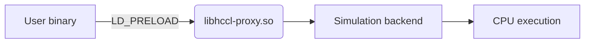
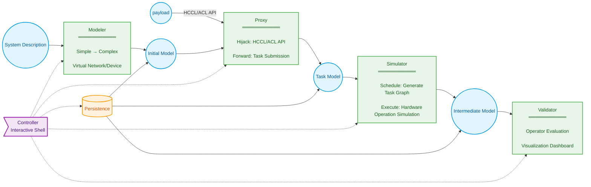
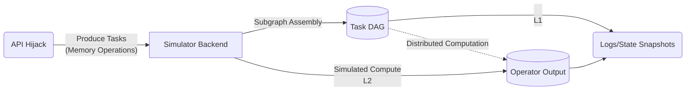
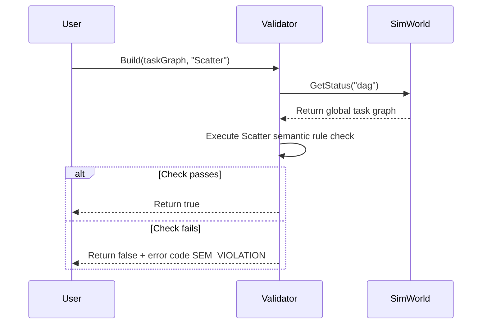
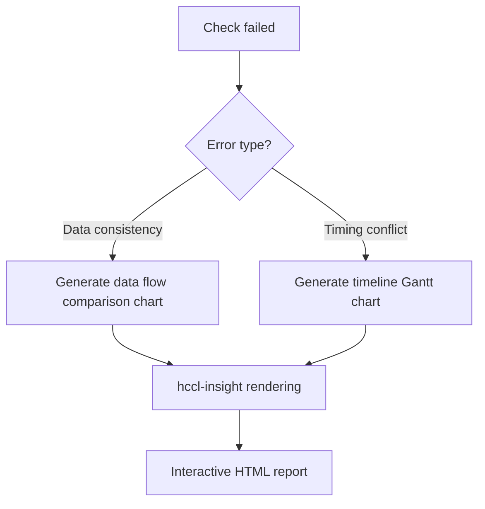

# HCCL Simulator Requirements Analysis

## 1 Background

### 1.1 Purpose

Provide an **offline, extensible, high-determinism** testing framework for the collective communication module:

- **New algorithm development**.
  Support design verification of custom communication operators (e.g., scatter variants) with algorithm visualization analysis.
- **Base package quality assurance**.
  Enable offline fast regression of HCCL test cases through HAL interfaces such as Runtime/Driver/Net.
- **Architecture verification (long-term)**.
  Verify physical compatibility between algorithms and hardware topologies (HCCS/RoCE).

### 1.2 Scope

Simulation depth by layer:

| Layer | Capability | Phase |
|-------|------------|-------|
| L1 | Communication semantics verification | ✅ Current |
| L2 | Logical function reproduction | ⚠️ Challenge |
| L3 | Network performance modeling | ⏳ Long-term |
| L4 | Fault injection diagnostics | ⏳ Long-term |

#### 1.2.1 Usage Scenarios

| Role | Purpose |
|------|---------|
| Open source contributor | Verify new operator/algorithm semantics |
| Tester | Run HCCL API test cases |
| Developer | Execute Runtime/Driver-level test cases |

#### 1.2.2 Input Forms

- **Configuration-driven**
  YAML defines hardware topology (Appendix B)
- **API hijacking**
  Redirect calls such as `hcclInitComm`/`aclrtMalloc` to the simulation backend.

#### 1.2.3 Output Forms

| Type | Purpose |
|------|---------|
| Program logs | User standard output |
| Verification results | External checker report |
| State snapshots | Binary buffer files |
| Visualization | hccl-insight rendering analysis |

---

## 2 System Context (Omitted)

---

## 3 Requirements Overview

### 3.1 Core Architecture

#### 3.1.1 Design Philosophy

**Non-invasive runtime hijacking**:



**Core advantages**:

1. **High fidelity**: Real binary execution path.
2. **Zero intrusion**: No modification to user code required.
3. **Strong extensibility**: Supports any HCCL/ACL program.

**Determinism guarantee**:

- L1: Communication semantics check (no concurrent communication domains/operators)
- L2: Global event serialization.
- L3/L4: Fixed seed random source or unified clock.

### 3.2 Typical Workflows

#### 3.2.1 Open Source Contributor Custom Operator Verification Flow (LLT)

1. **Environment setup**

   - Clone the `hccl_ops` operator repository.
   - Build and run the preset **scatter operator test case** according to the contribution guide.

2. **Operator development**

   - Implement the **CustomAllreduce operator** by referencing the scatter operator.
   - Build the operator and verify successful execution.

3. **Execute verification test case**
   Run the Checker test case in the code project (example logic):

   ```python
   model = SimWorld("./topologies/cloud_matrix.yaml")  # Initialize simulation model

   # Single-thread loop to simulate each rank execution
   foreach rank in rankGraph:
      HcclInitComm(...)
      ret = HcclScatter(rankGraph, scatter, array, 'root:0')  # Execute original operator

   # Task graph generation
   taskGraph = model.GetStatus('taskGraph')

   # Operator semantic verification
   checker = Validator<Scatter>().Build(taskGraph)
   EXPECT(checker.CheckSemantic(), 'success')  # Verify result
   ```

4. **Verify the custom operator**.
   Replace `HcclScatter` with `CustomAllreduce` in the code above and re-execute the test case.

#### 3.2.2 Developer Local Iteration Before Code Submission

1. **Start the simulator**: Run the `hccl-vm` command as root with the topology specified.

   ```bash
   root%> hccl-vm --topology=atlas900
   ```

   - **System feedback**: `info: entered hccl-vm` _(simulator: created simulation model)_.
   - **System state**: Prompt changes to `hccl-vm%>` _(simulator: interactive shell started)_.

2. **Execute communication program**: Run the `scatter.bin` program in the simulator shell (can use MPI/slurm, etc.).

   ```bash
   hccl-vm%> ./scatter.bin
   ```

3. **Repeat operations**: Execute individual communication domain initialization test cases in the simulator shell as needed.

   ```bash
   hccl-vm%> ./test_init_comm
   ```

4. **Exit the simulator**: Enter the `exit` command in the simulator shell.

   ```bash
   hccl-vm%> exit
   ```

   - **System feedback**: `info: exit hccl-vm` _(simulator: cleanup and exit)_.
   - **System state**: Prompt returns to `root%>`.

#### 3.2.3 Multi-Server Testing

1. **Log in to Server1**: Start the simulator as root.

   - **System state**: Prompt changes to `hccl-vm%>` _(simulator: interactive shell started)_.

2. **Execute communication program**: Run the `scatter.bin` program in the simulator shell.

   ```bash
   hccl-vm%> py3 allreduce.py --host 90.91.103.38 --data-sample large-b16 --serverid 0 --deviceid 8 --op sum
   hccl-vm%> py3 allreduce.py --host 90.91.103.38 --data-sample small-b16 --serverid 1 --deviceid 1 --op sum
   ```

3. **Log in to other servers**: Repeat steps 1-2 _(simulator: interactive shell started)_.

4. **View program logs on any server command line**:

   ```bash
   hccl-vm%> ...
   hccl-vm%> ...
   ```

### 3.3 Conventions

#### 3.3.1 Terminology

- hccl-vm: The controller program delivered by the simulator (interactive shell + backend process)
- libhccl-vm.so: The core library delivered by the simulator
- libhccl-proxy.so: The hijacking library (LD_PRELOAD)
- IPC: Communication between libhccl-proxy.so and the hccl-vm backend via shared memory to execute the payload (tasks) constructed after hijacking ACL/HCCL calls

#### 3.3.2 Key Mechanisms

- CLI:
  1. hccl-vm --topology=`describe-file-path`
  2. Enter the interactive shell and execute user commands.
- Environment variable: `LD_PRELOAD` points to `libhccl-proxy.so`, set by hccl-vm and effective in child processes.
- Process model: hccl-vm uses `fork+exec` to execute user commands; the OS loader preferentially loads `libhccl-proxy.so`.

---

## 4 System Functional Requirements



Delivery matrix by project phase:

| Phase | Modeler | Proxy | Simulator | Validator | Persistence | Controller |
|-------|---------|-------|-----------|-----------|-------------|------------|
| L1 | A3 simplified | HCCL-AICPU | Task graph generation | Checker porting | - | - |
| L2 | A2/5 full line | HCCL/ACL | Sequential execution | A5 plugin-based porting | ✅ | ✅ |
| L2 Challenge | Distributed | Batch forwarding | Parallel computing | Visualization | High-concurrency IO library | Cluster management |

- **L1 phase**: Deliver simulator core library.
  `libhccl-vm.so` (A3/AICPU modeling simulation + validator) + `libhccl-proxy.so` (simplified proxy)
  Users implement communication semantic verification through LLT (FR2.1→FR3)
- **L2 phase**: Deliver standalone controller.
  `hccl-vm` (FR5) + full modeler (FR1) + persistence (FR4)
  Supports command-line startup of non-intrusive environment for logical function reproduction.
- **L2 Challenge**: Run the test team's existing distributed real-hardware test cases directly.

### 4.1 FR1 Construct Collective Communication Simulation Environment

**Constraints**:

- ✅ Only supports dynamic linking (acl/aclRt/hccl-base)
- ❌ Does not support setuid/setgid programs.

**Core capability**:

> Create/query: Collective communication simulation model.

```python
# Example
model = SimWorld("./topologies/cloud_matrix.yaml")
device = model.GetStatus("device0")
```

**Interaction flow**:

| Step | Action | Result |
|------|--------|--------|
| 1 | Load YAML configuration | Generate initial model |
| 2 | Call `SimWorld()` | Return model handle |
| 3 | Query `GetStatus()` | Get specified state data |

**Failure scenario**: Configuration file error, print parsing details.

### 4.2 FR2 Simulate Execution of Collective Communication Operators



#### 4.2.1 Core Capabilities (Automatic in Background)

| Phase | Function | User (Developer) Visible Effect |
|-------|----------|---------------------------------|
| **Hijack** | Dynamically redirect HCCL/ACL API | Modify link options for original LLT test cases |
| **Forward** | Package communication task metadata | ~~Invisible~~ |
| **Simulate** | Generate global DAG task graph | Obtainable from the modeling interface |
| **Execute** | Simulate memory copy and state migration | Obtainable from the modeling interface |

**Prerequisites**:

1. Developer has already developed a scatter operator variant program `./my_scatter.bin`.
2. `./my_scatter.bin` uses the `lib-vm.so` interface for simulation modeling.

**Success scenario 1**: Link the proxy library with `-lhccl-proxy` and run.

```bash
# Link at compile time (illustrative)
ld ./scatter.bin -lhccl-proxy -lhccl-vm
# Command-line execution
./scatter.bin
```

**Success scenario 2**: Hijack the proxy library via LD_PRELOAD.

```bash
# Single-node execution (automatic hijack → simulation)
LD_PRELOAD=libhccl-proxy.so ./scatter.bin
```

**Feature evolution, same scenario**:

| Phase | Capability | User Operation Change |
|-------|------------|----------------------|
| L1 | Single-process multi-rank simulation | ~~No change~~ |
| L2 | Multi-process single-server simulation | ~~No change~~ |

### 4.3 FR3 Semantic Verification of Operator Results in Simulation Environment

#### 4.3.1 Core Capabilities

1. **Operator semantic verification**.
   - Supports communication semantic verification for preset operators (AllReduce/Scatter, etc.).
   - Provides a plugin-based extension interface.
2. **Visualization analysis**
   - Generate interactive communication topology diagrams.
   - Mark semantic violation points.
3. **Verification report generation**.
   - Structured error diagnostics (data consistency/timing conflicts)

### 4.4 Success Scenarios

#### 4.4.1 Scenario 1: Basic Operator Semantic Verification



**User operation**:

```python
# Load task graph
task_graph = model.GetStatus('taskGraph')

# Create validator
scatter_validator = Validator<Scatter>()
scatter_validator.Build(task_graph)

# Execute verification
if scatter_validator.CheckSemantic():
   print("Scatter semantic verification passed")
```

#### 4.4.2 Scenario 2: Custom Operator Hot Plug

```bash
# In hccl-vm interactive environment
hccl-vm%> validator install ./custom_allreduce_validator.so
[System] Success: Validator 'CustomAllReduce' registered

# Code call
validator = Validator<CustomAllReduce>()
validator.Build(task_graph)
validator.CheckSemantic()
```

#### 4.4.3 Scenario 3: Visualization Diagnostics



**Output example**:

| Error type | Node | Expected | Actual |
|-----------|------|----------|--------|
| Data inconsistency | Rank1 | 0x7f8e (32782) | 0x0000 (0) |
| Deadlock risk | Rank2 | Waiting for Rank3 | Timeout (>200ms) |

---

### 4.4 Failure Scenarios

#### 4.4.1 Scenario 1: Validator Plugin Load Failure

**Trigger conditions**:

- Plugin ABI version incompatibility.
- Plugin does not export the `Validator_CreateInstance` symbol.

**System response**:

```bash
hccl-vm%> validator install ./broken_validator.so
[ERROR] Plugin load failed:
  - ABI version mismatch (expected v3, got v2)
  - Symbol 'Validator_CreateInstance' not found
[Suggestion] Use validator check-abi ./broken_validator.so to check compatibility
```

#### 4.4.2 Scenario 2: Invalid Task Graph Input

**Trigger condition**:

```python
# Pass non-DAG structure
validator.Build("invalid_data")
```

**System response**:

```python
Traceback (most recent call last):
  File "test.py", line 12, in <module>
    validator.Build("invalid_data")
hccl.error.InvalidGraphError:
    Expected TaskGraph object, got <class 'str'>
```

#### 4.4.3 Scenario 3: Runtime State Conflict

**Trigger condition**:

```python
# Attempt verification during communication execution
while HcclAllReduceInner(is_running=True):
    validator.CheckSemantic()  # Illegal call!
```

**System response**:

```text
[FATAL] Validator state conflict:
  - Operation not allowed during HcclAllReduceInner execution
  - Call GetStatus('idle') before validation
```

---

### 4.5 Constraints and Evolution

| Capability | L1 Phase | L2 Phase |
|------------|----------|----------|
| **Preset validators** | Scatter | Full HCCL operators |
| **Plugin mechanism** | Static linking | Dynamic loading (.so) |
| **Visualization** | Text report | Interactive topology + timeline |
| **Error location precision** | Node level | Buffer byte offset |

**Key evolution path**:

1. Provide `validator-template` code generator (L2);
2. Support distributed verification coordination (L2 challenge phase);
3. Integrate memory access trace tracking (L3).

### 4.6 FR4 Persistence

#### 4.6.1 `L2` Story: Simulator provides a persistence interface so that developers can quickly locate issues after testing.

### 4.7 FR5 Controller

Considering ease of use, users typically use HCCL test programs in a terminal. Therefore, the controller is delivered as a command-line program.

#### 4.7.1 Controller Conventions

- Topology switching is not supported at runtime.
- The following description uses `shell` to represent the command line.

#### 4.7.2 `L2` Story: Users start the simulator via an interactive shell, which automatically creates a virtual communication cluster in the background. Therefore, users intuitively expect to repeatedly test/verify their HCCL programs in this interactive shell environment.

##### Shell Start Prerequisites

- During installation, the simulator places multiple system configuration files in the same directory (e.g., `./topologies`), such as `cloud_matrix.yaml`, `atlas900.yaml`.
- System configuration files are read-only and not corrupted.

##### Success Scenario: System Model Discovery

1. User runs `hccl-vm --list-topologies` to view supported systems.
2. The command prints a list of all built-in system models such as cloud_matrix, atlas900, etc., without starting the simulator.

##### Success Scenario: Successfully Start Simulator and Hijack Application

1. User starts the `hccl-vm` controller, specifies the topology configuration file, and enters the interactive shell.
2. `hccl-vm` parses and loads the system configuration file, calls the modeler, creates the initial system model, and indicates successful creation.
3. User executes `./scatter_perf` in the shell, for example:
4. `hccl-vm` sets `LD_PRELOAD=libhccl-proxy.so` for the child process and executes `fork/exec`.
5. The OS loader loads `libhccl-proxy.so` first. Application calls to CUDA/NCCL APIs are hijacked.
6. `libhccl-proxy.so` delegates to the `hccl-vm` backend via IPC for simulation.
7. The application completes and returns standard output/error to the user; the return code is passed through to the hccl-vm interactive shell.
8. User can `exit` the shell, and sim_run exits with code 0. Example interaction:

   ```bash
   root%>hccl-vm --topology=atlas900
   info: entered hccl-vm
   hccl-vm%>
   hccl-vm%>./scatter_perf
   hccl-vm%>exit
   info: exit hccl-vm
   root%>
   ```

##### Success Scenario: Start with Default System Model

1. User starts the simulator with `hccl-vm` without any parameters.
2. `hccl-vm` finds and locates the `cloud_matrix.yaml` file in its preset directory.
3. Subsequent flow is identical to `Success Scenario: Successfully Start Simulator and Hijack Application`.

##### Failure Scenario: Specified System Configuration Does Not Exist

1. User executes `hccl-vm --topology=non_existent_topo`.
2. `hccl-vm` outputs an error message and terminates normally, e.g., "Error: System 'non_existent_topo' not found. Available systems: cloud_matrix, atlas900".

##### Failure Scenario: Topology Configuration File Format Error

1. The user-provided topology configuration file does not conform to YAML specifications or lacks required fields, causing `hccl-vm` to fail during initialization parsing.
2. The simulator outputs a clear error message to stderr, such as "Error: Failed to parse topology file a.yaml, reason: ...", and immediately terminates the program.

##### Failure Scenario: Topology Configuration File Does Not Exist or Is Unreadable

#### 4.7.3 `L2` Story: Users can quickly configure a system model description file and start the simulator. Format reference **Appendix B**.

#### 4.7.4 `L2` Story: Users manage validator plugins through `shell` subcommands.

##### Success Scenario: User installs custom validator plugin and successfully completes verification

##### Success Scenario: User views available validator plugins

##### Failure Scenario: Validator plugin and simulator version mismatch

##### Failure Scenario: Multiple validator plugin conflicts during installation

#### 4.7.5 `L2` Story: Developers can export the state of the simulation environment (e.g., specific device memory buffer contents) to a file via controller subcommands for subsequent analysis or visualization.

##### Subcommand Constraints

- The test program is running in the `hccl-vm` interactive shell.
- The export operation is triggered synchronously at any time during the test program.
- The export is an instantaneous snapshot of the `hccl-vm` current system model.

##### Success Scenario: Successfully Export Simulation Device State Buffer

1. The user executes the export subcommand in the interactive shell.
   Example: `hccl-vm%> snapshot --path=/tmp/hccl_vm_state`
2. `hccl-vm` calls the persistence interface and writes the system model state to the `hccl_vm_state` file.
3. After writing, `hccl-vm` prints a success message to stdout, e.g., "Snapshot exported successfully: /tmp/global_sim_state.bin".
4. The user can find the `hccl_vm_state` file under `/tmp/` and view the simulation device's memory at that moment.

##### Success Scenario: Overwrite Existing File

1. User executes the snapshot command specifying an existing output file path.
2. `hccl-vm` prompts that the file exists and asks whether to overwrite.
3. User confirms overwrite.
4. `hccl-vm` overwrites the file and prints a success message.

##### Failure Scenario: Insufficient Disk Space

1. `hccl-vm` outputs a clear error message to stderr, such as "Error: Insufficient disk space to write snapshot file: ...", and terminates the write.

##### Failure Scenario: No Write Permission or Directory Does Not Exist

1. `hccl-vm` outputs a clear error message to stderr, such as "Error: No write permission or directory does not exist: ...", and terminates the write.

#### 4.7.6 `L2` Story: In the interactive shell, users can visually view algorithm results via the visualization subcommand after activating the validator plugin.

##### Prerequisites

- `hccl-vm` has the `scatter` operator validator plugin installed.
- `hccl-vm` integrates the `hccl-insight` command-line visualization tool.
- After a simulator run, one or more binary algorithm verification result files (e.g., `rank0_output.bin`) have been successfully exported via the persistence API.
- The snapshot file `rank0_output.bin` contains an 8x8 float32 matrix.

##### Success Scenario: Render Single-Card Memory Data as a Heatmap

1. The user runs the visualization tool in the interactive shell for the exported snapshot file. The user needs to provide metadata (data type and shape) for the tool to parse correctly, e.g.:

   ```bash
   hccl-insight --file=rank0_output.bin --dtype=float32 --shape=8x8
   ```

2. `hccl-insight` (Go program) starts and parses the command-line arguments.
3. The program reads the binary contents of `rank0_output.bin`.
4. Based on the `--dtype=float32` and `--shape=8x8` parameters, the program parses the binary stream into a two-dimensional array.
5. The program starts a built-in web server on a random available local port (e.g., `:9527`).
6. The program prints a message to stdout: "Visualization service started, open <http://localhost:9527> in your browser".
7. (Optional) The program automatically calls a system command to open the URL in the user's default browser.
8. The user sees a page rendered by Vue/JS in the browser, displaying an 8x8 heatmap where each cell's color represents its corresponding value. The user can hover over cells to see precise values.

##### Failure Scenario: Snapshot File Does Not Exist

1. The `--file` parameter points to a non-existent file.
2. `hccl-insight` fails when trying to open the file.
3. The tool outputs a clear error message to stderr, such as "Error: File 'xxx.bin' not found", and exits with a non-zero status code.

##### Failure Scenario: File Size Does Not Match Metadata

1. User specifies `--shape=8x8` and `--dtype=float32` (requires 8 _8_ 4 = 256 bytes), but the actual file `rank0_output.bin` is only 100 bytes.
2. After reading the file, `hccl-insight` finds that the file size does not match the expected size calculated from the metadata.
3. The tool outputs a clear error message to stderr, such as "Error: Data format mismatch. Based on shape(8x8) and dtype(float32), 256 bytes are expected, but the file is only 100 bytes", and exits with a non-zero status code.

##### Failure Scenario: Missing Required Metadata Parameters

1. User runs `hccl-insight --file=rank0_output.bin` but does not provide `--dtype` or `--shape`.
2. The command-line parsing library finds missing required parameters.
3. The tool outputs usage help information to stderr, indicating that these parameters are required, and exits with a non-zero status code.

#### 4.7.7 `L2` Story: Users can switch between L1/L2 proxies to select simulators with different speeds.

- `hccl-vm` integrates multiple versions of the simulator core library, e.g.:
  - `libhccl-proxy-l1.so`: Only performs NCCL communication operator semantic layer simulation.
  - `libhccl-proxy-l2.so`: Runtime/Driver/Net layer logical function simulation (default)
- `hccl-vm` integrates validator plugins.
- Start `hccl-vm` and enter the interactive shell.

##### Success Scenario (Default): Controller uses L2 proxy to hijack the user program at the HAL layer, attempts to simulate memory copy operations, and writes the algorithm result to the simulation device buffer.

##### Success Scenario (Full Function): Controller uses L2 proxy, simulates algorithm low-level operations while calling validator plugins, outputting verification results and visualization files.

##### Success Scenario (Lightest): Controller uses L1 proxy without memory copy. User manually views the algorithm's scheduled task graph via the persistence command.

##### Success Scenario (Typical for Operator Research): Controller uses L1 proxy without memory copy, preset validator plugins, outputting verification results.

1. Specify simulation depth through the proxy control subcommand.
2. Based on the subcommand parameter `L1`, `hccl-vm` determines the core library to load is `libhccl-proxy-l1.so`.
3. `hccl-vm` sets the `LD_PRELOAD` environment variable to the full path of `libhccl-proxy-l1.so`.
4. After the test program starts, it is hijacked by `libhccl-proxy-l1.so`. When `ncclMemcpyWrite` is executed, only the task semantics are inferred through the validator, without simulating the full data movement operation.
5. The program completes and outputs the semantic verification result. The total time is significantly faster than using `L2`.

   The complete command sequence may be:

   ```bash
   hccl-vm%>validator install scatter
   hccl-vm%>proxy -l1
   hccl-vm%>./scatter_perf.bin
   info[validator]: scatter checking finished, result is ...
   ```

##### Failure Scenario: Specified Non-Existent Subcommand or Parameter

### 4.8 Distributed Controller (NFR)

For on-board test programs running on real hardware, the user needs to start the same test program on multiple servers manually or via scripts. To run the simulator, a copy of the simulator controller must be prepared on each server running the test program. Since the simulator needs to uniformly model the entire network topology and hardware environment, a distributed design for the controller is required.

#### 4.8.1 `L2` Story: Users can use cluster management software such as k8s to collaboratively run real HCCL test cases on multiple servers.

## 5 Appendices

### 5.1 Appendix A: API Support Plan

Convention: Implement the behavior of the following listed APIs offline on the host. For API calls not listed here, the simulator's default behavior is to print a warning message and return `0`, without performing any actual operation.

#### 5.1.1 L1 Phase

- HCCL communication domain management (25 APIs)
- HCCL control plane programming (23 APIs)
- HCCL AICPU programming (8 APIs)

#### 5.1.2 L2 Phase

### 5.2 Appendix B: Topology Configuration File Format (Schema)

The topology configuration file uses YAML format to describe the simulated hardware environment. The file must contain the following fields:

- `npus` (integer, required): Total number of NPUs.
- `links` (list, required): A list describing point-to-point physical connections.

Each `link` object contains:

- `peer` (list of 2 integers, required): Describes the IDs of two interconnected NPUs.
- `type` (string, optional): Connection type, such as "HCCS", "PCIe". In the current L1 phase, this field is for reference only and does not affect logic.

**Example: `my_topo.yaml`**

```yaml
## Describes a 4-card ring topology
npus: 4
links:
  - peer: [0, 1]
    type: "HCCS"
  - peer: [1, 2]
    type: "HCCS"
  - peer: [2, 3]
    type: "HCCS"
  - peer: [3, 0]
    type: "HCCS"
```

### 5.3 Appendix C: Validator Plugin Interface (API) Definition

To create a valid validator plugin, users need to implement and export one or more callback functions conforming to the following specification. The simulator uses `dlsym` to find these symbols.

#### 5.3.1 Data Structures

```c++
// sim_validator_api.h

// Describes HCCL data types, consistent with real HCCL
typedef enum { hcclInt8 = 0, ..., hcclFloat64 = 7 } SimHcclDataType_t;

// Context information passed to the callback function
struct SimCommContext {
    int world_size;             // Number of ranks in the communication domain
    void** rank_output_buffers; // Pointer array, containing the address of each rank's output buffer in simulated memory
    size_t element_count;       // Number of elements in the buffer
    SimHcclDataType_t datatype;   // Data type
};

// Return value of the plugin
struct SimValidationResult {
    bool success;               // Whether the check passed
    char error_message[256];    // Error message if failed
};
```

##### 5.3.2 Callback Function Signature

The plugin must implement C functions with the following naming format as needed:
`SimValidationResult post_<hccl_function_name>_hook(const SimCommContext* context);`

##### 5.3.3 Example: AllReduce Validation Function

```c++
// Function to implement in allreduce_validator.so
extern "C" SimValidationResult post_HcclAllReduceInner_hook(const SimCommContext* context) {
    // 1. Determine data type based on context->datatype
    // 2. Allocate memory on CPU and copy contents of all rank_output_buffers
    // 3. Implement AllReduce mathematical logic verification (e.g., check if all ranks' outputs are consistent)
    // 4. Return SimValidationResult
}
```

### 5.4 Appendix D: System Model
