# HCCL Simulator Runner Data Model Design

## 1. Hardware-Software Resource Interaction Modeling

Data flow interaction diagram.

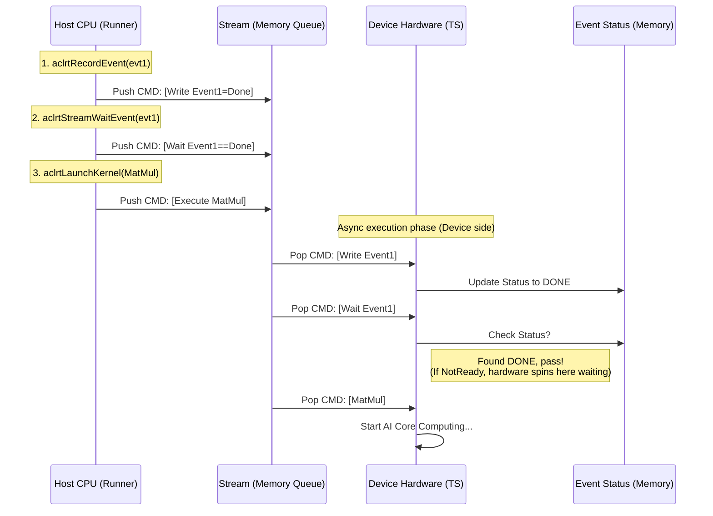
```mermaid
sequenceDiagram
    participant HostThread as Host CPU (Runner)
    participant StreamQueue as Stream (Memory Queue)
    participant DeviceScheduler as Device Hardware (TS)
    participant EventMem as Event Status (Memory)

    Note over HostThread: 1. aclrtRecordEvent(evt1)
    HostThread->>StreamQueue: Push CMD: [Write Event1=Done]
  
    Note over HostThread: 2. aclrtStreamWaitEvent(evt1)
    HostThread->>StreamQueue: Push CMD: [Wait Event1==Done]
  
    Note over HostThread: 3. aclrtLaunchKernel(MatMul)
    HostThread->>StreamQueue: Push CMD: [Execute MatMul]
  
    Note over DeviceScheduler: Async execution phase (Device side)
  
    StreamQueue->>DeviceScheduler: Pop CMD: [Write Event1]
    DeviceScheduler->>EventMem: Update Status to DONE
  
    StreamQueue->>DeviceScheduler: Pop CMD: [Wait Event1]
    DeviceScheduler->>EventMem: Check Status?
    Note right of DeviceScheduler: Found DONE, pass!<br/>(If NotReady, hardware spins here waiting)
  
    StreamQueue->>DeviceScheduler: Pop CMD: [MatMul]
    DeviceScheduler->>DeviceScheduler: Start AI Core Computing...
```

Everything placed in a Stream is executed by the Device hardware.

## 2. Device, Context, Stream and Other Hardware Resource Relationship Modeling

Relationship between Device, Context, Stream, and user host threads.

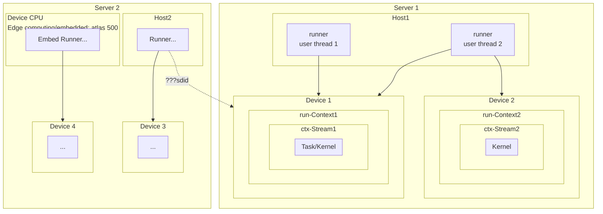
```mermaid
graph TD
    subgraph Server1[Server 1]
        Host1
        Device
        Device2
    end

    subgraph Server2[Server 2]
        Host3
        Host2
        Device3
        Device4
      
    end

    subgraph Host1[Host1]
        Runner1[runner<br>user thread 1]
        Runner2[runner<br>user thread 2]
    end

    subgraph Host2[Host2]
        Runner3[Runner...]
    end

    subgraph Host3[Device CPU<br>Edge computing/embedded: atlas 500]
        embedRunner[Embed Runner...]
    end

    subgraph Device[Device 1]
        Context1
    end

    subgraph Context1[run-Context1]
        Stream1
    end

    subgraph Stream1[ctx-Stream1]
        TaskKernel
    end

    subgraph TaskKernel[Task/Kernel]

    end

    subgraph Device2[Device 2]
        Context2
    end

    subgraph Context2[run-Context2]
        Stream2
    end

    subgraph Stream2[ctx-Stream2]
        Kernel
    end

    subgraph Kernel[Kernel]
    end

    subgraph Device3[Device 3]
        ctxM[...]
    end

    subgraph Device4[Device 4]
        ctxN[...]
    end

    Runner1-->Device
    Runner2-->Device
    Runner2-->Device2
    Runner3-->Device3
    Runner3-.->|???sdid|Device
    embedRunner-->Device4
 
```

### 2.1 Basic Device Relationship Modeling

#### 2.1.1 Hierarchy Overview

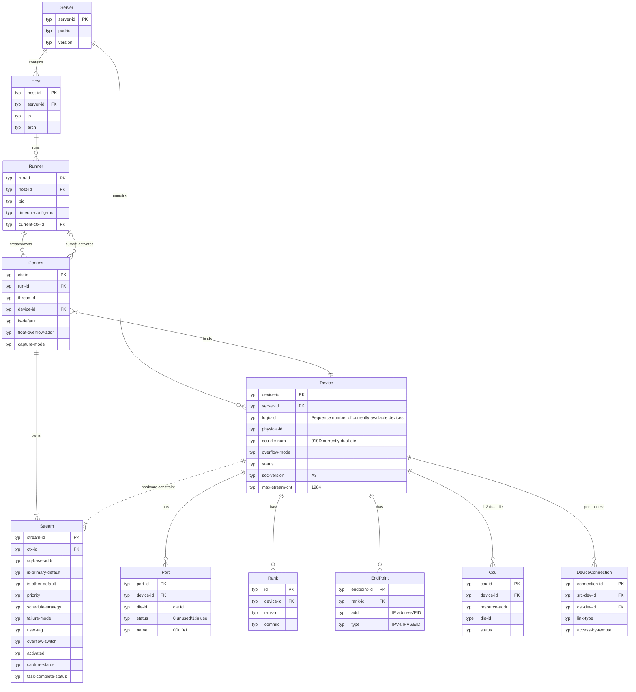
```mermaid
erDiagram
    %% ==========================================
    %% Layer 1: Physical Topology Layer (Server -> Host/Device)
    %% ==========================================
    Server {
        typ server-id PK
        typ pod-id
        typ version
    }
    Host {
        typ host-id PK
        typ server-id FK
        typ ip
        typ arch
    }
    Device {
        typ device-id PK
        typ server-id FK
        typ logic-id "Sequence number of currently available devices"
        typ physical-id
        typ ccu-die-num "910D currently dual-die"
        typ overflow-mode
        typ status
        typ soc-version "A3"
        typ max-stream-cnt "1984"
    }
    Server ||--|{ Host : contains
    Server ||--o{ Device : contains

    %% ==========================================
    %% Layer 2: Process and Context Layer (Runner -> Context -> Stream)
    %% ==========================================
    Runner {
        typ run-id PK
        typ host-id FK
        typ pid
        typ timeout-config-ms
        typ current-ctx-id FK
    }
    Context {
        typ ctx-id PK
        typ run-id FK
        typ thread-id
        typ device-id FK
        typ is-default
        typ float-overflow-addr
        typ capture-mode
    }
    Stream {
        typ stream-id PK
        typ ctx-id FK
        typ sq-base-addr
        typ is-primary-default
        typ is-other-default
        typ priority
        typ schedule-strategy
        typ failure-mode
        typ user-tag
        typ overflow-switch
        typ activated
        typ capture-status
        typ task-complete-status
    }
    Host ||--o{ Runner : runs
    Runner ||--o{ Context : "creates/owns"
    Runner |o--o{ Context : "current activates"
    Context }o--|| Device : binds
    Context ||--|{ Stream : owns
    Device ||..|{ Stream : "hardware constraint"

    %% ==========================================
    %% Layer 3: Device Internal Resource Layer (Port/EndPoint/Ccu)
    %% ==========================================
    Port {
        typ port-id PK
        typ device-id FK
        typ die-id "die Id"
        typ status "0:unused/1:in use"
        typ name "0/0, 0/1"
    }
    Rank {
        typ id PK
        typ device-id FK
        typ rank-id
        typ commId
    }
    EndPoint {
        typ endpoint-id PK
        typ rank-id FK
        typ addr "IP address/EID"
        typ type "IPV4/IPV6/EID"
    }
    Ccu {
        typ ccu-id PK
        typ device-id FK
        typ resource-addr
        type die-id
        typ status
    }
    DeviceConnection {
        typ connection-id PK
        typ src-dev-id FK
        typ dst-dev-id FK
        typ link-type
        typ access-by-remote
    }
    Device ||--o{ Port : "has"
    Device ||--o{ Rank : "has"
    Device ||--o{ EndPoint : "has"
    Device ||--o{ Ccu : "1:2 dual-die"
    Device ||--o{ DeviceConnection : "peer access"
```

#### 2.1.2 Network Communication Resources

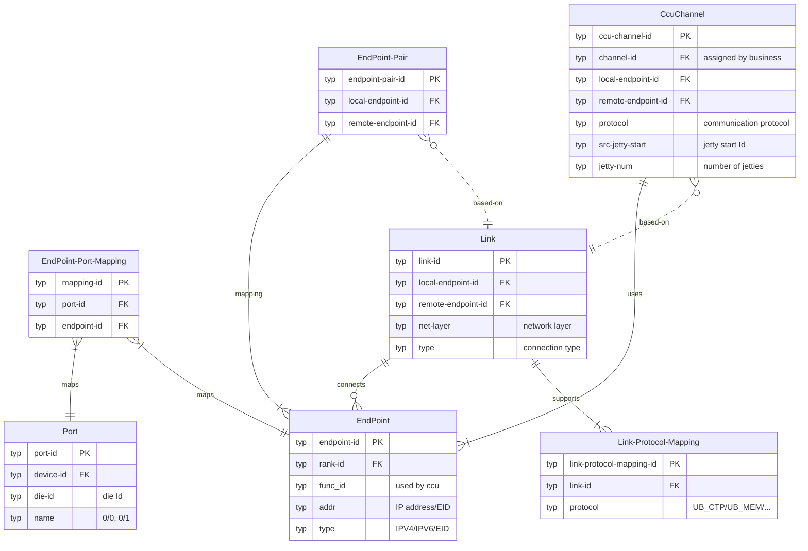
```mermaid
erDiagram
    %% ==========================================
    %% Network Topology and Connection Layer
    %% ==========================================
    EndPoint {
        typ endpoint-id PK
        typ rank-id FK
        typ func_id "used by ccu"
        typ addr "IP address/EID"
        typ type "IPV4/IPV6/EID"
    }
    Port {
        typ port-id PK
        typ device-id FK
        typ die-id "die Id"
        typ name "0/0, 0/1"
    }
    EndPoint-Port-Mapping {
        typ mapping-id PK
        typ port-id FK
        typ endpoint-id FK
    }
    %% Physical connections defined by topo.json
    Link {
        typ link-id PK
        typ local-endpoint-id FK
        typ remote-endpoint-id FK
        typ net-layer "network layer"
        typ type "connection type"
    }
    Link-Protocol-Mapping {
        typ link-protocol-mapping-id PK
        typ link-id FK
        typ protocol "UB_CTP/UB_MEM/..."
    }
    %% 
    EndPoint-Pair {
        typ endpoint-pair-id PK
        typ local-endpoint-id FK
        typ remote-endpoint-id FK
    }
    CcuChannel {
        typ ccu-channel-id PK
        typ channel-id FK   "assigned by business"
        typ local-endpoint-id FK
        typ remote-endpoint-id FK
        typ protocol "communication protocol"
        typ src-jetty-start "jetty start Id"
        typ jetty-num "number of jetties"
    }

    EndPoint-Port-Mapping }|--|| Port : maps
    EndPoint-Port-Mapping }|--|| EndPoint : maps
    Link ||--o{ EndPoint : connects
    Link ||--|{ Link-Protocol-Mapping : "supports"
    EndPoint-Pair ||--|{ EndPoint : mapping
    EndPoint-Pair }o..|| Link : "based-on"
    CcuChannel ||--|{ EndPoint : uses
    CcuChannel }o..|| Link : "based-on"
```

#### 2.1.3 Key Relationship Descriptions

##### Layer 1: Physical Topology Layer

| Relationship | Meaning | Notes |
| --- | --- | --- |
| Server → Host | A Server may contain multiple Host instances | e.g., multi-socket CPU or virtualized environment |
| Server → Device | A Server contains multiple AI devices | Corresponds to /dev/davinci0, /dev/davinci1, etc. |

##### Layer 2: Process and Context Layer

| Relationship | Meaning | Notes |
| --- | --- | --- |
| Host → Runner | Multiple application threads (Runners) on each host | Each Runner can create multiple Contexts |
| Runner → Context | Thread creates or switches to a different Context | Uses aclrtCreateContext() and aclrtSetCurrentContext() |
| Context → Device | Context binds to a Device | Cannot cross devices once created |
| Context → Stream | Each Context can create multiple Streams | Corresponds to aclrtCreateStream() |
| Runner ↔ Context (current) | Current context activation state | aclrtGetCurrentContext(), aclrtSetCurrentContext() |
| Device .. Stream | Resource upper limit constraint | Number of Streams is limited by hardware (max-stream-cnt) |

##### Layer 3: Device Internal Resource Layer

| Relationship | Meaning | Notes |
| --- | --- | --- |
| Device → Port | Device contains multiple communication ports | Used for network topology connections, format like "0/0, 0/1" |
| Device → Rank | Device is associated with a communication Rank | Rank identifies a participating node in the communication domain |
| Device → EndPoint | Device contains multiple endpoints | IP address/EID addressing identifiers, used for network communication |
| Device → Ccu | Device contains multiple CCU units | 910D uses dual-die architecture, one CCU per die |
| Device → DeviceConnection | Inter-device communication channels | aclrtDeviceCanAccessPeer(), aclrtDeviceEnablePeerAccess() |

##### Network Communication Resource Layer

| Relationship | Meaning | Notes |
| --- | --- | --- |
| EndPoint ↔ Port | Endpoint-to-port mapping | Many-to-many mapping via EndPoint-Port-Mapping |
| Link → EndPoint | Physical connection associated endpoints | Defined by topo.json, describes physical topology |
| Link → Link-Protocol-Mapping | Protocols supported by the connection | A Link can support multiple protocols (UB_CTP/UB_MEM, etc.) |

#### 2.1.4 Corresponding Interface Mapping Table

##### Basic and Device Layer (Device / Server)

| Entity/Attribute | Key API Interface |
| --------------------------- | ---------------------------------------------------------------------------------------------------- |
| Server/Host | `aclInit`, `aclFinalize` |
| Runner.pid | `rtDeviceGetBareTgid` |
| Device | `rtGetDeviceCount` |
| Device.logic-id | `rtSetDevice`,`rtResetDevice`,`rtGetDevice`,`rtsGetLogicDevIdByPhyDevId` |
| Device.physical-id | `rtGetPhyDevIdByLogicDevId` |
| Device.soc-name | `rtGetSocName` |
| Device.overflow-mode | `rtSetDeviceSatMode`,`rtGetDeviceSatMode` |
| DeviceConnection | `rtGetDevicesTopo`,`rtDeviceDisablePeerAccess`,`rtDeviceEnablePeerAccess`,`rtDevicePeerAccessStatus` |
| Context.context-id | `rtCreateContext`,`rtDestroyContext` |
| Context.is-default | `rtSetCurrentContext`,`rtGetCurrentContext` |
| Context.float-overflow-addr | `rtCtxGetFloatOverflowAddr` |
| Stream table | `aclrtGetStreamAvailableNum` |
| Stream.stream-id | `rtCreateStream`,`rtCreateStreamWithConfig`,`rtDestroyStream`,`rtDestroyStreamForce` |
| Stream.task-complete-status | `rtSynchronizeStream`, `rtSynchronizeStreamWithTimeout` |
| Stream.activated | `rtStreamStop` |
| Stream.failure-mode | `rtSetStreamAttribute`,`rtGetStreamAttribute` |

### 2.2 Basic Memory Management Relationship Modeling

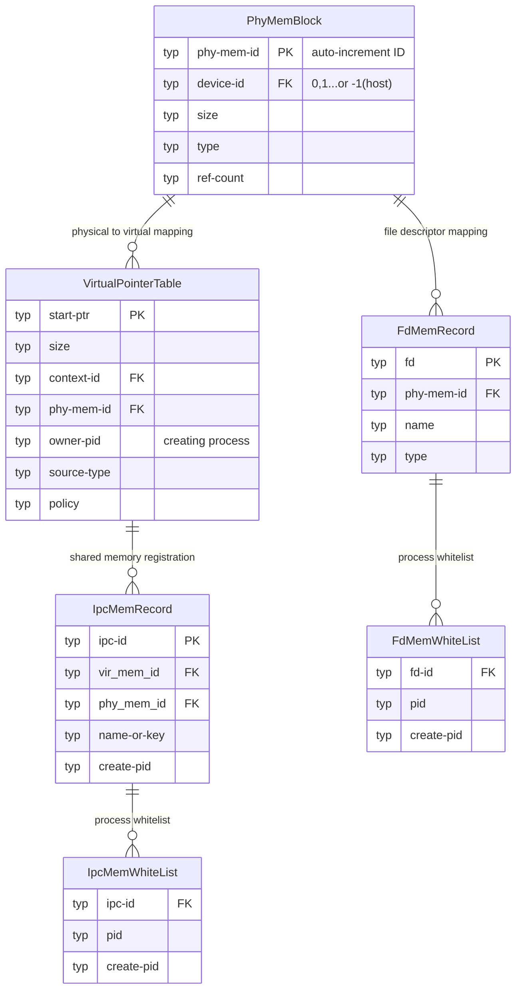
```mermaid
erDiagram
    PhyMemBlock ||--o{ VirtualPointerTable : "physical to virtual mapping"
    PhyMemBlock ||--o{ FdMemRecord : "file descriptor mapping"
    PhyMemBlock {
        typ phy-mem-id PK "auto-increment ID"
        typ device-id FK "0,1...or -1(host)"
        typ size
        typ type 
        typ ref-count
    }

    VirtualPointerTable {
        typ start-ptr PK
        typ size
        typ context-id FK
        typ phy-mem-id FK
        typ owner-pid  "creating process"
        typ source-type ""
        typ policy
    }

    VirtualPointerTable ||--o{ IpcMemRecord : "shared memory registration"
    IpcMemRecord {
        typ ipc-id PK
        typ vir_mem_id FK
        typ phy_mem_id FK
        typ name-or-key
        typ create-pid
    }

    IpcMemRecord ||--o{ IpcMemWhiteList : "process whitelist"
    IpcMemWhiteList {
        typ ipc-id FK
        typ pid
        typ create-pid
    }

    FdMemRecord {
        typ fd PK
        typ phy-mem-id FK
        typ name
        typ type
    }

    FdMemRecord ||--o{ FdMemWhiteList : "process whitelist"
    FdMemWhiteList {
        typ fd-id FK
        typ pid
        typ create-pid
    }

    %%VirtualPointerTable ||--o{ MemMapRecord : "mapping relationship"
    %%MemMapRecord {
    %%    typ ptr FK
    %%    typ phy-mem-id FK
    %%}
```

#### 2.2.1 Key Relationship Descriptions (Basic Memory Management Relationship Modeling)

1. **Physical memory is core**.
   `PhyMemBlock` serves as the base entity, associated with all other entities through `phy_mem_id`, reflecting Huawei Ascend's "physical memory pooling" design philosophy[3].
2. **Three-layer mapping system**:

   - Physical → Virtual (`VirtualPointerTable`)
   - Physical → IPC Shared (`IpcMemRecord`)
   - Physical → File Descriptor (`fdMemRecord`)
3. **Security control**:
   `IpcMemWhiteList` implements secure sharing for Huawei HCCS (Huawei Collective Communication Service) through process PID whitelisting[3].
4. **Special mapping types**:
   `MemMapRecord` records dual virtual address mapping scenarios (e.g., mappings created by `aclrtMapMem`), supporting Huawei NPU's zero-copy data transfer[3].

#### 2.1.2 Corresponding Interface Mapping Table (Basic Memory Management Relationship Modeling)

| Entity | Key Management Interface |
| ------------------------------ | ----------------------------------------------------------------------------------------------------------------------------------------------- |
| PhyMemBlock | `rtMallocPhysical`, `rtFreePhysical` |
| VirtualPointerTable | `rtMallocWithCfg`,`rtMallocForTaskScheduler`,`rtMallocHostWithCfg`,`rtFree`,`rtReserveMemAddress`,`ReleaseMemAddress`, `rtMapMem`, `rtUnmapMem` |
| VirtualPointerTable.context-id | `rtPointerGetAttributes` |
| FdMemRecord.fd | `rtMemExportToShareableHandle`, `rtMemImportFromShareableHandle` |
| FdMemWhiteList.pid | `rtMemSetPidToShareableHandle` |
| IpcMemRecord.name-or-key | `rtIpcMemGetExportKey` |
| IpcMemRecord.ipc-id | `rtIpcMemImportByKey`,`IpcMemClose` |
| IpcMemWhiteList.pid | `rtIpcMemSetImportPid` |
| MemMapRecord | `rtHostRegister`, `rtHostUnRegister` |

## 3. Extending the Basic Model with a Data Task Model

### 3.1 Data / Task Flow Modeling

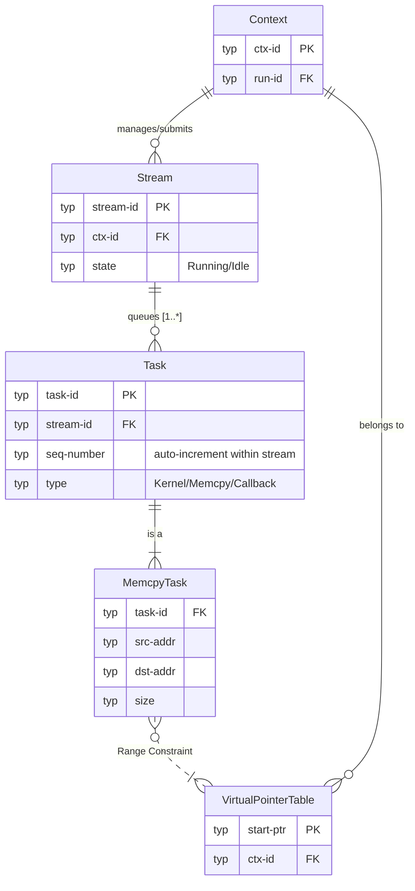
```mermaid
erDiagram
    Context {
        typ ctx-id PK
        typ run-id FK
    }

    Stream {
        typ stream-id PK
        typ ctx-id FK
        typ state "Running/Idle"
    }

    %% Stream contains an ordered list of tasks
    Context ||--o{ Stream : "manages/submits"
    Stream ||--o{ Task : "queues [1..*]"

    Task {
        typ task-id PK
        typ stream-id FK
        typ seq-number "auto-increment within stream"
        typ type "Kernel/Memcpy/Callback"
    }

    %% Various specific Task types (logical inheritance relationship)
    MemcpyTask {
        typ task-id FK
        typ src-addr
        typ dst-addr
        typ size
    }

    %% Logical expression of inheritance (Task is divided into multiple types)
    Task ||--|{ MemcpyTask : "is a"

    %% MemcpyTask address should be addressable in VirtualPointerTable
    MemcpyTask }o..|{ VirtualPointerTable : "Range Constraint"
    VirtualPointerTable {
        typ start-ptr PK
        typ ctx-id FK
    }

    VirtualPointerTable }o--|| Context : "belongs to"

```

### 3.2 CCU Resource Modeling

An NPU device contains 2 CCUs, die0 and die1 respectively.

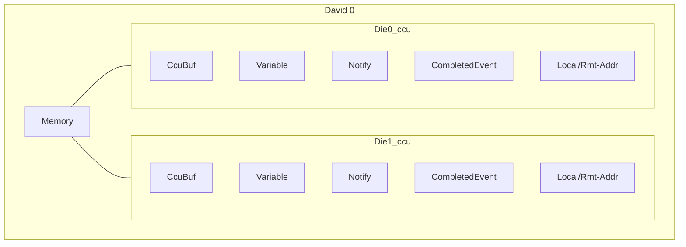
```mermaid
graph RL
    subgraph DavidDevice0[David 0]
        direction RL
        Memory0[Memory]
        David0Die0[Die0_ccu]
        David0Die1[Die1_ccu]
    end

    subgraph David0Die0[Die0_ccu]

        CcuBuf00[CcuBuf]
        Variable00[Variable]
        Notify00[Notify]
        CompletedEvent00[CompletedEvent]
        Local/Rmt-Addr00[Local/Rmt-Addr]
    end

    subgraph David0Die1[Die1_ccu]

        CcuBuf01[CcuBuf]
        Variable01[Variable]
        Notify01[Notify]
        CompletedEvent01[CompletedEvent]
        Local/Rmt-Addr01[Local/Rmt-Addr]
    end

    David0Die0---Memory0
    David0Die1---Memory0

```

#### 3.2.1 Corresponding Interface Mapping Table (CCU Resource Modeling)

| Entity | Key Management Interface |
| ------------------ | -------------------------------------------------------- |
| CcuBuf | `rtCcuBufAlloc`, `rtCcuBufFree`, `rtCcuBufGetAddr` |
| Variable | `rtVariableCreate`, `rtVariableDestroy`, `rtVariableSet` |
| Notify | `rtCreateNotify`, `rtDestroyNotify` |
| CompletedEvent | `rtCreateEvent`, `rtDestroyEvent` |
| Local/Rmt-Addr | `rtGetDeviceLocalAddr`, `rtGetDeviceRemoteAddr` |
| CCU resource query | `rtGetCcudieInfo`, `rtGetCcudieNum` |

#### 3.2.2 CCU Resource Lifecycle Description

**CCU initialization flow**:

1. When the Device starts, two CCUs (die0/die1) initialize automatically.
2. Each CCU has its own independent CcuBuf, Variable, and Notify resource pools.
3. CompletedEvent is used to notify task completion status.

**Resource constraints**:

- Each CCU has a limited number of CcuBuf entries (related to Device.soc-version)
- Variable is used to store shared variables during communication.
- Notify is used for cross-CCU synchronization notification mechanisms.
- Local/Rmt-Addr is used for address translation during cross-die communication.

### 3.3 Async / Sync Execution Modeling

#### 3.3.1 [Notify Resource Management](https://www.hiascend.com/document/detail/zh/CANNCommunityEdition/850alpha001/appdevg/acldevg/aclcppdevg_000524.html)

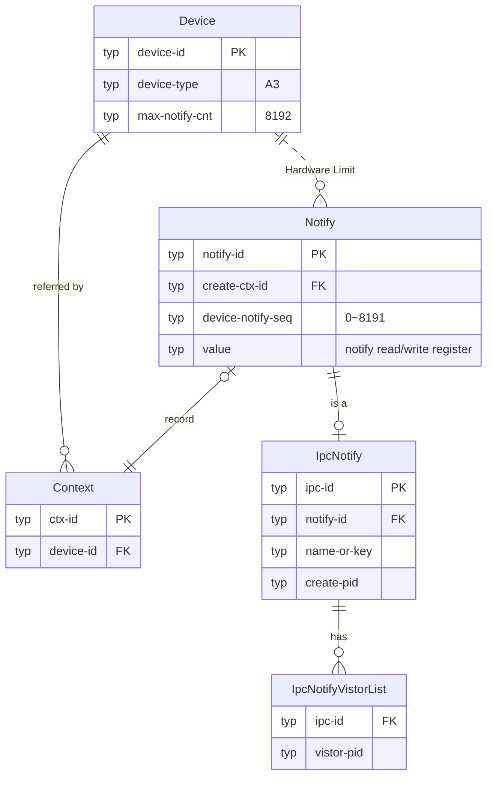
```mermaid
erDiagram
    Device ||..o{ Notify : "Hardware Limit"
    Device ||--o{ Context : "referred by"
    Device {
        typ device-id PK
        typ device-type "A3"
        typ max-notify-cnt "8192"
    }
    Context {
        typ ctx-id PK
        typ device-id FK
    }

    Notify ||--o| IpcNotify : "is a"
    Notify o|--|| Context : "record"
    Notify {
        typ notify-id PK
        typ create-ctx-id FK
        typ device-notify-seq "0~8191"
        typ value "notify read/write register"
    }

    IpcNotify {
        typ ipc-id PK
        typ notify-id FK
        typ name-or-key
        typ create-pid
    }

    IpcNotify ||--o{ IpcNotifyVistorList : "has"
    IpcNotifyVistorList {
        typ ipc-id FK
        typ vistor-pid
    }
```

##### Key Relationship Descriptions ([Notify Resource Management](https://www.hiascend.com/document/detail/zh/CANNCommunityEdition/850alpha001/appdevg/acldevg/aclcppdevg_000524.html))

**Notify and Device hardware constraints**:

- Each Device has an upper limit of `max-notify-cnt` Notifies (e.g., 8192 for A3 chip)
- `device-notify-seq` is the physical sequence number of a Notify within the Device (0~8191)
- A Notify must specify its owning Context when created, and the Context binds to a specific Device.

**Notify IPC sharing mechanism**:

- `IpcNotify` allows cross-process sharing of Notify instances.
- `name-or-key` is the sharing identifier, obtained via `rtNotifyGetExportKey`.
- Other processes import and use it via `rtNotifyImportByKey`.
- `IpcNotifyVistorList` records the process PIDs authorized to access this Notify.

**Notify state management**:

- The `value` field maps to hardware registers for read/write status.
- `rtWaitAndResetNotify` waits for a Notify to become Ready and resets it.
- Notify is used for inter-Stream synchronization and cross-process synchronization scenarios.

##### Corresponding Interface Mapping Table ([Notify Resource Management](https://www.hiascend.com/document/detail/zh/CANNCommunityEdition/850alpha001/appdevg/acldevg/aclcppdevg_000524.html))

| Entity | Key Management Interface |
| -------------------------- | --------------------------------------------------- |
| Notify.notify-id | `rtCreateNotify`,`rtDestroyNotify`, `rtGetNotifyId` |
| Notify.state | `lrtWaitAndResetNotify`, `rtWaitAndResetNotify` |
| IpcNotify.name-or-key | `rtNotifyGetExportKey`,`rtNotifyImportByKey` |
| IpcNotifyVistorList.ipc-id | `rtNotifySetImportPid` |

#### 3.3.2 Notify Synchronization Control

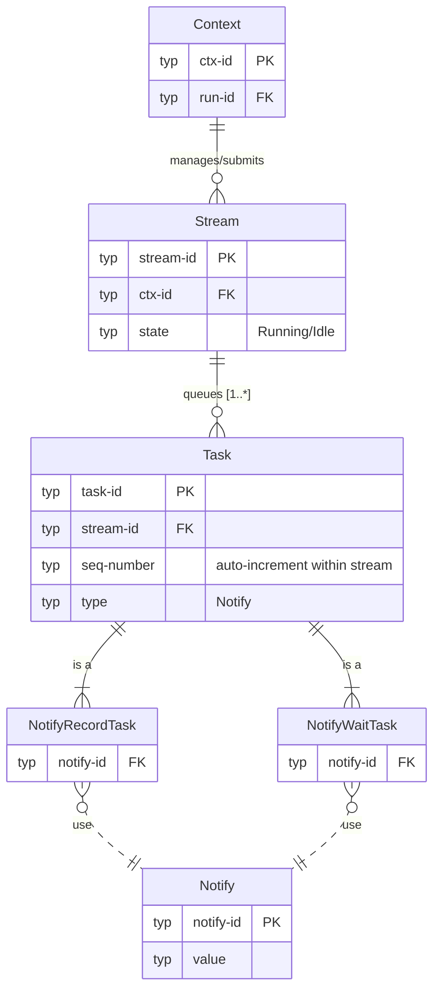
```mermaid
erDiagram
    Context {
        typ ctx-id PK
        typ run-id FK
    }

    Stream {
        typ stream-id PK
        typ ctx-id FK
        typ state "Running/Idle"
    }

    %% Stream contains an ordered list of tasks
    Context ||--o{ Stream : "manages/submits"
    Stream ||--o{ Task : "queues [1..*]"

    Task {
        typ task-id PK
        typ stream-id FK
        typ seq-number "auto-increment within stream"
        typ type "Notify"
    }

    %% Various specific Task types (logical inheritance relationship)
    NotifyRecordTask {
        typ notify-id  FK

    }

    NotifyWaitTask {
        typ notify-id FK
    }

    NotifyRecordTask }o..|| Notify : "use"
    NotifyWaitTask }o..|| Notify : "use"
    Notify {
        typ notify-id  PK
        typ value
    }
    %% Logical expression of inheritance (Task is divided into multiple types)
    Task ||--|{ NotifyRecordTask : "is a"
    Task ||--|{ NotifyWaitTask : "is a"
```

##### Key Relationship Descriptions (Notify Synchronization Control)

**Notify task types**:

- `NotifyRecordTask`: Sets the Notify state to Ready, indicating an event has completed.
- `NotifyWaitTask`: Waits for the Notify state to become Ready, implementing inter-Stream synchronization.

**Task execution order**:

- NotifyRecordTask executes on StreamA, setting Notify to Ready.
- NotifyWaitTask executes on StreamB, waiting for the same Notify.
- Once Notify becomes Ready, subsequent tasks on StreamB can proceed.

**Cross-Stream synchronization example**:

```text
StreamA: Task1 -> NotifyRecordTask(notify-id=1) -> Task2
StreamB: NotifyWaitTask(notify-id=1) -> Task3
// Task3 must wait for Task1 to complete before executing
```

##### Corresponding Interface Mapping Table (Notify Synchronization Control)

| Entity | Key Management Interface |
| ---------------- | ----------------------- |
| NotifyRecordTask | `rtRecordNotify` |
| NotifyWaitTask | `lrtWaitAndResetNotify` |

#### 3.3.3 Event Resource Management

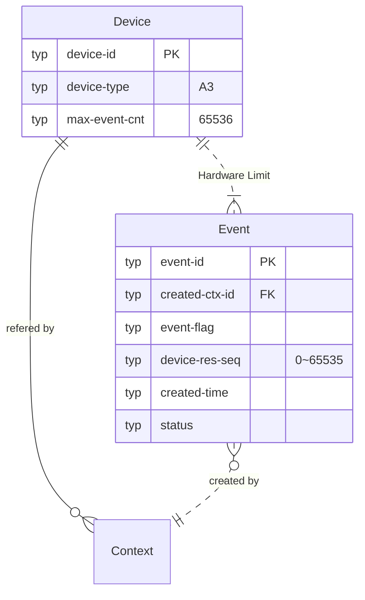
```mermaid
erDiagram
    Device ||..|{ Event : "Hardware Limit"
    Device ||--o{ Context : "refered by"
    Device {
        typ device-id PK
        typ device-type "A3"
        typ max-event-cnt "65536"
    }

    Event }o..|| Context : "created by"
    Event {
        typ event-id PK
        typ created-ctx-id FK
        typ event-flag
        typ device-res-seq "0~65535"
        typ created-time
        typ status
    }
```

##### Key Relationship Descriptions (Event Resource Management)

**Event and Device hardware constraints**:

- Each Device has an upper limit of `max-event-cnt` Events (e.g., 65536 for A3 chip)
- `device-res-seq` is the physical sequence number of an Event within the Device (0~65535)
- An Event must specify its owning Context when created, and the Context binds to a specific Device.

**Event and Context relationship**:

- `created-ctx-id` records the Context that created the Event.
- An Event can be shared across multiple Streams, but must belong to the same Context.
- Cross-Context Event sharing requires IPC mechanisms (similar to Notify)

**Event state management**:

- The `status` field indicates the current Event state: NotRecorded/Recorded/Completed.
- `event-flag` controls Event behavior (e.g., auto-reset)
- `created-time` is used for performance statistics.

##### Corresponding Interface Mapping Table (Event Resource Management)

| Entity | Key Management Interface |
| -------------- | ------------------------------------------------------------------------ |
| Event.event-id | `rtCreateEvent`, `rtCreateEventWithFlag`,`rtDestroyEvent`,`rtGetEventId` |
| Event.status | `rtRecordEvent`,`rtQueryEventStatus` |

#### 3.3.4 Event Flow Control

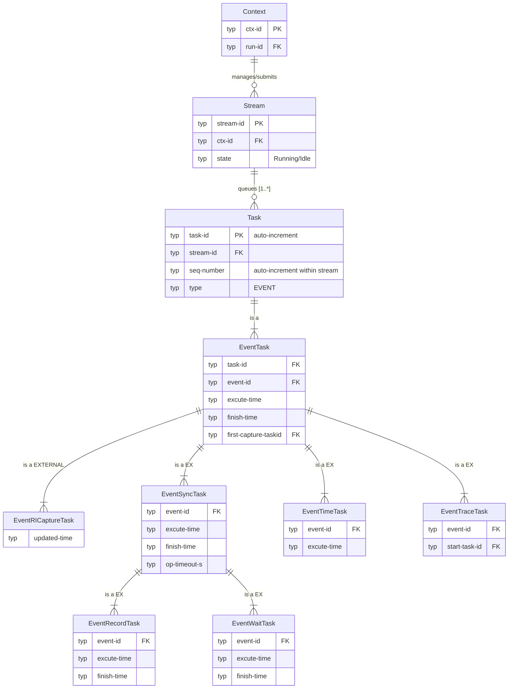
```mermaid
erDiagram
    Context {
        typ ctx-id PK
        typ run-id FK
    }

    Stream {
        typ stream-id PK
        typ ctx-id FK
        typ state "Running/Idle"
    }

    %% Stream contains an ordered list of tasks
    Context ||--o{ Stream : "manages/submits"
    Stream ||--o{ Task : "queues [1..*]"

    Task {
        typ task-id PK "auto-increment"
        typ stream-id FK
        typ seq-number "auto-increment within stream"
        typ type "EVENT"
    }

    %% Various specific Task types (logical inheritance relationship)
    EventTask {
        typ task-id FK
        typ event-id FK
        typ excute-time
        typ finish-time 
        typ first-capture-taskid  FK  
    }

    EventRICaptureTask {
        typ updated-time   
    }  

    EventSyncTask {
        typ event-id FK
        typ excute-time
        typ finish-time 
        typ op-timeout-s 
    }
    EventRecordTask {
        typ event-id FK
        typ excute-time
        typ finish-time 
    }
    EventWaitTask {
        typ event-id FK
        typ excute-time
        typ finish-time 
    }    
    EventTimeTask {
        typ event-id FK
        typ excute-time     
    }
    EventTraceTask {
        typ event-id FK
        typ start-task-id  FK  
    }      

    %% Logical expression of inheritance (Task is divided into multiple types)
    Task ||--|{ EventTask : "is a "
    EventTask ||--|{ EventRICaptureTask : "is a EXTERNAL"
    EventTask ||--|{ EventSyncTask : "is a EX"
    EventTask ||--|{ EventTimeTask : "is a EX"
    EventTask ||--|{ EventTraceTask : "is a EX"
    EventSyncTask ||--|{ EventRecordTask : "is a EX"
    EventSyncTask ||--|{ EventWaitTask : "is a EX"
```

##### Key Relationship Descriptions (Event Flow Control)

**Event task type classification**:

- `EventRecordTask`: Sets the Event state to Recorded/Completed.
- `EventWaitTask`: Waits for the Event state to become Completed.
- `EventSyncTask`: Synchronously waits for Event completion (blocking call)
- `EventRICaptureTask`: Special record task in RI Capture mode.
- `EventTimeTask`: Timestamp-related task.
- `EventTraceTask`: Task record for performance tracing.

**Event task inheritance relationship**:

- `EventTask` is the base class, containing task-id, event-id, execute-time, finish-time.
- `EventSyncTask` inherits EventTask, adding an op-timeout-s timeout parameter.
- `EventRecordTask` and `EventWaitTask` inherit EventSyncTask.
- `EventRICaptureTask`, `EventTimeTask`, `EventTraceTask` inherit EventTask directly.

**Event execution flow**:

```text
StreamA: KernelTask -> EventRecordTask(event-id=1)
StreamB: EventWaitTask(event-id=1) -> KernelTask2
// StreamB's KernelTask2 must wait for StreamA's KernelTask to complete
```

**Task trace relationship**:

- `first-capture-task-id` records the Task ID of the first Capture.
- `EventTraceTask.start-task-id` associates the tracking start task.
- EventRecordTask achieves cross-Stream synchronization through EventWaitTask mapping.

##### Corresponding Interface Mapping Table (Event Flow Control)

| Entity | Key Management Interface |
| --------------- | ---------------------------------------------------- |
| EventTask | `rtRecordEvent`, `rtResetEvent`,`rtSynchronizeEvent` |
| EventRecordTask | `rtRecordEvent`, `rtResetEvent` |
| EventWaitTask | `rtStreamWaitEvent`, `rtQueryEventWaitStatus` |
| EventTimeTask | `rtResetEvent`, `rtRecordEvent` |
| EventTraceTask | `rtResetEvent`, `rtRecordEvent` |

## 4. Communication Domain Modeling

Cross-machine communication involves multi-communication-domain mixed task orchestration.
The essence of a communication domain is a multi-card network topology maintained by HCCL at the framework layer through the link establishment capability provided by Rdma_Agent, stored in the host process.

### 4.1 Core Concepts of Communication Domain

A communicator is the basic abstraction of HCCL collective communication. Each communicator defines a set of Ranks participating in communication and their topological relationships.

#### 4.1.1 Basic Communicator Definition

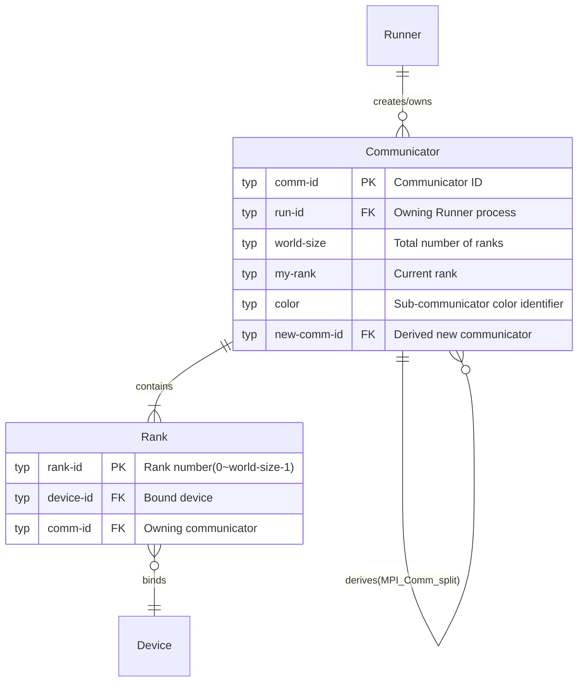
```mermaid
erDiagram
    %% ==========================================
    %% Communicator Definition (HCCL Communicator)
    %% ==========================================
    Communicator {
        typ comm-id PK "Communicator ID"
        typ run-id FK "Owning Runner process"
        typ world-size "Total number of ranks"
        typ my-rank "Current rank"
        typ color "Sub-communicator color identifier"
        typ new-comm-id FK "Derived new communicator"
    }
    Rank {
        typ rank-id PK "Rank number(0~world-size-1)"
        typ device-id FK "Bound device"
        typ comm-id FK "Owning communicator"
    }
    Runner ||--o{ Communicator : "creates/owns"
    Communicator ||--|{ Rank : "contains"
    Rank }o--|| Device : "binds"
    Communicator ||--o{ Communicator : "derives(MPI_Comm_split)"
```

#### 4.1.2 Control Plane: Socket Communication

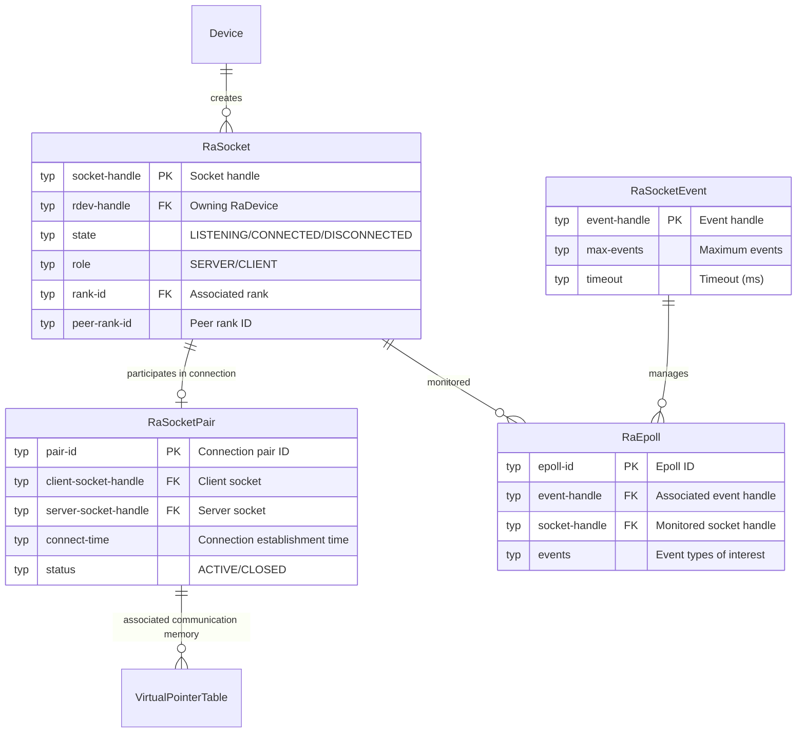
```mermaid
erDiagram
    %% ==========================================
    %% Socket Communication (RaSocket series interfaces)
    %% ==========================================
    Device ||--o{ RaSocket : creates
    RaSocket {
        typ socket-handle PK "Socket handle"
        typ rdev-handle FK "Owning RaDevice"
        typ state "LISTENING/CONNECTED/DISCONNECTED"
        typ role "SERVER/CLIENT"
        typ rank-id FK "Associated rank"
        typ peer-rank-id "Peer rank ID"
    }
    RaSocketPair {
        typ pair-id PK "Connection pair ID"
        typ client-socket-handle FK "Client socket"
        typ server-socket-handle FK "Server socket"
        typ connect-time "Connection establishment time"
        typ status "ACTIVE/CLOSED"
    }
    RaSocket ||--o| RaSocketPair : "participates in connection"
    RaSocketPair ||--o{ VirtualPointerTable : "associated communication memory"
    
    %% Socket event management (Epoll mechanism)
    RaSocketEvent {
        typ event-handle PK "Event handle"
        typ max-events "Maximum events"
        typ timeout "Timeout (ms)"
    }
    RaEpoll {
        typ epoll-id PK "Epoll ID"
        typ event-handle FK "Associated event handle"
        typ socket-handle FK "Monitored socket handle"
        typ events "Event types of interest"
    }
    RaSocketEvent ||--o{ RaEpoll : "manages"
    RaSocket ||--o{ RaEpoll : "monitored"
```

#### 4.1.3 Data Plane: RDMA Communication

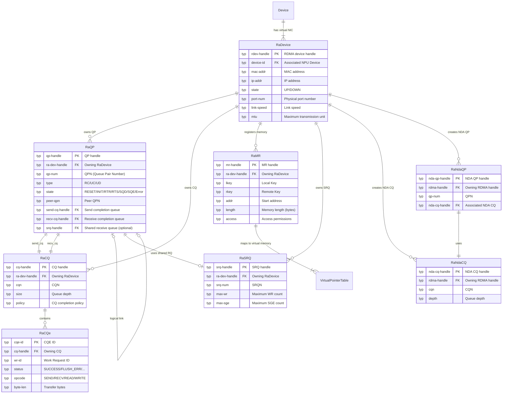
```mermaid
erDiagram
    %% ==========================================
    %% RDMA Devices and Resources (RaRdev, RaQp, RaMr interfaces)
    %% ==========================================
    Device ||--|{ RaDevice : "has virtual NIC"
    RaDevice {
        typ rdev-handle PK "RDMA device handle"
        typ device-id FK "Associated NPU Device"
        typ mac-addr "MAC address"
        typ ip-addr "IP address"
        typ state "UP/DOWN"
        typ port-num "Physical port number"
        typ link-speed "Link speed"
        typ mtu "Maximum transmission unit"
    }
    
    %% RDMA core: QP (Queue Pair)
    RaQP {
        typ qp-handle PK "QP handle"
        typ ra-dev-handle FK "Owning RaDevice"
        typ qp-num "QPN (Queue Pair Number)"
        typ type "RC/UC/UD"
        typ state "RESET/INIT/RTR/RTS/SQD/SQE/Error"
        typ peer-qpn "Peer QPN"
        typ send-cq-handle FK "Send completion queue"
        typ recv-cq-handle FK "Receive completion queue"
        typ srq-handle FK "Shared receive queue (optional)"
    }
    RaDevice ||--o{ RaQP : "owns QP"
    RaQP ||--|| RaCQ : "send_cq"
    RaQP ||--|| RaCQ : "recv_cq"
    RaQP |o--o| RaQP : "logical link"
    RaQP ||--o| RaSRQ : "uses shared RQ"
    
    %% Completion Queue CQ
    RaCQ {
        typ cq-handle PK "CQ handle"
        typ ra-dev-handle FK "Owning RaDevice"
        typ cqn "CQN"
        typ size "Queue depth"
        typ policy "CQ completion policy"
    }
    RaCQe {
        typ cqe-id PK "CQE ID"
        typ cq-handle FK "Owning CQ"
        typ wr-id "Work Request ID"
        typ status "SUCCESS/FLUSH_ERR/..."
        typ opcode "SEND/RECV/READ/WRITE"
        typ byte-len "Transfer bytes"
    }
    RaDevice ||--o{ RaCQ : "owns CQ"
    RaCQ ||--o{ RaCQe : "contains"
    
    %% Memory Registration MR
    RaMR {
        typ mr-handle PK "MR handle"
        typ ra-dev-handle FK "Owning RaDevice"
        typ lkey "Local Key"
        typ rkey "Remote Key"
        typ addr "Start address"
        typ length "Memory length (bytes)"
        typ access "Access permissions"
    }
    RaDevice ||--o{ RaMR : "registers memory"
    RaMR ||--|{ VirtualPointerTable : "maps to virtual memory"
    
    %% Shared Receive Queue SRQ
    RaSRQ {
        typ srq-handle PK "SRQ handle"
        typ ra-dev-handle FK "Owning RaDevice"
        typ srq-num "SRQN"
        typ max-wr "Maximum WR count"
        typ max-sge "Maximum SGE count"
    }
    RaDevice ||--o{ RaSRQ : "owns SRQ"
    
    %% NDA Direct Access
    RaNdaCQ {
        typ nda-cq-handle PK "NDA CQ handle"
        typ rdma-handle FK "Owning RDMA handle"
        typ cqn "CQN"
        typ depth "Queue depth"
    }
    RaNdaQP {
        typ nda-qp-handle PK "NDA QP handle"
        typ rdma-handle FK "Owning RDMA handle"
        typ qp-num "QPN"
        typ nda-cq-handle FK "Associated NDA CQ"
    }
    RaDevice ||--o{ RaNdaCQ : "creates NDA CQ"
    RaDevice ||--o{ RaNdaQP : "creates NDA QP"
    RaNdaQP ||--|| RaNdaCQ : "uses"
```

#### 4.1.4 Data Plane: UB Unified Bus

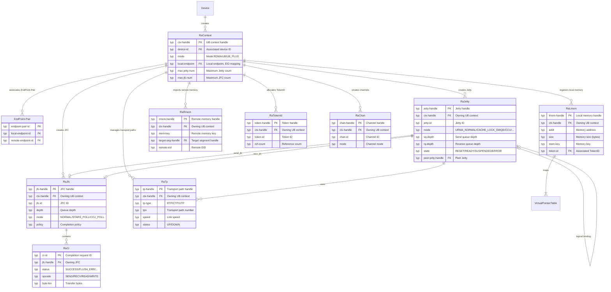
```mermaid
erDiagram
    %% ==========================================
    %% UB Context (RaContext series interfaces)
    %% ==========================================
    Device ||--o{ RaContext : creates
    RaContext {
        typ ctx-handle PK "UB context handle"
        typ device-id FK "Associated device ID"
        typ mode "Mode:RDMA/UB/UB_PLUS"
        typ local-endpoint FK "Local endpoint, EID mapping"
        typ max-jetty-num "Maximum Jetty count"
        typ max-jfc-num "Maximum JFC count"
    }
    
    EndPoint-Pair {
        typ endpoint-pair-id PK
        typ local-endpoint-id FK
        typ remote-endpoint-id FK
    }

    %% UB core resources
    RaContext ||--o{ RaJetty : "creates Jetty"
    RaContext ||--o{ RaJfc : "creates JFC"
    RaContext ||--o{ RaLmem : "registers local memory"
    RaContext ||--o{ RaRmem : "imports remote memory"
    RaContext ||--o{ RaTp : "manages transport paths"
    RaContext ||--o{ RaTokenId : "allocates TokenID"
    RaContext ||--o{ RaChan : "creates channels"
    RaContext ||--o{ EndPoint-Pair : "associates EndPoint-Pair"

    %% Jetty (QP equivalent)
    RaJetty {
        typ jetty-handle PK "Jetty handle"
        typ ctx-handle FK "Owning UB context"
        typ jetty-id "Jetty ID"
        typ mode "URMA_NORMAL/CACHE_LOCK_DWQE/CCU/..."
        typ sq-depth "Send queue depth"
        typ rq-depth "Receive queue depth"
        typ state "RESET/READY/SUSPENDED/ERROR"
        typ peer-jetty-handle FK "Peer Jetty"
    }
    RaJetty ||--o| RaJfc : "send_jfc"
    RaJetty ||--o| RaJfc : "recv_jfc"
    RaJetty |o--o| RaJetty : "logical binding"
    
    %% JFC (CQ equivalent)
    RaJfc {
        typ jfc-handle PK "JFC handle"
        typ ctx-handle FK "Owning UB context"
        typ jfc-id "JFC ID"
        typ depth "Queue depth"
        typ mode "NORMAL/STARS_POLL/CCU_POLL"
        typ policy "Completion policy"
    }
    RaCr {
        typ cr-id PK "Completion request ID"
        typ jfc-handle FK "Owning JFC"
        typ status "SUCCESS/FLUSH_ERR/..."
        typ opcode "SEND/RECV/READ/WRITE"
        typ byte-len "Transfer bytes"
    }
    RaJfc ||--o{ RaCr : "contains"
    
    %% Local memory registration
    RaLmem {
        typ lmem-handle PK "Local memory handle"
        typ ctx-handle FK "Owning UB context"
        typ addr "Memory address"
        typ size "Memory size (bytes)"
        typ mem-key "Memory key"
        typ token-id FK "Associated TokenID"
    }
    RaLmem ||--|{ VirtualPointerTable : "maps"
    
    %% Remote memory import
    RaRmem {
        typ rmem-handle PK "Remote memory handle"
        typ ctx-handle FK "Owning UB context"
        typ mem-key "Remote memory key"
        typ target-seg-handle FK "Target segment handle"
        typ remote-eid "Remote EID"
    }
    
    %% Transport path
    RaTp {
        typ tp-handle PK "Transport path handle"
        typ ctx-handle FK "Owning UB context"
        typ tp-type "RTP/CTP/UTP"
        typ tpn "Transport path number"
        typ speed "Link speed"
        typ status "UP/DOWN"
    }
    RaJetty ||--o{ RaTp : "uses"
    
    %% TokenID
    RaTokenId {
        typ token-handle PK "Token handle"
        typ ctx-handle FK "Owning UB context"
        typ token-id "Token ID"
        typ ref-count "Reference count"
    }
    
    %% 
    RaChan {
        typ chan-handle PK "Channel handle"
        typ ctx-handle FK "Owning UB context"
        typ chan-id "Channel ID"
        typ mode "Channel mode"
    }
```

#### 4.1.5 Async Request Management

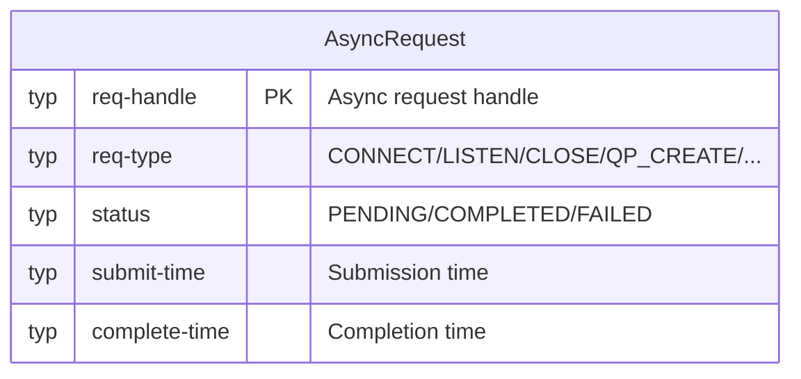
```mermaid
erDiagram
    AsyncRequest {
        typ req-handle PK "Async request handle"
        typ req-type "CONNECT/LISTEN/CLOSE/QP_CREATE/..."
        typ status "PENDING/COMPLETED/FAILED"
        typ submit-time "Submission time"
        typ complete-time "Completion time"
    }
```

#### 4.1.6 Communication Domain Architecture Summary

```text
┌─────────────────────────────────────────────────────────────────┐
│                    HCCL Communication Domain Architecture        │
├─────────────────────────────────────────────────────────────────┤
│  Application Layer                                                │
│  ┌──────────────────────────────────────────────────────────┐   │
│  │  Communicator                                              │   │
│  │  └── Rank[0..N] (Participating nodes, each bound to a Device) │
│  └──────────────────────────────────────────────────────────┘   │
├─────────────────────────────────────────────────────────────────┤
│  Control Plane (Link Establishment/Handshake)                    │
│  ┌──────────────────────────────────────────────────────────┐   │
│  │  RaSocket (Socket Communication)                           │   │
│  │  ├── RaSocketPair (Connection pair)                        │   │
│  │  └── RaEpoll (Event monitoring)                            │   │
│  └──────────────────────────────────────────────────────────┘   │
├─────────────────────────────────────────────────────────────────┤
│  Data Plane (Data Transfer)                                      │
│  ┌─────────────────────┐    ┌─────────────────────┐            │
│  │  RDMA (Traditional)   │    │  UB (Unified Bus)    │            │
│  │  ├── RaDevice        │    │  ├── RaContext      │            │
│  │  ├── RaQP (Queue Pair)│    │  ├── RaJetty (QP)   │            │
│  │  ├── RaCQ (Completion Queue)│  ├── RaJfc (CQ)     │            │
│  │  ├── RaMR (Memory Registration)│  ├── RaLmem/Rmem    │            │
│  │  └── RaSRQ (Shared RQ)│    │  └── RaTp (Transport Path) │            │
│  └─────────────────────┘    └─────────────────────┘            │
└─────────────────────────────────────────────────────────────────┘
```

#### 4.1.7 Key Entity Comparison Table

| Concept | RDMA Mode | UB Mode | Description |
| --- | --- | --- | --- |
| Context | RaDevice | RaContext | Device/context handle |
| Queue Pair | RaQP | RaJetty | Data transfer channel |
| Completion Queue | RaCQ | RaJfc | Completion notification |
| Completion Entry | RaCQe | RaCr | Completion status |
| Local Memory | RaMR | RaLmem | Memory registration |
| Remote Memory | - | RaRmem | Remote memory import |
| Transport Path | - | RaTp | Physical path management |
| Security Token | - | RaTokenId | Access control |

#### 4.1.8 HCCP Interface Classification

```text
HCCP Network API
├── Control Plane (Socket Communication)
|   ├── Initialization: RaSocketInit/RaSocketDeinit (Socket)
│   ├── Connection Management: RaSocketBatchConnect/Close/Abort
│   ├── Listen Management: RaSocketListenStart/Stop
│   ├── Data Send/Receive: RaSocketSend/Recv
│   ├── Status Query: RaGetSockets
│   └── Event Management: RaEpollCtlAdd/Mod/Del
├── Data Plane - RDMA
|   ├── Initialization: RaRdevInit/RaRdevDeinit (RDMA device)
│   ├── QP Management: RaQpCreate/Destroy/ConnectAsync
│   ├── CQ Management: RaCqCreate/Destroy
│   ├── MR Management: RaMrReg/Dereg
│   ├── Work Request: RaSendWr/RaRecvWrlist
│   └── Completion Polling: RaPollCq
├── Data Plane - UB
|   ├── Initialization: RaCtxInit/RaCtxDeinit (Unified context)
│   ├── Jetty Management: RaCtxQpCreate/Destroy/Import/Bind
│   ├── JFC Management: RaCtxCqCreate/Destroy
│   ├── Memory Management: RaCtxLmemRegister/RmemImport
│   ├── Token Management: RaCtxTokenIdAlloc/Free
│   └── Work Request: RaBatchSendWr
├── Async Operations
│   ├── RaSocketBatchConnectAsync
│   ├── RaCtxQpCreateAsync/DestroyAsync
│   └── RaGetAsyncReqResult
├── Network Diagnostics
|   ├── RaPingInit/RaPingDeinit (Ping)
│   ├── RaPingTargetAdd/Del
│   ├── RaPingTaskStart/Stop
│   └── RaPingGetResults
└── TLV Messages
|   ├── RaTlvInit/RaTlvDeinit (TLV)
    └── RaTlvRequest
```

##### Socket Communication Interfaces

| Interface | Function | Key Parameters |
| ---------------------- | -------------- | ------------------------------------------------------------------------ |
| `RaSocketInit` | Socket initialization | `mode`, `rdevInfo`, `socketHandle` |
| `RaSocketDeinit` | Socket deinitialization | `socketHandle` |
| `RaSocketBatchConnect` | Batch connect | `SocketConnectInfoT[]`, `num` |
| `RaSocketBatchClose` | Batch close | `SocketCloseInfoT[]`, `num` |
| `RaSocketBatchAbort` | Batch abort | `SocketConnectInfoT[]`, `num` |
| `RaSocketListenStart` | Start listening | `SocketListenInfoT[]`, `num` |
| `RaSocketListenStop` | Stop listening | `SocketListenInfoT[]`, `num` |
| `RaGetSockets` | Get socket status | `role`, `SocketInfoT[]`, `num`, `connectedNum` |
| `RaSocketSend` | Send data | `fdHandle`, `data`, `size`, `sentSize` |
| `RaSocketRecv` | Receive data | `fdHandle`, `data`, `size`, `receivedSize` |
| `RaEpollCtlAdd` | Add epoll event | `fdHandle`, `event` |
| `RaEpollCtlMod` | Modify epoll event | `fdHandle`, `event` |
| `RaEpollCtlDel` | Delete epoll event | `fdHandle` |
| `RaCreateEventHandle` | Create event handle | `eventHandle` |
| `RaWaitEventHandle` | Wait for event | `eventHandle`, `SocketEventInfoT[]`, `timeout`, `maxevents`, `eventsNum` |
| `RaDestroyEventHandle` | Destroy event handle | `eventHandle` |
| `RaSocketWhiteListAdd` | Add whitelist | `socketHandle`, `SocketWlistInfoT[]`, `num` |
| `RaSocketWhiteListDel` | Delete whitelist | `socketHandle`, `SocketWlistInfoT[]`, `num` |

###### RDMA Operation Interfaces

| Interface | Function | Key Parameters |
| --------------------- | -------------- | ----------------------------------------------------------------------- |
| `RaRdevInit` | RDMA device initialization | `mode`, `notifyType`, `rdevInfo`, `rdmaHandle` |
| `RaRdevInitV2` | RDMA device init (extended) | `RdevInitInfo`, `rdevInfo`, `rdmaHandle` |
| `RaRdevInitWithBackup` | Init with backup | `initInfo`, `rdevInfo`, `backupRdevInfo` |
| `RaRdevDeinit` | RDMA device deinitialization | `rdmaHandle`, `notifyType` |
| `RaQpCreate` | Create QP | `rdevHandle`, `flag`, `qpMode`, `qpHandle` |
| `RaQpCreateWithAttrs` | Create QP (with attributes) | `rdevHandle`, `QpExtAttrs`, `qpHandle` |
| `RaAiQpCreate` | Create AI QP | `rdevHandle`, `QpExtAttrs`, `AiQpInfo`, `qpHandle` |
| `RaLoopbackQpCreate` | Create loopback QP | `rdevHandle`, `LoopbackQpPair`, `qpHandle` |
| `RaTypicalQpCreate` | Create typical QP | `rdevHandle`, `flag`, `qpMode`, `TypicalQp`, `qpHandle` |
| `RaQpDestroy` | Destroy QP | `qpHandle` |
| `RaQpConnectAsync` | Async connect QP | `qpHandle`, `fdHandle` |
| `RaGetQpStatus` | Get QP status | `qpHandle`, `status` |
| `RaTypicalQpModify` | Modify typical QP | `qpHandle`, `localQpInfo`, `remoteQpInfo` |
| `RaMrReg` | Register MR | `qpHandle`, `MrInfoT` |
| `RaMrDereg` | Deregister MR | `qpHandle`, `MrInfoT` |
| `RaRegisterMr` | Register MR (standalone) | `rdmaHandle`, `MrInfoT`, `mrHandle` |
| `RaDeregisterMr` | Deregister MR (standalone) | `rdmaHandle`, `mrHandle` |
| `RaRemapMr` | Remap MR | `rdmaHandle`, `MemRemapInfo[]`, `num` |
| `RaGetNotifyMrInfo` | Get notify MR info | `rdevHandle`, `MrInfoT` |
| `RaSendWr` | Send work request | `qpHandle`, `SendWr`, `SendWrRsp` |
| `RaSendWrV2` | Send work request V2 | `qpHandle`, `SendWrV2`, `SendWrRsp` |
| `RaSendWrlist` | Batch send | `qpHandle`, `SendWrlistData[]`, `SendWrRsp[]`, `sendNum`, `completeNum` |
| `RaRecvWrlist` | Batch receive | `qpHandle`, `RecvWrlistData`, `recvNum`, `completeNum` |
| `RaPollCq` | Poll CQ | `qpHandle`, `isSendCq`, `numEntries`, `wc` |
| `RaCqCreate` | Create CQ | `rdevHandle`, `CqAttr` |
| `RaCqDestroy` | Destroy CQ | `rdevHandle`, `CqAttr` |
| `RaCreateSrq` | Create SRQ | `rdmaHandle`, `SrqAttr` |
| `RaDestroySrq` | Destroy SRQ | `rdmaHandle`, `SrqAttr` |
| `RaSetQpAttrQos` | Set QP QoS | `qpHandle`, `QosAttr` |
| `RaSetQpAttrTimeout` | Set QP timeout | `qpHandle`, `timeout` |
| `RaSetQpAttrRetryCnt` | Set QP retry count | `qpHandle`, `retryCnt` |
| `RaGetQpAttr` | Get QP attributes | `qpHandle`, `QpAttr` |
| `RaGetQpContext` | Get QP context | `qpHandle`, `qp`, `sendCq`, `recvCq` |

###### UB Unified Bus Interfaces

| Interface | Function | Key Parameters |
| ----------------------- | ---------------- | ---------------------------------------------------------------- |
| `RaCtxInit` | Context initialization | `CtxInitCfg`, `CtxInitAttr`, `ctxHandle` |
| `RaCtxDeinit` | Context deinitialization | `ctxHandle` |
| `RaGetDevEidInfoNum` | Get EID count | `RaInfo`, `num` |
| `RaGetDevEidInfoList` | Get EID list | `RaInfo`, `HccpDevEidInfo[]`, `num` |
| `RaGetEidByIp` | Get EID by IP | `ctxHandle`, `IpInfo[]`, `HccpEid[]`, `num` |
| `RaGetDevBaseAttr` | Get device attributes | `ctxHandle`, `DevBaseAttr` |
| `RaCtxGetAsyncEvents` | Get async events | `ctxHandle`, `AsyncEvent[]`, `num` |
| `RaCtxTokenIdAlloc` | Allocate TokenID | `ctxHandle`, `HccpTokenId`, `tokenIdHandle` |
| `RaCtxTokenIdFree` | Free TokenID | `ctxHandle`, `tokenIdHandle` |
| `RaCtxLmemRegister` | Register local memory | `ctxHandle`, `MrRegInfoT`, `lmemHandle` |
| `RaCtxLmemUnregister` | Unregister local memory | `ctxHandle`, `lmemHandle` |
| `RaCtxRmemImport` | Import remote memory | `ctxHandle`, `MrImportInfoT`, `rmemHandle` |
| `RaCtxRmemUnimport` | Unimport remote memory | `ctxHandle`, `rmemHandle` |
| `RaCtxChanCreate` | Create channel | `ctxHandle`, `ChanInfoT`, `chanHandle` |
| `RaCtxChanDestroy` | Destroy channel | `ctxHandle`, `chanHandle` |
| `RaCtxCqCreate` | Create CQ | `ctxHandle`, `CqInfoT`, `cqHandle` |
| `RaCtxCqDestroy` | Destroy CQ | `ctxHandle`, `cqHandle` |
| `RaCtxQpCreate` | Create QP/Jetty | `ctxHandle`, `QpCreateAttr`, `QpCreateInfo`, `qpHandle` |
| `RaCtxQpQueryBatch` | Batch query QP | `qpHandle[]`, `JettyAttr[]`, `num` |
| `RaCtxQpDestroy` | Destroy QP/Jetty | `qpHandle` |
| `RaCtxQpImport` | Import Jetty | `ctxHandle`, `QpImportInfoT`, `remQpHandle` |
| `RaCtxQpUnimport` | Unimport Jetty | `ctxHandle`, `remQpHandle` |
| `RaCtxQpBind` | Bind Jetty | `qpHandle`, `remQpHandle` |
| `RaCtxQpUnbind` | Unbind Jetty | `qpHandle` |
| `RaBatchSendWr` | Batch send | `qpHandle`, `SendWrData[]`, `SendWrResp[]`, `num`, `completeNum` |
| `RaCtxUpdateCi` | Update CI | `qpHandle`, `ci` |
| `RaCtxGetAuxInfo` | Get auxiliary info | `ctxHandle`, `HccpAuxInfoIn`, `HccpAuxInfoOut` |
| `RaCtxGetCrErrInfoList` | Get CR errors | `ctxHandle`, `CrErrInfo[]`, `num` |

###### Async Operation Interfaces

| Interface | Function | Key Parameters |
| --------------------------- | -------------- | -------------------------------------------------------------------- |
| `RaGetAsyncReqResult` | Get async result | `reqHandle`, `reqResult` |
| `RaSocketBatchConnectAsync` | Async batch connect | `SocketConnectInfoT[]`, `num`, `reqHandle` |
| `RaSocketListenStartAsync` | Async start listening | `SocketListenInfoT[]`, `num`, `reqHandle` |
| `RaSocketListenStopAsync` | Async stop listening | `SocketListenInfoT[]`, `num`, `reqHandle` |
| `RaSocketBatchCloseAsync` | Async batch close | `SocketCloseInfoT[]`, `num`, `reqHandle` |
| `RaSocketSendAsync` | Async send | `fdHandle`, `data`, `size`, `sentSize`, `reqHandle` |
| `RaSocketRecvAsync` | Async receive | `fdHandle`, `data`, `size`, `receivedSize`, `reqHandle` |
| `RaCtxLmemRegisterAsync` | Async register memory | `ctxHandle`, `MrRegInfoT`, `lmemHandle`, `reqHandle` |
| `RaCtxLmemUnregisterAsync` | Async unregister memory | `ctxHandle`, `lmemHandle`, `reqHandle` |
| `RaCtxQpCreateAsync` | Async create QP | `ctxHandle`, `QpCreateAttr`, `QpCreateInfo`, `qpHandle`, `reqHandle` |
| `RaCtxQpDestroyAsync` | Async destroy QP | `qpHandle`, `reqHandle` |
| `RaCtxQpDestroyBatchAsync` | Async batch destroy | `ctxHandle`, `qpHandle[]`, `num`, `reqHandle` |
| `RaCtxQpImportAsync` | Async import Jetty | `ctxHandle`, `QpImportInfoT`, `remQpHandle`, `reqHandle` |
| `RaGetTpInfoListAsync` | Async get TP info | `ctxHandle`, `GetTpCfg`, `HccpTpInfo[]`, `num`, `reqHandle` |
| `RaGetEidByIpAsync` | Async get EID | `ctxHandle`, `IpInfo[]`, `HccpEid[]`, `num`, `reqHandle` |
| `RaGetTpAttrAsync` | Async get TP attributes | `ctxHandle`, `tpHandle`, `attrBitmap`, `TpAttr`, `reqHandle` |
| `RaSetTpAttrAsync` | Async set TP attributes | `ctxHandle`, `tpHandle`, `attrBitmap`, `TpAttr`, `reqHandle` |

###### Network Diagnostic Interfaces

| Interface | Function | Key Parameters |
| ------------------ | ------------ | --------------------------------------------|
| `RaPingInit` | Ping initialization | `PingInitAttr`, `PingInitInfo`, `pingHandle`|
| `RaPingDeinit` | Ping deinitialization | `pingHandle` |
| `RaPingTargetAdd` | Add ping target | `pingHandle`, `PingTargetInfo[]`, `num` |
| `RaPingTargetDel` | Delete ping target | `pingHandle`, `PingTargetCommInfo[]`, `num` |
| `RaPingTaskStart` | Start ping task | `pingHandle`, `PingTaskAttr` |
| `RaPingTaskStop` | Stop ping task | `pingHandle` |
| `RaPingGetResults` | Get ping results | `pingHandle`, `PingTargetResult[]`, `num` |

###### TLV Message Interfaces

| Interface | Function | Key Parameters |
| -------------- | ----------- | --------------------------------------------- |
| `RaTlvInit` | TLV initialization | `TlvInitInfo`, `bufferSize`, `tlvHandle` |
| `RaTlvDeinit` | TLV deinitialization | `tlvHandle` |
| `RaTlvRequest` | TLV request processing | `tlvHandle`, `moduleType`, `TlvMsg`, `TlvMsg` |

###### NDA (Network Direct Access) Direct Access Interfaces

| Interface | Function | Key Parameters |
| -------------------- | ---------------- | ------------------------------------------------------ |
| `RaNdaGetDirectFlag` | Get direct access flag | `rdmaHandle`, `directFlag` |
| `RaNdaCqCreate` | Create NDA CQ | `rdmaHandle`, `NdaCqInitAttr`, `NdaCqInfo`, `cqHandle` |
| `RaNdaCqDestroy` | Destroy NDA CQ | `rdmaHandle`, `cqHandle` |
| `RaNdaQpCreate` | Create NDA QP | `rdmaHandle`, `NdaQpInitAttr`, `NdaQpInfo`, `qpHandle` |

###### General Query Interfaces

| Interface | Function | Key Parameters |
| ------------------------ | -------------- | ----------------------------------------------|
| `RaGetIfnum` | Get interface count | `RaGetIfattr`, `num` |
| `RaGetIfaddrs` | Get interface addresses | `RaGetIfattr`, `InterfaceInfo[]`, `num` |
| `RaSocketGetVnicIpInfos` | Get virtual NIC IP | `phyId`, `IdType`, `ids[]`, `num`, `IpInfo[]` |
| `RaGetTlsEnable` | Get TLS status | `RaInfo`, `tlsEnable` |
| `RaGetHccnCfg` | Get HCCN configuration | `RaInfo`, `HccnCfgKey`, `value`, `valueLen` |
| `RaGetInterfaceVersion` | Get interface version | `phyId`, `interfaceOpcode`, `interfaceVersion` |
| `RaRdevGetHandle` | Get Rdev handle | `phyId`, `rdmaHandle` |
| `RaRdevGetSupportLite` | Get Lite support | `rdmaHandle`, `supportLite` |
| `RaSaveSnapshot` | Save snapshot | `RaInfo`, `SaveSnapshotAction` |
| `RaRestoreSnapshot` | Restore snapshot | `RaInfo` |
| `RaGetSecRandom` | Get secure random | `RaInfo`, `value` |

##### Key Relationship Descriptions (HCCP Interface Classification)

**Communication domain hierarchy**:

- `Communicator` is the core abstraction of HCCL collective communication, defining a set of Ranks participating in communication.
- `Rank` is a participating node in the communication domain, each Rank bound to a specific Device.
- A parent communicator derives child communicators (e.g., grouping via the `color` attribute)

**Control plane and data plane separation**:

- **Control Plane (Socket)**: Used for link establishment, QP information exchange, control signaling, based on TCP protocol.
- **Data Plane (RDMA/UB)**: Used for high-performance data transfer, based on RDMA Verbs or UB protocol.

**RDMA resource hierarchy**:

- `RaDevice` is a virtual NIC abstraction; one Device can create multiple RaDevices.
- `RaQP` is a queue pair, containing a Send Queue and a Receive Queue.
- `RaCQ` is a completion queue, used for polling WR completion status.
- `RaMR` is memory registration, mapping virtual memory to RDMA-accessible physical memory.
- `RaSRQ` is a shared receive queue; multiple QPs can share the same SRQ to improve resource utilization.

**UB resource hierarchy**:

- `RaContext` is the UB unified context, replacing RaDevice as the device abstraction.
- `RaJetty` is the QP equivalent, supporting multiple modes (URMA_NORMAL/CCU, etc.)
- `RaJfc` is the CQ equivalent, used for completion request management.
- `RaLmem/RaRmem` are local/remote memory management, replacing RaMR.
- `RaTp` is transport path management, supporting RTP/CTP/UTP types.
- `RaTokenId` is a secure communication token for cross-process memory access control.

**Entity association highlights**:

1. `RaSocketPair` requires two `RaSocket`s (client and server) to establish a connection.
2. `RaQP.state` must go through the state transition RESET→INIT→RTR→RTS for normal communication.
3. `RaMR.lkey` is used for local access, `RaMR.rkey` for remote RDMA access.
4. `RaJetty` establishes a logical connection with the peer Jetty through the `Bind` operation.
5. `RaLmem` must be registered before `RaRmem` can import and access it from the peer.

**NDA (Network Direct Access) mechanism**:

- `RaNdaQP` and `RaNdaCQ` are QP/CQ variants for network direct access.
- NDA mode allows bypassing parts of the protocol stack, reducing latency.
- `RaNdaGetDirectFlag` checks whether the device supports NDA mode.

**Async request management**:

- `AsyncRequest` uniformly manages all async operation request handles.
- Async operations include: connection, listening, QP create/destroy, memory registration, etc.
- `RaGetAsyncReqResult` polls async operation results.

**Socket event mechanism**:

- `RaSocketEvent` is the handle for the event waiting mechanism.
- `RaEpoll` implements an event monitoring mechanism similar to Linux Epoll.
- Supports adding, modifying, and deleting monitored socket events.

**Network interfaces and configuration**:

- `InterfaceInfo` describes network interface IP/MAC/MTU and other attributes.
- `HccnConfig` stores HCCN network configuration key-value pairs.
- `Snapshot` supports saving and restoring device state.

##### Control Plane vs Data Plane

| Dimension | Control Plane | Data Plane |
| ------------ | ------------------------------------------------------------- | ------------------------------------------ |
| **Core function** | Link establishment, QP info exchange, control signaling | Data transfer, RDMA operations |
| **Key entities** | RaSocket, SocketConnection, RaEpoll | RaQP, RaCQ, RaMR, RaJetty |
| **Key interfaces** | `RaSocketBatchConnect`, `RaSocketListenStart`, `RaGetSockets` | `RaSendWr`, `RaPollCq`, `RaQpConnectAsync` |
| **Communication method** | TCP Socket | RDMA Verbs / UB |

##### RDMA Mode vs UB Mode

| Comparison | RDMA Mode | UB Mode |
| ------------ | ---------------- | ---------------------- |
| **Device abstraction** | RaDevice | RaContext |
| **Queue pair** | RaQP (QP) | RaJetty (Jetty) |
| **Completion queue** | RaCQ (CQ) | RaJfc (JFC) |
| **Memory registration** | RaMR (lkey/rkey) | RaLmem/RaRmem (MemKey) |
| **Address identifier** | IP + GID | EID (Endpoint ID) |
| **Transport path** | QPN + GID | RaTp (TPN) |

##### Key Point Descriptions

1. **RaContext/RaDevice**: Unified context entity, supports both RDMA and UB modes.
2. **RaJetty/RaJfc/RaQP/RaCQ**: QP/CQ equivalents in UB mode.
3. **RaLmem/RaRmem/RaMR**: Local/remote memory management in UB mode.
4. **RaTp**: UB transport path management.
5. **RaTokenId**: Secure communication token.

##### Key Attribute Supplements

- **QP Mode**: `NOR` (normal), `GDR_TMPL` (template), `OP` (operation), `GDR_ASYN` (async GDR)
- **Transport Mode**: `RC` (reliable connection), `RM` (reliable message, UB only)
- **Jetty Mode**: `URMA_NORMAL`, `CACHE_LOCK_DWQE`, `CCU`, `USER_CTL_NORMAL`
- **JFC Mode**: `NORMAL`, `STARS_POLL`, `CCU_POLL`

##### Corresponding Interface Mapping Table (HCCP Interface Classification)

| Entity | Initialization Interface | Creation Interface | Operation Interface | Destroy/Cleanup Interface |
| --------------- | ---------------------------- | -------------------------------------------------------- | ------------------------------------------ | ------------------------------------------ |
| **Communicator** | - | `HcclCommInitRankInfo`, `HcclCommInitClusterInfo` | `HcclGetRankId`, `HcclGetRankSize` | `HcclCommDestroy` |
| **Rank** | - | - | - | - |
| **RaSocket** | `RaSocketInit` | `RaSocketBatchConnect` | `RaSocketSend`, `RaSocketRecv`, `RaGetSockets` | `RaSocketDeinit`, `RaSocketBatchClose`, `RaSocketBatchAbort` |
| **RaSocketPair** | - | `RaSocketBatchConnect` | `RaGetSockets` | `RaSocketBatchClose` |
| **RaSocketEvent** | `RaCreateEventHandle` | - | `RaWaitEventHandle` | `RaDestroyEventHandle` |
| **RaEpoll** | - | `RaEpollCtlAdd` | `RaEpollCtlMod` | `RaEpollCtlDel` |
| **RaDevice** | `RaRdevInit`, `RaRdevInitV2`, `RaRdevInitWithBackup` | - | `RaRdevGetHandle`, `RaRdevGetSupportLite` | `RaRdevDeinit` |
| **RaQP** | - | `RaQpCreate`, `RaQpCreateWithAttrs`, `RaTypicalQpCreate`, `RaAiQpCreate`, `RaLoopbackQpCreate` | `RaQpConnectAsync`, `RaSendWr`, `RaSendWrV2`, `RaSendWrlist`, `RaRecvWrlist`, `RaPollCq`, `RaGetQpStatus`, `RaTypicalQpModify` | `RaQpDestroy` |
| **RaCQ** | - | `RaCqCreate` | `RaPollCq` | `RaCqDestroy` |
| **RaSRQ** | - | `RaCreateSrq` | `RaModifySrq` | `RaDestroySrq` |
| **RaMR** | - | `RaMrReg`, `RaRegisterMr` | `RaRemapMr`, `RaGetNotifyMrInfo` | `RaMrDereg`, `RaDeregisterMr` |
| **RaCQe** | - | - | `RaPollCq` | - |
| **RaQPAttr** | - | - | `RaGetQpAttr`, `RaSetQpAttrQos`, `RaSetQpAttrTimeout`, `RaSetQpAttrRetryCnt`, `RaGetQpContext` | - |
| **RaNdaQP** | - | `RaNdaQpCreate` | - | - |
| **RaNdaCQ** | - | `RaNdaCqCreate` | - | `RaNdaCqDestroy` |
| **RaContext** | `RaCtxInit` | - | `RaGetDevBaseAttr`, `RaGetDevEidInfoList`, `RaGetDevEidInfoNum`, `RaGetEidByIp`, `RaCtxGetAsyncEvents` | `RaCtxDeinit` |
| **RaJetty** | - | `RaCtxQpCreate` | `RaBatchSendWr`, `RaCtxUpdateCi`, `RaCtxQpQueryBatch` | `RaCtxQpDestroy` |
| **EndPointPair** | - | - | `RaCtxQpBind`, `RaCtxQpUnbind`, `RaCtxQpImport`, `RaCtxQpUnimport` | - |
| **RaJfc** | - | `RaCtxCqCreate` | `RaCtxGetAuxInfo`, `RaCtxGetCrErrInfoList` | `RaCtxCqDestroy` |
| **RaCr** | - | - | `RaCtxGetAuxInfo` | - |
| **RaLmem** | - | `RaCtxLmemRegister` | - | `RaCtxLmemUnregister` |
| **RaRmem** | - | `RaCtxRmemImport` | - | `RaCtxRmemUnimport` |
| **RaTp** | - | `RaGetTpInfoListAsync` | `RaGetTpAttrAsync`, `RaSetTpAttrAsync` | - |
| **RaTokenId** | - | `RaCtxTokenIdAlloc` | - | `RaCtxTokenIdFree` |
| **RaChan** | - | `RaCtxChanCreate` | - | `RaCtxChanDestroy` |
| **RaPing** | `RaPingInit` | `RaPingTargetAdd` | `RaPingTaskStart`, `RaPingGetResults` | `RaPingDeinit`, `RaPingTargetDel` |
| **RaTlv** | `RaTlvInit` | - | `RaTlvRequest` | `RaTlvDeinit` |
| **AsyncRequest** | - | `RaSocketBatchConnectAsync`, `RaCtxQpCreateAsync`, `RaCtxQpDestroyAsync`, `RaCtxQpDestroyBatchAsync`, `RaCtxQpImportAsync`, `RaCtxLmemRegisterAsync`, `RaSocketListenStartAsync`, `RaSocketListenStopAsync`, `RaSocketBatchCloseAsync`, `RaSocketSendAsync`, `RaSocketRecvAsync`, `RaGetTpInfoListAsync`, `RaGetEidByIpAsync`, `RaGetTpAttrAsync`, `RaSetTpAttrAsync` | `RaGetAsyncReqResult` | - |
| **InterfaceInfo** | - | - | `RaGetIfnum`, `RaGetIfaddrs`, `RaSocketGetVnicIpInfos` | - |
| **HccnConfig** | - | - | `RaGetHccnCfg`, `RaGetTlsEnable`, `RaGetInterfaceVersion`, `RaGetSecRandom` | - |
| **Snapshot** | - | - | `RaSaveSnapshot`, `RaRestoreSnapshot` | - |

##### Entity Attribute and Interface Mapping Supplementary Table

| Entity Attribute | Corresponding Interface |
| -------------------------- | ------------------------------------------------------------------------ |
| RaSocket.state | `RaGetSockets` returns state |
| RaSocket.white-list | `RaSocketWhiteListAdd`, `RaSocketWhiteListDel` |
| RaQP.peer-qpn/peer-lid | `RaQpConnectAsync` exchanges peer info |
| RaQP.attr | `RaGetQpAttr`, `RaSetQpAttrQos`, `RaSetQpAttrTimeout`, `RaSetQpAttrRetryCnt` |
| RaQP.context | `RaGetQpContext` returns QP's send_cq and recv_cq |
| RaCQe.wr-id | Set by `RaSendWr`, `RaSendWrV2`, `RaSendWrlist`, `RaRecvWrlist` |
| RaCQe.status | Returned by `RaPollCq` |
| RaJetty.state | Returned by `RaCtxQpQueryBatch` |
| RaJetty.peer-jetty-handle | Set by `RaCtxQpBind`, `RaCtxQpImport` |
| RaMR.access | Parameter setting in `RaMrReg` |
| RaLmem.token-id | Pre-allocated by `RaCtxTokenIdAlloc` |
| RaTp.tp-type | Returned by `RaGetTpInfoListAsync` |
| RaContext.local-eid | Obtained via `RaGetDevEidInfoList`, `RaGetEidByIp` |
| RaContext.mode | Returned by `RaGetDevBaseAttr` |
| AsyncRequest.status | Returned by `RaGetAsyncReqResult` |
| InterfaceInfo.* | Obtained via `RaGetIfnum`, `RaGetIfaddrs`, `RaSocketGetVnicIpInfos` |
| HccnConfig.value | Obtained via `RaGetHccnCfg` |
| RaNdaQP.nda-direct-flag | `RaNdaGetDirectFlag` checks NDA support |
| Snapshot.data | Saved by `RaSaveSnapshot`, restored by `RaRestoreSnapshot` |
| RaSocketEvent.events | Managed by `RaEpollCtlAdd`, `RaEpollCtlMod`, `RaEpollCtlDel` |
| RaDevice.direct-flag | `RaNdaGetDirectFlag` checks NDA support |

## 5. Callback and Report Relationship Modeling

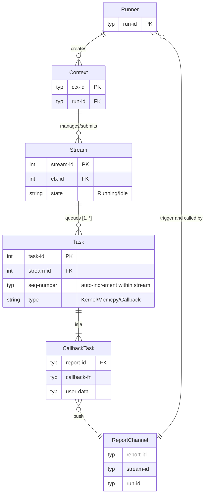
```mermaid
erDiagram
    Runner ||--o{ Context: "creates"
    Runner {
        typ run-id PK
    }

    Context {
        typ ctx-id PK
        typ run-id FK
    }

    Stream {
        int stream-id PK
        int ctx-id FK
        string state "Running/Idle"
    }

    %% Stream contains an ordered list of tasks
    Context ||--o{ Stream : "manages/submits"
    Stream ||--o{ Task : "queues [1..*]"

    Task {
        int task-id PK
        int stream-id FK
        typ seq-number "auto-increment within stream"
        string type "Kernel/Memcpy/Callback"
    }

    %% Various specific Task types (logical inheritance relationship)
    CallbackTask {
        typ report-id FK
        typ callback-fn
        typ user-data
    }  

    %% Logical expression of inheritance (Task is divided into multiple types)
    Task ||--|{ CallbackTask : "is a"

    ReportChannel {
        typ report-id
        typ stream-id
        typ run-id
    }  

    CallbackTask }o ..|| ReportChannel : "push"  
    ReportChannel ||--o{ Runner : "trigger and called by"

```

### 5.1 Key Relationship Descriptions (Callback and Report Relationship Modeling)

When the **device** executes a CallbackTask, it triggers the Host Runner thread to execute the callback.

#### 5.1.1 Corresponding Interface Mapping Table (Callback and Report Relationship Modeling)

| Entity | Key Management Interface |
| ------------- | --------------------------------------------------------------------- |
| CallbackTask | `rtSetExceptionInfoCallback`, `rtLaunchCallback`,`rtSynchronizeEvent` |
| ReportChannel | `rtSubscribeReport`, `rtUnSubscribeReport` |
| Runner | `rtProcessReport` |

## 6. Fine-grained Low-level Extension of the Basic Device Model

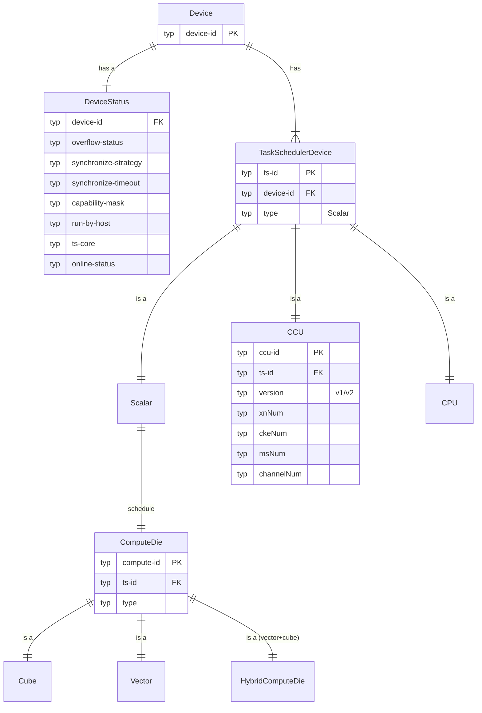
```mermaid
erDiagram

    Device ||--|| DeviceStatus : "has a"
    Device ||--|{ TaskSchedulerDevice : "has "
    Device {
        typ device-id PK
    }
    DeviceStatus {
        typ device-id FK
        typ overflow-status
        typ synchronize-strategy
        typ synchronize-timeout
        typ capability-mask
        typ run-by-host
        typ ts-core
        typ online-status
    }

    TaskSchedulerDevice  ||--|| Scalar :"is a"
    TaskSchedulerDevice  ||--|| CCU :"is a"
    TaskSchedulerDevice  ||--|| CPU :"is a"
    TaskSchedulerDevice {
        typ ts-id PK
        typ device-id FK
        typ type "Scalar"
    }

   CPU {
   }  

   Scalar ||--|| ComputeDie :"schedule"
   Scalar {
   }

   CCU {
        typ ccu-id PK
        typ ts-id FK
        typ version "v1/v2"
        typ xnNum
        typ ckeNum
        typ msNum
        typ channelNum
    }

    ComputeDie  ||--|| Cube :"is a"
    ComputeDie  ||--|| Vector :"is a"
    ComputeDie  ||--|| HybridComputeDie :"is a  (vector+cube)"
    ComputeDie {
        typ compute-id PK
        typ ts-id FK
        typ type
    }  
    Cube {
    }
    Vector {
    }
```

### 6.1 Key Relationship Descriptions (Fine-grained Low-level Extension of the Basic Device Model)

**Device scheduler hierarchy**:

- `TaskSchedulerDevice` is the abstraction of a device scheduler; one Device may contain multiple schedulers.
- Scheduler types include: `Scalar` (scalar processor), `CCU` (collective communication unit), `CPU` (AI CPU)
- Different scheduler types handle different computation task types.

**ComputeDie compute unit**:

- `ComputeDie` is the abstraction of a compute unit; the inheritance relationship indicates the compute unit type.
- `Vector`: Vector compute unit, handles vector operations.
- `Cube`: Cube compute unit, handles matrix operations.
- `HybridComputeDie`: Hybrid compute unit, supports both Vector and Cube.

**CCU internal structure**:

- `xnNum`: Number of XN nodes (cross-node communication)
- `ckeNum`: Number of CKE engines (Checksum engine)
- `msNum`: Number of MS modules (Memory Scheduler)
- `channelNum`: Number of communication channels.
- `version`: CCU version (v1/v2, determines feature differences)

**DeviceStatus state management**:

- `overflow-status`: Overflow state.
- `synchronize-strategy`: Synchronization strategy configuration.
- `synchronize-timeout`: Synchronization timeout setting.
- `capability-mask`: Device capability mask.
- `run-by-host`: Whether running in Host mode.
- `ts-core`: Number of scheduler cores.
- `online-status`: Device online status.

**Scalar scheduling relationship**:

- The `Scalar` scheduler manages the execution of `ComputeDie`.
- Different ComputeDie types handle different computational workloads.

#### 6.1.1 Corresponding Interface Mapping Table (Fine-grained Low-level Extension of the Basic Device Model)

| Entity | Key Management Interface |
| ------------------- | ---------------------------------- |
| TaskSchedulerDevice | `rtGetDeviceInfo`, `rtSetTsDevice` |
| DeviceStatus | `rtGetRunMode` |

## 7. Kernel Runtime Relationship Modeling

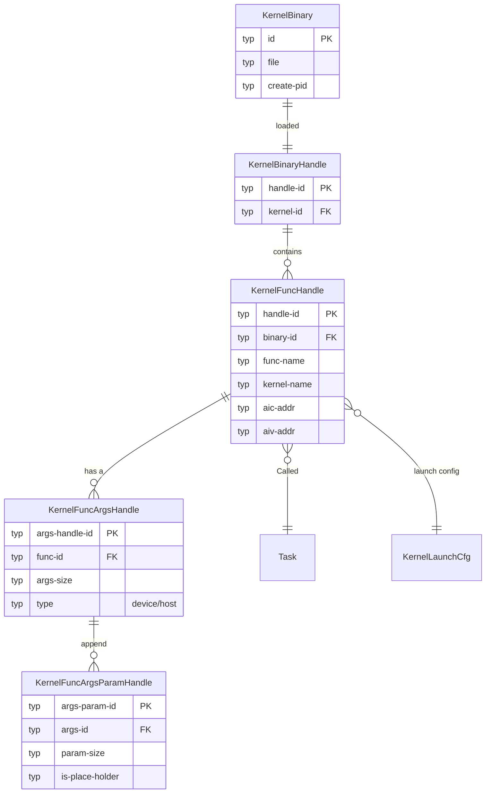
```mermaid
erDiagram
    KernelBinary {
        typ id PK
        typ file
        typ create-pid
    }

    KernelBinary  ||--|| KernelBinaryHandle :"loaded"
    KernelBinaryHandle  ||--o{ KernelFuncHandle :"contains"
    KernelBinaryHandle {
        typ handle-id PK
        typ kernel-id FK
    }

    KernelFuncHandle  ||--o{ KernelFuncArgsHandle :"has a"
    KernelFuncHandle  }o--|| Task :"Called "
    KernelFuncHandle  }o--|| KernelLaunchCfg :"launch config"
    KernelFuncHandle {
        typ handle-id PK
        typ binary-id FK
        typ func-name
        typ kernel-name
        typ aic-addr
        typ aiv-addr
    }

    KernelFuncArgsHandle  ||--o{ KernelFuncArgsParamHandle :"append"
    KernelFuncArgsHandle {
        typ args-handle-id PK
        typ func-id FK
        typ args-size
        typ type "device/host"
    }

    KernelFuncArgsParamHandle {
        typ args-param-id PK
        typ args-id FK
        typ param-size
        typ is-place-holder
    }
```

### 7.1 Key Relationship Descriptions (Kernel Runtime Relationship Modeling)

**KernelBinary loading flow**:

1. `KernelBinary` stores the binary file path (.o/.so, etc.) and the creating process PID.
2. `rtBinaryLoadFromFile` or `rtBinaryLoadFromData` loads the binary into device memory.
3. After loading, a `KernelBinaryHandle` is generated, containing handle-id and kernel-id.
4. `KernelFuncHandle` represents a specific function in the binary, containing func-name, kernel-name, and address info.

**Kernel function call relationship**:

- `aic-addr` is the AI Core function address.
- `aiv-addr` is the AI Vector function address.
- `KernelFuncArgsHandle` stores function parameter information.
- `KernelFuncArgsParamHandle` records parameter size and whether it is a placeholder.
- `KernelLaunchCfg` configures Kernel launch parameters (block/grid, etc.)

**Kernel lifecycle**:

```text
rtCreateBinary -> rtBinaryLoad -> rtBinaryGetFunction 
                -> rtLaunchKernel(funcHandle, argsHandle, cfg)
                -> rtBinaryUnLoad -> rtDestroyBinary
```

**Parameter management mechanism**:

- args-handle supports two types: device and host.
- is-place-holder identifies whether the parameter is a placeholder (late binding)
- param-size records the size of an individual parameter.

#### 7.1.1 Corresponding Interface Mapping Table (Kernel Runtime Relationship Modeling)

| Entity | Key Management Interface |
| ------------------ | --------------------------------------------------------------------------------------------------------------- |
| KernelBinary | `rtCreateBinary`, `rtDestroyBinary` |
| KernelBinaryHandle | `rtBinaryLoad`, `rtBinaryUnLoad`,`rtBinaryLoadFromFile`,`rtBinaryLoadFromData` |
| KernelFuncHandle | `rtBinaryGetFunction`, `rtBinaryGetFunctionByEntry`,`rtGetFunctionAddr`,`rtGetFunctionName`,`rtRegisterCpuFunc` |

## 8. Model Loading Relationship Modeling
